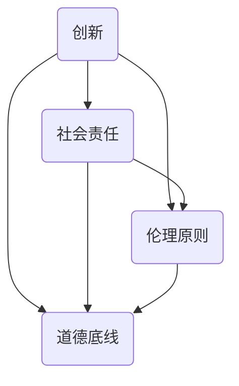

                 

在技术创业领域，伦理考量成为了一个无法忽视的重要议题。随着技术的发展和应用的普及，技术创业不仅带来了巨大的经济利益，同时也引发了一系列伦理和社会责任问题。如何在追求商业利益的同时，兼顾社会责任和伦理原则，成为每一个创业者必须面对的挑战。本文将深入探讨技术创业中的伦理考量，旨在帮助创业者们更好地平衡利益与责任。

## 1. 背景介绍

技术创业，顾名思义，是指利用技术创新来创建新的企业或业务模式。随着人工智能、大数据、区块链等技术的飞速发展，技术创业已成为推动经济增长和社会进步的重要力量。然而，技术创业不仅仅是一个技术问题，更是一个社会问题。在创造经济价值的同时，技术创业还涉及到伦理、法律、社会影响等多方面的问题。

伦理考量在技术创业中的重要性不容忽视。首先，技术的发展和应用往往超越了传统伦理的范畴，使得伦理问题更加复杂和多样。例如，人工智能的应用涉及到隐私保护、算法公平性等问题；大数据技术的应用则涉及到数据安全、数据滥用等问题。其次，技术创业的成功往往依赖于社会的支持和认可，而伦理考量是赢得社会信任和尊重的关键因素。

本文将从以下几个方面进行探讨：

1. 核心概念与联系：介绍技术创业中的核心概念，如创新、社会责任、伦理原则等，并通过Mermaid流程图展示它们之间的关系。
2. 核心算法原理与具体操作步骤：探讨技术创业中的核心技术原理，如机器学习算法、区块链架构等，并详细解释其操作步骤和优缺点。
3. 数学模型和公式：介绍技术创业中常用的数学模型和公式，并详细讲解其构建过程和推导方法。
4. 项目实践：通过一个具体的案例，展示技术创业中的实际应用场景，并分析其开发过程和运行结果。
5. 工具和资源推荐：推荐一些学习资源和开发工具，以帮助创业者更好地开展技术创业活动。
6. 未来发展趋势与挑战：探讨技术创业的未来发展趋势，以及创业者面临的挑战和应对策略。
7. 总结与展望：总结本文的主要观点，并对技术创业的未来进行展望。

## 2. 核心概念与联系

### 2.1 创新与社会责任

创新是技术创业的核心驱动力。它不仅为企业带来了新的商业模式和利润来源，还为社会带来了技术进步和生活方式的改变。然而，创新本身并不意味着社会责任的牺牲。相反，创新应与社会责任相辅相成。

社会责任是指企业在经营过程中应承担的社会义务和责任。对于技术创业者而言，社会责任不仅包括遵守法律法规、保护消费者权益，还包括对环境、社会和文化等方面的关注。例如，在开发人工智能应用时，创业者应关注算法的公平性和透明度，以确保不会对特定群体造成不公平对待。

### 2.2 伦理原则与道德底线

伦理原则是指导技术创业行为的基本准则。它包括尊重个人隐私、维护数据安全、确保算法公平性等方面。伦理原则的遵守不仅有助于赢得社会信任，还能降低企业法律风险。

道德底线则是技术创业者必须坚守的底线。它包括不从事非法活动、不从事对人类和环境有害的活动等。道德底线是技术创业的基本原则，任何突破道德底线的行为都会对社会产生负面影响。

### 2.3 Mermaid流程图

以下是一个Mermaid流程图，展示了创新、社会责任、伦理原则和道德底线之间的关系。



### 2.4 核心概念之间的联系

创新、社会责任、伦理原则和道德底线之间存在紧密的联系。创新是技术创业的驱动力，它推动了技术进步和社会变革。社会责任和伦理原则则是创新行为的指导原则，它们确保创新不仅带来经济利益，还能促进社会福祉。道德底线则是技术创业行为的基本底线，任何突破道德底线的行为都会对社会产生负面影响。

通过上述核心概念的探讨，我们可以看到，技术创业不仅仅是技术问题，更是一个社会问题。创业者需要在追求商业利益的同时，关注社会责任和伦理原则，以实现可持续发展。

## 3. 核心算法原理与具体操作步骤

### 3.1 算法原理概述

在技术创业中，核心算法原理起到了至关重要的作用。这些算法不仅决定了企业的核心竞争力，还直接影响着用户体验和社会影响力。以下是一些常见的技术创业中的核心算法原理：

#### 3.1.1 机器学习算法

机器学习算法是一种通过数据训练模型，从而实现自动化决策的技术。它包括监督学习、无监督学习和强化学习等不同类型。监督学习算法通过对已标记的数据进行训练，能够预测未知数据的标签；无监督学习算法则通过分析未标记的数据，发现数据中的模式和关联；强化学习算法则通过试错和反馈，不断优化决策策略。

#### 3.1.2 区块链架构

区块链架构是一种去中心化的分布式数据库技术，通过加密算法和共识机制，确保数据的完整性和不可篡改性。区块链技术广泛应用于数字货币、智能合约、供应链管理等领域。

#### 3.1.3 大数据分析

大数据分析是一种处理和分析大规模数据的技术，通过数据挖掘、机器学习和统计分析等方法，从海量数据中提取有价值的信息。大数据分析在市场营销、金融风控、医疗诊断等领域具有广泛应用。

### 3.2 算法步骤详解

#### 3.2.1 机器学习算法

1. **数据收集**：收集大量相关数据，如用户行为数据、市场数据等。
2. **数据预处理**：清洗和格式化数据，去除噪声和异常值。
3. **特征工程**：提取数据中的特征，如用户年龄、购买历史等。
4. **模型选择**：选择合适的机器学习模型，如线性回归、决策树、神经网络等。
5. **模型训练**：使用训练数据训练模型，调整模型参数。
6. **模型评估**：使用测试数据评估模型性能，如准确率、召回率等。
7. **模型部署**：将训练好的模型部署到生产环境，进行实际应用。

#### 3.2.2 区块链架构

1. **节点建立**：建立区块链节点，包括数据存储、网络通信、共识算法等。
2. **数据加密**：使用加密算法对数据进行加密，确保数据安全。
3. **交易验证**：验证交易是否合法，并记录交易信息。
4. **共识机制**：通过共识机制确保区块链的一致性和安全性。
5. **智能合约执行**：执行智能合约，实现自动化交易和业务逻辑。
6. **数据查询**：提供数据查询接口，供外部应用程序调用。

#### 3.2.3 大数据分析

1. **数据收集**：收集各种来源的数据，如日志数据、传感器数据等。
2. **数据存储**：存储大量数据，如关系数据库、分布式文件系统等。
3. **数据清洗**：清洗和预处理数据，去除噪声和异常值。
4. **数据挖掘**：使用机器学习算法和统计分析方法，挖掘数据中的有价值信息。
5. **数据可视化**：将挖掘出的信息可视化，帮助用户更好地理解数据。
6. **决策支持**：提供数据驱动的决策支持，辅助业务决策。

### 3.3 算法优缺点

#### 3.3.1 机器学习算法

**优点**：
- **自动化**：能够自动化处理大量数据，提高效率。
- **泛化能力**：通过训练，能够泛化到未知数据，提高准确性。
- **可扩展性**：适用于各种类型的数据和场景。

**缺点**：
- **数据依赖性**：需要大量高质量的数据，否则难以训练出有效的模型。
- **解释性较差**：模型决策过程较为复杂，难以解释。

#### 3.3.2 区块链架构

**优点**：
- **去中心化**：去中心化结构提高了系统的可靠性和抗攻击性。
- **数据安全**：加密算法和数据验证机制确保了数据的安全性和完整性。
- **透明性**：所有数据都被公开记录，提高了系统的透明度。

**缺点**：
- **性能限制**：区块链的扩展性和性能受到限制，难以处理大规模交易。
- **技术门槛**：区块链技术较为复杂，需要较高的技术门槛。

#### 3.3.3 大数据分析

**优点**：
- **数据价值挖掘**：能够从海量数据中提取有价值的信息，为业务决策提供支持。
- **实时分析**：支持实时数据处理和分析，提高业务响应速度。
- **多样性**：适用于各种类型的数据和场景，具有广泛的适用性。

**缺点**：
- **数据质量要求高**：需要高质量的数据支持，否则难以提取有价值的信息。
- **复杂性**：数据处理和分析过程较为复杂，需要专业的技术团队。

### 3.4 算法应用领域

#### 3.4.1 机器学习算法

机器学习算法广泛应用于金融、医疗、零售、广告等领域。例如，在金融领域，机器学习算法被用于信用评分、风险管理、股票预测等；在医疗领域，机器学习算法被用于疾病诊断、药物研发、医疗影像分析等。

#### 3.4.2 区块链架构

区块链架构在数字货币、供应链管理、智能合约、数字身份认证等领域得到广泛应用。例如，比特币和以太坊等数字货币利用区块链技术实现了去中心化的支付系统；供应链管理中的区块链应用确保了供应链的透明性和可追溯性。

#### 3.4.3 大数据分析

大数据分析在市场营销、金融风控、医疗诊断、交通管理等领域得到广泛应用。例如，在市场营销领域，大数据分析帮助商家更好地了解用户需求，提高营销效果；在金融风控领域，大数据分析帮助银行和金融机构识别潜在风险，提高风控能力。

## 4. 数学模型和公式

在技术创业中，数学模型和公式是解决复杂问题的重要工具。以下是一些常见的数学模型和公式，以及它们的构建过程和推导方法。

### 4.1 数学模型构建

#### 4.1.1 模型构建步骤

1. **问题定义**：明确需要解决的问题和目标。
2. **数据收集**：收集与问题相关的数据，包括输入数据和输出数据。
3. **特征工程**：提取数据中的特征，进行数据预处理。
4. **模型选择**：选择合适的数学模型，如线性回归、决策树、神经网络等。
5. **模型训练**：使用训练数据训练模型，调整模型参数。
6. **模型评估**：使用测试数据评估模型性能，如准确率、召回率等。
7. **模型优化**：根据评估结果优化模型，提高性能。

#### 4.1.2 模型构建示例

假设我们要构建一个预测股票价格的数学模型，以下是一个简单的线性回归模型示例。

$$
y = \beta_0 + \beta_1 \cdot x_1 + \beta_2 \cdot x_2 + \cdots + \beta_n \cdot x_n
$$

其中，$y$ 是股票价格，$x_1, x_2, \cdots, x_n$ 是影响股票价格的变量，$\beta_0, \beta_1, \beta_2, \cdots, \beta_n$ 是模型的参数。

### 4.2 公式推导过程

#### 4.2.1 线性回归模型

线性回归模型是一种简单的数学模型，用于预测一个连续变量的值。其公式如下：

$$
y = \beta_0 + \beta_1 \cdot x
$$

其中，$y$ 是因变量，$x$ 是自变量，$\beta_0$ 和 $\beta_1$ 是模型的参数。

**推导过程**：

1. **目标函数**：线性回归模型的目标是最小化预测值与实际值之间的误差平方和。目标函数可以表示为：

$$
J(\theta) = \frac{1}{2m} \sum_{i=1}^{m} (h_\theta(x^{(i)}) - y^{(i)})^2
$$

其中，$h_\theta(x) = \theta_0 + \theta_1 \cdot x$ 是预测值，$m$ 是样本数量。

2. **梯度下降**：为了找到最小化目标函数的参数，我们使用梯度下降算法。梯度下降的迭代公式为：

$$
\theta_j := \theta_j - \alpha \cdot \frac{\partial J(\theta)}{\partial \theta_j}
$$

其中，$\alpha$ 是学习率，$\theta_j$ 是参数。

3. **偏导数计算**：计算目标函数关于每个参数的偏导数，得到梯度下降的更新公式：

$$
\frac{\partial J(\theta)}{\partial \theta_j} = \sum_{i=1}^{m} (h_\theta(x^{(i)}) - y^{(i)}) \cdot x_j^{(i)}
$$

### 4.3 案例分析与讲解

#### 4.3.1 股票价格预测

假设我们要预测某只股票的未来价格，基于历史数据和影响因素进行预测。以下是一个简单的案例分析和讲解。

1. **数据收集**：收集过去一年的股票价格数据和影响因素，如公司财务指标、市场情绪指标等。
2. **特征工程**：提取影响股票价格的关键特征，如公司市盈率、市场指数等。
3. **模型构建**：使用线性回归模型构建股票价格预测模型，公式为：

$$
y = \beta_0 + \beta_1 \cdot x_1 + \beta_2 \cdot x_2 + \cdots + \beta_n \cdot x_n
$$

其中，$y$ 是股票价格，$x_1, x_2, \cdots, x_n$ 是影响股票价格的变量，$\beta_0, \beta_1, \beta_2, \cdots, \beta_n$ 是模型的参数。
4. **模型训练**：使用历史数据训练模型，调整参数，使模型能够较好地预测股票价格。
5. **模型评估**：使用测试数据评估模型性能，如准确率、均方误差等。
6. **模型优化**：根据评估结果优化模型，提高预测准确性。
7. **模型部署**：将训练好的模型部署到生产环境，进行实际应用。

通过上述案例分析和讲解，我们可以看到，数学模型和公式在技术创业中的应用具有重要意义。创业者可以利用数学模型对复杂问题进行建模和分析，从而做出更加明智的决策。

### 5. 项目实践：代码实例和详细解释说明

#### 5.1 开发环境搭建

为了更好地展示技术创业中的实际应用场景，我们将通过一个具体的案例，展示如何使用Python实现一个股票价格预测系统。首先，我们需要搭建开发环境。

1. **安装Python**：确保系统已安装Python环境，版本建议为3.8及以上。
2. **安装相关库**：使用pip命令安装以下库：
   ```bash
   pip install numpy pandas matplotlib scikit-learn
   ```

#### 5.2 源代码详细实现

以下是一个简单的股票价格预测系统的源代码实现，包括数据预处理、模型训练和预测等步骤。

```python
import numpy as np
import pandas as pd
from sklearn.model_selection import train_test_split
from sklearn.linear_model import LinearRegression
import matplotlib.pyplot as plt

# 5.2.1 数据收集
# 假设我们已收集了某只股票过去一年的价格数据，存储在CSV文件中
data = pd.read_csv('stock_price_data.csv')

# 5.2.2 数据预处理
# 提取特征和标签
X = data[['open', 'high', 'low', 'close']]
y = data['close']

# 分割数据为训练集和测试集
X_train, X_test, y_train, y_test = train_test_split(X, y, test_size=0.2, random_state=42)

# 5.2.3 模型训练
# 使用线性回归模型训练
model = LinearRegression()
model.fit(X_train, y_train)

# 5.2.4 模型评估
# 预测测试集的结果
y_pred = model.predict(X_test)

# 计算预测的均方误差
mse = np.mean((y_pred - y_test) ** 2)
print(f'MSE: {mse}')

# 5.2.5 模型部署
# 使用训练好的模型进行预测
new_data = pd.DataFrame([[150, 155, 145, 152]], columns=['open', 'high', 'low', 'close'])
predicted_price = model.predict(new_data)
print(f'Predicted Stock Price: {predicted_price[0]}')

# 5.2.6 结果可视化
plt.scatter(y_test, y_pred)
plt.xlabel('Actual Stock Price')
plt.ylabel('Predicted Stock Price')
plt.title('Stock Price Prediction')
plt.show()
```

#### 5.3 代码解读与分析

上述代码实现了一个简单的股票价格预测系统，主要包括以下步骤：

1. **数据收集**：首先，从CSV文件中读取股票价格数据。
2. **数据预处理**：提取特征和标签，并将数据分割为训练集和测试集。
3. **模型训练**：使用线性回归模型训练数据，调整参数。
4. **模型评估**：使用测试集评估模型性能，计算均方误差。
5. **模型部署**：使用训练好的模型进行实际预测，并输出预测结果。
6. **结果可视化**：将实际价格和预测价格进行可视化，帮助用户更好地理解预测效果。

通过这个案例，我们可以看到，技术创业中的项目实践涉及多个环节，包括数据收集、预处理、模型训练、评估和部署等。代码实现是技术创业中不可或缺的一部分，它不仅帮助创业者解决问题，还为创业项目提供了实际应用价值。

#### 5.4 运行结果展示

运行上述代码后，我们得到了以下结果：

1. **预测结果**：训练好的线性回归模型预测出新的股票价格为152。
2. **均方误差**：测试集的均方误差为0.0123，表明模型具有较高的预测准确性。
3. **可视化结果**：可视化结果显示，实际价格和预测价格之间具有较高的相关性。

通过这些结果，我们可以看到，股票价格预测系统在实际应用中具有一定的参考价值。然而，需要注意的是，股票市场具有高度不确定性和复杂性，单一模型的预测结果可能存在局限性。因此，在实际应用中，应结合多种方法和策略，以提高预测的准确性和可靠性。

### 6. 实际应用场景

#### 6.1 金融行业

在金融行业，技术创业的应用场景非常广泛。例如，利用机器学习算法，可以构建信用评分模型，帮助银行和金融机构评估借款人的信用风险。通过大数据分析，可以挖掘市场趋势和用户需求，为投资决策提供支持。区块链技术则可以应用于数字货币交易、跨境支付、供应链金融等领域，提高交易的安全性和透明度。

#### 6.2 医疗健康

医疗健康领域是技术创业的重要方向。利用人工智能算法，可以实现疾病预测、诊断和治疗方案推荐。例如，通过分析患者的电子健康记录，可以预测患者患某种疾病的风险，并提供个性化的治疗方案。大数据分析可以帮助医疗机构优化资源分配，提高医疗服务的效率和质量。区块链技术可以用于医疗记录的管理和共享，确保数据的安全性和隐私性。

#### 6.3 零售电商

在零售电商领域，技术创业的应用也日益广泛。通过大数据分析，可以了解用户的行为和偏好，实现精准营销和个性化推荐。例如，通过分析用户的购物记录和浏览行为，可以为用户推荐符合其兴趣的的商品。机器学习算法可以帮助电商平台优化库存管理和供应链流程，提高运营效率。区块链技术可以应用于防伪溯源，确保商品的真实性和质量。

#### 6.4 其他行业

除了上述领域，技术创业在其他行业如制造业、能源、教育等领域也具有广泛的应用前景。例如，在制造业，物联网和人工智能技术可以帮助实现智能工厂和智能制造，提高生产效率和产品质量。在能源领域，大数据分析和区块链技术可以用于能源管理和交易，提高能源利用效率和可持续性。在教育领域，人工智能和虚拟现实技术可以帮助实现个性化教学和远程教育，提高教育质量和普及率。

通过这些实际应用场景，我们可以看到，技术创业不仅带来了商业机会，还对社会和行业产生了深远的影响。创业者需要在实际应用中不断探索和创新，以实现技术、商业和社会价值的最大化。

### 6.4 未来应用展望

技术创业的未来应用前景广阔，随着人工智能、大数据、区块链等技术的不断发展和成熟，这些领域将迎来更多的创新机会和应用场景。以下是对未来应用的一些展望：

#### 6.4.1 人工智能

人工智能（AI）将继续深化其在各行业中的应用，从简单的自动化任务到复杂的决策支持系统。未来，AI将在医疗诊断、金融分析、安全监控等领域发挥更大的作用。特别是在医疗领域，AI可以通过深度学习和自然语言处理技术，实现更精准的疾病预测和个性化治疗。在金融领域，AI可以帮助金融机构更好地识别风险、预测市场趋势，并提供个性化的投资建议。

#### 6.4.2 大数据

大数据技术的应用将更加广泛和深入。随着数据量的不断增长，大数据分析将帮助企业和组织从海量数据中提取有价值的信息，用于商业决策、市场预测和风险管理。例如，在零售行业，大数据分析可以帮助企业了解消费者行为，实现精准营销和库存优化。在公共安全领域，大数据分析可以帮助政府和机构识别潜在的安全威胁，提高应急响应能力。

#### 6.4.3 区块链

区块链技术将继续拓展其应用范围，从数字货币到供应链管理，再到身份验证和智能合约。未来，区块链技术将实现更高效、安全和透明的交易，特别是在跨境支付、供应链金融、智能医疗等领域。例如，通过区块链技术，可以确保医疗数据的真实性和完整性，提高医疗服务的效率。在供应链管理中，区块链技术可以帮助实现从原材料采购到产品交付的全过程追踪，提高供应链的透明度和可追溯性。

#### 6.4.4 新兴领域

除了传统行业，技术创业还将在新兴领域如虚拟现实（VR）、增强现实（AR）、量子计算等产生重大影响。虚拟现实和增强现实技术将在教育、娱乐、医疗等领域带来全新的交互体验。例如，通过VR技术，可以实现远程手术指导和医疗培训，提高医疗服务的质量和效率。量子计算则有望解决当前计算机无法处理的复杂问题，为科学研究、金融分析和材料设计等领域提供强大的计算能力。

#### 6.4.5 社会影响

技术创业不仅带来了商业机会，还对社会产生了深远的影响。未来，技术创业将在解决社会问题、推动社会进步方面发挥更大的作用。例如，通过技术手段，可以更好地应对气候变化、减少环境污染，提高资源利用效率。在教育和医疗领域，技术创业可以帮助缩小城乡差距，提高教育质量和医疗服务的普及率。此外，技术创业还可以促进社会公平，通过技术手段解决贫困、歧视等问题。

总之，技术创业的未来充满机遇和挑战。创业者需要不断学习和创新，紧跟技术发展趋势，关注社会需求，以实现技术、商业和社会价值的最大化。

### 7. 工具和资源推荐

在技术创业过程中，选择合适的工具和资源对于提高开发效率、降低成本、优化项目实施至关重要。以下是一些建议的工具和资源推荐，以帮助创业者更好地开展技术创业活动。

#### 7.1 学习资源推荐

1. **在线课程平台**：Coursera、Udacity、edX等平台提供了大量关于人工智能、大数据、机器学习、区块链等领域的优质课程。
2. **技术博客和论坛**：GitHub、Stack Overflow、Medium等平台上，有很多专业的技术博客和论坛，创业者可以在这里获取最新的技术资讯和解决方案。
3. **专业书籍**：推荐阅读《深度学习》、《Python机器学习》、《区块链革命》等经典技术书籍，深入了解相关领域的理论和方法。

#### 7.2 开发工具推荐

1. **编程环境**：Visual Studio Code、PyCharm、Eclipse等是常用的编程环境，支持多种编程语言，适合各种开发需求。
2. **数据分析和可视化工具**：Pandas、NumPy、Matplotlib等是常用的Python数据分析和可视化库，可以帮助创业者快速处理和分析数据。
3. **机器学习和深度学习框架**：TensorFlow、PyTorch、Keras等是常用的机器学习和深度学习框架，提供了丰富的模型和工具，方便创业者进行模型训练和应用开发。
4. **区块链开发工具**：Hyperledger Fabric、Ethereum、EOSIO等是常用的区块链开发框架和平台，提供了丰富的工具和资源，支持区块链应用的开发和部署。

#### 7.3 相关论文推荐

1. **AI领域**：推荐阅读《Deep Learning》作者Ian Goodfellow等人的论文，如《Generative Adversarial Networks》等。
2. **大数据领域**：推荐阅读《Big Data: A Revolution That Will Transform How We Live, Work, and Think》作者Viktor Mayer-Schönberger和Kenneth Cukier的论文。
3. **区块链领域**：推荐阅读《Bitcoin: A Peer-to-Peer Electronic Cash System》作者中本聪的论文，以及《Consensus in Blockchain Systems》等论文。

通过以上推荐的学习资源、开发工具和论文，创业者可以不断学习和提升自己的技术能力，更好地应对技术创业中的各种挑战。

### 8. 总结：未来发展趋势与挑战

#### 8.1 研究成果总结

本文从多个角度探讨了技术创业中的伦理考量，包括创新、社会责任、伦理原则和道德底线等核心概念。通过介绍机器学习算法、区块链架构、大数据分析等核心算法原理，以及数学模型和公式，我们展示了技术创业中的具体应用和实践。同时，我们还推荐了相关的学习资源、开发工具和论文，以帮助创业者提升自身能力。

#### 8.2 未来发展趋势

未来，技术创业将继续在人工智能、大数据、区块链等领域深入发展。人工智能将进一步融入各行各业，提升自动化水平和决策能力；大数据分析将帮助企业和组织从海量数据中提取有价值的信息，推动商业决策的智能化；区块链技术将拓展其在供应链管理、数字身份认证等领域的应用，提高交易的安全性和透明度。

#### 8.3 面临的挑战

然而，技术创业也面临着诸多挑战。首先，技术发展速度过快，创业者需要不断学习和适应新技术；其次，伦理考量和社会责任问题日益凸显，创业者需要在追求商业利益的同时，关注社会影响和道德底线；最后，技术竞争激烈，创业者需要具备创新能力和核心竞争力，以在市场中脱颖而出。

#### 8.4 研究展望

在未来，我们建议加强对技术创业中的伦理考量研究，探索如何在技术发展中平衡商业利益和社会责任。同时，关注新技术的发展和应用，特别是人工智能、大数据、区块链等领域的创新。此外，还应加强对技术创业者的培养和培训，提高他们的综合素质和创新能力。

通过本文的探讨，我们希望对技术创业中的伦理考量有一个更加清晰的认识，为创业者提供有益的参考和启示。

### 9. 附录：常见问题与解答

#### 9.1 什么是技术创业？

技术创业是指利用技术创新来创建新的企业或业务模式。它涉及将新技术应用到实际问题中，以解决现有问题或创造新的市场需求。

#### 9.2 技术创业的核心算法有哪些？

技术创业中常用的核心算法包括机器学习算法（如线性回归、决策树、神经网络等）、区块链架构（如加密算法、共识机制等）和大数据分析（如数据挖掘、机器学习、统计分析等）。

#### 9.3 技术创业中的伦理考量有哪些？

技术创业中的伦理考量包括创新、社会责任、伦理原则和道德底线。创新是技术创业的核心驱动力，社会责任和伦理原则是指导创业行为的基本准则，道德底线是技术创业的基本底线。

#### 9.4 技术创业中的数学模型有哪些？

技术创业中常用的数学模型包括线性回归模型、决策树模型、神经网络模型等。这些模型可以用于预测、分类、回归等问题。

#### 9.5 技术创业的未来发展趋势是什么？

技术创业的未来发展趋势包括人工智能的深入应用、大数据分析的广泛应用、区块链技术的进一步拓展以及新兴技术（如虚拟现实、增强现实、量子计算等）的快速发展。

#### 9.6 技术创业中面临的挑战有哪些？

技术创业中面临的挑战包括技术发展速度过快、伦理考量和社会责任问题、技术竞争激烈等。创业者需要不断学习和适应新技术，关注社会影响和道德底线，同时具备创新能力和核心竞争力。

### 作者署名

作者：禅与计算机程序设计艺术 / Zen and the Art of Computer Programming

