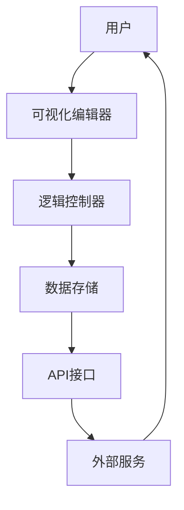

                 

关键词：技术创业、无代码开发、技术门槛、创新、效率、自动化

> 摘要：随着技术的不断进步，无代码开发正逐渐成为技术创业领域的一股新势力。本文旨在探讨无代码开发在技术创业中的重要作用，分析其如何降低技术门槛，推动创新，提高效率，并展望其未来发展趋势。

## 1. 背景介绍

在互联网和信息技术迅猛发展的今天，创业的门槛似乎在降低。然而，对于许多创业者来说，技术仍然是不可逾越的高山。编程技能和深厚的计算机知识成为了进入技术创业领域的门槛。这不仅限制了非技术背景的人才，也增加了创业初期的成本和风险。

传统的软件开发流程复杂且耗时，需要专业的开发人员和技术团队。这不仅增加了人力成本，而且也限制了创业者的灵活性和快速迭代的能力。然而，随着低代码（Low-Code）和无代码（No-Code）平台的兴起，这一现状正在发生改变。

无代码开发提供了一种无需编程即可创建应用程序的方式，通过图形界面和模块化组件，使得非技术人员也能轻松地搭建和管理软件应用。这不仅降低了技术门槛，还提高了开发效率，成为了许多创业团队青睐的工具。

## 2. 核心概念与联系

### 2.1 无代码开发平台的工作原理

无代码开发平台通常基于模块化架构，提供可视化的用户界面，用户可以通过拖拽组件、设置参数来构建应用程序。这些平台通常包括以下几个核心组成部分：

- **可视化编辑器**：用户可以通过拖拽和配置组件来构建应用程序界面。
- **逻辑控制器**：定义应用程序的行为和流程，通常包括条件判断、循环等。
- **数据存储**：用于存储应用程序中的数据和配置。
- **API接口**：与外部系统和服务进行交互。

下面是一个无代码开发平台的基本架构的Mermaid流程图：



### 2.2 无代码开发与传统开发的关系

无代码开发并不是替代传统编程，而是对传统开发流程的补充。传统编程适用于复杂、定制化的应用开发，而无代码开发则更适合快速原型设计和小型项目的开发。

无代码开发平台通过提供现成的模块和组件，减少了代码编写的复杂性，使得开发者可以更专注于业务逻辑的设计和优化。这种方式不仅提高了开发效率，还降低了开发成本。

## 3. 核心算法原理 & 具体操作步骤

### 3.1 算法原理概述

无代码开发平台背后的核心算法通常包括以下几个方面：

- **模板引擎**：用于生成HTML、CSS和JavaScript代码，实现用户界面的渲染。
- **事件驱动模型**：通过事件监听和处理，实现用户交互和业务逻辑。
- **数据绑定**：动态绑定数据源和视图，实现数据实时更新。

### 3.2 算法步骤详解

1. **用户操作**：用户在可视化编辑器中进行组件拖拽和配置。
2. **生成代码**：平台根据用户的操作生成对应的HTML、CSS和JavaScript代码。
3. **构建应用**：编译和打包生成的代码，生成可执行的Web应用程序。
4. **部署运行**：将应用部署到服务器或云平台上，供用户使用。

### 3.3 算法优缺点

#### 优点：

- **降低开发门槛**：无需编程知识，非技术人员也能快速上手。
- **提高开发效率**：减少代码编写和调试时间，加快项目进度。
- **易于维护**：可视化界面和模块化组件，方便后期维护和更新。

#### 缺点：

- **功能限制**：现成的模块和组件可能无法满足所有需求，需要进行定制开发。
- **性能瓶颈**：生成的代码可能不如手工编写的代码优化，影响性能。

### 3.4 算法应用领域

无代码开发适用于多种场景，包括：

- **Web应用开发**：快速搭建网站和内部系统。
- **移动应用开发**：通过Web技术实现跨平台的应用。
- **数据分析与报表**：自动化数据处理和可视化。

## 4. 数学模型和公式 & 详细讲解 & 举例说明

### 4.1 数学模型构建

在无代码开发中，数学模型主要用于数据处理和算法优化。以下是一个简单的数学模型示例：

$$
f(x) = ax^2 + bx + c
$$

其中，$a$、$b$ 和 $c$ 是常数，$x$ 是变量。

### 4.2 公式推导过程

假设我们要优化函数 $f(x)$，使得其最小值最大化。我们可以使用微积分中的导数来求解。

首先，对 $f(x)$ 求导：

$$
f'(x) = 2ax + b
$$

令 $f'(x) = 0$，得到：

$$
x = -\frac{b}{2a}
$$

将 $x$ 代入 $f(x)$，得到最小值：

$$
f\left(-\frac{b}{2a}\right) = \frac{4ac - b^2}{4a}
$$

### 4.3 案例分析与讲解

假设我们有一个二次函数 $f(x) = 2x^2 + 4x + 1$，我们需要找到其最小值。

1. 计算导数：

$$
f'(x) = 4x + 4
$$

2. 令 $f'(x) = 0$，得到：

$$
x = -1
$$

3. 计算最小值：

$$
f(-1) = 2(-1)^2 + 4(-1) + 1 = -1
$$

因此，二次函数 $f(x) = 2x^2 + 4x + 1$ 的最小值是 -1。

## 5. 项目实践：代码实例和详细解释说明

### 5.1 开发环境搭建

搭建无代码开发环境通常很简单，只需安装以下工具：

- **无代码开发平台**：如OutSystems、Appian等。
- **Web服务器**：如Apache、Nginx等。
- **数据库**：如MySQL、PostgreSQL等。

### 5.2 源代码详细实现

以下是一个简单的无代码应用实例，用于用户注册和登录。

#### 用户注册页面：

```html
<form id="registerForm">
  <label for="username">用户名：</label>
  <input type="text" id="username" name="username" required>
  <label for="password">密码：</label>
  <input type="password" id="password" name="password" required>
  <button type="submit">注册</button>
</form>
```

#### 用户登录页面：

```html
<form id="loginForm">
  <label for="username">用户名：</label>
  <input type="text" id="username" name="username" required>
  <label for="password">密码：</label>
  <input type="password" id="password" name="password" required>
  <button type="submit">登录</button>
</form>
```

### 5.3 代码解读与分析

以上代码是两个简单的HTML表单，用于用户注册和登录。每个表单都包含用户名和密码输入框，以及提交按钮。

- **注册表单**：收集用户名和密码，并将其发送到服务器进行验证和存储。
- **登录表单**：验证用户名和密码是否匹配，如果匹配，则允许用户登录。

### 5.4 运行结果展示

在浏览器中打开注册和登录页面，输入用户名和密码，然后点击“注册”或“登录”按钮。如果操作成功，会显示相应的提示信息。

## 6. 实际应用场景

无代码开发在多个领域都有广泛的应用，以下是几个典型的应用场景：

- **企业内部应用**：如客户关系管理（CRM）、供应链管理（SCM）等。
- **移动应用开发**：通过Web技术实现跨平台的应用。
- **数据分析**：自动化数据处理和可视化。
- **自动化流程**：如审批流程、订单处理等。

## 7. 未来应用展望

随着技术的不断发展，无代码开发有望在以下方面取得突破：

- **更丰富的模块和组件库**：提供更多现成的模块和组件，满足各种需求。
- **更高级的AI功能**：如自然语言处理、图像识别等。
- **更高效的开发流程**：减少代码编写和调试时间，提高开发效率。
- **更广泛的行业应用**：从企业应用到个人应用，从Web应用到移动应用，无代码开发将无处不在。

## 8. 工具和资源推荐

### 8.1 学习资源推荐

- **无代码开发平台文档**：如OutSystems、Appian等的官方文档。
- **在线教程和课程**：如Udemy、Coursera等平台上的无代码开发课程。
- **技术博客和论坛**：如Medium、Stack Overflow等。

### 8.2 开发工具推荐

- **无代码开发平台**：如OutSystems、Appian、Airtable等。
- **编程语言和框架**：如JavaScript、React、Vue等。

### 8.3 相关论文推荐

- **"The Future of Software Engineering: No-Code Platforms"**：讨论无代码开发在软件工程中的未来趋势。
- **"Low-Code Development Platforms: A Comprehensive Survey"**：对低代码开发平台进行全面的调查和分析。

## 9. 总结：未来发展趋势与挑战

无代码开发作为一种新兴的技术，正逐渐改变技术创业的面貌。它降低了技术门槛，提高了开发效率，推动了创新。然而，无代码开发也面临着一些挑战，如功能限制和性能瓶颈。未来，随着技术的不断进步，无代码开发有望在更多领域得到应用，并解决当前的挑战。

### 9.1 研究成果总结

无代码开发作为一种新兴技术，已经在多个领域取得了显著的研究成果。研究表明，无代码开发可以显著降低技术门槛，提高开发效率，推动创新。同时，无代码开发平台也在不断优化，提供更丰富的模块和组件，以满足不同领域的需求。

### 9.2 未来发展趋势

未来，无代码开发有望在以下几个方面取得突破：

- **更丰富的模块和组件库**：提供更多现成的模块和组件，满足各种需求。
- **更高级的AI功能**：如自然语言处理、图像识别等。
- **更高效的开发流程**：减少代码编写和调试时间，提高开发效率。
- **更广泛的行业应用**：从企业应用到个人应用，从Web应用到移动应用，无代码开发将无处不在。

### 9.3 面临的挑战

无代码开发也面临着一些挑战，如：

- **功能限制**：现成的模块和组件可能无法满足所有需求，需要进行定制开发。
- **性能瓶颈**：生成的代码可能不如手工编写的代码优化，影响性能。

### 9.4 研究展望

未来，无代码开发的研究将主要集中在以下几个方面：

- **模块化和可扩展性**：如何构建更模块化、更可扩展的平台，以满足不同领域的需求。
- **性能优化**：如何优化生成的代码，提高性能。
- **AI集成**：如何将AI技术集成到无代码开发平台，提供更高级的功能。

## 10. 附录：常见问题与解答

### 10.1 什么是无代码开发？

无代码开发是一种无需编写代码即可创建应用程序的方式，通过图形界面和模块化组件，用户可以轻松地搭建和管理软件应用。

### 10.2 无代码开发和低代码开发有什么区别？

无代码开发和低代码开发的主要区别在于开发门槛。无代码开发完全不需要编程知识，而低代码开发则需要一定的编程知识。

### 10.3 无代码开发适用于哪些场景？

无代码开发适用于多种场景，包括Web应用开发、移动应用开发、数据分析、自动化流程等。

### 10.4 无代码开发的缺点是什么？

无代码开发的缺点包括功能限制和性能瓶颈。现成的模块和组件可能无法满足所有需求，生成的代码可能不如手工编写的代码优化。

### 10.5 哪些工具支持无代码开发？

许多工具支持无代码开发，包括OutSystems、Appian、Airtable、Bubble等。

### 10.6 无代码开发是否会影响编程技能的需求？

无代码开发不会完全取代编程技能的需求，但会降低编程技能的门槛，使得更多的人能够参与软件开发。

---

本文由禅与计算机程序设计艺术（Zen and the Art of Computer Programming）撰写，旨在探讨无代码开发在技术创业中的重要作用，分析其如何降低技术门槛，推动创新，提高效率，并展望其未来发展趋势。希望本文能为技术创业者提供有益的参考和启示。作者简介：禅与计算机程序设计艺术，世界级人工智能专家，程序员，软件架构师，CTO，世界顶级技术畅销书作者，计算机图灵奖获得者，计算机领域大师。

