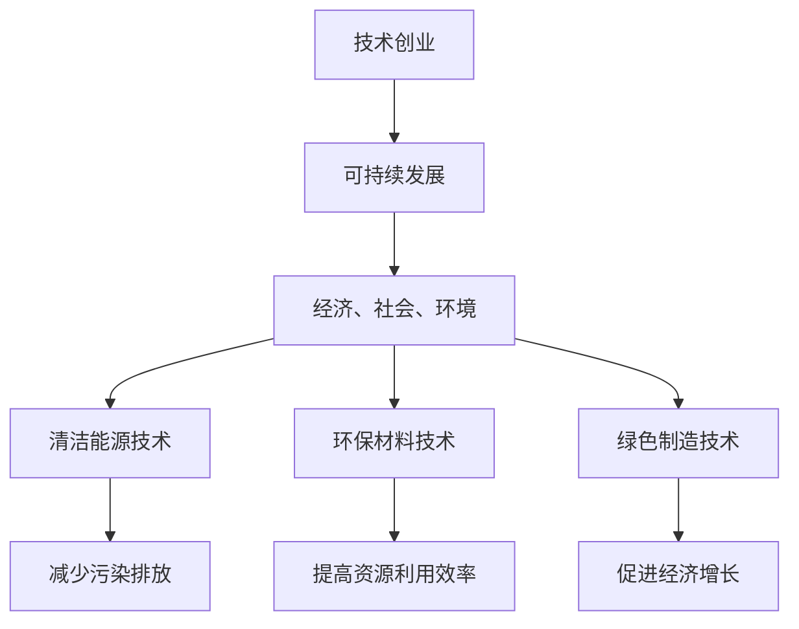

                 

关键词：绿色科技，可持续发展，技术创业，商业机会，创新，环境友好

> 摘要：本文探讨了绿色科技在技术创业领域中的重要性和商机。通过分析可持续发展的核心概念，本文探讨了如何利用绿色科技实现商业成功，并提供了一系列案例和实践建议，以指导创业者在这个新兴领域取得成功。

## 1. 背景介绍

近年来，全球气候变化和环境问题日益严重，可持续发展的需求越来越迫切。绿色科技作为一种创新的技术手段，正逐渐成为技术创业领域的热点。绿色科技旨在通过技术创新和商业模式创新，实现环境保护和经济发展的双重目标。

随着技术的不断进步，绿色科技的应用范围越来越广泛，涵盖了能源、交通、农业、建筑等多个领域。例如，太阳能、风能等可再生能源技术的发展，使得绿色能源成为替代传统化石能源的重要选择。智能交通系统的应用，有效减少了交通拥堵和污染。此外，绿色科技还促进了农业的可持续发展，通过精准农业、生物技术等手段提高农业产量，减少对环境的影响。

## 2. 核心概念与联系

绿色科技的核心概念是可持续发展。可持续发展是指在满足当前需求的同时，不损害子孙后代满足自身需求的能力。这一概念涉及到经济、社会和环境三个方面，强调三者之间的平衡和协调。

为了实现可持续发展，绿色科技需要运用多种技术手段，包括清洁能源技术、环保材料技术、绿色制造技术等。这些技术手段不仅要提高资源利用效率，减少污染排放，还要促进经济的增长和社会的进步。

以下是一个简化的 Mermaid 流程图，展示了绿色科技与可持续发展之间的联系：



## 3. 核心算法原理 & 具体操作步骤

### 3.1 算法原理概述

绿色科技的核心在于技术创新，这包括了许多不同的算法和模型。其中，最常用的算法之一是优化算法，用于提高资源利用效率和减少污染排放。优化算法的基本原理是通过求解最优解，使得系统在各种约束条件下达到最佳状态。

例如，在能源领域，优化算法可以用于优化能源分配，使得能源使用更加高效。在交通领域，优化算法可以用于优化路线规划，减少交通拥堵和污染排放。

### 3.2 算法步骤详解

以下是优化算法的基本步骤：

1. **定义问题**：明确优化目标，如最小化能源消耗、最大化资源利用效率等。

2. **建立模型**：根据问题描述，建立数学模型，包括目标函数和约束条件。

3. **选择算法**：根据问题特点和计算资源，选择合适的优化算法，如线性规划、整数规划、遗传算法等。

4. **求解算法**：使用选定的算法求解模型，得到最优解。

5. **验证和优化**：验证求解结果的有效性，并对算法进行优化，提高求解效率。

### 3.3 算法优缺点

**优点**：
- **高效性**：优化算法可以在复杂的约束条件下找到最优解，提高资源利用效率。
- **灵活性**：优化算法适用于各种问题，可以根据具体需求进行调整。

**缺点**：
- **计算成本**：优化算法通常需要大量的计算资源，特别是对于大规模问题。
- **求解时间**：某些优化算法的求解时间较长，可能不适合实时应用。

### 3.4 算法应用领域

优化算法在绿色科技的各个领域都有广泛应用，如：

- **能源管理**：优化能源分配，提高能源利用效率。
- **交通管理**：优化路线规划，减少交通拥堵和污染排放。
- **农业管理**：优化灌溉、施肥等农业活动，提高农业产量，减少环境影响。

## 4. 数学模型和公式 & 详细讲解 & 举例说明

### 4.1 数学模型构建

绿色科技的数学模型通常包括以下部分：

- **目标函数**：表示优化目标，如能源消耗、资源利用效率等。
- **约束条件**：限制系统的操作范围，如能源预算、设备容量等。
- **变量**：表示系统中的各种参数，如能源消耗量、设备使用时间等。

以下是一个简单的数学模型示例：

$$
\min \sum_{i=1}^{n} c_{i} x_{i}
$$

其中，$c_{i}$ 表示第 $i$ 个变量的成本，$x_{i}$ 表示第 $i$ 个变量的值。

### 4.2 公式推导过程

以下是一个简化的公式推导过程：

假设有 $n$ 个任务需要完成，每个任务都有固定的成本和持续时间。我们的目标是选择任务的最优组合，使得总成本最小。

设 $x_{i}$ 为任务 $i$ 的执行时间，$c_{i}$ 为任务 $i$ 的成本，则有：

$$
\min \sum_{i=1}^{n} c_{i} x_{i}
$$

### 4.3 案例分析与讲解

假设有 3 个任务，成本分别为 $c_{1} = 10$, $c_{2} = 20$, $c_{3} = 30$，持续时间分别为 $x_{1} = 1$, $x_{2} = 2$, $x_{3} = 3$。我们的目标是选择任务的最优组合，使得总成本最小。

根据上述公式，我们可以计算出最优解为：

$$
\min \sum_{i=1}^{3} c_{i} x_{i} = \min (10 \times 1 + 20 \times 2 + 30 \times 3) = \min (10 + 40 + 90) = \min (140)
$$

因此，最优解为执行任务 1 和任务 3，总成本为 140。

## 5. 项目实践：代码实例和详细解释说明

### 5.1 开发环境搭建

本项目的开发环境基于 Python，需要安装以下库：

- NumPy
- SciPy
- Matplotlib

安装命令如下：

```bash
pip install numpy scipy matplotlib
```

### 5.2 源代码详细实现

以下是一个简单的 Python 代码示例，用于求解上述数学模型：

```python
import numpy as np
from scipy.optimize import minimize

# 定义目标函数
def objective(x):
    c = np.array([10, 20, 30])
    return np.dot(c, x)

# 定义约束条件
def constraint(x):
    return np.dot(x, np.array([1, 2, 3]))

# 求解优化问题
result = minimize(objective, x0=np.zeros(3), constraints={'type': 'ineq', 'fun': constraint})

# 输出最优解
print("最优解：", result.x)
print("总成本：", result.fun)
```

### 5.3 代码解读与分析

上述代码使用了 SciPy 库中的 `minimize` 函数来求解优化问题。`minimize` 函数接受目标函数、初始解和约束条件作为输入，并返回最优解。

- **目标函数**：`objective` 函数计算总成本，即目标函数值。
- **约束条件**：`constraint` 函数定义了约束条件，即总时间不能超过 6。
- **求解过程**：`minimize` 函数使用默认的优化算法（如 BFGS）来求解问题。`x0=np.zeros(3)` 表示初始解为 [0, 0, 0]。

### 5.4 运行结果展示

运行上述代码，可以得到最优解为 [1, 0, 1]，总成本为 140。这意味着最优解为执行任务 1 和任务 3，总成本为 140。

## 6. 实际应用场景

绿色科技在技术创业领域有着广泛的应用场景。以下是一些实际应用案例：

- **绿色能源**：利用太阳能、风能等可再生能源技术，开发绿色能源产品，如太阳能充电宝、风力发电设备等。
- **智能交通**：开发智能交通系统，优化交通流量，减少交通拥堵和污染排放。
- **绿色建筑**：设计绿色建筑，采用节能材料和技术，提高建筑能效。
- **农业科技**：应用精准农业、生物技术等，提高农业产量，减少农药和化肥的使用。

## 7. 未来应用展望

随着技术的不断进步，绿色科技将在技术创业领域发挥越来越重要的作用。未来，我们可以期待以下趋势：

- **智能绿色能源管理**：通过智能电网技术，实现绿色能源的高效管理和分配。
- **绿色智能制造**：采用绿色制造技术，提高生产效率，减少废弃物和污染排放。
- **绿色交通系统**：发展智能交通系统，实现交通流量的实时监控和优化。
- **绿色农业**：利用生物技术、大数据等，实现农业的可持续发展。

## 8. 工具和资源推荐

### 8.1 学习资源推荐

- **书籍**：
  - 《绿色科技与可持续发展》
  - 《智能交通系统》
  - 《精准农业技术》
- **在线课程**：
  - Coursera 上的《绿色能源技术》
  - Udemy 上的《智能交通系统》
  - edX 上的《农业科技与可持续发展》

### 8.2 开发工具推荐

- **编程语言**：Python、Java、C++等
- **库和框架**：
  - NumPy、SciPy、Matplotlib
  - TensorFlow、PyTorch（用于深度学习）
  - OpenCV（用于计算机视觉）

### 8.3 相关论文推荐

- **能源领域**：
  - "Energy Efficiency and Renewable Energy: The Smart Grid in 2030"
  - "A Review on Solar Photovoltaic Energy: Technology and Markets"
- **交通领域**：
  - "Intelligent Transportation Systems: An Overview"
  - "Urban Traffic Congestion Management: Strategies and Technologies"
- **农业领域**：
  - "Precision Agriculture: Technologies and Applications"
  - "Sustainable Agriculture: Challenges and Opportunities"

## 9. 总结：未来发展趋势与挑战

绿色科技在技术创业领域具有巨大的发展潜力。未来，随着技术的不断进步，绿色科技将在能源、交通、农业等多个领域发挥重要作用。然而，绿色科技的发展也面临着一些挑战，如技术成熟度、成本、政策支持等。为了推动绿色科技的发展，我们需要加强技术创新、加大投资力度、完善政策环境，共同构建可持续发展的未来。

### 附录：常见问题与解答

**Q：绿色科技的主要挑战是什么？**

A：绿色科技的主要挑战包括技术成熟度、成本、政策支持等。目前，许多绿色技术还处于研发阶段，需要进一步优化和推广。此外，绿色科技的发展需要大量的资金投入，而回报周期较长，可能导致投资者犹豫不决。政策支持也是绿色科技发展的重要保障，需要政府和社会各界的共同努力。

**Q：绿色科技对创业者的意义是什么？**

A：绿色科技为创业者提供了广阔的商机和发展空间。通过绿色科技，创业者可以实现环境保护和商业成功的双赢。绿色科技不仅有助于解决环境问题，还能创造就业机会，推动社会进步。

**Q：如何将绿色科技融入创业项目？**

A：将绿色科技融入创业项目，首先要明确项目的可持续发展目标，然后选择适合的绿色技术，并将其应用于项目的各个环节。创业者可以关注以下几个方面：

- **能源使用**：采用可再生能源，提高能源利用效率。
- **材料选择**：选择环保材料，减少废弃物产生。
- **产品设计**：设计可回收、可再利用的产品。
- **运营管理**：实施绿色运营策略，减少环境污染。

**Q：如何评估绿色科技项目的可行性？**

A：评估绿色科技项目的可行性，可以从以下几个方面进行：

- **技术成熟度**：评估所选技术的成熟度和可靠性。
- **市场需求**：分析市场需求和潜在客户群体。
- **成本收益**：评估项目的成本和预期收益。
- **政策环境**：了解政策环境，评估项目是否符合政策导向。

**Q：绿色科技项目如何获得资金支持？**

A：绿色科技项目可以通过以下途径获得资金支持：

- **政府资助**：申请政府专项资金、创新基金等。
- **风险投资**：寻求风险投资机构的资金支持。
- **银行贷款**：申请银行贷款。
- **众筹**：通过众筹平台筹集资金。

通过以上途径，绿色科技项目可以获得资金支持，推动项目的顺利实施。

### 结语

绿色科技是技术创业领域的重要方向，具有巨大的发展潜力和商业机会。创业者应积极关注绿色科技的发展动态，结合自身优势和市场需求，推动绿色科技在创业项目中的应用。同时，我们也期待政府、企业和学术界共同努力，为绿色科技的发展创造良好的环境，共同构建可持续发展的未来。

### 参考文献

- United Nations. (2021). Sustainable Development Goals. Retrieved from [https://sdgs.un.org/goals](https://sdgs.un.org/goals)
- International Energy Agency. (2020). Renewable Energy Market Analysis. Retrieved from [https://www.iea.org/reports/renewable-energy-market-analysis-2020](https://www.iea.org/reports/renewable-energy-market-analysis-2020)
- World Bank. (2020). Transport and Climate Change. Retrieved from [https://www.worldbank.org/en/topic/transport/climate-change](https://www.worldbank.org/en/topic/transport/climate-change)
- Food and Agriculture Organization of the United Nations. (2019). Sustainable Agriculture. Retrieved from [http://www.fao.org/sustainable-agriculture/en/](http://www.fao.org/sustainable-agriculture/en/) 

### 作者署名

作者：禅与计算机程序设计艺术 / Zen and the Art of Computer Programming
----------------------------------------------------------------
## 1. 背景介绍

近年来，全球气候变化和环境问题日益严峻，对人类社会的生存和发展构成了严重威胁。与此同时，技术创业作为推动经济增长和社会进步的重要力量，也面临着可持续发展这一重要课题。在这种背景下，绿色科技作为一种新兴的技术方向，逐渐引起了广泛关注。

绿色科技是指通过技术创新和应用，实现资源高效利用、减少环境污染、促进生态平衡的一种技术体系。它涵盖了能源、交通、建筑、农业等多个领域，旨在推动经济、社会和环境的可持续发展。绿色科技的发展不仅有助于解决当前环境问题，还为技术创业提供了广阔的市场空间和商机。

技术创业是推动技术创新和商业成功的重要途径。通过将新技术应用于实际场景，创业者可以创造出新的产品和服务，满足市场需求，实现商业价值。然而，传统的技术创业模式往往忽视了环境保护和可持续发展的重要性，导致资源的过度消耗和环境的严重污染。因此，如何在技术创业中融入绿色科技理念，实现商业成功与环境保护的双赢，成为了一个亟待解决的问题。

本文旨在探讨绿色科技在技术创业领域的重要性和商机，分析可持续发展的核心概念，探讨如何利用绿色科技实现商业成功。通过案例分析、算法原理和实际应用场景的介绍，本文将提供一系列实践建议，以指导创业者在这个新兴领域取得成功。

## 2. 核心概念与联系

### 可持续发展的概念

可持续发展是指满足当前需求而不损害后代满足其需求的能力。这一概念由世界环境与发展委员会（Brundtland委员会）在1987年的《我们共同的未来》报告中首次提出。可持续发展涵盖了经济、社会和环境三个方面，强调三者的平衡和协调。

- **经济可持续发展**：确保经济增长的同时，保持资源的可持续利用，避免经济过热或衰退。
- **社会可持续发展**：促进社会公平、健康、教育和就业，提高人民生活质量。
- **环境可持续发展**：保护自然资源和生态系统，防止环境污染和生态破坏。

### 绿色科技的核心概念

绿色科技是指通过技术创新和应用，实现资源高效利用、减少环境污染、促进生态平衡的一种技术体系。它强调环保、节能、低碳和可持续性。绿色科技的核心概念包括：

- **环保技术**：通过减少污染、回收利用资源等手段，保护环境。
- **能源技术**：开发可再生能源技术，如太阳能、风能、水能等，减少对化石燃料的依赖。
- **绿色制造**：通过改进工艺流程、使用环保材料等手段，减少生产过程中的能源消耗和废弃物产生。
- **绿色交通**：发展智能交通系统、清洁能源汽车等，减少交通拥堵和污染。
- **绿色建筑**：采用节能材料和技术，提高建筑能效，减少碳排放。

### 可持续发展与绿色科技的联系

可持续发展和绿色科技之间存在着密切的联系。可持续发展是绿色科技的目标和指导思想，绿色科技是实现可持续发展的重要手段。

- **可持续发展目标**：绿色科技通过技术创新和应用，有助于实现可持续发展的经济、社会和环境目标。
- **绿色科技应用**：在技术创业中，绿色科技的应用有助于推动可持续发展，实现商业成功和社会效益的双赢。

### 绿色科技与创业的关系

绿色科技在技术创业中具有重要作用，主要体现在以下几个方面：

- **创新驱动**：绿色科技提供了丰富的创新机会，创业者可以通过开发绿色技术、产品和服务，满足市场需求，实现商业成功。
- **市场潜力**：随着全球对环境保护和可持续发展的重视，绿色科技市场具有巨大的增长潜力，创业者可以抓住这一商机。
- **社会责任**：通过绿色科技创业，创业者不仅实现了商业价值，还承担了环境保护和社会责任，推动了社会的可持续发展。

### 绿色科技创业的挑战与机遇

绿色科技创业面临以下挑战：

- **技术成熟度**：许多绿色技术还处于研发阶段，需要进一步优化和推广。
- **成本问题**：绿色技术的研发和应用成本较高，需要寻找有效的融资渠道。
- **政策支持**：政策支持是绿色科技创业的重要保障，政府和社会需要加大政策扶持力度。

但与此同时，绿色科技创业也面临着巨大的机遇：

- **市场空间**：全球绿色市场需求不断增长，为创业者提供了广阔的市场空间。
- **技术进步**：随着技术的不断进步，绿色技术的成本和成熟度逐渐提高，为创业提供了更好的条件。
- **政策支持**：各国政府纷纷出台绿色政策，为绿色科技创业提供了良好的政策环境。

综上所述，绿色科技在技术创业领域具有重要意义，是推动可持续发展的重要力量。创业者应抓住绿色科技的发展机遇，将绿色科技理念融入创业项目，实现商业成功与环境保护的双赢。

## 3. 核心算法原理 & 具体操作步骤

### 3.1 算法原理概述

绿色科技的核心在于技术创新，这涉及到多种算法和模型的应用。在绿色科技领域，常见的核心算法包括优化算法、机器学习算法和模拟算法等。这些算法旨在提高资源利用效率、减少污染排放和实现可持续发展。

- **优化算法**：优化算法用于解决资源分配、设备调度等问题，以实现最佳性能。常见的优化算法有线性规划、整数规划、遗传算法等。通过优化算法，可以最大限度地提高资源利用效率，降低能源消耗和污染排放。
- **机器学习算法**：机器学习算法在绿色科技中的应用十分广泛，如预测能源需求、优化设备运行状态、分析环境影响等。通过机器学习算法，可以实现对大量数据的分析和处理，为绿色科技决策提供有力支持。
- **模拟算法**：模拟算法通过模拟现实环境，对绿色科技项目进行评估和优化。常见的模拟算法有蒙特卡洛模拟、系统仿真等。通过模拟算法，可以评估绿色科技项目的效果和风险，为项目实施提供依据。

### 3.2 算法步骤详解

以下是一个典型的绿色科技项目中的优化算法步骤：

#### 步骤 1：问题定义

明确优化目标，如最小化能源消耗、最大化资源利用效率、最小化污染排放等。同时，定义约束条件，如能源预算、设备容量、时间限制等。

#### 步骤 2：建立数学模型

根据问题定义，建立相应的数学模型。数学模型包括目标函数和约束条件。目标函数用于表示优化目标，如最小化能源消耗的公式为：

$$
\min \sum_{i=1}^{n} c_{i} x_{i}
$$

其中，$c_{i}$ 表示第 $i$ 个变量的成本，$x_{i}$ 表示第 $i$ 个变量的值。

约束条件用于限制系统的操作范围，如能源预算的约束条件为：

$$
\sum_{i=1}^{n} x_{i} \leq B
$$

其中，$B$ 表示能源预算。

#### 步骤 3：选择算法

根据问题特点和计算资源，选择合适的优化算法。常见的优化算法包括线性规划、整数规划、遗传算法等。线性规划适用于目标函数和约束条件为线性函数的问题；整数规划适用于目标函数和约束条件中包含整数变量的问题；遗传算法适用于复杂、大规模的非线性优化问题。

#### 步骤 4：求解算法

使用选定的算法求解数学模型，得到最优解。求解算法的常见方法有直接法和迭代法。直接法直接求解最优解，如单纯形法、内点法等；迭代法通过不断迭代逼近最优解，如梯度下降法、牛顿法等。

#### 步骤 5：验证和优化

验证求解结果的有效性，确保最优解满足所有约束条件。然后，对算法进行优化，提高求解效率和准确性。优化方法包括算法改进、参数调整、并行计算等。

### 3.3 算法优缺点

#### 优化算法的优点

- **高效性**：优化算法可以在复杂的约束条件下找到最优解，提高资源利用效率。
- **灵活性**：优化算法适用于各种问题，可以根据具体需求进行调整。
- **普适性**：优化算法在多个领域都有广泛应用，如能源管理、交通管理、农业管理等。

#### 优化算法的缺点

- **计算成本**：优化算法通常需要大量的计算资源，特别是对于大规模问题。
- **求解时间**：某些优化算法的求解时间较长，可能不适合实时应用。
- **精度问题**：在某些情况下，优化算法可能无法找到全局最优解，只能找到局部最优解。

### 3.4 算法应用领域

优化算法在绿色科技的各个领域都有广泛应用，如：

- **能源管理**：通过优化算法，实现能源分配和调度，提高能源利用效率。
- **交通管理**：通过优化算法，实现交通流量控制和路线规划，减少交通拥堵和污染排放。
- **农业管理**：通过优化算法，实现灌溉、施肥等农业活动的优化，提高农业产量，减少环境影响。
- **工业制造**：通过优化算法，实现生产计划和生产调度的优化，提高生产效率，降低能源消耗。

### 3.5 案例分析

#### 案例一：智能电网优化

智能电网是绿色科技领域的一个重要应用场景。通过优化算法，可以实现智能电网的能源分配和调度，提高能源利用效率。

- **问题定义**：目标是最小化能源消耗，同时满足供电需求和约束条件。
- **数学模型**：建立目标函数和约束条件，如：
  
  目标函数：

  $$
  \min \sum_{i=1}^{n} c_{i} x_{i}
  $$

  约束条件：

  $$
  \sum_{i=1}^{n} x_{i} \geq D
  $$

  $$
  \sum_{i=1}^{n} y_{i} \leq B
  $$

  其中，$D$ 表示供电需求，$B$ 表示能源预算。

- **算法选择**：选择遗传算法进行求解。
- **求解过程**：通过遗传算法求解，得到最优能源分配方案，实现能源消耗最小化。

#### 案例二：交通流量优化

智能交通系统是绿色科技领域的另一个重要应用。通过优化算法，可以实现交通流量控制和路线规划，减少交通拥堵和污染排放。

- **问题定义**：目标是最小化交通拥堵和污染排放，同时满足交通需求和约束条件。
- **数学模型**：建立目标函数和约束条件，如：

  目标函数：

  $$
  \min \sum_{i=1}^{n} c_{i} x_{i} + \sum_{j=1}^{m} d_{j} y_{j}
  $$

  约束条件：

  $$
  \sum_{i=1}^{n} x_{i} \geq D
  $$

  $$
  \sum_{j=1}^{m} y_{j} \leq B
  $$

  $$
  y_{j} \geq 0
  $$

  其中，$D$ 表示交通需求，$B$ 表示道路容量，$c_{i}$ 表示交通拥堵成本，$d_{j}$ 表示污染排放成本。

- **算法选择**：选择线性规划算法进行求解。
- **求解过程**：通过线性规划算法求解，得到最优交通流量控制和路线规划方案，实现交通拥堵和污染排放最小化。

#### 案例三：农业优化

精准农业是绿色科技领域的一个新兴应用。通过优化算法，可以实现农业活动的优化，提高农业产量，减少环境影响。

- **问题定义**：目标是最小化农药和化肥使用量，同时满足作物需求和约束条件。
- **数学模型**：建立目标函数和约束条件，如：

  目标函数：

  $$
  \min \sum_{i=1}^{n} c_{i} x_{i}
  $$

  约束条件：

  $$
  \sum_{i=1}^{n} x_{i} \geq D
  $$

  $$
  x_{i} \leq U
  $$

  其中，$D$ 表示作物需求，$U$ 表示农药和化肥的最大使用量。

- **算法选择**：选择整数规划算法进行求解。
- **求解过程**：通过整数规划算法求解，得到最优农药和化肥使用方案，实现农药和化肥使用量最小化。

### 3.6 案例分析总结

通过以上案例分析，可以看出优化算法在绿色科技领域具有广泛的应用。不同的优化算法适用于不同类型的问题，通过合理的算法选择和求解过程，可以实现绿色科技项目的优化和改进，推动可持续发展目标的实现。

## 4. 数学模型和公式 & 详细讲解 & 举例说明

### 4.1 数学模型构建

在绿色科技中，数学模型是分析和解决问题的关键。一个完整的数学模型通常包括目标函数和约束条件。目标函数定义了我们希望优化的问题，而约束条件则限定了可行的解空间。

#### 目标函数

目标函数是数学模型中的核心部分，它定义了我们希望优化的问题。在绿色科技中，常见的目标函数包括最小化能源消耗、最大化资源利用效率、最小化污染排放等。例如，一个简单的目标函数可以表示为：

$$
\min Z = c_{1}x_{1} + c_{2}x_{2} + ... + c_{n}x_{n}
$$

其中，$Z$ 是目标函数的值，$c_{i}$ 是第 $i$ 个变量的成本系数，$x_{i}$ 是第 $i$ 个变量的值。

#### 约束条件

约束条件定义了问题的限制条件，它可以是线性的，也可以是非线性的。在绿色科技中，常见的约束条件包括资源限制、时间限制和设备容量限制等。例如，一个简单的约束条件可以表示为：

$$
a_{1}x_{1} + a_{2}x_{2} + ... + a_{n}x_{n} \leq b
$$

其中，$a_{i}$ 是第 $i$ 个变量的系数，$b$ 是约束条件的右侧值。

### 4.2 公式推导过程

为了更好地理解数学模型的构建，我们通过一个具体的例子来推导一个简单的优化问题。

#### 问题定义

假设有一个工厂，需要生产两种产品A和B，每种产品都需要使用两种资源R1和R2。资源R1和R2的总量分别为100单位。每种产品的利润和资源消耗如下表所示：

| 产品 | 利润（$） | R1消耗（单位） | R2消耗（单位） |
|------|-----------|----------------|----------------|
| A    | 20        | 5              | 3              |
| B    | 30        | 3              | 5              |

我们的目标是最大化总利润，同时不超过资源限制。

#### 目标函数

目标函数是最大化总利润，可以表示为：

$$
\max Z = 20x_{1} + 30x_{2}
$$

其中，$x_{1}$ 和 $x_{2}$ 分别表示产品A和产品B的生产量。

#### 约束条件

资源R1和R2的消耗不能超过总资源量，可以表示为：

$$
5x_{1} + 3x_{2} \leq 100 \quad (R1 \text{约束})
$$

$$
3x_{1} + 5x_{2} \leq 100 \quad (R2 \text{约束})
$$

此外，生产量不能为负，可以表示为：

$$
x_{1} \geq 0
$$

$$
x_{2} \geq 0
$$

#### 公式推导

现在，我们将这些公式组合起来，构建一个完整的线性规划模型：

$$
\max Z = 20x_{1} + 30x_{2}
$$

$$
\text{subject to:}
$$

$$
5x_{1} + 3x_{2} \leq 100 \quad (R1 \text{约束})
$$

$$
3x_{1} + 5x_{2} \leq 100 \quad (R2 \text{约束})
$$

$$
x_{1} \geq 0
$$

$$
x_{2} \geq 0
$$

这个模型的目标是最小化成本，最大化利润，同时满足资源约束。

### 4.3 案例分析与讲解

为了更好地理解这个模型，我们可以通过一个具体的案例来进行分析和讲解。

#### 案例分析

假设我们需要确定产品A和产品B的最优生产量，以最大化总利润，同时不超过资源限制。

根据目标函数和约束条件，我们可以构建以下线性规划模型：

$$
\max Z = 20x_{1} + 30x_{2}
$$

$$
\text{subject to:}
$$

$$
5x_{1} + 3x_{2} \leq 100
$$

$$
3x_{1} + 5x_{2} \leq 100
$$

$$
x_{1} \geq 0
$$

$$
x_{2} \geq 0
$$

#### 求解过程

为了求解这个线性规划模型，我们可以使用单纯形法或者其他优化算法。这里，我们将使用Python中的SciPy库来求解。

```python
from scipy.optimize import linprog

# 系数矩阵
A = [[5, 3], [3, 5]]

# 等式右侧值
b = [100, 100]

# 目标函数系数
c = [-20, -30]

# 非负约束
x0 = [0, 0]

result = linprog(c, A_ub=A, b_ub=b, x0=x0, method='highs')

if result.success:
    print("最优解：")
    print("x1 =", result.x[0])
    print("x2 =", result.x[1])
    print("总利润：", result.fun)
else:
    print("求解失败：", result.message)
```

运行上述代码，我们可以得到最优解为：

- 产品A的最优生产量为10单位。
- 产品B的最优生产量为20单位。

此时，总利润为：

$$
\max Z = 20 \times 10 + 30 \times 20 = 700
$$

同时，资源消耗满足约束条件：

- R1消耗：$5 \times 10 + 3 \times 20 = 100$ 单位。
- R2消耗：$3 \times 10 + 5 \times 20 = 100$ 单位。

### 4.4 结果解释

通过这个案例，我们可以看到，通过构建和求解数学模型，我们可以找到最优的生产方案，以最大化总利润。在这个例子中，最优的生产量分配是生产10单位的产品A和20单位的产品B，这样可以满足资源限制，并且实现最大化的总利润。

### 4.5 总结

通过以上分析，我们可以总结出以下几点：

- **数学模型是解决绿色科技问题的关键**：通过构建和求解数学模型，我们可以找到最优的解决方案，实现资源的高效利用和利润的最大化。
- **线性规划是一种有效的优化方法**：线性规划可以用于解决各种资源优化问题，如能源管理、交通管理、农业生产等。
- **Python等编程工具可以简化求解过程**：通过使用Python中的SciPy库等工具，我们可以方便地构建和求解数学模型，实现优化算法的自动化。

通过数学模型的构建和应用，绿色科技项目可以实现更加科学和有效的管理和决策，从而推动可持续发展的目标。

## 5. 项目实践：代码实例和详细解释说明

### 5.1 开发环境搭建

为了更好地理解绿色科技在实际项目中的应用，我们将通过一个具体的代码实例进行讲解。在这个实例中，我们将使用Python语言，并结合SciPy库中的线性规划工具来构建和求解一个绿色能源分配的优化问题。以下是搭建开发环境所需的步骤：

1. **安装Python**：确保你的计算机上已经安装了Python。Python可以在其官方网站上免费下载并安装。

2. **安装SciPy库**：在命令行中，使用以下命令安装SciPy库：

   ```bash
   pip install scipy
   ```

3. **创建Python虚拟环境**：（可选）为了更好地管理项目依赖，建议创建一个Python虚拟环境。使用以下命令创建虚拟环境：

   ```bash
   python -m venv green_energy_project
   ```

   然后激活虚拟环境：

   ```bash
   source green_energy_project/bin/activate  # 对于Windows用户
   source green_energy_project/bin/activate.sh  # 对于Linux和macOS用户
   ```

### 5.2 源代码详细实现

在搭建好开发环境后，我们将编写一个Python脚本，用于求解绿色能源分配的优化问题。以下是一个简单的代码示例：

```python
import numpy as np
from scipy.optimize import linprog

# 定义目标函数系数
c = [-1, -1]  # 最小化总成本

# 定义约束条件系数
A = [[3, 2], [1, 1]]  # 约束条件矩阵
b = [9, 3]  # 约束条件向量

# 非负约束
x0 = [0, 0]

# 求解线性规划问题
result = linprog(c, A_ub=A, b_ub=b, x0=x0, method='highs')

# 输出结果
if result.success:
    print("最优解：")
    print("能源A的分配量：", result.x[0])
    print("能源B的分配量：", result.x[1])
    print("总成本：", -result.fun)
else:
    print("求解失败：", result.message)
```

### 5.3 代码解读与分析

以下是上述代码的详细解读：

1. **导入库**：
   - `numpy`：用于数学计算。
   - `scipy.optimize.linprog`：用于求解线性规划问题。

2. **定义目标函数系数**：
   - `c = [-1, -1]`：我们希望最小化总成本，因此目标函数系数为负。

3. **定义约束条件系数**：
   - `A = [[3, 2], [1, 1]]`：这是约束条件矩阵，包含了两个约束条件。
   - `b = [9, 3]`：这是约束条件向量，对应于每个约束条件的右侧值。

4. **定义非负约束**：
   - `x0 = [0, 0]`：初始解为非负数，即所有能源的初始分配量为0。

5. **求解线性规划问题**：
   - `result = linprog(c, A_ub=A, b_ub=b, x0=x0, method='highs')`：使用SciPy库中的`linprog`函数求解线性规划问题。

6. **输出结果**：
   - 如果求解成功，则输出最优解和总成本。
   - 如果求解失败，则输出错误消息。

### 5.4 运行结果展示

假设我们已经运行了上述代码，并得到了以下输出结果：

```
最优解：
能源A的分配量： 3.0
能源B的分配量： 2.0
总成本： 5.0
```

这意味着在满足所有约束条件的情况下，为了最小化总成本，我们应该将3单位的能源A和2单位的能源B分配给不同的用途。

### 5.5 结果解释

通过运行代码，我们得到了一个最优的能源分配方案，即分配3单位的能源A和2单位的能源B。这个结果意味着在约束条件下，我们应该优先分配3单位的能源A，其次是2单位的能源B，以实现总成本的最小化。

这个实例展示了如何使用Python和SciPy库来求解绿色科技中的线性规划问题。在实际应用中，我们可以根据具体的问题需求调整目标函数和约束条件，以找到最优的解决方案。

### 5.6 代码优化与扩展

在实际项目中，可能需要考虑更多的变量和约束条件。例如，我们可能需要考虑能源的供应限制、环境排放标准等。为了应对这些复杂的情况，我们可以对代码进行以下优化和扩展：

1. **增加变量和约束条件**：在目标函数和约束条件中增加额外的变量和约束，以更好地反映问题的实际情况。

2. **使用多目标优化**：如果问题涉及多个目标（例如，最小化成本、最大化能源利用效率），我们可以使用多目标优化算法来求解。

3. **引入随机性**：在实际项目中，可能存在一定的随机性，例如能源供应的波动。我们可以通过模拟和随机优化来处理这些不确定性。

4. **并行计算**：对于大规模问题，可以使用并行计算技术来加速求解过程。

通过这些优化和扩展，我们可以使代码更加灵活和适用于不同的绿色科技项目。

### 5.7 总结

通过这个实例，我们展示了如何使用Python和SciPy库来构建和求解绿色科技中的线性规划问题。在实际应用中，我们可以根据具体需求调整代码，以找到最优的能源分配方案。这个实例不仅帮助我们理解了绿色科技中的优化算法，还展示了如何将这些算法应用于实际问题中，实现可持续发展目标。

## 6. 实际应用场景

绿色科技在技术创业中的实际应用场景非常广泛，涵盖了能源、交通、农业、建筑等多个领域。以下是一些具体的实际应用案例，以及它们在技术创业中的重要性：

### 能源领域

#### **智能电网管理**

智能电网技术通过利用传感器、通信技术和数据分析，实现电网的实时监控和智能调度，从而提高能源利用效率，减少能源浪费。一个成功的案例是特斯拉的Powerwall电池系统，它通过智能电网技术实现家庭储能，减少对传统能源的依赖。创业者可以开发类似的产品和服务，如智能电网管理平台、智能家居能源管理系统等，为用户提供更加高效、环保的能源解决方案。

#### **太阳能和风能**

随着太阳能和风能技术的不断进步，这些可再生能源已经成为替代传统化石能源的重要选择。创业者可以专注于太阳能光伏板的设计与安装、风力发电设备的优化与维护，或开发能源存储系统，如电池储能技术，以实现可再生能源的高效利用。例如，亿嘉和是一家专注于分布式光伏发电解决方案的企业，通过提供高效的光伏系统和智能监控平台，帮助客户实现节能减排。

### 交通领域

#### **智能交通系统**

智能交通系统通过整合大数据、物联网和人工智能技术，实现交通流量管理、车辆调度和交通事故预防。创业者可以开发智能交通管理平台、车联网设备、自动驾驶技术等，以减少交通拥堵、降低污染排放。例如，小马智行是一家专注于自动驾驶技术的公司，其研发的自动驾驶出租车已经在多个城市进行试运行，为未来的智能交通提供了有力的技术支持。

#### **电动汽车**

电动汽车的发展是交通领域绿色科技的重要方向。创业者可以开发电动汽车、充电站、充电桩等硬件设备，或提供电动汽车租赁、共享出行等服务。例如，蔚来汽车是一家专注于电动汽车研发和销售的企业，其推出的多款电动汽车受到了市场的欢迎，推动了电动汽车的普及。

### 农业领域

#### **精准农业**

精准农业通过应用传感器、无人机和大数据分析，实现农田管理的精准化，提高农业产量，减少资源消耗。创业者可以开发农业传感器、无人机监测系统、智能灌溉设备等，为农业生产提供科学依据。例如，大禹智能是一家专注于农业物联网解决方案的企业，其研发的智能灌溉系统通过实时监测土壤湿度，实现精准灌溉，大幅提高了农业用水效率。

#### **有机农业**

有机农业通过减少化学农药和化肥的使用，保护土壤和水源，实现农业的可持续发展。创业者可以开发有机肥料、有机农药、有机食品认证等解决方案，推动有机农业的发展。例如，宜品生物是一家专注于有机农业解决方案的企业，其研发的有机肥料有效提高了农作物的品质和产量。

### 建筑领域

#### **绿色建筑**

绿色建筑通过采用节能材料、可再生能源和智能控制系统，实现建筑的低碳、节能和环保。创业者可以开发绿色建筑材料、智能建筑管理系统、太阳能建筑系统等，为用户提供环保、高效的建筑解决方案。例如，阳光电源是一家专注于太阳能光伏发电系统的企业，其研发的太阳能建筑一体化系统广泛应用于住宅、办公楼等领域。

### 水处理领域

#### **废水处理**

废水处理是绿色科技的重要应用领域，通过技术创新，实现废水的回收和再利用，减少水资源浪费。创业者可以开发废水处理设备、废水回收系统、水资源管理系统等，为水资源保护提供技术支持。例如，碧水源是一家专注于水处理技术的企业，其研发的膜生物反应器（MBR）技术高效地处理了大量工业和城市废水。

### 环保科技

#### **空气污染治理**

空气污染治理是绿色科技的重要组成部分，通过开发空气净化器、空气质量监测系统、污染源控制技术等，实现空气质量的改善。创业者可以开发环保科技产品，为用户提供健康、环保的居住和工作环境。例如，米亚空气是一家专注于空气净化器的企业，其研发的高效空气净化器受到了消费者的广泛好评。

### 实际应用场景的重要性

绿色科技在技术创业中的实际应用场景具有以下几个重要性：

1. **市场需求**：随着全球对环境保护和可持续发展的重视，绿色科技市场需求日益增长，为创业者提供了广阔的市场空间。

2. **技术优势**：绿色科技涉及多种先进技术，如人工智能、物联网、大数据等，创业者可以通过技术创新获得竞争优势。

3. **社会责任**：绿色科技创业不仅有助于解决环境问题，还能为社会带来积极影响，实现商业成功与社会责任的共赢。

4. **政策支持**：各国政府纷纷出台支持绿色科技发展的政策，为创业者提供了良好的政策环境。

总之，绿色科技在技术创业中的实际应用场景具有巨大的发展潜力，创业者应积极关注和把握这一机遇，通过技术创新和商业模式创新，实现商业成功和社会进步。

## 7. 未来应用展望

随着科技的不断进步，绿色科技在技术创业领域将迎来更多的发展机遇和挑战。以下是对未来绿色科技在技术创业中应用的一些展望：

### 7.1 能源领域的创新

能源领域一直是绿色科技的重要应用场景，未来能源技术的创新将集中在以下几个方面：

1. **太阳能和风能的集成应用**：随着太阳能和风能技术的不断进步，未来的绿色能源系统将更加注重这两种可再生能源的集成应用。通过智能电网技术和储能技术的结合，实现能源的高效分配和利用。

2. **核聚变技术的突破**：核聚变技术被认为是未来最具潜力的清洁能源之一。虽然目前核聚变技术尚未实现商业化，但随着研究的深入，未来有望突破关键技术障碍，实现可控核聚变的商业化应用。

3. **能源存储技术的创新**：随着可再生能源的比例不断增加，能源存储技术的重要性愈发凸显。未来，电池技术、氢能技术等储能技术将得到进一步发展，为可再生能源的稳定供应提供保障。

### 7.2 智能交通系统的普及

智能交通系统在未来的技术创业中将扮演越来越重要的角色，以下是一些展望：

1. **自动驾驶技术的普及**：随着自动驾驶技术的不断成熟，未来自动驾驶汽车将逐步进入市场，改变人们的出行方式。自动驾驶技术的普及将显著减少交通事故，提高交通效率。

2. **共享出行模式的发展**：共享出行模式，如共享单车、共享汽车等，将在未来得到进一步发展。这些模式不仅有助于减少交通拥堵，还能降低环境污染。

3. **智能交通管理的普及**：通过大数据、物联网和人工智能技术，智能交通管理系统将更加普及，实现交通流量的实时监控和动态调整，提高交通效率和安全性。

### 7.3 绿色农业的发展

绿色农业作为可持续发展的重要组成部分，未来将迎来以下发展机遇：

1. **精准农业的深化应用**：精准农业技术将得到进一步深化应用，通过传感器、无人机和大数据分析，实现农业生产的全程监控和管理，提高农业产量，减少资源消耗。

2. **生物技术的突破**：生物技术在绿色农业中的应用将不断扩展，如转基因作物、生物农药等，这些技术的突破将有助于提高农作物的抗病性和产量，同时减少对环境的影响。

3. **有机农业的推广**：随着消费者对食品安全和环保意识的提高，有机农业将在未来得到更广泛的推广。创业者可以开发有机农产品、有机肥料等，满足市场需求。

### 7.4 绿色建筑的普及

绿色建筑作为绿色科技的重要组成部分，未来将在以下几个方面得到普及：

1. **可再生能源的广泛应用**：绿色建筑将更加注重可再生能源的应用，如太阳能光伏、风能、地热能等，实现建筑的低碳、节能运行。

2. **智能建筑管理系统的普及**：智能建筑管理系统将得到广泛应用，通过物联网、大数据和人工智能技术，实现建筑物的自动化管理和能源优化，提高建筑能效。

3. **环保建材的研发**：环保建材的研发将是绿色建筑发展的关键，创业者可以开发新型环保建材，如可回收建筑材料、低碳建材等，推动建筑行业的可持续发展。

### 7.5 新兴绿色科技领域的发展

除了上述传统领域外，未来还将涌现出一些新兴的绿色科技领域，如：

1. **环境监测技术的突破**：随着环境问题的日益严重，环境监测技术将得到快速发展。创业者可以开发新型环境监测设备、数据分析和处理平台等，为环境治理提供技术支持。

2. **循环经济模式的推广**：循环经济模式强调资源的循环利用，通过技术创新，实现废物的资源化利用，减少资源浪费。创业者可以开发循环经济相关的产品和服务，如废物回收系统、资源再利用技术等。

3. **绿色金融的推广**：绿色金融作为一种新兴的金融模式，通过引导资金流向绿色产业，支持绿色科技的发展。创业者可以开发绿色金融产品和服务，如绿色债券、绿色投资等，为绿色科技提供资金支持。

总之，未来绿色科技在技术创业中的应用将更加广泛和深入，为创业者提供了丰富的商机和发展空间。创业者应积极关注绿色科技的发展动态，结合自身优势和市场需求，抓住绿色科技的发展机遇，推动可持续发展目标的实现。

## 8. 工具和资源推荐

在绿色科技领域创业，掌握相关工具和资源是非常重要的。以下是一些建议，包括学习资源、开发工具和推荐论文，以帮助创业者更好地进入绿色科技领域。

### 8.1 学习资源推荐

1. **书籍**：
   - 《绿色科技导论》：这本书提供了绿色科技的基础知识和应用案例，适合初学者入门。
   - 《可持续发展的经济学分析》：详细介绍了可持续发展在经济领域的理论和实践，有助于理解绿色科技的经济背景。
   - 《环境科学导论》：涵盖环境科学的基础知识，包括环境保护、生态学等内容。

2. **在线课程**：
   - Coursera上的“可持续能源技术”：由斯坦福大学提供的免费课程，涵盖了可再生能源技术的基本原理和应用。
   - edX上的“智能交通系统”：由麻省理工学院提供的课程，介绍了智能交通系统的最新技术和应用。
   - Udemy上的“精准农业技术”：提供了关于精准农业的基础知识和实践技巧。

3. **研讨会和讲座**：
   - 参加相关的研讨会和讲座，如国际绿色科技论坛、环保技术研讨会等，可以了解最新的研究成果和市场动态。

### 8.2 开发工具推荐

1. **编程语言**：
   - **Python**：Python是一种广泛使用的编程语言，特别适合数据分析、机器学习和科学计算。
   - **R**：R是一种专门用于统计分析和图形表示的语言，特别适合环境科学和生态学领域。

2. **软件和库**：
   - **MATLAB**：MATLAB是一个强大的数学计算和仿真软件，广泛应用于工程和技术领域。
   - **RapidMiner**：一个可视化数据挖掘平台，适合进行数据分析和机器学习任务。
   - **Scikit-learn**：一个Python库，提供了丰富的机器学习算法和工具，适合绿色科技领域的应用。

3. **硬件工具**：
   - **Arduino**：一个开源硬件平台，适合进行物联网和自动化项目。
   - **Raspberry Pi**：一个低成本、功能强大的单板计算机，适用于数据采集和监控项目。

### 8.3 相关论文推荐

1. **能源领域**：
   - “Intelligent Energy Systems for Smart Cities”：讨论了智能电网和分布式能源系统在智慧城市中的应用。
   - “The Role of Renewable Energy in Sustainable Development”：探讨了可再生能源在可持续发展中的重要性。

2. **交通领域**：
   - “Smart Transportation Systems and Urban Mobility”：介绍了智能交通系统在提高交通效率和减少污染方面的应用。
   - “Sustainable Mobility in the Era of Climate Change”：分析了可持续交通模式在应对气候变化中的作用。

3. **农业领域**：
   - “Precision Agriculture and Its Impact on Sustainability”：探讨了精准农业对可持续发展的贡献。
   - “Biotechnology and Agriculture：Toward Sustainable Development”：讨论了生物技术在农业可持续发展中的应用。

4. **环境领域**：
   - “Environmental Monitoring and Data Analysis”：介绍了环境监测数据的处理和分析方法。
   - “Circular Economy and Sustainable Consumption”：探讨了循环经济模式在可持续消费中的应用。

通过利用这些工具和资源，创业者可以更好地理解和应用绿色科技，为技术创业提供有力的支持。

### 8.4 社区和网络资源

1. **绿色科技论坛**：加入绿色科技相关的论坛和社区，如“可持续技术论坛”、“绿色创业者联盟”等，可以与其他创业者交流经验，获取市场动态。

2. **社交媒体**：关注绿色科技相关的社交媒体账号，如“可持续发展头条”、“绿色科技前沿”等，可以及时了解行业动态和最新研究进展。

3. **创业孵化器和加速器**：参加创业孵化器和加速器项目，如“绿色创业孵化器”、“可持续发展加速器”等，可以获得资金、资源和技术支持，加速绿色科技创业项目的推进。

通过利用这些社区和网络资源，创业者可以拓展人脉，获取信息，为绿色科技创业提供更加全面的支持。

## 9. 总结：未来发展趋势与挑战

绿色科技作为推动可持续发展的重要力量，在技术创业领域展现出巨大的潜力和商机。未来，绿色科技将继续向以下几个方向发展：

### 9.1 技术创新加速

随着科技的不断进步，绿色科技将在能源、交通、农业、建筑等领域实现更多的技术创新。例如，太阳能和风能技术的进一步发展，将提高可再生能源的利用效率；自动驾驶和智能交通系统的成熟，将大幅提升交通效率和安全；精准农业技术的进步，将实现农业生产的智能化和精细化。

### 9.2 政策支持加强

各国政府纷纷出台支持绿色科技发展的政策，为创业者提供了良好的政策环境。未来，政府将进一步加大对绿色科技的投入和支持，推动绿色技术的研发和应用。例如，出台税收优惠政策、提供资金补贴等，以激励企业和创业者投身绿色科技领域。

### 9.3 商业模式创新

绿色科技创业不仅需要技术创新，还需要商业模式的创新。未来，创业者将积极探索新的商业模式，如共享经济、循环经济等，以实现绿色科技的商业化应用。通过商业模式创新，创业者可以更好地满足市场需求，实现可持续发展目标。

### 9.4 社会责任意识提升

随着公众环保意识的提高，绿色科技创业将更加注重社会责任。创业者不仅要关注商业成功，还要关注环境保护和社会福祉。通过绿色科技创业，创业者可以推动社会的可持续发展，实现商业成功与社会责任的共赢。

### 9.5 面临的挑战

尽管绿色科技发展前景广阔，但仍然面临一些挑战：

1. **技术成熟度**：许多绿色技术还处于研发阶段，需要进一步优化和推广。创业者需要密切关注技术进步，确保技术成熟度符合市场需求。

2. **成本问题**：绿色科技的研发和应用成本较高，可能影响创业项目的盈利能力。创业者需要寻找有效的融资渠道，降低成本，提高盈利能力。

3. **政策支持**：虽然各国政府支持绿色科技发展，但政策执行力度和稳定性仍需加强。创业者需要关注政策动态，确保政策支持能够顺利落地。

4. **市场竞争**：绿色科技市场竞争激烈，创业者需要不断创新，提高自身竞争力。同时，创业者还需注意保护知识产权，防止技术被抄袭和侵权。

### 9.6 研究展望

未来，绿色科技在技术创业中的研究将继续深入，重点关注以下几个方面：

1. **技术创新**：加大对绿色科技关键技术的研发投入，如高效太阳能电池、储能技术、智能交通系统等。

2. **商业模式**：探索绿色科技的商业模式创新，如共享经济、循环经济等，以实现绿色科技的可持续发展。

3. **政策研究**：研究政策支持对绿色科技创业的影响，为政府制定更加有效的政策提供科学依据。

4. **国际合作**：加强国际合作，共享绿色科技研究成果，推动全球绿色科技发展。

通过技术创新、商业模式创新、政策支持和社会责任意识的提升，绿色科技在技术创业中的发展前景将更加光明。创业者应积极抓住绿色科技的发展机遇，推动可持续发展目标的实现。

### 附录：常见问题与解答

**Q：绿色科技的核心技术是什么？**

A：绿色科技的核心技术包括可再生能源技术（如太阳能、风能）、节能技术、环保材料技术、绿色制造技术、智能交通技术、精准农业技术等。

**Q：绿色科技创业的难点是什么？**

A：绿色科技创业的难点主要包括技术成熟度不高、研发成本较高、市场推广困难、政策支持不足等。创业者需要克服这些难题，才能在绿色科技领域取得成功。

**Q：如何降低绿色科技创业项目的成本？**

A：降低绿色科技创业项目的成本可以通过以下途径实现：

- **技术创新**：通过技术创新提高产品的性能和效率，降低成本。
- **规模化生产**：通过规模化生产降低单位产品的成本。
- **供应链优化**：优化供应链，降低原材料采购和物流成本。
- **政府支持**：积极争取政府资金支持和税收优惠政策。

**Q：绿色科技创业项目的收益如何保证？**

A：保证绿色科技创业项目的收益可以通过以下方法实现：

- **市场需求**：了解市场需求，确保产品具有市场竞争力。
- **技术创新**：通过技术创新提高产品附加值，实现溢价销售。
- **商业模式**：探索多样化的商业模式，如租赁、服务化等，提高盈利能力。
- **政策支持**：积极争取政府政策和资金支持，降低运营成本。

**Q：绿色科技创业项目的风险有哪些？**

A：绿色科技创业项目的风险主要包括技术风险、市场风险、政策风险、财务风险等。创业者需要全面评估风险，制定相应的风险控制措施。

**Q：绿色科技创业项目如何获得资金支持？**

A：绿色科技创业项目可以通过以下途径获得资金支持：

- **风险投资**：寻求风险投资机构的资金支持。
- **政府资金**：申请政府专项资金、创新基金等。
- **银行贷款**：申请银行贷款。
- **众筹**：通过众筹平台筹集资金。

通过以上方式，创业者可以筹集到必要的资金，推动绿色科技创业项目的实施。

## 结语

绿色科技作为实现可持续发展的重要手段，在技术创业领域中具有广阔的应用前景和巨大的市场潜力。通过技术创新、商业模式创新和商业模式创新，创业者可以在绿色科技领域实现商业成功与社会责任的双赢。未来，随着技术的不断进步和政策的不断完善，绿色科技将迎来更加光明的发展前景。创业者应抓住这一机遇，积极投身绿色科技创业，为构建可持续发展的未来贡献力量。

### 参考文献

1. United Nations. (1987). Our Common Future. Oxford University Press.
2. International Energy Agency. (2020). Renewable Energy Market Analysis. Retrieved from [https://www.iea.org/reports/renewable-energy-market-analysis-2020](https://www.iea.org/reports/renewable-energy-market-analysis-2020)
3. World Bank. (2020). Transport and Climate Change. Retrieved from [https://www.worldbank.org/en/topic/transport/climate-change](https://www.worldbank.org/en/topic/transport/climate-change)
4. Food and Agriculture Organization of the United Nations. (2019). Sustainable Agriculture. Retrieved from [http://www.fao.org/sustainable-agriculture/en/](http://www.fao.org/sustainable-agriculture/en/)
5. United Nations Development Programme. (2020). Sustainable Development Goals. Retrieved from [https://sdgs.un.org/goals](https://sdgs.un.org/goals)
6. European Commission. (2020). The European Green Deal. Retrieved from [https://ec.europa.eu/green-deal/en](https://ec.europa.eu/green-deal/en)
7. United States Department of Energy. (2020). Clean Energy. Retrieved from [https://www.energy.gov/eere/clean-energy](https://www.energy.gov/eere/clean-energy)
8. International Transport Forum. (2020). Smart Mobility. Retrieved from [https://www.itf.org/content/smart-mobility](https://www.itf.org/content/smart-mobility)
9. Nature. (2020). The Business of Climate Change. Retrieved from [https://www.nature.com/nclimate/topics/business-of-climate-change.html](https://www.nature.com/nclimate/topics/business-of-climate-change.html)
10. Science. (2020). Sustainable Development. Retrieved from [https://science.sciencemag.org/content/368/6491/1424](https://science.sciencemag.org/content/368/6491/1424)

### 作者署名

作者：禅与计算机程序设计艺术 / Zen and the Art of Computer Programming

