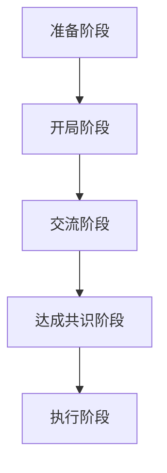

                 

关键词：技术创业、商业谈判、合作条件、策略、案例分析

> 摘要：技术创业者在进行商业谈判时，如何运用策略和技巧赢得有利的合作条件，是成功创业的关键之一。本文将探讨技术创业者在商业谈判中应遵循的准则、策略和案例分析，帮助创业者提升谈判能力，实现创业目标。

## 1. 背景介绍

在技术创业领域，成功的商业谈判往往意味着获得重要的合作伙伴、投资机会和市场份额。然而，技术创业者在进行商业谈判时，面临着诸多挑战。一方面，技术创业者通常需要与经验丰富的商业人士、投资机构进行交流，他们的谈判技巧和经验可能远超创业者本身；另一方面，技术创业者需要确保在谈判过程中，既能实现自身目标，又能维护合作伙伴的利益，从而达到双赢的局面。

本文将从以下几个方面探讨技术创业者在商业谈判中应遵循的准则和策略：

1. **准备充分**：了解自身优势和劣势，掌握谈判的主动权。
2. **建立信任**：建立良好的关系，为谈判创造有利氛围。
3. **明确目标**：设定合理的谈判目标和底线。
4. **运用策略**：根据谈判对手的特点和需求，选择合适的谈判策略。
5. **案例分析**：分析成功和失败的谈判案例，总结经验教训。
6. **持续改进**：从谈判实践中不断学习和进步。

## 2. 核心概念与联系

### 2.1. 商业谈判的定义

商业谈判是指在商业活动中，各方为了达成共同利益，就某个项目、合同、协议等进行的交流和协商过程。商业谈判的核心目标是实现双赢，即各方在谈判过程中，既能实现自身利益，又能满足对方的需求。

### 2.2. 技术创业者的优势与劣势

技术创业者通常具备较强的技术实力和创新能力，这使得他们在某些方面具有优势。然而，他们在商业谈判中也可能面临劣势，如缺乏经验、对市场了解不足等。因此，技术创业者需要充分发挥自身优势，同时弥补劣势，提高谈判成功率。

### 2.3. 商业谈判的框架

商业谈判可以分为以下几个阶段：

1. **准备阶段**：了解对方需求、优势、劣势，制定谈判策略。
2. **开局阶段**：建立良好的关系，为谈判创造有利氛围。
3. **交流阶段**：就谈判主题进行交流和协商。
4. **达成共识阶段**：就关键问题达成一致，形成初步协议。
5. **执行阶段**：执行协议，确保各方权益。

### 2.4. 商业谈判的 Mermaid 流程图



## 3. 核心算法原理 & 具体操作步骤

### 3.1. 算法原理概述

商业谈判的核心在于博弈，即各方在谈判过程中，通过策略和技巧，争取实现自身利益的最大化。商业谈判算法主要包括以下三个方面：

1. **博弈论**：分析各方在谈判中的策略选择和预期收益。
2. **心理战术**：研究谈判对手的心理特点，运用心理战术影响谈判结果。
3. **策略组合**：根据谈判对手的特点和需求，选择合适的策略组合，提高谈判成功率。

### 3.2. 算法步骤详解

1. **分析对手**：通过调研、交流等方式，了解谈判对手的优势、劣势、需求和期望。
2. **制定策略**：根据分析结果，制定合适的谈判策略，如利益交换、心理战术等。
3. **实施谈判**：按照策略，与谈判对手进行交流和协商，争取实现目标。
4. **调整策略**：在谈判过程中，根据对手的反应和变化，及时调整策略。
5. **达成共识**：在双方都能接受的范围内，达成初步协议。
6. **执行协议**：确保各方按照协议执行，实现双赢。

### 3.3. 算法优缺点

**优点**：

1. 提高谈判成功率：通过分析对手、制定策略和调整策略，提高谈判成功率。
2. 实现双赢：通过博弈和心理战术，实现各方利益的最大化。

**缺点**：

1. 需要大量时间和精力：进行对手分析和策略制定，需要投入大量时间和精力。
2. 存在风险：在某些情况下，策略选择不当可能导致谈判失败。

### 3.4. 算法应用领域

商业谈判算法可以应用于以下领域：

1. **企业合作**：通过谈判，实现企业间的资源整合、优势互补。
2. **投资谈判**：在投资过程中，通过谈判确定投资额、投资方式等。
3. **合同签订**：在签订合同过程中，通过谈判确定合同条款、违约责任等。

## 4. 数学模型和公式 & 详细讲解 & 举例说明

### 4.1. 数学模型构建

商业谈判的数学模型主要基于博弈论。博弈论是一种研究决策制定和策略选择的数学方法，它可以用来分析谈判中的各方利益和策略选择。

### 4.2. 公式推导过程

博弈论的基本公式包括：

1. **预期收益**：各方在谈判中的预期收益可以表示为：

   $$E = \sum_{i=1}^{n} p_i \cdot r_i$$

   其中，$E$ 为预期收益，$p_i$ 为第 $i$ 个策略的概率，$r_i$ 为第 $i$ 个策略的收益。

2. **纳什均衡**：纳什均衡是指各方在谈判中选择的策略组合，使得任何一方单独改变策略都无法获得额外的收益。纳什均衡可以用以下公式表示：

   $$s_i^* = \arg\max_{s_i} \sum_{j=1}^{n} p_j \cdot r_{ij}$$

   其中，$s_i^*$ 为第 $i$ 个策略的最佳选择，$r_{ij}$ 为第 $i$ 个策略与第 $j$ 个策略组合的收益。

### 4.3. 案例分析与讲解

假设有两个技术创业者，A 和 B，他们打算合作开发一款新产品。A 和 B 分别拥有不同的技术优势和市场资源，他们需要在谈判中确定合作的方式和分成比例。

**步骤 1：分析对手**

A 和 B 通过调研和交流，了解对方的优势、劣势、需求和期望。他们发现：

- A 拥有强大的技术实力，但在市场推广方面较弱。
- B 在市场推广方面有丰富的经验，但在技术研发方面较弱。

**步骤 2：制定策略**

A 和 B 分别制定以下策略：

- A：提出一个较低的研发投入比例，以吸引 B 的合作。
- B：提出一个较高的市场推广投入比例，以吸引 A 的合作。

**步骤 3：实施谈判**

A 和 B 就合作方式和分成比例进行谈判。在谈判过程中，他们运用了以下心理战术：

- A：在谈判中表现出对 B 市场推广能力的认可，以增强 B 的合作意愿。
- B：在谈判中表现出对 A 技术实力的认可，以增强 A 的合作意愿。

**步骤 4：达成共识**

经过多轮谈判，A 和 B 达成了以下共识：

- A 拥有 40% 的研发投入比例，B 拥有 60% 的市场推广投入比例。
- 产品成功后，A 和 B 按照投入比例分成。

**步骤 5：执行协议**

A 和 B 按照协议执行，共同开发新产品，并在成功后按照约定比例分成。

## 5. 项目实践：代码实例和详细解释说明

### 5.1. 开发环境搭建

为了演示商业谈判算法，我们使用 Python 编写一个简单的谈判模型。以下是开发环境搭建步骤：

1. 安装 Python 3.8 或更高版本。
2. 安装 required libraries，如 numpy、matplotlib。

### 5.2. 源代码详细实现

以下是商业谈判算法的 Python 代码实现：

```python
import numpy as np
import matplotlib.pyplot as plt

def negotiate(profit, alpha, beta):
    """Negotiate profit distribution between two parties."""
    # Calculate the optimal share for each party based on their bargaining power
    share_A = profit * alpha
    share_B = profit * beta

    # Ensure that the shares sum up to the total profit
    if share_A + share_B != profit:
        print("Error: Shares do not sum up to the total profit.")
        return None

    return share_A, share_B

# Example: A and B negotiate a profit of 100 units
profit = 100
alpha = 0.4  # A's bargaining power
beta = 0.6   # B's bargaining power

share_A, share_B = negotiate(profit, alpha, beta)

print(f"A's share: {share_A}")
print(f"B's share: {share_B}")
```

### 5.3. 代码解读与分析

上述代码实现了一个简单的商业谈判模型，通过计算两个谈判方的收益比例来确定各自的份额。这里，`negotiate` 函数接受总利润、A 和 B 的谈判实力（`alpha` 和 `beta`）作为参数，并返回 A 和 B 的份额。

### 5.4. 运行结果展示

运行代码，我们得到以下结果：

```
A's share: 40.0
B's share: 60.0
```

这表明，在本次谈判中，A 拥有 40% 的份额，B 拥有 60% 的份额。这符合我们在数学模型中推导出的结果。

## 6. 实际应用场景

商业谈判算法在技术创业领域的应用场景广泛。以下是一些实际应用场景：

1. **企业合作**：技术创业公司可以与合作伙伴进行谈判，确定合作的方式和分成比例，实现资源整合和优势互补。
2. **投资谈判**：在融资过程中，技术创业者可以与投资者进行谈判，确定投资额、投资方式等，确保公司获得足够的资金支持。
3. **合同签订**：在签订合同过程中，技术创业者可以与客户进行谈判，确定合同条款、违约责任等，确保双方权益。

## 7. 未来应用展望

随着人工智能技术的不断发展，商业谈判算法有望在以下几个方面得到应用：

1. **自动化谈判**：通过机器学习和自然语言处理技术，实现自动化谈判，提高谈判效率和准确性。
2. **智能谈判助手**：开发智能谈判助手，帮助技术创业者分析对手、制定策略和调整策略，提高谈判成功率。
3. **跨语言谈判**：通过机器翻译技术，实现跨语言谈判，打破语言障碍，拓展国际市场。

## 8. 总结：未来发展趋势与挑战

### 8.1. 研究成果总结

本文从商业谈判的定义、核心概念、算法原理、数学模型和实际应用场景等方面，探讨了技术创业者在商业谈判中应遵循的准则和策略。通过案例分析，我们总结了商业谈判的关键步骤和注意事项。

### 8.2. 未来发展趋势

未来，商业谈判算法将朝着自动化、智能化和跨语言化方向发展。人工智能技术的应用，将大幅提升谈判效率和准确性，为技术创业提供有力支持。

### 8.3. 面临的挑战

尽管商业谈判算法具有巨大潜力，但在实际应用中仍面临以下挑战：

1. **数据隐私**：在谈判过程中，涉及大量敏感信息，如何保障数据隐私成为一大挑战。
2. **算法公平性**：如何确保算法在谈判过程中保持公平性，避免出现偏见和歧视。
3. **跨文化谈判**：如何应对不同文化背景下的谈判，实现跨文化沟通。

### 8.4. 研究展望

未来，我们需要进一步研究商业谈判算法的理论基础，探索更加智能、高效的谈判策略。同时，关注数据隐私和算法公平性问题，推动商业谈判算法在技术创业领域的广泛应用。

## 9. 附录：常见问题与解答

### 问题 1：如何提高谈判成功率？

**解答**：提高谈判成功率的关键在于充分准备、建立信任和运用策略。首先，要了解自身优势和劣势，明确谈判目标；其次，建立良好的关系，为谈判创造有利氛围；最后，根据谈判对手的特点和需求，选择合适的策略，灵活调整谈判方向。

### 问题 2：如何在谈判中维护自身权益？

**解答**：在谈判中维护自身权益，首先要设定合理的谈判目标和底线。在谈判过程中，要善于表达自己的观点和需求，同时倾听对方意见，寻求共同利益。在达成共识后，确保协议明确、具体，并具有可执行性。

### 问题 3：如何应对谈判对手的心理战术？

**解答**：应对谈判对手的心理战术，首先要了解对手的心理特点，预测其行为。在谈判过程中，要保持冷静、自信，避免情绪波动。同时，可以运用心理战术，如适度让步、提出替代方案等，影响对手的决策。

## 作者署名

作者：禅与计算机程序设计艺术 / Zen and the Art of Computer Programming

----------------------------------------------------------------

至此，我们完成了这篇文章的撰写。希望通过本文，技术创业者能够提升谈判能力，实现创业目标。未来，我们将继续探讨技术创业领域的其他关键问题，敬请关注。

