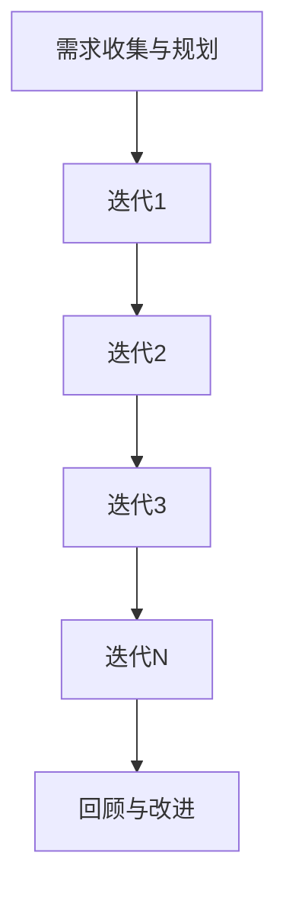

                 

## 1. 背景介绍

在当今快速变化和竞争激烈的市场环境中，技术创业公司面临着前所未有的挑战。如何高效地将创新的想法转化为可行的产品和服务，成为每个创业团队必须解决的关键问题。传统的软件开发模式往往强调详细的规划和长时间的迭代，这在某些情况下可能导致项目延误、资源浪费，甚至在市场变化之前就失去竞争力。

为了应对这些挑战，敏捷开发方法论逐渐成为技术创业公司的首选。敏捷开发的核心思想是以用户需求为中心，通过快速迭代和持续交付来不断优化产品。这种方法不仅能够帮助创业公司更好地适应市场变化，还可以降低风险，提高创新效率。

本文将深入探讨敏捷开发在技术创业中的应用，重点关注如何快速验证商业假设，从而实现产品的快速迭代和市场验证。我们将从敏捷开发的核心理念出发，逐步分析其具体实践方法，并结合实际案例进行详细讲解。

### 1.1 敏捷开发的起源与发展

敏捷开发起源于20世纪90年代末，其背景是软件开发领域对传统瀑布模型的反思和质疑。瀑布模型是一种线性、顺序的开发方法，强调在项目开始时就制定出详尽的计划，然后严格按照这个计划执行。然而，随着项目规模的扩大和复杂度的增加，这种方法的局限性逐渐显现：

1. **需求变更的困难**：在项目进行过程中，客户的需求往往会发生变化，但瀑布模型难以适应这种变化。
2. **高风险和高成本**：由于项目计划通常在早期就已经确定，任何变更都会导致项目延期和成本超支。
3. **缺乏灵活性**：瀑布模型缺乏灵活性，无法快速响应市场变化。

为了解决这些问题，敏捷开发提出了新的软件开发方法论，其核心理念包括：

- **用户需求驱动**：用户需求是产品开发的核心，开发团队应始终围绕用户需求进行工作。
- **迭代开发**：将项目划分为多个小周期（迭代），每个迭代都会产生一个可工作的产品版本。
- **持续交付**：通过持续集成和持续交付，确保产品能够快速迭代和持续改进。
- **自我管理团队**：团队成员应该自我组织、自我管理，以提高协作效率和创新能力。

敏捷开发方法最早由一组软件开发专家在2001年共同签署的《敏捷宣言》中提出，这份宣言强调了价值、个体和互动、工作软件、客户合作和响应变化的重要性。随着时间的推移，敏捷开发逐渐演变为多种具体的实践，如Scrum、Kanban、XP等。

### 1.2 技术创业中的挑战与需求

对于技术创业公司而言，市场变化迅速、资源有限、竞争激烈是常见的挑战。在这种环境下，传统的开发方法往往难以适应：

- **市场反馈滞后**：传统的软件开发模式通常需要较长时间才能交付产品，导致市场反馈滞后，容易失去市场机会。
- **资源浪费**：详尽的规划和长时间的开发周期可能导致大量资源浪费，特别是在市场需求发生变化时。
- **快速迭代的重要性**：技术创业公司需要通过快速迭代来验证商业假设，快速调整产品方向，确保产品能够满足市场需求。

敏捷开发为技术创业公司提供了以下优势：

- **快速响应市场变化**：敏捷开发通过迭代和持续交付，使团队能够快速响应市场变化，保持产品竞争力。
- **降低开发风险**：通过不断验证商业假设，团队能够及时发现并纠正错误，降低开发风险。
- **提高开发效率**：自我管理和协作机制使团队成员能够高效协作，提高开发效率。
- **客户满意度**：客户可以更早地参与到产品开发过程中，提供反馈，确保最终产品能够满足客户需求。

总的来说，敏捷开发为技术创业公司提供了一种灵活、高效、适应市场变化的开发方法，有助于它们在激烈的市场竞争中脱颖而出。

### 1.3 本文结构

本文将围绕敏捷开发在技术创业中的应用进行详细探讨，结构如下：

- **第2章**：介绍敏捷开发的核心理念，包括用户需求驱动、迭代开发、持续交付和自我管理团队。
- **第3章**：分析敏捷开发与传统开发方法的区别，讨论敏捷开发的优势和挑战。
- **第4章**：探讨敏捷开发的最佳实践，包括团队结构、角色定义、敏捷工具和会议安排。
- **第5章**：详细解释如何通过敏捷开发快速验证商业假设，结合实际案例进行说明。
- **第6章**：介绍敏捷开发的常见问题与解决方案，帮助团队克服实施中的困难。
- **第7章**：总结敏捷开发在技术创业中的应用，展望其未来的发展趋势与挑战。

通过本文的阅读，您将能够全面了解敏捷开发在技术创业中的价值，掌握其具体实践方法，为您的创业项目提供有力支持。

---

## 2. 核心概念与联系

要深入理解敏捷开发的核心理念和实践方法，首先需要明确几个关键概念及其相互关系。以下是本文中涉及的核心概念、原理和架构，并附有Mermaid流程图帮助读者更好地理解。

### 2.1 敏捷开发的核心理念

敏捷开发的核心思想可以归纳为四个价值、十二个原则和几个核心实践。以下是这些核心理念的简要介绍：

#### 2.1.1 四个价值

1. **个体和互动胜过过程和工具**：注重团队成员的沟通和协作，认为这是项目成功的关键。
2. **可工作的软件胜过详尽的文档**：优先交付可运行的软件，文档作为辅助。
3. **客户合作胜过合同谈判**：与客户紧密合作，确保产品符合市场需求。
4. **响应变化胜过遵循计划**：灵活应对变化，快速适应市场。

#### 2.1.2 十二个原则

1. **我们的最高目标是通过软件开发满足客户的需求**。
2. **欢迎改变，甚至在开发后期也欢迎改变**。
3. **经常交付可工作的软件， preferably within weeks**。
4. **业务人员和开发人员必须协同工作**。
5. **围绕被激励的个人来构建项目**。
6. **通过面对面的交流来促进互动**。
7. **工作软件是进度的主要衡量标准**。
8. **度量工作的方式应该可持续**。
9. **保持简单，让工作尽可能简单**。
10. **最好的架构、需求和设计来自自组织的团队**。
11. **定期反思如何能更好地开展工作**。
12. **团队应该定期（如每个迭代）评估如何最好地共同工作**。

#### 2.1.3 核心实践

- **迭代开发**：将项目划分为多个迭代周期，每个迭代都会交付一个可工作的产品版本。
- **持续交付**：通过自动化测试和部署，确保产品能够持续交付。
- **用户故事**：以用户需求为中心，使用用户故事来描述功能和需求。
- **看板**：使用看板（Kanban）来可视化工作流程，提高团队效率。

### 2.2 敏捷开发的流程与架构

敏捷开发的流程通常包括以下步骤：

1. **需求收集与规划**：与客户和利益相关者合作，收集需求，并制定迭代计划。
2. **迭代开发**：每个迭代周期包括需求分析、设计、编码、测试和部署等阶段。
3. **回顾与改进**：在每个迭代结束时，团队会进行回顾，讨论哪些工作做得好，哪些需要改进。

以下是一个简单的Mermaid流程图，展示敏捷开发的典型流程：

### 2.3 敏捷开发的优势与挑战

敏捷开发具有以下优势：

- **快速响应变化**：通过迭代和持续交付，团队能够快速响应市场需求。
- **提高客户满意度**：客户可以在每个迭代中提供反馈，确保产品符合需求。
- **降低开发风险**：通过不断验证商业假设，团队能够及时纠正错误。

然而，敏捷开发也面临一些挑战：

- **团队协作**：实现有效的团队协作需要时间，特别是在跨职能团队中。
- **需求变动**：频繁的需求变动可能会影响项目进度和团队信心。
- **工具选择**：选择合适的敏捷工具和平台对于成功实施敏捷开发至关重要。

通过理解和运用这些核心概念和实践，技术创业公司可以更好地实施敏捷开发，实现产品的快速迭代和市场验证。

### 2.4 敏捷开发与传统开发方法的对比

敏捷开发与传统开发方法在多个方面存在显著差异，这些差异决定了敏捷开发在适应快速变化的市场环境中的独特优势。以下是对两者进行详细对比：

#### 2.4.1 生命周期模型

**传统开发方法**：传统开发方法，如瀑布模型，通常遵循一个线性、顺序的过程。这个模型将项目划分为多个阶段，每个阶段都有明确的任务和交付物。这些阶段包括需求分析、设计、开发、测试、部署和维护。每个阶段必须完成后再进入下一个阶段，因此整个开发周期通常较长。

**敏捷开发**：敏捷开发采用迭代和增量的方法。项目被划分为多个短周期的迭代，每个迭代都会交付一个可工作的产品版本。这些迭代通常持续几周，每个迭代都会包括需求分析、设计、编码、测试和部署。这种灵活的迭代方法允许团队快速响应变化，并在每个迭代中不断改进产品。

#### 2.4.2 项目管理

**传统开发方法**：在传统开发方法中，项目管理通常侧重于严格的计划和控制。项目开始时，详细的项目计划会被制定出来，并期望在整个项目周期内严格遵循。这种方法的优点是能够提供清晰的项目目标和进度，但缺点是难以适应变化，且在需求发生变化时可能导致项目延期和成本超支。

**敏捷开发**：敏捷开发强调自我管理团队和灵活的项目管理。团队被赋予更大的自主权，可以根据市场反馈和项目进展灵活调整计划和优先级。敏捷方法中的角色（如Scrum中的产品负责人和Scrum Master）也不同于传统方法，更加注重沟通和协作。

#### 2.4.3 需求管理

**传统开发方法**：在传统开发方法中，需求通常在项目早期就被详细定义，并在整个项目生命周期中保持不变。这种方法的优点是能够提供稳定的需求基础，但缺点是难以应对需求的变化。

**敏捷开发**：敏捷开发将需求视为动态的，并采用用户故事来描述功能和需求。用户故事是可估计的、可测试的，并且关注用户价值。这种方法允许团队在开发过程中不断调整需求，以确保产品能够最好地满足市场需求。

#### 2.4.4 产品交付

**传统开发方法**：在传统开发方法中，产品的交付通常在项目的最后阶段。这意味着客户只有在项目完成后才能看到最终产品，反馈周期较长。

**敏捷开发**：敏捷开发通过每个迭代周期交付可工作的软件，这意味着客户可以在每个迭代中看到进展，并提供反馈。这种方法缩短了反馈周期，使团队能够快速调整产品方向。

### 2.4.5 风险管理

**传统开发方法**：在传统开发方法中，风险管理通常在项目早期进行，并期望在整个项目生命周期中保持不变。这种方法的优点是能够提前识别和解决潜在问题，但缺点是难以适应项目过程中出现的新问题。

**敏捷开发**：敏捷开发通过每个迭代周期进行风险管理。在每个迭代结束时，团队会回顾过去的工作，识别成功和失败的原因，并制定改进措施。这种方法能够及时发现并纠正错误，降低开发风险。

总的来说，敏捷开发在生命周期模型、项目管理、需求管理和产品交付等方面与传统开发方法存在显著差异。这些差异使敏捷开发能够更好地适应快速变化的市场环境，提高产品的竞争力和客户满意度。然而，敏捷开发也带来了新的挑战，如团队协作和需求变动，需要团队在实施过程中不断学习和适应。

### 2.5 敏捷开发的优势与挑战

#### 2.5.1 优势

**快速响应变化**：敏捷开发通过迭代和持续交付，使团队能够快速响应市场需求。这种方法允许团队在每个迭代中收集用户反馈，并根据反馈调整产品方向，从而确保产品始终符合市场需求。

**提高客户满意度**：由于客户可以在每个迭代中看到进展并提供反馈，敏捷开发有助于提高客户满意度。客户参与度更高，能够更好地理解产品价值，并在最终产品中看到自己的需求得到满足。

**降低开发风险**：通过不断验证商业假设，敏捷开发能够及时发现并纠正错误，从而降低开发风险。这种持续的风险管理方法使团队能够更好地控制项目进度和质量。

**提高团队效率**：敏捷开发强调自我管理和协作，使团队成员能够高效协作。通过明确的角色分工和责任，团队能够更好地集中精力完成各自的任务，从而提高整体效率。

#### 2.5.2 挑战

**团队协作**：敏捷开发依赖于高效的团队协作。在实际操作中，实现跨职能团队的紧密协作可能面临挑战，特别是在团队成员来自不同背景和专业领域时。团队需要时间和努力来建立信任和协作机制。

**需求变动**：敏捷开发允许频繁的需求变动，这虽然有助于快速响应市场变化，但也可能导致项目进度不稳定。团队需要学会如何管理需求变动，并确保项目始终能够按计划进行。

**工具选择**：敏捷开发依赖于一系列工具来支持迭代和持续交付。选择合适的工具对于成功实施敏捷开发至关重要。然而，市场上存在大量的敏捷工具，选择合适的工具需要时间和经验。

**文化转变**：敏捷开发需要团队在思维方式和工作方式上进行转变。对于习惯了传统开发方法的团队来说，这种转变可能面临挑战。团队需要投入时间和精力来适应新的工作方式，并克服变革带来的压力。

#### 2.5.3 如何克服挑战

**加强团队协作**：建立高效的协作机制，如定期的团队会议、沟通工具和共享工作空间。通过明确角色和责任，确保每个团队成员都了解自己的任务和目标。

**管理需求变动**：制定明确的需求管理策略，确保需求变动不会影响项目进度。通过用户故事地图和迭代规划，团队可以更好地管理需求变动，并确保每个迭代都有明确的目标。

**选择合适的工具**：根据团队的具体需求和项目特点，选择合适的敏捷工具。例如，使用JIRA进行任务管理，使用Confluence进行文档协作，使用Git进行版本控制。确保团队成员熟悉所选工具，并定期评估其适用性。

**推动文化变革**：通过培训和团队建设活动，帮助团队成员适应新的工作方式。鼓励开放沟通和反馈，建立以用户为中心的文化。领导者需要发挥关键作用，为团队提供支持和激励，帮助他们克服变革带来的挑战。

通过理解敏捷开发的优势和挑战，并采取适当的措施，技术创业团队可以更好地实施敏捷开发，实现产品的快速迭代和市场验证。

### 2.6 敏捷开发在技术创业中的最佳实践

要在技术创业中成功实施敏捷开发，团队需要遵循一系列最佳实践，确保项目能够高效进行，并在快速变化的市场环境中保持竞争力。以下是一些关键的最佳实践：

#### 2.6.1 团队结构

**跨职能团队**：敏捷开发强调团队成员的多样性和协作。一个成功的敏捷团队通常包括开发人员、测试人员、设计师和产品负责人等不同角色的成员。这种跨职能团队能够快速响应需求变化，并在项目进展中协同工作。

**小团队规模**：团队规模应该适中，通常不超过10人。小型团队能够更好地协作，减少沟通成本，并更快地做出决策。

**自我管理**：敏捷团队应该具备自我管理的能力，这意味着团队成员负责自己的任务和时间管理。产品负责人和Scrum Master的角色是支持和促进团队的工作，而不是直接控制团队。

#### 2.6.2 角色定义

**产品负责人**（Product Owner）：产品负责人是负责定义和优先级排序产品需求的人。他们与利益相关者紧密合作，确保产品的方向和功能满足市场需求。产品负责人需要具备良好的沟通能力和市场洞察力。

**Scrum Master**：Scrum Master是团队的教练和促进者，负责确保团队遵循敏捷实践，解决团队遇到的障碍，并帮助团队成员理解并实践敏捷原则。Scrum Master还需要组织Scrum会议，如每日站会、迭代评审和回顾会议。

**开发团队**：开发团队由开发人员、测试人员和设计师组成，负责实现和交付迭代中的用户故事。每个成员都需要具备相应的技能和经验，以确保团队能够高效完成各自的任务。

#### 2.6.3 敏捷工具

**任务管理工具**：如JIRA、Trello等，用于跟踪和管理任务和用户故事。这些工具可以帮助团队可视化工作流程，跟踪任务进度，并确保每个任务都有明确的负责人和截止日期。

**协作工具**：如Confluence、Slack等，用于团队内部的沟通和协作。Confluence可以帮助团队创建和共享文档，Slack则提供了实时的沟通渠道。

**版本控制工具**：如Git，用于管理代码版本和控制代码变更。Git可以帮助团队协作开发，确保代码的完整性和可追溯性。

**自动化测试工具**：如Selenium、Jenkins等，用于自动化测试和部署。这些工具可以确保每个迭代的产品版本都经过充分的测试，并能够在短时间内交付。

#### 2.6.4 会议安排

**每日站会**（Daily Stand-up）：每日站会是敏捷团队每天早上的简短会议，旨在同步团队进展、解决问题和协调任务。每日站会通常持续15分钟左右，每个成员回答以下三个问题：
- 昨天完成了什么？
- 今天计划做什么？
- 遇到了什么问题，需要团队帮助？

**迭代评审**（Sprint Review）：迭代评审是每个迭代结束时进行的会议，旨在展示团队在当前迭代中完成的工作，并收集利益相关者的反馈。评审通常包括产品演示、用户故事演示和反馈讨论。

**迭代回顾**（Sprint Retrospective）：迭代回顾是每个迭代结束时进行的反思会议，旨在讨论哪些工作做得好，哪些需要改进。通过回顾会议，团队可以不断优化工作流程和协作方式。

#### 2.6.5 用户故事和优先级

**用户故事**：用户故事是敏捷开发中描述功能需求的一种方法。用户故事通常遵循“As a [用户角色]，I want to [功能]，so that [价值]”的格式。用户故事应该是可估计的、可测试的和关注用户价值的。

**优先级**：在敏捷开发中，用户故事通常按照优先级排序，以确保团队首先实现最重要的功能。产品负责人和团队一起确定用户故事的优先级，并根据市场反馈和团队资源进行调整。

通过遵循这些最佳实践，技术创业团队能够更好地实施敏捷开发，提高开发效率，快速验证商业假设，并最终实现产品的成功迭代和市场验证。

### 2.7 敏捷开发与商业假设验证

敏捷开发的核心优势之一在于其能够快速验证商业假设，这对于技术创业公司尤其重要。商业假设验证是确保产品方向和市场策略符合市场需求的必要过程，通过敏捷开发的方法，团队能够在短时间内验证这些假设，并据此调整产品方向。

#### 2.7.1 什么是商业假设验证

商业假设验证是指对产品或业务模型的基本假设进行测试，以确定其可行性和市场吸引力。这些假设通常包括：

- **市场需求**：产品是否满足特定市场的需求。
- **用户行为**：目标用户是否会使用产品，以及如何使用。
- **竞争环境**：产品在市场中的竞争力和差异化。
- **盈利模式**：产品如何实现盈利。

通过验证这些假设，团队可以了解产品是否具有市场潜力，并据此做出相应的调整。

#### 2.7.2 敏捷开发如何支持商业假设验证

敏捷开发通过迭代和持续交付，为商业假设验证提供了以下支持：

1. **快速迭代**：通过将项目划分为多个短周期迭代，团队可以在每个迭代中实现一个可工作的产品版本。这种方法使团队能够快速测试和验证假设，并在每个迭代中根据反馈进行调整。

2. **用户反馈**：敏捷开发强调与用户的紧密合作，通过用户故事和迭代评审，团队可以收集用户反馈，验证产品是否符合市场需求。这种持续的反馈机制有助于团队及时发现问题并进行调整。

3. **灵活调整**：敏捷开发允许团队根据市场反馈和项目进展灵活调整计划。这意味着团队可以在验证商业假设的过程中随时调整产品方向和策略，以适应市场变化。

4. **快速部署**：通过自动化测试和部署，敏捷开发能够确保每个迭代的产品版本都可以快速交付和测试。这有助于团队在短时间内验证多个假设，提高开发效率。

#### 2.7.3 敏捷开发中的关键实践

以下是在敏捷开发中支持商业假设验证的一些关键实践：

1. **用户故事地图**：用户故事地图是一种可视化工具，用于规划和组织用户故事。通过用户故事地图，团队可以更好地理解产品的整体功能，并确定哪些功能优先实现。

2. **优先级排序**：在敏捷开发中，用户故事的优先级非常重要。通过优先级排序，团队可以确保首先实现最重要的功能和特性，从而快速验证关键假设。

3. **增量开发**：增量开发是一种逐步交付产品功能的方法。通过增量开发，团队可以逐步构建和验证产品，而不是一次性交付全部功能。这种方法有助于降低风险，并确保产品始终符合市场需求。

4. **持续集成和持续交付**：持续集成和持续交付是敏捷开发中确保快速迭代和持续交付的重要实践。通过自动化测试和部署，团队可以确保每个迭代的产品版本都能够快速交付和测试。

#### 2.7.4 案例分析

为了更好地理解敏捷开发在商业假设验证中的应用，我们来看一个实际案例。

**案例**：某技术创业公司开发了一款基于人工智能的图像识别应用，旨在帮助企业自动化图像分类和处理。他们的主要商业假设包括：

- **市场需求**：企业对于图像识别和分类的需求日益增加。
- **用户行为**：目标用户会使用该应用来提高工作效率。
- **竞争环境**：该应用具有独特的算法优势，能够提供更高的准确性和效率。
- **盈利模式**：通过订阅模式向企业客户收费。

为了验证这些假设，公司采用了敏捷开发方法，具体步骤如下：

1. **迭代1**：团队首先开发了一个最小可行性产品（MVP），包括基础图像识别功能。他们在一个小规模的企业客户中进行试点，以验证市场需求。

2. **用户故事和反馈**：在迭代1结束后，团队收集了用户反馈，发现用户对于图像识别速度和准确性有较高的要求。基于这些反馈，团队调整了优先级，并在下一个迭代中优化了算法。

3. **迭代2**：团队增加了图像处理和分类功能，并在更大规模的企业中进行测试。他们发现用户对于新增功能非常满意，同时反馈了一些改进建议，如更好的用户界面和更详细的错误信息。

4. **迭代3**：基于用户的反馈，团队进一步优化了应用，并增加了用户界面和错误处理功能。他们在多个行业进行了测试，以确保应用的通用性和适用性。

5. **迭代4**：在最后一个迭代中，团队进行了全面的用户测试和性能测试，确保应用在不同设备和操作系统上都能正常运行。最终，他们向所有目标客户推出了正式版本。

通过这个案例，我们可以看到敏捷开发如何帮助团队快速验证商业假设，并不断优化产品。团队通过每个迭代中的用户反馈，不断调整产品方向和策略，最终成功推出了符合市场需求的产品。

总的来说，敏捷开发为技术创业公司提供了一种有效的方法来验证商业假设，通过快速迭代和用户反馈，团队能够及时调整产品方向，降低风险，提高市场竞争力。

### 2.8 敏捷开发中的常见问题与解决方案

尽管敏捷开发在技术创业中具有许多优势，但其实施过程中也会面临一些常见问题。以下是一些主要问题及其解决方案：

#### 2.8.1 团队协作问题

**问题**：跨职能团队之间的协作困难，团队成员缺乏沟通和协作机制。

**解决方案**：建立明确的沟通和协作机制，如定期的团队会议、使用协作工具（如Slack、Confluence）和共享工作空间。通过明确的角色分工和责任，确保每个团队成员都了解自己的任务和目标，从而提高协作效率。

#### 2.8.2 需求变动问题

**问题**：频繁的需求变动可能导致项目进度不稳定，影响团队的信心。

**解决方案**：制定明确的需求管理策略，确保需求变动不会影响项目进度。通过用户故事地图和迭代规划，团队可以更好地管理需求变动，并确保每个迭代都有明确的目标。此外，团队应该接受需求变动的现实，并学会在变化中寻找机会。

#### 2.8.3 工具选择问题

**问题**：选择合适的敏捷工具和平台对于成功实施敏捷开发至关重要，但市场上存在大量的敏捷工具，选择合适的工具可能面临挑战。

**解决方案**：根据团队的具体需求和项目特点，选择合适的敏捷工具。例如，使用JIRA进行任务管理，使用Confluence进行文档协作，使用Git进行版本控制。确保团队成员熟悉所选工具，并定期评估其适用性。

#### 2.8.4 文化转变问题

**问题**：敏捷开发需要团队在思维方式和工作方式上进行转变，对于习惯了传统开发方法的团队来说，这种转变可能面临挑战。

**解决方案**：通过培训和团队建设活动，帮助团队成员适应新的工作方式。鼓励开放沟通和反馈，建立以用户为中心的文化。领导者需要发挥关键作用，为团队提供支持和激励，帮助他们克服变革带来的挑战。

#### 2.8.5 项目管理问题

**问题**：敏捷开发强调自我管理和灵活调整，但有时可能会导致项目管理的失控。

**解决方案**：敏捷开发中的角色（如产品负责人和Scrum Master）需要承担更多的管理职责，确保项目能够按照计划进行。通过定期的迭代规划和回顾，团队可以及时识别和解决问题，确保项目目标的实现。

通过解决这些问题，技术创业团队能够更好地实施敏捷开发，提高项目的成功率和市场竞争力。

### 2.9 敏捷开发在技术创业中的实际应用

为了更好地理解敏捷开发在技术创业中的应用，以下将介绍几个成功的案例，分析这些团队如何通过敏捷开发快速验证商业假设，并取得成功。

#### 2.9.1 案例一：Dropbox

**背景**：Dropbox是一家提供云存储服务的公司，成立于2007年。在成立初期，Dropbox面临着激烈的竞争，需要在有限的时间内脱颖而出。

**敏捷实践**：

- **迭代开发**：Dropbox的团队将项目分为多个短周期迭代，每次迭代都专注于实现一个核心功能。这种方法使团队能够快速验证假设，并根据用户反馈进行调整。
- **用户故事**：团队使用用户故事来描述和优先级排序需求。用户故事简洁明了，关注用户价值，有助于团队快速理解用户需求。
- **用户反馈**：Dropbox与用户保持紧密联系，通过用户反馈不断优化产品。他们建立了多个用户社区，定期收集用户反馈，并在下一个迭代中进行改进。
- **快速迭代**：Dropbox通过快速迭代，持续改进产品。他们不断添加新功能，提高用户体验，并迅速响应市场变化。

**结果**：通过敏捷开发的实践，Dropbox在短时间内验证了其商业假设，取得了巨大的成功。现在，Dropbox已经成为全球领先的云存储服务提供商，拥有数亿用户。

#### 2.9.2 案例二：Uber

**背景**：Uber是一家提供网约车服务的公司，成立于2009年。在Uber的发展初期，传统出租车行业对其进行了强烈抵制。

**敏捷实践**：

- **最小可行性产品（MVP）**：Uber在初期开发了最小可行性产品，仅包含核心功能，如用户注册、打车请求和支付。这种方法使团队能够快速验证商业假设，并集中资源开发关键功能。
- **用户故事和反馈**：Uber使用用户故事来描述和优先级排序需求。他们通过用户反馈不断改进产品，确保产品满足用户需求。
- **快速迭代**：Uber通过快速迭代，不断优化产品和服务。他们不断添加新功能，如实时导航、用户评价和司机奖励计划，以提升用户体验。
- **数据分析**：Uber利用数据分析来了解用户行为和市场趋势。通过分析用户数据，他们能够快速调整产品方向，提高市场竞争力。

**结果**：通过敏捷开发的实践，Uber在短时间内验证了其商业假设，并迅速扩张到全球市场。现在，Uber已经成为全球最大的网约车服务提供商，拥有数百万司机和数亿用户。

#### 2.9.3 案例三：Airbnb

**背景**：Airbnb是一家提供民宿预订服务的公司，成立于2008年。在成立初期，Airbnb面临着激烈的市场竞争。

**敏捷实践**：

- **用户故事和反馈**：Airbnb使用用户故事来描述和优先级排序需求。他们通过用户反馈不断改进产品和服务，确保产品满足用户需求。
- **最小可行性产品（MVP）**：Airbnb在初期开发了最小可行性产品，仅包含核心功能，如房源发布和预订。这种方法使团队能够快速验证商业假设，并集中资源开发关键功能。
- **用户参与**：Airbnb鼓励房东和房客积极参与产品开发。通过用户参与，团队能够更好地了解用户需求，并快速改进产品。
- **快速迭代**：Airbnb通过快速迭代，不断优化产品和服务。他们不断添加新功能，如即时消息、用户评价和预订确认，以提高用户体验。

**结果**：通过敏捷开发的实践，Airbnb在短时间内验证了其商业假设，并迅速扩张到全球市场。现在，Airbnb已经成为全球最大的民宿预订服务提供商，拥有数百万房东和数亿用户。

这些案例表明，通过敏捷开发的实践，技术创业团队能够快速验证商业假设，不断优化产品，并在激烈的市场竞争中脱颖而出。敏捷开发为技术创业公司提供了一种灵活、高效、适应市场变化的方法，有助于它们在快速变化的市场环境中取得成功。

### 2.10 敏捷开发的应用领域与未来展望

敏捷开发作为一种灵活、高效的方法，已经在多个领域得到广泛应用，并取得了显著成果。以下是一些主要的应用领域及其未来展望：

#### 2.10.1 软件开发

软件开发是敏捷开发最早且最广泛应用的领域。通过迭代和增量开发，软件开发团队能够快速响应需求变化，提高产品质量和客户满意度。未来，随着人工智能、大数据和物联网等技术的发展，敏捷开发将继续在软件开发领域发挥重要作用，帮助团队更快地交付创新产品。

#### 2.10.2 产品管理

敏捷开发在产品管理中也具有重要意义。通过用户故事和优先级排序，产品负责人能够更好地理解用户需求，并快速调整产品方向。未来，随着市场竞争的加剧，敏捷开发将在产品管理中发挥更大的作用，帮助产品团队更快地满足用户需求，提高市场竞争力。

#### 2.10.3 运营管理

敏捷开发在运营管理中的应用也在逐渐增加。通过迭代和持续交付，运营团队能够快速响应市场变化，提高运营效率和服务质量。未来，随着企业对敏捷运营的需求不断增长，敏捷开发将在运营管理领域发挥更大的作用，帮助企业实现持续创新和高效运营。

#### 2.10.4 教育和培训

敏捷开发的理念和方法也逐渐应用于教育和培训领域。通过迭代和持续反馈，教育者和培训者能够更好地理解学生需求，并不断优化教学内容和方式。未来，随着教育技术的不断发展，敏捷开发将在教育和培训领域得到更广泛的应用，帮助提高教育质量和学习效果。

#### 2.10.5 未来展望

虽然敏捷开发已经取得了显著成果，但未来仍面临许多挑战和机遇：

1. **持续改进**：敏捷开发团队需要不断改进实践，以适应不断变化的环境和需求。通过持续学习和实践，团队能够不断提高敏捷开发的效率和质量。
2. **跨领域融合**：随着技术的不断发展，敏捷开发将与其他领域（如人工智能、大数据等）相结合，形成新的应用模式和解决方案。
3. **文化变革**：敏捷开发不仅需要技术上的改进，还需要组织文化和管理方式的变革。企业需要建立以用户为中心的文化，鼓励开放沟通和协作，才能充分发挥敏捷开发的优势。
4. **全球协作**：随着全球化的发展，敏捷开发将面临跨地域、跨文化的协作挑战。团队需要学会如何在不同的文化和环境中高效协作，以确保敏捷开发的成功实施。

总的来说，敏捷开发在未来的应用前景非常广阔，它不仅将帮助企业在快速变化的市场环境中取得成功，还将成为推动社会创新和进步的重要力量。

### 2.11 工具和资源推荐

为了更好地实施敏捷开发，团队需要选择合适的工具和资源。以下是一些建议，包括学习资源、开发工具和推荐论文：

#### 2.11.1 学习资源

- **书籍**：
  - 《敏捷实践指南》（Agile Practice Guide） by Dean Leffingwell
  - 《Scrum精髓：实践指南》（Scrum Essence and Implementation） by Gunther Verheyen
  - 《用户故事映射》（User Story Mapping） by Jeff Patton

- **在线课程**：
  - Coursera上的“敏捷项目管理”（Agile Project Management）
  - Udemy上的“敏捷开发与Scrum实践”（Agile Development and Scrum Practices）

- **博客和社区**：
  - 敏捷联盟（Agile Alliance）官网
  - 敏捷博客（Agile Blog）

#### 2.11.2 开发工具

- **任务管理工具**：
  - JIRA
  - Trello
  - Asana

- **协作工具**：
  - Slack
  - Confluence
  - Google Workspace

- **版本控制工具**：
  - Git
  - GitHub
  - GitLab

- **自动化测试工具**：
  - Selenium
  - Jenkins
  - TestCafe

- **持续集成和持续交付工具**：
  - Jenkins
  - GitLab CI/CD
  - CircleCI

#### 2.11.3 推荐论文

- **敏捷开发的起源与原则**：K. Beedle, J. Rice. "The Agile Manifesto: A Brief History and Overview". IEEE Software, 2005.
- **敏捷开发与传统开发方法的对比**：B. A. Booch, J. R. Martin. "Rethinking Agile Development: Applying the Agile Manifesto Principles to Large Systems Development". IEEE Software, 2013.
- **敏捷开发中的团队协作**：R. D. Thangadurai, M. A. Omer. "Agile Team Collaboration: A Framework for Effective Collaboration in Agile Projects". Information Systems Journal, 2019.

通过利用这些工具和资源，团队可以更好地实施敏捷开发，提高开发效率，实现产品的快速迭代和市场验证。

### 2.12 总结

本文详细探讨了敏捷开发在技术创业中的应用，强调了其快速验证商业假设的优势。通过迭代开发、用户故事、持续交付和灵活调整，敏捷开发帮助创业团队快速适应市场变化，提高产品竞争力。本文首先介绍了敏捷开发的起源和核心概念，分析了敏捷开发与传统开发方法的区别，探讨了敏捷开发的优势和挑战，并提供了最佳实践。随后，通过实际案例展示了敏捷开发在技术创业中的应用，总结了敏捷开发中的常见问题与解决方案，并展望了其未来的发展趋势与挑战。最后，推荐了一系列学习资源和开发工具，帮助团队更好地实施敏捷开发。

### 2.13 未来发展趋势与挑战

#### 2.13.1 研究成果总结

敏捷开发自2001年《敏捷宣言》发布以来，已经成为软件开发和产品管理中的主流方法论。大量研究成果和实践证明，敏捷开发在提高开发效率、客户满意度、降低开发风险等方面具有显著优势。研究主要集中在以下几个方面：

1. **敏捷实践**：探讨了如何在不同组织和行业中实施敏捷开发，包括团队结构、角色定义、工具选择等。
2. **敏捷与质量**：研究了敏捷开发对软件质量的影响，包括测试、代码审查、持续集成等实践。
3. **敏捷与项目管理**：分析了敏捷开发在项目管理中的应用，如风险控制、进度跟踪、资源分配等。
4. **敏捷与团队协作**：研究了敏捷开发中团队协作的重要性，包括沟通、冲突管理、知识共享等。

#### 2.13.2 未来发展趋势

1. **智能化敏捷**：随着人工智能、机器学习等技术的发展，敏捷开发将更加智能化。自动化工具和算法将帮助团队更高效地管理迭代、预测风险和优化工作流程。
2. **跨领域融合**：敏捷开发将继续与其他领域（如产品管理、运营管理、教育培训等）相结合，形成新的应用模式和方法论。
3. **全球化协作**：随着全球化的加深，敏捷开发将面临跨地域、跨文化的协作挑战。团队需要学会如何在不同的文化和环境中高效协作，以确保敏捷开发的成功实施。
4. **持续学习与改进**：敏捷开发团队将更加注重持续学习和改进，通过反思和总结，不断提高敏捷开发的效率和效果。

#### 2.13.3 面临的挑战

1. **文化变革**：敏捷开发要求团队在思维方式和工作方式上进行转变，这需要时间和努力。企业需要建立以用户为中心的文化，鼓励开放沟通和协作，以支持敏捷开发的实施。
2. **团队协作**：跨职能团队的协作是敏捷开发成功的关键。团队需要建立明确的协作机制和沟通渠道，确保每个成员都了解自己的任务和目标，从而提高协作效率。
3. **工具选择**：市场上存在大量的敏捷工具，选择合适的工具对于成功实施敏捷开发至关重要。团队需要根据具体需求和项目特点，选择合适的工具，并确保团队成员熟悉和使用这些工具。
4. **需求变动**：敏捷开发允许频繁的需求变动，但这也可能带来项目进度不稳定的风险。团队需要学会如何管理需求变动，并确保项目始终能够按计划进行。

#### 2.13.4 研究展望

未来的研究将重点关注以下几个方面：

1. **敏捷开发的智能化**：如何利用人工智能和机器学习技术提高敏捷开发的效率和质量，是未来研究的重点。
2. **跨领域融合**：探讨敏捷开发在非软件开发领域的应用，如产品管理、运营管理和教育培训等，形成新的方法论和应用模式。
3. **全球化协作**：研究如何在不同的文化和环境中实施敏捷开发，提高跨地域、跨文化的协作效率。
4. **持续学习与改进**：如何通过持续学习和改进，不断提高敏捷开发的效率和效果，是未来研究的方向。

总之，敏捷开发在技术创业中的应用前景广阔，通过不断的研究和实践，我们将能够更好地发挥其优势，应对未来的挑战，推动技术创业的成功。

### 2.14 附录：常见问题与解答

以下列出了一些关于敏捷开发的常见问题，并提供相应的解答，以帮助团队更好地理解和实施敏捷开发。

#### 2.14.1 问题1：什么是敏捷开发？

**解答**：敏捷开发是一种软件开发方法论，强调快速响应变化、持续交付可工作的软件、团队协作和用户反馈。其核心理念包括用户需求驱动、迭代开发、持续交付和自我管理团队。

#### 2.14.2 问题2：敏捷开发与传统开发方法有什么区别？

**解答**：传统开发方法（如瀑布模型）通常遵循线性、顺序的过程，而敏捷开发则采用迭代和增量方法。敏捷开发强调快速响应变化、用户需求驱动和持续交付，与传统开发方法相比，更加灵活和适应市场变化。

#### 2.14.3 问题3：敏捷开发中如何管理需求？

**解答**：在敏捷开发中，需求通过用户故事进行管理。用户故事是简洁、可估计、可测试的，关注用户价值。通过用户故事地图和优先级排序，团队可以灵活管理需求，并在每个迭代中实现最重要的功能。

#### 2.14.4 问题4：什么是Scrum？

**解答**：Scrum是一种流行的敏捷开发框架，它包括一系列角色（如产品负责人、Scrum Master和开发团队）、会议（如每日站会、迭代评审和回顾会议）和实践（如迭代规划和用户故事）。Scrum旨在通过迭代和持续交付，快速响应需求变化，提高产品质量。

#### 2.14.5 问题5：敏捷开发中如何管理风险？

**解答**：在敏捷开发中，通过每个迭代结束时的回顾会议，团队可以识别和讨论风险，并制定相应的改进措施。此外，敏捷开发允许频繁的需求变动，这有助于降低项目风险。通过持续验证商业假设，团队可以及时发现并纠正错误。

#### 2.14.6 问题6：什么是最小可行性产品（MVP）？

**解答**：最小可行性产品（MVP）是一个包含核心功能的产品版本，用于验证商业假设。通过MVP，团队可以快速验证市场需求，并集中资源开发关键功能，从而降低开发风险。

#### 2.14.7 问题7：敏捷开发中如何进行团队协作？

**解答**：敏捷开发强调跨职能团队的协作。团队应建立明确的沟通和协作机制，如定期会议、协作工具和共享工作空间。通过明确的角色分工和责任，确保每个团队成员都了解自己的任务和目标，从而提高协作效率。

这些常见问题的解答有助于团队更好地理解敏捷开发的核心理念和实践方法，从而在实际项目中更加有效地实施敏捷开发。

---

通过本文的深入探讨，我们不仅了解了敏捷开发在技术创业中的应用，还学习了如何通过敏捷开发快速验证商业假设，提高了产品的竞争力。敏捷开发以其快速响应变化、持续交付和用户反馈的核心优势，为技术创业公司提供了实现成功的有效方法。

未来的敏捷开发将继续融合智能技术和跨领域实践，为团队带来更高效的工作方式。然而，面对文化变革、团队协作和工具选择等挑战，团队需要持续学习和改进，以充分发挥敏捷开发的潜力。

在此，我鼓励读者将敏捷开发的理念和方法应用于实际项目中，不断探索和优化，以实现技术创业的成功。同时，欢迎读者在实施敏捷开发过程中分享经验和问题，共同推动敏捷开发在技术创业中的发展。

作者：禅与计算机程序设计艺术 / Zen and the Art of Computer Programming

