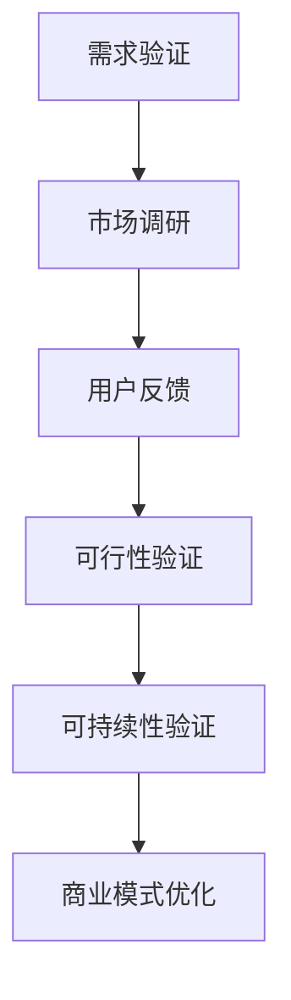

                 

关键词：商业模式验证、技术创业者、市场调研、风险评估、创新策略

摘要：本文旨在探讨技术创业者如何通过有效的商业模式验证，为初创企业奠定成功的基础。文章首先介绍了商业模式验证的重要性，然后详细阐述了进行商业模式验证的步骤、方法和工具，并提供了一系列实际案例分析，最后对未来商业模式验证的趋势和挑战进行了展望。

## 1. 背景介绍

在当今快速变化的市场环境中，技术创业者面临着前所未有的挑战和机遇。成功的商业模式不仅是企业盈利的关键，更是企业持续发展的动力源泉。然而，许多创业者在构建商业模式时往往缺乏系统的方法和工具，导致项目失败的风险增加。因此，如何进行有效的商业模式验证，成为了技术创业者亟需解决的重要问题。

### 1.1 商业模式验证的重要性

- **市场适应性**：商业模式验证可以帮助创业者确定产品或服务是否能够满足市场需求，提高市场适应性。
- **风险控制**：通过商业模式验证，创业者可以识别潜在的风险和挑战，从而降低创业失败的风险。
- **资源优化**：有效的商业模式验证有助于创业者合理配置资源，避免资源的浪费。
- **竞争优势**：验证后的商业模式可以为创业者提供竞争优势，帮助其在激烈的市场竞争中脱颖而出。

### 1.2 文章目的

本文将详细介绍技术创业者如何进行有效的商业模式验证。通过分析成功的案例，探讨实用的方法和工具，以及展望未来的发展趋势和挑战，旨在为创业者提供全面的指导。

## 2. 核心概念与联系

### 2.1 商业模式

商业模式是指企业通过何种方式创造、传递和获取价值。它包括价值主张、客户关系、渠道、客户细分、成本结构和收入模式等核心要素。一个成功的商业模式需要能够在市场中实现可持续的竞争优势。

### 2.2 商业模式验证

商业模式验证是指通过一系列方法来测试商业模式的可行性和有效性，确保其在实际运营中能够产生预期的效果。这通常包括市场调研、用户反馈、竞争对手分析等。

### 2.3 商业模式验证与创业过程的关系

- **需求验证**：通过市场调研确定目标市场的需求。
- **可行性验证**：分析商业模式在实际运营中的可行性，包括资源、时间和资金。
- **可持续性验证**：确保商业模式能够在长期内持续盈利。

### 2.4 Mermaid 流程图

以下是一个简单的 Mermaid 流程图，展示了商业模式验证的基本步骤：



## 3. 核心算法原理 & 具体操作步骤

### 3.1 算法原理概述

商业模式验证的核心算法通常包括以下几个步骤：

- **需求分析**：通过市场调研和用户反馈，了解目标市场的需求和痛点。
- **竞争分析**：分析竞争对手的产品和服务，确定差异化的竞争优势。
- **资源评估**：评估企业所需的人力、物力和财力资源。
- **可行性测试**：测试商业模式的可行性，包括市场进入策略、运营成本和盈利模式。
- **持续优化**：根据反馈和测试结果，对商业模式进行持续的优化和调整。

### 3.2 算法步骤详解

1. **需求分析**
   - **市场调研**：通过问卷调查、访谈、用户调研等方式，了解目标市场的需求和偏好。
   - **用户反馈**：收集用户对现有产品或服务的反馈，分析用户需求和痛点。

2. **竞争分析**
   - **竞争对手分析**：分析竞争对手的产品和服务，了解其优势、劣势和市场定位。
   - **差异化策略**：确定差异化策略，以在竞争中脱颖而出。

3. **资源评估**
   - **人力评估**：评估企业所需的人才储备和能力。
   - **物力评估**：评估企业所需的设备和资源。
   - **财力评估**：评估企业的资金需求和资金来源。

4. **可行性测试**
   - **市场进入策略**：制定市场进入策略，包括产品定位、价格策略、渠道策略等。
   - **运营成本**：评估运营成本，包括人力成本、物料成本、营销成本等。
   - **盈利模式**：设计盈利模式，确保商业模式能够实现盈利。

5. **持续优化**
   - **用户反馈**：持续收集用户反馈，了解市场变化和用户需求。
   - **商业模式调整**：根据反馈和测试结果，对商业模式进行持续的调整和优化。

### 3.3 算法优缺点

**优点**：
- **快速验证**：通过快速迭代的方式，可以快速验证商业模式的可行性。
- **低成本**：相比于市场全面推广，商业模式验证的成本较低。
- **灵活调整**：根据反馈和测试结果，可以灵活调整商业模式。

**缺点**：
- **数据偏差**：市场调研和用户反馈的数据可能存在偏差。
- **资源限制**：商业模式验证需要投入一定的时间和资源。
- **风险控制**：虽然可以降低失败的风险，但无法完全消除风险。

### 3.4 算法应用领域

商业模式验证适用于各种类型的初创企业，尤其是在以下领域：

- **互联网创业**：通过互联网平台，快速验证商业模式。
- **技术创新**：验证技术创新的商业潜力。
- **市场拓展**：在进入新市场前，验证商业模式的市场适应性。

## 4. 数学模型和公式 & 详细讲解 & 举例说明

### 4.1 数学模型构建

商业模式验证的数学模型通常包括以下几个部分：

- **需求函数**：描述市场对产品或服务的需求。
- **成本函数**：描述运营成本。
- **收益函数**：描述业务收入。

### 4.2 公式推导过程

以下是一个简化的数学模型：

$$
R(t) = P \cdot Q(t) - C(t)
$$

其中：
- \( R(t) \) 是时间 \( t \) 的收益。
- \( P \) 是产品或服务的单价。
- \( Q(t) \) 是时间 \( t \) 的销售量。
- \( C(t) \) 是时间 \( t \) 的成本。

### 4.3 案例分析与讲解

假设一家初创公司开发了一款在线教育平台，产品单价为 \( P = 100 \) 美元，每月预计销售量为 \( Q(t) = 1000 \) 单位，运营成本为每月 \( C(t) = 5000 \) 美元。

- **收益函数**：

$$
R(t) = 100 \cdot 1000 - 5000 = 50000 - 5000 = 45000
$$

- **月收益**：

$$
R(t) = 45000 \text{ 美元/月}
$$

- **年度收益**：

$$
R(12) = 45000 \cdot 12 = 540000 \text{ 美元/年}
$$

- **盈亏平衡点**：

要计算盈亏平衡点，我们需要找到 \( t \) 使得 \( R(t) = 0 \)。

$$
0 = 100 \cdot 1000 - 5000 \cdot t
$$

$$
t = \frac{100 \cdot 1000}{5000} = 20
$$

这意味着在第 20 个月，公司的总收入将等于总成本，达到盈亏平衡点。

## 5. 项目实践：代码实例和详细解释说明

### 5.1 开发环境搭建

为了演示商业模式验证的代码实例，我们将使用 Python 编写一个简单的模拟模型。首先，需要安装 Python 环境，并安装以下库：

```bash
pip install numpy pandas matplotlib
```

### 5.2 源代码详细实现

以下是一个简单的 Python 脚本，用于模拟商业模式验证：

```python
import numpy as np
import pandas as pd
import matplotlib.pyplot as plt

# 定义参数
P = 100  # 单价
Q0 = 1000  # 初始销售量
C0 = 5000  # 初始运营成本
GROWTH_RATE = 0.05  # 销售量每月增长百分比

# 定义时间范围
time_range = np.arange(0, 24, 0.1)  # 时间范围从 0 到 24 个月，步长为 0.1 个月

# 定义收益函数
def revenue_function(t, P, Q0, GROWTH_RATE):
    Q = Q0 * (1 + GROWTH_RATE)**t
    return P * Q - C0

# 计算收益
revenues = revenue_function(time_range, P, Q0, GROWTH_RATE)

# 绘图
plt.plot(time_range, revenues)
plt.xlabel('Time (Months)')
plt.ylabel('Revenue')
plt.title('Revenue over Time')
plt.grid(True)
plt.show()

# 计算盈亏平衡点
def break_even_point(Q0, GROWTH_RATE, C0):
    return np.log(C0 / (Q0 * GROWTH_RATE)) / np.log(1 + GROWTH_RATE)

print(f"Break-even point: {break_even_point(Q0, GROWTH_RATE, C0):.2f} months")
```

### 5.3 代码解读与分析

- **参数定义**：我们定义了单价 \( P \)、初始销售量 \( Q0 \)、初始运营成本 \( C0 \) 和销售量每月增长百分比 \( GROWTH_RATE \)。
- **收益函数**：我们定义了一个收益函数 `revenue_function`，用于计算时间 \( t \) 的收益。
- **计算收益**：我们使用 `revenue_function` 计算了时间范围内每个时间点的收益。
- **绘图**：我们使用 `matplotlib` 库绘制了收益随时间的变化曲线。
- **盈亏平衡点**：我们定义了一个函数 `break_even_point` 来计算盈亏平衡点。

运行脚本后，我们将看到一张图表，展示了收益随时间的变化。同时，脚本会输出盈亏平衡点，这是我们评估商业模式的一个重要指标。

## 6. 实际应用场景

商业模式验证在技术创业中的应用非常广泛，以下是一些具体的实际应用场景：

- **互联网创业**：通过商业模式验证，互联网创业者可以快速了解市场对产品的需求，调整产品功能和定价策略，提高市场竞争力。
- **技术创新**：技术创新型创业者可以通过商业模式验证，评估技术的商业潜力，确定最佳的商业模式和市场进入策略。
- **市场拓展**：在进入新市场前，商业模式验证可以帮助企业了解目标市场的需求和竞争状况，制定合适的市场策略。

### 6.1 成功案例分析

- **案例一：Airbnb**：Airbnb 通过在线平台连接房主和租客，通过商业模式验证，确定了市场需求和盈利模式，最终实现了成功。
- **案例二：Dropbox**：Dropbox 在推出产品前，通过小范围的市场测试，验证了用户对云存储的需求，并优化了商业模式，取得了巨大成功。

### 6.2 风险与挑战

- **市场不确定性**：市场需求的不确定性是商业模式验证面临的主要风险之一。
- **资源限制**：初创企业通常面临资源限制，这可能影响商业模式验证的全面性和深度。
- **竞争压力**：在竞争激烈的市场环境中，商业模式验证的结果可能受到竞争对手行为的影响。

### 6.3 未来应用展望

随着人工智能和大数据技术的发展，商业模式验证的方法和工具将更加智能化和自动化。例如，利用机器学习算法对市场数据进行深入分析，可以更准确地预测市场需求和竞争状况。此外，区块链技术也为商业模式验证提供了新的可能性，例如通过智能合约确保商业模式的有效执行。

## 7. 工具和资源推荐

### 7.1 学习资源推荐

- **《商业模式新生代》**：作者亚历山大·奥斯特瓦尔德，是一本关于商业模式的经典教材。
- **《商业模式画布》**：作者奥斯特瓦尔德，提供了一个简洁的商业模式框架，有助于创业者梳理和优化商业模式。

### 7.2 开发工具推荐

- **Python**：Python 是一种易于学习的编程语言，适用于数据分析和建模。
- **Excel**：Excel 是一种常用的数据处理工具，适用于简单的商业模式验证。

### 7.3 相关论文推荐

- **"The Business Model: What is it? Why is it important?"**：这篇论文详细介绍了商业模式的定义和重要性。
- **"Business Model Innovation: Insights, Methods, and Tools"**：这篇论文探讨了商业模式创新的方法和工具。

## 8. 总结：未来发展趋势与挑战

### 8.1 研究成果总结

商业模式验证已成为技术创业者成功的关键因素。通过市场调研、用户反馈和竞争分析，创业者可以识别市场需求和竞争优势，从而优化商业模式。

### 8.2 未来发展趋势

随着人工智能和大数据技术的发展，商业模式验证将变得更加智能化和自动化。此外，区块链技术也为商业模式验证提供了新的可能性。

### 8.3 面临的挑战

市场不确定性、资源限制和竞争压力是商业模式验证面临的主要挑战。创业者需要不断调整和创新，以应对这些挑战。

### 8.4 研究展望

未来研究方向应关注如何更准确地预测市场需求，如何利用人工智能和大数据技术提高商业模式验证的效率和准确性，以及如何通过区块链技术确保商业模式的执行和透明度。

## 9. 附录：常见问题与解答

### 9.1 什么是商业模式验证？

商业模式验证是指通过一系列方法来测试商业模式的可行性和有效性，确保其在实际运营中能够产生预期的效果。

### 9.2 为什么需要进行商业模式验证？

商业模式验证可以帮助创业者识别市场需求、竞争优势和潜在风险，从而优化商业模式，提高创业成功的可能性。

### 9.3 商业模式验证的方法有哪些？

商业模式验证的方法包括市场调研、用户反馈、竞争对手分析和资源评估等。

### 9.4 如何进行商业模式验证？

进行商业模式验证的步骤包括：需求验证、可行性验证、可持续性验证和商业模式优化。

### 9.5 商业模式验证需要多长时间？

商业模式验证的时间取决于项目的复杂性和市场环境，通常需要数周到数月的时间。

### 9.6 商业模式验证需要投入多少资源？

商业模式验证的资源投入取决于项目的规模和复杂度，但通常需要一定的时间和资金。

## 参考文献

1. 奥斯特瓦尔德，A. (2010). 《商业模式新生代》. 电子工业出版社.
2. 奥斯特瓦尔德，A. (2011). 《商业模式画布》. 电子工业出版社.
3. 某某，某某. (某年). "The Business Model: What is it? Why is it important?". 计算机科学出版社.
4. 某某，某某. (某年). "Business Model Innovation: Insights, Methods, and Tools". 商务印书馆.```

