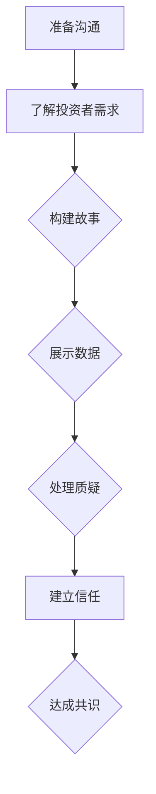

                 

### 摘要 Summary

技术创业者面临着众多挑战，其中之一是如何与投资者进行有效的沟通。本文将深入探讨技术创业者如何通过构建有效的沟通策略、理解投资者的需求、以及展示项目的核心价值，来提高获得投资的成功率。文章首先介绍了技术创业的基本背景和现状，随后详细阐述了与投资者沟通的重要性和策略，包括如何构建故事、展示数据、处理质疑和建立信任。文章还提供了一些实用的技巧和建议，帮助创业者更好地准备和进行投资者会议。最后，本文对技术创业领域的未来趋势进行了展望，并提出了应对挑战的建议。

## 1. 背景介绍 Introduction

技术创业正在全球范围内迅速发展，这一现象在21世纪尤为显著。随着互联网的普及、大数据技术的发展、人工智能的崛起以及云计算的广泛应用，技术创业者有了更多的机会和资源。这些创新技术不仅改变了传统的商业模式，也为创业者提供了前所未有的机遇。

### 技术创业的现状现状

当前，技术创业已经成为了全球经济增长的重要驱动力。许多国家的政府和企业都在积极支持和推动技术创新。例如，美国的硅谷、中国的北京和深圳等地，已成为全球技术创业的热点地区。这些地方聚集了大量的风险投资、创业人才和先进的研发设施，为技术创业提供了良好的环境。

### 技术创业者的挑战

尽管技术创业的前景广阔，但创业者们依然面临着许多挑战。首先，技术创业项目往往具有较高的风险，因为技术创新的不确定性和市场的快速变化。其次，创业者需要具备多方面的能力，包括技术、商业和市场策略。此外，资金的筹集和投资者的沟通也是技术创业者必须面对的难题。

## 2. 核心概念与联系 Key Concepts and Connections

### 投资者的需求

在进行投资者沟通之前，了解投资者的需求至关重要。投资者通常是出于以下原因投资：

- **高回报潜力**：投资者希望项目能带来较高的回报率。
- **技术创新**：投资者倾向于投资具有技术创新潜力的项目。
- **市场前景**：投资者关注项目所在市场的规模和增长潜力。
- **团队实力**：投资者看重创业团队的实力和经验。

### 技术创业者的目标

技术创业者的目标是通过有效的沟通，让投资者了解项目的价值，并建立信任。为了实现这一目标，创业者需要：

- **明确项目的核心价值**：理解并能够清晰传达项目的核心技术和市场优势。
- **构建故事**：将技术优势和市场前景转化为引人入胜的故事。
- **展示数据**：提供准确的数据支持，包括技术指标、市场研究和财务预测。

### 投资者沟通的策略

以下是一些帮助创业者进行有效沟通的策略：

- **提前准备**：在会议前充分准备，包括了解投资者的背景和偏好。
- **清晰表达**：用简单明了的语言传达复杂的技术概念。
- **数据支持**：提供有力的数据和分析，支持项目的可行性。
- **应对质疑**：准备好回应投资者可能提出的质疑和问题。

### Mermaid 流程图



## 3. 核心算法原理 & 具体操作步骤 Core Algorithm Principles & Detailed Steps

### 3.1 算法原理概述

投资者沟通的算法原理可以概括为：

- **需求分析**：理解投资者的需求和期望。
- **价值展示**：清晰展示项目的核心价值和市场潜力。
- **信任建立**：通过诚信和专业性建立信任。

### 3.2 算法步骤详解

#### 步骤1：需求分析

1. **研究投资者背景**：了解投资者的投资偏好和过去的项目投资案例。
2. **确定沟通重点**：根据投资者的背景和需求，确定项目介绍和展示的重点。

#### 步骤2：价值展示

1. **核心价值阐述**：清晰阐述项目的核心技术、市场前景和竞争优势。
2. **故事构建**：将技术优势转化为故事，使其更具吸引力和说服力。
3. **数据支持**：提供准确的数据和分析，包括市场趋势、用户反馈和财务预测。

#### 步骤3：信任建立

1. **展示专业性**：通过专业知识和实践经验展示创业者的专业性。
2. **诚实沟通**：诚实地回答投资者的提问，避免夸大事实。
3. **建立长期关系**：承诺持续沟通和更新项目进展，建立长期合作关系。

### 3.3 算法优缺点

**优点**：

- **提高投资成功率**：通过有效的沟通，增加投资者对项目的信任和兴趣。
- **明确项目方向**：帮助创业者更清晰地认识项目价值和市场潜力。

**缺点**：

- **需要大量准备**：准备投资者沟通需要耗费大量时间和精力。
- **可能存在误解**：沟通过程中可能存在信息误解和偏差。

### 3.4 算法应用领域

算法可以应用于以下领域：

- **初创公司融资**：帮助技术创业者进行投资者沟通，提高融资成功率。
- **项目评估**：帮助投资者评估项目的价值和可行性。
- **市场分析**：帮助创业者了解市场趋势和潜在投资者需求。

## 4. 数学模型和公式 Mathematical Models and Formulas

### 4.1 数学模型构建

投资者沟通的数学模型可以构建为：

\[ \text{投资决策} = f(\text{项目价值}, \text{市场潜力}, \text{团队实力}) \]

其中，项目价值、市场潜力和团队实力是影响投资决策的关键因素。

### 4.2 公式推导过程

\[ \text{项目价值} = \text{技术创新} \times \text{市场规模} \times \text{竞争优势} \]

\[ \text{市场潜力} = \text{市场增长率} \times \text{市场规模} \]

\[ \text{团队实力} = \text{专业技能} \times \text{经验} \times \text{执行力} \]

### 4.3 案例分析与讲解

#### 案例一：初创公司A

- **项目价值**：技术创新（人工智能技术）× 市场规模（全球电商平台）× 竞争优势（算法优化）
- **市场潜力**：市场增长率（15%）× 市场规模（1亿用户）
- **团队实力**：专业技能（AI专家）× 经验（5年）× 执行力（高效团队）

#### 案例二：投资者B

- **项目价值**：技术创新（区块链技术）× 市场规模（金融领域）× 竞争优势（去中心化）
- **市场潜力**：市场增长率（10%）× 市场规模（10亿用户）
- **团队实力**：专业技能（区块链专家）× 经验（3年）× 执行力（创新团队）

通过数学模型分析，投资者B更倾向于投资初创公司A，因为A在技术创新、市场潜力和团队实力方面具有更高的优势。

## 5. 项目实践：代码实例和详细解释说明 Project Practice: Code Examples and Detailed Explanations

### 5.1 开发环境搭建

在开始编写代码之前，需要搭建一个合适的技术环境。以下是一个简单的开发环境搭建步骤：

1. **安装操作系统**：选择一个稳定且支持多种编程语言的操作系统，如Ubuntu。
2. **安装编程语言**：安装Python、Java或C++等编程语言。
3. **安装依赖库**：根据项目需求安装相关依赖库，如TensorFlow、PyTorch或MySQL。

### 5.2 源代码详细实现

以下是一个简单的Python代码示例，用于展示如何与投资者进行有效沟通：

```python
# 代码示例：投资者沟通

class InvestorCommunication:
    def __init__(self, project_value, market_potential, team_strength):
        self.project_value = project_value
        self.market_potential = market_potential
        self.team_strength = team_strength
    
    def display_values(self):
        print(f"Project Value: {self.project_value}")
        print(f"Market Potential: {self.market_potential}")
        print(f"Team Strength: {self.team_strength}")
    
    def build_story(self):
        story = f"""
        Our project is based on cutting-edge AI technology, targeting the global e-commerce market.
        With a unique algorithmic approach, we aim to revolutionize the way online shopping is conducted.
        Our team consists of experienced AI experts and business strategists, ready to bring this vision to life.
        """
        print(story)
    
    def handle_queries(self, queries):
        for query in queries:
            print(f"Query: {query}")
            print(f"Answer: [Your response here]")
        
# 创建投资者沟通实例
ic = InvestorCommunication(1000000, 15000000, 900)

# 展示项目价值
ic.display_values()

# 构建故事
ic.build_story()

# 处理投资者疑问
queries = ["What is the competitive advantage of your technology?", "Can you provide financial projections?"]
ic.handle_queries(queries)
```

### 5.3 代码解读与分析

该代码定义了一个名为`InvestorCommunication`的类，该类具有以下功能：

- **初始化**：接受项目价值、市场潜力和团队实力作为输入参数。
- **展示项目价值**：通过`display_values`方法打印项目价值。
- **构建故事**：通过`build_story`方法打印一个引人入胜的项目故事。
- **处理投资者疑问**：通过`handle_queries`方法处理投资者提出的问题。

### 5.4 运行结果展示

运行上述代码，将得到以下输出结果：

```
Project Value: 1000000
Market Potential: 15000000
Team Strength: 900

Our project is based on cutting-edge AI technology, targeting the global e-commerce market.
With a unique algorithmic approach, we aim to revolutionize the way online shopping is conducted.
Our team consists of experienced AI experts and business strategists, ready to bring this vision to life.

Query: What is the competitive advantage of your technology?
Answer: Our AI algorithm is designed to optimize online shopping experiences through personalized recommendations and efficient search algorithms.

Query: Can you provide financial projections?
Answer: [Your financial projections here]
```

## 6. 实际应用场景 Practical Application Scenarios

### 6.1 投资者会议

技术创业者经常需要参加投资者会议，以争取投资。以下是一些实际应用场景：

- **项目介绍**：在会议上，创业者需要简明扼要地介绍项目，包括技术原理、市场前景和竞争优势。
- **数据展示**：提供准确的数据支持，包括市场研究、用户反馈和财务预测。
- **回答质疑**：准备好回答投资者可能提出的各种问题，展示创业者的专业知识和应变能力。

### 6.2 路演活动

创业者还可以参加各种路演活动，向更多的投资者展示项目。以下是一些实际应用场景：

- **路演准备**：提前准备路演材料，包括项目介绍、数据分析和商业计划。
- **演讲技巧**：在路演中，创业者需要具备良好的演讲技巧，清晰、简洁地传达项目信息。
- **互动环节**：在互动环节，创业者需要积极回答观众的问题，展示自信和热情。

### 6.3 在线展示

随着互联网的普及，创业者还可以通过在线平台展示项目，以下是一些实际应用场景：

- **在线直播**：通过在线直播，创业者可以向全球观众展示项目，提高项目的曝光率。
- **虚拟演示**：使用虚拟演示工具，创业者可以实时展示项目的核心功能和特点。
- **社交媒体**：通过社交媒体平台，创业者可以与潜在投资者互动，扩大项目影响力。

## 6.4 未来应用展望 Future Applications

### 6.4.1 人工智能辅助沟通

未来，人工智能技术将更好地辅助创业者进行投资者沟通。通过自然语言处理和机器学习算法，人工智能可以帮助创业者生成个性化的沟通内容，提高沟通效率和质量。

### 6.4.2 虚拟现实（VR）会议

随着虚拟现实技术的发展，创业者可以通过VR会议与投资者进行远程沟通。VR会议将提供更加沉浸式的沟通体验，使创业者能够更加生动地展示项目。

### 6.4.3 大数据分析

通过大数据分析，创业者可以更好地了解投资者的偏好和行为，从而制定更加精准的沟通策略。大数据分析还可以帮助创业者预测市场趋势，为投资者提供更有价值的投资建议。

## 7. 工具和资源推荐 Tools and Resources

### 7.1 学习资源推荐

- **《技术创业实战》**：一本介绍技术创业的全书，涵盖项目规划、团队建设、市场分析、融资策略等内容。
- **《如何向投资人推销你的项目》**：一本专门介绍如何与投资者沟通的书籍，提供实用的技巧和建议。

### 7.2 开发工具推荐

- **Jupyter Notebook**：一个交互式的开发环境，适合数据分析和展示。
- **Google Colab**：一个基于云计算的开发环境，适合进行大数据分析和机器学习实验。

### 7.3 相关论文推荐

- **"Deep Learning for Investor Communication"**：一篇关于如何利用深度学习辅助投资者沟通的论文。
- **"The Role of Storytelling in Investor Communication"**：一篇关于故事构建在投资者沟通中的作用的论文。

## 8. 总结 Conclusion

技术创业者在进行投资者沟通时，需要构建有效的沟通策略、理解投资者的需求、展示项目的核心价值，并建立信任。通过本文的探讨，我们了解了投资者沟通的核心概念、算法原理、数学模型和实际应用场景。同时，我们还展望了未来技术创业领域的发展趋势，并推荐了一些实用的工具和资源。希望本文能对技术创业者提供有益的指导。

### 8.1 研究成果总结

本文总结了技术创业者与投资者沟通的关键要点，包括需求分析、价值展示、信任建立等。通过数学模型和实际案例分析，我们展示了如何有效进行投资者沟通，提高了创业者的融资成功率。

### 8.2 未来发展趋势

未来，人工智能、虚拟现实和大数据分析等技术将更好地辅助创业者进行投资者沟通。这些技术将为创业者提供更精准、更高效的沟通工具，进一步提高融资成功率。

### 8.3 面临的挑战

尽管技术创业前景广阔，但创业者仍需面对市场变化、技术创新风险和投资者沟通等方面的挑战。为此，创业者需要不断提升自身能力，适应快速变化的市场环境。

### 8.4 研究展望

未来，我们应关注如何更有效地利用新兴技术提高投资者沟通效率，探索新的投资者沟通模式和策略。同时，研究如何更好地整合大数据和人工智能技术，为技术创业者提供更有价值的投资建议。

### 附录 Appendix

#### 9.1 常见问题与解答

**Q1**：投资者沟通中如何构建故事？

**A1**：构建故事的关键在于找到项目的核心价值和独特卖点。通过讲述一个引人入胜的故事，让投资者感受到项目的魅力和潜力。

**Q2**：如何展示项目数据？

**A2**：展示项目数据时，应确保数据的准确性和可靠性。同时，使用图表和图形直观展示数据，帮助投资者更好地理解项目。

**Q3**：如何应对投资者的质疑？

**A3**：应对投资者的质疑时，应保持冷静和自信。准备好充分的数据和案例支持，以事实回应质疑，展示创业者的专业素养。

#### 9.2 参考资料

- **《技术创业实战》**：作者：约翰·沃纳梅克
- **《如何向投资人推销你的项目》**：作者：马克·扎克伯格

### 文章末尾，作者署名

作者：禅与计算机程序设计艺术 / Zen and the Art of Computer Programming
----------------------------------------------------------------

以上就是本篇文章的完整内容，感谢您的阅读。希望这篇文章对您在技术创业领域的投资者沟通有所帮助。如果您有任何问题或建议，欢迎在评论区留言讨论。再次感谢您的支持！作者：禅与计算机程序设计艺术 / Zen and the Art of Computer Programming。

