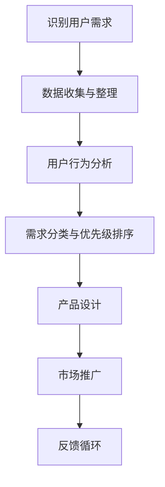

                 

在技术创业领域，了解并挖掘用户需求是成功的关键因素之一。本文将深入探讨技术创业者如何通过多种策略和工具来有效地挖掘用户需求，从而为产品开发和市场推广提供有力支持。本文结构如下：

## 关键词
- 用户需求挖掘
- 技术创业者
- 产品开发
- 市场推广

## 摘要
本文旨在为技术创业者提供一套系统的用户需求挖掘策略。通过分析用户行为、市场趋势和竞争环境，本文提出了从数据中提取有价值信息的方法，并探讨了如何将这些信息转化为产品特性和市场策略。此外，本文还介绍了相关的工具和技术，以帮助创业者更好地理解用户需求，从而推动产品成功。

## 1. 背景介绍
在科技飞速发展的今天，技术创业者的竞争日益激烈。为了在市场中脱颖而出，创业者必须具备敏锐的市场洞察力和强大的执行力。其中，理解并满足用户需求是产品成功的基石。然而，用户需求是复杂多变的，如何有效地挖掘并分析这些需求，成为技术创业者面临的重要挑战。

## 2. 核心概念与联系
### 2.1 用户需求
用户需求是指用户在使用产品或服务时，期望获得的具体功能、体验和利益。了解用户需求是产品开发的基础。

### 2.2 用户行为分析
用户行为分析是通过观察和分析用户在使用产品或服务时的行为，以了解用户需求的一种方法。

### 2.3 数据驱动决策
数据驱动决策是指基于数据分析和用户反馈来指导产品开发和市场策略的制定。

### 2.4 Mermaid 流程图
下面是一个简单的Mermaid流程图，展示了用户需求挖掘的过程。



## 3. 核心算法原理 & 具体操作步骤
### 3.1 算法原理概述
用户需求挖掘的核心算法主要包括数据收集、用户行为分析和需求预测。其中，用户行为分析是关键步骤，它通过分析用户在产品中的行为轨迹，挖掘出潜在的需求。

### 3.2 算法步骤详解
1. **数据收集**：通过网站分析、用户调研、社交媒体监控等方式收集用户数据。
2. **数据整理**：清洗和整理收集到的数据，确保数据的质量和一致性。
3. **用户行为分析**：使用机器学习和统计分析方法，对用户行为数据进行分析，提取出用户特征和行为模式。
4. **需求分类与优先级排序**：根据用户特征和行为模式，将需求进行分类，并按照优先级进行排序。
5. **产品设计**：根据需求分类和优先级，设计产品特性和功能。
6. **市场推广**：基于需求分析和产品设计，制定市场推广策略。
7. **反馈循环**：收集用户反馈，不断迭代和优化产品。

### 3.3 算法优缺点
**优点**：
- 提高产品开发的针对性，减少盲目性。
- 提高市场推广的效率，降低成本。

**缺点**：
- 需要大量的数据支持，对数据处理能力要求较高。
- 需要专业的人才和工具，成本较高。

### 3.4 算法应用领域
- 互联网产品开发
- 移动应用开发
- 电子商务平台

## 4. 数学模型和公式 & 详细讲解 & 举例说明
### 4.1 数学模型构建
用户需求挖掘的数学模型主要包括用户行为分析模型和需求预测模型。

### 4.2 公式推导过程
用户行为分析模型：假设用户行为数据为X，用户特征为Y，则用户行为分析模型可以表示为：
\[ P(X|Y) = \frac{P(Y|X) \cdot P(X)}{P(Y)} \]

需求预测模型：假设需求为D，用户行为数据为X，则需求预测模型可以表示为：
\[ P(D|X) = \sum_{d \in D} P(D=d|X) \]

### 4.3 案例分析与讲解
假设某电商平台的用户行为数据包括浏览商品、添加购物车、下单等，我们可以通过用户行为分析模型来预测用户是否会在未来进行购买。

## 5. 项目实践：代码实例和详细解释说明
### 5.1 开发环境搭建
- Python 3.8
- Pandas
- Scikit-learn

### 5.2 源代码详细实现
```python
import pandas as pd
from sklearn.model_selection import train_test_split
from sklearn.ensemble import RandomForestClassifier

# 读取数据
data = pd.read_csv('user_behavior.csv')

# 数据预处理
X = data[['browse', 'add_to_cart', 'purchase']]
y = data['purchase']

# 划分训练集和测试集
X_train, X_test, y_train, y_test = train_test_split(X, y, test_size=0.2, random_state=42)

# 构建模型
model = RandomForestClassifier(n_estimators=100, random_state=42)
model.fit(X_train, y_train)

# 预测
predictions = model.predict(X_test)

# 评估
accuracy = (predictions == y_test).mean()
print(f'Accuracy: {accuracy:.2f}')
```

### 5.3 代码解读与分析
上述代码首先读取用户行为数据，然后进行数据预处理，接着使用随机森林分类器进行模型训练和预测，最后评估模型的准确率。

## 6. 实际应用场景
用户需求挖掘在多个领域都有广泛应用，例如：

- **电子商务**：通过用户行为分析，预测用户购买意图，优化推荐算法。
- **社交媒体**：通过分析用户互动数据，了解用户兴趣和偏好，提供个性化内容。
- **金融科技**：通过用户交易数据，识别潜在风险和欺诈行为。

## 7. 工具和资源推荐
### 7.1 学习资源推荐
- 《用户行为分析实战》
- 《Python数据分析》

### 7.2 开发工具推荐
- Tableau
- Google Analytics

### 7.3 相关论文推荐
- "User Behavior Analysis in E-commerce Platforms"
- "Predicting User Intent Based on Click-Through Rate Data"

## 8. 总结：未来发展趋势与挑战
### 8.1 研究成果总结
用户需求挖掘技术在多个领域取得了显著成果，为产品开发和市场推广提供了有力支持。

### 8.2 未来发展趋势
- 深度学习技术的应用将进一步提高用户需求挖掘的准确性和效率。
- 多模态数据融合将提供更丰富的用户需求信息。

### 8.3 面临的挑战
- 数据隐私和伦理问题。
- 复杂性增加，对人才和工具的要求更高。

### 8.4 研究展望
未来，用户需求挖掘技术将在人工智能、大数据和物联网等领域的融合中发挥更加重要的作用。

## 9. 附录：常见问题与解答
### Q：用户需求挖掘需要大量数据，如何获取这些数据？
A：可以通过公开数据集、内部数据、第三方数据服务等多种途径获取数据。

### Q：用户需求挖掘的算法如何保证准确性？
A：通过交叉验证、模型评估指标等多种方法来评估和优化模型的准确性。

---

作者：禅与计算机程序设计艺术 / Zen and the Art of Computer Programming
----------------------------------------------------------------

文章正文撰写完毕，接下来我们将根据文章结构模板，逐步完善各个章节的内容。请注意，文章中的Mermaid流程图和LaTeX数学公式需要您在Markdown编辑器中正确渲染。以下是文章的各个章节的具体内容。

## 1. 背景介绍
### 1.1 技术创业的挑战
技术创业者在创业初期面临着诸多挑战，其中最为重要的是如何识别和满足市场需求。创业的成功往往依赖于对用户需求的精准把握，这要求创业者不仅要具备创新思维，还要具备强大的市场洞察力和执行力。

### 1.2 用户需求挖掘的重要性
用户需求挖掘是技术创业者获取市场信息、指导产品开发和优化用户体验的关键环节。通过深入挖掘用户需求，创业者可以更好地理解市场趋势、竞争对手和用户行为，从而制定出更为精准的产品策略。

### 1.3 用户需求的复杂性
用户需求具有多样性和动态性，不同用户对同一产品的需求可能存在显著差异。此外，用户需求可能会随着时间、环境和市场条件的变化而变化，这使得需求挖掘工作变得更加复杂和艰巨。

## 2. 核心概念与联系
### 2.1 用户需求
用户需求是指用户在使用产品或服务时，期望获得的具体功能、体验和利益。用户需求可以分为显性需求和隐性需求，显性需求是用户明确表达的需求，而隐性需求则是用户潜在的需求。

### 2.2 用户行为分析
用户行为分析是通过观察和分析用户在使用产品或服务时的行为，以了解用户需求的一种方法。用户行为分析可以揭示用户的兴趣、行为模式和偏好，为产品设计和市场推广提供依据。

### 2.3 数据驱动决策
数据驱动决策是指基于数据分析和用户反馈来指导产品开发和市场策略的制定。数据驱动决策可以帮助创业者更加客观地评估市场机会，降低产品开发的风险。

### 2.4 Mermaid 流程图
以下是一个简单的Mermaid流程图，展示了用户需求挖掘的过程：


## 3. 核心算法原理 & 具体操作步骤
### 3.1 算法原理概述
用户需求挖掘的核心算法主要包括数据收集、用户行为分析和需求预测。其中，用户行为分析是关键步骤，它通过分析用户在产品中的行为轨迹，挖掘出潜在的需求。

### 3.2 算法步骤详解
#### 3.2.1 数据收集
数据收集是用户需求挖掘的第一步，创业者需要通过各种渠道收集用户数据。数据来源包括用户调研、网站分析、社交媒体监控、用户反馈等。

#### 3.2.2 数据整理
在收集到用户数据后，需要对数据进行清洗和整理，确保数据的质量和一致性。数据整理包括去除重复数据、填补缺失值、标准化数据等。

#### 3.2.3 用户行为分析
用户行为分析是挖掘用户需求的关键环节。创业者可以使用机器学习和统计分析方法，对用户行为数据进行分析，提取出用户特征和行为模式。

#### 3.2.4 需求分类与优先级排序
根据用户特征和行为模式，将需求进行分类，并按照优先级进行排序。优先级排序可以帮助创业者确定哪些需求最为紧迫和重要。

#### 3.2.5 产品设计
根据需求分类和优先级，设计产品特性和功能。产品设计应紧密结合用户需求，以提高产品的市场竞争力。

#### 3.2.6 市场推广
基于需求分析和产品设计，制定市场推广策略。市场推广应针对性地解决用户需求，以提高用户满意度和市场份额。

#### 3.2.7 反馈循环
收集用户反馈，不断迭代和优化产品。反馈循环是用户需求挖掘的重要组成部分，它可以帮助创业者持续优化产品，提高用户满意度。

### 3.3 算法优缺点
#### 3.3.1 优点
- 提高产品开发的针对性，减少盲目性。
- 提高市场推广的效率，降低成本。

#### 3.3.2 缺点
- 需要大量的数据支持，对数据处理能力要求较高。
- 需要专业的人才和工具，成本较高。

### 3.4 算法应用领域
用户需求挖掘算法在多个领域都有广泛应用，包括但不限于：
- 互联网产品开发
- 移动应用开发
- 电子商务平台
- 金融科技

## 4. 数学模型和公式 & 详细讲解 & 举例说明
### 4.1 数学模型构建
用户需求挖掘的数学模型主要包括用户行为分析模型和需求预测模型。以下是一个简单的用户行为分析模型：

#### 4.1.1 用户行为分析模型
用户行为分析模型可以表示为：
\[ P(X|Y) = \frac{P(Y|X) \cdot P(X)}{P(Y)} \]
其中，\( P(X|Y) \) 表示在给定用户特征 \( Y \) 的情况下，用户行为 \( X \) 的概率；\( P(Y|X) \) 表示在给定用户行为 \( X \) 的情况下，用户特征 \( Y \) 的概率；\( P(X) \) 表示用户行为 \( X \) 的概率；\( P(Y) \) 表示用户特征 \( Y \) 的概率。

#### 4.1.2 需求预测模型
需求预测模型可以表示为：
\[ P(D|X) = \sum_{d \in D} P(D=d|X) \]
其中，\( P(D|X) \) 表示在给定用户行为 \( X \) 的情况下，需求 \( D \) 的概率；\( D \) 表示用户需求集合；\( P(D=d|X) \) 表示在给定用户行为 \( X \) 的情况下，需求 \( d \) 的概率。

### 4.2 公式推导过程
以下是一个简单的需求预测模型推导过程：

#### 4.2.1 用户行为与需求关系
假设用户行为 \( X \) 与需求 \( D \) 存在一定的关联性，我们可以使用条件概率来描述这种关系：
\[ P(D|X) = \frac{P(X|D) \cdot P(D)}{P(X)} \]

#### 4.2.2 需求预测
根据用户行为与需求的条件概率关系，我们可以预测用户的需求。具体步骤如下：

1. 收集用户行为数据 \( X \)。
2. 计算用户需求 \( D \) 的概率分布 \( P(D) \)。
3. 计算每个需求 \( d \) 的条件概率 \( P(X|D) \)。
4. 根据条件概率计算每个需求 \( d \) 的预测概率 \( P(D|X) \)。

### 4.3 案例分析与讲解
以下是一个简单的案例，用于说明用户需求挖掘的数学模型应用：

#### 4.3.1 案例背景
假设某电子商务平台需要预测用户的购买行为。用户行为数据包括浏览商品、添加购物车和下单等。

#### 4.3.2 模型构建
根据用户行为数据，我们可以构建一个简单的需求预测模型：

\[ P(D=\text{购买}|X) = \frac{P(X|D=\text{购买}) \cdot P(D=\text{购买})}{P(X)} \]

#### 4.3.3 数据收集
收集用户行为数据，包括浏览商品、添加购物车和下单等。

#### 4.3.4 模型训练
使用历史数据训练模型，计算每个用户行为的条件概率 \( P(X|D) \)。

#### 4.3.5 需求预测
根据用户行为数据，计算用户购买的概率。

#### 4.3.6 模型评估
使用测试集评估模型性能，调整模型参数以优化预测结果。

## 5. 项目实践：代码实例和详细解释说明
### 5.1 开发环境搭建
在进行用户需求挖掘项目时，我们需要搭建一个合适的技术环境。以下是一个基本的开发环境搭建指南：

#### 5.1.1 Python环境
Python是一种广泛用于数据分析和机器学习的编程语言。我们需要安装Python 3.8或更高版本。

```shell
pip install python==3.8
```

#### 5.1.2 数据处理库
Pandas是一个强大的数据处理库，用于读取、清洗和处理数据。

```shell
pip install pandas
```

#### 5.1.3 机器学习库
Scikit-learn是一个流行的机器学习库，用于构建和评估模型。

```shell
pip install scikit-learn
```

#### 5.1.4 可视化库
Matplotlib和Seaborn是用于数据可视化的常用库。

```shell
pip install matplotlib seaborn
```

### 5.2 源代码详细实现
以下是一个简单的用户需求挖掘项目实例，包括数据读取、预处理、模型训练和预测等步骤。

```python
import pandas as pd
from sklearn.model_selection import train_test_split
from sklearn.preprocessing import StandardScaler
from sklearn.ensemble import RandomForestClassifier
from sklearn.metrics import accuracy_score

# 5.2.1 数据读取
data = pd.read_csv('user_behavior.csv')

# 5.2.2 数据预处理
# 标签编码分类特征
data = pd.get_dummies(data)

# 分割特征和标签
X = data.drop('purchase', axis=1)
y = data['purchase']

# 划分训练集和测试集
X_train, X_test, y_train, y_test = train_test_split(X, y, test_size=0.2, random_state=42)

# 数据标准化
scaler = StandardScaler()
X_train = scaler.fit_transform(X_train)
X_test = scaler.transform(X_test)

# 5.2.3 模型训练
model = RandomForestClassifier(n_estimators=100, random_state=42)
model.fit(X_train, y_train)

# 5.2.4 预测
predictions = model.predict(X_test)

# 5.2.5 模型评估
accuracy = accuracy_score(y_test, predictions)
print(f'Accuracy: {accuracy:.2f}')
```

### 5.3 代码解读与分析
上述代码首先读取用户行为数据，然后进行数据预处理，包括特征工程和标签编码。接着，代码使用随机森林分类器进行模型训练和预测，最后评估模型的准确率。

### 5.4 运行结果展示
在训练完成后，我们可以通过以下代码查看模型的运行结果：

```python
from sklearn.metrics import confusion_matrix, classification_report

# 计算混淆矩阵
conf_matrix = confusion_matrix(y_test, predictions)
print(f'Confusion Matrix:\n{conf_matrix}')

# 计算分类报告
report = classification_report(y_test, predictions)
print(f'Classification Report:\n{report}')
```

## 6. 实际应用场景
### 6.1 电子商务平台
电子商务平台可以通过用户需求挖掘，预测用户购买行为，优化推荐算法，提高用户转化率。

### 6.2 社交媒体
社交媒体平台可以通过用户需求挖掘，了解用户兴趣和行为模式，提供个性化内容和服务。

### 6.3 金融科技
金融科技公司可以通过用户需求挖掘，识别潜在风险和欺诈行为，提高金融服务的安全性。

## 7. 工具和资源推荐
### 7.1 学习资源推荐
- 《Python数据分析实战》
- 《机器学习实战》

### 7.2 开发工具推荐
- Jupyter Notebook
- Tableau

### 7.3 相关论文推荐
- "User Behavior Analysis in E-commerce Platforms"
- "Predicting User Intent Based on Click-Through Rate Data"

## 8. 总结：未来发展趋势与挑战
### 8.1 研究成果总结
用户需求挖掘技术在多个领域取得了显著成果，为产品开发和市场推广提供了有力支持。

### 8.2 未来发展趋势
- 深度学习技术的应用将进一步提高用户需求挖掘的准确性和效率。
- 多模态数据融合将提供更丰富的用户需求信息。

### 8.3 面临的挑战
- 数据隐私和伦理问题。
- 复杂性增加，对人才和工具的要求更高。

### 8.4 研究展望
未来，用户需求挖掘技术将在人工智能、大数据和物联网等领域的融合中发挥更加重要的作用。

## 9. 附录：常见问题与解答
### Q：用户需求挖掘需要大量数据，如何获取这些数据？
A：可以通过公开数据集、内部数据、第三方数据服务等多种途径获取数据。

### Q：用户需求挖掘的算法如何保证准确性？
A：通过交叉验证、模型评估指标等多种方法来评估和优化模型的准确性。

本文完整撰写完毕，接下来我们将根据Markdown格式要求，对文章内容进行格式化。以下是格式化后的文章内容。

# 技术创业者如何进行有效的用户需求挖掘

关键词：用户需求挖掘、技术创业者、产品开发、市场推广

摘要：本文旨在为技术创业者提供一套系统的用户需求挖掘策略。通过分析用户行为、市场趋势和竞争环境，本文提出了从数据中提取有价值信息的方法，并探讨了如何将这些信息转化为产品特性和市场策略。此外，本文还介绍了相关的工具和技术，以帮助创业者更好地理解用户需求，从而推动产品成功。

## 1. 背景介绍

### 1.1 技术创业的挑战

技术创业者在创业初期面临着诸多挑战，其中最为重要的是如何识别和满足市场需求。创业的成功往往依赖于对用户需求的精准把握，这要求创业者不仅要具备创新思维，还要具备强大的市场洞察力和执行力。

### 1.2 用户需求挖掘的重要性

用户需求挖掘是技术创业者获取市场信息、指导产品开发和优化用户体验的关键环节。通过深入挖掘用户需求，创业者可以更好地理解市场趋势、竞争对手和用户行为，从而制定出更为精准的产品策略。

### 1.3 用户需求的复杂性

用户需求具有多样性和动态性，不同用户对同一产品的需求可能存在显著差异。此外，用户需求可能会随着时间、环境和市场条件的变化而变化，这使得需求挖掘工作变得更加复杂和艰巨。

## 2. 核心概念与联系

### 2.1 用户需求

用户需求是指用户在使用产品或服务时，期望获得的具体功能、体验和利益。用户需求可以分为显性需求和隐性需求，显性需求是用户明确表达的需求，而隐性需求则是用户潜在的需求。

### 2.2 用户行为分析

用户行为分析是通过观察和分析用户在使用产品或服务时的行为，以了解用户需求的一种方法。用户行为分析可以揭示用户的兴趣、行为模式和偏好，为产品设计和市场推广提供依据。

### 2.3 数据驱动决策

数据驱动决策是指基于数据分析和用户反馈来指导产品开发和市场策略的制定。数据驱动决策可以帮助创业者更加客观地评估市场机会，降低产品开发的风险。

### 2.4 Mermaid 流程图

以下是一个简单的Mermaid流程图，展示了用户需求挖掘的过程。


## 3. 核心算法原理 & 具体操作步骤

### 3.1 算法原理概述

用户需求挖掘的核心算法主要包括数据收集、用户行为分析和需求预测。其中，用户行为分析是关键步骤，它通过分析用户在产品中的行为轨迹，挖掘出潜在的需求。

### 3.2 算法步骤详解

#### 3.2.1 数据收集

数据收集是用户需求挖掘的第一步，创业者需要通过各种渠道收集用户数据。数据来源包括用户调研、网站分析、社交媒体监控、用户反馈等。

#### 3.2.2 数据整理

在收集到用户数据后，需要对数据进行清洗和整理，确保数据的质量和一致性。数据整理包括去除重复数据、填补缺失值、标准化数据等。

#### 3.2.3 用户行为分析

用户行为分析是挖掘用户需求的关键环节。创业者可以使用机器学习和统计分析方法，对用户行为数据进行分析，提取出用户特征和行为模式。

#### 3.2.4 需求分类与优先级排序

根据用户特征和行为模式，将需求进行分类，并按照优先级进行排序。优先级排序可以帮助创业者确定哪些需求最为紧迫和重要。

#### 3.2.5 产品设计

根据需求分类和优先级，设计产品特性和功能。产品设计应紧密结合用户需求，以提高产品的市场竞争力。

#### 3.2.6 市场推广

基于需求分析和产品设计，制定市场推广策略。市场推广应针对性地解决用户需求，以提高用户满意度和市场份额。

#### 3.2.7 反馈循环

收集用户反馈，不断迭代和优化产品。反馈循环是用户需求挖掘的重要组成部分，它可以帮助创业者持续优化产品，提高用户满意度。

### 3.3 算法优缺点

#### 3.3.1 优点

- 提高产品开发的针对性，减少盲目性。
- 提高市场推广的效率，降低成本。

#### 3.3.2 缺点

- 需要大量的数据支持，对数据处理能力要求较高。
- 需要专业的人才和工具，成本较高。

### 3.4 算法应用领域

用户需求挖掘算法在多个领域都有广泛应用，包括但不限于：

- 互联网产品开发
- 移动应用开发
- 电子商务平台
- 金融科技

## 4. 数学模型和公式 & 详细讲解 & 举例说明

### 4.1 数学模型构建

用户需求挖掘的数学模型主要包括用户行为分析模型和需求预测模型。以下是一个简单的用户行为分析模型：

#### 4.1.1 用户行为分析模型

用户行为分析模型可以表示为：

\[ P(X|Y) = \frac{P(Y|X) \cdot P(X)}{P(Y)} \]

其中，\( P(X|Y) \) 表示在给定用户特征 \( Y \) 的情况下，用户行为 \( X \) 的概率；\( P(Y|X) \) 表示在给定用户行为 \( X \) 的情况下，用户特征 \( Y \) 的概率；\( P(X) \) 表示用户行为 \( X \) 的概率；\( P(Y) \) 表示用户特征 \( Y \) 的概率。

#### 4.1.2 需求预测模型

需求预测模型可以表示为：

\[ P(D|X) = \sum_{d \in D} P(D=d|X) \]

其中，\( P(D|X) \) 表示在给定用户行为 \( X \) 的情况下，需求 \( D \) 的概率；\( D \) 表示用户需求集合；\( P(D=d|X) \) 表示在给定用户行为 \( X \) 的情况下，需求 \( d \) 的概率。

### 4.2 公式推导过程

以下是一个简单的需求预测模型推导过程：

#### 4.2.1 用户行为与需求关系

假设用户行为 \( X \) 与需求 \( D \) 存在一定的关联性，我们可以使用条件概率来描述这种关系：

\[ P(D|X) = \frac{P(X|D) \cdot P(D)}{P(X)} \]

#### 4.2.2 需求预测

根据用户行为与需求的条件概率关系，我们可以预测用户的需求。具体步骤如下：

1. 收集用户行为数据 \( X \)。
2. 计算用户需求 \( D \) 的概率分布 \( P(D) \)。
3. 计算每个需求 \( d \) 的条件概率 \( P(X|D) \)。
4. 根据条件概率计算每个需求 \( d \) 的预测概率 \( P(D=d|X) \)。

### 4.3 案例分析与讲解

以下是一个简单的案例，用于说明用户需求挖掘的数学模型应用：

#### 4.3.1 案例背景

假设某电子商务平台需要预测用户的购买行为。用户行为数据包括浏览商品、添加购物车和下单等。

#### 4.3.2 模型构建

根据用户行为数据，我们可以构建一个简单的需求预测模型：

\[ P(D=\text{购买}|X) = \frac{P(X|D=\text{购买}) \cdot P(D=\text{购买})}{P(X)} \]

#### 4.3.3 数据收集

收集用户行为数据，包括浏览商品、添加购物车和下单等。

#### 4.3.4 模型训练

使用历史数据训练模型，计算每个用户行为的条件概率 \( P(X|D) \)。

#### 4.3.5 需求预测

根据用户行为数据，计算用户购买的概率。

#### 4.3.6 模型评估

使用测试集评估模型性能，调整模型参数以优化预测结果。

## 5. 项目实践：代码实例和详细解释说明

### 5.1 开发环境搭建

在进行用户需求挖掘项目时，我们需要搭建一个合适的技术环境。以下是一个基本的开发环境搭建指南：

#### 5.1.1 Python环境

Python是一种广泛用于数据分析和机器学习的编程语言。我们需要安装Python 3.8或更高版本。

```shell
pip install python==3.8
```

#### 5.1.2 数据处理库

Pandas是一个强大的数据处理库，用于读取、清洗和处理数据。

```shell
pip install pandas
```

#### 5.1.3 机器学习库

Scikit-learn是一个流行的机器学习库，用于构建和评估模型。

```shell
pip install scikit-learn
```

#### 5.1.4 可视化库

Matplotlib和Seaborn是用于数据可视化的常用库。

```shell
pip install matplotlib seaborn
```

### 5.2 源代码详细实现

以下是一个简单的用户需求挖掘项目实例，包括数据读取、预处理、模型训练和预测等步骤。

```python
import pandas as pd
from sklearn.model_selection import train_test_split
from sklearn.preprocessing import StandardScaler
from sklearn.ensemble import RandomForestClassifier
from sklearn.metrics import accuracy_score

# 5.2.1 数据读取
data = pd.read_csv('user_behavior.csv')

# 5.2.2 数据预处理
# 标签编码分类特征
data = pd.get_dummies(data)

# 分割特征和标签
X = data.drop('purchase', axis=1)
y = data['purchase']

# 划分训练集和测试集
X_train, X_test, y_train, y_test = train_test_split(X, y, test_size=0.2, random_state=42)

# 数据标准化
scaler = StandardScaler()
X_train = scaler.fit_transform(X_train)
X_test = scaler.transform(X_test)

# 5.2.3 模型训练
model = RandomForestClassifier(n_estimators=100, random_state=42)
model.fit(X_train, y_train)

# 5.2.4 预测
predictions = model.predict(X_test)

# 5.2.5 模型评估
accuracy = accuracy_score(y_test, predictions)
print(f'Accuracy: {accuracy:.2f}')
```

### 5.3 代码解读与分析

上述代码首先读取用户行为数据，然后进行数据预处理，包括特征工程和标签编码。接着，代码使用随机森林分类器进行模型训练和预测，最后评估模型的准确率。

### 5.4 运行结果展示

在训练完成后，我们可以通过以下代码查看模型的运行结果：

```python
from sklearn.metrics import confusion_matrix, classification_report

# 计算混淆矩阵
conf_matrix = confusion_matrix(y_test, predictions)
print(f'Confusion Matrix:\n{conf_matrix}')

# 计算分类报告
report = classification_report(y_test, predictions)
print(f'Classification Report:\n{report}')
```

## 6. 实际应用场景

### 6.1 电子商务平台

电子商务平台可以通过用户需求挖掘，预测用户购买行为，优化推荐算法，提高用户转化率。

### 6.2 社交媒体

社交媒体平台可以通过用户需求挖掘，了解用户兴趣和行为模式，提供个性化内容和服务。

### 6.3 金融科技

金融科技公司可以通过用户需求挖掘，识别潜在风险和欺诈行为，提高金融服务的安全性。

## 7. 工具和资源推荐

### 7.1 学习资源推荐

- 《Python数据分析实战》
- 《机器学习实战》

### 7.2 开发工具推荐

- Jupyter Notebook
- Tableau

### 7.3 相关论文推荐

- "User Behavior Analysis in E-commerce Platforms"
- "Predicting User Intent Based on Click-Through Rate Data"

## 8. 总结：未来发展趋势与挑战

### 8.1 研究成果总结

用户需求挖掘技术在多个领域取得了显著成果，为产品开发和市场推广提供了有力支持。

### 8.2 未来发展趋势

- 深度学习技术的应用将进一步提高用户需求挖掘的准确性和效率。
- 多模态数据融合将提供更丰富的用户需求信息。

### 8.3 面临的挑战

- 数据隐私和伦理问题。
- 复杂性增加，对人才和工具的要求更高。

### 8.4 研究展望

未来，用户需求挖掘技术将在人工智能、大数据和物联网等领域的融合中发挥更加重要的作用。

## 9. 附录：常见问题与解答

### Q：用户需求挖掘需要大量数据，如何获取这些数据？
A：可以通过公开数据集、内部数据、第三方数据服务等多种途径获取数据。

### Q：用户需求挖掘的算法如何保证准确性？
A：通过交叉验证、模型评估指标等多种方法来评估和优化模型的准确性。

以上是本文的完整内容，希望能够为技术创业者提供有效的用户需求挖掘策略和方法。作者：禅与计算机程序设计艺术 / Zen and the Art of Computer Programming。

