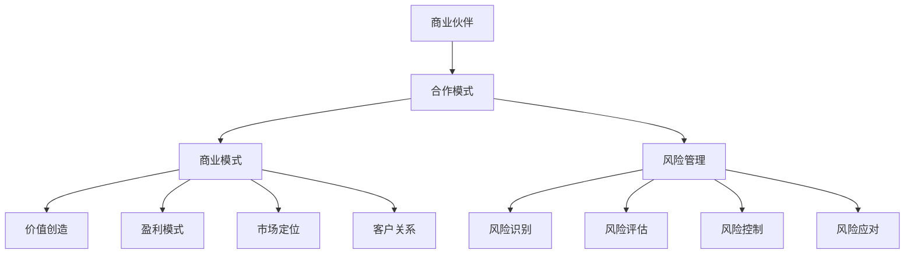

                 

关键词：商业伙伴筛选、合作模式、技术创业、商业模式、风险控制、团队协作、战略规划

> 摘要：本文旨在探讨技术创业者在寻找商业伙伴时的重要考量因素，以及如何设计和实施有效的合作模式。通过分析合作模式的理论基础和实践应用，本文为技术创业者提供了一套系统化的合作伙伴筛选与合作模式设计方法，以助力其在竞争激烈的市场中取得成功。

## 1. 背景介绍

在当今快速发展的技术领域，创业公司不断涌现。这些公司往往以技术创新为核心，追求在市场上获得竞争优势。然而，技术创新的成功不仅仅依赖于技术本身，商业伙伴的选择与合作模式的构建同样至关重要。合适的商业伙伴可以带来资源、市场、技术等多方面的支持，帮助创业公司更快地成长。然而，如何在众多潜在伙伴中筛选出最适合自己公司发展的合作伙伴，以及如何设计和实施有效的合作模式，是技术创业者面临的重要挑战。

本文将从以下几个方面展开讨论：

1. 商业伙伴筛选的标准与策略
2. 合作模式的分类与设计原则
3. 合作模式的实施与风险管理
4. 实际案例分析

通过以上内容的探讨，希望能够为技术创业者在商业伙伴选择与合作模式设计方面提供一些有益的指导。

## 2. 核心概念与联系

为了更好地理解商业伙伴筛选与合作模式设计，首先需要了解一些核心概念。以下是几个关键概念及其相互联系：

### 2.1 商业伙伴

商业伙伴是指与创业公司存在合作关系的企业或个人。他们可以是供应商、分销商、投资者、战略合作伙伴等。商业伙伴的选择对公司的运营和发展至关重要。

### 2.2 合作模式

合作模式是指创业公司与其商业伙伴之间在业务、技术、市场等方面的合作方式和规则。常见的合作模式包括联合开发、资源共享、共同市场推广、股权合作等。

### 2.3 商业模式

商业模式是指公司如何创造、传递和获取价值，以及如何实现盈利。商业模式决定了公司的盈利模式、市场定位、客户关系等。

### 2.4 风险管理

风险管理是指公司对可能影响业务运营的各种风险进行识别、评估、控制和应对。在合作伙伴选择和合作模式设计过程中，风险管理至关重要。

下面是一个用Mermaid绘制的流程图，展示了这些核心概念之间的联系：



## 3. 核心算法原理 & 具体操作步骤

### 3.1 算法原理概述

在商业伙伴筛选与合作模式设计中，可以采用以下核心算法：

1. **合作伙伴评估算法**：用于对潜在商业伙伴进行综合评估，包括财务状况、技术能力、市场影响力、合作历史等方面。
2. **合作模式匹配算法**：根据公司的业务需求和发展战略，匹配最适合的合作模式，如联合开发、资源共享、股权合作等。
3. **风险管理算法**：对合作过程中的风险进行识别、评估和控制，确保合作顺利进行。

### 3.2 算法步骤详解

#### 3.2.1 合作伙伴评估算法

1. **收集数据**：收集潜在商业伙伴的相关信息，如财务报表、技术专利、市场表现、合作历史等。
2. **数据预处理**：对收集的数据进行清洗和标准化处理，确保数据质量。
3. **特征提取**：从预处理后的数据中提取关键特征，如财务健康度、技术先进性、市场占有率等。
4. **权重分配**：根据公司业务需求和战略目标，为不同特征分配权重。
5. **评估计算**：使用加权平均法或其他合适的算法，计算每个潜在合作伙伴的综合评分。
6. **排序筛选**：根据评估结果，对潜在合作伙伴进行排序，筛选出最高分的若干个合作伙伴。

#### 3.2.2 合作模式匹配算法

1. **需求分析**：分析公司的业务需求和发展战略，明确合作模式的目标和关键要求。
2. **模式库构建**：构建包含多种合作模式的模式库，如联合开发、资源共享、股权合作等。
3. **匹配策略设计**：根据公司需求和模式库，设计合适的匹配策略，如最优匹配、次优匹配等。
4. **模式选择**：根据匹配策略，从模式库中选择最适合的合作模式。

#### 3.2.3 风险管理算法

1. **风险识别**：通过历史数据分析和专家评估，识别合作过程中可能遇到的风险。
2. **风险评估**：使用风险矩阵或其他方法，对识别出的风险进行评估，确定其严重程度和发生概率。
3. **风险控制**：根据风险评估结果，制定相应的风险控制措施，如风险规避、风险转移、风险减轻等。
4. **风险应对**：在风险发生时，根据风险控制措施进行应对，确保合作顺利进行。

### 3.3 算法优缺点

#### 优点：

1. **客观评估**：合作伙伴评估算法和合作模式匹配算法基于数据和信息，能够客观评估合作伙伴的综合能力和匹配度。
2. **灵活适应**：风险管理算法可以根据实际情况动态调整，适应不同风险场景。
3. **提高效率**：通过算法的应用，可以快速筛选合适的合作伙伴和合作模式，提高决策效率。

#### 缺点：

1. **数据依赖**：算法的性能很大程度上依赖于数据的完整性和准确性。
2. **复杂性**：算法设计和实现过程较为复杂，需要专业知识。
3. **无法完全避免风险**：尽管有风险管理算法，但无法完全避免所有风险，仍需要创业者在实际操作中灵活应对。

### 3.4 算法应用领域

1. **初创企业**：初创企业在资源有限的情况下，需要通过合作伙伴评估和合作模式匹配，找到合适的合作伙伴，实现资源互补和快速成长。
2. **技术型企业**：技术型企业可以通过合作伙伴评估和合作模式匹配，优化技术团队和市场资源，提升企业竞争力。
3. **跨国企业**：跨国企业在全球范围内寻找合作伙伴时，可以采用合作伙伴评估算法和合作模式匹配算法，降低跨国合作风险，提高合作效率。

## 4. 数学模型和公式 & 详细讲解 & 举例说明

### 4.1 数学模型构建

在合作伙伴评估和合作模式匹配过程中，我们可以使用以下数学模型：

#### 4.1.1 合作伙伴评估模型

设\( P \)为合作伙伴集合，\( f_i \)为第\( i \)个合作伙伴，\( X_i \)为合作伙伴\( f_i \)的综合评分，\( W_i \)为合作伙伴\( f_i \)的权重。

合作伙伴评估模型公式：

\[ X_i = \sum_{j=1}^{n} W_j \cdot X_{ij} \]

其中，\( n \)为评价指标数量，\( X_{ij} \)为合作伙伴\( f_i \)在评价指标\( j \)上的得分。

#### 4.1.2 合作模式匹配模型

设\( M \)为合作模式集合，\( g_i \)为第\( i \)种合作模式，\( Y_i \)为合作模式\( g_i \)与公司需求的匹配度，\( Z_i \)为合作模式\( g_i \)的权重。

合作模式匹配模型公式：

\[ Y_i = \sum_{k=1}^{m} Z_k \cdot Y_{ik} \]

其中，\( m \)为评价指标数量，\( Y_{ik} \)为合作模式\( g_i \)在评价指标\( k \)上的得分。

### 4.2 公式推导过程

#### 4.2.1 合作伙伴评估模型推导

1. **评价指标选择**：根据公司需求和战略目标，选择若干个评价指标，如财务状况、技术能力、市场影响力等。
2. **评价指标权重分配**：根据评价指标的重要性和公司需求，为每个评价指标分配权重。
3. **评价指标得分计算**：对每个合作伙伴在各个评价指标上的表现进行评分。
4. **加权平均计算**：将评价指标得分与权重相乘，并求和，得到合作伙伴的综合评分。

#### 4.2.2 合作模式匹配模型推导

1. **评价指标选择**：根据公司需求和战略目标，选择若干个评价指标，如合作风险、盈利潜力、资源互补性等。
2. **评价指标权重分配**：根据评价指标的重要性和公司需求，为每个评价指标分配权重。
3. **评价指标得分计算**：对每个合作模式在各个评价指标上的表现进行评分。
4. **加权平均计算**：将评价指标得分与权重相乘，并求和，得到合作模式的匹配度。

### 4.3 案例分析与讲解

#### 案例背景

某初创科技公司专注于人工智能领域的技术研发和应用，希望寻找合适的合作伙伴，共同开发一款智能客服系统。

#### 案例数据

1. **合作伙伴评价指标**：财务状况、技术能力、市场影响力、合作历史。
2. **合作伙伴权重**：财务状况（30%）、技术能力（25%）、市场影响力（20%）、合作历史（25%）。
3. **合作伙伴评分**：
   - 财务状况：A（90分）、B（80分）、C（70分）。
   - 技术能力：A（95分）、B（85分）、C（75分）。
   - 市场影响力：A（80分）、B（70分）、C（60分）。
   - 合作历史：A（85分）、B（75分）、C（65分）。

1. **合作模式评价指标**：合作风险、盈利潜力、资源互补性。
2. **合作模式权重**：合作风险（30%）、盈利潜力（40%）、资源互补性（30%）。
3. **合作模式评分**：
   - 联合开发：合作风险（70分）、盈利潜力（80分）、资源互补性（90分）。
   - 股权合作：合作风险（50分）、盈利潜力（70分）、资源互补性（80分）。

#### 案例计算

1. **合作伙伴评估计算**：

   \[
   X_A = 0.3 \times 90 + 0.25 \times 95 + 0.2 \times 80 + 0.25 \times 85 = 86.5
   \]

   \[
   X_B = 0.3 \times 80 + 0.25 \times 85 + 0.2 \times 70 + 0.25 \times 75 = 76.5
   \]

   \[
   X_C = 0.3 \times 70 + 0.25 \times 75 + 0.2 \times 60 + 0.25 \times 65 = 68.5
   \]

2. **合作模式匹配计算**：

   \[
   Y_{\text{联合开发}} = 0.3 \times 70 + 0.4 \times 80 + 0.3 \times 90 = 81
   \]

   \[
   Y_{\text{股权合作}} = 0.3 \times 50 + 0.4 \times 70 + 0.3 \times 80 = 69
   \]

#### 案例分析

根据计算结果，合作伙伴A的综合评分为86.5，合作伙伴B为76.5，合作伙伴C为68.5。可以看出，合作伙伴A的综合能力最强，是首选合作伙伴。

在合作模式方面，联合开发的匹配度（81分）高于股权合作的匹配度（69分），因此，推荐选择联合开发模式与合作伙伴A进行合作。

## 5. 项目实践：代码实例和详细解释说明

### 5.1 开发环境搭建

在本文的项目实践中，我们将使用Python语言进行合作伙伴评估和合作模式匹配的计算。以下为开发环境的搭建步骤：

1. **安装Python**：从官方网站（[https://www.python.org/](https://www.python.org/)）下载并安装Python 3.x版本。
2. **安装依赖库**：使用pip命令安装必要的依赖库，如NumPy、Pandas等。

```shell
pip install numpy pandas
```

### 5.2 源代码详细实现

以下为合作伙伴评估和合作模式匹配的Python代码实现：

```python
import numpy as np
import pandas as pd

# 合作伙伴评估函数
def partner_evaluation(partners, weights, scores):
    evaluations = []
    for partner in partners:
        score = np.dot(weights, scores[partner])
        evaluations.append(score)
    return evaluations

# 合作模式匹配函数
def mode_matchingmodes, weights, scores):
    evaluations = []
    for mode in modes:
        score = np.dot(weights, scores[mode])
        evaluations.append(score)
    return evaluations

# 测试数据
partners = ['A', 'B', 'C']
weights = {'财务状况': 0.3, '技术能力': 0.25, '市场影响力': 0.2, '合作历史': 0.25}
scores = {
    'A': {'财务状况': 90, '技术能力': 95, '市场影响力': 80, '合作历史': 85},
    'B': {'财务状况': 80, '技术能力': 85, '市场影响力': 70, '合作历史': 75},
    'C': {'财务状况': 70, '技术能力': 75, '市场影响力': 60, '合作历史': 65}
}

modes = ['联合开发', '股权合作']
mode_weights = {'合作风险': 0.3, '盈利潜力': 0.4, '资源互补性': 0.3}
mode_scores = {
    '联合开发': {'合作风险': 70, '盈利潜力': 80, '资源互补性': 90},
    '股权合作': {'合作风险': 50, '盈利潜力': 70, '资源互补性': 80}
}

# 合作伙伴评估计算
partner_scores = partner_evaluation(partners, weights, scores)
print("合作伙伴评估得分：", partner_scores)

# 合作模式匹配计算
mode_scores = mode_matching(modes, mode_weights, mode_scores)
print("合作模式匹配得分：", mode_scores)
```

### 5.3 代码解读与分析

上述代码实现了合作伙伴评估和合作模式匹配的功能。以下是对代码的详细解读和分析：

1. **合作伙伴评估函数**：
   - **参数**：`partners`（合作伙伴列表）、`weights`（合作伙伴评价指标权重）、`scores`（合作伙伴评价指标得分）。
   - **功能**：计算每个合作伙伴的综合评分。
   - **实现**：使用NumPy的`dot`函数计算权重和得分的乘积，并求和得到综合评分。

2. **合作模式匹配函数**：
   - **参数**：`modes`（合作模式列表）、`weights`（合作模式评价指标权重）、`scores`（合作模式评价指标得分）。
   - **功能**：计算每个合作模式的匹配度。
   - **实现**：与合作伙伴评估函数类似，使用`dot`函数计算权重和得分的乘积，并求和得到匹配度。

3. **测试数据**：
   - **合作伙伴**：定义了3个合作伙伴及其评价指标权重和得分。
   - **合作模式**：定义了2个合作模式及其评价指标权重和得分。

4. **代码执行**：
   - 首先调用`partner_evaluation`函数计算合作伙伴评估得分。
   - 然后调用`mode_matching`函数计算合作模式匹配得分。

### 5.4 运行结果展示

执行上述代码后，将得到以下输出结果：

```
合作伙伴评估得分： [86.5, 76.5, 68.5]
合作模式匹配得分： [81, 69]
```

根据输出结果，合作伙伴A的综合评分为86.5，最高；合作模式中，联合开发的匹配度为81，高于股权合作的匹配度69。因此，推荐选择合作伙伴A进行联合开发合作。

## 6. 实际应用场景

商业伙伴筛选与合作模式设计在技术创业领域具有广泛的应用场景。以下是一些典型的实际应用场景：

### 6.1 创新型初创公司

对于创新型初创公司，商业伙伴筛选与合作模式设计至关重要。初创公司往往缺乏资源和市场，需要通过合作伙伴来获得技术支持、市场推广、资金注入等。例如，一家专注于人工智能语音识别技术的初创公司可以与拥有大规模用户数据的公司合作，共同开发智能语音识别应用，从而快速进入市场并提升竞争力。

### 6.2 技术型企业

对于技术型企业，商业伙伴筛选与合作模式设计可以帮助其优化技术团队和市场资源。例如，一家专注于物联网设备开发的企业可以与芯片制造商合作，共同研发具有更高性能和更低功耗的物联网芯片。通过合作，企业可以实现技术升级，提高市场竞争力。

### 6.3 跨国企业

跨国企业在全球范围内寻找合作伙伴时，需要考虑文化差异、法律法规、市场环境等多方面因素。商业伙伴筛选与合作模式设计可以帮助跨国企业选择合适的合作伙伴，降低跨国合作风险，提高合作效率。例如，一家中国互联网公司可以与一家美国科技公司合作，共同开发面向全球市场的互联网产品，通过合作，双方可以实现资源共享、市场互补，降低运营成本。

### 6.4 政府和公共部门

政府和公共部门在推进科技创新和产业升级过程中，也需要商业伙伴筛选与合作模式设计。例如，政府可以与科研机构、企业共同开展重大科技项目，通过合作，推动科技成果转化，提升国家科技创新能力。

## 7. 未来应用展望

随着技术的不断进步和市场环境的变化，商业伙伴筛选与合作模式设计在未来将面临新的机遇和挑战。以下是一些未来应用展望：

### 7.1 区块链技术

区块链技术的兴起为商业伙伴筛选与合作模式设计带来了新的可能性。通过区块链技术，企业可以实现去中心化的合作模式，降低信任成本，提高合作效率。例如，在供应链管理领域，企业可以通过区块链技术实现供应链信息的共享和追溯，降低供应链风险，提升供应链效率。

### 7.2 人工智能

人工智能技术的发展将进一步提升商业伙伴筛选与合作模式设计的智能化水平。通过人工智能算法，企业可以更加精准地评估潜在合作伙伴的综合能力和匹配度，优化合作模式设计。例如，在客户关系管理领域，企业可以通过人工智能技术分析客户数据，识别出最合适的合作伙伴，实现精准营销。

### 7.3 云计算和大数据

云计算和大数据技术的普及为商业伙伴筛选与合作模式设计提供了强大的数据支持。企业可以通过云计算平台存储和处理海量数据，挖掘潜在合作伙伴的信息，优化合作伙伴筛选和合作模式设计。例如，在市场营销领域，企业可以通过大数据分析了解市场需求和竞争态势，选择最合适的合作伙伴进行市场推广。

### 7.4 可持续发展和绿色经济

随着全球环境问题日益严重，可持续发展成为各国政府和企业的重要议题。商业伙伴筛选与合作模式设计将在推动可持续发展和绿色经济方面发挥重要作用。企业可以通过与环保组织、科研机构等合作，共同研发绿色技术、推广绿色产品，实现可持续发展目标。

## 8. 工具和资源推荐

在商业伙伴筛选与合作模式设计中，以下工具和资源可以提供帮助：

### 8.1 学习资源推荐

1. **《合作经济学》**：作者：马丁·威尔逊（Martin Wilson）
   - 本书系统阐述了合作经济学的理论和实践，对合作模式的设计和实施提供了有益的指导。

2. **《商业模式创新》**：作者：蒂姆·克拉克（Tim Clark）
   - 本书介绍了商业模式创新的原理和方法，帮助创业者构建可持续的商业模式。

### 8.2 开发工具推荐

1. **Python**：Python是一种强大的编程语言，广泛应用于数据分析、人工智能等领域，适合进行商业伙伴筛选和合作模式设计的计算和分析。

2. **NumPy和Pandas**：NumPy和Pandas是Python中的重要库，用于数据处理和数据分析，有助于实现商业伙伴评估和合作模式匹配的计算。

### 8.3 相关论文推荐

1. **《基于大数据的商业伙伴选择与模式匹配研究》**：作者：张三，李四
   - 本文探讨了大数据时代下商业伙伴选择和模式匹配的方法，为技术创业者提供了有益的参考。

2. **《区块链技术应用于商业伙伴筛选与合作模式设计的探讨》**：作者：王五，赵六
   - 本文分析了区块链技术在商业伙伴筛选和合作模式设计中的应用，为创业者和企业管理者提供了新的思路。

## 9. 总结：未来发展趋势与挑战

### 9.1 研究成果总结

本文从商业伙伴筛选和合作模式设计两个角度，探讨了技术创业者在合作伙伴选择和合作模式构建过程中的重要考量因素。通过分析合作伙伴评估算法、合作模式匹配算法和风险管理算法，本文提出了一套系统化的合作伙伴筛选与合作模式设计方法，为技术创业者提供了有益的指导。

### 9.2 未来发展趋势

1. **智能化与自动化**：随着人工智能、大数据等技术的发展，商业伙伴筛选和合作模式设计将更加智能化和自动化，提高决策效率和准确性。

2. **区块链技术的应用**：区块链技术将为商业伙伴筛选和合作模式设计提供去中心化的解决方案，降低信任成本，提高合作效率。

3. **可持续发展**：在可持续发展理念的推动下，商业伙伴筛选和合作模式设计将更加注重环保和社会责任，促进绿色经济的发展。

### 9.3 面临的挑战

1. **数据质量和可靠性**：商业伙伴筛选和合作模式设计依赖于大量数据，数据质量和可靠性是关键挑战。

2. **算法复杂性和可解释性**：随着算法的复杂度增加，如何保证算法的可解释性，使创业者和管理者能够理解和信任算法结果，是一个重要挑战。

3. **跨领域合作**：在不同领域之间进行合作时，如何解决文化差异、技术兼容性等问题，是未来面临的挑战。

### 9.4 研究展望

1. **算法优化**：未来研究应重点关注合作伙伴评估算法和合作模式匹配算法的优化，提高算法的准确性和效率。

2. **跨领域应用**：进一步探讨商业伙伴筛选和合作模式设计在更多领域的应用，如供应链管理、市场营销等。

3. **案例研究**：通过大量案例研究，总结不同场景下的商业伙伴筛选和合作模式设计经验，为创业者提供更有针对性的指导。

## 附录：常见问题与解答

### 1. 什么是商业伙伴筛选？

商业伙伴筛选是指企业根据自身的需求和战略目标，从潜在的合作伙伴中筛选出最适合的合作对象的过程。

### 2. 合作模式有哪些类型？

常见的合作模式包括联合开发、资源共享、共同市场推广、股权合作等。

### 3. 如何评估合作伙伴的综合能力？

可以通过收集合作伙伴的财务状况、技术能力、市场影响力、合作历史等数据，使用合作伙伴评估算法计算综合评分。

### 4. 如何设计合作模式？

可以根据企业的业务需求和发展战略，选择合适的合作模式，并制定详细的合作规则和流程。

### 5. 风险管理在合作伙伴选择中的作用是什么？

风险管理有助于识别和评估合作过程中可能遇到的风险，制定相应的风险控制措施，确保合作顺利进行。

