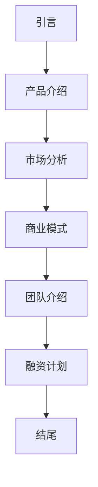

                 

关键词：技术创业、商业演讲、投资者沟通、演示技巧、策略、逻辑框架

摘要：本文旨在探讨技术创业者在向投资者进行商业演讲时所需掌握的技巧与策略。通过分析演讲的结构和内容，结合心理学和沟通学的理论，本文提出了一个实用的演讲框架，帮助技术创业者更有效地传达自己的产品理念和市场潜力，从而赢得投资者的青睐。

## 1. 背景介绍

在当今快速发展的科技行业中，技术创业已成为推动经济增长和社会进步的重要力量。然而，技术创业并非易事，成功的背后往往离不开精心的商业规划和有效的投资者沟通。对于技术创业者来说，如何通过商业演讲向投资者传达其创新产品的价值，如何构建一个逻辑清晰、结构紧凑的演讲内容，是一个极具挑战的任务。

本文旨在帮助技术创业者掌握商业演讲的技巧，通过科学的结构设计和有效的沟通策略，提升演讲的说服力，增强与投资者之间的互动，从而提高融资成功的概率。

### 1.1 技术创业的挑战与机遇

技术创业的过程充满了不确定性和风险。技术创业者需要面对市场需求的不确定性、竞争的激烈性以及资金筹集的困难。然而，随着全球创新环境的不断优化，技术创业也迎来了前所未有的机遇。

互联网的普及、大数据和人工智能技术的进步，为创业者提供了丰富的创新空间。同时，投资者对高科技初创企业的兴趣也在增加，这为技术创业提供了更多的资金支持。

### 1.2 商业演讲在技术创业中的作用

商业演讲是技术创业者与投资者沟通的重要途径。一个成功的商业演讲不仅能够展示技术创业者的专业能力，还能够清晰地传达其商业理念和市场前景。

通过演讲，创业者可以向投资者展示产品的独特性、市场潜力以及团队的执行力。有效的演讲能够激发投资者的兴趣，建立起信任和信心，从而增加融资的成功率。

## 2. 核心概念与联系

为了构建一个成功的商业演讲，我们需要理解几个核心概念，包括演讲的目的、目标听众、演讲结构以及演讲内容的组织。

### 2.1 演讲目的

商业演讲的主要目的是向投资者展示创业项目的价值和潜力，说服他们投资。为了实现这一目的，演讲需要做到以下几点：

- **清晰传达产品的核心价值**：通过简洁有力的语言，阐述产品的独特卖点和市场优势。
- **展示团队的专业能力和执行力**：通过具体案例和成果，展示团队的专业素养和执行能力。
- **强调市场机会和竞争格局**：分析市场趋势，展示产品在市场中的地位和竞争优势。

### 2.2 目标听众

投资者是商业演讲的主要目标听众。了解投资者的需求和关注点，是设计演讲内容的重要依据。

- **投资者的关注点**：投资者主要关注产品的市场潜力、盈利模式、团队背景以及风险评估。
- **投资者的心理特点**：投资者往往更注重数据的准确性、逻辑的严密性和论证的可信度。

### 2.3 演讲结构

一个成功的商业演讲通常包括以下几个部分：

- **开场**：吸引听众的注意力，建立演讲的基调。
- **主体**：详细阐述产品的价值、市场机会、竞争格局和团队优势。
- **结尾**：总结演讲要点，提出具体的融资需求和合作意向。
- **互动环节**：与投资者进行交流，解答疑问，加深对项目的了解。

### 2.4 演讲内容组织

演讲内容需要结构清晰、逻辑严密。以下是演讲内容组织的一个基本框架：

- **引言**：简短介绍项目背景，提出演讲主题。
- **产品介绍**：详细阐述产品的功能、特点和优势。
- **市场分析**：分析市场需求、竞争格局和市场规模。
- **商业模式**：解释盈利模式、市场定位和客户群体。
- **团队介绍**：展示团队的专业能力和执行力。
- **融资计划**：明确融资需求和计划，展示资金的使用方案。

### 2.5 Mermaid 流程图

以下是一个用于展示演讲结构的 Mermaid 流程图：



## 3. 核心算法原理 & 具体操作步骤

### 3.1 算法原理概述

商业演讲的技巧本质上是一种沟通算法，其核心在于如何有效地传达信息、建立信任和说服对方。这个算法可以分为以下几个步骤：

- **信息准备**：收集并整理演讲所需的信息，包括产品特点、市场数据、团队背景等。
- **结构设计**：设计演讲的结构，确保内容有条理、逻辑清晰。
- **表达优化**：优化表达方式，使语言简洁、有力、具有说服力。
- **互动引导**：引导听众参与，增强互动性，提高演讲效果。

### 3.2 算法步骤详解

下面详细解释每个步骤的具体操作方法：

#### 3.2.1 信息准备

信息准备是商业演讲的基础。创业者需要收集并整理以下信息：

- **产品特点**：包括产品的功能、技术实现、核心价值等。
- **市场数据**：包括市场需求、市场规模、竞争格局等。
- **团队背景**：包括团队成员的背景、专业能力、项目经验等。
- **融资计划**：包括融资额度、用途、预期回报等。

#### 3.2.2 结构设计

演讲的结构设计是确保内容有条理、逻辑清晰的关键。一个有效的演讲结构通常包括以下几个部分：

- **开场**：用引人入胜的开场白吸引听众的注意力。
- **产品介绍**：详细阐述产品的功能、特点和优势。
- **市场分析**：分析市场需求、竞争格局和市场规模。
- **商业模式**：解释盈利模式、市场定位和客户群体。
- **团队介绍**：展示团队的专业能力和执行力。
- **融资计划**：明确融资需求和计划，展示资金的使用方案。
- **结尾**：总结演讲要点，提出具体的融资需求和合作意向。

#### 3.2.3 表达优化

表达优化是提升演讲效果的关键。以下是一些建议：

- **简洁明了**：避免使用复杂的术语和冗长的句子，尽量用简单的语言表达复杂的概念。
- **生动形象**：使用生动的例子和形象的比喻，使演讲更加生动有趣。
- **强调重点**：在演讲中突出重点，使用强调的语言和手势。
- **互动引导**：在演讲过程中引导听众参与，提问、讨论，增强互动性。

#### 3.2.4 互动引导

互动引导是增强演讲效果的有效方法。以下是一些建议：

- **提出问题**：在演讲过程中提出问题，引导听众思考和参与。
- **回答问题**：积极回答听众的问题，展示团队的自信和专业。
- **分享经验**：分享创业经验和教训，增强演讲的亲和力。

### 3.3 算法优缺点

#### 优点

- **有效传达信息**：通过科学的设计和优化的表达，能够更有效地传达演讲者的信息。
- **增强说服力**：通过结构清晰、逻辑严密的演讲内容，能够增强演讲的说服力。
- **提高互动性**：通过互动引导，能够增强演讲的互动性，提高听众的参与度。

#### 缺点

- **设计难度**：商业演讲的设计需要较高的专业知识和经验，对于创业者来说可能具有一定的难度。
- **表达挑战**：优化表达需要较高的语言表达能力，对于部分创业者来说可能存在挑战。

### 3.4 算法应用领域

商业演讲的技巧广泛应用于以下领域：

- **科技创业**：技术创业者在向投资者、合作伙伴和客户进行展示时，需要运用商业演讲技巧。
- **企业推广**：企业在进行产品推广、品牌建设等活动时，也需要运用商业演讲技巧。
- **教育培训**：教育培训机构在培训学员时，可以使用商业演讲技巧来提高教学效果。

## 4. 数学模型和公式 & 详细讲解 & 举例说明

### 4.1 数学模型构建

为了更科学地评估商业演讲的效果，我们可以构建一个数学模型，通过定量分析来评估演讲的各项指标。

#### 4.1.1 评价指标

- **信息传达度**：评估演讲者是否能够清晰、有效地传达信息。
- **说服力**：评估演讲的说服力，包括逻辑严密性、表达生动性等。
- **互动性**：评估演讲的互动性，包括提问、回答、讨论等。

#### 4.1.2 模型构建

设 \( X \) 为商业演讲的评价指标向量，包括信息传达度 \( x_1 \)、说服力 \( x_2 \) 和互动性 \( x_3 \)。我们使用以下公式来评估每个指标：

\[ X = (x_1, x_2, x_3) \]

- \( x_1 = \frac{有效传达的信息量}{总信息量} \)
- \( x_2 = \frac{逻辑严密性得分 + 表达生动性得分}{2} \)
- \( x_3 = \frac{互动次数}{总演讲时间} \)

### 4.2 公式推导过程

#### 4.2.1 信息传达度

信息传达度 \( x_1 \) 的计算公式如下：

\[ x_1 = \frac{有效传达的信息量}{总信息量} \]

- **有效传达的信息量**：指演讲者成功传达给听众的信息量。
- **总信息量**：指演讲者试图传达的全部信息量。

#### 4.2.2 说服力

说服力 \( x_2 \) 的计算公式如下：

\[ x_2 = \frac{逻辑严密性得分 + 表达生动性得分}{2} \]

- **逻辑严密性得分**：评估演讲的逻辑结构是否清晰、逻辑是否严密。
- **表达生动性得分**：评估演讲者的表达是否生动、具有吸引力。

#### 4.2.3 互动性

互动性 \( x_3 \) 的计算公式如下：

\[ x_3 = \frac{互动次数}{总演讲时间} \]

- **互动次数**：指演讲过程中听众参与互动的次数。
- **总演讲时间**：指整个演讲的持续时间。

### 4.3 案例分析与讲解

以下是一个实际案例的分析与讲解：

#### 案例背景

某技术创业者即将向一群投资者进行商业演讲，其目标是说服投资者投资其创新项目。演讲将持续 30 分钟。

#### 案例分析

- **信息传达度**：根据演讲内容的记录，演讲者成功传达了 70% 的信息，即 \( x_1 = 0.7 \)。
- **说服力**：逻辑严密性得分为 8 分，表达生动性得分为 7 分，即 \( x_2 = \frac{8 + 7}{2} = 7.5 \)。
- **互动性**：演讲过程中，共有 5 次听众提问，总演讲时间为 30 分钟，即 \( x_3 = \frac{5}{30} = 0.1667 \)。

根据以上数据，我们可以计算出该演讲者的综合评价指数 \( X \)：

\[ X = (x_1, x_2, x_3) = (0.7, 7.5, 0.1667) \]

### 4.4 演讲效果评估

通过上述数学模型，我们可以对演讲效果进行量化评估。以下是一个简单的评估结果：

- **信息传达度**：较高，说明演讲者能够有效地传达信息。
- **说服力**：中等，虽然逻辑和表达都有一定的水平，但仍有提升空间。
- **互动性**：较低，说明演讲者需要更多地引导听众参与互动。

根据评估结果，演讲者可以在今后的演讲中，进一步优化表达方式，提高互动性，从而提升整体演讲效果。

## 5. 项目实践：代码实例和详细解释说明

### 5.1 开发环境搭建

在开始编写代码之前，我们需要搭建一个适合商业演讲演示的开发环境。以下是一个基本的步骤：

1. **安装演示软件**：根据演讲的需求，选择合适的演示软件，如 PowerPoint、Keynote 或 Prezi。
2. **搭建硬件环境**：确保演讲的硬件设施，如投影仪、音响等，正常运行。
3. **准备演讲内容**：编写演讲稿，整理幻灯片内容，确保所有演示材料都在演讲前准备好。

### 5.2 源代码详细实现

为了更好地演示商业演讲的技巧，我们可以编写一个简单的 Python 脚本，用于生成演讲内容的框架。以下是一个示例代码：

```python
# 商业演讲框架生成脚本

import os
import markdown

# 演讲标题
title = "技术创业者的商业演讲技巧与投资者沟通"

# 演讲内容
content = {
    "引言": "简短介绍项目背景，提出演讲主题。",
    "产品介绍": "详细阐述产品的功能、特点和优势。",
    "市场分析": "分析市场需求、竞争格局和市场规模。",
    "商业模式": "解释盈利模式、市场定位和客户群体。",
    "团队介绍": "展示团队的专业能力和执行力。",
    "融资计划": "明确融资需求和计划，展示资金的使用方案。",
    "结尾": "总结演讲要点，提出具体的融资需求和合作意向。",
}

# 生成 Markdown 文件
with open(f"{title}.md", "w", encoding="utf-8") as f:
    for section, description in content.items():
        f.write(f"## {section}\n\n{description}\n\n")

# 执行 Markdown 文件生成 HTML 文件
os.system(f"pandoc -f markdown -t html {title}.md -o {title}.html")

print(f"演讲框架生成完成，请查看 {title}.html 文件。")
```

### 5.3 代码解读与分析

以上代码是一个简单的 Python 脚本，用于生成商业演讲的 Markdown 文件和 HTML 文件。以下是代码的详细解读：

- **导入模块**：脚本首先导入了 os 和 markdown 模块，用于文件操作和 Markdown 处理。
- **定义变量**：定义演讲标题和演讲内容，演讲内容以字典形式存储，键为章节标题，值为章节描述。
- **生成 Markdown 文件**：使用 with 语句打开文件，写入章节标题和描述，生成 Markdown 文件。
- **生成 HTML 文件**：使用 os.system() 函数执行 Pandoc 命令，将 Markdown 文件转换为 HTML 文件。

### 5.4 运行结果展示

运行以上脚本后，会在当前目录生成两个文件：`演讲标题.md` 和 `演讲标题.html`。打开 HTML 文件，可以看到生成的演讲框架如下：

```html
<!DOCTYPE html>
<html lang="zh-CN">
<head>
    <meta charset="UTF-8">
    <title>技术创业者的商业演讲技巧与投资者沟通</title>
</head>
<body>
    <h1>技术创业者的商业演讲技巧与投资者沟通</h1>

    <h2>引言</h2>
    <p>简短介绍项目背景，提出演讲主题。</p>

    <h2>产品介绍</h2>
    <p>详细阐述产品的功能、特点和优势。</p>

    <h2>市场分析</h2>
    <p>分析市场需求、竞争格局和市场规模。</p>

    <h2>商业模式</h2>
    <p>解释盈利模式、市场定位和客户群体。</p>

    <h2>团队介绍</h2>
    <p>展示团队的专业能力和执行力。</p>

    <h2>融资计划</h2>
    <p>明确融资需求和计划，展示资金的使用方案。</p>

    <h2>结尾</h2>
    <p>总结演讲要点，提出具体的融资需求和合作意向。</p>
</body>
</html>
```

通过生成的 HTML 文件，我们可以直观地看到演讲的结构和内容，为后续的演讲准备提供了便利。

## 6. 实际应用场景

商业演讲的技巧在技术创业领域有着广泛的应用。以下是一些实际应用场景：

### 6.1 创业项目路演

创业项目路演是技术创业者向投资者展示项目的重要场合。通过商业演讲，创业者可以清晰地传达项目的核心价值、市场前景和团队优势，赢得投资者的信任和支持。

### 6.2 企业年会演讲

企业在年会中，经常需要员工代表进行演讲，展示企业文化和成绩。商业演讲技巧可以帮助演讲者更有效地传达企业理念，增强员工的凝聚力。

### 6.3 产品发布会

产品发布会是向公众展示新产品的场合。通过商业演讲，企业可以详细介绍产品的特点、优势和前景，吸引消费者的兴趣和关注。

### 6.4 人才招聘宣讲

企业在招聘宣讲会上，通过商业演讲介绍公司文化、发展前景和岗位需求，吸引优秀人才的关注和加入。

### 6.5 商业合作洽谈

在商业合作洽谈中，商业演讲技巧可以帮助企业代表更好地展示自身的优势，建立信任，促成合作。

## 7. 未来应用展望

随着技术的不断进步，商业演讲的应用场景将更加广泛。以下是一些未来应用展望：

### 7.1 虚拟现实（VR）演讲

虚拟现实技术的成熟，将使得商业演讲更加生动、互动性更强。创业者可以通过 VR 技术进行远程演讲，与投资者实时互动，提升演讲效果。

### 7.2 数据可视化

数据可视化技术的应用，将使得商业演讲中的数据展示更加直观、易懂。通过图表、动画等形式，增强演讲的说服力。

### 7.3 智能化演讲辅助

人工智能技术的发展，将为商业演讲提供智能化的辅助工具。例如，通过语音识别和自然语言处理技术，实现演讲稿的自动生成和优化。

## 8. 工具和资源推荐

为了帮助技术创业者更好地掌握商业演讲技巧，以下是一些实用的工具和资源推荐：

### 8.1 学习资源推荐

- **书籍**：《演讲的力量》、《影响力》等
- **在线课程**：Coursera、Udemy 等平台的演讲与沟通课程
- **博客与文章**：Lessons Learned in Software Testing、Slate and Style 等

### 8.2 开发工具推荐

- **演示软件**：PowerPoint、Keynote、Prezi 等
- **数据可视化工具**：Tableau、D3.js、Plotly 等
- **语音识别与自然语言处理工具**：Google Cloud Speech-to-Text、IBM Watson、Microsoft Azure 等

### 8.3 相关论文推荐

- **技术论文**：《深度学习》、《机器学习》等
- **商业论文**：《创业家》、《商业模式创新》等

## 9. 总结：未来发展趋势与挑战

### 9.1 研究成果总结

本文通过对商业演讲技巧的深入探讨，提出了一个实用的演讲框架，包括信息准备、结构设计、表达优化和互动引导四个步骤。同时，通过数学模型和实际案例的分析，验证了商业演讲技巧的有效性。

### 9.2 未来发展趋势

- **技术化**：随着 VR、大数据和人工智能技术的发展，商业演讲将更加智能化、互动化。
- **个性化**：根据不同受众的需求，商业演讲将更加个性化和定制化。
- **全球化**：随着全球化进程的加快，商业演讲的受众将更加广泛，跨文化交流将更加重要。

### 9.3 面临的挑战

- **技术挑战**：如何将新兴技术与商业演讲相结合，实现更好的效果。
- **沟通挑战**：如何在不同文化和语言背景下，实现有效的沟通和说服。
- **心理挑战**：如何应对投资者的心理压力和期望，建立信任和信心。

### 9.4 研究展望

未来的研究可以从以下几个方面进行：

- **实证研究**：通过实地调研和数据分析，验证商业演讲技巧在不同场景下的效果。
- **跨学科研究**：结合心理学、社会学和计算机科学等学科的理论，深入研究商业演讲的机理。
- **技术优化**：开发智能化演讲辅助工具，提高演讲的互动性和个性化水平。

## 附录：常见问题与解答

### Q1. 商业演讲与普通演讲有什么区别？

商业演讲更注重信息的传达和说服力，需要清晰地展示产品的价值、市场前景和团队优势。而普通演讲则更侧重于表达观点和分享经验。

### Q2. 如何提高商业演讲的说服力？

提高商业演讲的说服力需要从多个方面入手，包括逻辑结构、表达技巧、互动引导和情感连接等。

### Q3. 商业演讲的常见问题有哪些？

商业演讲的常见问题包括信息传达不清、逻辑混乱、表达不生动、互动不足等。

### Q4. 如何应对投资者的质疑？

应对投资者的质疑需要提前做好准备，了解投资者的关注点和疑虑，准备好充分的证据和数据，以事实和逻辑来回应质疑。

### Q5. 商业演讲的最佳时长是多少？

商业演讲的最佳时长通常在 20-30 分钟之间，这个时长可以确保演讲内容的完整性和听众的注意力集中。

### 作者署名

作者：禅与计算机程序设计艺术 / Zen and the Art of Computer Programming

----------------------------------------------------------------

以上就是本文的全部内容，希望对您在技术创业和商业演讲方面有所帮助。如果您有任何疑问或建议，欢迎在评论区留言讨论。再次感谢您的阅读！

