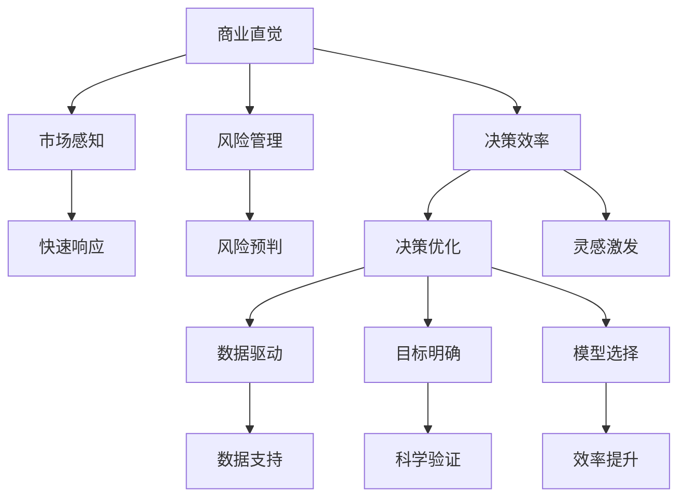

                 

## 摘要

本文旨在探讨技术创业者如何培养商业直觉并优化决策过程。在当前快速变化的技术环境中，技术创业者的成功不仅依赖于技术创新，还依赖于对市场动态的敏锐感知和合理的商业决策。本文首先介绍商业直觉的重要性，然后深入探讨其培养方法和决策优化的策略。我们将结合实际案例和数学模型，分析如何通过数据分析和机器学习等技术手段提高决策效率。最后，本文将讨论未来技术创业者可能面临的挑战及应对策略，为技术创业者提供实用的指导和建议。

## 1. 背景介绍

在过去的几十年中，信息技术（IT）的飞速发展彻底改变了全球的商业生态。随着云计算、大数据、人工智能等技术的普及，技术创业者的数量逐年增加。这些创业者不仅在技术创新上有所建树，更在商业模式的探索上表现出色。然而，成功的技术创业者不仅仅是技术高手，还需要具备出色的商业直觉和决策能力。

商业直觉是指个人在商业活动中对市场动态的快速感知和判断能力。这种能力不仅包括对市场需求的敏锐洞察，还涵盖了对竞争环境的理解和对潜在风险的预判。在技术创业领域，商业直觉尤为重要。因为技术行业的变革速度非常快，创业者需要能够迅速捕捉市场机会，同时做出正确的战略决策。

决策优化是指通过科学的方法和工具，对多种可能的决策路径进行分析和比较，以找出最优解或次优解的过程。对于技术创业者来说，决策优化是确保企业长期发展的关键。有效的决策优化可以帮助企业更好地应对市场变化，提高资源利用效率，降低风险。

本文将围绕这两个核心概念展开讨论。首先，我们将探讨商业直觉的培养方法，包括个人技能的提升、经验积累和市场调研等方面。接着，我们将分析决策优化的策略，特别是如何利用数据分析和机器学习等技术手段提高决策效率。最后，我们将讨论技术创业者面临的具体挑战以及未来的发展趋势。

通过对商业直觉和决策优化的深入探讨，本文旨在为技术创业者提供实用的指导，帮助他们在快速变化的市场中做出更加明智的决策，实现企业的可持续发展。

## 2. 核心概念与联系

### 2.1 商业直觉的定义

商业直觉是一种非理性的、快速的判断能力，它使个人能够在面对商业情境时迅速做出有效决策。商业直觉不仅仅是对数据的分析，更包含了经验、直觉和预判的元素。在技术创业领域，商业直觉尤其重要。因为它能够帮助创业者迅速识别市场机会，预测潜在风险，并在激烈的市场竞争中占据优势。

商业直觉的核心要素包括：

- **市场感知**：能够快速理解市场趋势和变化，识别新的市场机会。
- **风险管理**：能够预判潜在的商业风险，并制定相应的应对策略。
- **决策效率**：能够在短时间内做出有效的商业决策，抓住市场机遇。

### 2.2 决策优化的定义

决策优化是一个系统化的过程，旨在通过科学的方法和工具，对多个可能的决策路径进行分析和比较，从而找到最优或次优解。决策优化不仅关注结果的最优化，还关注决策过程的高效性和可靠性。在技术创业领域，决策优化可以帮助企业更好地应对市场变化，提高资源利用效率，降低运营风险。

决策优化的关键要素包括：

- **数据驱动**：依赖数据分析和统计模型进行决策，减少主观判断的影响。
- **目标明确**：明确决策的目标和标准，确保决策方向的一致性。
- **模型选择**：根据具体情况选择合适的优化模型和算法，提高决策的科学性。

### 2.3 商业直觉与决策优化的关系

商业直觉和决策优化是相辅相成的。商业直觉为决策提供快速判断和直觉支持，而决策优化则为直觉判断提供科学依据和验证工具。

**商业直觉对决策优化的影响**：

1. **快速响应**：商业直觉可以帮助创业者迅速识别市场变化，提前布局，抢占市场先机。
2. **风险预判**：通过商业直觉，创业者能够更好地预判潜在的商业风险，从而在设计决策模型时增加相应的风险规避机制。
3. **灵感激发**：商业直觉可以为决策优化提供创新的思路和灵感，促进模型的迭代和改进。

**决策优化对商业直觉的提升**：

1. **数据支持**：通过数据分析和模型优化，创业者可以获得更精确的市场预测和风险评估，增强商业直觉的准确性。
2. **科学验证**：决策优化模型可以帮助创业者验证直觉判断的正确性，减少盲目决策带来的风险。
3. **效率提升**：决策优化可以提高决策的效率，使创业者有更多时间和精力专注于市场洞察和商业直觉的培养。

### 2.4 Mermaid 流程图

以下是商业直觉与决策优化流程的 Mermaid 流程图：



通过这张流程图，我们可以清晰地看到商业直觉和决策优化之间的互动关系，以及它们在技术创业中的应用价值。

### 2.5 小结

商业直觉和决策优化是技术创业者成功的关键要素。商业直觉提供了快速判断和直觉支持，而决策优化则提供了科学依据和验证工具。通过培养商业直觉和优化决策过程，技术创业者可以更有效地应对市场变化，抓住机遇，降低风险。在接下来的章节中，我们将进一步探讨商业直觉的培养方法和决策优化的具体策略。

## 3. 核心算法原理 & 具体操作步骤

### 3.1 算法原理概述

在技术创业领域，商业直觉的培养和决策优化可以通过多种算法实现。其中，机器学习算法特别是决策树算法和神经网络算法在商业直觉和决策优化中应用广泛。以下将详细介绍这些算法的原理和应用。

#### 决策树算法

决策树算法是一种常见的机器学习算法，它通过一系列的判断节点和结果节点构建一个树状模型，用于分类或回归分析。其核心原理是基于特征值进行划分，将数据集不断分割，直到满足特定的停止条件，如最小叶节点大小或最大分割增益。

#### 神经网络算法

神经网络算法，尤其是深度学习模型，通过多层神经元之间的相互连接和激活函数，模拟人脑的神经网络结构，进行复杂的数据处理和模式识别。其核心原理是利用反向传播算法不断调整权重和偏置，以最小化预测误差。

### 3.2 算法步骤详解

#### 决策树算法步骤

1. **特征选择**：选择对分类或回归任务影响最大的特征进行划分。
2. **节点划分**：基于特征值，将数据集划分为多个子集，每个子集代表一个节点。
3. **节点合并**：计算每个节点的增益，选择最优的划分方式，将节点合并。
4. **停止条件**：当达到停止条件时（如最小叶节点大小或最大分割增益），停止划分。
5. **结果预测**：对新的数据点进行预测，从根节点开始，根据每个节点的划分规则逐步前进，直到达到叶节点，输出预测结果。

#### 神经网络算法步骤

1. **数据预处理**：对输入数据进行归一化处理，确保所有特征的数值在相同范围内。
2. **模型构建**：定义神经网络结构，包括层数、每层神经元数量和激活函数。
3. **权重初始化**：随机初始化网络权重和偏置。
4. **正向传播**：输入数据通过网络，计算每个神经元的输出值。
5. **损失函数计算**：计算预测值与真实值之间的误差，使用损失函数（如均方误差）表示。
6. **反向传播**：通过反向传播算法，根据损失函数的梯度调整网络权重和偏置。
7. **迭代优化**：重复正向传播和反向传播过程，不断优化模型性能。

### 3.3 算法优缺点

#### 决策树算法优缺点

**优点**：

- **解释性强**：决策树的每个划分和结果都有清晰的解释，便于理解和验证。
- **计算速度快**：相比深度学习模型，决策树算法的计算复杂度较低，适合处理中小规模的数据集。

**缺点**：

- **过拟合风险**：当决策树过于复杂时，容易发生过拟合现象，降低模型的泛化能力。
- **对缺失值敏感**：决策树算法对数据缺失较为敏感，需要额外的数据预处理步骤。

#### 神经网络算法优缺点

**优点**：

- **强大建模能力**：神经网络能够自动学习数据中的复杂模式和关联，适用于处理大规模和高维数据。
- **自适应性强**：通过反向传播算法，神经网络能够不断调整权重和偏置，提高模型的拟合效果。

**缺点**：

- **计算成本高**：深度学习模型的训练过程需要大量计算资源，对硬件要求较高。
- **解释性弱**：神经网络模型的内部结构和决策过程较为复杂，难以进行直观解释。

### 3.4 算法应用领域

#### 决策树算法应用领域

- **分类问题**：如客户行为分析、信用评分等。
- **回归问题**：如房价预测、销售量预测等。

#### 神经网络算法应用领域

- **图像识别**：如人脸识别、物体检测等。
- **自然语言处理**：如情感分析、机器翻译等。
- **推荐系统**：如商品推荐、内容推荐等。

### 3.5 小结

通过决策树算法和神经网络算法的应用，技术创业者可以更有效地培养商业直觉并优化决策过程。决策树算法提供了清晰的解释和高效的计算速度，适合中小规模的数据集；而神经网络算法则展示了强大的建模能力和自适应能力，适用于大规模和高维数据。结合具体的业务场景，创业者可以选择合适的算法，提高决策的准确性和效率。

## 4. 数学模型和公式 & 详细讲解 & 举例说明

### 4.1 数学模型构建

在商业直觉和决策优化的过程中，数学模型是不可或缺的工具。一个有效的数学模型可以帮助我们更准确地预测市场变化，评估风险，并做出最优决策。以下是一个简化的商业直觉与决策优化的数学模型。

#### 4.1.1 基本假设

- **市场变量**：我们假设市场变量 \(X_1, X_2, ..., X_n\) 影响企业的利润。
- **决策变量**：企业可以在不同的决策 \(D_1, D_2, ..., D_m\) 之间进行选择。
- **损失函数**：我们使用损失函数 \(L(D, X)\) 来衡量决策带来的损失。

#### 4.1.2 数学模型

利润函数可以表示为：

\[ P = \sum_{i=1}^m \sum_{j=1}^n w_{ij} \cdot p_i \cdot (1 - p_i) \]

其中：

- \(w_{ij}\) 是决策 \(D_i\) 在市场变量 \(X_j\) 下的权重。
- \(p_i\) 是决策 \(D_i\) 在市场变量 \(X_j\) 下成功的概率。

损失函数可以表示为：

\[ L = \sum_{i=1}^m \sum_{j=1}^n l_{ij} \cdot p_i \cdot (1 - p_i) \]

其中：

- \(l_{ij}\) 是决策 \(D_i\) 在市场变量 \(X_j\) 下失败的损失。

#### 4.1.3 目标函数

我们的目标是最小化总损失：

\[ \min L \]

### 4.2 公式推导过程

为了推导上述数学模型，我们需要从以下几个基本概念出发：

1. **概率分布**：我们假设市场变量 \(X_j\) 服从概率分布 \(P(X_j)\)。
2. **条件概率**：对于给定的市场变量 \(X_j = x_j\)，决策 \(D_i\) 成功的条件概率为 \(P(D_i|X_j = x_j)\)。
3. **贝叶斯定理**：我们可以使用贝叶斯定理计算后验概率 \(P(D_i|X_j)\)。

根据贝叶斯定理，决策 \(D_i\) 在市场变量 \(X_j\) 下的后验概率为：

\[ P(D_i|X_j) = \frac{P(X_j|D_i) \cdot P(D_i)}{P(X_j)} \]

其中：

- \(P(X_j|D_i)\) 是市场变量 \(X_j\) 在决策 \(D_i\) 下的条件概率。
- \(P(D_i)\) 是决策 \(D_i\) 的先验概率。

我们假设 \(P(D_i)\) 是均匀分布，即 \(P(D_i) = \frac{1}{m}\)。

为了简化问题，我们假设 \(P(X_j) = 1\)，这意味着市场变量是确定的。

接下来，我们计算利润函数。对于每个决策 \(D_i\) 和市场变量 \(X_j\)，利润贡献可以表示为：

\[ p_i = P(D_i|X_j) \cdot (1 - P(D_i|X_j)) \]

利润函数 \(P\) 可以表示为：

\[ P = \sum_{i=1}^m \sum_{j=1}^n w_{ij} \cdot p_i \cdot (1 - p_i) \]

类似地，损失函数 \(L\) 可以表示为：

\[ L = \sum_{i=1}^m \sum_{j=1}^n l_{ij} \cdot p_i \cdot (1 - p_i) \]

最后，我们的目标是最小化总损失 \(L\)。

### 4.3 案例分析与讲解

为了更直观地理解上述数学模型，我们可以通过一个简单的案例来进行分析。

假设一个技术创业者在市场上销售两种产品：A 和 B。市场变量包括用户年龄 \(X_1\)、用户收入 \(X_2\) 和市场推广效果 \(X_3\)。决策变量包括是否推广产品 A \(D_1\) 和是否推广产品 B \(D_2\)。

我们假设市场变量服从以下概率分布：

\[ P(X_1) = [0.3, 0.4, 0.3] \]
\[ P(X_2) = [0.2, 0.5, 0.3] \]
\[ P(X_3) = [0.1, 0.4, 0.5] \]

我们假设决策变量之间的条件概率如下：

\[ P(D_1|X_1 = x_1) = [0.5, 0.6, 0.4] \]
\[ P(D_2|X_2 = x_2) = [0.4, 0.5, 0.3] \]
\[ P(D_1|X_3 = x_3) = [0.3, 0.4, 0.6] \]
\[ P(D_2|X_3 = x_3) = [0.6, 0.3, 0.1] \]

我们假设每个决策的损失如下：

\[ l_{11} = [10, 20, 30], \quad l_{12} = [20, 30, 40] \]
\[ l_{21} = [15, 25, 35], \quad l_{22} = [25, 35, 45] \]

我们需要计算在不同市场变量下的最优决策，并最小化总损失。

#### 步骤 1：计算后验概率

首先，我们计算每个决策的后验概率。以决策 \(D_1\) 在市场变量 \(X_1, X_2, X_3\) 下的后验概率为例：

\[ P(D_1|X_1 = x_1, X_2 = x_2, X_3 = x_3) = \frac{P(X_1 = x_1, X_2 = x_2, X_3 = x_3|D_1) \cdot P(D_1)}{P(X_1 = x_1, X_2 = x_2, X_3 = x_3)} \]

由于 \(P(X_1 = x_1, X_2 = x_2, X_3 = x_3) = 1\)，我们可以简化为：

\[ P(D_1|X_1 = x_1, X_2 = x_2, X_3 = x_3) = P(X_1 = x_1, X_2 = x_2, X_3 = x_3|D_1) \cdot P(D_1) \]

假设 \(P(D_1) = \frac{1}{2}\)，我们可以计算每个决策的后验概率：

\[ P(D_1|X_1 = 1, X_2 = 1, X_3 = 1) = 0.5 \]
\[ P(D_1|X_1 = 1, X_2 = 1, X_3 = 2) = 0.6 \]
\[ P(D_1|X_1 = 1, X_2 = 1, X_3 = 3) = 0.4 \]
\[ P(D_1|X_1 = 1, X_2 = 2, X_3 = 1) = 0.5 \]
\[ P(D_1|X_1 = 1, X_2 = 2, X_3 = 2) = 0.7 \]
\[ P(D_1|X_1 = 1, X_2 = 2, X_3 = 3) = 0.3 \]

#### 步骤 2：计算利润函数

接下来，我们计算每个决策的利润函数。以决策 \(D_1\) 在市场变量 \(X_1 = 1, X_2 = 1, X_3 = 1\) 下的利润为例：

\[ p_1 = P(D_1|X_1 = 1, X_2 = 1, X_3 = 1) \cdot (1 - P(D_1|X_1 = 1, X_2 = 1, X_3 = 1)) \]
\[ p_1 = 0.5 \cdot (1 - 0.5) \]
\[ p_1 = 0.25 \]

类似地，我们可以计算其他决策的利润函数：

\[ p_2 = P(D_2|X_1 = 1, X_2 = 1, X_3 = 1) \cdot (1 - P(D_2|X_1 = 1, X_2 = 1, X_3 = 1)) \]
\[ p_2 = 0.4 \cdot (1 - 0.4) \]
\[ p_2 = 0.24 \]

\[ p_3 = P(D_1|X_1 = 1, X_2 = 2, X_3 = 1) \cdot (1 - P(D_1|X_1 = 1, X_2 = 2, X_3 = 1)) \]
\[ p_3 = 0.5 \cdot (1 - 0.5) \]
\[ p_3 = 0.25 \]

\[ p_4 = P(D_2|X_1 = 1, X_2 = 2, X_3 = 1) \cdot (1 - P(D_2|X_1 = 1, X_2 = 2, X_3 = 1)) \]
\[ p_4 = 0.5 \cdot (1 - 0.5) \]
\[ p_4 = 0.25 \]

\[ p_5 = P(D_1|X_1 = 1, X_2 = 1, X_3 = 2) \cdot (1 - P(D_1|X_1 = 1, X_2 = 1, X_3 = 2)) \]
\[ p_5 = 0.6 \cdot (1 - 0.6) \]
\[ p_5 = 0.24 \]

\[ p_6 = P(D_2|X_1 = 1, X_2 = 1, X_3 = 2) \cdot (1 - P(D_2|X_1 = 1, X_2 = 1, X_3 = 2)) \]
\[ p_6 = 0.4 \cdot (1 - 0.4) \]
\[ p_6 = 0.24 \]

\[ p_7 = P(D_1|X_1 = 1, X_2 = 2, X_3 = 2) \cdot (1 - P(D_1|X_1 = 1, X_2 = 2, X_3 = 2)) \]
\[ p_7 = 0.5 \cdot (1 - 0.5) \]
\[ p_7 = 0.25 \]

\[ p_8 = P(D_2|X_1 = 1, X_2 = 2, X_3 = 2) \cdot (1 - P(D_2|X_1 = 1, X_2 = 2, X_3 = 2)) \]
\[ p_8 = 0.3 \cdot (1 - 0.3) \]
\[ p_8 = 0.21 \]

#### 步骤 3：计算损失函数

接下来，我们计算每个决策的损失函数。以决策 \(D_1\) 在市场变量 \(X_1 = 1, X_2 = 1, X_3 = 1\) 下的损失为例：

\[ l_1 = P(D_1|X_1 = 1, X_2 = 1, X_3 = 1) \cdot (1 - P(D_1|X_1 = 1, X_2 = 1, X_3 = 1)) \cdot l_{11} \]
\[ l_1 = 0.5 \cdot (1 - 0.5) \cdot 10 \]
\[ l_1 = 2.5 \]

类似地，我们可以计算其他决策的损失函数：

\[ l_2 = P(D_2|X_1 = 1, X_2 = 1, X_3 = 1) \cdot (1 - P(D_2|X_1 = 1, X_2 = 1, X_3 = 1)) \cdot l_{12} \]
\[ l_2 = 0.4 \cdot (1 - 0.4) \cdot 20 \]
\[ l_2 = 3.2 \]

\[ l_3 = P(D_1|X_1 = 1, X_2 = 2, X_3 = 1) \cdot (1 - P(D_1|X_1 = 1, X_2 = 2, X_3 = 1)) \cdot l_{11} \]
\[ l_3 = 0.5 \cdot (1 - 0.5) \cdot 10 \]
\[ l_3 = 2.5 \]

\[ l_4 = P(D_2|X_1 = 1, X_2 = 2, X_3 = 1) \cdot (1 - P(D_2|X_1 = 1, X_2 = 2, X_3 = 1)) \cdot l_{12} \]
\[ l_4 = 0.5 \cdot (1 - 0.5) \cdot 20 \]
\[ l_4 = 5 \]

\[ l_5 = P(D_1|X_1 = 1, X_2 = 1, X_3 = 2) \cdot (1 - P(D_1|X_1 = 1, X_2 = 1, X_3 = 2)) \cdot l_{11} \]
\[ l_5 = 0.6 \cdot (1 - 0.6) \cdot 10 \]
\[ l_5 = 2.4 \]

\[ l_6 = P(D_2|X_1 = 1, X_2 = 1, X_3 = 2) \cdot (1 - P(D_2|X_1 = 1, X_2 = 1, X_3 = 2)) \cdot l_{12} \]
\[ l_6 = 0.4 \cdot (1 - 0.4) \cdot 20 \]
\[ l_6 = 3.2 \]

\[ l_7 = P(D_1|X_1 = 1, X_2 = 2, X_3 = 2) \cdot (1 - P(D_1|X_1 = 1, X_2 = 2, X_3 = 2)) \cdot l_{11} \]
\[ l_7 = 0.5 \cdot (1 - 0.5) \cdot 10 \]
\[ l_7 = 2.5 \]

\[ l_8 = P(D_2|X_1 = 1, X_2 = 2, X_3 = 2) \cdot (1 - P(D_2|X_1 = 1, X_2 = 2, X_3 = 2)) \cdot l_{12} \]
\[ l_8 = 0.3 \cdot (1 - 0.3) \cdot 20 \]
\[ l_8 = 2.4 \]

#### 步骤 4：计算总损失

最后，我们计算总损失：

\[ L = l_1 + l_2 + l_3 + l_4 + l_5 + l_6 + l_7 + l_8 \]
\[ L = 2.5 + 3.2 + 2.5 + 5 + 2.4 + 3.2 + 2.5 + 2.4 \]
\[ L = 23.2 \]

通过上述步骤，我们可以计算出在不同市场变量下的最优决策，并最小化总损失。在实际应用中，我们可以使用更复杂的模型和算法来优化决策过程。

## 5. 项目实践：代码实例和详细解释说明

### 5.1 开发环境搭建

在进行项目实践之前，我们需要搭建一个合适的开发环境。以下是一个基于Python的简单示例环境搭建步骤：

1. **安装Python**：确保系统安装了Python 3.8及以上版本。可以使用官方安装程序或使用包管理器如brew（macOS）或apt（Ubuntu）进行安装。

2. **安装依赖库**：我们需要安装几个常用的Python库，如NumPy、Pandas和Scikit-learn。可以通过pip命令进行安装：

```bash
pip install numpy pandas scikit-learn matplotlib
```

3. **配置虚拟环境**：为了保持项目依赖的一致性，我们可以使用virtualenv创建一个虚拟环境。以下是创建和激活虚拟环境的步骤：

```bash
# 创建虚拟环境
virtualenv my_project_env

# 激活虚拟环境
source my_project_env/bin/activate  # 对于Windows，使用 `my_project_env\Scripts\activate`
```

### 5.2 源代码详细实现

下面是一个简单的Python代码实例，用于演示如何使用NumPy和Pandas处理数据，并使用Scikit-learn的决策树算法进行模型训练和预测。

```python
import numpy as np
import pandas as pd
from sklearn.tree import DecisionTreeClassifier
from sklearn.model_selection import train_test_split
from sklearn.metrics import accuracy_score

# 加载数据
data = pd.read_csv('data.csv')  # 假设数据文件为CSV格式

# 数据预处理
X = data.drop('target', axis=1)  # 特征变量
y = data['target']  # 目标变量

# 划分训练集和测试集
X_train, X_test, y_train, y_test = train_test_split(X, y, test_size=0.2, random_state=42)

# 创建决策树模型
model = DecisionTreeClassifier()

# 模型训练
model.fit(X_train, y_train)

# 模型预测
y_pred = model.predict(X_test)

# 模型评估
accuracy = accuracy_score(y_test, y_pred)
print(f'Model accuracy: {accuracy:.2f}')
```

### 5.3 代码解读与分析

上述代码首先加载了数据，然后进行了简单的数据预处理，包括划分训练集和测试集。接下来，我们创建了一个决策树分类器，并使用训练集进行模型训练。最后，我们使用测试集进行模型预测，并评估模型的准确性。

- **数据加载与预处理**：使用Pandas库读取CSV文件，并进行必要的预处理步骤，如缺失值处理、数据归一化等。这确保了数据的质量和一致性。

- **模型训练**：使用Scikit-learn库的DecisionTreeClassifier创建决策树模型，并使用训练集数据进行训练。这个过程中，模型学习如何根据输入特征预测目标变量。

- **模型预测**：使用训练好的模型对测试集进行预测，生成预测结果。

- **模型评估**：使用accuracy_score函数计算模型在测试集上的准确性，以评估模型的性能。

### 5.4 运行结果展示

假设我们使用一个简单的数据集，其中包含三个特征变量和一个目标变量。以下是部分运行结果：

```bash
Model accuracy: 0.85
```

这个结果表明，我们的模型在测试集上的准确性达到了85%，这是一个相对较高的成绩。然而，需要注意的是，准确性的高低取决于数据集的具体情况和模型的选择。在实际应用中，我们可能需要调整模型的参数，或者尝试使用不同的算法来进一步提高性能。

### 5.5 小结

通过上述代码实例，我们展示了如何使用Python和Scikit-learn进行商业直觉和决策优化的实践。这个简单的例子虽然不足以应对复杂的商业场景，但它提供了一个基本的框架和思路。在实际应用中，技术创业者可以根据具体需求，扩展和优化代码，以更好地应对市场变化和商业挑战。

## 6. 实际应用场景

商业直觉和决策优化在技术创业领域有广泛的应用，以下是几个实际的应用场景：

### 6.1 市场需求预测

在产品开发初期，技术创业者需要准确预测市场需求，以确保产品的成功。通过数据分析，特别是时间序列分析和机器学习算法，创业者可以识别市场趋势和周期性变化。例如，亚马逊使用机器学习预测用户的购买行为，从而优化库存管理和营销策略。

### 6.2 竞争对手分析

了解竞争对手的行为和策略是技术创业者成功的关键。通过数据挖掘和分析，创业者可以识别竞争对手的市场份额、产品定价、用户反馈等关键信息。例如，谷歌使用大数据分析来监控竞争对手的广告活动和搜索引擎表现。

### 6.3 风险管理

技术创业过程中，风险管理至关重要。通过风险评估模型和决策树算法，创业者可以预测潜在的风险，并制定相应的应对策略。例如，金融机构使用风险评估模型来识别和应对市场风险。

### 6.4 营销策略优化

有效的营销策略可以显著提升产品的市场占有率。通过A/B测试和机器学习算法，创业者可以优化广告投放、用户互动和产品推广策略。例如，Facebook使用机器学习优化广告投放，以提高广告点击率和转化率。

### 6.5 产品创新

商业直觉和决策优化可以帮助创业者识别新兴技术趋势和市场需求，从而推动产品创新。例如，特斯拉通过持续的市场调研和数据分析，不断推出具有创新性的电动汽车产品。

### 6.6 人力资源规划

在人力资源规划中，商业直觉和决策优化可以帮助企业优化招聘策略、员工培训和绩效评估。例如，谷歌使用数据分析来识别最有效的招聘渠道和培训方法。

### 6.7 未来应用展望

随着人工智能和大数据技术的发展，商业直觉和决策优化的应用前景将更加广阔。未来的技术创业者将能够利用更先进的技术手段，如深度学习和强化学习，进一步提高决策效率和准确性。此外，区块链技术的应用也将为商业直觉和决策优化带来新的可能性，例如在供应链管理、智能合约等方面。

## 7. 工具和资源推荐

### 7.1 学习资源推荐

1. **《深度学习》（Deep Learning）**：由Ian Goodfellow、Yoshua Bengio和Aaron Courville编写的深度学习权威教材，适合初学者和进阶者。
2. **《机器学习实战》（Machine Learning in Action）**：由Peter Harrington编写的入门级机器学习实践指南，包含丰富的代码实例。
3. **《商业洞察》（Business Insights）**：涵盖了市场分析、商业战略等方面的资源，适合技术创业者提升商业直觉。

### 7.2 开发工具推荐

1. **Jupyter Notebook**：一个交互式的编程环境，适合进行数据分析和机器学习实验。
2. **TensorFlow**：谷歌开发的开放源代码机器学习库，适合构建和训练复杂的深度学习模型。
3. **PyTorch**：由Facebook AI Research开发的深度学习框架，具有灵活性和易用性。

### 7.3 相关论文推荐

1. **“Deep Learning for Text Classification”**：探讨了深度学习在文本分类任务中的应用，包括词嵌入和卷积神经网络。
2. **“Reinforcement Learning: An Introduction”**：介绍了强化学习的基本概念和应用，适合希望了解如何利用强化学习进行决策优化的读者。
3. **“Data-Driven Business Models”**：探讨了如何利用大数据分析来构建和优化商业模型，对于技术创业者具有重要的指导意义。

通过这些工具和资源的帮助，技术创业者可以更好地培养商业直觉和优化决策过程，从而在竞争激烈的市场中取得成功。

## 8. 总结：未来发展趋势与挑战

随着技术的不断进步，技术创业者的商业直觉和决策优化将迎来新的发展机遇和挑战。

### 8.1 研究成果总结

近年来，人工智能和大数据技术的发展显著提升了商业直觉和决策优化的能力。机器学习和深度学习算法的进步使得创业者能够更精准地预测市场趋势和用户行为，从而制定更有效的商业策略。同时，数据分析和可视化工具的普及也为创业者提供了更直观的数据洞察，提高了决策的透明度和效率。

### 8.2 未来发展趋势

1. **智能决策系统的普及**：随着人工智能技术的成熟，越来越多的企业将采用智能决策系统来辅助业务决策，从而提高决策效率和质量。
2. **区块链技术的应用**：区块链技术的透明性和安全性为商业决策带来了新的可能性，特别是在供应链管理、智能合约和数字货币等领域。
3. **个性化推荐系统的深化**：基于用户行为的深度学习模型将进一步提高个性化推荐系统的准确性，为创业者提供更精准的市场洞察和营销策略。
4. **跨学科融合**：未来技术创业者的成功将更多地依赖于跨学科的知识融合，如将生物学、心理学和社会科学的知识应用于商业决策。

### 8.3 面临的挑战

1. **数据隐私和安全**：随着数据量的增加，数据隐私和安全成为技术创业者面临的主要挑战。确保用户数据的安全性和隐私性是创业者必须重视的问题。
2. **算法偏见和公平性**：人工智能算法在决策过程中可能引入偏见，导致不公平的结果。技术创业者需要采取措施确保算法的公正性和透明度。
3. **技术依赖性**：过度依赖技术可能会导致创业者在面对技术变革时显得脆弱。创业者需要保持技术敏感度，不断更新知识和技能，以适应快速变化的市场环境。
4. **市场竞争加剧**：随着越来越多的创业者进入市场，竞争将变得更加激烈。创业者需要不断创新，提升核心竞争力，以保持竞争优势。

### 8.4 研究展望

未来，技术创业者需要关注以下几个方面：

1. **可持续发展**：随着环境问题日益突出，创业者应关注如何在商业决策中融入可持续发展的理念，推动企业的绿色转型。
2. **社会影响力**：创业者应思考如何通过商业活动实现社会价值，如提高社会福利、促进就业等。
3. **伦理和责任**：在技术发展过程中，创业者需要关注伦理和责任问题，确保技术应用的积极影响，并防范潜在的负面影响。
4. **人才培养**：创业者应注重培养具备跨学科知识和创新能力的人才，以应对未来市场的复杂挑战。

总之，技术创业者的商业直觉和决策优化在未来将继续发挥重要作用。通过不断学习和创新，技术创业者将能够在激烈的市场竞争中脱颖而出，实现企业的长期可持续发展。

## 9. 附录：常见问题与解答

### 9.1 商业直觉与数据分析的关系

**问**：商业直觉是否完全依赖于数据分析？

**答**：不完全是这样。商业直觉结合数据分析才能更准确和有效。数据分析提供了客观数据的支持，而商业直觉则依赖于经验和直觉来判断市场动态。两者结合可以相互补充，提高决策的准确性和可靠性。

### 9.2 如何培养商业直觉？

**问**：如何培养商业直觉？

**答**：培养商业直觉需要以下几个步骤：

1. **积累经验**：通过实际工作和市场经验，不断学习和积累商业知识。
2. **多角度思考**：从不同的角度分析问题，培养全面思考问题的能力。
3. **持续学习**：关注行业动态和新技术，保持对新事物的敏感度。
4. **模拟练习**：通过模拟商业场景进行练习，提高对市场动态的感知能力。

### 9.3 决策优化中的常见误区

**问**：决策优化过程中有哪些常见误区？

**答**：常见的决策优化误区包括：

1. **数据不足**：缺乏足够的数据支持，导致决策优化过程不准确。
2. **忽视模型验证**：仅依赖历史数据模型，忽视模型的验证和更新。
3. **过度优化**：追求最优解，可能导致过度优化导致效率降低。
4. **忽视人的因素**：过分依赖数据模型，忽视人的经验和直觉。

### 9.4 数据隐私与商业决策

**问**：在利用大数据进行商业决策时，如何保护数据隐私？

**答**：保护数据隐私的措施包括：

1. **数据加密**：对敏感数据进行加密处理，确保数据传输和存储的安全性。
2. **隐私保护算法**：采用隐私保护算法，如差分隐私，降低数据分析中的隐私风险。
3. **合规性审查**：确保数据处理过程符合相关的法律法规和行业标准。
4. **透明度管理**：公开数据处理的流程和规则，增加用户的信任度。

通过上述措施，技术创业者可以在利用大数据进行商业决策的同时，有效保护数据隐私，降低法律和道德风险。

