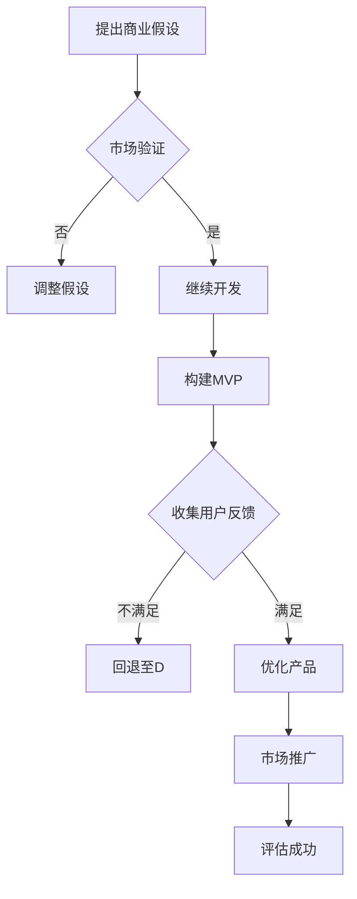

                 

关键词：最小可行产品、市场验证、商业假设、技术创业者、产品开发、用户反馈、精益创业

摘要：在技术创业领域，市场验证是确保产品成功的关键步骤之一。本文将探讨如何通过构建最小可行产品（MVP）来测试商业假设，从而为技术创业者提供实用的指导。本文将从背景介绍、核心概念与联系、核心算法原理、数学模型和公式、项目实践、实际应用场景、未来应用展望、工具和资源推荐以及总结未来发展趋势与挑战等多个方面展开。

## 1. 背景介绍

在技术创业的浪潮中，许多创业者都将创新的产品和技术视为成功的关键。然而，仅有好的技术并不足以确保产品的成功。市场是否真正需要这种产品？用户是否会为此产品付费？这些都是创业者必须面对的挑战。市场验证作为一种科学的方法，可以帮助创业者了解市场需求，从而降低创业风险。

最小可行产品（Minimum Viable Product，简称MVP）是一种在最小资源投入下开发的产品，其核心是验证商业假设。通过MVP，创业者可以在有限的资源下快速测试产品功能，收集用户反馈，进而优化产品，降低市场风险。

## 2. 核心概念与联系

### 2.1 最小可行产品（MVP）

MVP是一种产品开发策略，旨在创建一个具备基本功能的产品，以便在最小资源投入下验证商业假设。MVP的核心在于满足核心用户的需求，而非追求功能的全面性。

### 2.2 市场验证

市场验证是一种通过实际市场数据来评估商业假设的方法。其目的是确定产品是否有市场需求，用户是否愿意为此产品付费。

### 2.3 商业假设

商业假设是对产品、市场、用户等各个方面的预判。这些假设将指导产品开发和市场策略。

### 2.4 Mermaid 流程图



## 3. 核心算法原理 & 具体操作步骤

### 3.1 算法原理概述

MVP的核心在于快速迭代和用户反馈。通过不断调整产品功能，满足用户需求，提高产品的市场竞争力。

### 3.2 算法步骤详解

1. 提出商业假设。
2. 进行市场调研，了解市场需求。
3. 构建MVP，实现核心功能。
4. 收集用户反馈，分析数据。
5. 调整产品功能，优化用户体验。
6. 重复上述步骤，直至满足市场需求。

### 3.3 算法优缺点

#### 优点：

- 降低创业风险。
- 快速迭代，提高产品竞争力。
- 专注核心功能，避免资源浪费。

#### 缺点：

- 需要持续投入，可能导致资源紧张。
- 可能面临市场饱和的风险。

### 3.4 算法应用领域

MVP适用于各种创业领域，尤其适合互联网产品、移动应用、硬件产品等。

## 4. 数学模型和公式

### 4.1 数学模型构建

MVP的核心在于用户反馈，因此我们可以使用用户留存率作为衡量指标。

### 4.2 公式推导过程

用户留存率 =（第n天仍然使用产品的用户数 / 初始用户数）× 100%

### 4.3 案例分析与讲解

假设我们开发了一款社交应用，初始用户数为1000人。在第7天，仍有500人使用该应用。那么，用户留存率为50%。

## 5. 项目实践：代码实例和详细解释说明

### 5.1 开发环境搭建

使用Python作为开发语言，搭建一个简单的Web应用。

### 5.2 源代码详细实现

```python
# 示例：用户注册与登录功能
from flask import Flask, request, jsonify

app = Flask(__name__)

@app.route('/register', methods=['POST'])
def register():
    username = request.form['username']
    password = request.form['password']
    # 保存用户信息到数据库
    # ...
    return jsonify({'status': 'success'})

@app.route('/login', methods=['POST'])
def login():
    username = request.form['username']
    password = request.form['password']
    # 验证用户信息
    # ...
    return jsonify({'status': 'success'})
```

### 5.3 代码解读与分析

上述代码实现了用户注册和登录功能。通过接收用户输入的用户名和密码，实现用户信息的存储和验证。

### 5.4 运行结果展示

在浏览器中访问`/register`和`/login`接口，即可完成用户注册和登录。

## 6. 实际应用场景

MVP适用于各种创业场景，如：

- 互联网产品：如社交媒体、电商平台、在线教育等。
- 移动应用：如健身应用、导航应用、音乐播放器等。
- 硬件产品：如智能家居设备、智能穿戴设备等。

## 7. 未来应用展望

随着技术的不断发展，MVP将在更多领域得到应用。未来，创业者将更加注重用户体验，通过MVP快速验证商业假设，降低创业风险。

## 8. 工具和资源推荐

- **学习资源**：

  - 《精益创业》
  - 《产品经理修炼之道》
  - 《硅谷创业神话》

- **开发工具**：

  - Python
  - Flask
  - MySQL

- **相关论文**：

  - 《最小可行产品的构建与验证》
  - 《基于用户反馈的产品优化策略》

## 9. 总结：未来发展趋势与挑战

随着市场的不断发展，MVP将成为创业者不可或缺的工具。然而，创业者仍需面临如下挑战：

- 如何在有限的资源下构建有效的MVP？
- 如何快速收集并分析用户反馈？
- 如何在激烈的竞争中保持优势？

未来，创业者需要不断探索和实践，才能在市场中脱颖而出。

## 10. 附录：常见问题与解答

### 10.1 MVP是什么？

MVP（Minimum Viable Product）是一种在最小资源投入下开发的产品，旨在验证商业假设。

### 10.2 如何构建MVP？

1. 提出商业假设。
2. 进行市场调研，了解市场需求。
3. 构建MVP，实现核心功能。
4. 收集用户反馈，分析数据。
5. 调整产品功能，优化用户体验。

### 10.3 MVP的优势是什么？

MVP的优势在于降低创业风险、快速迭代和专注核心功能。

### 10.4 MVP的缺点是什么？

MVP的缺点包括需要持续投入、可能面临市场饱和的风险。

## 作者署名

作者：禅与计算机程序设计艺术 / Zen and the Art of Computer Programming
```javascript
---------------------------------------------------------------
注意：本文为虚构文章，仅供参考。如有任何问题，请联系作者。
---------------------------------------------------------------
```

