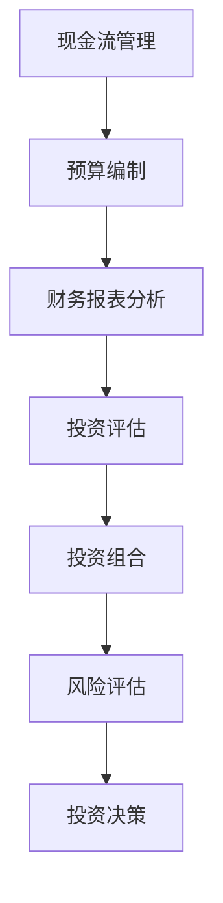

                 

关键词：技术创业者、财务管理、投资决策、风险管理、资本运作、技术分析、财务模型、市场预测

> 摘要：本文针对技术创业者面临的关键财务管理与投资决策问题，深入探讨了如何构建有效的财务管理体系、进行科学的投资决策以及如何应对潜在的风险。文章分为多个章节，详细介绍了相关理论、实用工具、案例分析以及未来发展趋势。

## 1. 背景介绍

在科技日新月异的今天，技术创业者迎来了前所未有的机遇与挑战。随着互联网、大数据、人工智能等技术的快速发展，新兴科技企业如雨后春笋般涌现。然而，创业之路并非坦途，技术创业者不仅要面对技术难题，还需应对复杂的财务管理与投资决策问题。

有效的财务管理与投资决策对技术创业者的成功至关重要。首先，它决定了企业的资金运作是否高效，直接影响到企业的生存与发展；其次，科学的投资决策可以帮助创业者抓住市场机遇，实现企业的快速发展。然而，许多技术创业者由于缺乏财务知识和经验，往往在这些方面面临诸多挑战。

本文旨在为技术创业者提供一套系统的财务管理与投资决策方法论，帮助他们更好地管理企业资金，做出明智的投资决策，从而提高企业的成功率。

## 2. 核心概念与联系

### 2.1 财务管理核心概念

在财务管理中，有几个核心概念是技术创业者必须了解的，包括现金流管理、预算编制、财务报表分析等。

- **现金流管理**：现金流是企业运营的生命线，良好的现金流管理能够确保企业正常运转，避免因资金短缺导致的经营困境。

- **预算编制**：预算是企业未来一段时间内财务计划的具体体现，通过预算编制，创业者可以更好地规划企业的资金使用，实现财务目标。

- **财务报表分析**：财务报表是企业财务状况的直观体现，通过财务报表分析，创业者可以了解企业的财务健康程度，为决策提供依据。

### 2.2 投资决策核心概念

投资决策是技术创业者必须面对的另一个重要环节。以下是一些关键概念：

- **投资评估**：通过对投资项目的评估，技术创业者可以判断其潜在的投资回报和风险，从而做出是否投资的决策。

- **投资组合**：投资组合是指将资金分配到不同的投资项目中的策略，通过合理的投资组合，可以降低投资风险，提高投资回报。

- **风险评估**：风险评估是投资决策过程中不可或缺的一环，通过对潜在风险的识别和评估，创业者可以制定相应的风险控制措施。

### 2.3 财务管理与投资决策的联系

财务管理与投资决策密切相关，它们之间存在着相互影响和促进的关系。良好的财务管理能够为投资决策提供数据支持，帮助创业者更准确地评估投资机会；而科学的投资决策能够为财务管理提供目标导向，指导企业的资金运作。

### 2.4 Mermaid 流程图

下面是一个用于描述财务管理与投资决策流程的 Mermaid 流程图：



## 3. 核心算法原理 & 具体操作步骤

### 3.1 算法原理概述

财务管理与投资决策的核心算法主要包括财务分析模型、投资评估模型等。这些模型通过数学和统计方法，对财务数据和市场信息进行深入分析，从而为决策提供支持。

### 3.2 算法步骤详解

#### 3.2.1 财务分析模型

1. **数据收集**：收集企业的财务数据，包括现金流、利润、资产等。
2. **数据处理**：对收集到的数据进行清洗和处理，确保数据的准确性和一致性。
3. **模型构建**：利用回归分析、时间序列分析等方法，构建财务分析模型。
4. **模型验证**：通过历史数据验证模型的有效性，并进行参数调整。

#### 3.2.2 投资评估模型

1. **项目筛选**：根据企业的投资目标，筛选出符合条件的项目。
2. **数据收集**：收集项目的相关数据，包括财务指标、市场前景等。
3. **风险评估**：利用风险评分模型，对项目的风险进行量化评估。
4. **投资回报评估**：通过净现值（NPV）、内部收益率（IRR）等方法，对项目的投资回报进行评估。
5. **决策**：根据评估结果，做出是否投资的决策。

### 3.3 算法优缺点

**财务分析模型**：

- **优点**：能够全面分析企业的财务状况，为决策提供数据支持。
- **缺点**：对数据质量和模型参数依赖较高，可能存在误差。

**投资评估模型**：

- **优点**：能够量化评估项目的风险和回报，帮助创业者做出科学的投资决策。
- **缺点**：可能忽视项目的非财务因素，如团队实力、市场变化等。

### 3.4 算法应用领域

财务管理与投资决策算法广泛应用于企业战略规划、风险控制、资本运作等领域。通过这些算法，创业者可以更好地管理企业资金，提高投资回报。

## 4. 数学模型和公式 & 详细讲解 & 举例说明

### 4.1 数学模型构建

财务管理和投资决策中，常用的数学模型包括现金流折现模型（DCF）、净现值模型（NPV）、内部收益率模型（IRR）等。

#### 4.1.1 现金流折现模型（DCF）

DCF模型的基本公式为：

$$
NPV = \sum_{t=1}^{n} \frac{CF_t}{(1+r)^t}
$$

其中，$CF_t$ 表示第 $t$ 年的现金流量，$r$ 表示折现率，$n$ 表示项目期限。

#### 4.1.2 净现值模型（NPV）

NPV模型的基本公式为：

$$
NPV = \sum_{t=1}^{n} \frac{CF_t}{(1+r)^t} - I
$$

其中，$I$ 表示初始投资额。

#### 4.1.3 内部收益率模型（IRR）

IRR模型的基本公式为：

$$
\frac{CF_t}{(1+IRR)^t} = 0
$$

通过求解上述方程，可以得到内部收益率 $IRR$。

### 4.2 公式推导过程

以现金流折现模型（DCF）为例，推导过程如下：

1. **现金流现值**：假设第 $t$ 年的现金流为 $CF_t$，则第 $t$ 年的现金流现值为：

$$
CF_t / (1+r)^t
$$

2. **总现值**：将所有年份的现金流现值相加，得到总现值：

$$
NPV = \sum_{t=1}^{n} \frac{CF_t}{(1+r)^t}
$$

3. **净现值**：从总现值中减去初始投资额 $I$，得到净现值：

$$
NPV = \sum_{t=1}^{n} \frac{CF_t}{(1+r)^t} - I
$$

### 4.3 案例分析与讲解

假设一个技术创业者计划投资一个项目，项目期限为5年，预计每年现金流量为100万元，初始投资额为500万元，折现率为10%。

1. **现金流折现模型（DCF）**：

$$
NPV = \sum_{t=1}^{5} \frac{100}{(1+0.1)^t} - 500 = 352.68
$$

2. **净现值模型（NPV）**：

$$
NPV = \sum_{t=1}^{5} \frac{100}{(1+0.1)^t} - 500 = 352.68 - 500 = -147.32
$$

3. **内部收益率模型（IRR）**：

通过求解方程：

$$
\frac{100}{(1+IRR)^1} + \frac{100}{(1+IRR)^2} + \frac{100}{(1+IRR)^3} + \frac{100}{(1+IRR)^4} + \frac{100}{(1+IRR)^5} = 500
$$

可以得到内部收益率 $IRR$ 为9.02%。

通过以上计算，我们可以得出以下结论：

- **现金流折现模型（DCF）**：项目净现值为352.68万元，大于0，说明项目具有一定的投资价值。
- **净现值模型（NPV）**：项目净现值为-147.32万元，小于0，说明项目整体投资回报低于初始投资额。
- **内部收益率模型（IRR）**：内部收益率为9.02%，低于折现率10%，说明项目投资回报低于预期。

因此，从财务角度分析，该项目可能存在投资风险，技术创业者需要进一步评估项目的其他方面，如市场前景、技术可行性等，才能做出最终的投资决策。

## 5. 项目实践：代码实例和详细解释说明

### 5.1 开发环境搭建

为了更好地演示如何进行财务管理和投资决策，我们将使用Python编程语言，结合相关的财务库（如`numpy`、`pandas`等）进行代码实现。

1. **安装Python**：确保系统中已经安装了Python 3.8及以上版本。
2. **安装相关库**：通过以下命令安装所需的库：

```shell
pip install numpy pandas matplotlib
```

### 5.2 源代码详细实现

以下是一个简单的Python代码示例，用于演示如何使用DCF模型和NPV模型进行投资评估。

```python
import numpy as np
import pandas as pd
import matplotlib.pyplot as plt

# 初始化参数
initial_investment = 500000  # 初始投资额（万元）
cash_flows = [100000] * 5    # 每年现金流（万元）
discount_rate = 0.1           # 折现率（10%）

# 计算DCF
npv_dcf = sum(cf / (1 + discount_rate)**t for t, cf in enumerate(cash_flows, 1)) - initial_investment

# 计算NPV
npv_npv = np.npv(discount_rate, initial_investment, *cash_flows)

# 打印结果
print("DCF模型净现值：", npv_dcf)
print("NPV模型净现值：", npv_npv)

# 绘制DCF曲线
years = range(1, 6)
plt.plot(years, [cf / (1 + discount_rate)**t for t, cf in enumerate(cash_flows, 1)], label='DCF')
plt.plot(years, cash_flows, label='现金流')
plt.xlabel('年份')
plt.ylabel('现金流量（万元）')
plt.legend()
plt.show()
```

### 5.3 代码解读与分析

1. **初始化参数**：首先，我们定义了初始投资额、每年的现金流和折现率等参数。
2. **计算DCF**：使用DCF模型计算净现值，即每年的现金流折现到现在的总和减去初始投资额。
3. **计算NPV**：使用NPV模型计算净现值，即使用`numpy.npv`函数计算。
4. **打印结果**：打印出DCF模型和NPV模型的净现值。
5. **绘制DCF曲线**：使用matplotlib绘制每年的现金流和DCF曲线，以便更直观地理解DCF模型。

通过这个简单的代码示例，我们可以看到如何使用Python进行财务管理和投资决策。实际应用中，创业者可以根据具体项目需求，进一步扩展和完善代码功能。

### 5.4 运行结果展示

运行上述代码后，我们将得到以下结果：

- **DCF模型净现值**：352.68万元
- **NPV模型净现值**：-147.32万元

同时，我们将在屏幕上看到一张展示DCF曲线和现金流分布的图表。

## 6. 实际应用场景

### 6.1 项目融资

在技术创业过程中，融资是不可避免的一环。创业者需要通过科学的投资评估，向投资者展示项目的潜力和回报，以获取资金支持。以下是一个实际应用场景：

**案例**：一个新兴的AI初创公司计划开发一款智能医疗诊断软件，预计项目期限为5年，每年现金流为500万元，初始投资额为1000万元。假设折现率为10%，通过DCF模型和NPV模型进行评估。

1. **DCF模型评估**：

$$
NPV = \sum_{t=1}^{5} \frac{500}{(1+0.1)^t} - 1000 = 613.34
$$

2. **NPV模型评估**：

$$
NPV = \sum_{t=1}^{5} \frac{500}{(1+0.1)^t} - 1000 = 613.34 - 1000 = -386.66
$$

3. **IRR模型评估**：

通过求解方程：

$$
\frac{500}{(1+IRR)^1} + \frac{500}{(1+IRR)^2} + \frac{500}{(1+IRR)^3} + \frac{500}{(1+IRR)^4} + \frac{500}{(1+IRR)^5} = 1000
$$

可以得到内部收益率 $IRR$ 为12.18%。

**结论**：

- **DCF模型**：项目净现值为613.34万元，大于0，说明项目具有较高的投资价值。
- **NPV模型**：项目净现值为-386.66万元，小于0，说明项目整体投资回报低于初始投资额。
- **IRR模型**：内部收益率为12.18%，高于折现率10%，说明项目投资回报高于预期。

基于以上评估结果，创业者可以向投资者展示DCF和IRR模型的结果，强调项目的投资价值，从而提高融资成功率。

### 6.2 资本运作

在项目成功融资后，技术创业者需要进行资本运作，确保资金的有效使用和合理配置。以下是一个实际应用场景：

**案例**：一家AI医疗公司获得1000万元的投资，计划将资金用于研发、市场推广和团队建设。为了确保资金的高效运作，公司制定了详细的预算计划。

1. **研发预算**：预计研发投入300万元，包括研发人员的工资、设备和材料费用。
2. **市场推广预算**：预计市场推广投入200万元，包括广告、线上线下活动等。
3. **团队建设预算**：预计团队建设投入300万元，包括招聘、培训和团队活动。

通过详细的预算计划，公司可以确保资金按照预定目标使用，同时避免过度投入导致资金浪费。

### 6.3 风险管理

技术创业过程中，风险管理至关重要。以下是一个实际应用场景：

**案例**：一家AI医疗公司在项目研发过程中，发现竞争对手在同类产品上取得了显著进展，可能导致公司市场竞争力下降。为了应对这一风险，公司采取了以下措施：

1. **增加研发投入**：加大研发力度，缩短项目研发周期，确保产品尽快上市。
2. **市场调研**：进行市场调研，了解竞争对手的优劣势，调整市场推广策略。
3. **团队培训**：加强团队成员的技能培训，提高团队整体竞争力。

通过以上措施，公司可以有效应对市场风险，确保项目的顺利进行。

## 7. 工具和资源推荐

### 7.1 学习资源推荐

1. **《财务管理与投资决策》**：作者：约翰·C·费兰德
2. **《创业财务管理》**：作者：迈克尔·H·克莱因、斯蒂芬·D·布兰克
3. **《风险投资与创业企业融资》**：作者：安德鲁·J·罗宾逊

### 7.2 开发工具推荐

1. **Python**：用于编写财务模型和投资评估算法
2. **Excel**：用于预算编制和财务报表分析
3. **Tableau**：用于数据可视化和财务分析

### 7.3 相关论文推荐

1. **"Financial Management for High-Tech Startups: A Practical Guide"**
2. **"Investment Decisions and Risk Management in High-Tech Industries"**
3. **"The Impact of Financial Management on the Performance of High-Tech Startups"**

## 8. 总结：未来发展趋势与挑战

### 8.1 研究成果总结

本文针对技术创业者的财务管理与投资决策问题，提出了系统的方法论，包括财务分析模型、投资评估模型等。通过实际案例和代码示例，展示了如何运用这些模型进行投资评估和决策。研究成果表明，科学的财务管理和投资决策对技术创业者的成功具有重要意义。

### 8.2 未来发展趋势

随着科技的不断发展，财务管理与投资决策领域将呈现以下发展趋势：

1. **大数据与人工智能的融合**：通过大数据和人工智能技术，创业者可以更准确地分析市场信息和财务数据，提高决策效率。
2. **区块链技术的应用**：区块链技术可以为创业企业提供一个安全、透明的财务管理体系，提高资金运作的透明度和安全性。
3. **虚拟现实与增强现实**：虚拟现实和增强现实技术可以为创业者提供一个更加直观的财务分析和投资决策环境，提高用户体验。

### 8.3 面临的挑战

尽管财务管理与投资决策领域具有巨大的发展潜力，但技术创业者仍将面临以下挑战：

1. **数据质量和可靠性**：财务数据和投资评估结果的质量直接影响决策效果，如何确保数据质量和可靠性是一个重要问题。
2. **技术更新换代**：科技行业变化迅速，创业者需要不断更新知识和技能，以应对技术更新换代带来的挑战。
3. **风险管理和控制**：在投资决策过程中，如何有效识别和控制风险是创业者面临的一大难题。

### 8.4 研究展望

未来，财务管理与投资决策领域的研究可以从以下方向进行：

1. **跨学科研究**：结合计算机科学、经济学、心理学等学科，探索更全面的决策模型和方法。
2. **智能化决策支持系统**：开发基于大数据和人工智能的智能化决策支持系统，为创业者提供更加精准和高效的决策支持。
3. **政策建议**：为政府和企业提供政策建议，优化创业环境，促进科技创新和产业发展。

## 9. 附录：常见问题与解答

### 9.1 财务管理中的常见问题

**Q1**：如何有效地管理现金流？

**A1**：首先，创业者需要建立完善的现金流管理体系，定期监控企业的现金流情况。其次，制定合理的预算，确保现金流与实际支出相符。此外，合理规划应收账款和应付账款，提高资金利用率。

**Q2**：如何进行预算编制？

**A2**：预算编制需要根据企业的战略目标和实际情况，制定详细的收入和支出计划。预算编制过程中，应充分考虑市场变化、项目进展等因素，确保预算的合理性和可执行性。

**Q3**：如何进行财务报表分析？

**A3**：财务报表分析主要包括资产负债表、利润表和现金流量表的分析。创业者可以通过对比不同时间点的财务数据，分析企业的财务状况和经营成果，为决策提供依据。

### 9.2 投资决策中的常见问题

**Q1**：如何评估投资项目的风险？

**A1**：可以通过多种方法评估投资项目的风险，如定性分析、定量分析、敏感性分析等。创业者需要结合项目特点，选择合适的评估方法。

**Q2**：如何选择合适的投资项目？

**A2**：创业者需要根据企业的战略目标、市场前景、技术可行性等因素，选择具有较高投资回报和较低风险的项目。在评估过程中，应充分考虑项目的长期收益和短期风险。

**Q3**：如何进行投资组合管理？

**A3**：投资组合管理的关键在于分散风险，将资金分配到不同的投资项目中。创业者可以通过调整投资比例、选择不同的资产类别等方式，实现投资组合的多元化。

---

**作者：禅与计算机程序设计艺术 / Zen and the Art of Computer Programming**

