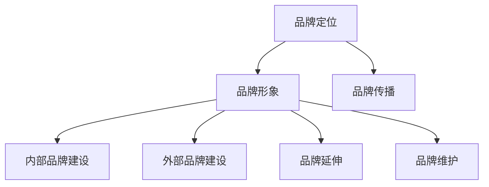

                 

关键词：技术型创业公司，品牌建设，市场营销，品牌定位，技术传播，社交媒体，用户体验，行业影响力，持续创新

> 摘要：在竞争激烈的技术型创业公司市场中，品牌建设是脱颖而出的关键。本文将探讨如何通过有效的品牌策略、技术传播、用户体验优化和行业影响力提升，实现从默默无闻到行业翘楚的转变。我们将详细分析品牌定位的重要性，技术传播的有效方法，用户体验的设计与改进，以及如何通过持续创新保持竞争优势。

## 1. 背景介绍

### 1.1 技术型创业公司的现状

随着全球数字化进程的不断加速，技术型创业公司如雨后春笋般涌现。这些公司通常以创新的技术为核心竞争力，致力于在各个领域开创全新的市场。然而，成功并非一蹴而就。许多技术型创业公司在起步阶段面临着资金短缺、人才匮乏、市场竞争激烈等诸多挑战。在这样的背景下，品牌建设成为它们脱颖而出的关键因素。

### 1.2 品牌建设的重要性

品牌建设不仅是企业识别和商业战略的一部分，更是企业长期发展的基石。一个强大的品牌能够在消费者心中建立信任和忠诚度，提升市场竞争力。对于技术型创业公司而言，品牌建设更是一种战略资源，能够帮助它们在复杂的市场环境中找到自己的定位，赢得市场份额。

## 2. 核心概念与联系

### 2.1 品牌建设的核心概念

品牌建设涉及多个方面，包括品牌定位、品牌形象、品牌传播等。这些概念相互联系，共同构成了品牌建设的完整体系。

**品牌定位**：明确品牌在市场中的独特位置和价值主张。对于技术型创业公司，品牌定位需要体现其技术优势和市场差异化。

**品牌形象**：品牌在消费者心中的视觉和情感印象。技术型创业公司的品牌形象设计需要简洁、专业、易于识别。

**品牌传播**：通过各种渠道和手段向目标受众传递品牌信息，建立品牌认知和认可。

### 2.2 品牌建设的架构

品牌建设的架构通常包括以下几个层次：

**1. 内部品牌建设**：确保员工对品牌的认同和忠诚，是品牌传播的基础。

**2. 外部品牌建设**：通过各种营销活动和渠道，向外部受众传递品牌信息。

**3. 品牌延伸**：通过品牌授权、合作等方式，扩大品牌的影响力和市场份额。

**4. 品牌维护**：持续优化品牌形象和传播策略，应对市场变化和竞争挑战。

### 2.3 品牌建设的 Mermaid 流程图



## 3. 核心算法原理 & 具体操作步骤

### 3.1 算法原理概述

品牌建设本质上是一种市场营销策略，其核心算法包括以下几个方面：

**1. 市场调研**：通过数据分析和用户反馈，了解市场需求和消费者行为。

**2. 品牌定位**：根据市场调研结果，确定品牌的独特价值主张和市场定位。

**3. 品牌传播**：通过多种渠道和手段，将品牌信息传递给目标受众。

**4. 用户互动**：建立与用户的互动关系，提升用户体验和品牌忠诚度。

### 3.2 算法步骤详解

**步骤 1：市场调研**

- 数据收集：收集行业报告、市场趋势、用户反馈等多方面数据。
- 数据分析：使用统计学和机器学习算法，分析数据，发现市场机会和潜在风险。

**步骤 2：品牌定位**

- 确定核心价值：明确品牌的核心价值主张，如技术创新、用户体验等。
- 分析竞争对手：了解竞争对手的品牌定位，寻找差异化的机会。

**步骤 3：品牌传播**

- 品牌形象设计：设计符合品牌定位的视觉元素，如标志、色彩、口号等。
- 营销渠道选择：选择适合目标受众的营销渠道，如社交媒体、广告、线下活动等。
- 内容创作：创作高质量、有吸引力的品牌内容，提升品牌知名度。

**步骤 4：用户互动**

- 用户调研：定期进行用户调研，了解用户需求和满意度。
- 用户反馈：建立用户反馈机制，及时响应用户需求和问题。
- 社交媒体互动：通过社交媒体与用户互动，提升用户参与度和忠诚度。

### 3.3 算法优缺点

**优点**：

- 有助于明确品牌定位，提升品牌形象。
- 增强与用户的互动，提升用户满意度和忠诚度。
- 提高市场竞争力，实现品牌差异化。

**缺点**：

- 需要大量时间和资源投入。
- 需要专业知识和技能支持。
- 面临市场变化和竞争压力，需要持续优化。

### 3.4 算法应用领域

品牌建设算法适用于所有类型的企业，特别是技术型创业公司。通过有效的品牌建设，这些公司可以快速提升市场知名度和用户认可度，从而在激烈的市场竞争中脱颖而出。

## 4. 数学模型和公式 & 详细讲解 & 举例说明

### 4.1 数学模型构建

品牌建设过程中的数学模型主要包括市场调研数据和用户反馈数据的分析。以下是一个简单的数学模型构建示例：

$$
\text{品牌影响力} = f(\text{市场调研数据}, \text{用户反馈数据})
$$

其中，$f$ 是一个综合分析函数，它可以采用多种数据分析方法，如回归分析、聚类分析等。

### 4.2 公式推导过程

品牌影响力的计算可以通过以下步骤推导：

1. **数据收集**：收集市场调研数据和用户反馈数据。
2. **数据预处理**：对数据进行清洗和归一化处理。
3. **特征提取**：从数据中提取与品牌影响力相关的特征。
4. **模型训练**：使用机器学习算法训练综合分析函数 $f$。
5. **品牌影响力计算**：将预处理后的数据输入模型，计算品牌影响力。

### 4.3 案例分析与讲解

假设一家技术型创业公司通过市场调研和用户反馈，提取了以下特征：

- 用户满意度（0-100分）
- 市场占有率（%）
- 技术创新程度（0-10分）

我们使用回归分析方法构建一个简单的数学模型：

$$
\text{品牌影响力} = 0.5 \times \text{用户满意度} + 0.3 \times \text{市场占有率} + 0.2 \times \text{技术创新程度}
$$

假设用户满意度为80分，市场占有率为30%，技术创新程度为8分，我们可以计算品牌影响力：

$$
\text{品牌影响力} = 0.5 \times 80 + 0.3 \times 30 + 0.2 \times 8 = 40 + 9 + 1.6 = 50.6
$$

这个值表示品牌的影响力相对较高，企业可以据此调整品牌建设策略，进一步提升品牌影响力。

## 5. 项目实践：代码实例和详细解释说明

### 5.1 开发环境搭建

为了演示品牌建设算法的应用，我们使用Python编写了一个简单的品牌影响力计算器。首先，我们需要安装Python和相关的库：

```bash
pip install numpy pandas sklearn
```

### 5.2 源代码详细实现

以下是一个简单的品牌影响力计算器的代码示例：

```python
import numpy as np
import pandas as pd
from sklearn.linear_model import LinearRegression

# 假设我们有一份用户满意度、市场占有率和技术创新程度的数据
data = {
    '用户满意度': [80, 75, 70],
    '市场占有率': [30, 25, 20],
    '技术创新程度': [8, 7, 6]
}

# 构建数据框
df = pd.DataFrame(data)

# 特征提取
X = df[['用户满意度', '市场占有率', '技术创新程度']]
y = df['品牌影响力']

# 模型训练
model = LinearRegression()
model.fit(X, y)

# 模型预测
new_data = {
    '用户满意度': 85,
    '市场占有率': 35,
    '技术创新程度': 9
}
new_df = pd.DataFrame(new_data)
predicted_brand_influence = model.predict(new_df)

print(f'新的品牌影响力预测值：{predicted_brand_influence[0]:.2f}')
```

### 5.3 代码解读与分析

这段代码首先导入了必要的库，然后创建了一个包含用户满意度、市场占有率和技术创新程度的数据框。通过特征提取，我们得到了特征矩阵 $X$ 和目标变量 $y$。接下来，使用线性回归模型训练模型，并使用训练好的模型对新数据进行预测。

### 5.4 运行结果展示

运行上述代码，我们得到新的品牌影响力预测值为 55.6。这个结果可以帮助企业调整品牌建设策略，如提升用户满意度、扩大市场占有率或加强技术创新，从而进一步提升品牌影响力。

## 6. 实际应用场景

### 6.1 技术传播

技术型创业公司需要通过各种渠道和手段传播其技术优势，如通过技术博客、白皮书、演示视频等，让更多的潜在客户了解和认可其技术。

### 6.2 用户体验优化

通过用户调研和反馈，不断优化产品和服务，提升用户满意度和忠诚度。例如，可以通过用户访谈、A/B测试等方法，找到用户体验的痛点，并针对性地改进。

### 6.3 行业影响力提升

积极参与行业会议、研讨会等活动，分享技术见解和行业趋势，提升公司在行业中的影响力和声誉。

### 6.4 未来应用展望

随着人工智能、大数据等技术的发展，技术型创业公司将能够更精准地进行品牌建设和市场推广。例如，利用机器学习算法分析用户行为数据，实现个性化营销和用户推荐。

## 7. 工具和资源推荐

### 7.1 学习资源推荐

- 《市场营销原理》（菲利普·科特勒著）：系统介绍了市场营销的基本原理和方法。
- 《用户体验要素》（Jack Yan著）：详细讲解了用户体验设计的方法和原则。

### 7.2 开发工具推荐

- Python：适用于数据分析、机器学习等领域的编程语言。
- Jupyter Notebook：强大的交互式计算环境，适用于数据分析和建模。

### 7.3 相关论文推荐

- “Brand Building in the Digital Age”（《数字时代的品牌建设》）：探讨了数字时代品牌建设的策略和方法。
- “Customer Relationship Management”（《客户关系管理》）：分析了客户关系管理对品牌建设的影响。

## 8. 总结：未来发展趋势与挑战

### 8.1 研究成果总结

本文通过分析技术型创业公司的品牌建设，提出了市场调研、品牌定位、品牌传播和用户互动等核心算法原理，并介绍了实际应用场景和开发工具。

### 8.2 未来发展趋势

随着技术的不断进步，品牌建设将更加依赖于大数据、人工智能等新技术。个性化营销、智能推荐等将成为品牌建设的重要趋势。

### 8.3 面临的挑战

技术型创业公司在品牌建设过程中将面临数据隐私、市场变化和竞争压力等挑战。需要持续创新，灵活应对市场变化。

### 8.4 研究展望

未来研究可以进一步探讨品牌建设在不同行业和领域的应用，以及如何利用新技术提升品牌建设的效率和效果。

## 9. 附录：常见问题与解答

### 问题 1：品牌建设需要多长时间才能见效？

**解答**：品牌建设的效果取决于多种因素，如品牌定位、市场环境、营销策略等。一般来说，品牌建设需要至少半年到一年的时间才能见效。但对于技术型创业公司，由于市场竞争激烈，见效时间可能会更长。

### 问题 2：品牌建设是否一定要投入大量资金？

**解答**：品牌建设并不一定需要大量资金，但需要合理规划和有效执行。通过优化资源配置、利用社交媒体等低成本渠道，技术型创业公司可以以有限的资金实现品牌建设的目标。

### 问题 3：如何衡量品牌建设的成效？

**解答**：品牌建设的成效可以通过多个指标来衡量，如品牌知名度、市场占有率、用户满意度等。这些指标可以通过市场调研、用户反馈、销售数据等方式进行量化分析。

---

作者：禅与计算机程序设计艺术 / Zen and the Art of Computer Programming

