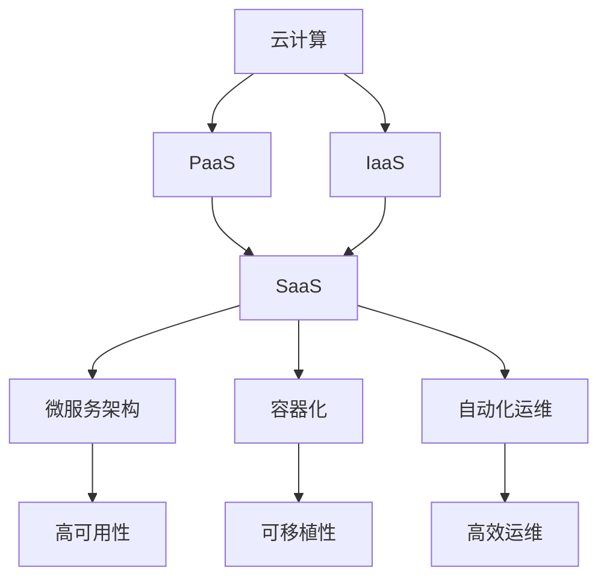

                 

 在当今快速发展的技术市场中，软件即服务（Software as a Service，简称SaaS）已经成为企业服务交付的主流模式。对于技术型创业者来说，构建一个可扩展的SaaS业务模式不仅是实现商业成功的关键，也是保持竞争力的必要条件。本文将深入探讨如何通过技术、管理和营销策略来打造一个可扩展的SaaS业务模式。

## 关键词
- 技术型创业者
- SaaS业务模式
- 可扩展性
- 技术架构
- 管理策略
- 营销策略

## 摘要
本文旨在为技术型创业者提供一套全面、实用的策略，帮助他们在竞争激烈的SaaS市场中构建一个可持续发展的业务模式。文章首先介绍了SaaS的基本概念和特点，随后深入分析了构建可扩展SaaS业务模式所需的关键技术、管理策略和营销方法。最后，通过对未来发展趋势和挑战的探讨，为读者提供了前瞻性的视角。

## 1. 背景介绍

SaaS业务模式起源于云计算的兴起，它允许企业通过网络提供软件服务，用户无需购买和安装软件，只需通过互联网订阅即可使用。这种模式极大地降低了软件的初始采购成本，同时提高了灵活性。对于技术型创业者来说，SaaS业务模式意味着可以通过云服务快速搭建产品，并以订阅形式提供，从而实现持续的收入流。

在SaaS市场中，创业者的成功不仅依赖于技术创新，还需要具备市场洞察力和强大的执行力。可扩展性是SaaS业务成功的关键因素之一。一个可扩展的系统可以随着用户数量的增加而平稳运行，确保用户体验不受影响。因此，创业者必须从架构设计、数据管理、运维等多个方面考虑系统的可扩展性。

## 2. 核心概念与联系

在构建可扩展的SaaS业务模式之前，我们需要理解几个核心概念，包括云计算、微服务架构、容器化、自动化运维等。

### 2.1 云计算

云计算是SaaS业务模式的基础，它提供了弹性的计算资源，使企业可以根据需求动态调整计算能力。云计算服务主要分为IaaS（基础设施即服务）、PaaS（平台即服务）和SaaS（软件即服务）三种类型。创业者需要选择合适的云服务模型，以确保业务的稳定性和扩展性。

### 2.2 微服务架构

微服务架构是一种分布式系统架构风格，它将应用程序构建为一组小的、独立的、可扩展的服务。这种架构有助于提高系统的灵活性和可维护性。在SaaS业务中，微服务架构可以实现服务的高可用性和快速迭代。

### 2.3 容器化

容器化技术，如Docker，提供了轻量级、可移植的应用运行环境。容器化使开发者可以独立构建、测试和部署应用程序，提高了开发和运维的效率。同时，容器化也便于实现服务的水平扩展。

### 2.4 自动化运维

自动化运维是通过自动化工具来管理和维护IT基础设施的一种方法。自动化运维可以减少手动操作，提高系统的可靠性和效率。对于SaaS业务来说，自动化运维是实现可扩展性的重要手段。

### 2.5 Mermaid 流程图

以下是一个Mermaid流程图，展示了构建可扩展SaaS业务模式的核心概念和联系：



## 3. 核心算法原理 & 具体操作步骤

### 3.1 算法原理概述

构建可扩展SaaS业务模式的核心算法原理主要包括分布式计算、负载均衡和弹性伸缩。

- **分布式计算**：通过将任务分散到多个节点上并行处理，提高系统的处理能力和响应速度。
- **负载均衡**：根据当前系统的负载情况，将流量分配到不同的服务器上，避免单个服务器过载。
- **弹性伸缩**：根据系统的负载动态调整资源分配，确保系统在高负载时仍能稳定运行。

### 3.2 算法步骤详解

1. **分布式计算**
   - **任务分发**：将任务分配到多个节点，确保负载均衡。
   - **节点协同**：各节点独立处理任务，并在处理完成后将结果汇总。

2. **负载均衡**
   - **流量监控**：实时监控系统的流量情况。
   - **负载分配**：根据当前流量情况，将请求分配到不同的服务器。

3. **弹性伸缩**
   - **资源监控**：实时监控系统的资源使用情况。
   - **自动扩缩容**：当资源使用达到阈值时，自动增加或减少服务器数量。

### 3.3 算法优缺点

**优点**：
- **高可用性**：分布式计算和负载均衡提高了系统的可用性。
- **高扩展性**：弹性伸缩确保系统可以应对不同的负载情况。
- **高效运维**：自动化运维减少了人工干预，提高了运维效率。

**缺点**：
- **复杂性**：分布式系统和自动化运维的复杂性增加了系统的维护成本。
- **数据一致性**：分布式计算可能导致数据一致性问题的出现。

### 3.4 算法应用领域

- **在线教育**：需要处理大量的并发请求和用户数据。
- **电子商务**：需要在高峰期保持系统的稳定运行。
- **金融科技**：需要确保交易数据的安全性和一致性。

## 4. 数学模型和公式 & 详细讲解 & 举例说明

### 4.1 数学模型构建

构建可扩展SaaS业务模式的数学模型主要包括以下三个方面：

1. **成本模型**：用于计算构建和运营SaaS业务的成本。
2. **收入模型**：用于预测SaaS业务的收入情况。
3. **性能模型**：用于评估系统的性能和可扩展性。

### 4.2 公式推导过程

1. **成本模型**：
   - **固定成本**：C\_fixed = a * N
   - **可变成本**：C\_variable = b * N
   - **总成本**：C = C\_fixed + C\_variable

   其中，a 和 b 分别为固定成本和可变成本的单位价格，N 为系统规模。

2. **收入模型**：
   - **订阅收入**：R\_subscription = p * M
   - **服务收入**：R\_service = q * M
   - **总收入**：R = R\_subscription + R\_service

   其中，p 和 q 分别为订阅价格和服务价格，M 为用户数量。

3. **性能模型**：
   - **响应时间**：T = a * N + b
   - **吞吐量**：Q = c * N + d

   其中，a、b、c 和 d 为常数，N 为系统规模。

### 4.3 案例分析与讲解

假设一个SaaS企业拥有1000名用户，每个用户的订阅价格为每月100美元，每个用户每月产生10次服务请求，每次服务请求的价格为1美元。

1. **成本模型**：
   - **固定成本**：C\_fixed = 1000 * 10 = 10,000美元
   - **可变成本**：C\_variable = 1000 * 5 = 5,000美元
   - **总成本**：C = 10,000 + 5,000 = 15,000美元

2. **收入模型**：
   - **订阅收入**：R\_subscription = 1000 * 100 = 100,000美元
   - **服务收入**：R\_service = 1000 * 10 = 10,000美元
   - **总收入**：R = 100,000 + 10,000 = 110,000美元

3. **性能模型**：
   - **响应时间**：T = 1000 * 0.1 + 0.5 = 100.5秒
   - **吞吐量**：Q = 1000 * 0.2 + 0.1 = 201次/秒

通过以上公式，企业可以预测在1000名用户规模下的成本和收入，以及系统的性能指标。这些数据对于业务决策和优化具有重要意义。

## 5. 项目实践：代码实例和详细解释说明

### 5.1 开发环境搭建

为了演示如何构建一个可扩展的SaaS业务，我们将使用Docker和Kubernetes来搭建一个简单的微服务架构。以下是开发环境搭建的步骤：

1. 安装Docker：在服务器上安装Docker，确保版本在19.03及以上。
2. 安装Kubernetes：安装Kubernetes集群，可以选择Minikube进行本地测试。
3. 准备代码仓库：在代码仓库中存放微服务代码和Dockerfile。

### 5.2 源代码详细实现

以下是一个简单的订单服务（Order Service）的Dockerfile：

```dockerfile
FROM node:14-alpine

WORKDIR /app

COPY package.json ./
RUN npm install

COPY . .

CMD ["node", "index.js"]
```

订单服务的源代码（index.js）：

```javascript
const express = require('express');
const app = express();

app.use(express.json());

app.post('/orders', (req, res) => {
  // 处理订单创建逻辑
  res.status(201).json({ message: 'Order created successfully' });
});

const port = process.env.PORT || 3000;
app.listen(port, () => {
  console.log(`Order service listening on port ${port}`);
});
```

### 5.3 代码解读与分析

订单服务的代码使用Express框架构建，通过Docker容器化运行。代码中定义了一个POST端点，用于接收和创建订单。在Dockerfile中，我们使用Node.js Alpine镜像构建容器，并复制本地代码到容器中。容器启动时，执行`index.js`文件，开启服务器监听3000端口。

### 5.4 运行结果展示

在Kubernetes集群中部署订单服务：

```bash
kubectl create deployment order-service --image=<你的Docker镜像名称>
kubectl expose deployment order-service --type=LoadBalancer --name=order-service
```

部署完成后，可以通过Kubernetes集群的负载均衡器访问订单服务：

```bash
kubectl get svc
```

输出中会包含LoadBalancer类型的Service IP地址，通过该地址访问订单服务，可以使用Postman等工具发送POST请求到`/orders`端点，查看订单创建结果。

## 6. 实际应用场景

### 6.1 在线教育

SaaS在在线教育领域的应用十分广泛。例如，Coursera和edX等平台使用SaaS模式为用户提供在线课程和学习资源。这些平台需要处理大量的并发用户请求，同时保证课程内容的安全和一致性。通过微服务架构和容器化技术，这些平台可以实现高效的服务部署和扩展。

### 6.2 电子商务

电子商务平台，如Amazon和eBay，也广泛采用SaaS模式。这些平台需要处理海量的商品信息、订单处理和用户交互。通过分布式计算和负载均衡技术，这些平台可以在高并发情况下保持稳定运行。同时，弹性伸缩机制可以确保在流量高峰期增加计算资源。

### 6.3 金融科技

金融科技公司，如Robinhood和Revolut，通过SaaS模式提供在线交易、支付和资产管理服务。这些服务要求极高的安全性和可靠性。通过分布式数据库和加密技术，这些平台可以确保用户数据的安全。同时，自动化运维技术可以提高平台的运维效率。

## 7. 未来应用展望

随着5G、物联网和人工智能等技术的不断发展，SaaS业务模式将迎来新的机遇和挑战。以下是未来SaaS应用的一些发展趋势：

- **5G技术的普及**：将进一步提升网络速度和延迟，为SaaS业务提供更优的用户体验。
- **物联网（IoT）的融合**：物联网设备的数据处理和存储需求将推动SaaS在智能家居、智慧城市等领域的应用。
- **人工智能（AI）的集成**：通过AI技术，SaaS平台可以提供更加智能化的服务，如个性化推荐、智能客服等。

## 8. 工具和资源推荐

### 8.1 学习资源推荐

- 《SaaS Business Model: Strategy, Operations, and Market Development》
- 《Building Microservices: Designing Fine-Grained Systems》
- 《Docker Deep Dive》

### 8.2 开发工具推荐

- Docker：容器化平台，用于构建和部署应用程序。
- Kubernetes：用于自动化容器化应用程序的部署、扩展和管理。
- Terraform：用于基础设施即代码的工具，可以自动化部署云基础设施。

### 8.3 相关论文推荐

- "Microservices: A Define and Pattern Language for Distributed Systems"
- "Containerization and Microservices: An Overview"
- "The Design of the Beringei Time-Series Database"

## 9. 总结：未来发展趋势与挑战

### 9.1 研究成果总结

本文通过对SaaS业务模式的核心概念、算法原理、数学模型和实际应用场景的深入分析，为技术型创业者提供了构建可扩展SaaS业务模式的理论基础和实践指导。

### 9.2 未来发展趋势

未来，SaaS业务模式将继续在云计算、人工智能和物联网等技术的推动下发展。5G技术的普及和边缘计算的兴起将为SaaS提供更广泛的场景和应用机会。

### 9.3 面临的挑战

- **数据安全性**：随着数据量的增加，确保数据的安全和隐私将成为一大挑战。
- **系统复杂性**：分布式系统和自动化运维的复杂性将增加维护成本。
- **用户满意度**：在竞争激烈的市场中，保持用户满意度是持续发展的关键。

### 9.4 研究展望

未来的研究可以重点关注以下几个方面：

- **数据加密与隐私保护**：研究如何在保证数据安全的同时，提高系统性能。
- **智能运维**：利用AI技术实现智能化的系统监控和故障预测。
- **多租户架构**：研究如何提高多租户环境的性能和安全性。

## 9. 附录：常见问题与解答

### 问题1：SaaS业务模式与传统软件业务模式有什么区别？

**解答**：SaaS业务模式与传统软件业务模式的主要区别在于交付方式和商业模式。传统软件业务模式通常涉及购买和安装软件，而SaaS模式则通过网络提供软件服务，用户按需订阅。SaaS模式降低了初始采购成本，提高了灵活性。

### 问题2：什么是微服务架构？它如何帮助构建可扩展的SaaS业务？

**解答**：微服务架构是一种将应用程序分解为多个独立的、可伸缩的服务的方法。每个服务都可以独立开发、测试和部署，从而提高了系统的灵活性和可维护性。在SaaS业务中，微服务架构可以实现服务的高可用性和快速迭代，有助于构建可扩展的业务模式。

### 问题3：为什么选择容器化技术来构建SaaS业务？

**解答**：容器化技术，如Docker，提供了轻量级、可移植的应用运行环境。容器化使开发者可以独立构建、测试和部署应用程序，提高了开发和运维的效率。同时，容器化也便于实现服务的水平扩展，从而满足SaaS业务的可扩展性需求。

### 问题4：如何确保SaaS系统的数据安全性？

**解答**：确保SaaS系统的数据安全性需要采用多种措施，包括数据加密、访问控制、安全审计等。在数据传输过程中使用加密技术，如SSL/TLS，可以确保数据在传输过程中的安全性。同时，通过访问控制机制，可以限制用户对数据的访问权限，确保数据不被未授权用户访问。安全审计可以记录系统的操作日志，及时发现和应对安全威胁。

### 问题5：如何评估SaaS系统的性能和可扩展性？

**解答**：评估SaaS系统的性能和可扩展性可以通过以下方法：

- **性能测试**：通过模拟高并发用户请求，评估系统的响应时间和吞吐量。
- **负载测试**：逐渐增加系统负载，观察系统在负载变化下的性能表现。
- **弹性测试**：通过模拟流量高峰期，测试系统在动态调整资源分配后的性能。
- **监控工具**：使用监控工具实时监控系统的性能指标，如CPU使用率、内存使用率、网络延迟等。

通过这些方法，可以全面评估SaaS系统的性能和可扩展性，为优化和改进系统提供依据。

作者：禅与计算机程序设计艺术 / Zen and the Art of Computer Programming
----------------------------------------------------------------

以上就是本文的全部内容。通过本文，我们深入探讨了技术型创业者如何构建可扩展的SaaS业务模式。从核心概念、算法原理、数学模型到实际应用场景，再到未来发展趋势和挑战，我们提供了全面、实用的指导。希望本文能对技术型创业者有所帮助，助力他们在竞争激烈的SaaS市场中脱颖而出。

