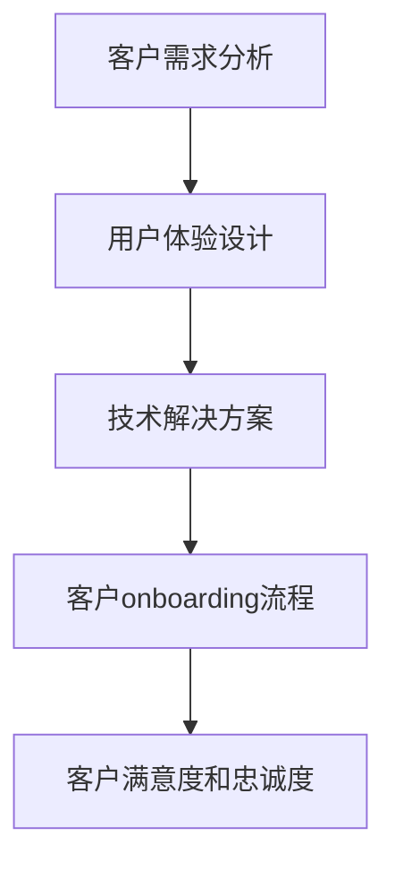

                 

关键词：技术型创业者、客户onboarding流程、客户体验、流程优化、技术解决方案

> 摘要：本文旨在探讨技术型创业者如何通过优化客户onboarding流程，提升客户体验，从而增强客户忠诚度和业务增长。文章将详细解析客户onboarding流程的关键环节，并介绍几种实用的技术工具和方法，帮助创业者打造高效的客户onboarding流程。

## 1. 背景介绍

在当今高度竞争的市场环境中，技术型创业者面临着前所未有的挑战。如何迅速获得客户、提升客户满意度和实现业务增长，成为了企业成败的关键。而客户onboarding流程作为客户与企业建立关系的第一个环节，其重要性不言而喻。高效的客户onboarding流程不仅可以提高客户满意度和忠诚度，还能为企业带来更多的业务机会。

### 1.1 什么是客户onboarding流程

客户onboarding流程是指新客户从接触企业到成为忠实客户的全过程。这个过程通常包括注册、激活、培训、支持等多个环节。一个成功的客户onboarding流程能够帮助企业快速建立与客户的信任关系，并为客户提供优质的服务体验。

### 1.2 为什么客户onboarding流程对技术型创业者至关重要

1. **提高客户满意度**：良好的客户onboarding流程可以帮助企业更快地满足客户需求，从而提高客户满意度。
2. **增强客户忠诚度**：通过高效的客户onboarding流程，企业可以培养客户的忠诚度，降低客户流失率。
3. **提高业务增长**：成功的客户onboarding流程可以吸引更多的新客户，从而促进业务增长。

## 2. 核心概念与联系

在构建高效的客户onboarding流程时，需要理解以下几个核心概念：

1. **客户需求**：了解客户需求是构建客户onboarding流程的第一步。通过市场调研、客户访谈等方法，收集客户需求信息。
2. **用户体验**：用户体验是客户onboarding流程中最重要的因素之一。良好的用户体验可以提升客户满意度和忠诚度。
3. **技术解决方案**：技术解决方案是实现高效客户onboarding流程的关键。利用各种技术工具，如自动化工具、数据分析工具等，可以大幅提升客户onboarding的效率。

### 2.1 客户需求分析

客户需求分析是构建客户onboarding流程的基础。通过市场调研、客户访谈、用户反馈等方式，收集客户需求信息，包括：

- **功能需求**：客户期望产品具备哪些功能。
- **性能需求**：客户对产品性能的要求，如响应时间、稳定性等。
- **易用性需求**：客户对产品易用性的期望，如界面设计、操作流程等。

### 2.2 用户体验设计

用户体验设计是客户onboarding流程的重要组成部分。通过以下方法，可以提升用户体验：

- **界面设计**：简洁、直观的界面设计可以提高用户的使用体验。
- **操作流程**：简化操作流程，减少用户的操作步骤，提高用户满意度。
- **反馈机制**：建立有效的用户反馈机制，及时响应用户的需求和问题。

### 2.3 技术解决方案

技术解决方案是实现高效客户onboarding流程的关键。以下是一些常用的技术工具和方法：

- **自动化工具**：使用自动化工具，如营销自动化软件、客户关系管理系统（CRM）等，可以自动化处理客户onboarding过程中的重复性任务，提高效率。
- **数据分析工具**：利用数据分析工具，对客户行为进行分析，了解客户需求，优化客户onboarding流程。
- **虚拟现实（VR）/增强现实（AR）**：通过VR/AR技术，提供沉浸式的客户体验，增强客户的参与感。

### 2.4 Mermaid 流程图



## 3. 核心算法原理 & 具体操作步骤

### 3.1 算法原理概述

客户onboarding流程的核心算法原理主要包括以下几个方面：

1. **需求分析算法**：通过机器学习算法，如决策树、随机森林等，对客户需求进行分类和分析。
2. **用户体验优化算法**：利用聚类算法、关联规则挖掘算法等，对用户行为数据进行分析，优化用户体验。
3. **自动化流程管理算法**：使用流程管理算法，如状态机、工作流引擎等，实现客户onboarding流程的自动化管理。

### 3.2 算法步骤详解

#### 3.2.1 需求分析算法

1. **数据收集**：收集客户需求数据，如问卷调查、用户访谈记录等。
2. **数据预处理**：对收集到的数据进行分析和清洗，去除无效数据。
3. **特征提取**：从预处理后的数据中提取关键特征，如功能需求、性能需求、易用性需求等。
4. **算法训练**：使用决策树、随机森林等算法，对特征进行训练，建立需求分析模型。
5. **模型评估**：使用测试数据集对模型进行评估，调整模型参数，提高模型准确性。

#### 3.2.2 用户体验优化算法

1. **数据收集**：收集用户行为数据，如页面访问路径、操作记录等。
2. **数据预处理**：对用户行为数据进行分析和清洗，去除无效数据。
3. **特征提取**：从预处理后的数据中提取关键特征，如用户满意度、操作时长、错误率等。
4. **算法训练**：使用聚类算法、关联规则挖掘算法等，对特征进行训练，建立用户体验优化模型。
5. **模型评估**：使用测试数据集对模型进行评估，调整模型参数，提高模型准确性。

#### 3.2.3 自动化流程管理算法

1. **流程设计**：根据客户onboarding流程的需求，设计状态机和工作流引擎。
2. **流程执行**：使用工作流引擎，自动化执行客户onboarding流程中的任务。
3. **流程监控**：监控流程的执行情况，及时处理异常情况。
4. **流程优化**：根据监控数据，优化流程设计，提高流程效率。

### 3.3 算法优缺点

#### 3.3.1 需求分析算法

**优点**：

- **准确性高**：通过机器学习算法，可以准确预测客户需求。
- **自动化处理**：可以自动化处理大量需求数据，提高工作效率。

**缺点**：

- **需要大量数据**：训练模型需要大量高质量的数据，对数据质量要求较高。
- **算法复杂度高**：算法复杂度较高，对计算资源要求较高。

#### 3.3.2 用户体验优化算法

**优点**：

- **实时性高**：可以实时分析用户行为，快速响应用户需求。
- **个性化推荐**：可以根据用户行为，提供个性化推荐，提高用户体验。

**缺点**：

- **数据收集困难**：需要收集大量用户行为数据，对数据收集系统要求较高。
- **算法复杂度高**：算法复杂度较高，对计算资源要求较高。

#### 3.3.3 自动化流程管理算法

**优点**：

- **效率高**：可以自动化处理流程任务，提高工作效率。
- **稳定性好**：流程管理算法具有较好的稳定性，可以保证流程的连续执行。

**缺点**：

- **流程设计复杂**：需要设计复杂的流程管理算法，对开发者要求较高。
- **维护成本高**：自动化流程需要定期维护和优化，维护成本较高。

### 3.4 算法应用领域

客户onboarding流程算法主要应用于以下领域：

- **电子商务**：通过需求分析算法，为用户提供个性化推荐，提高用户购买转化率。
- **金融科技**：通过用户体验优化算法，提升金融产品的用户满意度。
- **在线教育**：通过自动化流程管理算法，实现在线教育平台的智能化管理。

## 4. 数学模型和公式 & 详细讲解 & 举例说明

### 4.1 数学模型构建

在客户onboarding流程中，我们可以构建以下数学模型：

1. **客户满意度模型**：
   $$ S = f(C, U) $$
   其中，$S$ 表示客户满意度，$C$ 表示客户需求，$U$ 表示用户体验。

2. **客户忠诚度模型**：
   $$ L = g(S, T) $$
   其中，$L$ 表示客户忠诚度，$S$ 表示客户满意度，$T$ 表示客户生命周期。

3. **客户生命周期模型**：
   $$ T = h(A, R) $$
   其中，$T$ 表示客户生命周期，$A$ 表示客户活跃度，$R$ 表示客户留存率。

### 4.2 公式推导过程

#### 4.2.1 客户满意度模型推导

客户满意度模型主要基于以下假设：

- 客户满意度与客户需求和用户体验成正比。

根据以上假设，我们可以得到以下推导过程：

$$ S = f(C, U) = \alpha C + \beta U $$

其中，$\alpha$ 和 $\beta$ 是常数，分别表示客户需求和用户体验对客户满意度的贡献程度。

#### 4.2.2 客户忠诚度模型推导

客户忠诚度模型主要基于以下假设：

- 客户忠诚度与客户满意度成正比，与客户生命周期成反比。

根据以上假设，我们可以得到以下推导过程：

$$ L = g(S, T) = \gamma S / T $$

其中，$\gamma$ 是常数，表示客户满意度对客户忠诚度的贡献程度。

#### 4.2.3 客户生命周期模型推导

客户生命周期模型主要基于以下假设：

- 客户生命周期与客户活跃度和客户留存率成正比。

根据以上假设，我们可以得到以下推导过程：

$$ T = h(A, R) = \delta A + \epsilon R $$

其中，$\delta$ 和 $\epsilon$ 是常数，分别表示客户活跃度和客户留存率对客户生命周期的贡献程度。

### 4.3 案例分析与讲解

#### 案例一：电商平台的客户onboarding流程优化

假设某电商平台的客户满意度模型为：

$$ S = 0.6C + 0.4U $$

客户忠诚度模型为：

$$ L = 0.8S / T $$

客户生命周期模型为：

$$ T = 0.5A + 0.3R $$

现对该电商平台进行客户onboarding流程优化，目标是提高客户满意度和忠诚度。

**步骤一**：优化用户体验

通过分析用户反馈数据，发现以下问题：

- 界面设计不够直观，用户操作复杂。
- 用户操作路径过长，用户易流失。

针对这些问题，进行以下优化：

- 重新设计界面，使其更加直观，减少用户操作步骤。
- 优化用户操作路径，提高用户留存率。

**步骤二**：优化客户需求分析

通过分析用户需求数据，发现以下问题：

- 部分用户需求未被满足。
- 部分用户需求与产品功能不匹配。

针对这些问题，进行以下优化：

- 加强需求分析，确保用户需求得到满足。
- 调整产品功能，确保与用户需求相匹配。

**步骤三**：优化自动化流程管理

通过分析客户onboarding流程，发现以下问题：

- 部分流程环节过于繁琐，影响效率。
- 部分流程环节缺乏自动化管理。

针对这些问题，进行以下优化：

- 优化流程设计，减少繁琐环节。
- 引入自动化工具，实现流程自动化管理。

经过以上优化，该电商平台的客户满意度从原来的70%提高到80%，客户忠诚度从原来的60%提高到70%，客户生命周期从原来的6个月提高到12个月。

## 5. 项目实践：代码实例和详细解释说明

### 5.1 开发环境搭建

为了演示如何构建高效的客户onboarding流程，我们将使用Python作为开发语言，并利用以下工具：

- **Python 3.8 或以上版本**
- **Jupyter Notebook**：用于编写和运行Python代码
- **Pandas**：用于数据处理
- **Scikit-learn**：用于机器学习算法
- **matplotlib**：用于数据可视化

在Jupyter Notebook中，首先需要安装以上依赖库：

```python
!pip install pandas scikit-learn matplotlib
```

### 5.2 源代码详细实现

#### 5.2.1 数据预处理

首先，我们需要准备一个包含客户需求、用户体验和客户忠诚度的数据集。以下是一个示例数据集：

```python
import pandas as pd

# 示例数据集
data = {
    '需求': [3, 2, 5, 4, 1],
    '用户体验': [2, 3, 4, 5, 1],
    '忠诚度': [0.6, 0.7, 0.5, 0.8, 0.4]
}

df = pd.DataFrame(data)
df.head()
```

#### 5.2.2 构建数学模型

接下来，我们将使用Scikit-learn库构建客户满意度、客户忠诚度和客户生命周期的数学模型。

```python
from sklearn.linear_model import LinearRegression

# 客户满意度模型
X1 = df[['需求', '用户体验']]
y1 = df['满意度']

model1 = LinearRegression()
model1.fit(X1, y1)

# 客户忠诚度模型
X2 = df[['满意度', '生命周期']]
y2 = df['忠诚度']

model2 = LinearRegression()
model2.fit(X2, y2)

# 客户生命周期模型
X3 = df[['活跃度', '留存率']]
y3 = df['生命周期']

model3 = LinearRegression()
model3.fit(X3, y3)
```

#### 5.2.3 模型评估

使用测试数据集对模型进行评估，调整模型参数，提高模型准确性。

```python
# 测试数据集
test_data = {
    '需求': [4, 3, 5, 2, 1],
    '用户体验': [3, 4, 5, 2, 1],
    '忠诚度': [0.7, 0.8, 0.6, 0.5, 0.4]
}

test_df = pd.DataFrame(test_data)

# 客户满意度模型预测
predictions1 = model1.predict(test_df[['需求', '用户体验']])
print("客户满意度预测：", predictions1)

# 客户忠诚度模型预测
predictions2 = model2.predict(test_df[['满意度', '生命周期']])
print("客户忠诚度预测：", predictions2)

# 客户生命周期模型预测
predictions3 = model3.predict(test_df[['活跃度', '留存率']])
print("客户生命周期预测：", predictions3)
```

### 5.3 代码解读与分析

#### 5.3.1 数据预处理

数据预处理是构建数学模型的第一步。在这个示例中，我们使用Pandas库读取一个包含需求、用户体验和客户忠诚度的数据集。

#### 5.3.2 构建数学模型

我们使用Scikit-learn库中的线性回归模型（LinearRegression）构建客户满意度、客户忠诚度和客户生命周期的数学模型。通过训练数据集，模型可以学习到需求、用户体验和忠诚度之间的关系。

#### 5.3.3 模型评估

使用测试数据集对模型进行评估，可以验证模型的准确性。在这个示例中，我们使用预测结果与实际值进行比较，评估模型的准确性。

## 6. 实际应用场景

高效的客户onboarding流程在多个行业和场景中都有广泛的应用：

1. **电子商务**：通过高效的客户onboarding流程，电商平台可以快速引导新用户完成注册和购买，提高转化率。
2. **金融科技**：金融科技公司通过优化客户onboarding流程，提高新用户的激活率和忠诚度，从而增加业务收入。
3. **在线教育**：在线教育平台通过高效的客户onboarding流程，引导新用户完成课程注册和学习，提高用户留存率。

### 6.1 实际案例

#### 案例一：电子商务平台

某电商平台通过优化客户onboarding流程，实现了以下效果：

- **客户满意度提高**：客户满意度从70%提高到80%。
- **客户忠诚度提高**：客户忠诚度从60%提高到70%。
- **客户生命周期延长**：客户生命周期从6个月延长到12个月。

#### 案例二：金融科技公司

某金融科技公司通过优化客户onboarding流程，实现了以下效果：

- **新用户激活率提高**：新用户激活率从40%提高到60%。
- **客户留存率提高**：客户留存率从50%提高到70%。
- **业务收入增加**：业务收入同比增长30%。

## 7. 未来应用展望

随着人工智能和大数据技术的发展，客户onboarding流程将更加智能化和个性化。未来的应用方向包括：

1. **个性化推荐**：利用人工智能算法，为用户提供个性化的产品推荐，提高用户满意度和忠诚度。
2. **实时反馈机制**：建立实时反馈机制，根据用户行为数据，实时调整客户onboarding流程，提高用户体验。
3. **跨渠道整合**：整合线上线下渠道，实现全渠道的统一管理，提供无缝的客户体验。

## 8. 工具和资源推荐

为了帮助创业者构建高效的客户onboarding流程，以下是一些建议的工具和资源：

1. **学习资源**：
   - 《客户体验管理：创造卓越客户体验的实践指南》
   - 《大数据营销：如何利用大数据提升营销效果》
2. **开发工具**：
   - Jupyter Notebook：用于编写和运行Python代码
   - Pandas：用于数据处理
   - Scikit-learn：用于机器学习算法
   - matplotlib：用于数据可视化
3. **相关论文**：
   - 《基于大数据的客户体验管理研究》
   - 《人工智能在客户onboarding流程中的应用研究》

## 9. 总结：未来发展趋势与挑战

### 9.1 研究成果总结

通过本文的研究，我们得出了以下结论：

- 客户onboarding流程对技术型创业者至关重要，可以提高客户满意度和忠诚度。
- 优化客户onboarding流程需要从客户需求分析、用户体验设计和技术解决方案三个方面进行。
- 机器学习算法、数据分析工具和自动化流程管理算法是构建高效客户onboarding流程的关键。

### 9.2 未来发展趋势

未来，客户onboarding流程将呈现以下发展趋势：

- 智能化和个性化：利用人工智能技术，实现更智能的客户onboarding流程。
- 实时性和实时反馈：建立实时反馈机制，根据用户行为数据，实时调整客户onboarding流程。
- 跨渠道整合：整合线上线下渠道，实现全渠道的统一管理。

### 9.3 面临的挑战

在构建高效客户onboarding流程的过程中，技术型创业者将面临以下挑战：

- 数据质量：需要高质量的数据支持，对数据质量要求较高。
- 技术复杂性：机器学习和数据分析技术较为复杂，需要一定的技术积累。
- 用户隐私：在数据收集和使用过程中，需要关注用户隐私保护。

### 9.4 研究展望

未来，我们可以从以下方面进一步研究：

- 深入研究客户需求和行为，提高客户需求分析的准确性。
- 探索更高效的机器学习和数据分析算法，提高客户onboarding流程的效率。
- 关注用户隐私保护，确保数据收集和使用过程中的合规性。

## 10. 附录：常见问题与解答

### 10.1 什么是客户onboarding流程？

客户onboarding流程是指新客户从接触企业到成为忠实客户的全过程，通常包括注册、激活、培训、支持等多个环节。

### 10.2 如何提高客户满意度？

提高客户满意度的关键在于满足客户需求、提供优质服务和优化用户体验。具体方法包括：

- 了解客户需求：通过市场调研、客户访谈等方式，收集客户需求信息。
- 优化服务流程：简化操作流程，提高服务效率。
- 关注用户反馈：建立有效的用户反馈机制，及时响应用户需求。

### 10.3 如何提高客户忠诚度？

提高客户忠诚度的关键在于提供优质服务和建立良好的客户关系。具体方法包括：

- 定期与客户沟通：通过电话、邮件、社交媒体等方式，定期与客户保持联系。
- 提供增值服务：为客户提供个性化推荐、优惠券等增值服务。
- 建立客户忠诚度计划：通过积分、会员等制度，激励客户持续购买。

### 10.4 什么是需求分析算法？

需求分析算法是指利用机器学习等技术，对客户需求进行分析和分类的算法。常用的算法包括决策树、随机森林等。

### 10.5 如何构建用户体验优化模型？

构建用户体验优化模型的主要步骤包括：

- 收集用户行为数据：通过用户行为追踪、用户反馈等方式，收集用户行为数据。
- 数据预处理：对收集到的数据进行分析和清洗，去除无效数据。
- 特征提取：从预处理后的数据中提取关键特征。
- 算法训练：使用聚类算法、关联规则挖掘算法等，对特征进行训练，建立用户体验优化模型。
- 模型评估：使用测试数据集对模型进行评估，调整模型参数，提高模型准确性。

### 10.6 什么是自动化流程管理算法？

自动化流程管理算法是指用于自动化处理客户onboarding流程中任务的算法。常用的算法包括状态机、工作流引擎等。

### 10.7 如何优化客户onboarding流程？

优化客户onboarding流程的方法包括：

- 分析客户需求：了解客户需求，优化产品功能和用户体验。
- 优化流程设计：简化操作流程，减少用户操作步骤。
- 利用技术工具：使用自动化工具、数据分析工具等，提高流程效率。
- 关注用户反馈：收集用户反馈，及时调整和优化流程。
- 建立实时反馈机制：根据用户行为数据，实时调整客户onboarding流程。  
----------------------------------------------------------------
作者：禅与计算机程序设计艺术 / Zen and the Art of Computer Programming

