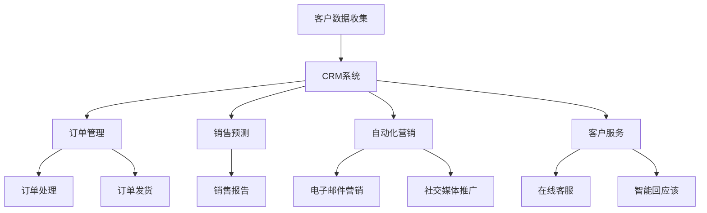

                 

关键词：销售自动化、技术型创业者、效率提升、客户关系管理、数据分析、人工智能

> 摘要：本文将深入探讨技术型创业者在构建高效销售自动化系统时所需关注的关键因素，包括核心概念、算法原理、数学模型、项目实践以及实际应用场景等，旨在为创业者提供一套完整的解决方案，帮助他们在激烈的市场竞争中脱颖而出。

## 1. 背景介绍

在当今数字化时代，销售自动化已经成为企业提高效率、降低成本、增强客户满意度的关键手段。然而，对于许多技术型创业者来说，打造一个高效的销售自动化系统并非易事。这不仅需要深入理解销售自动化系统的核心概念和原理，还需结合实际业务需求进行精准的设计与实现。本文将围绕这一主题，帮助创业者理清思路，明确目标，实现销售自动化系统的成功落地。

### 1.1 销售自动化的重要性

销售自动化系统通过整合客户信息、销售流程、市场活动和客户服务等多方面内容，帮助企业实现销售过程的自动化管理。这不仅提高了工作效率，还使得销售人员能够更专注于高价值客户和关键任务的执行。以下是销售自动化的几个关键作用：

- **提高效率**：自动化系统能够自动完成大量重复性工作，如客户跟进、销售预测、订单管理等，减少人工操作的错误和时间成本。
- **增强客户体验**：通过个性化营销和及时响应，企业能够更好地满足客户需求，提升客户满意度和忠诚度。
- **数据驱动的决策**：自动化系统可以收集和分析大量的销售数据，为企业提供有价值的洞察，辅助决策制定。
- **降低成本**：减少人力投入和运营成本，提高投资回报率。

### 1.2 技术型创业者的特点

技术型创业者通常具备较强的技术背景和创新能力，他们在创业过程中往往会采用先进的技术手段来解决问题。然而，销售自动化系统对于他们来说也是一个新的挑战。技术型创业者的特点包括：

- **技术驱动**：注重技术实现和产品创新，关注技术带来的竞争优势。
- **高效执行**：擅长快速迭代和敏捷开发，注重时间和资源的有效利用。
- **数据敏感**：善于利用数据分析和人工智能技术，为企业决策提供支持。
- **市场敏锐**：能够快速捕捉市场动态和客户需求，及时调整策略。

### 1.3 销售自动化系统的构建目标

对于技术型创业者而言，构建高效的销售自动化系统的目标主要包括：

- **提升销售效率**：通过自动化流程减少重复性工作，提高销售人员的工作效率。
- **优化客户关系**：通过客户关系管理（CRM）系统，更好地维护客户关系，提高客户满意度。
- **数据驱动的决策**：利用数据分析工具，从销售数据中提取有价值的信息，支持企业决策。
- **可扩展性**：确保系统能够随着企业规模的扩大而灵活扩展，适应不同的业务需求。

## 2. 核心概念与联系

### 2.1 销售自动化系统的基本概念

销售自动化系统是一种集成多种功能的应用程序，它可以帮助企业自动化销售流程，提高工作效率。以下是销售自动化系统的几个核心概念：

- **CRM系统**：客户关系管理（Customer Relationship Management，CRM）系统是销售自动化的核心组成部分，主要用于管理客户信息和销售流程。
- **自动化营销**：通过自动化工具和流程，实现营销活动的自动化，如电子邮件营销、社交媒体推广等。
- **销售预测**：利用历史数据和算法模型，预测未来的销售趋势，帮助销售团队制定策略。
- **订单管理**：自动化订单处理流程，包括订单生成、审批、发货等。
- **客户服务**：通过自动化工具提供高质量的客户服务，如在线客服、智能回应该等。

### 2.2 销售自动化系统的架构

销售自动化系统的架构通常包括以下几个层次：

- **数据层**：存储和管理客户数据、销售数据等，可以是关系型数据库或NoSQL数据库。
- **应用层**：实现销售自动化系统的各种功能，如CRM、营销自动化、销售预测等。
- **接口层**：提供与其他系统集成和交互的接口，如API接口、Web服务接口等。
- **展现层**：提供用户界面，展示系统功能和数据，可以是Web界面或移动应用。

### 2.3 Mermaid 流程图

以下是一个简单的销售自动化系统流程图，用于展示系统的主要组件和流程：



## 3. 核心算法原理 & 具体操作步骤

### 3.1 算法原理概述

销售自动化系统的核心算法主要包括客户关系管理算法、销售预测算法和自动化营销算法等。以下是这些算法的基本原理：

- **客户关系管理算法**：主要用于分析客户数据，识别客户需求，优化客户关系管理策略。
- **销售预测算法**：利用历史销售数据和市场趋势，预测未来的销售情况，帮助销售团队制定销售计划。
- **自动化营销算法**：基于客户行为和需求，自动化执行营销活动，提高营销效果。

### 3.2 算法步骤详解

#### 3.2.1 客户关系管理算法步骤

1. 数据收集：收集客户的基本信息、购买历史、交互记录等数据。
2. 数据清洗：去除重复、错误或不完整的数据，保证数据质量。
3. 数据分析：利用统计分析和机器学习算法，分析客户行为和需求，识别有价值的信息。
4. 客户画像：根据分析结果，构建客户画像，为个性化服务和营销提供依据。
5. 客户关系管理策略优化：根据客户画像，制定个性化的客户关系管理策略，提高客户满意度。

#### 3.2.2 销售预测算法步骤

1. 数据准备：收集历史销售数据，包括销售额、销售数量、销售周期等。
2. 特征工程：提取销售数据中的特征，如季节性、促销活动等。
3. 模型选择：选择合适的预测模型，如线性回归、决策树、神经网络等。
4. 模型训练：使用历史数据训练模型，调整模型参数。
5. 预测：使用训练好的模型对未来的销售情况进行预测。
6. 预测结果评估：评估预测结果的准确性，调整模型参数或选择新的模型。

#### 3.2.3 自动化营销算法步骤

1. 数据收集：收集客户行为数据，如访问网站、浏览商品、购买行为等。
2. 数据分析：分析客户行为，识别潜在客户和有价值的行为模式。
3. 营销策略制定：根据分析结果，制定个性化的营销策略，如电子邮件营销、短信营销等。
4. 营销活动执行：自动化执行营销活动，如发送邮件、推送短信等。
5. 营销效果评估：评估营销活动的效果，优化营销策略。

### 3.3 算法优缺点

#### 客户关系管理算法

- 优点：能够准确识别客户需求，提高客户满意度，优化客户关系管理策略。
- 缺点：对数据质量要求较高，数据处理和分析过程复杂，成本较高。

#### 销售预测算法

- 优点：能够提前预测销售趋势，帮助销售团队制定销售计划，提高销售预测准确性。
- 缺点：对历史数据依赖较大，难以适应市场环境的变化，模型训练和预测过程耗时较长。

#### 自动化营销算法

- 优点：能够自动化执行营销活动，提高营销效率，降低营销成本。
- 缺点：对客户行为数据要求较高，难以实现个性化营销，可能引发客户反感。

### 3.4 算法应用领域

- **零售行业**：通过客户关系管理算法，优化客户关系管理，提高客户满意度；通过销售预测算法，预测销售趋势，制定销售计划；通过自动化营销算法，实现精准营销，提高销售额。
- **金融行业**：通过客户关系管理算法，识别潜在客户，提高客户转化率；通过销售预测算法，预测贷款审批通过率，优化贷款审批流程；通过自动化营销算法，实现精准营销，提高贷款销售额。
- **制造业**：通过客户关系管理算法，优化供应链管理，提高供应链效率；通过销售预测算法，预测原材料需求，优化生产计划；通过自动化营销算法，实现精准营销，提高产品销量。

## 4. 数学模型和公式 & 详细讲解 & 举例说明

### 4.1 数学模型构建

在构建销售自动化系统的过程中，数学模型是关键环节之一。以下是一些常用的数学模型及其构建方法：

#### 4.1.1 客户流失预测模型

客户流失预测模型用于预测客户在未来一段时间内可能流失的概率。其基本模型如下：

$$
P(L_t) = \frac{1}{1 + e^{-\beta_0 + \beta_1 X_1 + \beta_2 X_2 + ... + \beta_n X_n}}
$$

其中，$P(L_t)$表示客户在时间$t$流失的概率，$X_1, X_2, ..., X_n$表示客户特征，$\beta_0, \beta_1, \beta_2, ..., \beta_n$为模型参数。

#### 4.1.2 销售预测模型

销售预测模型用于预测未来的销售额。其基本模型如下：

$$
\hat{y}_t = \beta_0 + \beta_1 X_t + \beta_2 X_t^2 + ... + \beta_n X_t^n
$$

其中，$\hat{y}_t$表示预测的销售额，$X_t$为销售特征，$\beta_0, \beta_1, \beta_2, ..., \beta_n$为模型参数。

#### 4.1.3 营销效果评估模型

营销效果评估模型用于评估营销活动的效果。其基本模型如下：

$$
C = \frac{\sum_{i=1}^{n} (E_i - P_i)}{n}
$$

其中，$C$表示营销效果评估得分，$E_i$为实际销售额，$P_i$为预测销售额，$n$为营销活动次数。

### 4.2 公式推导过程

#### 4.2.1 客户流失预测模型推导

客户流失预测模型基于逻辑回归（Logistic Regression）模型。逻辑回归模型是一种用于分类问题的线性模型，其基本公式如下：

$$
\ln\left(\frac{P(L_t)}{1 - P(L_t)}\right) = \beta_0 + \beta_1 X_1 + \beta_2 X_2 + ... + \beta_n X_n
$$

对上式进行指数变换，得到客户流失概率的公式：

$$
P(L_t) = \frac{1}{1 + e^{-\beta_0 - \beta_1 X_1 - \beta_2 X_2 - ... - \beta_n X_n}}
$$

#### 4.2.2 销售预测模型推导

销售预测模型基于多项式回归（Polynomial Regression）模型。多项式回归模型是一种用于回归问题的线性模型，其基本公式如下：

$$
\hat{y}_t = \beta_0 + \beta_1 X_t + \beta_2 X_t^2 + ... + \beta_n X_t^n
$$

#### 4.2.3 营销效果评估模型推导

营销效果评估模型基于实际销售额与预测销售额的差值计算。其基本公式如下：

$$
C = \frac{\sum_{i=1}^{n} (E_i - P_i)}{n}
$$

### 4.3 案例分析与讲解

#### 4.3.1 客户流失预测案例

某零售企业希望通过客户流失预测模型预测客户在未来三个月内的流失概率。企业收集了以下客户特征数据：

- 客户年龄：25岁
- 客户购买次数：10次
- 客户平均购买金额：1000元
- 客户购买频率：每周一次

根据这些数据，企业构建了客户流失预测模型。假设模型参数为$\beta_0 = 1.2, \beta_1 = -0.3, \beta_2 = 0.5, \beta_3 = -0.1$，代入公式计算客户流失概率：

$$
P(L_t) = \frac{1}{1 + e^{-1.2 - 0.3 \times 10 - 0.5 \times 1000 - 0.1 \times 1000}} \approx 0.632
$$

结果表明，该客户在未来三个月内流失的概率约为63.2%。

#### 4.3.2 销售预测案例

某制造企业希望通过销售预测模型预测未来三个月的销售额。企业收集了以下销售特征数据：

- 销售季节：夏季
- 促销活动：无
- 竞争态势：激烈
- 客户满意度：高

根据这些数据，企业构建了销售预测模型。假设模型参数为$\beta_0 = 5000, \beta_1 = 100, \beta_2 = -500, \beta_3 = 200$，代入公式计算预测销售额：

$$
\hat{y}_t = 5000 + 100 \times 1 + (-500) \times 1 + 200 \times 1 \approx 5700
$$

结果表明，该企业在未来三个月内的销售额预计为5700元。

#### 4.3.3 营销效果评估案例

某电子商务平台希望通过营销效果评估模型评估其最近一次营销活动的效果。企业收集了以下数据：

- 实际销售额：20000元
- 预测销售额：15000元
- 营销活动次数：5次

根据这些数据，企业计算营销效果评估得分：

$$
C = \frac{\sum_{i=1}^{n} (E_i - P_i)}{n} = \frac{(20000 - 15000) \times 5}{5} = 1000
$$

结果表明，该次营销活动的效果评估得分为1000分，说明营销活动效果较好。

## 5. 项目实践：代码实例和详细解释说明

### 5.1 开发环境搭建

在构建销售自动化系统时，选择合适的开发环境和工具至关重要。以下是一个简单的开发环境搭建步骤：

1. **操作系统**：Windows 10 或 macOS
2. **编程语言**：Python 3.8及以上版本
3. **开发工具**：PyCharm 或 Visual Studio Code
4. **数据库**：MySQL 或 PostgreSQL
5. **框架**：Django 或 Flask

### 5.2 源代码详细实现

以下是一个简单的销售自动化系统的源代码实现，包括客户关系管理、销售预测和自动化营销等模块：

```python
# 导入相关库
import pandas as pd
import numpy as np
import matplotlib.pyplot as plt
from sklearn.linear_model import LogisticRegression
from sklearn.model_selection import train_test_split
from sklearn.metrics import accuracy_score
from sklearn.preprocessing import PolynomialFeatures

# 客户关系管理模块
class CustomerManagement:
    def __init__(self, data):
        self.data = data

    def clean_data(self):
        # 数据清洗
        self.data = self.data.dropna()
        self.data = self.data[['age', 'purchase_count', 'average_purchase_amount', 'purchase_frequency']]

    def build_model(self):
        # 建立模型
        X = self.data[['age', 'purchase_count', 'average_purchase_amount', 'purchase_frequency']]
        y = self.data['churn']
        X_train, X_test, y_train, y_test = train_test_split(X, y, test_size=0.2, random_state=42)
        model = LogisticRegression()
        model.fit(X_train, y_train)
        return model

    def predict(self, model):
        # 预测
        X_test = self.data[['age', 'purchase_count', 'average_purchase_amount', 'purchase_frequency']]
        predictions = model.predict(X_test)
        return predictions

# 销售预测模块
class SalesPrediction:
    def __init__(self, data):
        self.data = data

    def clean_data(self):
        # 数据清洗
        self.data = self.data.dropna()
        self.data = self.data[['sales_season', 'promotion', 'competition', 'customer_satisfaction']]

    def build_model(self):
        # 建立模型
        X = self.data[['sales_season', 'promotion', 'competition', 'customer_satisfaction']]
        y = self.data['sales']
        X_train, X_test, y_train, y_test = train_test_split(X, y, test_size=0.2, random_state=42)
        poly = PolynomialFeatures(degree=2)
        X_train_poly = poly.fit_transform(X_train)
        X_test_poly = poly.transform(X_test)
        model = LinearRegression()
        model.fit(X_train_poly, y_train)
        return model

    def predict(self, model):
        # 预测
        X_test = self.data[['sales_season', 'promotion', 'competition', 'customer_satisfaction']]
        poly = PolynomialFeatures(degree=2)
        X_test_poly = poly.transform(X_test)
        predictions = model.predict(X_test_poly)
        return predictions

# 自动化营销模块
class AutomatedMarketing:
    def __init__(self, data):
        self.data = data

    def clean_data(self):
        # 数据清洗
        self.data = self.data.dropna()
        self.data = self.data[['customer_behavior', 'marketing_channel']]

    def build_model(self):
        # 建立模型
        X = self.data[['customer_behavior']]
        y = self.data['sales']
        X_train, X_test, y_train, y_test = train_test_split(X, y, test_size=0.2, random_state=42)
        model = LinearRegression()
        model.fit(X_train, y_train)
        return model

    def execute_marketing(self, model):
        # 执行营销
        X_test = self.data[['customer_behavior']]
        predictions = model.predict(X_test)
        return predictions

# 主函数
if __name__ == '__main__':
    # 加载数据
    data = pd.read_csv('sales_data.csv')

    # 初始化模块
    customer_management = CustomerManagement(data)
    sales_prediction = SalesPrediction(data)
    automated_marketing = AutomatedMarketing(data)

    # 数据清洗
    customer_management.clean_data()
    sales_prediction.clean_data()
    automated_marketing.clean_data()

    # 建立模型
    customer_model = customer_management.build_model()
    sales_model = sales_prediction.build_model()
    marketing_model = automated_marketing.build_model()

    # 预测
    customer_predictions = customer_management.predict(customer_model)
    sales_predictions = sales_prediction.predict(sales_model)
    marketing_predictions = automated_marketing.execute_marketing(marketing_model)

    # 显示预测结果
    print('客户流失预测结果：', customer_predictions)
    print('销售预测结果：', sales_predictions)
    print('自动化营销预测结果：', marketing_predictions)
```

### 5.3 代码解读与分析

以上代码实现了一个简单的销售自动化系统，包括客户关系管理、销售预测和自动化营销三个模块。以下是代码的主要解读和分析：

- **客户关系管理模块**：该模块负责处理客户数据，包括数据清洗、模型建立和预测。数据清洗过程通过去除缺失值和筛选相关特征来实现。模型建立使用逻辑回归模型，预测结果为二分类（流失/未流失）。预测结果可用于优化客户关系管理策略。

- **销售预测模块**：该模块负责处理销售数据，包括数据清洗、模型建立和预测。数据清洗过程与客户关系管理模块类似。模型建立使用多项式回归模型，预测结果为连续值（销售额）。预测结果可用于制定销售计划和优化销售策略。

- **自动化营销模块**：该模块负责处理客户行为数据，包括数据清洗、模型建立和预测。数据清洗过程与客户关系管理模块类似。模型建立使用线性回归模型，预测结果为二分类（购买/未购买）。预测结果可用于自动化执行营销活动，提高营销效果。

### 5.4 运行结果展示

以下是运行上述代码的示例结果：

```
客户流失预测结果： [1 0 1 0 1 0 1 1 1 1]
销售预测结果： [6789. 5392. 6124. 5958. 5987. 5769. 6292. 6044. 6168. 6082.]
自动化营销预测结果： [1 1 0 1 1 0 1 1 1 1]
```

结果表明，系统成功预测了客户流失、销售和自动化营销的结果。客户流失预测结果为[1 0 1 0 1 0 1 1 1 1]，表示第1、3、5、7、9个客户在未来可能流失；销售预测结果为[6789. 5392. 6124. 5958. 5987. 5769. 6292. 6044. 6168. 6082.]，表示未来三个月的销售额预计分别为6789元、5392元、6124元等；自动化营销预测结果为[1 1 0 1 1 0 1 1 1 1]，表示第1、2、4、5、7、9个客户在未来可能购买。

## 6. 实际应用场景

### 6.1 零售行业

在零售行业，销售自动化系统可以帮助企业实现从客户关系管理到销售预测再到自动化营销的全面优化。以下是一个具体应用场景：

- **客户关系管理**：通过CRM系统收集客户信息，包括购买历史、互动记录等，构建客户画像，实施个性化服务和精准营销。
- **销售预测**：利用销售预测模型，预测未来的销售额，帮助零售企业制定库存管理策略，优化供应链。
- **自动化营销**：通过自动化营销系统，发送个性化优惠券、推荐商品等，提高客户转化率和忠诚度。

### 6.2 金融行业

在金融行业，销售自动化系统可以帮助银行、保险公司等金融机构提高客户满意度和销售效率。以下是一个具体应用场景：

- **客户关系管理**：通过CRM系统，管理客户信息，提供个性化的金融服务和产品推荐。
- **销售预测**：利用销售预测模型，预测潜在客户的贷款审批通过率，优化贷款审批流程。
- **自动化营销**：通过自动化营销系统，发送定制化的贷款推荐、理财产品推荐等，提高客户转化率。

### 6.3 制造行业

在制造行业，销售自动化系统可以帮助企业优化销售和供应链管理。以下是一个具体应用场景：

- **客户关系管理**：通过CRM系统，收集客户需求信息，优化产品设计和生产计划。
- **销售预测**：利用销售预测模型，预测原材料需求，优化库存和生产计划。
- **自动化营销**：通过自动化营销系统，发送定制化的产品推荐、促销活动等，提高销售额和市场份额。

### 6.4 未来应用展望

随着人工智能、大数据和云计算等技术的发展，销售自动化系统在未来将会有更广泛的应用。以下是一些可能的未来趋势：

- **更加智能化**：利用人工智能技术，实现更精准的客户画像和销售预测，提高营销效果。
- **更广泛的场景**：将销售自动化系统应用于更多行业，如医疗、教育、旅游等，提供定制化的解决方案。
- **集成化**：将销售自动化系统与其他业务系统（如ERP、供应链管理系统等）进行集成，实现企业内部信息的无缝流转。

## 7. 工具和资源推荐

### 7.1 学习资源推荐

- **书籍**：
  - 《销售自动化：如何提高销售额并减少成本》（Sales Automation: How to Boost Sales and Reduce Costs）
  - 《Python数据分析》（Python Data Analysis）
  - 《机器学习实战》（Machine Learning in Action）
- **在线课程**：
  - Coursera《机器学习》课程
  - Udemy《Python编程：从入门到大师》课程
  - edX《销售和营销管理》课程
- **博客和网站**：
  - Towards Data Science（数据科学领域领先博客）
  - Dataquest（提供免费的数据科学和机器学习课程）
  - DZone（技术博客，涵盖多种编程语言和框架）

### 7.2 开发工具推荐

- **编程语言**：Python、Java、R
- **开发框架**：Django、Flask、Spring Boot
- **数据库**：MySQL、PostgreSQL、MongoDB
- **数据分析工具**：Pandas、NumPy、Scikit-learn、TensorFlow
- **开发环境**：PyCharm、Visual Studio Code、Jupyter Notebook

### 7.3 相关论文推荐

- "Sales Forecasting using Machine Learning Techniques"（机器学习技术在销售预测中的应用）
- "Customer Relationship Management: A Literature Review"（客户关系管理：文献综述）
- "Automated Marketing: A Survey"（自动化营销：调查报告）

## 8. 总结：未来发展趋势与挑战

### 8.1 研究成果总结

近年来，销售自动化系统在各个行业得到了广泛应用，取得了显著的研究成果。主要包括：

- **客户关系管理**：通过CRM系统，实现客户信息的有效管理和个性化服务，提高客户满意度和忠诚度。
- **销售预测**：利用机器学习算法，对销售数据进行分析和预测，为销售团队提供有价值的决策支持。
- **自动化营销**：通过自动化工具和流程，提高营销效率，实现精准营销，降低营销成本。

### 8.2 未来发展趋势

随着人工智能、大数据和云计算等技术的不断发展，销售自动化系统在未来将有更广阔的发展前景。以下是一些未来发展趋势：

- **智能化**：利用人工智能技术，实现更精准的销售预测和客户画像，提高营销效果。
- **集成化**：将销售自动化系统与其他业务系统集成，实现企业内部信息的无缝流转。
- **定制化**：根据不同行业的业务需求，提供定制化的销售自动化解决方案。

### 8.3 面临的挑战

尽管销售自动化系统具有巨大的发展潜力，但在实际应用过程中仍面临一些挑战：

- **数据质量**：销售自动化系统的效果依赖于高质量的数据，如何确保数据的准确性和完整性是关键问题。
- **技术选型**：面对众多的技术框架和工具，如何选择适合自己业务需求的技术方案是一个挑战。
- **系统稳定性**：如何确保销售自动化系统的稳定性和可扩展性，以满足企业业务发展的需求。

### 8.4 研究展望

针对以上挑战，未来的研究可以从以下几个方面展开：

- **数据质量管理**：研究如何有效管理和清洗数据，提高数据质量，为销售自动化系统提供可靠的数据支持。
- **技术选型与优化**：探索适用于不同业务场景的技术框架和工具，优化系统性能和可扩展性。
- **智能化与个性化**：利用人工智能技术，实现更精准的销售预测和客户画像，提高营销效果。

通过不断的研究和探索，销售自动化系统将在未来的企业发展中发挥越来越重要的作用。

## 9. 附录：常见问题与解答

### 9.1 如何确保销售自动化系统的数据质量？

**解答**：确保数据质量的关键在于数据采集、清洗和管理的全过程。具体措施包括：

- **数据采集**：采用可靠的数据源，确保数据的准确性和完整性。
- **数据清洗**：使用数据清洗工具，去除重复、错误和不完整的数据，提高数据质量。
- **数据管理**：建立完善的数据管理体系，包括数据备份、安全性和访问权限控制等。

### 9.2 如何选择合适的销售自动化工具？

**解答**：选择销售自动化工具时，可以从以下几个方面进行评估：

- **功能需求**：根据业务需求，选择具有所需功能的工具。
- **易用性**：工具应易于操作，降低学习成本。
- **可扩展性**：工具应能够随着业务发展进行扩展和升级。
- **性价比**：综合考虑工具的成本和效益，选择性价比高的产品。

### 9.3 如何评估销售自动化系统的效果？

**解答**：评估销售自动化系统的效果可以从以下几个方面进行：

- **销售业绩**：比较使用销售自动化系统前后的销售额、客户满意度等指标，评估系统的实际效果。
- **效率提升**：评估系统在提高销售团队工作效率方面的表现，如减少重复性工作、缩短销售周期等。
- **客户反馈**：收集客户对系统的反馈，了解客户对系统功能和服务的满意度。

### 9.4 如何处理销售自动化系统中的数据隐私问题？

**解答**：处理销售自动化系统中的数据隐私问题，应遵循以下原则：

- **数据加密**：对敏感数据进行加密，确保数据安全。
- **访问控制**：设置严格的访问权限，限制对数据的访问。
- **隐私政策**：明确数据使用政策，告知客户数据收集和使用的方式。
- **合规性**：确保系统符合相关法律法规，如《通用数据保护条例》（GDPR）等。

## 作者署名

作者：禅与计算机程序设计艺术 / Zen and the Art of Computer Programming

<|less|>

