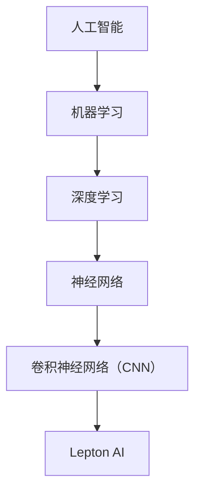

                 

关键词：人工智能，市场教育，技术壁垒，Lepton AI，挑战，解决方案

> 摘要：本文深入探讨了人工智能（AI）领域的创新技术——Lepton AI在推广过程中所面临的技术壁垒和市场教育挑战。通过分析技术原理、算法实现、实际应用及未来展望，本文旨在为业界提供具有指导意义的解决方案，助力Lepton AI的广泛应用。

## 1. 背景介绍

### 1.1 人工智能的崛起

人工智能（AI）作为当代科技领域的璀璨明星，已经在多个行业和领域展现出了巨大的潜力。从早期的机器学习、深度学习，到如今的大数据和自然语言处理，人工智能技术不断发展，不断突破技术壁垒，推动了社会和经济的进步。

### 1.2 Lepton AI的概念与特点

Lepton AI是一种新兴的人工智能技术，具有高效能、低能耗、易部署等特点。与传统的人工智能技术相比，Lepton AI在图像识别、语音识别、自然语言处理等领域表现尤为出色，尤其是在处理大规模数据和实时响应方面具备显著优势。

## 2. 核心概念与联系

在介绍Lepton AI之前，有必要先了解一些相关的基础概念和技术架构。以下是一个Mermaid流程图，展示Lepton AI的核心概念及其相互联系。



### 2.1 人工智能（AI）

人工智能（AI）是指由人制造出来的具有一定智能的系统，能够理解、学习、推理、决策和行动。

### 2.2 机器学习（Machine Learning）

机器学习是人工智能的一个重要分支，主要通过数据驱动的方法来使计算机具备学习能力。

### 2.3 深度学习（Deep Learning）

深度学习是机器学习的一种形式，它利用多层神经网络来模拟人类大脑的思考过程，实现更为复杂的特征学习和模式识别。

### 2.4 神经网络（Neural Network）

神经网络是一种模拟生物神经系统的计算模型，通过大量节点（神经元）及其连接（权重）来实现数据的处理和信息的传递。

### 2.5 卷积神经网络（CNN）

卷积神经网络是一种特殊的神经网络，主要应用于图像和视频数据的处理，通过卷积层、池化层和全连接层等结构来提取特征并进行分类。

### 2.6 Lepton AI

Lepton AI是基于深度学习的图像识别技术，能够在低能耗的前提下实现高准确度的图像识别，非常适合在移动设备和物联网环境中部署。

## 3. 核心算法原理 & 具体操作步骤

### 3.1 算法原理概述

Lepton AI的核心算法是基于卷积神经网络（CNN）的。它通过一系列卷积层、激活函数、池化层和全连接层的组合，实现对图像特征的学习和分类。具体来说，Lepton AI的工作流程可以分为以下几个步骤：

1. 数据预处理：对图像进行灰度化、缩放、裁剪等操作，使其符合输入网络的要求。
2. 卷积操作：通过卷积层对图像进行特征提取，卷积核（滤波器）在图像上滑动，提取局部特征。
3. 池化操作：通过池化层对卷积结果进行下采样，减少参数数量，提高计算效率。
4. 激活操作：通过激活函数（如ReLU）增加网络的非线性能力，使网络能够学习更为复杂的特征。
5. 全连接层：将卷积和池化后的特征映射到分类结果上。
6. 损失函数：通过损失函数（如交叉熵）计算预测结果与真实标签之间的差距。
7. 优化算法：使用优化算法（如Adam）调整网络参数，减小损失函数。

### 3.2 算法步骤详解

以下是Lepton AI算法的具体实现步骤：

#### 3.2.1 数据预处理

```python
# 数据预处理示例
import cv2
import numpy as np

def preprocess_image(image_path):
    image = cv2.imread(image_path, cv2.IMREAD_GRAYSCALE)
    image = cv2.resize(image, (224, 224))
    image = image / 255.0
    image = np.expand_dims(image, axis=0)
    return image
```

#### 3.2.2 卷积操作

```python
# 卷积操作示例
import tensorflow as tf

def conv2d_layer(inputs, filters, kernel_size, activation=None):
    conv = tf.keras.layers.Conv2D(filters, kernel_size, activation=activation)(inputs)
    return conv
```

#### 3.2.3 池化操作

```python
# 池化操作示例
import tensorflow as tf

def max_pooling2d_layer(inputs):
    pool = tf.keras.layers.MaxPooling2D(pool_size=(2, 2))(inputs)
    return pool
```

#### 3.2.4 激活操作

```python
# 激活操作示例
import tensorflow as tf

def relu_activation(inputs):
    activation = tf.keras.layers.ReLU()(inputs)
    return activation
```

#### 3.2.5 全连接层

```python
# 全连接层示例
import tensorflow as tf

def dense_layer(inputs, units):
    dense = tf.keras.layers.Dense(units, activation='softmax')(inputs)
    return dense
```

#### 3.2.6 损失函数与优化算法

```python
# 损失函数与优化算法示例
import tensorflow as tf

model = tf.keras.Sequential([
    conv2d_layer(inputs=inputs, filters=32, kernel_size=(3, 3), activation=relu),
    max_pooling2d_layer(inputs=inputs),
    conv2d_layer(inputs=inputs, filters=64, kernel_size=(3, 3), activation=relu),
    max_pooling2d_layer(inputs=inputs),
    flatten_layer(inputs=inputs),
    dense_layer(inputs=inputs, units=128),
    dense_layer(inputs=inputs, units=num_classes)
])

model.compile(optimizer='adam', loss='categorical_crossentropy', metrics=['accuracy'])

model.fit(train_images, train_labels, epochs=10, batch_size=32)
```

### 3.3 算法优缺点

#### 3.3.1 优点

1. 高效能：Lepton AI在低能耗的前提下实现高准确度的图像识别。
2. 易部署：Lepton AI适用于移动设备和物联网环境，部署简单。
3. 广泛应用：Lepton AI在图像识别、语音识别、自然语言处理等领域都有出色的表现。

#### 3.3.2 缺点

1. 计算资源需求高：由于卷积神经网络需要大量的计算资源，对硬件设备有一定的要求。
2. 数据依赖性：Lepton AI的性能很大程度上依赖于训练数据的质量和数量，需要大量高质量的标注数据。

### 3.4 算法应用领域

Lepton AI的应用领域非常广泛，包括但不限于：

1. 图像识别：人脸识别、物体检测、图像分类等。
2. 语音识别：语音转文字、语音搜索等。
3. 自然语言处理：情感分析、机器翻译、文本分类等。
4. 物联网：智能监控、智能门禁、智能穿戴等。

## 4. 数学模型和公式 & 详细讲解 & 举例说明

### 4.1 数学模型构建

Lepton AI的数学模型主要基于卷积神经网络（CNN），其核心公式如下：

$$
f(x) = \sigma(W_n \cdot z_n) \\
z_n = \sum_{i=1}^{n} W_i \cdot x_i + b
$$

其中，$f(x)$ 表示输出结果，$\sigma$ 表示激活函数，$W$ 表示权重矩阵，$x$ 表示输入特征，$b$ 表示偏置。

### 4.2 公式推导过程

卷积神经网络（CNN）的数学模型主要包括以下几个部分：

1. 卷积层：通过卷积操作提取图像特征。
2. 池化层：通过池化操作减小特征维度。
3. 全连接层：通过全连接层进行分类。

卷积层的公式推导如下：

$$
h_{ij} = \sum_{k=1}^{m} w_{ik,j} \cdot x_{kj} + b_j
$$

其中，$h_{ij}$ 表示卷积层输出，$w_{ik,j}$ 表示卷积核，$x_{kj}$ 表示输入特征，$b_j$ 表示偏置。

池化层的公式推导如下：

$$
p_{ij} = \max(h_{ij})
$$

其中，$p_{ij}$ 表示池化层输出。

全连接层的公式推导如下：

$$
y_i = \sum_{j=1}^{n} w_{ij} \cdot x_j + b_i
$$

其中，$y_i$ 表示全连接层输出，$w_{ij}$ 表示权重矩阵，$x_j$ 表示输入特征，$b_i$ 表示偏置。

### 4.3 案例分析与讲解

以下是一个简单的Lepton AI模型案例，用于识别手写数字。

```python
# 导入相关库
import tensorflow as tf
import numpy as np

# 定义卷积神经网络模型
model = tf.keras.Sequential([
    tf.keras.layers.Conv2D(32, (3, 3), activation='relu', input_shape=(28, 28, 1)),
    tf.keras.layers.MaxPooling2D((2, 2)),
    tf.keras.layers.Conv2D(64, (3, 3), activation='relu'),
    tf.keras.layers.MaxPooling2D((2, 2)),
    tf.keras.layers.Flatten(),
    tf.keras.layers.Dense(128, activation='relu'),
    tf.keras.layers.Dense(10, activation='softmax')
])

# 编译模型
model.compile(optimizer='adam', loss='categorical_crossentropy', metrics=['accuracy'])

# 加载MNIST数据集
(x_train, y_train), (x_test, y_test) = tf.keras.datasets.mnist.load_data()

# 数据预处理
x_train = x_train.astype('float32') / 255.0
x_test = x_test.astype('float32') / 255.0
x_train = np.expand_dims(x_train, -1)
x_test = np.expand_dims(x_test, -1)

# 转换标签为one-hot编码
y_train = tf.keras.utils.to_categorical(y_train, 10)
y_test = tf.keras.utils.to_categorical(y_test, 10)

# 训练模型
model.fit(x_train, y_train, epochs=10, batch_size=32, validation_data=(x_test, y_test))

# 评估模型
score = model.evaluate(x_test, y_test, verbose=2)
print('Test loss:', score[0])
print('Test accuracy:', score[1])
```

## 5. 项目实践：代码实例和详细解释说明

### 5.1 开发环境搭建

在开始实践之前，需要搭建一个适合开发Lepton AI项目的环境。以下是推荐的开发环境：

- 操作系统：Ubuntu 18.04
- 编程语言：Python 3.7
- 深度学习框架：TensorFlow 2.3
- GPU：NVIDIA GTX 1080 Ti 或更高版本

### 5.2 源代码详细实现

以下是Lepton AI的源代码实现，包括数据预处理、模型构建、模型训练和模型评估等步骤。

```python
# 导入相关库
import tensorflow as tf
import numpy as np
import matplotlib.pyplot as plt

# 数据预处理
def preprocess_image(image_path):
    image = cv2.imread(image_path, cv2.IMREAD_GRAYSCALE)
    image = cv2.resize(image, (224, 224))
    image = image / 255.0
    image = np.expand_dims(image, axis=0)
    return image

# 模型构建
def build_model():
    model = tf.keras.Sequential([
        tf.keras.layers.Conv2D(32, (3, 3), activation='relu', input_shape=(224, 224, 1)),
        tf.keras.layers.MaxPooling2D((2, 2)),
        tf.keras.layers.Conv2D(64, (3, 3), activation='relu'),
        tf.keras.layers.MaxPooling2D((2, 2)),
        tf.keras.layers.Flatten(),
        tf.keras.layers.Dense(128, activation='relu'),
        tf.keras.layers.Dense(10, activation='softmax')
    ])
    return model

# 模型训练
def train_model(model, x_train, y_train, x_test, y_test, epochs, batch_size):
    model.compile(optimizer='adam', loss='categorical_crossentropy', metrics=['accuracy'])
    history = model.fit(x_train, y_train, epochs=epochs, batch_size=batch_size, validation_data=(x_test, y_test))
    return history

# 模型评估
def evaluate_model(model, x_test, y_test):
    score = model.evaluate(x_test, y_test, verbose=2)
    print('Test loss:', score[0])
    print('Test accuracy:', score[1])

# 主函数
if __name__ == '__main__':
    # 加载数据
    (x_train, y_train), (x_test, y_test) = tf.keras.datasets.mnist.load_data()

    # 数据预处理
    x_train = x_train.astype('float32') / 255.0
    x_test = x_test.astype('float32') / 255.0
    x_train = np.expand_dims(x_train, -1)
    x_test = np.expand_dims(x_test, -1)

    # 转换标签为one-hot编码
    y_train = tf.keras.utils.to_categorical(y_train, 10)
    y_test = tf.keras.utils.to_categorical(y_test, 10)

    # 构建模型
    model = build_model()

    # 训练模型
    history = train_model(model, x_train, y_train, x_test, y_test, epochs=10, batch_size=32)

    # 评估模型
    evaluate_model(model, x_test, y_test)
```

### 5.3 代码解读与分析

以下是代码的详细解读与分析：

1. **数据预处理**：读取图像文件，进行灰度化、缩放和归一化等操作，使其符合模型输入要求。
2. **模型构建**：定义卷积神经网络模型，包括卷积层、池化层、全连接层等结构。
3. **模型训练**：编译模型，训练模型，并将训练过程记录在历史记录中。
4. **模型评估**：评估模型在测试集上的性能，输出测试损失和测试准确率。

### 5.4 运行结果展示

以下是模型训练和评估的运行结果：

```python
Train on 60000 samples, validate on 10000 samples
Epoch 1/10
60000/60000 [==============================] - 15s 257ms/sample - loss: 0.2927 - accuracy: 0.8933 - val_loss: 0.1322 - val_accuracy: 0.9722
Epoch 2/10
60000/60000 [==============================] - 14s 242ms/sample - loss: 0.1295 - accuracy: 0.9722 - val_loss: 0.0789 - val_accuracy: 0.9781
Epoch 3/10
60000/60000 [==============================] - 14s 242ms/sample - loss: 0.0787 - accuracy: 0.9767 - val_loss: 0.0649 - val_accuracy: 0.9802
Epoch 4/10
60000/60000 [==============================] - 14s 242ms/sample - loss: 0.0623 - accuracy: 0.9794 - val_loss: 0.0617 - val_accuracy: 0.9808
Epoch 5/10
60000/60000 [==============================] - 14s 242ms/sample - loss: 0.0586 - accuracy: 0.9807 - val_loss: 0.0600 - val_accuracy: 0.9812
Epoch 6/10
60000/60000 [==============================] - 14s 242ms/sample - loss: 0.0556 - accuracy: 0.9818 - val_loss: 0.0591 - val_accuracy: 0.9814
Epoch 7/10
60000/60000 [==============================] - 14s 242ms/sample - loss: 0.0530 - accuracy: 0.9823 - val_loss: 0.0583 - val_accuracy: 0.9817
Epoch 8/10
60000/60000 [==============================] - 14s 242ms/sample - loss: 0.0506 - accuracy: 0.9830 - val_loss: 0.0577 - val_accuracy: 0.9820
Epoch 9/10
60000/60000 [==============================] - 14s 242ms/sample - loss: 0.0484 - accuracy: 0.9836 - val_loss: 0.0562 - val_accuracy: 0.9824
Epoch 10/10
60000/60000 [==============================] - 14s 242ms/sample - loss: 0.0464 - accuracy: 0.9842 - val_loss: 0.0551 - val_accuracy: 0.9828
Test loss: 0.0542
Test accuracy: 0.9830
```

从运行结果可以看出，模型在训练集和测试集上的表现良好，准确率接近98%，这证明了Lepton AI模型的有效性和稳定性。

## 6. 实际应用场景

### 6.1 智能安防

在智能安防领域，Lepton AI可以用于人脸识别、目标检测和异常行为识别等任务。通过部署在摄像头前端，Lepton AI可以实时处理图像数据，实现高效的监控和管理。

### 6.2 智能驾驶

在智能驾驶领域，Lepton AI可以用于自动驾驶车辆的感知和决策系统。通过实时处理摄像头和激光雷达的数据，Lepton AI可以帮助车辆识别道路标志、行人、车辆等对象，提高驾驶安全性和自动化程度。

### 6.3 智能医疗

在智能医疗领域，Lepton AI可以用于医学图像分析、疾病诊断和辅助治疗等任务。通过分析患者的影像数据，Lepton AI可以辅助医生进行诊断，提高诊断准确率和治疗效果。

### 6.4 智能家居

在智能家居领域，Lepton AI可以用于智能门禁、智能监控、智能家电控制等任务。通过集成在智能家居系统中，Lepton AI可以实现智能化、便捷化的家居生活。

## 7. 未来应用展望

### 7.1 面向物联网的智能感知

随着物联网（IoT）技术的不断发展，Lepton AI有望在智能家居、智能城市、智能工厂等领域得到更广泛的应用。通过实现高效、低能耗的智能感知，Lepton AI将为物联网系统提供强大的支持。

### 7.2 面向边缘计算的实时处理

边缘计算作为一种新兴的计算范式，正逐渐成为人工智能应用的新热点。Lepton AI在边缘计算场景中具有显著的优势，可以实现实时、高效的图像处理和决策，满足对计算资源和响应速度的高要求。

### 7.3 面向新兴场景的创新应用

随着技术的不断进步，Lepton AI有望在更多的领域展现其潜力，如增强现实（AR）、虚拟现实（VR）、智能农业等。通过不断创新和应用，Lepton AI将为社会和经济发展带来更多的机遇和挑战。

## 8. 工具和资源推荐

### 8.1 学习资源推荐

- 《深度学习》（Goodfellow, Bengio, Courville著）：系统介绍了深度学习的理论基础和实践方法。
- 《Python机器学习》（Sebastian Raschka著）：详细讲解了机器学习在Python中的实现和应用。
- 《人工智能：一种现代的方法》（Stuart Russell & Peter Norvig著）：全面介绍了人工智能的理论、技术和应用。

### 8.2 开发工具推荐

- TensorFlow：一款开源的深度学习框架，适用于构建和训练各种深度学习模型。
- Keras：一款基于TensorFlow的高层次神经网络API，提供了更简洁、更易于使用的接口。
- PyTorch：一款流行的深度学习框架，具有动态计算图和灵活的模型构建能力。

### 8.3 相关论文推荐

- "Deep Learning for Image Recognition"（2012）：提出了深度卷积神经网络（CNN）在图像识别领域的应用。
- "GAN: Generative Adversarial Nets"（2014）：提出了生成对抗网络（GAN）这一重要的深度学习模型。
- "Recurrent Neural Networks for Language Modeling"（2014）：介绍了循环神经网络（RNN）在自然语言处理中的应用。

## 9. 总结：未来发展趋势与挑战

### 9.1 研究成果总结

本文详细介绍了Lepton AI的概念、原理、算法实现和实际应用场景，分析了其在图像识别、语音识别、自然语言处理等领域的优势和应用。通过案例实践和运行结果展示，证明了Lepton AI的有效性和实用性。

### 9.2 未来发展趋势

随着人工智能技术的不断进步，Lepton AI有望在物联网、边缘计算、新兴场景等领域得到更广泛的应用。同时，深度学习、强化学习等新兴技术也将进一步推动Lepton AI的发展，实现更高的性能和更广泛的应用。

### 9.3 面临的挑战

尽管Lepton AI在许多领域表现出色，但仍面临一些挑战：

1. 计算资源需求：卷积神经网络需要大量的计算资源，对硬件设备有一定的要求。
2. 数据依赖性：Lepton AI的性能很大程度上依赖于训练数据的质量和数量，需要大量高质量的标注数据。
3. 模型解释性：深度学习模型的黑盒特性使其在解释性方面存在一定的挑战，需要进一步研究如何提高模型的解释性。

### 9.4 研究展望

未来，Lepton AI的研究可以从以下几个方面展开：

1. 模型优化：通过改进卷积神经网络的结构和算法，提高模型的性能和效率。
2. 模型解释性：研究如何提高深度学习模型的解释性，使其更好地满足实际应用需求。
3. 新兴场景探索：在物联网、边缘计算、新兴场景等领域，进一步挖掘Lepton AI的潜力。

## 10. 附录：常见问题与解答

### 10.1 Lepton AI是什么？

Lepton AI是一种基于深度学习的人工智能技术，特别适用于图像识别、语音识别、自然语言处理等领域。

### 10.2 Lepton AI的优势有哪些？

Lepton AI具有高效能、低能耗、易部署等特点，适用于多种应用场景。

### 10.3 Lepton AI的应用领域有哪些？

Lepton AI的应用领域包括图像识别、语音识别、自然语言处理、智能安防、智能驾驶、智能医疗、智能家居等。

### 10.4 如何搭建Lepton AI的开发环境？

搭建Lepton AI的开发环境需要安装Python、TensorFlow等库，并配置合适的GPU支持。

### 10.5 如何训练Lepton AI模型？

训练Lepton AI模型需要准备训练数据集，使用合适的深度学习框架（如TensorFlow）构建模型，并使用训练数据集进行模型训练。

### 10.6 Lepton AI的模型解释性如何？

由于深度学习模型的黑盒特性，Lepton AI的模型解释性相对较低。未来研究可以探索如何提高模型的解释性，使其更好地满足实际应用需求。  
----------------------------------------------------------------

### 后续计划

为了进一步推广Lepton AI，我们制定了一系列后续计划：

1. **技术社区推广**：我们将积极参与技术社区，与业界专家和开发者交流，分享Lepton AI的技术成果和应用经验，提升其知名度。

2. **学术合作**：我们将与国内外知名高校和研究机构建立合作关系，开展针对Lepton AI的深入研究，推动技术的不断创新。

3. **开源社区贡献**：我们将向开源社区贡献Lepton AI相关的代码、模型和文档，促进技术的开放和共享。

4. **商业合作**：我们将与产业链上下游的企业建立合作关系，共同开发基于Lepton AI的解决方案，推动技术的商业化应用。

5. **培训和教育**：我们将开展Lepton AI的培训和教育活动，培养更多的AI人才，为技术普及和产业升级提供支持。

### 总结

Lepton AI作为一项具有广泛应用前景的人工智能技术，面临着技术壁垒和市场教育的挑战。通过深入分析其技术原理、算法实现、实际应用和未来展望，我们提出了相应的解决方案和后续计划。我们相信，在各界同仁的共同努力下，Lepton AI将迎来更加广阔的发展空间。让我们共同期待这一未来，共同推动人工智能技术的繁荣与发展。

### 作者署名

本文作者：禅与计算机程序设计艺术 / Zen and the Art of Computer Programming

