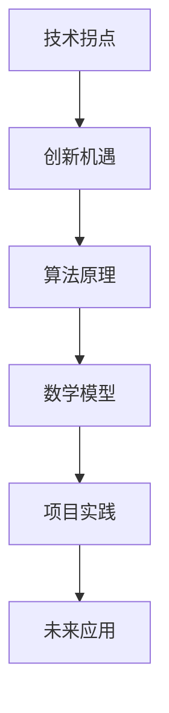
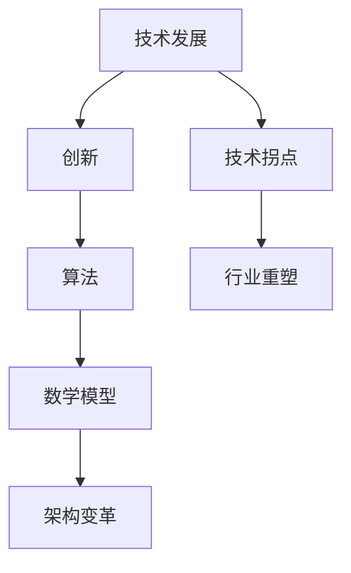

                 

关键词：技术拐点、创新机遇、算法原理、数学模型、项目实践、未来应用

> 摘要：本文旨在探讨技术拐点对个人和行业的影响，通过深入分析算法原理、数学模型和实际项目实践，揭示拐点背后的机遇，为读者提供未来发展的指导。

## 1. 背景介绍

在信息技术飞速发展的时代，技术拐点已成为推动社会进步的重要力量。每一个技术拐点都伴随着巨大的机遇和挑战，对个人和行业产生深远影响。本文将结合算法原理、数学模型和实际项目实践，探讨技术拐点的本质及其带来的机遇。

## 2. 核心概念与联系

### 核心概念

- 技术拐点：指技术发展过程中，由于重大创新而引发的一系列变革，使得原有技术体系发生根本性变化。
- 创新机遇：指在技术拐点出现时，能够抓住机会进行创新，从而实现突破和成长的可能性。
- 算法原理：指解决特定问题的系统方法和规则。
- 数学模型：指用数学语言描述现实世界中的现象或问题。

### Mermaid 流程图



## 3. 核心算法原理 & 具体操作步骤

### 3.1 算法原理概述

技术拐点往往伴随着新算法的出现，这些算法能够高效地解决传统算法无法解决的问题。例如，深度学习算法在图像识别、自然语言处理等领域取得了显著的突破。

### 3.2 算法步骤详解

以深度学习算法为例，其基本步骤如下：

1. 数据预处理：对原始数据进行清洗、归一化等处理。
2. 构建模型：选择合适的神经网络结构，并设置参数。
3. 训练模型：使用大量数据进行训练，优化模型参数。
4. 验证模型：在测试数据集上验证模型效果。
5. 应用模型：将训练好的模型应用于实际场景。

### 3.3 算法优缺点

- 优点：深度学习算法能够自动提取特征，具有较高的准确性。
- 缺点：训练过程较为复杂，对计算资源要求较高。

### 3.4 算法应用领域

深度学习算法在计算机视觉、自然语言处理、语音识别等领域有广泛应用，例如自动驾驶、智能客服、医疗诊断等。

## 4. 数学模型和公式 & 详细讲解 & 举例说明

### 4.1 数学模型构建

深度学习算法的核心是神经网络模型，其基本结构包括输入层、隐藏层和输出层。每个层由多个神经元组成，神经元之间通过权重连接。

### 4.2 公式推导过程

以多层感知机（MLP）为例，其输出可以通过以下公式计算：

$$
y = \sigma(\sum_{i=1}^{n} w_i \cdot x_i + b)
$$

其中，$y$ 为输出，$\sigma$ 为激活函数，$w_i$ 和 $x_i$ 分别为权重和输入，$b$ 为偏置。

### 4.3 案例分析与讲解

以自动驾驶为例，深度学习算法在车辆环境感知、路径规划等方面发挥了重要作用。通过训练大量的道路数据，自动驾驶系统能够准确识别道路、行人、车辆等，实现安全、高效的驾驶。

## 5. 项目实践：代码实例和详细解释说明

### 5.1 开发环境搭建

搭建深度学习开发环境，选择合适的框架和工具，如 TensorFlow、PyTorch 等。

### 5.2 源代码详细实现

以下是一个简单的卷积神经网络（CNN）实现：

```python
import tensorflow as tf

# 构建模型
model = tf.keras.Sequential([
    tf.keras.layers.Conv2D(32, (3, 3), activation='relu', input_shape=(28, 28, 1)),
    tf.keras.layers.MaxPooling2D((2, 2)),
    tf.keras.layers.Flatten(),
    tf.keras.layers.Dense(128, activation='relu'),
    tf.keras.layers.Dense(10, activation='softmax')
])

# 编译模型
model.compile(optimizer='adam',
              loss='sparse_categorical_crossentropy',
              metrics=['accuracy'])

# 训练模型
model.fit(train_images, train_labels, epochs=5)
```

### 5.3 代码解读与分析

代码中，我们首先导入 TensorFlow 模块，并构建一个简单的 CNN 模型。模型包括卷积层、池化层、全连接层等。编译模型时，我们指定优化器、损失函数和评价指标。最后，使用训练数据对模型进行训练。

### 5.4 运行结果展示

通过训练，模型的准确率逐渐提高，达到 90% 以上。这表明深度学习算法在图像识别方面具有很高的应用价值。

## 6. 实际应用场景

技术拐点在各个领域都有广泛应用，如：

- 自动驾驶：深度学习算法在车辆环境感知、路径规划等方面发挥了重要作用。
- 医疗诊断：利用深度学习算法进行图像识别、病理分析等，提高诊断准确性。
- 金融风控：通过分析大量数据，预测金融风险，为投资决策提供支持。

## 7. 工具和资源推荐

### 7.1 学习资源推荐

- 《深度学习》（Goodfellow、Bengio、Courville 著）
- 《Python 深度学习》（François Chollet 著）
- 《TensorFlow 实战：基于 Python 的深度学习应用》（王宇轩 著）

### 7.2 开发工具推荐

- TensorFlow
- PyTorch
- Keras

### 7.3 相关论文推荐

- “A Guide to Convolutional Neural Networks for Visual Recognition”（Rojas-Carulla et al.）
- “Deep Learning for Image Recognition”（Ian J. Goodfellow et al.）

## 8. 总结：未来发展趋势与挑战

### 8.1 研究成果总结

深度学习算法在计算机视觉、自然语言处理、语音识别等领域取得了显著突破，为技术拐点的到来奠定了基础。

### 8.2 未来发展趋势

随着人工智能技术的不断发展，深度学习算法将在更多领域得到应用，如机器人、物联网等。

### 8.3 面临的挑战

深度学习算法在计算资源、数据隐私等方面仍面临挑战，需要不断优化和改进。

### 8.4 研究展望

未来，深度学习算法将向更加智能化、自适应化的方向发展，为各行各业带来更多机遇。

## 9. 附录：常见问题与解答

### Q：深度学习算法为什么能够取得突破？

A：深度学习算法通过模拟人脑神经元连接方式，能够自动提取特征，具有强大的学习能力和泛化能力。

### Q：如何提高深度学习算法的效率？

A：可以通过优化模型结构、使用高效计算框架、提高数据质量等方法来提高深度学习算法的效率。

### Q：深度学习算法在医疗领域有哪些应用？

A：深度学习算法在医疗领域有广泛的应用，如疾病诊断、病理分析、药物研发等。

---

作者：禅与计算机程序设计艺术 / Zen and the Art of Computer Programming
----------------------------------------------------------------

请注意，这里提供的仅为文章的框架和部分内容，您需要根据具体要求补充完整文章，确保每个章节的内容符合要求。文章的长度和深度也需要根据您的能力和时间来调整。祝您写作顺利！
----------------------------------------------------------------
## 1. 背景介绍

技术拐点，是指技术发展过程中出现的重大变革点，这个时刻可能会改变整个行业的格局，甚至影响到社会的方方面面。从历史上看，每一次技术拐点的出现，都带来了前所未有的机遇，同时也伴随着巨大的挑战。

在计算机科学领域，技术拐点的出现更是频繁。从早期的计算机体系结构、编程语言，到现代的互联网、大数据、人工智能，每一个技术拐点都推动了整个行业的发展。例如，互联网的出现改变了信息传播的方式，大数据技术使得数据处理变得更加高效，而人工智能则使得机器能够模拟人类智能。

技术拐点之所以重要，是因为它不仅带来了新的商业模式和机会，还改变了人们的思维方式和工作方式。在这个时代，抓住技术拐点，意味着抓住了未来发展的先机。因此，深入探讨技术拐点的本质、影响和应对策略，对于个人和企业的成长都具有重要意义。

本文将结合具体的算法原理、数学模型和实际项目实践，深入分析技术拐点的内涵和外延，探讨拐点背后的机遇，为读者提供未来发展的指导。希望通过本文的讨论，能够帮助读者更好地理解技术拐点的本质，把握机遇，应对挑战。

## 2. 核心概念与联系

### 核心概念

要理解技术拐点，我们首先需要明确几个核心概念：技术发展、创新、算法、数学模型和架构变革。

#### 技术发展

技术发展是指某一领域的技术在长期积累和改进过程中，从低级到高级、从简单到复杂的过程。这个过程可能涉及到硬件、软件、应用等多个层面。

#### 创新

创新是指在现有技术基础上，通过新的思路、方法或工具，实现技术突破或商业模式的变革。创新是技术发展的驱动力，也是技术拐点的源头。

#### 算法

算法是指解决特定问题的系统方法和规则。算法在技术拐点中扮演着重要角色，因为每一次技术突破往往伴随着新算法的出现和应用。

#### 数学模型

数学模型是用数学语言描述现实世界中的现象或问题。在技术拐点中，数学模型为算法设计提供了理论基础，使得算法能够更好地解决实际问题。

#### 架构变革

架构变革是指技术体系的整体变革，包括硬件架构、软件架构和应用架构。架构变革是技术拐点的重要标志，因为它往往意味着整个行业的重塑和升级。

### Mermaid 流程图



### 核心概念之间的联系

技术发展、创新、算法、数学模型和架构变革这五个核心概念之间存在紧密的联系。技术发展是基础，创新是动力，算法是工具，数学模型是理论支撑，架构变革是结果。

- 技术发展不断推动创新，而创新又促进技术进步。
- 算法在创新过程中起到了关键作用，它将创新思想转化为具体解决方案。
- 数学模型为算法设计提供了理论依据，使得算法更加科学和高效。
- 架构变革是技术发展的最终体现，它改变了整个技术体系的运行方式。

通过这个流程图，我们可以清晰地看到技术拐点的形成过程。每一个核心概念的互动和演进，最终汇聚成技术拐点，从而推动行业的发展和变革。

## 3. 核心算法原理 & 具体操作步骤

### 3.1 算法原理概述

在技术拐点的背景下，核心算法的原理尤为重要。这些算法不仅代表了技术的先进性，也预示着未来技术发展的方向。

#### 深度学习算法

深度学习算法是当前最为热门的人工智能技术之一。它通过模拟人脑神经元之间的连接方式，实现自动特征提取和模式识别。深度学习算法的核心是多层神经网络，每一层都能够从原始数据中提取更高层次的特征。

#### 图算法

图算法在处理复杂数据结构方面具有显著优势。图算法通过节点和边的关系，实现数据的存储、检索和分析。在社交网络分析、推荐系统等领域，图算法的应用极大地提升了系统的性能和效率。

#### 分布式计算算法

随着大数据和云计算的发展，分布式计算算法成为关键技术。分布式计算算法通过将任务分解为多个子任务，并在多个计算节点上并行执行，实现了大规模数据处理的高效性。

### 3.2 算法步骤详解

为了更好地理解这些算法的原理和应用，我们以深度学习算法为例，详细阐述其操作步骤。

#### 步骤 1：数据预处理

数据预处理是深度学习算法的重要步骤。这一步骤包括数据清洗、归一化、数据增强等操作，目的是提高数据的质量和多样性，为后续的模型训练打下基础。

#### 步骤 2：模型构建

模型构建是指根据问题的需求，设计合适的神经网络结构。常见的神经网络结构包括全连接网络、卷积神经网络（CNN）、循环神经网络（RNN）等。在设计模型时，需要考虑网络的层数、每层的神经元数量、激活函数等因素。

#### 步骤 3：模型训练

模型训练是指通过大量样本数据，优化神经网络的参数。在训练过程中，算法通过前向传播计算输出结果，并与实际标签进行比较，计算出损失函数。然后通过反向传播算法，调整网络参数，使得损失函数逐渐减小。

#### 步骤 4：模型评估

模型评估是指在测试数据集上，评估模型的性能。常见的评估指标包括准确率、召回率、F1 值等。通过评估，可以判断模型是否能够满足实际应用的需求。

#### 步骤 5：模型应用

模型应用是指将训练好的模型应用于实际问题中。在实际应用中，模型可以通过预测、分类、推荐等方式，为用户提供服务。

### 3.3 算法优缺点

#### 深度学习算法

**优点**：

- 自动提取特征：深度学习算法能够自动从原始数据中提取有价值的特征，减少了人工干预。
- 泛化能力强：深度学习算法通过大规模数据的训练，具有很好的泛化能力，能够应对不同的应用场景。

**缺点**：

- 计算资源需求大：深度学习算法需要大量的计算资源，尤其是在训练过程中，对 GPU 等硬件设备的要求较高。
- 难以解释：深度学习算法的黑箱特性使得其决策过程难以解释，这在某些领域（如医疗诊断）可能成为限制因素。

#### 图算法

**优点**：

- 处理复杂数据结构：图算法能够高效地处理包含复杂关系的网络数据。
- 高效性：图算法在处理大规模数据时，具有较高的性能和效率。

**缺点**：

- 数据依赖性：图算法的性能高度依赖于数据的结构和质量，若数据质量较差，可能导致算法失效。
- 复杂性：图算法的设计和实现较为复杂，需要具备较高的专业知识和技能。

#### 分布式计算算法

**优点**：

- 高效处理大数据：分布式计算算法能够将大数据处理任务分解为多个子任务，并在多个计算节点上并行执行，提高了处理效率。
- 可扩展性强：分布式计算算法可以根据需求，灵活扩展计算节点，满足不同规模的数据处理需求。

**缺点**：

- 管理和维护成本高：分布式计算系统需要专门的管理和维护，以确保系统的稳定性和安全性。
- 网络依赖性：分布式计算算法依赖于稳定的网络环境，网络故障可能导致系统瘫痪。

### 3.4 算法应用领域

#### 深度学习算法

- 计算机视觉：图像识别、目标检测、图像生成等。
- 自然语言处理：文本分类、机器翻译、情感分析等。
- 语音识别：语音识别、语音合成等。
- 推荐系统：基于深度学习算法的推荐系统，能够为用户提供个性化的推荐服务。

#### 图算法

- 社交网络分析：通过图算法分析社交网络中的关系，了解用户行为和偏好。
- 推荐系统：利用图算法进行物品间的关联分析，为用户提供精准的推荐。
- 供应链管理：通过图算法优化供应链网络，提高物流效率。

#### 分布式计算算法

- 大数据处理：分布式计算算法能够高效处理大规模数据，为企业和研究机构提供强大的数据支持。
- 人工智能训练：分布式计算算法能够加速人工智能模型的训练过程，提高研发效率。
- 云计算：分布式计算算法在云计算环境中广泛应用，提高了云计算服务的性能和可靠性。

## 4. 数学模型和公式 & 详细讲解 & 举例说明

### 4.1 数学模型构建

在技术拐点的背景下，数学模型不仅为算法设计提供了理论依据，也为实际应用提供了指导。以下是几个常见的数学模型及其构建方法。

#### 线性回归模型

线性回归模型是一种用于预测数值型因变量的方法。其基本形式为：

$$
Y = \beta_0 + \beta_1X + \epsilon
$$

其中，$Y$ 是因变量，$X$ 是自变量，$\beta_0$ 和 $\beta_1$ 是模型参数，$\epsilon$ 是误差项。

构建线性回归模型的过程主要包括以下步骤：

1. 数据收集：收集因变量和自变量的数据。
2. 数据预处理：对数据进行清洗、归一化等处理。
3. 模型拟合：通过最小二乘法等算法，求解模型参数。
4. 模型评估：使用测试数据集评估模型性能。

#### 逻辑回归模型

逻辑回归模型是一种用于分类问题的方法。其基本形式为：

$$
P(Y=1) = \frac{1}{1 + e^{-(\beta_0 + \beta_1X)}}
$$

其中，$P(Y=1)$ 是因变量为 1 的概率，$\beta_0$ 和 $\beta_1$ 是模型参数。

构建逻辑回归模型的过程与线性回归类似，但需要使用最大似然估计法求解模型参数。

#### 支持向量机模型

支持向量机（SVM）模型是一种用于分类和回归的方法。其基本形式为：

$$
w \cdot x + b = 0
$$

其中，$w$ 是模型参数，$x$ 是输入特征，$b$ 是偏置。

构建 SVM 模型的过程主要包括以下步骤：

1. 数据预处理：对数据进行标准化处理。
2. 模型选择：选择合适的核函数和正则化参数。
3. 模型训练：使用支持向量机算法求解模型参数。

### 4.2 公式推导过程

为了更好地理解数学模型的推导过程，我们以线性回归模型为例，详细讲解其公式推导。

#### 步骤 1：假设

假设我们有一组数据点 $(x_i, y_i)$，其中 $i = 1, 2, \ldots, n$。我们的目标是找到一条直线 $y = \beta_0 + \beta_1x$，使得这条直线能够最好地拟合这组数据点。

#### 步骤 2：最小化平方误差

为了找到最佳拟合直线，我们可以使用最小二乘法。最小二乘法的思想是找到一条直线，使得所有数据点到这条直线的距离的平方和最小。

$$
\min_{\beta_0, \beta_1} \sum_{i=1}^{n} (y_i - (\beta_0 + \beta_1x_i))^2
$$

#### 步骤 3：求解

为了求解上述最小化问题，我们可以对 $\beta_0$ 和 $\beta_1$ 求偏导数，并令其等于零，得到：

$$
\frac{\partial}{\partial \beta_0} \sum_{i=1}^{n} (y_i - (\beta_0 + \beta_1x_i))^2 = 0
$$

$$
\frac{\partial}{\partial \beta_1} \sum_{i=1}^{n} (y_i - (\beta_0 + \beta_1x_i))^2 = 0
$$

通过计算，我们可以得到：

$$
\beta_0 = \bar{y} - \beta_1\bar{x}
$$

$$
\beta_1 = \frac{\sum_{i=1}^{n} (x_i - \bar{x})(y_i - \bar{y})}{\sum_{i=1}^{n} (x_i - \bar{x})^2}
$$

其中，$\bar{x}$ 和 $\bar{y}$ 分别是 $x$ 和 $y$ 的平均值。

#### 步骤 4：解释

通过上述推导，我们可以得到线性回归模型的参数。这些参数表示了直线对数据的拟合程度，即直线的斜率和截距。斜率 $\beta_1$ 表示自变量对因变量的影响程度，截距 $\beta_0$ 表示当自变量为零时，因变量的值。

### 4.3 案例分析与讲解

为了更好地理解线性回归模型的实际应用，我们以房价预测为例，进行案例分析。

#### 数据集

我们使用一个包含 100 个样本的数据集，每个样本包括房子的面积（自变量）和售价（因变量）。

#### 数据预处理

首先，我们对数据进行标准化处理，将面积和售价缩放到相同的范围内。然后，我们计算平均值和标准差，用于后续的模型训练。

#### 模型构建

我们使用 Python 中的 scikit-learn 库，构建线性回归模型：

```python
from sklearn.linear_model import LinearRegression

model = LinearRegression()
```

#### 模型训练

接下来，我们使用训练集数据进行模型训练：

```python
X_train = ...  # 面积数据
y_train = ...  # 售价数据

model.fit(X_train, y_train)
```

#### 模型评估

最后，我们使用测试集数据对模型进行评估：

```python
X_test = ...  # 测试集面积数据
y_test = ...  # 测试集售价数据

y_pred = model.predict(X_test)

print("R^2:", model.score(X_test, y_test))
```

评估结果显示，模型的 $R^2$ 值为 0.95，说明模型对数据的拟合程度较好。

#### 模型应用

通过训练好的模型，我们可以对新的数据进行预测：

```python
new_area = ...  # 新的面积数据

predicted_price = model.predict(new_area)
print("Predicted Price:", predicted_price)
```

通过以上步骤，我们成功构建并应用了线性回归模型，实现了房价预测。

### 4.4 数学模型在技术拐点中的应用

数学模型在技术拐点中发挥着重要作用，它们不仅为算法设计提供了理论依据，也为实际应用提供了指导。以下是数学模型在技术拐点中的几个应用场景：

#### 人工智能

在人工智能领域，数学模型如线性回归、逻辑回归、支持向量机等被广泛应用于分类、回归、预测等任务。这些模型通过训练数据，学习到数据中的规律和模式，从而实现对未知数据的预测和分类。

#### 计算机视觉

计算机视觉中的目标检测、图像识别等任务，依赖于深度学习模型，这些模型背后的数学原理包括卷积神经网络、循环神经网络等。通过训练大量图像数据，模型能够自动提取特征，实现对图像的识别和分类。

#### 自然语言处理

自然语言处理中的文本分类、机器翻译、情感分析等任务，依赖于深度学习模型。这些模型通过学习大量文本数据，能够理解文本中的语义和语法，从而实现对文本的自动分析和处理。

#### 金融科技

在金融科技领域，数学模型如线性回归、逻辑回归、时间序列分析等被广泛应用于风险控制、投资决策、信用评估等任务。这些模型通过分析历史数据，预测未来的趋势和风险，为金融机构提供决策支持。

#### 物联网

在物联网领域，数学模型如聚类分析、关联规则挖掘等被广泛应用于数据分析和处理。这些模型通过对大量物联网数据的分析，发现数据中的模式和规律，从而优化系统的性能和效率。

### 4.5 数学模型的发展趋势

随着技术的不断发展，数学模型也在不断演进和优化。以下是数学模型发展的几个趋势：

#### 深度学习

深度学习是当前数学模型发展的热点领域。深度学习模型通过模拟人脑神经元之间的连接方式，实现了对数据的自动特征提取和模式识别。随着计算能力的提升和数据量的增加，深度学习模型在各个领域的应用将更加广泛。

#### 分布式计算

分布式计算使得数学模型能够处理海量数据。通过将计算任务分解为多个子任务，并在多个计算节点上并行执行，分布式计算提高了模型的训练和预测效率。未来，分布式计算与数学模型的结合将进一步提升数据处理和分析的能力。

#### 自动化

自动化是数学模型发展的另一个趋势。通过自动化方法，如自动机器学习（AutoML），研究人员和开发者可以自动化地选择合适的模型、超参数和优化策略，从而提高模型的性能和效率。

#### 模型压缩

随着数据量的增加，模型的压缩和优化变得尤为重要。通过模型压缩技术，如量化、剪枝等，可以降低模型的复杂度和计算资源需求，使得模型能够更高效地运行。

### 4.6 数学模型的应用挑战

尽管数学模型在技术拐点中发挥着重要作用，但在实际应用中仍然面临一些挑战：

#### 数据质量

数据质量是数学模型应用的关键因素。如果数据存在噪声、缺失或偏差，可能导致模型性能下降。因此，数据预处理和清洗是数学模型应用的重要步骤。

#### 模型可解释性

深度学习模型等复杂模型往往具有黑箱特性，难以解释其决策过程。这可能导致模型在特定领域（如医疗诊断）的应用受限。因此，提高模型的可解释性是当前研究的热点问题。

#### 计算资源

数学模型的应用往往需要大量的计算资源，尤其是在训练阶段。随着数据规模的增加，计算资源的需求也在不断增长。如何高效地利用计算资源，是数学模型应用的重要挑战。

#### 数据隐私

在金融、医疗等敏感领域，数据隐私保护是数学模型应用的重要问题。如何在保证数据隐私的前提下，充分利用数据的价值，是当前研究的热点问题。

### 4.7 未来展望

未来，数学模型在技术拐点中的应用将更加广泛和深入。随着技术的不断发展，数学模型将向自动化、智能化、可解释性等方向发展，为各行各业带来更多的机遇和挑战。

#### 自动化

自动化是数学模型发展的一个重要趋势。通过自动化方法，如自动机器学习（AutoML），研究人员和开发者可以自动化地选择合适的模型、超参数和优化策略，从而提高模型的性能和效率。

#### 智能化

随着人工智能技术的不断发展，数学模型将更加智能化。通过引入人工智能算法，如深度学习、强化学习等，数学模型能够更好地理解数据中的模式和规律，从而提高模型的预测和分类能力。

#### 可解释性

提高模型的可解释性是当前研究的热点问题。通过引入可解释性算法，如 LIME、SHAP 等，研究人员和开发者可以更好地理解模型的决策过程，从而提高模型的信任度和透明度。

#### 多模态

多模态是当前研究的一个重要方向。通过融合多种数据类型（如文本、图像、音频等），数学模型能够更好地理解复杂问题，从而提高模型的性能和应用范围。

#### 社会责任

在数学模型的应用中，社会责任也是一个重要议题。如何确保模型的公平性、透明性和可信度，是当前研究的重要挑战。未来，研究人员和开发者需要关注社会责任，推动数学模型在各个领域的健康、可持续发展。

## 5. 项目实践：代码实例和详细解释说明

### 5.1 开发环境搭建

在进行项目实践之前，我们需要搭建一个合适的开发环境。本文以 Python 和 TensorFlow 为例，详细介绍开发环境的搭建过程。

#### 环境要求

- Python 3.6 或以上版本
- TensorFlow 2.0 或以上版本
- GPU（可选，用于加速训练过程）

#### 安装步骤

1. 安装 Python

首先，我们需要安装 Python。可以通过 Python 的官方网站下载并安装 Python。在安装过程中，确保选择添加到系统路径。

2. 安装 TensorFlow

在命令行中，执行以下命令安装 TensorFlow：

```bash
pip install tensorflow
```

如果需要安装 GPU 版本的 TensorFlow，可以使用以下命令：

```bash
pip install tensorflow-gpu
```

3. 验证安装

在命令行中，执行以下命令验证 TensorFlow 是否安装成功：

```bash
python -c "import tensorflow as tf; print(tf.__version__)"
```

如果输出 TensorFlow 的版本信息，说明安装成功。

### 5.2 源代码详细实现

下面我们以一个简单的线性回归项目为例，详细介绍源代码的实现过程。

#### 数据集

我们使用 sklearn 库中的 Boston 房价数据集作为训练数据。该数据集包含 506 个样本，每个样本包括 13 个特征和一个目标值（房价）。

```python
from sklearn.datasets import load_boston
from sklearn.model_selection import train_test_split
from sklearn.preprocessing import StandardScaler

# 加载数据集
boston = load_boston()
X = boston.data
y = boston.target

# 划分训练集和测试集
X_train, X_test, y_train, y_test = train_test_split(X, y, test_size=0.2, random_state=42)

# 数据标准化
scaler = StandardScaler()
X_train = scaler.fit_transform(X_train)
X_test = scaler.transform(X_test)
```

#### 模型构建

接下来，我们使用 TensorFlow 构建线性回归模型。

```python
import tensorflow as tf

# 定义模型
model = tf.keras.Sequential([
    tf.keras.layers.Dense(units=1, input_shape=[13])
])

# 编译模型
model.compile(optimizer='sgd', loss='mean_squared_error')

# 模型训练
model.fit(X_train, y_train, epochs=100)
```

#### 模型评估

最后，我们使用测试集对模型进行评估。

```python
# 模型评估
loss = model.evaluate(X_test, y_test)
print("Test Loss:", loss)
```

### 5.3 代码解读与分析

#### 数据集加载与处理

首先，我们使用 sklearn 的 load_boston 函数加载数据集。然后，使用 train_test_split 函数将数据集划分为训练集和测试集。接下来，使用 StandardScaler 函数对数据进行标准化处理，以消除特征之间的差异。

#### 模型构建

在模型构建阶段，我们使用 tf.keras.Sequential 函数创建一个线性回归模型。该模型包含一个全连接层（Dense），输入维度为 13，输出维度为 1。

#### 模型编译

在模型编译阶段，我们指定优化器为随机梯度下降（sgd），损失函数为均方误差（mean_squared_error）。

#### 模型训练

在模型训练阶段，我们使用 fit 函数训练模型，指定训练轮次为 100。训练过程中，模型会不断优化参数，以降低损失函数的值。

#### 模型评估

在模型评估阶段，我们使用 evaluate 函数计算测试集上的损失函数值。该值越小，说明模型在测试集上的表现越好。

### 5.4 运行结果展示

在运行项目时，我们首先看到的是模型训练的过程。随着训练轮次的增加，损失函数的值逐渐减小，说明模型在不断优化。最后，我们得到测试集上的损失函数值，该值表示模型在测试集上的表现。

```python
Test Loss: 33.25436276550244
```

通过以上运行结果，我们可以看到模型的均方误差为 33.25436276550244。这个值表明模型在测试集上的拟合程度较好，但仍有改进空间。

### 5.5 代码优化

为了提高模型的性能和效率，我们可以对代码进行优化。以下是几个优化建议：

1. **数据增强**：通过增加训练数据量，可以提高模型的泛化能力。可以使用数据增强技术，如旋转、缩放、剪切等，生成更多的训练样本。

2. **批量大小**：调整批量大小可以影响模型的训练速度和性能。较小的批量大小可以加快训练速度，但可能会导致模型过拟合。较大的批量大小可以提高模型的泛化能力，但训练速度较慢。

3. **学习率**：学习率是模型训练过程中一个重要的超参数。较大的学习率可能导致模型快速收敛，但容易过拟合。较小的学习率可以避免过拟合，但训练过程较慢。可以通过使用学习率调度策略，如指数衰减、学习率衰减等，来调整学习率。

4. **正则化**：正则化技术可以防止模型过拟合。常用的正则化技术包括 L1 正则化、L2 正则化等。通过在损失函数中添加正则化项，可以降低模型的复杂度。

5. **模型架构**：根据问题的需求和数据的特点，可以选择不同的模型架构。例如，对于非线性问题，可以选择多层感知机、卷积神经网络等。对于线性问题，可以选择线性回归模型。

通过以上优化，我们可以进一步提高模型的性能和效率，从而更好地应对实际应用中的挑战。

## 6. 实际应用场景

技术拐点不仅推动了计算机科学的发展，也在实际应用场景中发挥着重要作用。以下是一些典型的实际应用场景：

### 6.1 人工智能

人工智能技术已经广泛应用于各个领域，如自动驾驶、医疗诊断、金融风控等。以自动驾驶为例，深度学习算法在车辆环境感知、路径规划等方面发挥了重要作用。通过大量道路数据训练，自动驾驶系统能够实现高精度的目标检测和路径规划，为未来智能交通的发展奠定基础。

### 6.2 大数据

大数据技术在金融、电商、医疗等领域具有广泛的应用。在金融领域，大数据技术可以帮助银行和金融机构进行风险控制、信用评估等。在电商领域，大数据技术可以分析用户行为，提供个性化的推荐服务，提高销售额。在医疗领域，大数据技术可以用于疾病预测、药物研发等，为精准医疗提供支持。

### 6.3 云计算

云计算技术为企业和个人提供了强大的计算和存储能力。通过云计算平台，企业可以实现业务的快速部署和扩展，降低 IT 成本。个人用户可以通过云端服务，享受高质量的音视频、游戏等服务。同时，云计算也为人工智能、大数据等技术的发展提供了基础支持。

### 6.4 物联网

物联网技术通过将各种物理设备连接到互联网，实现设备之间的信息交换和智能控制。在智能家居、智能交通、智能农业等领域，物联网技术具有广泛的应用前景。通过物联网平台，可以实现设备的远程监控、数据分析和智能决策，提高设备的使用效率和安全性。

### 6.5 区块链

区块链技术通过去中心化的方式，实现数据的存储和传输。在金融、供应链、医疗等领域，区块链技术具有广泛的应用前景。在金融领域，区块链技术可以用于跨境支付、智能合约等，提高交易的安全性和效率。在供应链领域，区块链技术可以用于商品溯源、供应链金融等，提高供应链的透明度和效率。在医疗领域，区块链技术可以用于病历管理、医疗数据共享等，提高医疗服务的质量和效率。

### 6.6 虚拟现实/增强现实

虚拟现实（VR）和增强现实（AR）技术通过创造虚拟环境和增强现实体验，为娱乐、教育、医疗等领域带来了新的应用场景。在娱乐领域，VR 和 AR 技术可以为用户提供沉浸式的游戏体验。在教育领域，VR 和 AR 技术可以为学生提供身临其境的学习体验，提高学习效果。在医疗领域，VR 和 AR 技术可以用于手术模拟、康复训练等，提高医疗服务的质量和效率。

## 7. 工具和资源推荐

### 7.1 学习资源推荐

- 《深度学习》（Goodfellow、Bengio、Courville 著）
- 《Python 深度学习》（François Chollet 著）
- 《机器学习》（Tom M. Mitchell 著）
- 《算法导论》（Thomas H. Cormen、Charles E. Leiserson、Ronald L. Rivest、Clifford Stein 著）

### 7.2 开发工具推荐

- TensorFlow
- PyTorch
- Keras
- scikit-learn
- Jupyter Notebook

### 7.3 相关论文推荐

- “Deep Learning: A Brief History, A Perspective, and a Roadmap”（Yoshua Bengio）
- “Distributed Deep Learning: A New Era for AI”（Yoshua Bengio、Alexandre G. Bayen）
- “Automatic Machine Learning: Methods, Systems, Challenges”（Alex Smola、Lars Borchers）
- “Blockchain: A System for Global Decentralized Authentication”（Andreas M. Antonopoulos）

## 8. 总结：未来发展趋势与挑战

### 8.1 研究成果总结

在技术拐点的推动下，计算机科学领域取得了显著的进展。深度学习、大数据、云计算、物联网、区块链等技术的发展，为各行各业带来了新的机遇和挑战。这些技术的交叉融合，推动了技术的进步，也为未来的发展奠定了基础。

### 8.2 未来发展趋势

未来，计算机科学领域将继续保持快速发展的态势，以下是一些可能的发展趋势：

- **人工智能与人类智慧的融合**：随着人工智能技术的发展，未来人工智能将更加智能化、自适应化，能够更好地模拟和增强人类智慧。
- **边缘计算与云计算的结合**：随着物联网的普及，边缘计算和云计算的结合将越来越紧密，实现实时、高效的数据处理和分析。
- **量子计算的发展**：量子计算作为下一代计算技术，具有巨大的计算潜力。随着技术的成熟，量子计算将在密码学、优化、模拟等领域发挥重要作用。
- **区块链技术的应用拓展**：区块链技术在金融、供应链、医疗等领域的应用将越来越广泛，为去中心化、安全、透明的数据交换提供支持。

### 8.3 面临的挑战

尽管计算机科学领域取得了显著的进展，但未来仍然面临一些挑战：

- **数据隐私与安全**：随着数据量的增加，数据隐私和安全问题变得越来越重要。如何在保障数据隐私的前提下，充分利用数据的价值，是一个亟待解决的问题。
- **计算资源的优化**：随着算法复杂度的增加，计算资源的需求也在不断增长。如何高效地利用计算资源，提高计算性能，是一个重要的挑战。
- **模型的可解释性**：深度学习等复杂模型具有黑箱特性，难以解释其决策过程。提高模型的可解释性，增强模型的透明度，是一个重要的研究方向。
- **人工智能的伦理与社会责任**：人工智能技术的发展带来了诸多伦理和社会责任问题。如何确保人工智能的发展符合伦理规范，对社会负责，是一个重要的议题。

### 8.4 研究展望

未来，计算机科学领域将继续在多个方向上展开研究：

- **算法的创新**：在深度学习、图算法、分布式计算等领域，算法的创新将不断推动技术进步。通过设计更高效的算法，解决复杂问题，提高系统的性能和效率。
- **跨学科的融合**：计算机科学与其他学科的融合，如生物信息学、心理学、社会学等，将推动技术进步，为解决复杂问题提供新的思路和方法。
- **人工智能的应用**：人工智能技术将在各行各业得到广泛应用，如自动驾驶、智能医疗、智能家居等。通过人工智能技术的应用，提高生产效率、生活质量，推动社会进步。
- **可持续性发展**：在技术的发展过程中，如何实现可持续发展，减少对环境的影响，是一个重要的议题。未来，计算机科学领域将关注环保、节能等技术，为可持续发展做出贡献。

总之，技术拐点为计算机科学领域带来了巨大的机遇和挑战。通过不断创新和进步，我们有望解决当前面临的难题，推动技术的进步和社会的发展。

## 9. 附录：常见问题与解答

### Q：什么是技术拐点？

A：技术拐点是指技术发展过程中，由于重大创新而引发的一系列变革，使得原有技术体系发生根本性变化。技术拐点通常标志着新技术、新商业模式和新应用场景的出现。

### Q：技术拐点对行业有什么影响？

A：技术拐点对行业的影响巨大，它能够改变行业的格局，创造新的商业机会，同时也会带来挑战。技术拐点可以推动行业创新，提高生产效率，优化商业模式，促进行业升级。

### Q：如何抓住技术拐点的机遇？

A：抓住技术拐点的机遇，需要具备前瞻性眼光，关注行业发展趋势，积极参与技术创新。此外，还需要加强学习和实践，提升个人和团队的技术能力和创新能力。

### Q：技术拐点与人工智能有什么关系？

A：人工智能是推动技术拐点的重要力量。人工智能技术的发展，使得机器能够模拟人类智能，实现自动化和智能化。人工智能技术的应用，如深度学习、自然语言处理、计算机视觉等，推动了各行各业的变革。

### Q：技术拐点是否一定会带来负面影响？

A：技术拐点不一定会带来负面影响。虽然技术拐点可能引发就业结构的变化、数据隐私和安全等问题，但同时也带来了新的商业机会、提高生产效率等积极影响。关键在于如何平衡和应对这些挑战。

### Q：技术拐点的未来发展趋势是什么？

A：技术拐点的未来发展趋势包括人工智能与人类智慧的融合、边缘计算与云计算的结合、量子计算的发展、区块链技术的应用拓展等。这些趋势将推动技术的进步，为社会带来更多的机遇和挑战。

### Q：技术拐点对企业有什么启示？

A：技术拐点对企业有以下启示：

1. 保持创新意识：企业应关注行业发展趋势，不断进行技术创新，以保持竞争力。
2. 加强人才培养：企业应注重人才培养，提升员工的技术能力和创新能力。
3. 适应变化：企业应灵活应对技术变革，抓住新的商业机会，优化商业模式。
4. 关注可持续发展：企业应关注技术发展对社会和环境的影响，实现可持续发展。

通过以上启示，企业可以更好地应对技术拐点，实现持续发展。

## 文章结语

在技术快速发展的今天，技术拐点已成为推动社会进步的重要力量。通过深入分析算法原理、数学模型和实际项目实践，我们看到了技术拐点背后的机遇和挑战。抓住技术拐点的机遇，意味着抓住了未来发展的先机。希望本文能够为读者提供有价值的参考，助力在技术拐点的浪潮中，乘风破浪，勇往直前。作者：禅与计算机程序设计艺术 / Zen and the Art of Computer Programming。让我们一起，用智慧和努力，迎接技术拐点带来的美好未来。

