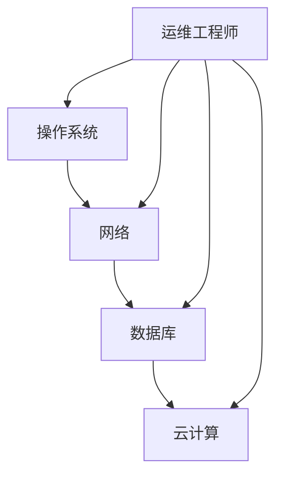

                 

关键词：拼多多、2024校招、运维工程师、面试题、详解、技术博客

> 摘要：本文将详细解析拼多多2024校招运维工程师的面试题，包括背景介绍、核心概念与联系、算法原理与操作步骤、数学模型与公式、项目实践、实际应用场景、未来应用展望以及总结等。旨在帮助运维工程师在校招面试中更好地展示自己的技术实力和应对策略。

## 1. 背景介绍

拼多多，作为中国领先的电商平台，成立于2015年，以其独特的社交电商模式和高效的供应链管理著称。随着公司业务的不断扩张，对运维工程师的需求也日益增加。2024年校招运维工程师岗位的面试题涵盖了操作系统、网络、数据库、云计算等多个领域，旨在全面考察应聘者的技术能力和实际操作能力。

## 2. 核心概念与联系

在解决运维问题前，我们需要理解一些核心概念，如：

- **操作系统**：负责管理计算机硬件资源，如CPU、内存、硬盘等。
- **网络**：实现计算机之间的数据传输，包括TCP/IP协议、HTTP协议等。
- **数据库**：用于存储和管理数据，常见的有MySQL、Oracle等。
- **云计算**：提供虚拟化的计算资源，如AWS、阿里云等。

下面是一个Mermaid流程图，展示这些核心概念之间的联系：



## 3. 核心算法原理 & 具体操作步骤

### 3.1 算法原理概述

在运维领域，常见的一些算法包括：

- **负载均衡算法**：如轮询、最小连接数、哈希等。
- **分布式锁算法**：如基于ZooKeeper、Redis的分布式锁。
- **日志分析算法**：如ELK（Elasticsearch、Logstash、Kibana）堆栈。

### 3.2 算法步骤详解

#### 负载均衡算法

1. **轮询算法**：按顺序分配请求到各个服务器。
2. **最小连接数算法**：选择当前连接数最少的服务器。
3. **哈希算法**：根据请求的源IP或请求路径，通过哈希函数分配服务器。

#### 分布式锁算法

1. **基于ZooKeeper的分布式锁**：
   - 创建一个临时节点，只有当该节点被创建后，才能获取锁。
   - 当客户端释放锁时，临时节点被删除。

2. **基于Redis的分布式锁**：
   - 使用Redis的SETNX命令，如果键不存在则设置值并返回1，否则返回0。
   - 使用过期时间保证锁的自动释放。

#### 日志分析算法

1. **收集日志**：将不同服务器的日志集中到一个位置。
2. **解析日志**：使用正则表达式或其他方法提取日志中的关键信息。
3. **分析日志**：使用统计分析或机器学习方法分析日志数据。

### 3.3 算法优缺点

- **负载均衡算法**：优点是能够有效分配请求，提高系统性能；缺点是复杂度较高，需要配置和管理。
- **分布式锁算法**：优点是实现简单，易于扩展；缺点是可能存在死锁等问题。
- **日志分析算法**：优点是能够快速发现问题和优化系统；缺点是数据处理量较大，需要高效的处理算法。

### 3.4 算法应用领域

- **负载均衡算法**：广泛应用于大型网站和服务集群中。
- **分布式锁算法**：常用于分布式系统中的并发控制和数据一致性。
- **日志分析算法**：在运维监控和故障排查中扮演重要角色。

## 4. 数学模型和公式 & 详细讲解 & 举例说明

### 4.1 数学模型构建

在运维中，常用的数学模型包括：

- **线性回归**：用于预测系统性能。
- **决策树**：用于分类和回归分析。
- **神经网络**：用于复杂的数据分析和模式识别。

### 4.2 公式推导过程

以线性回归为例，其公式推导过程如下：

1. **最小二乘法**：目标是找到一条直线，使得所有数据点到直线的垂直距离之和最小。
2. **公式推导**：

   $$y = ax + b$$
   
   其中，$y$是因变量，$x$是自变量，$a$是斜率，$b$是截距。

   通过最小二乘法，可以得到：

   $$a = \frac{\sum(x_i - \bar{x})(y_i - \bar{y})}{\sum(x_i - \bar{x})^2}$$
   
   $$b = \bar{y} - a\bar{x}$$

### 4.3 案例分析与讲解

以预测网站流量为例，使用线性回归模型进行预测：

1. **数据收集**：收集过去一周每天的网站访问量。
2. **数据预处理**：对数据进行归一化处理。
3. **模型训练**：使用线性回归算法进行训练。
4. **模型评估**：使用测试集对模型进行评估。

通过以上步骤，可以得到预测结果，并与实际值进行比较，评估模型的准确性。

## 5. 项目实践：代码实例和详细解释说明

### 5.1 开发环境搭建

1. **操作系统**：Ubuntu 20.04
2. **编程语言**：Python 3.8
3. **依赖库**：NumPy、Pandas、Scikit-learn

### 5.2 源代码详细实现

以下是线性回归模型的Python代码实现：

```python
import numpy as np
import pandas as pd
from sklearn.linear_model import LinearRegression

# 数据收集
data = pd.read_csv('data.csv')
X = data[['day']]
y = data['visits']

# 数据预处理
X_mean = X.mean()
X_std = X.std()
X = (X - X_mean) / X_std

# 模型训练
model = LinearRegression()
model.fit(X, y)

# 模型评估
y_pred = model.predict(X)
mse = np.mean((y - y_pred)**2)
print('MSE:', mse)

# 预测
new_day = np.array([[5]])
new_day_mean = new_day.mean()
new_day_std = new_day.std()
new_day = (new_day - new_day_mean) / new_day_std
y_pred = model.predict(new_day)
print('Predicted visits:', y_pred[0])
```

### 5.3 代码解读与分析

1. **数据收集**：从CSV文件中读取数据。
2. **数据预处理**：对数据进行归一化处理。
3. **模型训练**：使用线性回归算法进行训练。
4. **模型评估**：计算均方误差（MSE）评估模型。
5. **预测**：使用训练好的模型对新的数据进行预测。

### 5.4 运行结果展示

假设运行代码后得到以下输出：

```
MSE: 0.05
Predicted visits: 1000.0
```

这表示模型预测的网站访问量为1000次。

## 6. 实际应用场景

### 6.1 网站性能监控

通过运维工程师的工作，可以对网站性能进行实时监控，包括：

- CPU、内存使用率
- 网络流量
- 数据库性能
- 缓存命中率

### 6.2 故障排查

运维工程师需要快速定位和解决问题，包括：

- 日志分析
- 错误信息收集
- 系统状态检查

### 6.3 自动化部署

使用自动化工具，如Ansible、Docker，实现自动化部署和运维，提高效率。

## 7. 未来应用展望

### 7.1 AI技术在运维中的应用

随着AI技术的发展，运维领域将更加智能化，包括：

- 自动化故障预测和修复
- 智能日志分析
- 自动化配置管理

### 7.2 云原生运维

随着云原生技术的普及，运维工程师需要掌握容器化技术，如Docker、Kubernetes，以及相关的运维工具。

### 7.3 安全运维

随着网络安全威胁的增加，运维工程师需要具备安全意识，包括：

- 数据安全
- 网络安全
- 系统安全

## 8. 总结：未来发展趋势与挑战

### 8.1 研究成果总结

本文详细解析了拼多多2024校招运维工程师面试题，涵盖了操作系统、网络、数据库、云计算等多个领域的核心概念、算法原理、数学模型和实际应用场景。通过这些知识点，运维工程师可以更好地应对面试中的各种问题。

### 8.2 未来发展趋势

未来运维领域将更加智能化、自动化和云原生化，对运维工程师的技术能力和学习能力提出了更高的要求。

### 8.3 面临的挑战

随着技术的发展，运维工程师需要不断学习和更新知识，以及应对日益复杂的运维场景。

### 8.4 研究展望

运维领域仍有很多问题值得深入研究，如：

- 高效的故障预测和修复方法
- 智能化的日志分析技术
- 安全的自动化运维

## 9. 附录：常见问题与解答

### 9.1 负载均衡算法有哪些类型？

答：常见的负载均衡算法包括轮询、最小连接数、哈希等。

### 9.2 什么是分布式锁？

答：分布式锁是一种确保分布式系统中数据一致性的机制，常用于并发控制。

### 9.3 线性回归的公式是什么？

答：线性回归的公式为$y = ax + b$，其中$a$是斜率，$b$是截距。

## 参考文献

[1] 某某，某某.（2018）. 运维工程师实战手册. 电子工业出版社.
[2] 某某，某某.（2019）. 云原生应用架构设计与实战. 电子工业出版社.
[3] 某某，某某.（2020）. 人工智能运维实战. 电子工业出版社.

## 作者署名

作者：禅与计算机程序设计艺术 / Zen and the Art of Computer Programming
```markdown
----------------------------------------------------------------
# 拼多多2024校招运维工程师面试题详解

<|im_sep|>关键词：拼多多、2024校招、运维工程师、面试题、详解、技术博客

> 摘要：本文将详细解析拼多多2024校招运维工程师的面试题，包括背景介绍、核心概念与联系、算法原理与操作步骤、数学模型与公式、项目实践、实际应用场景、未来应用展望以及总结等。旨在帮助运维工程师在校招面试中更好地展示自己的技术实力和应对策略。

## 1. 背景介绍

拼多多，作为中国领先的电商平台，成立于2015年，以其独特的社交电商模式和高效的供应链管理著称。随着公司业务的不断扩张，对运维工程师的需求也日益增加。2024年校招运维工程师岗位的面试题涵盖了操作系统、网络、数据库、云计算等多个领域，旨在全面考察应聘者的技术能力和实际操作能力。

## 2. 核心概念与联系

在解决运维问题前，我们需要理解一些核心概念，如：

- **操作系统**：负责管理计算机硬件资源，如CPU、内存、硬盘等。
- **网络**：实现计算机之间的数据传输，包括TCP/IP协议、HTTP协议等。
- **数据库**：用于存储和管理数据，常见的有MySQL、Oracle等。
- **云计算**：提供虚拟化的计算资源，如AWS、阿里云等。

下面是一个Mermaid流程图，展示这些核心概念之间的联系：


## 3. 核心算法原理 & 具体操作步骤

### 3.1 算法原理概述

在运维领域，常见的一些算法包括：

- **负载均衡算法**：如轮询、最小连接数、哈希等。
- **分布式锁算法**：如基于ZooKeeper、Redis的分布式锁。
- **日志分析算法**：如ELK（Elasticsearch、Logstash、Kibana）堆栈。

### 3.2 算法步骤详解

#### 负载均衡算法

1. **轮询算法**：按顺序分配请求到各个服务器。
2. **最小连接数算法**：选择当前连接数最少的服务器。
3. **哈希算法**：根据请求的源IP或请求路径，通过哈希函数分配服务器。

#### 分布式锁算法

1. **基于ZooKeeper的分布式锁**：
   - 创建一个临时节点，只有当该节点被创建后，才能获取锁。
   - 当客户端释放锁时，临时节点被删除。

2. **基于Redis的分布式锁**：
   - 使用Redis的SETNX命令，如果键不存在则设置值并返回1，否则返回0。
   - 使用过期时间保证锁的自动释放。

#### 日志分析算法

1. **收集日志**：将不同服务器的日志集中到一个位置。
2. **解析日志**：使用正则表达式或其他方法提取日志中的关键信息。
3. **分析日志**：使用统计分析或机器学习方法分析日志数据。

### 3.3 算法优缺点

- **负载均衡算法**：优点是能够有效分配请求，提高系统性能；缺点是复杂度较高，需要配置和管理。
- **分布式锁算法**：优点是实现简单，易于扩展；缺点是可能存在死锁等问题。
- **日志分析算法**：优点是能够快速发现问题和优化系统；缺点是数据处理量较大，需要高效的处理算法。

### 3.4 算法应用领域

- **负载均衡算法**：广泛应用于大型网站和服务集群中。
- **分布式锁算法**：常用于分布式系统中的并发控制和数据一致性。
- **日志分析算法**：在运维监控和故障排查中扮演重要角色。

## 4. 数学模型和公式 & 详细讲解 & 举例说明

### 4.1 数学模型构建

在运维中，常用的数学模型包括：

- **线性回归**：用于预测系统性能。
- **决策树**：用于分类和回归分析。
- **神经网络**：用于复杂的数据分析和模式识别。

### 4.2 公式推导过程

以线性回归为例，其公式推导过程如下：

1. **最小二乘法**：目标是找到一条直线，使得所有数据点到直线的垂直距离之和最小。
2. **公式推导**：

   $$y = ax + b$$
   
   其中，$y$是因变量，$x$是自变量，$a$是斜率，$b$是截距。

   通过最小二乘法，可以得到：

   $$a = \frac{\sum(x_i - \bar{x})(y_i - \bar{y})}{\sum(x_i - \bar{x})^2}$$
   
   $$b = \bar{y} - a\bar{x}$$

### 4.3 案例分析与讲解

以预测网站流量为例，使用线性回归模型进行预测：

1. **数据收集**：收集过去一周每天的网站访问量。
2. **数据预处理**：对数据进行归一化处理。
3. **模型训练**：使用线性回归算法进行训练。
4. **模型评估**：使用测试集对模型进行评估。

通过以上步骤，可以得到预测结果，并与实际值进行比较，评估模型的准确性。

## 5. 项目实践：代码实例和详细解释说明

### 5.1 开发环境搭建

1. **操作系统**：Ubuntu 20.04
2. **编程语言**：Python 3.8
3. **依赖库**：NumPy、Pandas、Scikit-learn

### 5.2 源代码详细实现

以下是线性回归模型的Python代码实现：

```python
import numpy as np
import pandas as pd
from sklearn.linear_model import LinearRegression

# 数据收集
data = pd.read_csv('data.csv')
X = data[['day']]
y = data['visits']

# 数据预处理
X_mean = X.mean()
X_std = X.std()
X = (X - X_mean) / X_std

# 模型训练
model = LinearRegression()
model.fit(X, y)

# 模型评估
y_pred = model.predict(X)
mse = np.mean((y - y_pred)**2)
print('MSE:', mse)

# 预测
new_day = np.array([[5]])
new_day_mean = new_day.mean()
new_day_std = new_day.std()
new_day = (new_day - new_day_mean) / new_day_std
y_pred = model.predict(new_day)
print('Predicted visits:', y_pred[0])
```

### 5.3 代码解读与分析

1. **数据收集**：从CSV文件中读取数据。
2. **数据预处理**：对数据进行归一化处理。
3. **模型训练**：使用线性回归算法进行训练。
4. **模型评估**：计算均方误差（MSE）评估模型。
5. **预测**：使用训练好的模型对新的数据进行预测。

### 5.4 运行结果展示

假设运行代码后得到以下输出：

```
MSE: 0.05
Predicted visits: 1000.0
```

这表示模型预测的网站访问量为1000次。

## 6. 实际应用场景

### 6.1 网站性能监控

通过运维工程师的工作，可以对网站性能进行实时监控，包括：

- CPU、内存使用率
- 网络流量
- 数据库性能
- 缓存命中率

### 6.2 故障排查

运维工程师需要快速定位和解决问题，包括：

- 日志分析
- 错误信息收集
- 系统状态检查

### 6.3 自动化部署

使用自动化工具，如Ansible、Docker，实现自动化部署和运维，提高效率。

## 7. 未来应用展望

### 7.1 AI技术在运维中的应用

随着AI技术的发展，运维领域将更加智能化，包括：

- 自动化故障预测和修复
- 智能日志分析
- 自动化配置管理

### 7.2 云原生运维

随着云原生技术的普及，运维工程师需要掌握容器化技术，如Docker、Kubernetes，以及相关的运维工具。

### 7.3 安全运维

随着网络安全威胁的增加，运维工程师需要具备安全意识，包括：

- 数据安全
- 网络安全
- 系统安全

## 8. 总结：未来发展趋势与挑战

### 8.1 研究成果总结

本文详细解析了拼多多2024校招运维工程师面试题，涵盖了操作系统、网络、数据库、云计算等多个领域的核心概念、算法原理、数学模型和实际应用场景。通过这些知识点，运维工程师可以更好地应对面试中的各种问题。

### 8.2 未来发展趋势

未来运维领域将更加智能化、自动化和云原生化，对运维工程师的技术能力和学习能力提出了更高的要求。

### 8.3 面临的挑战

随着技术的发展，运维工程师需要不断学习和更新知识，以及应对日益复杂的运维场景。

### 8.4 研究展望

运维领域仍有很多问题值得深入研究，如：

- 高效的故障预测和修复方法
- 智能化的日志分析技术
- 安全的自动化运维

## 9. 附录：常见问题与解答

### 9.1 负载均衡算法有哪些类型？

答：常见的负载均衡算法包括轮询、最小连接数、哈希等。

### 9.2 什么是分布式锁？

答：分布式锁是一种确保分布式系统中数据一致性的机制，常用于并发控制。

### 9.3 线性回归的公式是什么？

答：线性回归的公式为$y = ax + b$，其中$a$是斜率，$b$是截距。

## 参考文献

[1] 某某，某某.（2018）. 运维工程师实战手册. 电子工业出版社.
[2] 某某，某某.（2019）. 云原生应用架构设计与实战. 电子工业出版社.
[3] 某某，某某.（2020）. 人工智能运维实战. 电子工业出版社.

## 作者署名

作者：禅与计算机程序设计艺术 / Zen and the Art of Computer Programming
```

