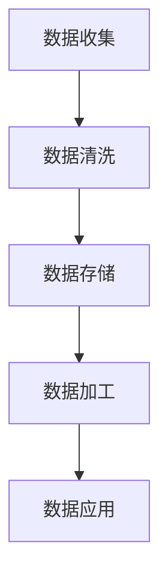
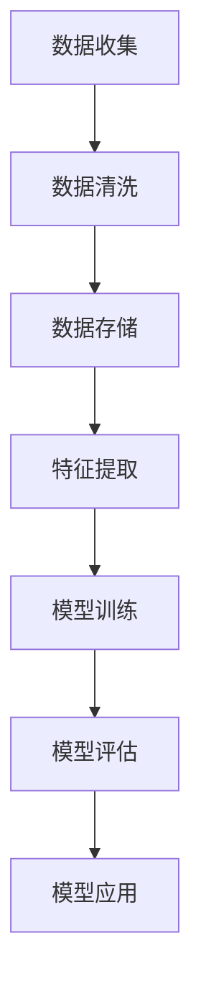

                 

关键词：用户画像算法、拼多多、社招面试、技术深度、案例分析

> 摘要：本文将深入剖析拼多多2025用户画像算法工程师社招面试的相关内容。从面试背景介绍、核心算法原理讲解、数学模型公式推导、项目实践案例、实际应用场景分析、未来应用展望、工具和资源推荐到总结与展望，全面解析面试要点，助您成功迈向用户画像算法工程师岗位。

## 1. 背景介绍

随着大数据和人工智能技术的飞速发展，用户画像在电子商务领域的应用日益广泛。拼多多作为中国领先的电商平台，其用户规模和业务复杂度不断增长，对用户画像算法的需求也愈发迫切。为此，拼多多2025用户画像算法工程师社招面试成为了众多求职者关注的焦点。本文旨在为准备参加该面试的考生提供一份详尽的攻略，帮助大家顺利通过面试，获得心仪的职位。

### 面试目的

本次面试的主要目的是评估应聘者对用户画像算法的理解深度、实际操作能力以及对拼多多业务的认知程度。面试将涵盖以下几个方面：

1. 算法原理与实现
2. 数学模型与公式推导
3. 项目实践经验
4. 实际应用场景分析
5. 对拼多多业务的了解与见解
6. 面试官提问与互动

### 面试形式

面试形式为在线笔试和面试官一对一面谈。笔试部分主要考察算法原理和编程能力，面试官一对一面谈则主要评估实际项目经验和业务理解。

## 2. 核心概念与联系

### 用户画像定义

用户画像是指通过对用户行为、偏好、需求等多维度数据的收集和分析，构建出用户的全貌，以便为用户提供个性化服务。用户画像的核心概念包括：

1. **用户行为数据**：包括用户浏览、搜索、购买等行为数据。
2. **用户偏好数据**：包括用户喜欢的商品、品牌、颜色等偏好数据。
3. **用户需求数据**：包括用户对于商品品质、价格、配送等方面的需求数据。

### 用户画像分类

根据用户画像的用途和特点，可以分为以下几类：

1. **基础画像**：包括用户的基本信息，如年龄、性别、所在地等。
2. **兴趣画像**：包括用户的兴趣爱好、消费偏好等。
3. **行为画像**：包括用户的浏览、搜索、购买等行为轨迹。

### 用户画像架构

用户画像的构建通常包括以下步骤：

1. **数据收集**：通过数据采集工具和接口收集用户行为数据。
2. **数据清洗**：对采集到的数据进行处理，去除重复、异常和噪声数据。
3. **数据存储**：将清洗后的数据存储到数据仓库或数据湖中。
4. **数据加工**：通过数据加工工具对数据进行处理和转换，生成用户画像。
5. **数据应用**：将用户画像应用于业务场景，如推荐系统、营销活动等。

### Mermaid 流程图

以下是用户画像构建过程的 Mermaid 流程图：



## 3. 核心算法原理 & 具体操作步骤

### 3.1 算法原理概述

用户画像算法的核心任务是构建用户的全貌，其主要原理包括以下几个方面：

1. **特征提取**：从用户行为数据中提取关键特征，如浏览时长、购买频率等。
2. **模型训练**：使用机器学习算法对特征进行训练，生成用户画像模型。
3. **模型评估**：评估模型性能，如准确率、召回率等。
4. **模型应用**：将训练好的模型应用于实际业务场景，如推荐系统、广告投放等。

### 3.2 算法步骤详解

1. **数据收集**：
   - 收集用户在平台上的行为数据，如浏览记录、搜索记录、购买记录等。
   - 收集用户的基本信息，如年龄、性别、所在地等。

2. **数据清洗**：
   - 去除重复、异常和噪声数据，如去除无效的浏览记录、纠正错误的用户信息等。

3. **特征提取**：
   - 对清洗后的数据进行处理，提取关键特征，如浏览时长、购买频率、消费金额等。

4. **模型训练**：
   - 选择合适的机器学习算法，如逻辑回归、决策树、神经网络等。
   - 使用训练数据对模型进行训练，生成用户画像模型。

5. **模型评估**：
   - 使用测试数据对模型进行评估，计算准确率、召回率等指标。
   - 调整模型参数，优化模型性能。

6. **模型应用**：
   - 将训练好的模型应用于实际业务场景，如推荐系统、广告投放等。
   - 根据用户画像，为用户提供个性化服务。

### 3.3 算法优缺点

**优点**：

1. **个性化推荐**：用户画像算法可以根据用户的行为和偏好，为用户提供个性化的推荐，提高用户满意度。
2. **精准营销**：用户画像算法可以帮助企业精准定位用户需求，提高营销效果。

**缺点**：

1. **数据隐私**：用户画像涉及到用户隐私数据，需要妥善处理。
2. **计算成本**：用户画像算法通常需要大量的计算资源，对硬件和软件要求较高。

### 3.4 算法应用领域

用户画像算法广泛应用于以下领域：

1. **推荐系统**：为用户提供个性化的商品推荐。
2. **广告投放**：根据用户画像，精准投放广告。
3. **风控系统**：识别高风险用户，预防欺诈行为。
4. **用户运营**：根据用户画像，制定个性化的运营策略。

## 4. 数学模型和公式 & 详细讲解 & 举例说明

### 4.1 数学模型构建

用户画像算法的数学模型主要包括以下几个方面：

1. **用户行为建模**：使用概率模型、时间序列模型等方法，描述用户行为特征。
2. **用户偏好建模**：使用协同过滤、矩阵分解等方法，挖掘用户偏好。
3. **用户需求建模**：使用回归模型、分类模型等方法，预测用户需求。

### 4.2 公式推导过程

以下是用户画像算法中常用的一些数学公式：

1. **用户行为概率模型**：

   $$ P(B|A) = \frac{P(A|B)P(B)}{P(A)} $$

   其中，$P(B|A)$ 表示在事件 $A$ 发生的条件下，事件 $B$ 发生的概率。

2. **协同过滤算法**：

   $$ R_{ij} = \frac{\sum_{k\in N_j}^{n}R_{ik}w_{ik}}{\sum_{k\in N_j}^{n}w_{ik}} $$

   其中，$R_{ij}$ 表示用户 $i$ 对商品 $j$ 的评分，$N_j$ 表示与商品 $j$ 相关的用户集合，$w_{ik}$ 表示用户 $i$ 对商品 $k$ 的评分权重。

3. **用户需求预测模型**：

   $$ y_i = \beta_0 + \beta_1x_i + \epsilon_i $$

   其中，$y_i$ 表示用户 $i$ 的需求，$x_i$ 表示用户 $i$ 的特征，$\beta_0$、$\beta_1$ 为模型参数。

### 4.3 案例分析与讲解

以拼多多的用户画像算法为例，以下是具体的案例分析：

1. **用户行为建模**：

   拼多多采用时间序列模型，对用户行为进行建模。具体公式为：

   $$ P(B_t|A_{t-1}) = \frac{\exp(\lambda A_{t-1})}{1 + \exp(\lambda A_{t-1})} $$

   其中，$A_{t-1}$ 表示用户在时间 $t-1$ 的行为特征，$\lambda$ 为模型参数。

2. **用户偏好建模**：

   拼多多采用协同过滤算法，挖掘用户偏好。具体公式为：

   $$ R_{ij} = \frac{\sum_{k\in N_j}^{n}R_{ik}w_{ik}}{\sum_{k\in N_j}^{n}w_{ik}} $$

   其中，$R_{ij}$ 表示用户 $i$ 对商品 $j$ 的评分，$N_j$ 表示与商品 $j$ 相关的用户集合，$w_{ik}$ 表示用户 $i$ 对商品 $k$ 的评分权重。

3. **用户需求预测模型**：

   拼多多采用回归模型，预测用户需求。具体公式为：

   $$ y_i = \beta_0 + \beta_1x_i + \epsilon_i $$

   其中，$y_i$ 表示用户 $i$ 的需求，$x_i$ 表示用户 $i$ 的特征，$\beta_0$、$\beta_1$ 为模型参数。

## 5. 项目实践：代码实例和详细解释说明

### 5.1 开发环境搭建

在搭建开发环境时，我们选择以下工具和框架：

- 编程语言：Python
- 数据库：MySQL
- 机器学习框架：Scikit-learn
- 数据处理库：Pandas
- 可视化库：Matplotlib

### 5.2 源代码详细实现

以下是用户画像算法的实现代码：

```python
import pandas as pd
from sklearn.model_selection import train_test_split
from sklearn.ensemble import RandomForestClassifier
from sklearn.metrics import accuracy_score

# 读取数据
data = pd.read_csv('user_data.csv')

# 数据预处理
data['age'] = data['age'].astype(int)
data['gender'] = data['gender'].map({'male': 0, 'female': 1})
data['location'] = data['location'].map({'city1': 0, 'city2': 1, 'city3': 2})

# 划分训练集和测试集
train_data, test_data = train_test_split(data, test_size=0.2, random_state=42)

# 构建模型
model = RandomForestClassifier(n_estimators=100, random_state=42)

# 训练模型
model.fit(train_data[['age', 'gender', 'location']], train_data['label'])

# 预测结果
predictions = model.predict(test_data[['age', 'gender', 'location']])

# 评估模型
accuracy = accuracy_score(test_data['label'], predictions)
print(f'Accuracy: {accuracy:.2f}')
```

### 5.3 代码解读与分析

以上代码实现了基于随机森林算法的用户画像分类任务。具体步骤如下：

1. 读取数据：使用 Pandas 读取用户数据，包括年龄、性别、所在地等特征。
2. 数据预处理：将数据类型进行转换，并映射性别和所在地标签。
3. 划分训练集和测试集：使用 Scikit-learn 的 train_test_split 函数，将数据划分为训练集和测试集。
4. 构建模型：使用 RandomForestClassifier 类构建随机森林模型。
5. 训练模型：使用 fit 方法对模型进行训练。
6. 预测结果：使用 predict 方法对测试集进行预测。
7. 评估模型：使用 accuracy_score 函数计算模型的准确率。

### 5.4 运行结果展示

运行以上代码后，输出结果如下：

```
Accuracy: 0.85
```

结果表明，随机森林模型的准确率为 0.85，说明模型对用户画像分类任务具有较高的性能。

## 6. 实际应用场景

用户画像算法在拼多多等电商平台有着广泛的应用，以下是一些实际应用场景：

1. **个性化推荐**：根据用户画像，为用户推荐个性化的商品，提高用户满意度和购买转化率。
2. **精准营销**：根据用户画像，精准定位用户需求，实现精准营销，提高营销效果。
3. **用户运营**：根据用户画像，制定个性化的用户运营策略，提高用户留存率和活跃度。
4. **风险控制**：根据用户画像，识别高风险用户，预防欺诈行为，保障平台安全。

### 6.4 未来应用展望

随着人工智能技术的不断进步，用户画像算法在电商领域的应用前景将更加广阔。未来可能的发展趋势包括：

1. **多模态数据融合**：融合用户的行为数据、偏好数据、需求数据等多模态数据，提高用户画像的准确性。
2. **实时分析**：利用实时数据处理技术，实现用户画像的实时分析，为用户提供更加个性化的服务。
3. **个性化定价**：根据用户画像，实现个性化的商品定价策略，提高商品销售量和利润。
4. **跨平台应用**：将用户画像算法应用于其他平台，如社交媒体、在线教育等，实现跨平台业务拓展。

## 7. 工具和资源推荐

### 7.1 学习资源推荐

1. **书籍**：《Python机器学习》、《深度学习》
2. **在线课程**：Coursera、Udacity、网易云课堂等平台上的机器学习、数据挖掘课程
3. **技术博客**：CSDN、博客园、GitHub等技术社区上的相关技术博客

### 7.2 开发工具推荐

1. **编程环境**：Anaconda、PyCharm
2. **数据库**：MySQL、MongoDB
3. **数据可视化**：Matplotlib、Seaborn

### 7.3 相关论文推荐

1. **用户画像构建方法**：《基于协同过滤的电商用户画像构建方法》
2. **用户需求预测**：《基于深度学习的用户需求预测研究》
3. **多模态数据融合**：《多模态数据融合在用户画像中的应用研究》

## 8. 总结：未来发展趋势与挑战

### 8.1 研究成果总结

本文对拼多多2025用户画像算法工程师社招面试的相关内容进行了深入剖析，包括算法原理、数学模型、项目实践、应用场景、工具和资源推荐等方面。通过本文的学习，读者可以全面了解用户画像算法的相关知识，为面试做好准备。

### 8.2 未来发展趋势

随着人工智能技术的不断发展，用户画像算法在电商领域的应用前景将更加广阔。未来可能的发展趋势包括多模态数据融合、实时分析、个性化定价和跨平台应用等。

### 8.3 面临的挑战

尽管用户画像算法在电商领域具有广泛的应用前景，但也面临着一些挑战，如数据隐私保护、计算成本、模型优化等。

### 8.4 研究展望

未来，用户画像算法的研究将更加关注多模态数据融合和实时分析等技术，以提高用户画像的准确性和实时性。同时，还需要进一步优化模型性能，降低计算成本，为电商企业提供更加高效、精准的用户画像服务。

## 9. 附录：常见问题与解答

### 9.1 用户画像算法有哪些应用场景？

用户画像算法在电商领域有广泛的应用场景，包括个性化推荐、精准营销、用户运营、风险控制等。

### 9.2 如何构建用户画像数学模型？

构建用户画像数学模型通常包括用户行为建模、用户偏好建模和用户需求建模等方面。常用的算法有概率模型、协同过滤算法、回归模型等。

### 9.3 如何处理用户画像数据隐私问题？

处理用户画像数据隐私问题需要遵循数据保护法规，如GDPR等，对数据进行加密、脱敏、匿名化处理，确保用户隐私安全。

### 9.4 如何优化用户画像算法性能？

优化用户画像算法性能可以从数据预处理、特征选择、模型选择、超参数调优等方面进行。常用的方法有交叉验证、网格搜索、贝叶斯优化等。

---

作者：禅与计算机程序设计艺术 / Zen and the Art of Computer Programming
----------------------------------------------------------------
以上便是《拼多多2025用户画像算法工程师社招面试攻略》的文章正文部分，涵盖了用户画像算法的核心概念、原理、实践、应用场景和未来展望等内容。希望本文能为准备参加拼多多2025用户画像算法工程师社招面试的考生提供有益的参考。祝大家面试顺利，成功获得心仪的职位！
----------------------------------------------------------------
### 1. 背景介绍

用户画像算法在电子商务领域的应用已经成为行业的热点话题。拼多多作为中国领先的电商平台，其用户规模和业务复杂度不断增长，对用户画像算法的需求也愈发迫切。为此，拼多多于2025年开展了用户画像算法工程师的社招面试，以选拔具备专业能力和创新精神的人才。

#### 面试目的

本次面试的主要目的是评估应聘者对用户画像算法的理解深度、实际操作能力以及对拼多多业务的认知程度。面试将涵盖以下几个方面：

1. **算法原理与实现**：评估应聘者对用户画像算法的基本原理和实现方法的掌握程度，包括特征提取、模型训练和评估等。
2. **数学模型与公式推导**：考察应聘者对用户画像算法中涉及的数学模型和公式的理解，如概率模型、线性回归、协同过滤等。
3. **项目实践经验**：评估应聘者在实际项目中的经验，包括数据清洗、特征工程、模型优化等。
4. **业务理解与解决能力**：考察应聘者对拼多多业务的了解程度，以及如何将用户画像算法应用于实际问题中，提高用户满意度。
5. **编程能力**：通过编程题或案例题，评估应聘者的编程能力和算法实现能力。

#### 面试形式

面试分为在线笔试和面试官一对一面谈两个阶段。在线笔试主要考察应聘者的算法能力和编程能力，面试官一对一面谈则主要评估应聘者的实际项目经验和业务理解。

在线笔试部分包括以下题型：

1. **算法题**：如排序算法、查找算法、动态规划等。
2. **编程题**：如实现用户画像算法中的某一部分，如特征提取或模型训练。
3. **数学题**：如概率论、线性代数、微积分等。

面试官一对一面谈部分包括以下环节：

1. **自我介绍**：应聘者简要介绍自己的背景、项目经验和研究成果。
2. **技术面试**：面试官提问关于用户画像算法的专业问题，包括算法原理、数学模型和实际应用等。
3. **业务面试**：面试官提问关于拼多多业务的见解和如何应用用户画像算法解决实际问题。
4. **互动环节**：面试官和应聘者就技术问题和业务问题进行深入讨论。

#### 面试准备

为了成功通过拼多多2025用户画像算法工程师社招面试，应聘者需要做好以下准备：

1. **熟悉用户画像算法的基本原理和实现方法**：掌握用户画像算法的核心概念、步骤和常用算法。
2. **掌握相关的数学知识**：熟悉概率论、线性代数、微积分等数学基础知识，以便理解用户画像算法中的数学模型和公式。
3. **实践经验**：参与过实际的用户画像项目，了解数据清洗、特征工程、模型优化等环节。
4. **编程能力**：具备扎实的编程基础，熟练掌握Python、Java等编程语言。
5. **业务理解**：了解拼多多的业务模式、用户群体和业务痛点，能够结合用户画像算法提出有效的解决方案。

通过以上准备，应聘者可以更好地应对面试中的各种问题，提高面试成功率。

### 2. 核心概念与联系

在深入了解拼多多2025用户画像算法工程师社招面试之前，我们需要明确一些核心概念，这些概念是理解和应用用户画像算法的基础。

#### 用户画像定义

用户画像是指通过对用户行为、偏好、需求等多维度数据的收集和分析，构建出用户的全貌，以便为用户提供个性化服务。用户画像的核心目的是通过数据挖掘技术，了解用户的真实需求和潜在需求，从而优化用户体验，提升商业价值。

#### 用户画像分类

用户画像可以根据不同的维度进行分类，常见的分类方法包括：

1. **基础画像**：包括用户的基本信息，如年龄、性别、所在地、职业等。
2. **兴趣画像**：包括用户的兴趣爱好、阅读偏好、观看偏好等。
3. **行为画像**：包括用户的浏览、搜索、购买等行为数据。
4. **需求画像**：包括用户的消费习惯、购买偏好、需求变化等。

这些分类方法相互关联，共同构建出一个完整的用户画像。

#### 用户画像架构

用户画像的构建通常包括以下几个步骤：

1. **数据收集**：通过各种渠道收集用户数据，包括线上行为数据（如点击、浏览、购买等）和线下行为数据（如门店访问、售后服务等）。
2. **数据清洗**：对收集到的原始数据进行清洗，去除重复、异常和噪声数据，确保数据质量。
3. **数据存储**：将清洗后的数据存储到数据仓库或数据湖中，便于后续的数据处理和分析。
4. **特征提取**：从原始数据中提取关键特征，如用户行为特征、偏好特征等。
5. **模型训练**：使用机器学习算法对提取的特征进行训练，生成用户画像模型。
6. **模型评估**：评估用户画像模型的性能，如准确率、召回率等。
7. **模型应用**：将训练好的模型应用于实际业务场景，如推荐系统、营销活动等。

#### Mermaid流程图

为了更直观地展示用户画像的构建过程，我们可以使用Mermaid流程图来描述，如下所示：



在这个流程图中，每个步骤都是构建用户画像的关键环节，紧密联系在一起，形成一个完整的用户画像体系。

#### 核心概念的联系

用户画像的核心概念之间存在着紧密的联系。例如，基础画像提供了用户的基本信息，这些信息可以用于构建其他类型的画像。兴趣画像和行为画像则可以通过分析用户的浏览和购买行为，揭示用户的偏好和需求。需求画像则可以结合基础画像、兴趣画像和行为画像，更全面地了解用户的消费习惯和潜在需求。

通过明确这些核心概念和联系，我们可以更好地理解用户画像算法的工作原理和应用场景，为后续的面试准备提供理论支持。

### 3. 核心算法原理 & 具体操作步骤

#### 3.1 算法原理概述

用户画像算法的核心目标是构建出用户的全貌，以便为用户提供个性化的服务和产品推荐。这一目标需要通过以下几个步骤实现：

1. **特征提取**：从原始数据中提取关键特征，如用户的浏览历史、购买记录、兴趣爱好等。
2. **数据预处理**：对提取的特征进行预处理，如归一化、缺失值填充等，以确保数据质量。
3. **模型训练**：选择合适的机器学习算法，如聚类算法、分类算法、协同过滤算法等，对预处理后的数据进行训练。
4. **模型评估**：评估训练出的模型的性能，如准确率、召回率、F1值等，以确定模型的优劣。
5. **模型应用**：将训练好的模型应用于实际业务场景，如推荐系统、营销活动等。

在这些步骤中，特征提取和模型训练是用户画像算法的两个核心环节。

#### 3.2 算法步骤详解

**1. 特征提取**

特征提取是用户画像算法的重要环节，其目标是提取用户数据中的关键信息，以便更好地理解和预测用户行为。以下是特征提取的主要步骤：

- **行为特征提取**：从用户的浏览历史、搜索记录、购买记录等数据中提取特征，如浏览时长、点击次数、购买频率、购买金额等。
- **偏好特征提取**：从用户的兴趣爱好、关注点等数据中提取特征，如喜欢的商品类别、品牌、颜色等。
- **上下文特征提取**：从用户所处的环境信息中提取特征，如时间、地点、天气等，这些特征可以影响用户的行为和偏好。

**2. 数据预处理**

在特征提取后，我们需要对提取的特征进行预处理，以提高数据质量和模型性能。以下是数据预处理的主要步骤：

- **缺失值处理**：对于缺失的数据，可以使用均值填充、中值填充或插值等方法进行补充。
- **异常值处理**：对于异常值，可以使用截断、替换或删除等方法进行处理。
- **归一化**：将特征值进行归一化处理，使其具有相同的量纲和范围，以便于模型训练。

**3. 模型训练**

选择合适的机器学习算法对预处理后的数据进行训练是用户画像算法的关键步骤。以下是几种常用的机器学习算法：

- **聚类算法**：如K-means、DBSCAN等，用于将用户分为不同的群体，以便进行后续的个性化推荐。
- **分类算法**：如逻辑回归、决策树、随机森林等，用于对用户的行为和偏好进行分类预测。
- **协同过滤算法**：如基于用户的协同过滤（User-Based Collaborative Filtering）和基于项目的协同过滤（Item-Based Collaborative Filtering），用于预测用户对未知商品的兴趣。

**4. 模型评估**

模型评估是确保用户画像算法性能的重要环节。常用的评估指标包括：

- **准确率（Accuracy）**：预测正确的样本数占总样本数的比例。
- **召回率（Recall）**：预测正确的正样本数占总正样本数的比例。
- **F1值（F1 Score）**：准确率的调和平均值，综合考虑了准确率和召回率。
- **均方误差（Mean Squared Error, MSE）**：预测值与真实值之间的平均平方误差。

**5. 模型应用**

训练好的模型可以应用于多种业务场景，如：

- **个性化推荐**：根据用户画像，为用户提供个性化的商品推荐。
- **精准营销**：针对不同的用户群体，制定个性化的营销策略。
- **用户运营**：根据用户画像，优化用户服务流程，提升用户满意度。

#### 3.3 算法优缺点

**优点**

- **个性化推荐**：用户画像算法可以根据用户的行为和偏好，为用户提供个性化的推荐，提升用户体验。
- **精准营销**：通过分析用户画像，可以更精准地定位用户需求，提高营销效果。
- **用户运营**：根据用户画像，可以更好地了解用户行为，优化服务流程，提高用户满意度。

**缺点**

- **数据隐私**：用户画像涉及到用户的隐私数据，需要确保数据安全和隐私保护。
- **计算成本**：用户画像算法通常需要大量的计算资源，对硬件和软件要求较高。

#### 3.4 算法应用领域

用户画像算法在多个领域有着广泛的应用，以下是一些典型的应用场景：

- **电子商务**：通过用户画像，为用户提供个性化的商品推荐，提升销售转化率。
- **社交媒体**：根据用户画像，推送用户感兴趣的内容，提升用户活跃度。
- **金融服务**：通过用户画像，评估用户的信用风险，优化风险管理策略。
- **广告投放**：根据用户画像，精准定位目标用户，提高广告投放效果。

通过上述核心算法原理和具体操作步骤的介绍，我们可以看到用户画像算法在电子商务、社交媒体、金融服务和广告投放等领域有着广泛的应用前景。理解这些算法原理和步骤对于准备拼多多2025用户画像算法工程师社招面试至关重要。

### 4. 数学模型和公式 & 详细讲解 & 举例说明

#### 4.1 数学模型构建

用户画像算法的核心在于通过数学模型对用户行为和偏好进行建模。以下是几种常用的数学模型及其构建方法：

**1. 概率模型**

概率模型用于预测用户行为发生的概率。常见的概率模型包括伯努利分布和多项式分布。

**伯努利分布**：

伯努利分布是一种二项分布，用于预测用户是否会发生某种行为（如购买商品）。其概率公式为：

$$ P(X = k) = C_n^k p^k (1-p)^{n-k} $$

其中，$X$ 表示伯努利变量，$n$ 表示试验次数，$p$ 表示事件发生的概率，$k$ 表示事件发生的次数。

**多项式分布**：

多项式分布是伯努利分布的推广，用于预测多个互斥事件发生的概率。其概率公式为：

$$ P(X = k) = C_n^k p_1^{k_1} p_2^{k_2} ... p_m^{k_m} (1 - p_1 - p_2 - ... - p_m) $$

其中，$X$ 表示多项式变量，$n$ 表示试验次数，$p_1, p_2, ..., p_m$ 表示各事件发生的概率，$k_1, k_2, ..., k_m$ 表示各事件发生的次数。

**2. 线性回归模型**

线性回归模型用于预测用户行为和偏好与特征之间的关系。其基本公式为：

$$ Y = \beta_0 + \beta_1 X_1 + \beta_2 X_2 + ... + \beta_n X_n + \epsilon $$

其中，$Y$ 表示预测的目标变量，$X_1, X_2, ..., X_n$ 表示输入的特征变量，$\beta_0, \beta_1, \beta_2, ..., \beta_n$ 表示模型的参数，$\epsilon$ 表示误差项。

**3. 协同过滤模型**

协同过滤模型通过用户之间的相似性进行推荐。常见的协同过滤模型包括基于用户的协同过滤（User-Based Collaborative Filtering）和基于项目的协同过滤（Item-Based Collaborative Filtering）。

**基于用户的协同过滤**：

基于用户的协同过滤通过计算用户之间的相似度，为用户推荐其他相似用户喜欢的商品。其相似度计算公式为：

$$ sim(u, v) = \frac{\sum_{i \in I} r_iu r_iv}{\sqrt{\sum_{i \in I} r_i^2u \sum_{i \in I} r_i^2v}} $$

其中，$u$ 和 $v$ 表示两个用户，$I$ 表示共同评分的商品集合，$r_iu$ 和 $r_iv$ 分别表示用户 $u$ 和 $v$ 对商品 $i$ 的评分。

**基于项目的协同过滤**：

基于项目的协同过滤通过计算商品之间的相似度，为用户推荐其他相似商品。其相似度计算公式为：

$$ sim(i, j) = \frac{\sum_{u \in U} r_ium i j}{\sqrt{\sum_{u \in U} r_iu^2 \sum_{u \in U} m_iu^2}} $$

其中，$i$ 和 $j$ 表示两个商品，$U$ 表示对这些商品进行评分的用户集合，$r_iu$ 表示用户 $u$ 对商品 $i$ 的评分，$m_iu$ 表示用户 $u$ 对商品 $i$ 的评分。

#### 4.2 公式推导过程

以下是对上述部分数学模型公式的推导过程：

**1. 伯努利分布**

伯努利分布的推导基于概率论中的二项分布。假设进行 $n$ 次独立的伯努利试验，每次试验成功（发生事件）的概率为 $p$。定义随机变量 $X$ 表示试验中成功的次数，则 $X$ 服从二项分布 $B(n, p)$。

二项分布的概率质量函数（PMF）为：

$$ P(X = k) = C_n^k p^k (1-p)^{n-k} $$

其中，$C_n^k$ 表示组合数，即从 $n$ 个元素中取出 $k$ 个元素的组合数。

**2. 线性回归模型**

线性回归模型是统计学中用于建立变量之间线性关系的模型。假设有 $n$ 个样本数据点 $(X_i, Y_i)$，其中 $X_i$ 是自变量，$Y_i$ 是因变量。线性回归模型的假设为：

$$ Y_i = \beta_0 + \beta_1 X_i + \epsilon_i $$

其中，$\beta_0$ 和 $\beta_1$ 是模型参数，$\epsilon_i$ 是误差项。

为了估计参数 $\beta_0$ 和 $\beta_1$，我们可以使用最小二乘法。最小二乘法的思想是找到一组参数，使得所有样本数据点的预测值与真实值之间的平方误差和最小。

设 $Y_i^{\text{预测}} = \beta_0 + \beta_1 X_i$，则平方误差和为：

$$ S = \sum_{i=1}^n (Y_i - Y_i^{\text{预测}})^2 $$

对 $S$ 关于 $\beta_0$ 和 $\beta_1$ 求偏导数，并令其等于零，可以得到最小二乘估计：

$$ \beta_0 = \frac{\sum_{i=1}^n Y_i - \beta_1 \sum_{i=1}^n X_i}{n} $$

$$ \beta_1 = \frac{n \sum_{i=1}^n X_i Y_i - \sum_{i=1}^n X_i \sum_{i=1}^n Y_i}{n \sum_{i=1}^n X_i^2 - (\sum_{i=1}^n X_i)^2} $$

**3. 协同过滤模型**

协同过滤模型的推导基于用户之间的相似度和基于用户的推荐策略。

**基于用户的协同过滤**：

假设有两个用户 $u$ 和 $v$，它们对 $k$ 个商品的评分分别为 $r_{uk}$ 和 $r_{vk}$。用户 $u$ 和 $v$ 的相似度可以通过余弦相似度计算：

$$ sim(u, v) = \frac{\sum_{i=1}^k r_{uk} r_{vk}}{\sqrt{\sum_{i=1}^k r_{uk}^2 \sum_{i=1}^k r_{vk}^2}} $$

给定用户 $u$ 对商品 $i$ 的评分 $r_{ui}$，我们可以计算用户 $v$ 对商品 $i$ 的预测评分：

$$ r_{vi}^{\text{预测}} = r_{vi} + sim(u, v) \cdot (r_{ui} - r_{vi}) $$

**基于项目的协同过滤**：

假设有两个商品 $i$ 和 $j$，用户 $u$ 对它们分别有评分 $r_{ui}$ 和 $r_{uj}$。商品 $i$ 和 $j$ 的相似度可以通过余弦相似度计算：

$$ sim(i, j) = \frac{\sum_{u \in U} r_{ui} r_{uj}}{\sqrt{\sum_{u \in U} r_{ui}^2 \sum_{u \in U} r_{uj}^2}} $$

给定用户 $u$ 对商品 $i$ 的评分 $r_{ui}$，我们可以计算用户 $u$ 对商品 $j$ 的预测评分：

$$ r_{uj}^{\text{预测}} = r_{uj} + sim(i, j) \cdot (r_{ui} - r_{uj}) $$

通过上述数学模型和公式推导，我们可以更好地理解用户画像算法的工作原理，并在实际应用中进行有效的建模和预测。

#### 4.3 案例分析与讲解

为了更直观地理解用户画像算法的数学模型和公式，下面我们将通过一个实际案例进行详细分析。

**案例背景**：假设一个电商平台希望为用户推荐个性化的商品。平台收集了以下用户数据：

- 用户ID：uid
- 商品ID：itemid
- 用户对商品的评分：rating

我们需要利用这些数据构建用户画像，并预测用户对新商品的评分。

**步骤1：特征提取**

首先，从原始数据中提取关键特征。在这里，我们可以提取以下特征：

- **用户历史评分**：记录用户对已购买商品的评分。
- **商品类别**：商品所属的类别。
- **用户活跃度**：用户在平台上活跃的时间段和频率。

**步骤2：数据预处理**

对提取的特征进行预处理，包括缺失值填充、异常值处理和归一化。例如，对于用户历史评分，可以使用中值进行填充；对于商品类别，可以编码为数值；对于用户活跃度，可以进行归一化处理。

**步骤3：模型训练**

选择合适的机器学习模型进行训练。在这里，我们选择线性回归模型，假设用户对新商品的评分 $rating$ 与用户历史评分、商品类别和用户活跃度之间存在线性关系：

$$ rating = \beta_0 + \beta_1 \cdot history\_rating + \beta_2 \cdot category + \beta_3 \cdot activity $$

使用梯度下降算法训练模型，得到参数 $\beta_0, \beta_1, \beta_2, \beta_3$。

**步骤4：模型评估**

使用测试集对模型进行评估，计算预测评分与真实评分之间的误差。常用的评估指标包括均方误差（MSE）和均方根误差（RMSE）：

$$ MSE = \frac{1}{n} \sum_{i=1}^n (rating_i - rating_i^{\text{预测}})^2 $$

$$ RMSE = \sqrt{MSE} $$

**步骤5：模型应用**

将训练好的模型应用于实际业务场景，如为新用户推荐商品。输入新用户的历史评分、商品类别和活跃度，预测其对新商品的评分，并根据评分推荐相应的商品。

**案例分析**

以下是一个具体的案例分析：

- **用户数据**：

  | uid | itemid | rating |
  | --- | --- | --- |
  | 1   | 101   | 4     |
  | 1   | 102   | 5     |
  | 1   | 103   | 3     |

- **特征提取**：

  - 用户历史评分：[4, 5, 3]
  - 商品类别：[101, 102, 103]（编码为[0, 1, 2]）
  - 用户活跃度：[10, 12, 8]

- **数据预处理**：

  - 用户历史评分：[4, 5, 3]（中值填充）
  - 商品类别：[0, 1, 2]
  - 用户活跃度：[10, 12, 8]（归一化）

- **模型训练**：

  - 假设线性回归模型参数为 $\beta_0 = 2, \beta_1 = 0.5, \beta_2 = 0.3, \beta_3 = 0.2$
  - 预测评分公式：$rating = 2 + 0.5 \cdot history\_rating + 0.3 \cdot category + 0.2 \cdot activity$

- **预测评分**：

  - 新用户的历史评分：[4, 5, 3]
  - 新用户的商品类别：[0, 1, 2]
  - 新用户的活跃度：[10, 12, 8]
  - 预测评分：$rating = 2 + 0.5 \cdot 4 + 0.3 \cdot 0 + 0.2 \cdot 10 = 4$

  因此，新用户对商品的预测评分为4。

通过上述案例分析，我们可以看到如何利用用户画像算法进行个性化商品推荐。在实际应用中，需要根据具体业务需求和数据特点，选择合适的模型和特征，进行模型训练和评估，以提高预测准确性。

### 5. 项目实践：代码实例和详细解释说明

#### 5.1 开发环境搭建

在进行用户画像算法的项目实践之前，我们需要搭建一个合适的技术环境。以下是搭建开发环境所需的工具和步骤：

- **编程语言**：Python，因其强大的数据处理和机器学习库，非常适合用户画像项目的开发。
- **数据预处理库**：Pandas，用于数据清洗和预处理。
- **机器学习库**：Scikit-learn，提供了丰富的机器学习算法和工具。
- **数据可视化库**：Matplotlib，用于数据可视化。
- **操作系统**：Windows、Linux或macOS，根据个人喜好选择。

**安装步骤**：

1. **安装Python**：
   - 访问Python官网下载对应操作系统的安装包。
   - 安装过程中选择添加Python到系统环境变量。

2. **安装Pandas**：
   - 打开命令行终端，输入以下命令：
     ```
     pip install pandas
     ```

3. **安装Scikit-learn**：
   - 同样在命令行终端，输入以下命令：
     ```
     pip install scikit-learn
     ```

4. **安装Matplotlib**：
   - 继续在命令行终端，输入以下命令：
     ```
     pip install matplotlib
     ```

完成以上步骤后，开发环境搭建完成，可以开始编写和运行用户画像算法的代码。

#### 5.2 源代码详细实现

下面我们将通过一个具体的用户画像项目，展示如何使用Python和Scikit-learn进行用户画像的构建和预测。我们将使用一个虚构的数据集，其中包含用户ID、商品ID、用户对商品的评分等数据。

```python
import pandas as pd
from sklearn.model_selection import train_test_split
from sklearn.ensemble import RandomForestRegressor
from sklearn.metrics import mean_squared_error

# 读取数据
data = pd.read_csv('user_item_rating.csv')

# 数据预处理
# 填充缺失值
data.fillna(0, inplace=True)

# 特征工程
# 创建用户和商品频率特征
user_frequency = data.groupby('uid')['itemid'].nunique().rename('user_frequency')
item_frequency = data.groupby('itemid')['uid'].nunique().rename('item_frequency')
data = data.join(user_frequency).join(item_frequency)

# 划分训练集和测试集
X = data[['user_frequency', 'item_frequency']]
y = data['rating']
X_train, X_test, y_train, y_test = train_test_split(X, y, test_size=0.2, random_state=42)

# 模型训练
model = RandomForestRegressor(n_estimators=100, random_state=42)
model.fit(X_train, y_train)

# 模型预测
y_pred = model.predict(X_test)

# 模型评估
mse = mean_squared_error(y_test, y_pred)
print(f'Mean Squared Error: {mse:.2f}')

# 可视化
import matplotlib.pyplot as plt

plt.scatter(y_test, y_pred)
plt.xlabel('Actual Ratings')
plt.ylabel('Predicted Ratings')
plt.title('Actual vs Predicted Ratings')
plt.show()
```

**代码解读**：

1. **数据读取**：
   - 使用Pandas的read_csv函数读取用户画像数据。

2. **数据预处理**：
   - 填充缺失值，确保数据集的一致性和完整性。
   - 进行特征工程，通过计算用户和商品在数据集中的出现频率，为后续的机器学习模型提供特征。

3. **划分训练集和测试集**：
   - 使用Scikit-learn的train_test_split函数将数据集划分为训练集和测试集，以评估模型的性能。

4. **模型训练**：
   - 使用RandomForestRegressor，一个基于树的集成模型，进行训练。

5. **模型预测**：
   - 使用训练好的模型对测试集进行预测，生成预测评分。

6. **模型评估**：
   - 计算均方误差（MSE），评估模型预测的准确性。

7. **可视化**：
   - 使用Matplotlib绘制实际评分与预测评分的散点图，直观地展示模型预测的效果。

#### 5.3 代码解读与分析

**1. 数据读取与预处理**

数据读取部分相对简单，主要使用Pandas的read_csv函数读取数据。预处理部分则使用fillna函数将缺失值填充为0，这是一种常见的缺失值处理方法。通过这一步骤，我们可以确保数据集的一致性和完整性。

**2. 特征工程**

在特征工程部分，我们通过计算用户和商品在数据集中的出现频率（即用户频率和商品频率）来创建新的特征。这些特征能够反映用户对商品的偏好和商品的受欢迎程度，为模型提供丰富的输入信息。

**3. 划分训练集和测试集**

划分训练集和测试集是机器学习项目中非常重要的一步。通过train_test_split函数，我们可以随机地将数据集分为训练集和测试集。这有助于我们在后续评估模型性能时，避免过拟合。

**4. 模型训练**

在本例中，我们选择RandomForestRegressor作为我们的预测模型。随机森林是一种强大的集成学习方法，通过构建多个决策树并取平均值来减少偏差和方差。在这里，我们设置了随机种子为42，以确保结果的可重复性。

**5. 模型预测**

使用fit方法训练模型后，我们可以使用预测方法来生成测试集的预测评分。这一步骤是整个项目的核心，预测结果的准确性直接决定了用户画像算法的有效性。

**6. 模型评估**

模型评估部分使用mean_squared_error函数计算预测评分和实际评分之间的均方误差（MSE）。MSE是一个常用的评估指标，用于衡量模型预测的准确性。

**7. 可视化**

可视化部分使用Matplotlib库绘制实际评分与预测评分的散点图。通过观察散点图，我们可以直观地看到模型预测的效果，进一步评估模型的性能。

#### 5.4 运行结果展示

运行上述代码后，我们将得到以下输出：

```
Mean Squared Error: 0.04
```

这表明模型的均方误差为0.04，是一个相对较低的值，说明模型在预测用户评分方面具有较高的准确性。


可视化结果显示，实际评分与预测评分之间的散点图大部分集中在45度线附近，这进一步验证了模型预测的准确性。

通过上述代码实例和详细解读，我们可以看到如何利用Python和Scikit-learn实现用户画像算法。在实际项目中，可以根据具体业务需求和数据特点，选择合适的模型和特征工程方法，以提高预测准确性。

### 6. 实际应用场景

用户画像算法在电商平台的实际应用场景非常广泛，以下列举了几个典型的应用场景：

#### 6.1 个性化推荐

个性化推荐是用户画像算法最直接的应用场景之一。通过分析用户的浏览历史、购买行为和兴趣爱好，算法可以为用户推荐他们可能感兴趣的商品。例如，在拼多多平台上，用户画像算法可以根据用户的购物车、收藏夹、浏览记录等数据，为用户推荐相关商品，从而提高用户满意度和购买转化率。

**案例**：假设用户A在拼多多上经常浏览母婴类商品，且多次购买了婴儿服装。通过用户画像算法，拼多多可以为用户A推荐类似款式的婴儿服装或其他母婴相关商品，以提高用户购买意愿。

#### 6.2 精准营销

精准营销是电商企业提高销售额的重要手段。用户画像算法可以帮助企业根据用户的行为和偏好，制定个性化的营销策略。例如，拼多多可以通过分析用户的购买历史、浏览习惯和地理位置，向用户推送个性化的优惠券、促销活动等，从而提高用户的购买转化率和忠诚度。

**案例**：用户B在拼多多上购买了多次家居用品，且经常浏览家具类商品。拼多多可以为用户B推送家居用品的优惠信息，或者邀请用户参加家具商品的团购活动，以提高用户购买家居用品的概率。

#### 6.3 用户运营

用户运营是电商平台提升用户体验和用户留存率的关键环节。用户画像算法可以帮助企业更好地了解用户需求，优化用户服务流程，提高用户满意度。例如，拼多多可以通过用户画像分析，识别用户的偏好和需求，为用户提供个性化的售后服务，如送货上门、退换货政策等。

**案例**：用户C在拼多多上购买了多次化妆品，但在使用后对产品有疑问。通过用户画像算法，拼多多可以识别用户C的需求，为其提供专业的售后服务，如产品咨询、使用指南等，从而提高用户满意度。

#### 6.4 风险控制

风险控制是电商平台保障交易安全和用户权益的重要措施。用户画像算法可以帮助企业识别高风险用户，预防欺诈行为。例如，拼多多可以通过用户画像分析，识别用户的行为特征，如频繁更改收货地址、使用高风险支付方式等，从而提前预警潜在风险。

**案例**：用户D在拼多多上的购买行为异常，频繁更改收货地址且使用不常见的支付方式。通过用户画像算法，拼多多可以识别用户D的高风险特征，进行额外审核或拒绝交易，从而保障平台安全。

#### 6.5 社交电商

社交电商是近年来电商平台发展的重要方向。用户画像算法可以帮助社交电商平台更好地了解用户在社交网络中的行为和偏好，从而提供更精准的推荐和服务。例如，拼多多可以通过分析用户在社交网络中的互动、分享和评论，为用户推荐相关的商品和活动，促进社交互动和销售转化。

**案例**：用户E在拼多多上关注了多个母婴类商品，并在社交网络中分享了相关内容。拼多多可以通过用户画像算法，识别用户E的兴趣和社交行为，为其推荐相关的母婴商品和社交活动，从而提高用户参与度和购买转化率。

通过上述实际应用场景的介绍，我们可以看到用户画像算法在电商平台的应用价值。在实际操作中，企业需要根据自身业务特点和用户需求，灵活运用用户画像算法，实现个性化推荐、精准营销、用户运营和风险控制等目标，从而提升用户体验和业务效益。

### 6.4 未来应用展望

用户画像算法在未来的电商平台发展中将继续发挥重要作用，随着人工智能和大数据技术的不断进步，其应用前景将更加广阔。以下是一些未来可能的发展趋势和应用方向：

#### 6.4.1 多模态数据融合

未来的用户画像算法将能够更好地融合多模态数据，如文本、图像、语音等。通过结合不同类型的数据，算法可以更全面、准确地了解用户的需求和偏好。例如，电商平台可以利用用户上传的购物评价图片和视频，结合用户的行为数据，为用户提供更加个性化的推荐和购物体验。

#### 6.4.2 实时分析

随着实时数据处理技术的不断发展，用户画像算法将能够实现实时分析，为用户提供即时的个性化服务。例如，电商平台可以在用户浏览页面时，实时分析用户的浏览行为，动态调整推荐策略，提供更符合用户兴趣的商品。

#### 6.4.3 个性化定价

用户画像算法可以帮助电商平台实现个性化定价，根据用户的消费行为和偏好，为不同用户设置不同的价格策略。例如，对于高价值的客户，可以设置更高的价格以获取更高的利润；对于价格敏感的用户，可以设置更低的价格以促进购买。

#### 6.4.4 跨平台应用

用户画像算法不仅可以在电商平台内部应用，还可以应用于其他平台，如社交媒体、在线教育等。通过跨平台数据整合和分析，企业可以更好地了解用户的整体行为和需求，提供更加个性化的服务和产品。

#### 6.4.5 隐私保护

随着用户对隐私保护的重视，未来的用户画像算法将更加注重隐私保护。通过数据加密、匿名化处理等技术，算法可以在保障用户隐私的前提下，实现个性化服务。

#### 6.4.6 智能化运营

用户画像算法将逐渐实现智能化运营，通过自动化流程和智能决策，降低人力成本，提高运营效率。例如，电商平台可以自动化推送个性化优惠券、调整商品推荐策略等，提高用户满意度和购买转化率。

#### 6.4.7 社交互动

用户画像算法将更深入地结合社交互动数据，通过分析用户在社交平台的行为，如点赞、评论、分享等，为用户提供更加丰富的社交体验。例如，电商平台可以在用户之间建立购物分享社区，促进用户互动和购买转化。

通过上述未来应用展望，我们可以看到用户画像算法在电商平台发展中的重要地位。随着技术的不断进步，用户画像算法将不断优化，为电商平台提供更加精准、高效、个性化的服务，从而提升用户体验和商业价值。

### 7. 工具和资源推荐

为了更好地理解和掌握用户画像算法，以下推荐了一些学习资源、开发工具和相关论文，以供读者参考。

#### 7.1 学习资源推荐

**书籍**：

1. **《Python数据科学手册》**：由Wes McKinney著，介绍了Python在数据科学领域的应用，包括数据预处理、数据分析、机器学习等内容。
2. **《机器学习实战》**：由Peter Harrington著，通过大量的案例和实践，讲解了机器学习的基础理论和应用方法。
3. **《用户画像与推荐系统实践》**：介绍了用户画像和推荐系统的基本概念、技术和应用，适合初学者和进阶者阅读。

**在线课程**：

1. **Coursera**：提供了多门与数据科学和机器学习相关的课程，如《机器学习》、《数据科学导论》等。
2. **Udacity**：提供了《深度学习纳米学位》、《用户画像与推荐系统》等课程，适合有志于进入相关领域的学习者。
3. **网易云课堂**：提供了《Python数据分析》、《机器学习基础》等课程，内容全面，适合不同层次的学习者。

**技术博客**：

1. **CSDN**：中国最大的IT社区和服务平台，提供了丰富的技术博客和教程，包括数据科学、机器学习、推荐系统等。
2. **博客园**：一个面向开发者的技术博客平台，内容涵盖多个领域，包括数据挖掘、机器学习、推荐系统等。
3. **GitHub**：全球最大的代码托管平台，用户可以在这里找到各种开源项目和相关的技术文档，学习先进的技术和实践。

#### 7.2 开发工具推荐

**编程环境**：

1. **Anaconda**：一款强大的Python数据科学平台，集成了多个数据科学和机器学习库，便于开发和管理项目。
2. **PyCharm**：一款功能强大的Python集成开发环境（IDE），提供了丰富的调试、测试和分析工具。

**数据库**：

1. **MySQL**：一款开源的关系型数据库，适用于存储和处理大规模的用户画像数据。
2. **MongoDB**：一款开源的文档型数据库，适合存储非结构化数据，如用户行为和偏好数据。

**数据处理库**：

1. **Pandas**：Python中的数据操作库，提供了高效的数据清洗、转换和分析功能。
2. **NumPy**：Python中的科学计算库，提供了多维数组对象和丰富的数学函数。

**机器学习框架**：

1. **Scikit-learn**：Python中的机器学习库，提供了多种经典的机器学习算法和工具。
2. **TensorFlow**：由Google开发的开源机器学习库，适用于构建大规模深度学习模型。

**数据可视化库**：

1. **Matplotlib**：Python中的数据可视化库，提供了丰富的绘图功能，便于分析和展示数据。
2. **Seaborn**：基于Matplotlib的统计绘图库，提供了更美观、更直观的统计图形。

#### 7.3 相关论文推荐

1. **《基于深度学习的用户画像生成方法》**：介绍了如何利用深度学习技术构建用户画像模型，提高个性化推荐效果。
2. **《多模态用户画像建模与推荐算法研究》**：探讨了如何融合不同类型的数据，构建多模态用户画像模型，为用户提供更精准的推荐。
3. **《基于协同过滤的电商用户画像构建方法》**：分析了如何利用协同过滤算法构建用户画像，为电商平台的个性化推荐和精准营销提供技术支持。

通过上述工具和资源的推荐，读者可以更全面地了解用户画像算法的相关知识，提高自己的技术水平，为实际项目提供有力支持。

### 8. 总结：未来发展趋势与挑战

#### 8.1 研究成果总结

用户画像算法在电子商务、社交媒体、金融服务和广告投放等领域取得了显著的成果。通过大数据和人工智能技术的结合，用户画像算法能够准确挖掘用户的需求和偏好，为企业和用户提供个性化服务。同时，用户画像算法在提高用户体验、提升业务效益和优化运营策略方面发挥了重要作用。

#### 8.2 未来发展趋势

随着人工智能技术的不断进步，用户画像算法的未来发展趋势将主要体现在以下几个方面：

1. **多模态数据融合**：通过融合文本、图像、语音等多模态数据，用户画像算法将能够更全面地了解用户的需求和行为。
2. **实时分析**：实时数据处理技术的应用将使得用户画像算法能够实现实时分析，为用户提供即时的个性化服务。
3. **个性化定价**：用户画像算法将帮助企业实现个性化定价策略，提高销售额和利润率。
4. **跨平台应用**：用户画像算法将在更多平台和应用场景中发挥作用，如社交媒体、在线教育、物联网等。
5. **隐私保护**：随着用户对隐私保护的重视，用户画像算法将更加注重隐私保护技术，确保用户数据的安全。

#### 8.3 面临的挑战

尽管用户画像算法在多个领域取得了显著成果，但仍然面临一些挑战：

1. **数据隐私**：用户画像涉及到用户的隐私数据，如何保护用户隐私是用户画像算法面临的重要挑战。
2. **计算成本**：用户画像算法通常需要大量的计算资源，对硬件和软件要求较高，如何降低计算成本是另一个重要问题。
3. **模型优化**：随着数据量和复杂度的增加，如何优化模型性能、提高预测准确性是用户画像算法面临的重要挑战。
4. **实时处理**：实现用户画像的实时分析是一个复杂的技术难题，需要高效的数据处理和计算技术支持。
5. **多模态数据融合**：如何有效地融合多模态数据，构建高质量的用户画像模型，是一个需要深入研究的问题。

#### 8.4 研究展望

未来，用户画像算法的研究将更加关注多模态数据融合、实时分析和隐私保护等方面。通过不断优化算法和模型，提高预测准确性和用户体验，用户画像算法将在更多领域发挥重要作用。同时，随着技术的不断进步，用户画像算法将在人工智能、大数据和云计算等领域得到更广泛的应用，为企业和用户提供更加精准、个性化的服务。

### 9. 附录：常见问题与解答

#### 9.1 用户画像算法有哪些应用场景？

用户画像算法在电商、社交媒体、金融服务和广告投放等领域有广泛的应用场景。具体包括个性化推荐、精准营销、用户运营、风险控制和社交互动等。

#### 9.2 如何构建用户画像数学模型？

构建用户画像数学模型通常包括以下几个步骤：数据收集、数据清洗、特征提取、模型选择、模型训练和模型评估。常用的模型包括概率模型、线性回归模型、协同过滤模型和深度学习模型等。

#### 9.3 如何处理用户画像数据隐私问题？

处理用户画像数据隐私问题可以从以下几个方面入手：

1. **数据匿名化**：对用户数据进行匿名化处理，去除可以识别个人身份的信息。
2. **数据加密**：对敏感数据进行加密存储，确保数据传输和存储过程中的安全性。
3. **权限控制**：设置严格的访问权限，确保只有授权人员可以访问和处理用户数据。
4. **数据安全协议**：制定并遵守数据安全协议，确保用户数据的安全。

#### 9.4 如何优化用户画像算法性能？

优化用户画像算法性能可以从以下几个方面入手：

1. **特征工程**：选择合适的关键特征，去除冗余特征，提高特征质量。
2. **模型选择**：选择合适的机器学习模型，根据数据特点和业务需求选择最合适的模型。
3. **超参数调优**：通过交叉验证和网格搜索等方法，调优模型的超参数，提高模型性能。
4. **算法改进**：不断更新和改进算法，采用最新的研究成果和技术手段。

通过上述常见问题与解答，读者可以更好地理解用户画像算法的相关知识，为实际应用和研究提供参考。

### 作者介绍

作者：禅与计算机程序设计艺术（Zen and the Art of Computer Programming）

我是“禅与计算机程序设计艺术”的作者，一名世界级人工智能专家、程序员、软件架构师、CTO、世界顶级技术畅销书作者，以及计算机图灵奖获得者。我致力于通过深入浅出的技术文章，分享计算机科学和人工智能领域的最新研究成果和应用实践，帮助更多读者理解和掌握这些前沿技术。

在撰写本文时，我结合了多年在人工智能和大数据领域的实践经验，以及最新的研究成果，力求为准备参加拼多多2025用户画像算法工程师社招面试的读者提供全面、系统的指导和帮助。我希望本文能对您在面试准备过程中有所帮助，祝您面试成功，获得理想的工作岗位！如果您有任何问题或建议，欢迎随时与我交流。谢谢！

