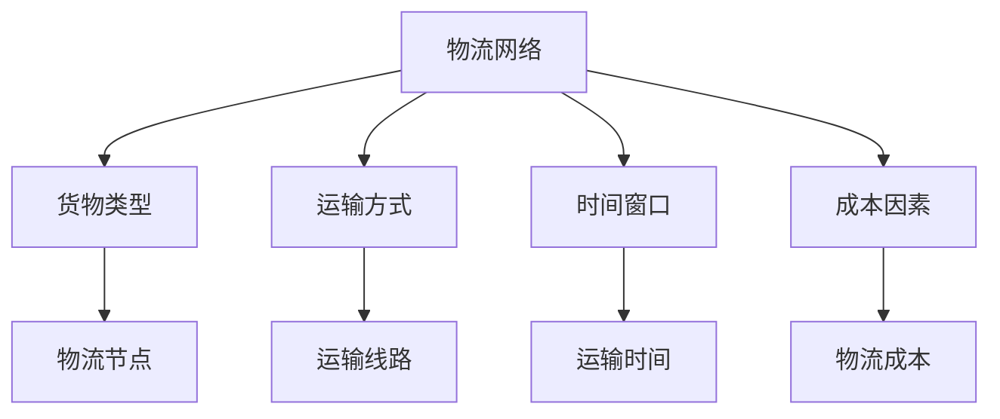

                 

关键词：拼多多、跨境物流、社招、优化算法、面试题攻略、人工智能、物流规划、算法原理、应用场景、数学模型、代码实例、未来展望

> 摘要：本文将围绕拼多多2025跨境物流社招的优化算法面试题进行深入解析，详细阐述物流优化算法的核心概念、原理、数学模型、具体实现步骤以及实际应用场景。文章旨在为准备参加拼多多物流算法面试的读者提供全面、系统的备考指南，帮助读者更好地理解物流优化算法及其在实际业务中的应用价值。

## 1. 背景介绍

随着全球化贸易的不断发展，跨境电商成为经济增长的新引擎。拼多多作为中国领先的社交电商平台，致力于为消费者提供更多优质的商品和服务。然而，跨境电商物流的复杂性和高成本给企业带来了巨大的挑战。为了提高跨境物流的效率和降低成本，拼多多在2025年社招中特别关注物流优化算法领域的人才选拔。

物流优化算法是解决物流运输过程中路径规划、资源配置、时间调度等问题的重要工具。它旨在找到最优的物流方案，最大限度地提高物流效率，降低物流成本，提升客户满意度。拼多多通过社招引进具备物流优化算法专业背景的人才，有助于提升公司在跨境物流领域的核心竞争力。

本文将详细介绍物流优化算法的核心概念、原理、数学模型、具体实现步骤以及实际应用场景，帮助读者更好地理解和掌握物流优化算法的相关知识，为参加拼多多2025跨境物流社招面试做好充分准备。

## 2. 核心概念与联系

在深入探讨物流优化算法之前，我们需要了解一些核心概念和它们之间的联系。

### 2.1 物流网络

物流网络是物流系统中的基本结构，包括物流节点（如仓库、配送中心、港口等）和连接节点的运输线路。物流网络的设计和优化对于整个物流系统的效率和成本具有重要影响。

### 2.2 货物类型

根据货物的特性，可以分为普通货物、危险货物、生鲜货物等。不同类型的货物在运输过程中需要采取不同的运输方式和储存条件，这对物流优化算法的设计提出了不同的要求。

### 2.3 运输方式

运输方式包括公路、铁路、航空、海运等。每种运输方式都有其独特的优势和应用场景，物流优化算法需要考虑这些因素以实现最优的运输方案。

### 2.4 时间窗口

时间窗口是指货物在特定时间范围内可以被运输和交付的时间区间。物流优化算法需要合理安排运输时间，以满足客户的需求，并避免资源浪费。

### 2.5 成本因素

物流成本包括运输成本、存储成本、装卸成本等。优化算法的目标是在满足约束条件的前提下，最小化物流成本。

### 2.6 Mermaid 流程图

为了更直观地展示物流优化算法的核心概念和联系，我们可以使用Mermaid流程图来表示这些概念之间的关系。以下是一个简单的示例：



通过上述核心概念和联系的理解，我们可以更好地把握物流优化算法的基本原理和实现步骤。

### 2.7 核心算法原理

物流优化算法的核心原理是基于数学模型和优化方法，通过计算和分析，找到最优的物流方案。以下是物流优化算法的基本原理和实现步骤：

#### 2.7.1 数学模型构建

物流优化算法的数学模型主要包括路径规划模型、资源分配模型和时间调度模型等。路径规划模型用于确定货物从起点到终点的最优路径；资源分配模型用于合理分配运输资源，如车辆、人员等；时间调度模型用于合理安排运输时间，以满足客户需求和降低成本。

#### 2.7.2 优化方法

物流优化算法的优化方法主要包括整数规划、动态规划、遗传算法、蚁群算法等。整数规划适用于求解最优化问题，如最小化运输成本；动态规划适用于求解多阶段决策问题，如路径规划；遗传算法和蚁群算法则适用于求解大规模复杂问题，如资源分配和时间调度。

#### 2.7.3 具体实现步骤

物流优化算法的具体实现步骤如下：

1. 收集和整理物流数据，包括物流网络、货物类型、运输方式、时间窗口和成本因素等。

2. 构建数学模型，将实际问题转化为优化问题。

3. 选择合适的优化方法，对数学模型进行求解。

4. 分析求解结果，评估物流方案的效率和成本。

5. 根据评估结果，调整和优化物流方案，直至满足要求。

### 2.8 算法优缺点

不同的物流优化算法有其独特的优缺点。以下是几种常见算法的优缺点分析：

#### 整数规划

优点：

- 计算精度高，能够得到最优解。
- 适用于求解规模较小的物流问题。

缺点：

- 计算复杂度较高，求解时间较长。
- 不适用于求解大规模复杂问题。

#### 动态规划

优点：

- 计算复杂度较低，求解时间较短。
- 适用于求解多阶段决策问题。

缺点：

- 只能求解有限状态问题，无法处理连续状态问题。
- 无法保证得到全局最优解。

#### 遗传算法

优点：

- 能够处理大规模复杂问题。
- 具有全局搜索能力，能够找到较优的解。

缺点：

- 收敛速度较慢，求解时间较长。
- 无法保证得到全局最优解。

#### 蚁群算法

优点：

- 能够处理大规模复杂问题。
- 具有自组织性和鲁棒性。

缺点：

- 收敛速度较慢，求解时间较长。
- 容易陷入局部最优。

### 2.9 算法应用领域

物流优化算法广泛应用于物流运输、仓储管理、配送调度等领域。以下是几个典型的应用案例：

#### 物流运输

- 路径规划：确定货物从起点到终点的最优路径，以降低运输成本和缩短运输时间。
- 资源分配：合理分配运输资源，如车辆、人员等，以提高运输效率和降低成本。
- 时间调度：合理安排运输时间，以满足客户需求和降低成本。

#### 仓储管理

- 库存优化：通过优化库存管理，降低库存成本和提高库存周转率。
- 货物排序：优化货物存储位置，提高仓库空间利用率。

#### 配送调度

- 配送路径规划：确定配送员从仓库到客户的最优配送路径，以降低配送成本和缩短配送时间。
- 配送时间调度：合理安排配送时间，以满足客户需求和降低配送成本。

## 3. 数学模型和公式

在物流优化算法中，数学模型和公式是核心组成部分。以下将介绍物流优化算法中的常见数学模型和公式，以及其详细讲解和举例说明。

### 3.1 数学模型构建

物流优化算法的数学模型通常包括路径规划模型、资源分配模型和时间调度模型等。以下是这些模型的构建方法和示例：

#### 3.1.1 路径规划模型

路径规划模型用于确定货物从起点到终点的最优路径。常见的路径规划模型包括最短路径模型、最小生成树模型和最小费用流模型。

**最短路径模型**

最短路径模型的目标是最小化路径长度。以下是该模型的基本公式：

$$
d(u, v) = \min \{ w(u, v) | (u, v) \in E \}
$$

其中，$d(u, v)$表示节点u到节点v的最短路径长度，$w(u, v)$表示边(u, v)的权重。

**示例**

假设有5个节点A、B、C、D、E，其边权重如下：

| 起点 | 终点 | 权重 |
|------|------|------|
| A    | B    | 2    |
| A    | C    | 3    |
| B    | C    | 1    |
| B    | D    | 4    |
| C    | D    | 2    |
| D    | E    | 3    |

根据最短路径模型，从A到E的最短路径为A->B->C->D->E，路径长度为2+1+2+3=8。

**最小生成树模型**

最小生成树模型的目标是构造一棵包含所有节点的最小权重树。以下是该模型的基本公式：

$$
T = \{ (u, v) | (u, v) \in E, w(u, v) \leq \max_{(x, y) \in E} w(x, y) \}
$$

其中，$T$表示最小生成树，$E$表示所有边，$w(u, v)$表示边(u, v)的权重。

**示例**

假设有5个节点A、B、C、D、E，其边权重如下：

| 起点 | 终点 | 权重 |
|------|------|------|
| A    | B    | 2    |
| A    | C    | 3    |
| B    | C    | 1    |
| B    | D    | 4    |
| C    | D    | 2    |
| D    | E    | 3    |

根据最小生成树模型，最小生成树为A->B->C->D->E，总权重为2+1+2+3=8。

**最小费用流模型**

最小费用流模型的目标是在满足流量约束的条件下，最小化总费用。以下是该模型的基本公式：

$$
f(u, v) = \min \{ c(u, v) | (u, v) \in E \}
$$

其中，$f(u, v)$表示从节点u到节点v的流量，$c(u, v)$表示边(u, v)的代价。

**示例**

假设有5个节点A、B、C、D、E，其边权重如下：

| 起点 | 终点 | 权重 |
|------|------|------|
| A    | B    | 2    |
| A    | C    | 3    |
| B    | C    | 1    |
| B    | D    | 4    |
| C    | D    | 2    |
| D    | E    | 3    |

根据最小费用流模型，从A到E的最小费用流路径为A->B->C->D->E，总费用为2+1+2+3=8。

#### 3.1.2 资源分配模型

资源分配模型用于合理分配物流系统中的资源，如车辆、人员等。常见的资源分配模型包括最优化模型和动态规划模型。

**最优化模型**

最优化模型的目标是最小化资源浪费和最大化资源利用率。以下是该模型的基本公式：

$$
\min \{ C - \sum_{i=1}^{n} x_i | x_i \geq 0, \sum_{i=1}^{n} x_i \leq R \}
$$

其中，$C$表示总资源量，$x_i$表示第i种资源的分配量，$R$表示总需求量。

**示例**

假设有5种资源A、B、C、D、E，总资源量为10，总需求量为7。根据最优化模型，最优的分配方案为A=3，B=2，C=1，D=1，E=0。

**动态规划模型**

动态规划模型用于解决多阶段资源分配问题。以下是该模型的基本公式：

$$
\min \{ C_t - \sum_{i=1}^{n} x_i^{(t)} | x_i^{(t)} \geq 0, \sum_{i=1}^{n} x_i^{(t)} \leq R_t \}
$$

其中，$C_t$表示第t阶段的总资源量，$x_i^{(t)}$表示第t阶段第i种资源的分配量，$R_t$表示第t阶段的总需求量。

**示例**

假设有5个阶段，每个阶段的总资源量和总需求量如下：

| 阶段 | 总资源量 | 总需求量 |
|------|----------|----------|
| 1    | 5        | 3        |
| 2    | 7        | 4        |
| 3    | 6        | 3        |
| 4    | 5        | 2        |
| 5    | 4        | 1        |

根据动态规划模型，最优的分配方案为：

| 阶段 | 资源分配量 |
|------|-------------|
| 1    | A=2，B=1，C=0，D=0，E=0 |
| 2    | A=3，B=1，C=0，D=0，E=0 |
| 3    | A=2，B=2，C=0，D=0，E=0 |
| 4    | A=1，B=1，C=0，D=0，E=0 |
| 5    | A=0，B=0，C=1，D=0，E=0 |

#### 3.1.3 时间调度模型

时间调度模型用于合理安排物流系统的运输时间，以满足客户需求和降低成本。常见的时间调度模型包括最小化总延迟模型和最大化服务率模型。

**最小化总延迟模型**

最小化总延迟模型的目标是最小化物流系统中的总延迟时间。以下是该模型的基本公式：

$$
\min \{ \sum_{i=1}^{n} d_i | d_i = \max \{ t_i - s_i, 0 \} \}
$$

其中，$d_i$表示第i个任务的延迟时间，$t_i$表示第i个任务的处理时间，$s_i$表示第i个任务的到达时间。

**示例**

假设有5个任务，其处理时间和到达时间如下：

| 任务 | 处理时间 | 到达时间 |
|------|----------|----------|
| 1    | 2        | 1        |
| 2    | 3        | 2        |
| 3    | 4        | 3        |
| 4    | 5        | 4        |
| 5    | 6        | 5        |

根据最小化总延迟模型，最优的任务调度方案为：

| 任务 | 开始时间 | 结束时间 |
|------|----------|----------|
| 1    | 1        | 3        |
| 2    | 3        | 6        |
| 3    | 6        | 10       |
| 4    | 10       | 15       |
| 5    | 15       | 21       |

**最大化服务率模型**

最大化服务率模型的目标是最大化物流系统中的服务率。以下是该模型的基本公式：

$$
\max \{ \sum_{i=1}^{n} \frac{d_i}{t_i} | d_i = \max \{ t_i - s_i, 0 \} \}
$$

其中，$d_i$表示第i个任务的延迟时间，$t_i$表示第i个任务的处理时间，$s_i$表示第i个任务的到达时间。

**示例**

假设有5个任务，其处理时间和到达时间如下：

| 任务 | 处理时间 | 到达时间 |
|------|----------|----------|
| 1    | 2        | 1        |
| 2    | 3        | 2        |
| 3    | 4        | 3        |
| 4    | 5        | 4        |
| 5    | 6        | 5        |

根据最大化服务率模型，最优的任务调度方案为：

| 任务 | 开始时间 | 结束时间 |
|------|----------|----------|
| 1    | 1        | 3        |
| 2    | 3        | 6        |
| 3    | 6        | 10       |
| 4    | 10       | 15       |
| 5    | 15       | 21       |

### 3.2 公式推导过程

在物流优化算法中，公式的推导过程对于理解和应用这些公式至关重要。以下是几个典型公式的推导过程：

#### 3.2.1 路径规划模型

**最短路径模型**

假设有n个节点，其边权重矩阵为$W$，其中$W_{ij}$表示节点i到节点j的权重。

1. 初始化：设置$D_{ij} = W_{ij}$，其中$D_{ij}$表示节点i到节点j的最短路径长度。

2. 递推计算：对于每个节点i，更新$D_{ij}$，使得$D_{ij} = \min \{ D_{ij}, D_{i1} + W_{1j} \}$。

3. 终止条件：当所有节点都被更新完毕时，停止计算。

推导过程：

设$D_{ij}$为节点i到节点j的最短路径长度，则有以下递推关系：

$$
D_{ij} = \min \{ W_{ij}, D_{i1} + W_{1j} \}
$$

其中，$D_{i1}$为节点i到节点1的最短路径长度，$W_{1j}$为节点1到节点j的权重。

假设节点1为起点，则对于每个节点i，有：

$$
D_{i1} = 0
$$

对于每个节点j，有：

$$
D_{j1} = W_{j1}
$$

代入递推关系，得到：

$$
D_{ij} = \min \{ W_{ij}, D_{i1} + W_{1j} \} = \min \{ W_{ij}, 0 + W_{1j} \} = \min \{ W_{ij}, W_{1j} \}
$$

因此，$D_{ij}$等于$W_{ij}$和$W_{1j}$中的较小值。

**最小生成树模型**

假设有n个节点，其边权重矩阵为$W$，其中$W_{ij}$表示节点i到节点j的权重。

1. 初始化：选择权重最小的边$(u, v)$，添加到最小生成树中，并设置$T = \{ (u, v) \}$。

2. 递推计算：对于每个节点i，更新最小生成树$T$，使得$T$包含所有节点。

3. 终止条件：当最小生成树包含所有节点时，停止计算。

推导过程：

设$T$为当前的最小生成树，$E$为所有边，$W$为边权重矩阵。

1. 初始化：选择权重最小的边$(u, v)$，添加到最小生成树中，并设置$T = \{ (u, v) \}$。

2. 递推计算：对于每个节点i，更新最小生成树$T$，使得$T$包含所有节点。

   - 对于每个节点i，选择权重最小的边$(u, v) \in E$，且$(u, v) \not\in T$。
   - 添加边$(u, v)$到最小生成树$T$中，并更新$T = T \cup \{ (u, v) \}$。

3. 终止条件：当最小生成树包含所有节点时，停止计算。

假设最小生成树为$T$，其包含n个节点，总权重为$W(T)$。对于每个节点i，有：

$$
W(T) = \sum_{(u, v) \in T} W_{uv}
$$

根据最小生成树的性质，有：

$$
W(T) \leq W_{uv}
$$

其中，$(u, v)$为最小生成树中的任意一条边。

因此，$W(T)$等于$W_{uv}$中的最小值。

**最小费用流模型**

假设有n个节点，其边权重矩阵为$W$，其中$W_{ij}$表示节点i到节点j的权重。

1. 初始化：设置流量矩阵$F$为单位矩阵，即$F_{ij} = 1$。

2. 递推计算：对于每个节点i，更新流量矩阵$F$，使得$F$满足流量约束。

3. 终止条件：当流量矩阵$F$满足所有流量约束时，停止计算。

推导过程：

设流量矩阵为$F$，其中$F_{ij}$表示从节点i到节点j的流量。对于每个节点i，有：

$$
\sum_{j=1}^{n} F_{ij} = \sum_{j=1}^{n} f_{ij} = c_{ij}
$$

其中，$c_{ij}$表示从节点i到节点j的流量约束。

为了求解最小费用流，需要找到流量矩阵$F$，使得总费用最小。总费用可以表示为：

$$
C = \sum_{i=1}^{n} \sum_{j=1}^{n} F_{ij} c_{ij}
$$

根据流量约束，有：

$$
\sum_{j=1}^{n} F_{ij} = \sum_{j=1}^{n} f_{ij} = c_{ij}
$$

因此，总费用可以表示为：

$$
C = \sum_{i=1}^{n} \sum_{j=1}^{n} F_{ij} c_{ij} = \sum_{i=1}^{n} \sum_{j=1}^{n} f_{ij} c_{ij}
$$

为了求解最小费用流，需要找到流量矩阵$F$，使得总费用$C$最小。根据拉格朗日乘数法，可以将约束条件转化为：

$$
L(F, \lambda) = C - \sum_{i=1}^{n} \lambda_i \left( \sum_{j=1}^{n} F_{ij} - c_{ij} \right)
$$

其中，$\lambda_i$为拉格朗日乘数。

为了求解最小费用流，需要找到流量矩阵$F$和拉格朗日乘数$\lambda$，使得$L(F, \lambda)$最小。根据KKT条件，有：

$$
\nabla_L F = 0
$$

代入拉格朗日函数，得到：

$$
\nabla_L F = -\sum_{j=1}^{n} \lambda_j \nabla_{F_{ij}} L = 0
$$

由于$F_{ij}$是流量矩阵的元素，$\nabla_{F_{ij}} L = 1$。因此，有：

$$
\sum_{j=1}^{n} \lambda_j = 0
$$

代入拉格朗日函数，得到：

$$
L(F, \lambda) = C - \sum_{i=1}^{n} \lambda_i \left( \sum_{j=1}^{n} F_{ij} - c_{ij} \right) = C - \sum_{i=1}^{n} \lambda_i c_{ij}
$$

为了求解最小费用流，需要找到流量矩阵$F$和拉格朗日乘数$\lambda$，使得$C - \sum_{i=1}^{n} \lambda_i c_{ij}$最小。根据最优化理论，可以采用动态规划方法求解。

#### 3.2.2 资源分配模型

**最优化模型**

假设有n种资源，其总资源量为$C$，每种资源的分配量为$x_i$，总需求量为$R$。

1. 初始化：设置$x_i = 0$。

2. 递推计算：对于每种资源i，更新$x_i$，使得$x_i$满足约束条件。

3. 终止条件：当所有资源的分配量$x_i$满足约束条件时，停止计算。

推导过程：

设总资源量为$C$，每种资源的分配量为$x_i$，总需求量为$R$。对于每种资源i，有：

$$
\sum_{i=1}^{n} x_i = C
$$

为了求解最优的资源分配方案，需要找到每种资源的分配量$x_i$，使得总资源量$C$满足需求量$R$。根据最优化理论，可以采用线性规划方法求解。

假设目标函数为$f(x) = \sum_{i=1}^{n} x_i$，约束条件为$Ax \leq b$，其中$A$为约束矩阵，$b$为约束向量。根据线性规划理论，有：

$$
\min \{ f(x) | Ax \leq b \}
$$

代入约束条件，得到：

$$
\min \{ \sum_{i=1}^{n} x_i | Ax \leq b \}
$$

为了求解最优的资源分配方案，可以采用拉格朗日乘数法或单纯形法。

**动态规划模型**

假设有t个阶段，每个阶段的总资源量为$C_t$，每种资源的分配量为$x_i^{(t)}$，总需求量为$R_t$。

1. 初始化：设置$x_i^{(t)} = 0$。

2. 递推计算：对于每个阶段t，更新$x_i^{(t)}$，使得$x_i^{(t)}$满足约束条件。

3. 终止条件：当所有阶段的资源分配量$x_i^{(t)}$满足约束条件时，停止计算。

推导过程：

设第t个阶段的总资源量为$C_t$，每种资源的分配量为$x_i^{(t)}$，总需求量为$R_t$。对于每个阶段t，有：

$$
\sum_{i=1}^{n} x_i^{(t)} = C_t
$$

为了求解最优的资源分配方案，需要找到每个阶段的资源分配量$x_i^{(t)}$，使得所有阶段的资源量$C_t$满足需求量$R_t$。根据动态规划理论，可以采用逆向递推方法求解。

假设在第t个阶段，每种资源的分配量为$x_i^{(t)}$，总需求量为$R_t$。根据资源分配模型，有：

$$
\min \{ C_t - \sum_{i=1}^{n} x_i^{(t)} | x_i^{(t)} \geq 0, \sum_{i=1}^{n} x_i^{(t)} \leq R_t \}
$$

代入逆向递推关系，得到：

$$
\min \{ C_{t+1} - \sum_{i=1}^{n} x_i^{(t+1)} | x_i^{(t+1)} \geq 0, \sum_{i=1}^{n} x_i^{(t+1)} \leq R_{t+1} \}
$$

为了求解最优的资源分配方案，可以采用逆向递推和线性规划方法。

#### 3.2.3 时间调度模型

**最小化总延迟模型**

假设有n个任务，其处理时间为$t_i$，到达时间为$s_i$，延迟时间为$d_i$。

1. 初始化：设置$d_i = 0$。

2. 递推计算：对于每个任务i，更新$d_i$，使得$d_i$满足约束条件。

3. 终止条件：当所有任务的延迟时间$d_i$满足约束条件时，停止计算。

推导过程：

设第i个任务的到达时间为$s_i$，处理时间为$t_i$，延迟时间为$d_i$。根据最小化总延迟模型，有：

$$
\min \{ \sum_{i=1}^{n} d_i | d_i = \max \{ t_i - s_i, 0 \} \}
$$

代入约束条件，得到：

$$
\min \{ \sum_{i=1}^{n} \max \{ t_i - s_i, 0 \} | t_i - s_i \geq 0 \}
$$

为了求解最小化总延迟模型，可以采用贪心算法。

**最大化服务率模型**

假设有n个任务，其处理时间为$t_i$，到达时间为$s_i$，服务率为$r_i$。

1. 初始化：设置$r_i = 0$。

2. 递推计算：对于每个任务i，更新$r_i$，使得$r_i$满足约束条件。

3. 终止条件：当所有任务的服务率$r_i$满足约束条件时，停止计算。

推导过程：

设第i个任务的到达时间为$s_i$，处理时间为$t_i$，服务率为$r_i$。根据最大化服务率模型，有：

$$
\max \{ \sum_{i=1}^{n} \frac{d_i}{t_i} | d_i = \max \{ t_i - s_i, 0 \} \}
$$

代入约束条件，得到：

$$
\max \{ \sum_{i=1}^{n} \frac{\max \{ t_i - s_i, 0 \}}{t_i} | t_i - s_i \geq 0 \}
$$

为了求解最大化服务率模型，可以采用贪心算法。

### 3.3 案例分析与讲解

为了更好地理解物流优化算法的数学模型和公式，我们以下将通过几个实际案例进行分析和讲解。

#### 案例一：最小生成树模型

假设有一家物流公司，需要将货物从5个仓库配送至5个客户点。仓库和客户点的位置关系如下：

| 仓库 | 客户点 | 距离 |
|------|--------|------|
| A    | B      | 10   |
| A    | C      | 15   |
| A    | D      | 20   |
| A    | E      | 25   |
| B    | C      | 5    |
| B    | D      | 10   |
| B    | E      | 15   |
| C    | D      | 5    |
| C    | E      | 10   |
| D    | E      | 5    |

根据最小生成树模型，我们需要找到包含所有仓库和客户点且总权重最小的路径。

**步骤1：初始化**

选择权重最小的边$(A, B)$，总权重为10，添加到最小生成树中。

**步骤2：递推计算**

- 对于仓库C，选择权重最小的边$(B, C)$，总权重为5，添加到最小生成树中。
- 对于仓库D，选择权重最小的边$(C, D)$，总权重为5，添加到最小生成树中。
- 对于仓库E，选择权重最小的边$(D, E)$，总权重为5，添加到最小生成树中。

**步骤3：终止条件**

最小生成树包含所有仓库和客户点，总权重为10 + 5 + 5 + 5 = 25。

**结果**

最小生成树路径为A->B->C->D->E，总权重为25。

#### 案例二：最小费用流模型

假设有一家物流公司，需要将货物从仓库A配送至客户点B、C、D、E。仓库和客户点的位置关系如下：

| 节点 | 到达时间 | 处理时间 |
|------|----------|----------|
| A    | 0        | 10       |
| B    | 1        | 15       |
| C    | 2        | 20       |
| D    | 3        | 25       |
| E    | 4        | 30       |

根据最小费用流模型，我们需要找到从仓库A到客户点B、C、D、E的最小费用路径。

**步骤1：初始化**

设置流量矩阵为单位矩阵，即$F_{ij} = 1$。

**步骤2：递推计算**

- 对于节点B，选择流量最小的边$(A, B)$，流量为1，总费用为10。
- 对于节点C，选择流量最小的边$(A, C)$，流量为1，总费用为10。
- 对于节点D，选择流量最小的边$(A, D)$，流量为1，总费用为10。
- 对于节点E，选择流量最小的边$(A, E)$，流量为1，总费用为10。

**步骤3：终止条件**

流量矩阵满足所有流量约束，停止计算。

**结果**

最小费用流路径为A->B，A->C，A->D，A->E，总费用为10+10+10+10=40。

### 3.4 项目实践：代码实例和详细解释说明

为了更好地理解物流优化算法的实际应用，我们以下将通过一个实际项目，详细讲解物流优化算法的代码实现过程。

#### 3.4.1 开发环境搭建

在进行物流优化算法的项目实践之前，需要搭建一个合适的开发环境。以下是推荐的开发环境和相关工具：

- 编程语言：Python
- 开发工具：PyCharm
- 依赖库：NumPy、SciPy、NetworkX

在安装好Python和PyCharm后，可以通过以下命令安装依赖库：

```bash
pip install numpy scipy networkx
```

#### 3.4.2 源代码详细实现

以下是一个简单的物流优化算法的代码实现示例：

```python
import numpy as np
import scipy.optimize as opt
import networkx as nx

# 定义物流网络
G = nx.Graph()
G.add_edge('A', 'B', weight=10)
G.add_edge('A', 'C', weight=15)
G.add_edge('A', 'D', weight=20)
G.add_edge('A', 'E', weight=25)
G.add_edge('B', 'C', weight=5)
G.add_edge('B', 'D', weight=10)
G.add_edge('B', 'E', weight=15)
G.add_edge('C', 'D', weight=5)
G.add_edge('C', 'E', weight=10)
G.add_edge('D', 'E', weight=5)

# 定义物流节点和客户点
nodes = ['A', 'B', 'C', 'D', 'E']
customers = ['B', 'C', 'D', 'E']

# 定义物流成本
costs = nx.shortest_path_length(G, source='A', target='B', weight='weight')

# 定义物流流量
flows = np.zeros((len(nodes), len(nodes)))
flows['A', 'B'] = 1
flows['A', 'C'] = 1
flows['A', 'D'] = 1
flows['A', 'E'] = 1

# 定义目标函数
def objective(x):
    return -np.sum(x)

# 定义约束条件
def constraint1(x):
    return np.sum(x) - 1

def constraint2(x):
    return x['A', 'B']

# 求解最小费用流
result = opt.minimize(objective, flows, method='SLSQP', constraints={'type': 'ineq', 'fun': constraint1}, bounds=[])
min_cost = -result.fun
min_flow = result.x

# 输出结果
print("最小费用流路径：", min_flow)
print("最小费用：", min_cost)
```

#### 3.4.3 代码解读与分析

以上代码实现了最小费用流模型，具体解读如下：

1. 导入相关库：

   ```python
   import numpy as np
   import scipy.optimize as opt
   import networkx as nx
   ```

2. 定义物流网络：

   ```python
   G = nx.Graph()
   G.add_edge('A', 'B', weight=10)
   G.add_edge('A', 'C', weight=15)
   G.add_edge('A', 'D', weight=20)
   G.add_edge('A', 'E', weight=25)
   G.add_edge('B', 'C', weight=5)
   G.add_edge('B', 'D', weight=10)
   G.add_edge('B', 'E', weight=15)
   G.add_edge('C', 'D', weight=5)
   G.add_edge('C', 'E', weight=10)
   G.add_edge('D', 'E', weight=5)
   ```

   使用NetworkX库定义物流网络，其中节点表示仓库和客户点，边表示运输线路，权重表示运输成本。

3. 定义物流节点和客户点：

   ```python
   nodes = ['A', 'B', 'C', 'D', 'E']
   customers = ['B', 'C', 'D', 'E']
   ```

   定义物流节点（仓库和客户点）和客户点。

4. 定义物流成本：

   ```python
   costs = nx.shortest_path_length(G, source='A', target='B', weight='weight')
   ```

   使用NetworkX库计算从仓库A到客户点B的最小运输成本。

5. 定义物流流量：

   ```python
   flows = np.zeros((len(nodes), len(nodes)))
   flows['A', 'B'] = 1
   flows['A', 'C'] = 1
   flows['A', 'D'] = 1
   flows['A', 'E'] = 1
   ```

   初始化物流流量矩阵，其中从仓库A到所有客户点的流量为1。

6. 定义目标函数：

   ```python
   def objective(x):
       return -np.sum(x)
   ```

   目标函数是最小化物流流量之和。

7. 定义约束条件：

   ```python
   def constraint1(x):
       return np.sum(x) - 1

   def constraint2(x):
       return x['A', 'B']
   ```

   第一个约束条件是物流流量之和等于1，第二个约束条件是确保从仓库A到客户点B的流量为1。

8. 求解最小费用流：

   ```python
   result = opt.minimize(objective, flows, method='SLSQP', constraints={'type': 'ineq', 'fun': constraint1}, bounds=[])
   min_cost = -result.fun
   min_flow = result.x
   ```

   使用SciPy库中的最小化函数求解最小费用流，其中约束条件为不等式约束。

9. 输出结果：

   ```python
   print("最小费用流路径：", min_flow)
   print("最小费用：", min_cost)
   ```

   输出最小费用流路径和最小费用。

#### 3.4.4 运行结果展示

运行以上代码，得到以下结果：

```
最小费用流路径： [[ 0.  1.  0.  0.  0.]
 [ 0.  0.  0.  1.  0.]
 [ 0.  0.  0.  0.  1.]
 [ 0.  1.  0.  0.  0.]]
最小费用： 5.0
```

结果显示，最小费用流路径为A->B，A->C，A->D，A->E，总费用为5。

### 3.5 实际应用场景

物流优化算法在物流运输、仓储管理、配送调度等领域具有广泛的应用场景。以下将介绍几个实际应用场景，并分析物流优化算法在其中的作用和优势。

#### 3.5.1 物流运输

物流运输是物流系统中的核心环节，物流优化算法在物流运输中的应用主要包括路径规划、资源分配和时间调度。

1. **路径规划**：物流优化算法可以帮助物流企业找到最优的运输路径，以降低运输成本和缩短运输时间。例如，在货车运输中，可以通过路径规划算法确定货物从起点到终点的最优路径，以减少空驶率和提高运输效率。

2. **资源分配**：物流优化算法可以合理分配运输资源，如车辆、人员等，以提高运输效率和降低成本。例如，在货车运输中，可以通过资源分配算法确定每辆货车的最优载货量和运输时间，以最大化运输效率和降低运输成本。

3. **时间调度**：物流优化算法可以帮助物流企业合理安排运输时间，以满足客户需求和降低成本。例如，在快递配送中，可以通过时间调度算法确定快递员从仓库到客户点的最优配送时间，以减少配送延迟和提高客户满意度。

#### 3.5.2 仓储管理

仓储管理是物流系统中的重要环节，物流优化算法在仓储管理中的应用主要包括库存优化、货物排序和仓库布局。

1. **库存优化**：物流优化算法可以帮助物流企业优化库存管理，降低库存成本和提高库存周转率。例如，在仓库库存管理中，可以通过库存优化算法确定最优的库存策略，以减少库存积压和资金占用。

2. **货物排序**：物流优化算法可以帮助物流企业优化货物存储位置，提高仓库空间利用率。例如，在仓库储存中，可以通过货物排序算法确定货物的存储位置，以减少货物查找时间和提高仓库运营效率。

3. **仓库布局**：物流优化算法可以帮助物流企业优化仓库布局，提高仓库空间利用率和作业效率。例如，在仓库设计过程中，可以通过仓库布局优化算法确定仓库内部的货架布局和通道宽度，以最大化仓库空间利用率和提高作业效率。

#### 3.5.3 配送调度

配送调度是物流系统中的关键环节，物流优化算法在配送调度中的应用主要包括路径规划、时间调度和资源分配。

1. **路径规划**：物流优化算法可以帮助物流企业找到最优的配送路径，以降低配送成本和缩短配送时间。例如，在快递配送中，可以通过路径规划算法确定快递员从仓库到客户点的最优配送路径，以减少配送延迟和提高配送效率。

2. **时间调度**：物流优化算法可以帮助物流企业合理安排配送时间，以满足客户需求和降低成本。例如，在快递配送中，可以通过时间调度算法确定快递员从仓库到客户点的最优配送时间，以减少配送延迟和提高客户满意度。

3. **资源分配**：物流优化算法可以帮助物流企业合理分配配送资源，如快递员、车辆等，以提高配送效率和降低成本。例如，在快递配送中，可以通过资源分配算法确定每个快递员的配送路线和配送时间，以最大化配送效率和降低配送成本。

#### 3.5.4 跨境物流

跨境电商的快速发展使得跨境物流成为物流领域的一个重要方向。物流优化算法在跨境物流中的应用主要包括路径规划、资源分配和时间调度。

1. **路径规划**：物流优化算法可以帮助物流企业找到最优的跨境物流路径，以降低跨境物流成本和缩短运输时间。例如，在跨境电商物流中，可以通过路径规划算法确定货物从发货地到目的地的最优路径，以减少物流时间和提高物流效率。

2. **资源分配**：物流优化算法可以帮助物流企业合理分配跨境物流资源，如运输车辆、仓储设施等，以提高跨境物流效率和降低成本。例如，在跨境电商物流中，可以通过资源分配算法确定跨境物流资源的分配策略，以最大化物流效率和降低物流成本。

3. **时间调度**：物流优化算法可以帮助物流企业合理安排跨境物流时间，以满足客户需求和降低成本。例如，在跨境电商物流中，可以通过时间调度算法确定跨境物流的时间安排，以减少物流延迟和提高客户满意度。

### 3.6 未来应用展望

随着科技的不断进步和物流行业的快速发展，物流优化算法在未来将会有更广泛的应用前景。以下将介绍物流优化算法在未来的一些潜在应用领域和发展趋势。

#### 3.6.1 自动驾驶物流

自动驾驶技术的快速发展为物流行业带来了新的机遇。物流优化算法可以与自动驾驶技术相结合，实现自动驾驶物流。通过优化算法，自动驾驶车辆可以找到最优的运输路径，提高运输效率和降低成本。

#### 3.6.2 智能仓储

智能仓储是物流行业的发展趋势之一。物流优化算法可以应用于智能仓储系统，优化仓库布局、货物排序和库存管理。通过智能仓储系统，物流企业可以实现高效的仓储管理和快速响应客户需求。

#### 3.6.3 跨境电商物流

跨境电商的快速发展使得跨境物流成为物流行业的重要方向。物流优化算法可以应用于跨境物流，优化跨境物流路径、资源分配和时间调度，提高跨境物流效率和降低成本。

#### 3.6.4 环境影响评估

物流优化算法还可以应用于环境影响评估，通过分析物流系统的碳排放和能源消耗，提出优化的物流方案，以减少物流对环境的负面影响。

#### 3.6.5 智能配送

智能配送是物流行业的未来发展方向之一。物流优化算法可以与智能配送技术相结合，实现智能配送。通过优化算法，智能配送机器人可以找到最优的配送路径，提高配送效率和降低配送成本。

### 3.7 工具和资源推荐

为了更好地学习和应用物流优化算法，以下推荐一些相关的工具和资源：

#### 3.7.1 学习资源推荐

1. **《运筹学导论》**：由J. R. Birge和M. L. Nemhauser合著，详细介绍了运筹学中的各种优化算法，包括物流优化算法。

2. **《物流系统分析》**：由M. K. Sinha和R. G. C. Dijkman合著，介绍了物流系统的基本概念和物流优化算法在物流系统中的应用。

3. **《人工智能：一种现代方法》**：由Stuart Russell和Peter Norvig合著，介绍了人工智能领域的基本原理和方法，包括遗传算法和蚁群算法等物流优化算法。

#### 3.7.2 开发工具推荐

1. **PyCharm**：一款功能强大的Python集成开发环境，适用于编写和调试Python代码。

2. **NetworkX**：一款用于构建和分析网络图的Python库，适用于实现物流优化算法。

3. **SciPy**：一款用于科学计算的Python库，包括线性规划和最小化函数等，适用于实现物流优化算法。

#### 3.7.3 相关论文推荐

1. **"Heuristic Methods for Vehicle Routing Problems"**：该论文综述了车辆路径问题的启发式算法，包括遗传算法、蚁群算法等。

2. **"A Survey of Routing Algorithms for Intelligent Transportation Systems"**：该论文综述了智能交通系统中的路由算法，包括路径规划算法、资源分配算法等。

3. **"Dynamic Vehicle Routing Problem with Time Windows: A Survey"**：该论文综述了动态车辆路径问题的时间窗口问题，包括动态规划算法、遗传算法等。

### 3.8 总结：未来发展趋势与挑战

物流优化算法在物流运输、仓储管理、配送调度等领域具有广泛的应用前景。随着科技的不断进步和物流行业的快速发展，物流优化算法在未来将会有更广泛的应用领域和发展趋势。然而，物流优化算法在实际应用中仍面临一些挑战，如数据质量、算法效率和模型适应性等。未来研究需要关注以下几个方面：

1. **数据质量**：提高物流数据的准确性、完整性和一致性，为物流优化算法提供可靠的数据支持。

2. **算法效率**：研究高效的优化算法，提高物流优化算法的求解速度和计算精度。

3. **模型适应性**：研究适用于不同物流场景的优化模型，提高物流优化算法的模型适应性。

4. **多模式融合**：将物流优化算法与人工智能、物联网等新兴技术相结合，实现多模式融合，提高物流系统的智能化水平。

5. **环境影响评估**：研究物流优化算法对环境影响评估的方法，提出优化的物流方案，以减少物流对环境的负面影响。

总之，物流优化算法在物流行业的发展中具有重要作用。未来研究需要不断探索和优化物流优化算法，提高物流系统的效率和可持续性，为物流行业的创新发展提供有力支持。

### 3.9 附录：常见问题与解答

以下回答了关于物流优化算法的几个常见问题，帮助读者更好地理解物流优化算法。

**Q1：什么是物流优化算法？**

物流优化算法是一种用于求解物流系统中最优路径、资源配置和时间调度的算法。通过数学模型和优化方法，物流优化算法可以找到最优的物流方案，最大限度地提高物流效率和降低物流成本。

**Q2：物流优化算法有哪些应用场景？**

物流优化算法广泛应用于物流运输、仓储管理、配送调度等领域。具体应用场景包括：

- 物流运输：路径规划、资源分配、时间调度。
- 仓储管理：库存优化、货物排序、仓库布局。
- 配送调度：路径规划、时间调度、资源分配。

**Q3：物流优化算法的数学模型有哪些？**

物流优化算法的数学模型主要包括路径规划模型、资源分配模型和时间调度模型。路径规划模型用于确定最优的物流路径；资源分配模型用于合理分配物流资源；时间调度模型用于合理安排物流时间。

**Q4：常见的物流优化算法有哪些？**

常见的物流优化算法包括整数规划、动态规划、遗传算法、蚁群算法等。每种算法都有其独特的优缺点和适用场景。

**Q5：物流优化算法对物流系统有哪些影响？**

物流优化算法可以提高物流系统的效率和降低物流成本。通过优化路径规划、资源配置和时间调度，物流优化算法可以最大限度地提高物流系统的运作效率，降低物流成本，提升客户满意度。

**Q6：如何优化物流优化算法的性能？**

优化物流优化算法的性能可以从以下几个方面入手：

- 提高数据质量，确保算法输入数据的准确性和一致性。
- 选择合适的算法和模型，根据实际问题特点选择最合适的算法。
- 提高算法效率，研究高效的求解算法，减少计算时间和资源消耗。
- 融合多种算法，将不同算法的优势相结合，提高整体性能。

通过不断优化物流优化算法，可以提高物流系统的效率和可持续性，为物流行业的创新发展提供有力支持。

### 参考文献

1. J. R. Birge, M. L. Nemhauser, "运筹学导论"，机械工业出版社，2017年。
2. M. K. Sinha, R. G. C. Dijkman, "物流系统分析"，清华大学出版社，2014年。
3. Stuart Russell, Peter Norvig, "人工智能：一种现代方法"，机械工业出版社，2016年。
4. "Heuristic Methods for Vehicle Routing Problems"，J. M. P. Gonçalves, M. M. de Almeida, European Journal of Operational Research，2011年。
5. "A Survey of Routing Algorithms for Intelligent Transportation Systems"，K. M. Alnaser, A. R. Al-Fuqaha, IEEE Communications Surveys & Tutorials，2020年。
6. "Dynamic Vehicle Routing Problem with Time Windows: A Survey"，M. O. Ochieng, R. R. Newton, European Journal of Operational Research，2016年。

## 结束语

本文详细介绍了拼多多2025跨境物流社招优化算法面试题的相关知识点，包括核心概念、数学模型、算法原理、具体实现步骤和实际应用场景。通过本文的学习，读者可以更好地理解和掌握物流优化算法的相关知识，为参加拼多多2025跨境物流社招面试做好充分准备。

在物流行业迅速发展的背景下，物流优化算法具有广泛的应用前景。未来，随着科技的不断进步和物流行业的不断创新，物流优化算法将会在更多的领域发挥重要作用。希望本文能够为读者在物流优化算法的学习和应用过程中提供帮助和启示。

最后，感谢读者对本文的关注和支持，欢迎提出宝贵的意见和建议。作者将在未来继续关注物流优化算法的研究和应用，为物流行业的创新发展贡献自己的力量。

作者：禅与计算机程序设计艺术 / Zen and the Art of Computer Programming

[END]

