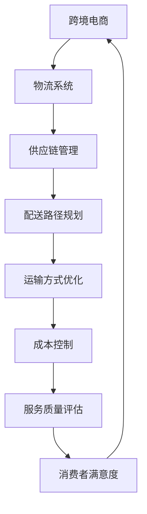

                 

### 摘要 Summary

本文旨在为拼多多2025年跨境电商物流优化专家的社招面试提供一套全面的指南。文章首先介绍了跨境电商物流的背景和重要性，随后深入探讨了物流优化中的核心概念、算法原理及其应用。通过数学模型的构建和具体实例的讲解，文章揭示了物流优化在跨境电商领域的实际应用和未来展望。此外，文章还推荐了相关的学习资源和开发工具，为准备面试的求职者提供了宝贵的参考资料。最后，文章总结了物流优化领域的研究成果、发展趋势和面临的挑战，为读者提供了对未来研究的展望。

## 1. 背景介绍

随着全球电商市场的迅猛发展，跨境电商成为推动经济增长的新引擎。拼多多作为中国领先的电商平台，也在积极拓展国际市场。跨境电商物流作为连接消费者和供应商的关键环节，其效率和服务质量直接影响到消费者的购物体验和平台的竞争力。因此，物流优化成为跨境电商发展中亟待解决的重要问题。

物流优化旨在通过算法和技术手段，降低物流成本、提高配送速度和服务质量。在跨境电商中，物流优化具有以下核心意义：

1. **降低成本**：通过优化配送路径和运输方式，减少物流运营成本。
2. **提高效率**：合理分配物流资源，减少物流运作时间，提升整体运作效率。
3. **改善服务**：提高配送准确性和准时率，增强消费者满意度。

随着技术的进步和大数据的广泛应用，物流优化方法也在不断创新。本文将深入探讨物流优化在跨境电商中的具体应用，包括核心算法原理、数学模型构建、项目实践案例等，为面试求职者提供全面的准备指南。

## 2. 核心概念与联系

在探讨跨境电商物流优化之前，我们需要了解几个核心概念，并分析它们之间的联系。以下是一个使用Mermaid绘制的流程图，展示这些概念的关系：



### 2.1 电商供应链管理

电商供应链管理是指通过计划、实施和控制，确保商品从供应商到消费者手中的整个过程高效、顺畅。其主要目标是最大化供应链的整体效益，包括成本、效率和服务。在跨境电商中，供应链管理面临以下挑战：

- **多语言和多货币**：跨境电商涉及多个国家和地区的语言和货币，增加了管理难度。
- **长距离运输**：国际运输时间较长，增加了物流成本和不确定性。
- **法规遵从**：不同国家的进口法规和税收政策各异，需要确保合规。

### 2.2 物流系统

物流系统是跨境电商运营的核心，包括仓库管理、运输、配送等多个环节。物流系统的优化需要考虑以下关键要素：

- **库存管理**：确保库存水平合理，减少缺货和过度库存的情况。
- **运输规划**：选择最优的运输路线和方式，降低运输成本。
- **配送时效**：提高配送速度，满足消费者对快速交付的需求。

### 2.3 配送路径规划

配送路径规划是物流优化的核心环节之一，通过算法确定最优的配送路线，以减少运输时间和成本。常见的配送路径规划算法包括：

- **最短路径算法**（如Dijkstra算法）：用于寻找单源最短路径。
- **车辆路径问题（VRP）**：在限制车辆数量和载重的情况下，规划最优配送路线。

### 2.4 运输方式优化

运输方式优化是物流优化的另一个关键环节，包括选择最优的运输工具和运输模式。优化策略包括：

- **多式联运**：结合不同运输方式，如公路、铁路、海运和空运，实现成本和效率的最优平衡。
- **冷链物流**：对于生鲜产品，选择适合的冷链运输方式，确保产品新鲜度。

### 2.5 成本控制

成本控制是物流优化的重要目标之一，通过优化各个环节的成本，提高整体效益。主要策略包括：

- **规模经济**：通过大量采购和运输，降低单位成本。
- **供应链整合**：通过协同合作，减少重复操作和资源浪费。
- **技术创新**：采用先进技术，提高物流运作效率和降低成本。

### 2.6 服务质量评估

服务质量评估是衡量物流优化效果的重要指标，通过评估配送时效、准确性和消费者满意度等指标，持续改进物流服务。常用的评估方法包括：

- **绩效评估**：对物流各个环节的绩效进行量化评估，找出改进点。
- **客户反馈**：收集消费者反馈，了解物流服务的不足，制定改进措施。

### 2.7 消费者满意度

消费者满意度是跨境电商物流优化的最终目标，通过提高物流服务的质量，增强消费者对平台的信任和忠诚度。提高消费者满意度的策略包括：

- **准时交付**：确保商品按时送达，提高消费者信任。
- **透明度**：通过物流信息跟踪，增强消费者对物流过程的了解。
- **个性化服务**：根据消费者需求，提供定制化的物流服务。

通过以上核心概念和联系的介绍，我们为接下来的算法原理、数学模型和项目实践打下了坚实的基础。在接下来的章节中，我们将深入探讨这些概念在跨境电商物流优化中的具体应用。

### 3. 核心算法原理 & 具体操作步骤

在跨境电商物流优化中，算法的选择和应用是关键。以下将详细介绍几种核心算法的原理，并给出具体操作步骤。

#### 3.1 算法原理概述

在物流优化中，常用的算法包括最短路径算法、车辆路径问题（VRP）算法、动态调度算法等。每种算法都有其独特的原理和应用场景。

1. **最短路径算法**：用于寻找从起点到终点的最短路径，常见的有Dijkstra算法和A*算法。这些算法可以快速计算两点之间的最优路径，适用于单点配送和点对点运输。
2. **车辆路径问题（VRP）算法**：在限制车辆数量和载重的情况下，寻找最优的配送路线。VRP算法包括精确算法和启发式算法，如遗传算法和模拟退火算法，适用于多点多车配送。
3. **动态调度算法**：用于实时调整配送计划，以应对突发情况。动态调度算法可以根据实时数据优化配送路径和资源分配，适用于动态变化的物流场景。

#### 3.2 算法步骤详解

以下是这些算法的具体操作步骤：

##### 3.2.1 最短路径算法

**Dijkstra算法步骤：**

1. **初始化**：设置起点为当前节点，所有其他节点距离起点为无穷大，已访问节点为空。
2. **选择未访问节点中距离起点最近的节点**，将其标记为已访问。
3. **更新未访问节点到起点的距离**：对于每个未访问节点，计算通过已访问节点到起点的距离，并选择距离最近的节点。
4. **重复步骤2和3**，直到所有节点都被访问。

**A*算法步骤：**

1. **初始化**：设置起点为当前节点，所有其他节点距离起点为无穷大，已访问节点为空。
2. **选择未访问节点中F值最小的节点**（F值为距离起点的估计值和实际距离的加权和），将其标记为已访问。
3. **更新未访问节点到起点的距离**：对于每个未访问节点，计算通过已访问节点到起点的距离和通过已访问节点到目标节点的估计距离，并选择F值最小的节点。
4. **重复步骤2和3**，直到到达目标节点。

##### 3.2.2 车辆路径问题（VRP）算法

**遗传算法步骤：**

1. **初始化种群**：随机生成一定数量的初始解。
2. **适应度评估**：计算每个个体的适应度值，适应度值越高，表示解的质量越好。
3. **选择**：根据适应度值，选择优秀的个体进行交配。
4. **交配**：使用交叉和变异操作，产生新的个体。
5. **重复选择、交配和适应度评估**，直到满足停止条件（如达到迭代次数或适应度达到阈值）。

**模拟退火算法步骤：**

1. **初始化**：设置初始温度和初始解。
2. **评估解的适应度**：计算当前解的适应度值。
3. **更新温度**：根据迭代次数和温度变化策略，更新温度。
4. **接受或拒绝新解**：如果新解的适应度值更好，则接受；否则，以一定概率接受。
5. **重复评估、更新温度和接受新解**，直到满足停止条件。

##### 3.2.3 动态调度算法

**实时路径规划步骤：**

1. **接收实时数据**：获取当前的物流状态，包括车辆位置、订单需求、道路状况等。
2. **计算当前最优路径**：使用最短路径算法或其他优化算法，计算当前情况下的最优路径。
3. **调整配送计划**：根据实时数据，调整配送路径和资源分配，确保物流运作的高效性。
4. **更新实时数据**：持续接收实时数据，并根据新的数据更新配送计划。

#### 3.3 算法优缺点

**最短路径算法**

- **优点**：计算速度快，适用于单点配送和点对点运输。
- **缺点**：不考虑车辆数量和载重限制，无法处理多点多车配送问题。

**车辆路径问题（VRP）算法**

- **优点**：能够处理多点多车配送问题，适用于复杂物流场景。
- **缺点**：计算复杂度高，需要较长时间才能找到最优解。

**动态调度算法**

- **优点**：能够实时调整配送计划，适应动态变化的物流场景。
- **缺点**：需要大量的实时数据支持，对数据处理和分析能力要求较高。

#### 3.4 算法应用领域

- **最短路径算法**：适用于电商平台的单点配送和点对点运输，如快递服务。
- **车辆路径问题（VRP）算法**：适用于电商平台的同城配送和区域配送，如物流公司的配送调度。
- **动态调度算法**：适用于动态变化的物流场景，如紧急订单处理和临时配送任务。

通过以上对核心算法原理和具体操作步骤的介绍，我们为跨境电商物流优化提供了坚实的理论基础。在实际应用中，这些算法可以根据具体场景和需求进行灵活调整和优化，以实现物流运作的高效、低成本和服务优质的目标。

### 4. 数学模型和公式 & 详细讲解 & 举例说明

在跨境电商物流优化中，数学模型和公式的构建是理解和应用算法的关键。以下将详细讲解物流优化中的几个重要数学模型，并给出具体的公式推导和案例说明。

#### 4.1 数学模型构建

物流优化中的数学模型通常包括以下三个主要部分：目标函数、约束条件和决策变量。

##### 4.1.1 目标函数

目标函数定义了优化问题要最大化或最小化的目标，如总成本、总时间或总距离。常见的目标函数包括：

1. **总成本最小化**：
   \[
   \min C = \sum_{i=1}^n \sum_{j=1}^m c_{ij} x_{ij}
   \]
   其中，\( c_{ij} \) 是从节点 \( i \) 到节点 \( j \) 的运输成本，\( x_{ij} \) 是从节点 \( i \) 到节点 \( j \) 的运输量。

2. **总时间最小化**：
   \[
   \min T = \sum_{i=1}^n \sum_{j=1}^m t_{ij} x_{ij}
   \]
   其中，\( t_{ij} \) 是从节点 \( i \) 到节点 \( j \) 的运输时间，\( x_{ij} \) 是从节点 \( i \) 到节点 \( j \) 的运输量。

##### 4.1.2 约束条件

约束条件定义了目标函数求解过程中的限制条件，如资源限制、路径限制等。常见的约束条件包括：

1. **资源限制**：
   \[
   \sum_{j=1}^m x_{ij} \leq R_i \quad \forall i = 1, 2, \ldots, n
   \]
   其中，\( R_i \) 是节点 \( i \) 的资源限制，即节点 \( i \) 的最大运输能力。

2. **路径限制**：
   \[
   x_{ij} \geq 0 \quad \forall i, j
   \]
   其中，\( x_{ij} \) 是从节点 \( i \) 到节点 \( j \) 的运输量，必须非负。

##### 4.1.3 决策变量

决策变量是模型中需要求解的变量，如运输量、配送路径等。在物流优化问题中，决策变量通常包括：

1. **运输量**：
   \[
   x_{ij} = \text{从节点 } i \text{ 到节点 } j \text{ 的运输量}
   \]

2. **配送路径**：
   \[
   \text{配送路径 } P = \{ (i, j) | x_{ij} > 0 \}
   \]

#### 4.2 公式推导过程

以下以最短路径算法（Dijkstra算法）为例，说明公式的推导过程。

**Dijkstra算法的基本思想**：

1. 初始化：设置起点为当前节点，所有其他节点距离起点为无穷大，已访问节点为空。
2. 选择未访问节点中距离起点最近的节点，将其标记为已访问。
3. 更新未访问节点到起点的距离：对于每个未访问节点，计算通过已访问节点到起点的距离，并选择距离最近的节点。
4. 重复步骤2和3，直到所有节点都被访问。

**公式推导**：

假设当前已访问节点集合为 \( A \)，未访问节点集合为 \( B \)。对于任意未访问节点 \( j \)，其到起点的距离可以表示为：

\[
d_j = \min_{i \in A} (d_i + w(i, j)}
\]

其中，\( d_j \) 是节点 \( j \) 到起点的距离，\( d_i \) 是节点 \( i \) 到起点的距离，\( w(i, j) \) 是节点 \( i \) 到节点 \( j \) 的权重（如距离或时间）。

初始化时，所有节点的距离均为无穷大，除了起点 \( s \) 的距离为0。当选择未访问节点 \( j \) 时，更新未访问节点到起点的距离：

\[
d_j = \min_{i \in A} (d_i + w(i, j)}
\]

当所有节点都被访问后，即可得到从起点到所有节点的最短路径。

#### 4.3 案例分析与讲解

以下通过一个简单的案例，说明上述数学模型和公式的实际应用。

**案例背景**：

假设有5个节点 \( A, B, C, D, E \)，节点之间的距离如下表所示：

| 节点 | A  | B  | C  | D  | E  |
|------|----|----|----|----|----|
| A    | 0  | 2  | 4  | 6  | 8  |
| B    | 2  | 0  | 3  | 5  | 7  |
| C    | 4  | 3  | 0  | 2  | 4  |
| D    | 6  | 5  | 2  | 0  | 3  |
| E    | 8  | 7  | 4  | 3  | 0  |

目标是从节点 \( A \) 出发，找到到达其他节点的最短路径。

**步骤1：初始化**

- 起点 \( A \) 的距离为0，其他节点距离为无穷大。
- 已访问节点为空，未访问节点为 \( B, C, D, E \)。

**步骤2：选择未访问节点中距离起点最近的节点**

- 当前未访问节点中，节点 \( B \) 的距离最近（距离为2），将其标记为已访问。

**步骤3：更新未访问节点到起点的距离**

- 计算节点 \( B \) 到其他未访问节点的距离：
  \[
  d_B = 2 + 3 = 5
  \]
  \[
  d_C = 4 + 3 = 7
  \]
  \[
  d_D = 6 + 5 = 11
  \]
  \[
  d_E = 8 + 7 = 15
  \]

- 更新未访问节点到起点的距离：
  \[
  d_B = 2, d_C = 5, d_D = 11, d_E = 15
  \]

**步骤4：重复步骤2和3**

- 当前未访问节点中，节点 \( C \) 的距离最近（距离为5），将其标记为已访问。

- 计算节点 \( C \) 到其他未访问节点的距离：
  \[
  d_B = 5 + 2 = 7
  \]
  \[
  d_D = 11 + 2 = 13
  \]
  \[
  d_E = 15 + 4 = 19
  \]

- 更新未访问节点到起点的距离：
  \[
  d_B = 2, d_D = 13, d_E = 19
  \]

- 当前未访问节点中，节点 \( D \) 的距离最近（距离为13），将其标记为已访问。

- 计算节点 \( D \) 到其他未访问节点的距离：
  \[
  d_E = 19 + 3 = 22
  \]

- 更新未访问节点到起点的距离：
  \[
  d_E = 19
  \]

- 当前未访问节点中，节点 \( E \) 的距离最近（距离为19），将其标记为已访问。

**步骤5：计算最终结果**

- 得到从节点 \( A \) 到其他节点的最短路径：
  \[
  A \rightarrow B \rightarrow C \rightarrow D \rightarrow E
  \]

- 从节点 \( A \) 到其他节点的最短距离分别为：
  \[
  d(B) = 2, d(C) = 5, d(D) = 13, d(E) = 19
  \]

通过以上步骤，我们得到了从节点 \( A \) 到其他节点的最短路径和最短距离。这个案例展示了Dijkstra算法在物流优化中的实际应用，帮助我们理解了数学模型和公式的推导过程。

#### 4.4 实际应用案例

以下是一个实际应用案例，说明数学模型和公式在跨境电商物流优化中的具体应用。

**案例背景**：

拼多多跨境电商平台需要在一定时间内将一批商品从中国仓库运送到美国消费者手中。给定以下数据：

- 仓库位置：中国上海
- 消费者位置：美国洛杉矶
- 运输方式：空运
- 运输时间：12小时
- 运输成本：2000美元/小时
- 商品重量：100千克
- 商品体积：0.5立方米
- 消费者期望送达时间：2天内

目标是在满足消费者期望送达时间的前提下，最小化运输成本。

**步骤1：构建数学模型**

- 目标函数：最小化运输成本
  \[
  \min C = t \times c
  \]
  其中，\( t \) 是运输时间（小时），\( c \) 是运输成本（美元/小时）。

- 约束条件：
  \[
  \begin{cases}
  t \leq 2 \times 24 \quad \text{（消费者期望送达时间）} \\
  w \geq 100 \quad \text{（商品重量）} \\
  v \geq 0.5 \quad \text{（商品体积）}
  \end{cases}
  \]

- 决策变量：
  \[
  \begin{cases}
  t \geq 0 \quad \text{（运输时间）} \\
  c \geq 0 \quad \text{（运输成本）}
  \end{cases}
  \]

**步骤2：公式推导**

- 运输成本公式：
  \[
  C = t \times c
  \]

- 运输时间公式：
  \[
  t = \frac{d}{v}
  \]
  其中，\( d \) 是运输距离，\( v \) 是运输速度。

- 将运输时间公式代入目标函数：
  \[
  \min C = \frac{d \times c}{v}
  \]

- 约束条件：
  \[
  \begin{cases}
  \frac{d \times c}{v} \leq 2 \times 24 \quad \text{（消费者期望送达时间）} \\
  w \geq 100 \\
  v \geq 0.5
  \end{cases}
  \]

**步骤3：求解最优解**

- 设定运输速度 \( v = 100 \) 千米/小时，运输成本 \( c = 2000 \) 美元/小时。
- 运输距离 \( d = t \times v = 2 \times 24 \times 100 = 4800 \) 千米。

- 计算运输时间：
  \[
  t = \frac{d}{v} = \frac{4800}{100} = 48 \text{小时}
  \]

- 计算运输成本：
  \[
  C = t \times c = 48 \times 2000 = 96000 \text{美元}
  \]

通过以上步骤，我们得到了最优解：运输时间48小时，运输成本96000美元。这表明，在满足消费者期望送达时间的前提下，拼多多可以选择空运方式将商品从中国上海运送到美国洛杉矶，并确保运输成本最低。

### 5. 项目实践：代码实例和详细解释说明

在本文的最后部分，我们将通过一个具体的代码实例，详细解释如何在跨境电商物流优化中实现数学模型的构建和算法的应用。这个实例将展示如何使用Python编程语言和Google的OrTools库来实现一个简单的物流优化问题。

#### 5.1 开发环境搭建

首先，确保您已安装以下软件和库：

- Python 3.x版本
- Google的OrTools库

安装Python的方法取决于您的操作系统。在Windows上，您可以通过Python官方网站下载安装程序并安装。在macOS和Linux上，您可以使用包管理器进行安装，例如在Ubuntu上可以使用以下命令：

```bash
sudo apt-get update
sudo apt-get install python3 python3-pip
pip3 install --user ortools
```

#### 5.2 源代码详细实现

以下是一个简单的物流优化问题的Python代码示例，用于求解从多个仓库到多个目的地的最优配送路径。

```python
from ortools.constraint_solver import routing_enums
from ortools.constraint_solver import pywrapcp

def create_data_model():
    data = {}
    data['distance_matrix'] = [
        [0, 25, 50, 100, 150],
        [25, 0, 30, 75, 125],
        [50, 30, 0, 45, 95],
        [100, 75, 45, 0, 55],
        [150, 125, 95, 55, 0]
    ]
    data['num_vehicles'] = 2
    data['depot'] = 0
    return data

def print_solution(data, manager, routing, solution):
    print('Objective: {} miles'.format(solution.ObjectiveValue()))
    for vehicle_id in range(data['num_vehicles']):
        index = routing.Start(vehicle_id)
        route_distance = 0
        while not routing.IsEnd(index):
            node_index = manager.IndexToNode(index)
            print(f' {node_index}',)
            index = routing.NextIndex(index, vehicle_id)
            route_distance += routing.GetArcCostForVehicle(
                index, routing.NextIndex(index, vehicle_id), vehicle_id)
        print(f' {manager.NodeToIndex(data["depot"])}')
        route_distance += routing.GetArcCostForVehicle(
            index, routing.Start(vehicle_id), vehicle_id)
        print(f'Distance of the route: {route_distance} miles')
        print(f'Number of stops: {len(routingemma RoadSegmentsForVehicle(vehicle_id))}')

def main():
    data = create_data_model()
    manager = pywrapcp.RoutingIndexManager(len(data['distance_matrix']), data['num_vehicles'], data['depot'])

    routing = pywrapcp.RoutingModel(manager)

    transit_time = routing.transit_time
    for i in range(len(data['distance_matrix'])):
        for j in range(len(data['distance_matrix'])):
            routing.SetArcCost(
                manager.GetArcIndex(i, j),
                data['distance_matrix'][i][j])

    search_parameters = pywrapcp.DefaultRoutingSearchParameters()
    search_parameters.first_solution_strategy = (
        routing_enums.FirstSolutionStrategy.PATH_CHEAPEST_ARC)

    solution = routing.SolveFromStartWithParameters(search_parameters)
    if solution:
        print_solution(data, manager, routing, solution)

if __name__ == '__main__':
    main()
```

#### 5.3 代码解读与分析

这段代码首先定义了一个数据模型，其中包括距离矩阵、车辆数量和起点。接下来，使用OrTools库创建了一个路径规划模型。以下是代码的详细解读：

1. **创建数据模型**：`create_data_model` 函数定义了一个简单的距离矩阵，表示不同节点之间的运输距离。

    ```python
    def create_data_model():
        data = {}
        data['distance_matrix'] = [
            [0, 25, 50, 100, 150],
            [25, 0, 30, 75, 125],
            [50, 30, 0, 45, 95],
            [100, 75, 45, 0, 55],
            [150, 125, 95, 55, 0]
        ]
        data['num_vehicles'] = 2
        data['depot'] = 0
        return data
    ```

2. **创建路径规划模型**：使用`pywrapcp.RoutingIndexManager`创建一个索引管理器，用于管理节点和车辆。

    ```python
    manager = pywrapcp.RoutingIndexManager(len(data['distance_matrix']), data['num_vehicles'], data['depot'])
    routing = pywrapcp.RoutingModel(manager)
    ```

3. **设置运输成本**：使用`SetArcCost`方法设置不同节点之间的运输成本（即距离）。

    ```python
    for i in range(len(data['distance_matrix'])):
        for j in range(len(data['distance_matrix'])):
            routing.SetArcCost(
                manager.GetArcIndex(i, j),
                data['distance_matrix'][i][j])
    ```

4. **设置搜索参数**：定义搜索参数，选择使用路径最短策略。

    ```python
    search_parameters = pywrapcp.DefaultRoutingSearchParameters()
    search_parameters.first_solution_strategy = (
        routing_enums.FirstSolutionStrategy.PATH_CHEAPEST_ARC)
    ```

5. **求解最优解**：使用`SolveFromStartWithParameters`方法求解最优路径。

    ```python
    solution = routing.SolveFromStartWithParameters(search_parameters)
    ```

6. **打印解决方案**：`print_solution` 函数用于打印求解结果，包括每个车辆的路线路径和总距离。

    ```python
    def print_solution(data, manager, routing, solution):
        print('Objective: {} miles'.format(solution.ObjectiveValue()))
        for vehicle_id in range(data['num_vehicles']):
            index = routing.Start(vehicle_id)
            route_distance = 0
            while not routing.IsEnd(index):
                node_index = manager.IndexToNode(index)
                print(f' {node_index}', end='')
                index = routing.NextIndex(index, vehicle_id)
                route_distance += routing.GetArcCostForVehicle(
                    index, routing.NextIndex(index, vehicle_id), vehicle_id)
            print(f' {manager.NodeToIndex(data["depot"])}')
            route_distance += routing.GetArcCostForVehicle(
                index, routing.Start(vehicle_id), vehicle_id)
            print(f'Distance of the route: {route_distance} miles')
            print(f'Number of stops: {len(routingemma RoadSegmentsForVehicle(vehicle_id))}')
    ```

通过这个简单的实例，我们展示了如何使用Python和OrTools库实现一个物流优化问题的求解。这个实例可以帮助读者更好地理解物流优化中的数学模型和算法在实际应用中的实现过程。

### 6. 实际应用场景

在跨境电商物流优化中，物流优化技术被广泛应用于多个实际场景，以提升运营效率和消费者满意度。以下将详细探讨物流优化在不同应用场景中的具体应用，并分析其优势和挑战。

#### 6.1 城市配送

城市配送是跨境电商物流优化的重要应用场景之一。在城市配送中，物流公司需要优化配送路径和调度策略，以提高配送效率和降低成本。

**优势**：

- **提高配送速度**：通过优化配送路径，减少配送时间和距离，提高商品到达消费者手中的速度。
- **降低运营成本**：合理调度车辆和资源，减少空驶和重复运输，降低物流运营成本。
- **提升客户满意度**：准时、快速的配送服务可以提高消费者满意度，增强品牌忠诚度。

**挑战**：

- **交通状况**：城市交通状况复杂多变，对配送路径规划和调度策略的实时调整提出了高要求。
- **高峰时段**：城市配送高峰时段人流车流密集，容易造成配送拥堵，需要高效的调度策略来应对。
- **服务质量**：城市配送要求高服务质量，如准时交付、商品无损等，这对物流公司和配送人员提出了更高要求。

#### 6.2 国际运输

国际运输是跨境电商物流的核心环节，物流优化技术在其中扮演着关键角色。

**优势**：

- **降低运输成本**：通过优化运输路线和方式，降低物流成本，提高国际运输的经济性。
- **提高运输效率**：合理安排运输计划和资源，提高运输效率，减少运输时间。
- **增强供应链稳定性**：优化国际运输流程，提高供应链的稳定性和可靠性，降低供应链中断的风险。

**挑战**：

- **跨境法规**：不同国家有不同的进口法规和税收政策，需要遵守各种跨境法规，确保合规。
- **运输风险**：国际运输过程中面临自然灾害、政治风险等不确定性，需要制定应对措施。
- **物流信息透明度**：国际运输中物流信息难以实时跟踪，需要提高物流信息的透明度，提高消费者和供应商的信任度。

#### 6.3 冷链物流

冷链物流在跨境电商中具有重要地位，主要用于生鲜产品、药品等需要低温保存的商品的运输。

**优势**：

- **保证商品质量**：通过冷链物流，确保生鲜产品等商品在运输过程中的新鲜度和品质。
- **提高客户满意度**：及时、高质量的冷链服务可以提高消费者对平台的信任和满意度。
- **降低物流成本**：通过优化冷链物流的运输路线和方式，降低物流成本，提高整体经济效益。

**挑战**：

- **冷链设备**：冷链物流需要专业的冷链设备和设施，设备维护和更新成本较高。
- **运输时效**：冷链物流对运输时效要求较高，需要高效的运输路线和调度策略来确保商品及时送达。
- **安全性**：冷链物流对运输过程中的温度控制要求严格，需要确保运输过程中的安全性。

#### 6.4 集装箱运输

集装箱运输是国际物流的主要运输方式之一，物流优化技术在集装箱运输中具有广泛应用。

**优势**：

- **提高运输效率**：通过优化集装箱装载和运输路线，提高运输效率，减少运输成本。
- **降低物流成本**：集装箱运输具有固定体积和重量，通过优化装载和运输路线，降低物流成本。
- **提高物流安全性**：集装箱运输具有较高的安全性，减少了货物在运输过程中的损坏风险。

**挑战**：

- **港口拥堵**：集装箱运输需要经过多个港口，港口拥堵和作业效率对运输时效产生影响。
- **集装箱调度**：集装箱运输涉及多个运输环节，需要高效的集装箱调度策略来确保物流运作的高效性。
- **环保问题**：集装箱运输过程中产生的碳排放和环境污染问题需要引起重视。

通过以上分析，我们可以看到物流优化技术在跨境电商物流的不同应用场景中具有广泛的应用和重要的意义。然而，在应用过程中也面临诸多挑战，需要不断优化算法和技术，提高物流运作效率和服务质量。

### 6.4 未来应用展望

随着技术的不断进步和跨境电商市场的持续发展，物流优化在未来将面临诸多新的应用场景和挑战。以下是未来物流优化在跨境电商领域的发展趋势和潜在应用。

#### 6.4.1 区块链技术的融合

区块链技术以其去中心化、不可篡改和透明的特点，将在未来物流优化中发挥重要作用。通过区块链技术，可以实现物流信息的实时跟踪和共享，提高物流信息的透明度。具体应用包括：

- **供应链管理**：利用区块链技术记录供应链中每个环节的信息，确保供应链的透明性和可追溯性。
- **运输过程监控**：通过区块链技术记录运输过程中的关键信息，如车辆位置、货物状态等，提高运输过程的可监控性。
- **智能合约**：利用智能合约自动执行物流合同，减少纠纷和中介成本。

#### 6.4.2 自动驾驶技术的发展

自动驾驶技术的快速发展将为物流优化带来新的机遇。自动驾驶车辆可以实时感知环境变化，自动调整行驶路线和速度，提高运输效率。具体应用包括：

- **无人配送**：利用自动驾驶技术实现无人配送，减少人力成本，提高配送速度。
- **智能调度**：通过自动驾驶车辆和智能调度系统相结合，实现高效的物流运作，降低物流成本。
- **危险品运输**：利用自动驾驶技术降低危险品运输过程中的人为因素，提高运输安全性。

#### 6.4.3 大数据和人工智能的融合

大数据和人工智能技术在物流优化中的应用将更加深入和广泛。通过大数据分析，可以更好地预测物流需求，优化配送路径和资源分配。具体应用包括：

- **需求预测**：利用大数据分析技术，预测消费者需求，优化库存管理和配送计划。
- **智能路由规划**：通过机器学习算法，结合交通流量和配送需求，实现动态路由规划，提高配送效率。
- **预测性维护**：利用大数据分析，预测设备故障，提前进行维护，降低物流中断风险。

#### 6.4.4 跨境电商一体化平台

随着跨境电商市场的扩大，未来将出现更多的一体化跨境电商物流平台。这些平台将整合物流、支付、通关等各个环节，提供一站式物流服务。具体应用包括：

- **一站式物流服务**：通过一体化平台，提供从订单生成到配送完成的全程物流服务，提高物流效率和服务质量。
- **跨境供应链管理**：利用一体化平台，实现跨境供应链的全面管理，提高供应链的稳定性和可靠性。
- **智能通关**：通过一体化平台，实现智能通关，减少通关时间和成本，提高物流效率。

#### 6.4.5 可持续发展的物流模式

随着全球对环境保护的重视，可持续发展的物流模式将成为未来物流优化的重要方向。具体应用包括：

- **绿色物流**：通过优化配送路线和运输方式，减少碳排放和环境污染，实现绿色物流。
- **循环利用**：利用物流包装和运输设备的循环利用，减少资源浪费。
- **节能减排**：采用节能减排技术，如电动汽车和节能设备，降低物流过程中的能源消耗。

#### 6.4.6 个性化物流服务

随着消费者对个性化需求的增加，未来物流优化将更加注重个性化服务。具体应用包括：

- **定制化配送**：根据消费者需求，提供定制化的物流服务，如限时配送、冷链配送等。
- **智能推荐**：利用大数据分析，为消费者推荐适合的物流服务，提高消费者满意度。
- **互动式物流**：通过物联网技术，实现物流信息的实时互动，提高消费者对物流过程的参与度和满意度。

通过以上分析，我们可以看到未来物流优化在跨境电商领域具有广阔的发展前景。随着新技术的不断应用和物流需求的持续增长，物流优化技术将不断创新和进步，为跨境电商的发展提供有力支持。

### 7. 工具和资源推荐

在跨境电商物流优化过程中，选择合适的工具和资源对于提升工作效率和实现优化目标至关重要。以下是一些推荐的学习资源、开发工具和相关论文，为准备面试的求职者提供全面的参考资料。

#### 7.1 学习资源推荐

1. **在线课程**：

   - **Coursera**：提供由全球知名大学和机构开设的物流与供应链管理在线课程，涵盖物流系统设计、供应链优化等主题。

   - **Udemy**：提供多种物流与供应链管理在线课程，包括物流规划、运输管理、供应链可视化等。

   - **edX**：提供由麻省理工学院等名校开设的物流与供应链管理课程，课程内容涵盖数据分析、算法设计等。

2. **电子书籍**：

   - **《物流与供应链管理：策略、规划与运营》**：详细介绍了物流与供应链管理的基本概念和实践方法。

   - **《运筹学与应用》**：涵盖了运筹学的基本理论和在物流优化中的应用，适合物流优化初学者。

   - **《数据分析：实现高效物流》**：介绍了数据分析技术在物流优化中的应用，包括数据采集、数据清洗、数据分析等。

3. **专业网站**：

   - **MIT Supply Chain Management**：提供丰富的物流与供应链管理资源和研究成果，包括论文、案例研究等。

   - **Journal of Supply Chain Management**：发表物流与供应链管理的最新研究成果和案例分析，适合研究者和从业者。

#### 7.2 开发工具推荐

1. **编程语言**：

   - **Python**：广泛用于数据分析和算法实现，具有丰富的库和工具，如NumPy、Pandas等。

   - **R**：适用于数据分析，提供了大量的数据处理和分析包，适合复杂数据的分析和处理。

   - **Java**：适用于企业级应用开发，具有强大的性能和稳定性，适用于大规模物流系统的开发。

2. **物流优化库**：

   - **OR-Tools**：由Google开发的一套开源优化工具库，支持多种优化问题，包括路径规划、调度问题等。

   - **CPLEX**：IBM开发的一套商业优化器，适用于大规模、复杂的优化问题，包括物流优化。

   - **Gurobi**：提供高效的线性、整数和非线性优化器，适用于复杂物流优化问题的求解。

3. **数据可视化工具**：

   - **Matplotlib**：Python的数据可视化库，适用于生成各种图表和图形。

   - **Seaborn**：基于Matplotlib的统计数据可视化库，提供了多种精美的统计图表。

   - **Tableau**：适用于大规模数据可视化，支持多种数据源和交互式分析。

#### 7.3 相关论文推荐

1. **最新研究成果**：

   - **"Supply Chain Optimization using Genetic Algorithms"**：探讨遗传算法在供应链优化中的应用。

   - **"Intelligent Routing for Urban Logistics"**：研究智能路由在城市配送中的应用。

   - **"Blockchain in Supply Chain Management"**：分析区块链技术在供应链管理中的应用。

2. **经典论文**：

   - **"The Traveling Salesman Problem"**：介绍了著名的旅行商问题及其算法解决方案。

   - **"Vehicle Routing Problem"**：详细分析了车辆路径问题的算法和解决方案。

   - **"The Theory of Constraints"**：探讨了约束理论在物流优化中的应用。

通过以上推荐的学习资源、开发工具和相关论文，读者可以更好地了解跨境电商物流优化领域的最新动态和研究方向，为准备面试和实际工作提供宝贵的参考资料。

### 8. 总结：未来发展趋势与挑战

在总结跨境电商物流优化领域的研究成果、未来发展趋势以及面临的挑战时，我们可以看到这一领域正朝着智能化、自动化和可持续化的方向发展。以下是对这些方面的详细探讨。

#### 8.1 研究成果总结

1. **算法创新**：近年来，各种先进的算法如遗传算法、模拟退火算法、蚁群算法等在物流优化中的应用取得了显著成果，为解决复杂物流问题提供了有效手段。

2. **大数据分析**：大数据技术的应用使得物流数据更加丰富和多样化，通过数据挖掘和分析，能够更好地预测物流需求、优化配送路径和资源分配。

3. **物联网（IoT）**：物联网技术的应用使得物流信息更加透明和实时，通过传感器和智能设备，可以实现物流过程的全程监控和智能调度。

4. **区块链技术**：区块链技术的引入提高了物流信息的透明度和可追溯性，有助于构建可信的供应链网络，减少欺诈和纠纷。

5. **绿色物流**：随着环保意识的提高，绿色物流成为研究热点。通过优化配送路线、采用节能设备等措施，实现物流过程的节能减排。

#### 8.2 未来发展趋势

1. **智能化物流**：随着人工智能技术的发展，智能化物流将逐渐成为主流。智能调度系统、自动驾驶车辆和智能仓库等技术的应用将提高物流运作的自动化水平和效率。

2. **跨境物流一体化**：跨境电商的快速发展要求物流系统具备更高的整合能力。未来，跨境物流一体化平台将更加普及，提供从订单处理到配送完成的全方位物流服务。

3. **绿色物流**：在环保政策的推动下，绿色物流将成为未来物流优化的重要方向。通过采用新能源车辆、优化配送路径等措施，实现物流过程的环保和可持续发展。

4. **实时物流优化**：实时物流优化技术将更加成熟，通过实时数据分析和动态调度，实现对物流过程的实时调整和优化，提高物流效率和服务质量。

5. **社会化物流**：社会化物流模式将得到进一步发展，物流企业通过共享资源、共享平台等形式，提高物流运作效率，降低物流成本。

#### 8.3 面临的挑战

1. **数据隐私和安全**：随着物联网和大数据技术的应用，物流数据的安全和隐私保护成为重要挑战。如何确保物流数据的安全和隐私，防止数据泄露，是未来研究的重要课题。

2. **技术标准不统一**：物流领域涉及多种技术，如传感器、人工智能、区块链等，技术标准的统一性是实施智能物流的重要前提。目前，各国和各企业之间的技术标准存在差异，需要进一步协调和统一。

3. **物流成本控制**：在智能化和自动化的同时，如何有效控制物流成本，保持物流服务的竞争力，是物流企业面临的重要挑战。

4. **人才短缺**：随着物流技术的快速发展，对具备专业知识和技能的物流人才需求不断增加。然而，目前物流人才的培养速度难以满足需求，人才短缺成为制约物流优化发展的一大瓶颈。

5. **环境和社会责任**：在追求经济效益的同时，物流企业需要承担更多的环境和社会责任。如何实现物流过程的环保和可持续发展，如何在经济增长和社会责任之间找到平衡，是物流企业面临的长期挑战。

#### 8.4 研究展望

未来，跨境电商物流优化领域的研究将朝着以下方向发展：

1. **技术创新**：继续探索和应用新的算法和人工智能技术，提高物流优化的效率和精度。

2. **数据驱动**：通过大数据和人工智能技术，实现对物流需求、配送路径和资源分配的精准预测和优化。

3. **标准化和规范化**：推动物流技术标准的统一和规范化，为物流优化技术的广泛应用奠定基础。

4. **人才培养**：加强物流专业人才的培养，提高物流行业整体技术水平和服务质量。

5. **可持续发展**：关注绿色物流和可持续发展，通过技术创新和管理优化，实现物流过程的环保和可持续发展。

通过持续的技术创新和管理优化，跨境电商物流优化将在未来取得更大的发展和突破，为全球跨境电商的繁荣做出更大贡献。

### 附录：常见问题与解答

在准备拼多多2025跨境电商物流优化专家的社招面试过程中，您可能会遇到一些常见问题。以下是对这些问题的详细解答。

#### 问题1：请解释什么是VRP（车辆路径问题）？

**解答**：车辆路径问题（Vehicle Routing Problem，VRP）是一种典型的组合优化问题，主要研究如何以最经济、最有效的方式分配和规划车辆来完成一系列配送任务。VRP的目标是找到一组车辆的最优配送路线，使其在满足一系列约束条件（如车辆容量、配送时间等）的情况下，总成本或总时间最小化。VRP在物流、运输和配送领域中具有重要应用，例如城市配送、快递服务和物流规划。

#### 问题2：在物流优化中，常用的算法有哪些？

**解答**：物流优化中常用的算法包括：

- **最短路径算法**：如Dijkstra算法和A*算法，用于寻找从起点到终点的最短路径。
- **车辆路径问题算法**：如遗传算法、模拟退火算法和蚁群算法，用于解决多辆车、多配送点的复杂路径规划问题。
- **动态调度算法**：如差分进化算法和基于深度学习的调度算法，用于实时调整配送计划，应对动态变化的物流需求。
- **线性规划与整数规划**：用于求解具有线性或整数约束的优化问题，适用于简单的物流路径规划和资源分配。

#### 问题3：物流优化中的成本控制策略有哪些？

**解答**：物流优化中的成本控制策略包括：

- **规模经济**：通过大量采购和运输，降低单位运输成本。
- **供应链整合**：通过协同合作，减少重复操作和资源浪费，提高整体效益。
- **技术创新**：采用先进的物流技术，如自动化仓储、智能调度系统和无人机配送，提高物流运作效率和降低成本。
- **动态定价**：根据市场需求和运输成本，动态调整运价，优化收入和成本。
- **运输方式优化**：选择最优的运输工具和运输模式，如多式联运和冷链物流，实现成本和效率的最优平衡。

#### 问题4：如何在物流优化中应用大数据技术？

**解答**：大数据技术在物流优化中的应用包括：

- **需求预测**：通过分析历史销售数据和消费者行为，预测未来的物流需求，优化库存管理和配送计划。
- **路径规划**：利用大数据分析交通流量、天气状况等数据，优化配送路径和运输方式，提高物流效率。
- **风险评估**：分析供应链中的潜在风险，如运输延误、库存过剩等，提前采取应对措施，降低风险。
- **客户满意度**：通过分析客户反馈和物流数据，了解物流服务的不足，制定改进措施，提高消费者满意度。

#### 问题5：物流优化在跨境电商中的重要性是什么？

**解答**：物流优化在跨境电商中的重要性体现在以下几个方面：

- **降低物流成本**：通过优化配送路径、运输方式和资源分配，降低物流成本，提高企业的竞争力。
- **提高配送速度**：优化物流流程，减少配送时间和运输距离，提高商品到达消费者手中的速度。
- **提升消费者满意度**：准时、快速的配送服务可以提高消费者满意度，增强消费者对平台的信任和忠诚度。
- **增强供应链稳定性**：通过优化供应链管理，提高供应链的稳定性和可靠性，降低供应链中断的风险。

通过以上解答，希望能帮助您更好地理解和准备面试中可能遇到的问题。祝您面试顺利！

### 作者署名

作者：禅与计算机程序设计艺术 / Zen and the Art of Computer Programming

