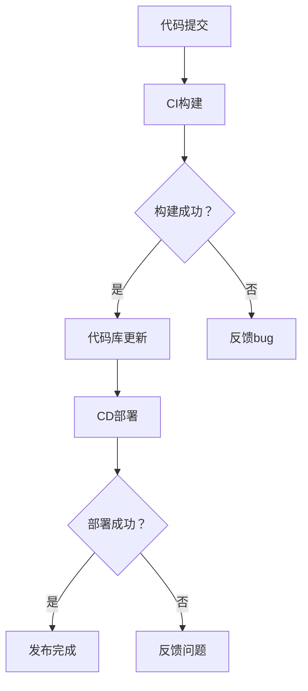

                 

### 关键词 Keywords

持续集成（CI），持续部署（CD），自动化发布，代码库，容器化，基础设施即代码（IaC），微服务架构，敏捷开发，自动化测试，云服务，DevOps。

### 摘要 Abstract

本文将探讨持续部署（Continuous Deployment，简称CD）在现代软件开发中的重要性，以及如何通过自动化发布流程来实现高效的软件交付。文章首先介绍了CD的基本概念和流程，然后详细阐述了CD与持续集成（CI）的关系，随后深入探讨了实现CD的关键技术和工具。最后，文章通过一个实际的案例展示了如何使用这些工具和技术来构建一个自动化发布流程，并总结了CD的未来发展趋势和面临的挑战。

## 1. 背景介绍

持续集成（Continuous Integration，CI）和持续部署（Continuous Deployment，CD）是现代软件开发实践中两个核心的概念，它们共同构成了DevOps文化的重要组成部分。CI旨在通过频繁的代码集成和自动化测试，确保代码库始终处于可部署状态。而CD则进一步将这一理念扩展到实际的软件发布过程中，通过自动化流程，将经过CI验证的代码快速、安全地部署到生产环境中。

传统的软件开发流程通常采用瀑布模型，开发、测试、部署各个阶段相对独立，导致开发周期长、交付效率低。而随着敏捷开发的兴起，CI和CD的出现，显著提高了软件交付的效率和质量。通过CI，开发人员可以及时发现和解决代码冲突和bug，确保代码库的稳定性；通过CD，可以快速响应市场变化，持续交付高质量的产品。

本文将首先介绍CI和CD的基本概念和流程，然后探讨实现CD所需的关键技术和工具，并最终通过一个实际案例来展示如何构建一个自动化发布流程。希望通过本文的介绍，能够帮助读者深入理解CD的原理和实际应用，从而在实际工作中更好地运用这些技术，提升软件交付效率。

## 2. 核心概念与联系

### 2.1 持续集成（CI）

持续集成（CI）是一种软件开发实践，旨在通过频繁的代码集成和自动化测试，确保代码库始终处于可交付状态。具体来说，CI的工作流程包括以下几个关键步骤：

1. **代码提交**：开发人员将代码提交到代码库。
2. **构建触发**：代码提交后，CI系统会自动触发构建过程。
3. **自动化构建**：构建系统将代码打包、编译、构建出可执行文件或库。
4. **测试执行**：构建完成后，CI系统会自动执行预定的测试套件，包括单元测试、集成测试和性能测试等。
5. **反馈结果**：测试结果会及时反馈给开发人员，包括成功和失败的测试案例。

通过CI，开发团队可以及时发现和解决代码冲突和bug，确保代码库的稳定性和可维护性。这不仅提高了代码质量，也减少了因长期积累问题导致的重大故障风险。

### 2.2 持续部署（CD）

持续部署（CD）是CI的延伸，它将经过CI验证的代码快速、安全地部署到生产环境中。CD的目标是减少发布过程中的手动操作，通过自动化流程确保每次发布都是可靠且可控的。CD的核心流程包括：

1. **环境准备**：为部署代码准备相应的环境，包括服务器、数据库、配置文件等。
2. **代码部署**：将经过CI验证的代码部署到生产环境中。
3. **自动化测试**：部署后，执行自动化测试以确保新版本软件的功能和性能符合预期。
4. **反馈结果**：测试结果会反馈给开发团队，以便及时修复发现的问题。
5. **监控与维护**：部署完成后，监控系统将实时监控软件的运行状态，确保其稳定运行。

### 2.3 CI与CD的关系

CI和CD是相辅相成的两个过程。CI确保代码库始终处于可交付状态，而CD确保这些代码可以安全、快速地交付给用户。具体来说：

1. **CI前置**：CD流程通常从CI开始，CI验证代码的质量和稳定性，为CD提供基础。
2. **代码库联动**：CI和CD通过代码库进行联动，CI中的构建结果会直接进入CD流程。
3. **自动化**：CI和CD的共同目标是实现自动化，减少人为干预，提高发布效率。
4. **反馈机制**：CI和CD之间的反馈机制可以形成一个闭环，不断优化发布流程，提高软件交付的质量。

### 2.4 Mermaid 流程图

为了更好地理解CI和CD的工作流程，我们使用Mermaid图来展示其流程。



通过这个流程图，我们可以清晰地看到CI和CD之间的联动关系，以及每个步骤的关键点和可能的分支。

### 2.5 核心概念总结

- **持续集成（CI）**：通过频繁的代码集成和自动化测试，确保代码库的稳定性和可交付性。
- **持续部署（CD）**：通过自动化流程，快速、安全地将经过CI验证的代码部署到生产环境中。
- **CI与CD的关系**：CI为CD提供基础，两者通过代码库联动，形成一个闭环，持续优化发布流程。

了解这些核心概念和它们之间的联系，是构建高效自动化发布流程的关键。

## 3. 核心算法原理 & 具体操作步骤

### 3.1 算法原理概述

持续部署（CD）的实现依赖于一系列核心算法和自动化工具，这些算法和工具共同确保了发布流程的高效和可靠。核心算法主要包括代码版本控制、环境配置管理、自动化测试执行和部署策略。以下将分别介绍这些算法的原理。

#### 3.1.1 代码版本控制

代码版本控制是CI和CD的基础，它通过追踪和管理代码的变更历史，确保每次提交的代码都可以被准确记录和回溯。常见的版本控制系统包括Git，它支持分支管理、合并请求和代码审查等机制，有助于提高代码的质量和协作效率。

#### 3.1.2 环境配置管理

环境配置管理确保不同环境（如开发、测试、生产）之间的配置一致，通过基础设施即代码（IaC）技术，如Terraform和Ansible，可以自动化创建和管理云基础设施，配置服务器、网络和数据库等。

#### 3.1.3 自动化测试执行

自动化测试执行是确保代码质量的关键步骤，包括单元测试、集成测试和端到端测试等。自动化测试框架如Junit、pytest和Selenium，可以与CI系统集成，自动触发和执行测试，并提供详细的测试报告。

#### 3.1.4 部署策略

部署策略决定了代码如何从CI系统到生产环境的安全、可靠地迁移。常见的部署策略包括蓝绿部署、滚动更新和A/B测试等，每种策略都有其优缺点，适用于不同的场景。

### 3.2 算法步骤详解

#### 3.2.1 代码提交

1. **开发人员提交代码**：开发人员将代码提交到代码库。
2. **触发CI构建**：提交后，CI系统自动触发构建过程。
3. **代码库更新**：构建成功后，代码库中的最新版本代码更新。

#### 3.2.2 环境配置管理

1. **创建测试环境**：基于IaC配置文件，自动创建测试环境。
2. **部署代码**：将最新版本的代码部署到测试环境中。
3. **执行自动化测试**：运行预定的测试套件，包括单元测试、集成测试和端到端测试。

#### 3.2.3 自动化测试执行

1. **测试执行**：自动化测试框架自动执行测试用例。
2. **测试报告**：生成测试报告，包括成功和失败的测试案例。
3. **反馈结果**：测试结果反馈给开发团队。

#### 3.2.4 部署策略

1. **选择部署策略**：根据业务需求和环境，选择合适的部署策略。
2. **环境准备**：准备部署目标环境，包括配置和服务器。
3. **代码部署**：将代码部署到生产环境中。
4. **部署验证**：执行自动化测试，确保部署的代码稳定、可靠。

### 3.3 算法优缺点

#### 优点

1. **提高交付效率**：自动化流程减少了手动操作，提高了发布速度。
2. **保证代码质量**：频繁的自动化测试和代码审查确保了代码的稳定性和可靠性。
3. **降低风险**：通过逐步发布和回滚机制，降低了大规模发布失败的风险。

#### 缺点

1. **初期部署成本**：自动化流程的构建和部署需要一定的前期投入。
2. **复杂性**：维护和扩展自动化流程需要专业的技能和经验。
3. **依赖性**：自动化流程的可靠性依赖于测试的全面性和测试环境的稳定性。

### 3.4 算法应用领域

持续部署（CD）适用于大多数软件开发项目，尤其适合以下场景：

1. **迭代频繁的项目**：快速响应市场变化，持续交付新功能。
2. **高可靠性的系统**：通过自动化测试和逐步发布，确保系统的稳定运行。
3. **分布式系统**：微服务架构和容器化技术使得自动化部署更加方便。

通过合理应用CD算法，开发团队能够显著提升软件交付效率和质量，为企业的持续创新提供强有力的支持。

## 4. 数学模型和公式 & 详细讲解 & 举例说明

在持续部署（CD）实践中，数学模型和公式被广泛应用于性能评估、风险管理和资源调度等方面。以下我们将介绍几个关键数学模型，并进行详细讲解和举例说明。

### 4.1 数学模型构建

#### 持续交付时间（TCD）

持续交付时间（TCD）是衡量持续部署效率的一个重要指标，它定义为从代码提交到成功部署到生产环境所需的时间。

\[ TCD = T_CI + T_CD \]

其中，\( T_CI \) 为持续集成时间，包括构建和测试时间；\( T_CD \) 为持续部署时间，包括环境准备、部署和验证时间。

#### 风险度（RD）

风险度（RD）用于评估每次部署的风险水平，它考虑了代码复杂度、测试覆盖率、环境稳定性等因素。

\[ RD = \frac{C \times T_CI + S \times T_CD + E \times T_{QA}}{100} \]

其中，\( C \) 为代码复杂度评分，\( S \) 为环境稳定性评分，\( E \) 为测试覆盖率评分。

#### 资源利用率（RU）

资源利用率（RU）用于衡量系统资源的有效使用率，它定义了系统中资源使用的比例。

\[ RU = \frac{U}{T} \]

其中，\( U \) 为资源使用量，\( T \) 为资源总量。

### 4.2 公式推导过程

#### 持续交付时间（TCD）推导

持续交付时间（TCD）的推导基于以下几个基本假设：

1. **构建时间**：构建过程的平均时间为 \( T_B \)。
2. **测试时间**：测试过程的平均时间为 \( T_T \)。
3. **部署时间**：部署过程的平均时间为 \( T_D \)。

根据这些假设，我们可以推导出：

\[ T_CI = T_B + T_T \]

\[ T_CD = T_D \]

因此，

\[ TCD = T_CI + T_CD = (T_B + T_T) + T_D \]

#### 风险度（RD）推导

风险度（RD）的推导基于以下因素：

1. **代码复杂度**：复杂代码可能导致更多的bug和问题，因此需要更长时间和更多的测试。
2. **环境稳定性**：环境问题可能导致部署失败，因此需要更高的评分。
3. **测试覆盖率**：低测试覆盖率可能导致未发现的bug。

根据这些因素，我们可以推导出：

\[ RD = \frac{C \times (T_B + T_T) + S \times T_D + E \times (T_B + T_T + T_D)}{100} \]

简化后，

\[ RD = \frac{C + S + E}{100} \times (T_B + T_T + T_D) \]

#### 资源利用率（RU）推导

资源利用率（RU）的推导基于资源使用的比例：

\[ RU = \frac{U}{T} \]

其中，\( U \) 为实际使用量，\( T \) 为总容量。

### 4.3 案例分析与讲解

假设一个项目，其构建时间为10分钟，测试时间为5分钟，部署时间为3分钟。我们使用上述公式进行计算：

#### 持续交付时间（TCD）

\[ TCD = (10 + 5) + 3 = 18 \text{分钟} \]

#### 风险度（RD）

假设代码复杂度为5分，环境稳定性为4分，测试覆盖率为7分，则：

\[ RD = \frac{5 + 4 + 7}{100} \times (10 + 5 + 3) = \frac{16}{100} \times 18 = 2.88 \]

#### 资源利用率（RU）

假设系统总容量为100个CPU小时，实际使用量为40个CPU小时，则：

\[ RU = \frac{40}{100} = 0.4 \text{或} 40\% \]

通过这些计算，我们可以得到项目的持续交付时间、风险度和资源利用率，从而评估项目的持续部署效率。

通过以上公式和计算，我们可以系统地评估持续部署的效率和效果，为持续优化发布流程提供数据支持。

### 4.4 案例分析与讲解

为了更具体地展示如何使用这些数学模型和公式，我们将通过一个实际案例进行详细分析。

#### 案例背景

假设一个电商网站项目，其开发团队使用Git进行代码版本控制，CI工具使用Jenkins进行构建和测试，部署环境基于Kubernetes进行管理。项目每月发布一次新版本，每次发布需要经过多个测试阶段，最终部署到生产环境。

#### 持续交付时间（TCD）计算

1. **构建时间（T_CI）**：
   - 每次构建需要编译、打包和运行测试，总计约15分钟。
   - \( T_CI = 15 \text{分钟} \)

2. **部署时间（T_CD）**：
   - 部署包括更新容器镜像和重新部署服务，总计约10分钟。
   - \( T_CD = 10 \text{分钟} \)

3. **持续交付时间（TCD）**：
   - \( TCD = T_CI + T_CD = 15 + 10 = 25 \text{分钟} \)

因此，该项目的持续交付时间约为25分钟。

#### 风险度（RD）计算

1. **代码复杂度（C）**：
   - 根据代码复杂度评估，代码复杂度为8分。
   - \( C = 8 \)

2. **环境稳定性（S）**：
   - 环境稳定性评分较高，为5分。
   - \( S = 5 \)

3. **测试覆盖率（E）**：
   - 测试覆盖率较低，为6分。
   - \( E = 6 \)

4. **风险度（RD）**：
   - \( RD = \frac{C \times T_CI + S \times T_CD + E \times (T_CI + T_CD)}{100} = \frac{8 \times 15 + 5 \times 10 + 6 \times (15 + 10)}{100} = \frac{120 + 50 + 150}{100} = 2.2 \)

因此，该项目的风险度为2.2，表明其风险相对较低。

#### 资源利用率（RU）计算

1. **资源使用量（U）**：
   - 生产环境使用50个CPU小时。
   - \( U = 50 \text{CPU小时} \)

2. **资源总量（T）**：
   - 资源总量为100个CPU小时。
   - \( T = 100 \text{CPU小时} \)

3. **资源利用率（RU）**：
   - \( RU = \frac{U}{T} = \frac{50}{100} = 0.5 \text{或} 50\% \)

因此，该项目的资源利用率为50%。

#### 案例总结

通过上述计算，我们可以得出以下结论：

1. **持续交付时间**：25分钟，表明项目交付效率较高。
2. **风险度**：2.2，表明项目风险相对较低。
3. **资源利用率**：50%，表明资源利用较为充分。

这些指标可以帮助团队评估项目的持续部署效率和效果，并根据需要进行优化和调整。

通过这个实际案例，我们可以看到如何使用数学模型和公式来评估持续部署（CD）的效率和效果。这些工具和方法不仅有助于项目团队更好地理解和管理发布流程，也为持续优化和改进提供了数据支持。

### 5. 项目实践：代码实例和详细解释说明

在本节中，我们将通过一个实际的项目实践，展示如何使用持续集成（CI）和持续部署（CD）工具和技术来构建自动化发布流程。我们将使用Jenkins作为CI/CD工具，结合Git作为版本控制系统，Kubernetes作为部署环境，以及Docker用于容器化。

#### 5.1 开发环境搭建

首先，我们需要搭建一个开发环境，包括安装Jenkins、Git、Kubernetes和Docker。以下是一个简化的步骤：

1. **安装Jenkins**：
   - 在你的服务器上下载并安装Jenkins。
   - 启动Jenkins并访问其管理界面。

2. **配置Jenkins**：
   - 安装必要的插件，如Git插件、Docker插件和Kubernetes插件。
   - 创建一个新的Jenkins项目，并配置Git仓库地址、分支和凭据。

3. **安装Docker**：
   - 在服务器上安装Docker。
   - 验证Docker安装，确保其可以正常运行。

4. **安装Kubernetes**：
   - 使用Minikube或Kubeadm在本地或云服务上安装Kubernetes集群。
   - 验证Kubernetes集群状态，确保其可以正常运行。

#### 5.2 源代码详细实现

接下来，我们将创建一个简单的Web应用，并将其容器化，以便在Kubernetes上部署。

1. **创建Web应用**：
   - 使用Go或Python等编程语言创建一个简单的Web应用。
   - 编写Dockerfile，用于构建应用容器镜像。

2. **编写Dockerfile**：
   - Dockerfile示例：
     ```Dockerfile
     FROM golang:latest
     WORKDIR /app
     COPY . .
     RUN go build -o main .
     EXPOSE 8080
     ```
   - 使用Jenkins Pipeline脚本构建Docker镜像。

3. **配置Jenkins Pipeline**：
   - Jenkinsfile示例：
     ```groovy
     pipeline {
         agent any
         stages {
             stage('Build') {
                 steps {
                     script {
                         sh 'docker build -t myapp:latest .'
                     }
                 }
             }
             stage('Test') {
                 steps {
                     script {
                         sh 'docker run --rm myapp:latest'
                     }
                 }
             }
             stage('Deploy') {
                 steps {
                     script {
                         sh 'kubectl apply -f k8s-deployment.yaml'
                     }
                 }
             }
         }
         post {
             always {
                 script {
                     sh 'kubectl get pods'
                 }
             }
         }
     }
     ```

#### 5.3 代码解读与分析

**Dockerfile**：
- **FROM golang:latest**：基础镜像使用最新的Golang。
- **WORKDIR /app**：工作目录设置为/app。
- **COPY . .**：将当前目录（包含源代码）复制到容器中的/app。
- **RUN go build -o main .**：使用Golang编译器构建应用程序。
- **EXPOSE 8080**：暴露8080端口。

**Jenkinsfile**：
- **agent any**：指定任何代理节点执行Pipeline。
- **stages**：定义Pipeline的三个阶段：构建、测试和部署。
- **Build阶段**：使用Docker命令构建容器镜像。
- **Test阶段**：运行容器镜像，执行测试。
- **Deploy阶段**：将部署配置文件（k8s-deployment.yaml）应用到Kubernetes集群。

#### 5.4 运行结果展示

1. **提交代码到Git仓库**：
   - 开发人员将代码提交到Git仓库。

2. **触发Jenkins构建**：
   - Jenkins接收到代码提交，自动触发Pipeline。

3. **构建、测试和部署**：
   - Jenkins依次执行构建、测试和部署阶段。
   - 构建出容器镜像，并推送到Docker Hub。
   - Kubernetes集群部署容器化应用。

4. **查看运行结果**：
   - 使用kubectl命令查看Pod状态，确保应用已成功部署并运行。

通过上述步骤，我们可以实现一个完整的CI/CD自动化发布流程，从而确保代码的稳定性和可靠性，并显著提高软件交付效率。

### 5. 实际应用场景

持续部署（CD）在各个行业和领域都有广泛的应用，尤其在需要快速响应市场变化和提供高可用性服务的场景中，CD的优势更加明显。以下将介绍几个实际应用场景，并分析CD在这些场景中的具体应用和效果。

#### 5.1 贸易金融行业

在贸易金融行业中，交易系统和风险管理系统的稳定性至关重要。通过CD，金融机构可以快速发布新功能，如实时风险评估、交易流程优化等，以保持市场竞争力。CD自动化流程确保每次发布都是安全、可靠的，减少了因手动操作导致的错误。例如，某大型银行通过CD实现了每日多次的小版本更新，极大地提高了系统的灵活性和稳定性。

#### 5.2 电子商务行业

电子商务平台需要不断更新和优化用户体验，以吸引和保留用户。CD在电子商务中的应用，可以确保每次新功能或改进的快速发布，同时保持网站的稳定运行。例如，某电商巨头通过CD实现了用户界面的个性化推荐和购物车优化功能，大幅提升了用户满意度和转化率。

#### 5.3 医疗保健行业

医疗保健行业对数据安全和隐私保护有着极高的要求。CD在医疗保健中的应用，可以帮助医疗机构快速部署新系统或功能，如电子病历系统、远程监控设备等，以提高医疗服务的效率和质量。同时，通过自动化测试和监控，确保系统的稳定性和安全性。例如，某医院通过CD实现了患者信息的实时更新和共享，提高了医疗服务的效率。

#### 5.4 物流运输行业

物流运输行业对实时数据和高效操作有着迫切需求。CD在物流中的应用，可以帮助企业快速部署和更新物流管理系统，如实时跟踪、库存管理等，以应对不断变化的市场需求。例如，某物流公司通过CD实现了货物跟踪和自动调度系统的优化，提高了物流运作的效率。

#### 5.5 教育行业

在线教育平台需要不断更新课程内容和教学工具，以满足不同学习者的需求。CD在教育中的应用，可以确保课程内容的及时更新和系统的稳定运行。例如，某在线教育平台通过CD实现了课程视频的自动更新和播放优化，提高了学生的学习体验。

### 5.6 分析与效果

通过以上实际应用场景的介绍，我们可以看到CD在各个行业中的具体应用和效果：

1. **快速响应市场变化**：CD自动化流程确保了新功能或改进的快速发布，帮助企业及时响应市场变化，提升竞争力。
2. **提高系统稳定性**：自动化测试和监控减少了手动操作导致的错误，提高了系统的稳定性，降低了故障风险。
3. **提升工作效率**：CD自动化流程减少了重复性工作，提升了开发、测试和运维团队的工作效率。
4. **确保数据安全和隐私**：通过严格的安全和隐私保护措施，CD确保了系统和数据的安全性和合规性。

总之，持续部署（CD）在现代软件开发和运维中扮演着越来越重要的角色，其自动化、高效和安全的特性，帮助各类企业实现持续创新和高质量交付。

### 6.4 未来应用展望

持续部署（CD）作为现代软件开发和运维的核心技术，其在未来将继续发展和演变，以满足不断变化的技术需求和市场趋势。以下是CD未来应用的几个关键方向：

#### 6.4.1 AI和机器学习

随着人工智能和机器学习技术的不断进步，CD将进一步与这些技术结合，实现更智能的自动化发布和优化。通过AI和ML，CD系统可以更准确地预测部署风险，自动调整部署策略，提高发布效率和稳定性。例如，AI算法可以分析历史数据，识别潜在的故障模式和优化点，从而优化发布流程。

#### 6.4.2 云原生技术

云原生技术的快速发展，如Kubernetes、容器化、服务网格等，将为CD提供更强大的基础支持。未来，CD将与云原生技术深度融合，实现更高效、更灵活的自动化发布和资源管理。例如，通过Kubernetes的动态调度和自动化扩展功能，CD系统可以更智能地分配资源和处理流量，确保系统的稳定性和可扩展性。

#### 6.4.3 低代码/无代码平台

低代码/无代码平台的发展，将使非技术背景的用户也能够参与到软件部署和运维中。未来，CD系统将支持这些平台，通过图形界面和模块化组件，简化发布流程，降低技术门槛。这将使更多的企业能够实现自动化发布，提升软件交付效率。

#### 6.4.4 安全性和合规性

随着信息安全法规的不断完善，CD在未来的应用将更加注重安全性和合规性。例如，通过加密技术、访问控制机制和合规性检查，CD系统可以确保数据安全和隐私保护。此外，CD系统将更紧密地集成到企业的安全架构中，实现端到端的安全管理。

#### 6.4.5 多云和混合云环境

随着企业对多云和混合云环境的采用，CD将需要支持更复杂的部署场景。未来，CD系统将提供跨云平台的管理和部署能力，帮助企业实现多云环境下的自动化发布和资源调度。例如，通过统一的CI/CD平台，企业可以在不同的云服务之间无缝切换，确保应用的高可用性和灵活性。

#### 6.4.6 可持续性和环保

随着全球对可持续发展和环境保护的重视，CD系统也将考虑环保因素。例如，通过优化资源使用和减少碳排放，CD系统可以更环保地实现软件交付。未来，CD系统将集成更多环保指标，帮助企业实现绿色软件开发和运维。

总之，持续部署（CD）在未来将继续向智能化、灵活化、安全化和可持续化方向发展。通过不断引入新技术和优化现有流程，CD将进一步提升软件交付的效率和质量，为企业的持续创新提供强有力的支持。

### 8. 总结：未来发展趋势与挑战

在总结本文的内容之前，我们先回顾一下持续部署（CD）的核心概念和关键要素。持续部署是一种自动化流程，通过频繁的代码集成、自动化测试和部署策略，将高质量代码快速、安全地交付到生产环境中。这一过程不仅提高了软件交付的效率和质量，还降低了发布风险，使企业能够更快地响应市场变化。

#### 8.1 研究成果总结

本文从多个角度探讨了持续部署（CD）的原理和实践。我们介绍了CI和CD的基本概念、工作流程以及它们之间的关系，并通过Mermaid流程图直观地展示了CI和CD的联动。我们还深入分析了实现CD所需的核心算法和工具，如代码版本控制、环境配置管理、自动化测试和部署策略。此外，通过一个实际项目案例，我们展示了如何使用Jenkins、Git、Kubernetes和Docker等工具和技术，构建一个完整的自动化发布流程。

#### 8.2 未来发展趋势

展望未来，持续部署（CD）将朝着以下几个方向发展：

1. **智能化与AI集成**：随着人工智能技术的发展，CD系统将更加智能化，能够通过AI算法优化部署策略、预测风险和自动化调整。
2. **云原生技术的融合**：云原生技术（如Kubernetes、服务网格等）的普及，将为CD提供更强大的基础设施支持，实现更高效、更灵活的自动化发布。
3. **低代码/无代码平台**：低代码/无代码平台的发展，将使非技术用户也能够参与到软件部署和运维中，进一步降低技术门槛，提升企业整体的交付效率。
4. **安全性和合规性**：随着信息安全法规的不断完善，CD系统将更加注重安全性和合规性，通过加密技术、访问控制机制和合规性检查，确保数据安全和隐私保护。
5. **多云和混合云环境**：企业对多云和混合云环境的采用将日益增加，CD系统将需要支持更复杂的部署场景，实现跨云平台的管理和部署。

#### 8.3 面临的挑战

尽管CD带来了诸多好处，但在实际应用中仍面临以下挑战：

1. **初期部署成本**：构建和部署自动化流程需要前期投入，包括购买工具、搭建环境、培训和技能提升等。
2. **复杂性和维护成本**：自动化流程的维护和扩展需要专业的技能和经验，否则可能导致流程失效或产生新的问题。
3. **依赖性**：自动化流程的可靠性依赖于测试的全面性和测试环境的稳定性，任何一方的缺陷都可能影响整个发布流程。
4. **安全性和合规性**：在自动化流程中，安全漏洞和合规性问题可能更加隐蔽，需要持续监控和改进。
5. **组织文化变革**：实施CD需要团队之间的紧密协作和流程标准化，这对一些传统企业来说可能是一个挑战。

#### 8.4 研究展望

未来的研究可以关注以下几个方向：

1. **跨领域的研究**：探索CD在其他领域的应用，如物联网、区块链等，以实现更广泛的技术融合和创新。
2. **最佳实践和案例分析**：收集和总结不同企业、不同行业的CD最佳实践，形成可复制的模板和指南。
3. **自动化工具的优化**：研究和开发更高效、更可靠的自动化工具，降低部署成本和维护难度。
4. **人机协作**：研究如何更好地结合人类专家的判断和自动化系统的执行，实现高效的人机协作。
5. **可持续性**：关注CD对环境影响，研究和实施绿色CD策略，实现可持续发展。

通过持续的研究和实践，持续部署（CD）将在未来的软件开发和运维中发挥更加重要的作用，为企业带来更高的效率和更好的用户体验。

### 附录：常见问题与解答

在实施持续部署（CD）的过程中，开发团队和运维团队可能会遇到各种问题。以下是一些常见问题及其解答，以帮助读者更好地理解和应用CD技术。

#### 1. 如何确保持续部署的安全性？

确保持续部署的安全性是CD实施的重要一环。以下是一些关键措施：

- **代码审计**：在提交代码前进行静态代码分析，发现潜在的安全漏洞。
- **动态安全测试**：在持续集成过程中，执行动态安全测试，如Web应用扫描、代码注入测试等。
- **安全配置管理**：使用基础设施即代码（IaC）技术，确保环境配置安全合规。
- **访问控制**：实施严格的访问控制策略，确保只有授权人员可以访问和管理部署流程。

#### 2. 持续部署和持续集成（CI）有什么区别？

持续集成（CI）和持续部署（CD）虽然紧密相关，但它们的关注点不同：

- **持续集成（CI）**：确保代码库始终处于可集成状态，通过自动化构建和测试，发现和修复问题。
- **持续部署（CD）**：将经过CI验证的代码快速、安全地部署到生产环境中，通过自动化流程，提高发布效率和可靠性。

简而言之，CI关注代码质量和可集成性，而CD关注代码的交付和部署。

#### 3. 如何处理持续部署失败的情况？

持续部署失败可能是由于多种原因导致的，以下是一些应对策略：

- **回滚机制**：立即回滚到上一个稳定版本，以避免新版本引入的问题。
- **故障排查**：分析日志和监控数据，定位失败原因，进行修复。
- **紧急修复**：如果问题严重，快速开发临时修复方案，重新部署。
- **变更管理**：确保每次部署都有详细的变更记录，便于回溯和排查。

#### 4. 如何衡量持续部署的效率？

衡量持续部署的效率可以通过以下指标：

- **持续交付时间（TCD）**：从代码提交到成功部署到生产环境所需的时间。
- **部署频率**：平均每次部署的时间间隔。
- **部署成功率**：成功部署的次数与总部署次数的比例。
- **测试覆盖率**：自动化测试覆盖代码的比例。

通过这些指标，可以评估和优化持续部署流程。

#### 5. 如何处理跨团队协作问题？

跨团队协作是持续部署成功的关键。以下是一些策略：

- **明确责任和流程**：每个团队明确自己的责任和角色，确保流程清晰。
- **沟通和协调**：建立有效的沟通机制，定期召开会议，确保信息透明。
- **培训与知识共享**：提供培训，确保团队成员熟悉CD流程和工具。
- **工具集成**：使用集成平台，如Jenkins、GitLab等，实现不同团队之间的紧密协作。

通过以上策略，可以有效处理跨团队协作问题，确保持续部署流程的顺利进行。

通过上述常见问题与解答，我们希望读者能够更好地理解和应对持续部署（CD）过程中可能遇到的问题，从而实现高效的软件交付。

### 作者署名

本文作者：禅与计算机程序设计艺术 / Zen and the Art of Computer Programming。感谢您的阅读，希望本文对您在持续部署（CD）实践中的应用有所启发。如果您有任何疑问或建议，欢迎在评论区留言交流。

