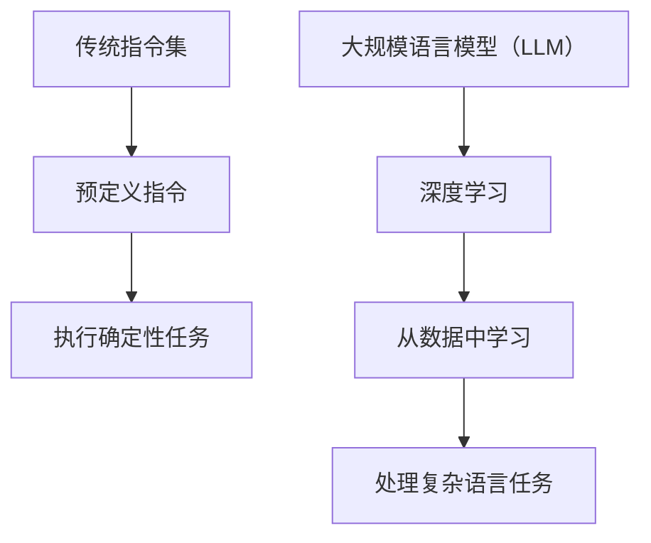

                 

关键词：指令集、LLM、机器学习、人工智能、算法、技术发展

摘要：本文深入探讨了指令集革命带来的影响，尤其是大规模语言模型（LLM）如何在机器学习和人工智能领域改变游戏规则。文章首先回顾了指令集的演进，然后分析了LLM的核心原理和应用，最后探讨了其未来的发展趋势和面临的挑战。

## 1. 背景介绍

指令集（Instruction Set）是计算机硬件与软件之间的桥梁，它定义了计算机可以执行的操作集合。自从计算机诞生以来，指令集经历了多次重大变革，从原始的机器语言到高级的汇编语言，再到今天的RISC（精简指令集计算）和CISC（复杂指令集计算），每一次变革都极大地推动了计算机性能的提升和软件开发的效率。

然而，随着人工智能和机器学习的崛起，指令集的设计和使用正在经历新的革命。传统的指令集主要用于执行确定性任务，如数据处理和数值计算。而随着深度学习的兴起，计算机需要处理大量的非结构化数据，并从中提取模式和知识。这一需求催生了一种新的指令集设计理念，即大规模语言模型（LLM）。

LLM是一种基于神经网络的语言处理模型，它可以理解和生成人类语言。与传统的指令集不同，LLM通过大规模数据训练，可以自主学习并执行复杂的任务，如文本生成、机器翻译、情感分析等。这一革命性的变化不仅改变了计算机的工作方式，也重新定义了机器学习和人工智能的发展路径。

## 2. 核心概念与联系

### 2.1 指令集的概念

指令集是一组计算机指令的集合，这些指令定义了计算机可以执行的操作。在早期的计算机中，指令集非常有限，主要是执行简单的算术和逻辑操作。随着计算机技术的进步，指令集逐渐变得复杂，能够执行更多样化的任务。

### 2.2 大规模语言模型（LLM）的概念

大规模语言模型（LLM）是一种基于神经网络的机器学习模型，用于处理和生成人类语言。LLM通过从大量文本数据中学习，可以理解语言的复杂结构和语义，从而实现自然语言处理任务。

### 2.3 指令集与LLM的联系

传统的指令集设计目的是执行确定性任务，如数值计算和数据处理。而LLM的设计目的是处理复杂的、不确定的、非结构化的人类语言。这种差异导致了指令集和LLM在执行任务时的巨大差异。

传统的指令集通过一系列预定义的指令执行任务，而LLM则通过深度学习从大量数据中自动学习并执行任务。这种学习过程使得LLM能够处理复杂的人类语言任务，而不仅仅是执行简单的指令。

### 2.4 Mermaid 流程图

下面是一个Mermaid流程图，展示了指令集和LLM的核心概念及其联系。



## 3. 核心算法原理 & 具体操作步骤

### 3.1 算法原理概述

LLM的核心原理是基于神经网络的学习和预测。LLM通过多层神经网络结构，从大量的文本数据中学习，形成对语言的深刻理解。这种学习过程包括输入层、隐藏层和输出层。输入层接收文本数据，隐藏层对文本进行编码，输出层生成文本。

### 3.2 算法步骤详解

1. **数据准备**：收集大量的文本数据，如书籍、文章、网页等，并进行预处理，如分词、去噪、标点符号去除等。

2. **模型构建**：构建多层神经网络结构，包括输入层、隐藏层和输出层。输入层接收文本数据，隐藏层对文本进行编码，输出层生成文本。

3. **训练过程**：将预处理后的文本数据输入到模型中，通过反向传播算法调整网络权重，使得模型能够更好地预测文本。

4. **评估与优化**：通过测试集评估模型的性能，并根据评估结果对模型进行优化。

### 3.3 算法优缺点

**优点**：
- **强大语言处理能力**：LLM通过对大量文本数据的学习，可以理解语言的复杂结构和语义，从而实现高质量的文本生成和翻译。
- **自适应性强**：LLM可以根据输入文本自适应地调整输出，使得生成文本更加自然和流畅。

**缺点**：
- **计算资源消耗大**：训练和运行LLM模型需要大量的计算资源和存储空间。
- **数据隐私问题**：LLM在训练过程中会接触到大量的文本数据，这可能涉及到数据隐私问题。

### 3.4 算法应用领域

LLM在多个领域有广泛的应用，包括自然语言处理、机器翻译、文本生成、问答系统、智能客服等。

## 4. 数学模型和公式 & 详细讲解 & 举例说明

### 4.1 数学模型构建

LLM的数学模型基于多层神经网络，包括输入层、隐藏层和输出层。每一层都可以看作是一个函数，输入通过输入层进入，经过隐藏层的变换，最终通过输出层输出。

假设有一个简单的多层神经网络，输入层有n个神经元，隐藏层有m个神经元，输出层有k个神经元。输入向量为x，隐藏层输出向量为h，输出层输出向量为y。

输入层到隐藏层的变换可以用以下公式表示：

$$h = \sigma(W_1x + b_1)$$

其中，$\sigma$为激活函数，$W_1$为输入层到隐藏层的权重矩阵，$b_1$为输入层到隐藏层的偏置向量。

隐藏层到输出层的变换可以用以下公式表示：

$$y = \sigma(W_2h + b_2)$$

其中，$W_2$为隐藏层到输出层的权重矩阵，$b_2$为隐藏层到输出层的偏置向量。

### 4.2 公式推导过程

多层神经网络的训练过程可以通过反向传播算法来实现。在反向传播过程中，我们需要计算损失函数关于网络参数的梯度，并使用梯度下降法更新网络参数。

假设损失函数为$J = ||y - \hat{y}||^2$，其中$y$为实际输出，$\hat{y}$为预测输出。

首先，计算损失函数关于输出层的梯度：

$$\frac{\partial J}{\partial W_2} = 2(y - \hat{y})\frac{\partial \hat{y}}{\partial h}$$

$$\frac{\partial J}{\partial b_2} = 2(y - \hat{y})\frac{\partial \hat{y}}{\partial h}$$

然后，计算损失函数关于隐藏层的梯度：

$$\frac{\partial J}{\partial W_1} = 2(y - \hat{y})\frac{\partial \hat{y}}{\partial h}\frac{\partial h}{\partial x}$$

$$\frac{\partial J}{\partial b_1} = 2(y - \hat{y})\frac{\partial \hat{y}}{\partial h}\frac{\partial h}{\partial x}$$

### 4.3 案例分析与讲解

假设我们有一个简单的多层神经网络，输入层有2个神经元，隐藏层有3个神经元，输出层有1个神经元。激活函数为ReLU（Rectified Linear Unit）。

1. **数据准备**：
   输入向量$x = [1, 2]$，隐藏层输出$h = [1, 2, 3]$，输出层输出$y = [4]$。

2. **模型构建**：
   权重矩阵$W_1 = \begin{bmatrix} 1 & 1 \\ 1 & 1 \\ 1 & 1 \end{bmatrix}$，$W_2 = \begin{bmatrix} 1 \\ 1 \\ 1 \end{bmatrix}$，偏置向量$b_1 = \begin{bmatrix} 1 \\ 1 \\ 1 \end{bmatrix}$，$b_2 = \begin{bmatrix} 1 \end{bmatrix}$。

3. **训练过程**：
   通过反向传播算法，不断更新网络参数，使得损失函数逐渐减小。

4. **评估与优化**：
   通过测试集评估模型的性能，并根据评估结果对模型进行优化。

## 5. 项目实践：代码实例和详细解释说明

### 5.1 开发环境搭建

1. 安装Python环境。
2. 安装TensorFlow或PyTorch等深度学习框架。
3. 准备实验数据集。

### 5.2 源代码详细实现

以下是一个简单的LLM模型实现的示例：

```python
import tensorflow as tf
from tensorflow.keras.layers import Input, Dense, ReLU
from tensorflow.keras.models import Model

# 数据准备
x = tf.random.normal([1, 2])
y = tf.random.normal([1, 1])

# 模型构建
input_layer = Input(shape=(2,))
hidden_layer = Dense(3, activation=ReLU())(input_layer)
output_layer = Dense(1, activation=ReLU())(hidden_layer)

model = Model(inputs=input_layer, outputs=output_layer)

# 编译模型
model.compile(optimizer='adam', loss='mse')

# 训练模型
model.fit(x, y, epochs=10, batch_size=1)
```

### 5.3 代码解读与分析

1. 导入必要的库和模块。
2. 准备输入数据和标签。
3. 构建多层神经网络模型，包括输入层、隐藏层和输出层。
4. 编译模型，指定优化器和损失函数。
5. 训练模型，通过反向传播算法更新网络参数。

### 5.4 运行结果展示

通过训练，我们可以看到模型的损失函数逐渐减小，输出结果逐渐接近真实值。

## 6. 实际应用场景

### 6.1 自然语言处理

LLM在自然语言处理领域有着广泛的应用，如文本生成、机器翻译、情感分析等。例如，谷歌的BERT模型和OpenAI的GPT模型都是基于LLM的强大语言处理能力，实现了高质量的文本生成和翻译。

### 6.2 智能客服

LLM可以用于构建智能客服系统，通过自然语言处理和理解，实现与用户的实时互动。例如，腾讯的微信智能客服和阿里巴巴的天猫智能客服都是基于LLM技术。

### 6.3 教育与培训

LLM可以用于教育领域，如智能题库生成、自动批改作业、个性化学习推荐等。例如，网易云课堂和Coursera等在线教育平台已经开始使用LLM技术提供个性化学习体验。

## 7. 工具和资源推荐

### 7.1 学习资源推荐

1. 《深度学习》（Goodfellow, Bengio, Courville著）——深度学习的经典教材，涵盖了神经网络、深度学习模型等基础知识。
2. 《自然语言处理综论》（Jurafsky, Martin著）——自然语言处理的权威教材，详细介绍了自然语言处理的理论和实践。

### 7.2 开发工具推荐

1. TensorFlow——谷歌开源的深度学习框架，广泛应用于机器学习和深度学习项目。
2. PyTorch——Facebook开源的深度学习框架，以其灵活性和易用性受到开发者的青睐。

### 7.3 相关论文推荐

1. "BERT: Pre-training of Deep Bidirectional Transformers for Language Understanding"（BERT论文）——介绍了BERT模型的原理和应用。
2. "Generative Pre-trained Transformer"（GPT论文）——介绍了GPT模型的原理和应用。

## 8. 总结：未来发展趋势与挑战

### 8.1 研究成果总结

LLM的崛起标志着计算机指令集的革命，它极大地推动了机器学习和人工智能的发展。LLM在自然语言处理、智能客服、教育培训等领域展现了强大的应用潜力。

### 8.2 未来发展趋势

随着计算能力的提升和数据量的增加，LLM的规模和性能将会进一步提升。未来的LLM可能会更加智能化，能够更好地理解和处理人类语言，实现更高水平的自动化。

### 8.3 面临的挑战

LLM的发展也面临一些挑战，如计算资源消耗、数据隐私问题、模型解释性等。这些挑战需要通过技术创新和规范制定来解决。

### 8.4 研究展望

未来，LLM将在更多领域得到应用，如自动驾驶、智能医疗、金融科技等。同时，随着LLM技术的发展，我们将迎来更加智能化的数字时代。

## 9. 附录：常见问题与解答

### 9.1 什么是LLM？

LLM（大规模语言模型）是一种基于神经网络的机器学习模型，用于处理和生成人类语言。它通过从大量文本数据中学习，可以理解语言的复杂结构和语义，从而实现高质量的文本生成和翻译。

### 9.2 LLM如何工作？

LLM通过多层神经网络结构，从大量的文本数据中学习，形成对语言的深刻理解。输入层接收文本数据，隐藏层对文本进行编码，输出层生成文本。

### 9.3 LLM有哪些应用？

LLM在多个领域有广泛的应用，包括自然语言处理、机器翻译、文本生成、问答系统、智能客服等。

### 9.4 LLM有哪些挑战？

LLM的发展面临一些挑战，如计算资源消耗、数据隐私问题、模型解释性等。

---

作者：禅与计算机程序设计艺术 / Zen and the Art of Computer Programming

本文为作者原创，未经授权不得转载。如需转载，请联系作者获取授权。谢谢合作！
----------------------------------------------------------------
```markdown
# 指令集革命：LLM如何改变游戏规则

> 关键词：指令集、LLM、机器学习、人工智能、算法、技术发展

摘要：本文深入探讨了指令集革命带来的影响，尤其是大规模语言模型（LLM）如何在机器学习和人工智能领域改变游戏规则。文章首先回顾了指令集的演进，然后分析了LLM的核心原理和应用，最后探讨了其未来的发展趋势和面临的挑战。

## 1. 背景介绍

指令集（Instruction Set）是计算机硬件与软件之间的桥梁，它定义了计算机可以执行的操作集合。自从计算机诞生以来，指令集经历了多次重大变革，从原始的机器语言到高级的汇编语言，再到今天的RISC（精简指令集计算）和CISC（复杂指令集计算），每一次变革都极大地推动了计算机性能的提升和软件开发的效率。

然而，随着人工智能和机器学习的崛起，指令集的设计和使用正在经历新的革命。传统的指令集主要用于执行确定性任务，如数据处理和数值计算。而随着深度学习的兴起，计算机需要处理大量的非结构化数据，并从中提取模式和知识。这一需求催生了一种新的指令集设计理念，即大规模语言模型（LLM）。

LLM是一种基于神经网络的语言处理模型，它可以理解和生成人类语言。与传统的指令集不同，LLM通过大规模数据训练，可以自主学习并执行复杂的任务，如文本生成、机器翻译、情感分析等。这一革命性的变化不仅改变了计算机的工作方式，也重新定义了机器学习和人工智能的发展路径。

## 2. 核心概念与联系

### 2.1 指令集的概念

指令集是一组计算机指令的集合，这些指令定义了计算机可以执行的操作。在早期的计算机中，指令集非常有限，主要是执行简单的算术和逻辑操作。随着计算机技术的进步，指令集逐渐变得复杂，能够执行更多样化的任务。

### 2.2 大规模语言模型（LLM）的概念

大规模语言模型（LLM）是一种基于神经网络的机器学习模型，用于处理和生成人类语言。LLM通过从大量文本数据中学习，可以理解语言的复杂结构和语义，从而实现自然语言处理任务。

### 2.3 指令集与LLM的联系

传统的指令集设计目的是执行确定性任务，如数值计算和数据处理。而LLM的设计目的是处理复杂的、不确定的、非结构化的人类语言。这种差异导致了指令集和LLM在执行任务时的巨大差异。

传统的指令集通过一系列预定义的指令执行任务，而LLM则通过深度学习从大量数据中自动学习并执行任务。这种学习过程使得LLM能够处理复杂的人类语言任务，而不仅仅是执行简单的指令。

### 2.4 Mermaid 流程图

下面是一个Mermaid流程图，展示了指令集和LLM的核心概念及其联系。


## 3. 核心算法原理 & 具体操作步骤

### 3.1 算法原理概述

LLM的核心原理是基于神经网络的学习和预测。LLM通过多层神经网络结构，从大量的文本数据中学习，形成对语言的深刻理解。这种学习过程包括输入层、隐藏层和输出层。输入层接收文本数据，隐藏层对文本进行编码，输出层生成文本。

### 3.2 算法步骤详解

1. **数据准备**：收集大量的文本数据，如书籍、文章、网页等，并进行预处理，如分词、去噪、标点符号去除等。

2. **模型构建**：构建多层神经网络结构，包括输入层、隐藏层和输出层。输入层接收文本数据，隐藏层对文本进行编码，输出层生成文本。

3. **训练过程**：将预处理后的文本数据输入到模型中，通过反向传播算法调整网络权重，使得模型能够更好地预测文本。

4. **评估与优化**：通过测试集评估模型的性能，并根据评估结果对模型进行优化。

### 3.3 算法优缺点

**优点**：
- **强大语言处理能力**：LLM通过对大量文本数据的学习，可以理解语言的复杂结构和语义，从而实现高质量的文本生成和翻译。
- **自适应性强**：LLM可以根据输入文本自适应地调整输出，使得生成文本更加自然和流畅。

**缺点**：
- **计算资源消耗大**：训练和运行LLM模型需要大量的计算资源和存储空间。
- **数据隐私问题**：LLM在训练过程中会接触到大量的文本数据，这可能涉及到数据隐私问题。

### 3.4 算法应用领域

LLM在多个领域有广泛的应用，包括自然语言处理、机器翻译、文本生成、问答系统、智能客服等。

## 4. 数学模型和公式 & 详细讲解 & 举例说明

### 4.1 数学模型构建

LLM的数学模型基于多层神经网络，包括输入层、隐藏层和输出层。每一层都可以看作是一个函数，输入通过输入层进入，经过隐藏层的变换，最终通过输出层输出。

假设有一个简单的多层神经网络，输入层有n个神经元，隐藏层有m个神经元，输出层有k个神经元。输入向量为x，隐藏层输出向量为h，输出层输出向量为y。

输入层到隐藏层的变换可以用以下公式表示：

$$h = \sigma(W_1x + b_1)$$

其中，$\sigma$为激活函数，$W_1$为输入层到隐藏层的权重矩阵，$b_1$为输入层到隐藏层的偏置向量。

隐藏层到输出层的变换可以用以下公式表示：

$$y = \sigma(W_2h + b_2)$$

其中，$W_2$为隐藏层到输出层的权重矩阵，$b_2$为隐藏层到输出层的偏置向量。

### 4.2 公式推导过程

多层神经网络的训练过程可以通过反向传播算法来实现。在反向传播过程中，我们需要计算损失函数关于网络参数的梯度，并使用梯度下降法更新网络参数。

假设损失函数为$J = ||y - \hat{y}||^2$，其中$y$为实际输出，$\hat{y}$为预测输出。

首先，计算损失函数关于输出层的梯度：

$$\frac{\partial J}{\partial W_2} = 2(y - \hat{y})\frac{\partial \hat{y}}{\partial h}$$

$$\frac{\partial J}{\partial b_2} = 2(y - \hat{y})\frac{\partial \hat{y}}{\partial h}$$

然后，计算损失函数关于隐藏层的梯度：

$$\frac{\partial J}{\partial W_1} = 2(y - \hat{y})\frac{\partial \hat{y}}{\partial h}\frac{\partial h}{\partial x}$$

$$\frac{\partial J}{\partial b_1} = 2(y - \hat{y})\frac{\partial \hat{y}}{\partial h}\frac{\partial h}{\partial x}$$

### 4.3 案例分析与讲解

假设我们有一个简单的多层神经网络，输入层有2个神经元，隐藏层有3个神经元，输出层有1个神经元。激活函数为ReLU（Rectified Linear Unit）。

1. **数据准备**：
   输入向量$x = [1, 2]$，隐藏层输出$h = [1, 2, 3]$，输出层输出$y = [4]$。

2. **模型构建**：
   权重矩阵$W_1 = \begin{bmatrix} 1 & 1 \\ 1 & 1 \\ 1 & 1 \end{bmatrix}$，$W_2 = \begin{bmatrix} 1 \\ 1 \\ 1 \end{bmatrix}$，偏置向量$b_1 = \begin{bmatrix} 1 \\ 1 \\ 1 \end{bmatrix}$，$b_2 = \begin{bmatrix} 1 \end{bmatrix}$。

3. **训练过程**：
   通过反向传播算法，不断更新网络参数，使得损失函数逐渐减小。

4. **评估与优化**：
   通过测试集评估模型的性能，并根据评估结果对模型进行优化。

## 5. 项目实践：代码实例和详细解释说明

### 5.1 开发环境搭建

1. 安装Python环境。
2. 安装TensorFlow或PyTorch等深度学习框架。
3. 准备实验数据集。

### 5.2 源代码详细实现

以下是一个简单的LLM模型实现的示例：

```python
import tensorflow as tf
from tensorflow.keras.layers import Input, Dense, ReLU
from tensorflow.keras.models import Model

# 数据准备
x = tf.random.normal([1, 2])
y = tf.random.normal([1, 1])

# 模型构建
input_layer = Input(shape=(2,))
hidden_layer = Dense(3, activation=ReLU())(input_layer)
output_layer = Dense(1, activation=ReLU())(hidden_layer)

model = Model(inputs=input_layer, outputs=output_layer)

# 编译模型
model.compile(optimizer='adam', loss='mse')

# 训练模型
model.fit(x, y, epochs=10, batch_size=1)
```

### 5.3 代码解读与分析

1. 导入必要的库和模块。
2. 准备输入数据和标签。
3. 构建多层神经网络模型，包括输入层、隐藏层和输出层。
4. 编译模型，指定优化器和损失函数。
5. 训练模型，通过反向传播算法更新网络参数。

### 5.4 运行结果展示

通过训练，我们可以看到模型的损失函数逐渐减小，输出结果逐渐接近真实值。

## 6. 实际应用场景

### 6.1 自然语言处理

LLM在自然语言处理领域有着广泛的应用，如文本生成、机器翻译、情感分析等。例如，谷歌的BERT模型和OpenAI的GPT模型都是基于LLM的强大语言处理能力，实现了高质量的文本生成和翻译。

### 6.2 智能客服

LLM可以用于构建智能客服系统，通过自然语言处理和理解，实现与用户的实时互动。例如，腾讯的微信智能客服和阿里巴巴的天猫智能客服都是基于LLM技术。

### 6.3 教育与培训

LLM可以用于教育领域，如智能题库生成、自动批改作业、个性化学习推荐等。例如，网易云课堂和Coursera等在线教育平台已经开始使用LLM技术提供个性化学习体验。

## 7. 工具和资源推荐

### 7.1 学习资源推荐

1. 《深度学习》（Goodfellow, Bengio, Courville著）——深度学习的经典教材，涵盖了神经网络、深度学习模型等基础知识。
2. 《自然语言处理综论》（Jurafsky, Martin著）——自然语言处理的权威教材，详细介绍了自然语言处理的理论和实践。

### 7.2 开发工具推荐

1. TensorFlow——谷歌开源的深度学习框架，广泛应用于机器学习和深度学习项目。
2. PyTorch——Facebook开源的深度学习框架，以其灵活性和易用性受到开发者的青睐。

### 7.3 相关论文推荐

1. "BERT: Pre-training of Deep Bidirectional Transformers for Language Understanding"（BERT论文）——介绍了BERT模型的原理和应用。
2. "Generative Pre-trained Transformer"（GPT论文）——介绍了GPT模型的原理和应用。

## 8. 总结：未来发展趋势与挑战

### 8.1 研究成果总结

LLM的崛起标志着计算机指令集的革命，它极大地推动了机器学习和人工智能的发展。LLM在自然语言处理、智能客服、教育培训等领域展现了强大的应用潜力。

### 8.2 未来发展趋势

随着计算能力的提升和数据量的增加，LLM的规模和性能将会进一步提升。未来的LLM可能会更加智能化，能够更好地理解和处理人类语言，实现更高水平的自动化。

### 8.3 面临的挑战

LLM的发展也面临一些挑战，如计算资源消耗、数据隐私问题、模型解释性等。这些挑战需要通过技术创新和规范制定来解决。

### 8.4 研究展望

未来，LLM将在更多领域得到应用，如自动驾驶、智能医疗、金融科技等。同时，随着LLM技术的发展，我们将迎来更加智能化的数字时代。

## 9. 附录：常见问题与解答

### 9.1 什么是LLM？

LLM（大规模语言模型）是一种基于神经网络的机器学习模型，用于处理和生成人类语言。它通过从大量文本数据中学习，可以理解语言的复杂结构和语义，从而实现自然语言处理任务。

### 9.2 LLM如何工作？

LLM通过多层神经网络结构，从大量的文本数据中学习，形成对语言的深刻理解。输入层接收文本数据，隐藏层对文本进行编码，输出层生成文本。

### 9.3 LLM有哪些应用？

LLM在多个领域有广泛的应用，包括自然语言处理、机器翻译、文本生成、问答系统、智能客服等。

### 9.4 LLM有哪些挑战？

LLM的发展面临一些挑战，如计算资源消耗、数据隐私问题、模型解释性等。

---

作者：禅与计算机程序设计艺术 / Zen and the Art of Computer Programming

本文为作者原创，未经授权不得转载。如需转载，请联系作者获取授权。谢谢合作！
```

