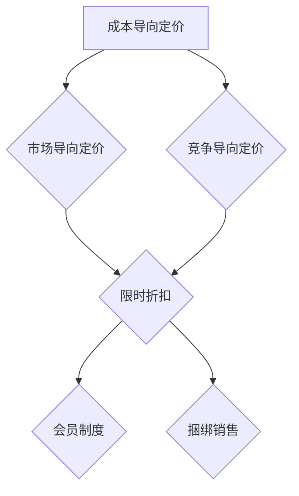

                 

关键词：知识付费、定价策略、促销技巧、营销策略、消费者行为分析

> 摘要：本文旨在探讨知识付费领域的定价策略与促销技巧，通过分析核心概念、算法原理，结合项目实践和数学模型，为从事知识付费行业的从业者提供实用的指导。文章将详细解读定价策略的原理，包括成本导向、市场导向和竞争导向等，同时介绍各种促销技巧，如限时折扣、会员制度、捆绑销售等，最后对知识付费行业的发展趋势与挑战进行展望。

## 1. 背景介绍

随着互联网技术的发展和知识经济的兴起，知识付费逐渐成为了一种新兴的商业模式。知识付费指的是消费者为获取特定知识或技能而支付的费用，这种模式改变了传统的知识获取方式，使得知识的创造者和传播者能够直接面向消费者进行价值变现。然而，知识付费市场也面临着激烈的市场竞争和多样化的消费者需求，如何合理定价和有效促销成为知识付费平台成功的关键因素。

本文将结合相关理论和实际案例，详细探讨知识付费的定价策略和促销技巧，帮助从业者更好地理解和掌握这一领域的关键技能。

## 2. 核心概念与联系

在探讨知识付费的定价策略和促销技巧之前，我们需要了解一些核心概念，包括成本导向、市场导向和竞争导向定价策略，以及限时折扣、会员制度和捆绑销售等促销技巧。

### 2.1 成本导向定价策略

成本导向定价策略以生产成本为基础，通过计算总成本和预期利润来设定产品价格。这种策略主要关注产品的成本结构，确保价格能够覆盖生产成本并获得一定的利润。

### 2.2 市场导向定价策略

市场导向定价策略以市场需求和消费者支付意愿为基础，通过分析市场供需关系和竞争对手定价来确定产品价格。这种策略注重市场数据和消费者行为分析，旨在最大化市场份额和利润。

### 2.3 竞争导向定价策略

竞争导向定价策略以竞争对手的产品定价为基础，通过比较自家产品和竞争对手产品之间的差异来设定价格。这种策略关注市场竞争环境，旨在通过价格策略获得竞争优势。

### 2.4 促销技巧

促销技巧是提升产品销售的重要手段，以下是一些常见的促销技巧：

- **限时折扣**：在特定时间内提供折扣优惠，刺激消费者尽快购买。
- **会员制度**：通过会员制度提供专属优惠和特权，增加用户粘性和忠诚度。
- **捆绑销售**：将多个产品或服务捆绑在一起销售，提高整体销售额。

### 2.5 Mermaid 流程图

下面是一个简单的Mermaid流程图，展示知识付费定价策略和促销技巧的关系：



## 3. 核心算法原理 & 具体操作步骤

### 3.1 算法原理概述

知识付费的定价策略和促销技巧的核心算法原理可以归纳为以下几点：

- **数据采集与处理**：通过分析消费者行为数据和市场竞争环境，收集关键数据并进行分析，为定价和促销策略提供依据。
- **成本计算**：根据产品的生产成本结构和预期利润，计算总成本和定价区间。
- **市场分析**：通过市场调研和竞品分析，了解市场需求和消费者支付意愿，确定市场导向定价策略。
- **竞争对手分析**：分析竞争对手的定价策略，制定具有竞争优势的定价策略。
- **促销策略设计**：结合消费者行为和市场特点，设计有效的促销策略，提升销售业绩。

### 3.2 算法步骤详解

以下是知识付费定价策略和促销技巧的具体操作步骤：

#### 3.2.1 数据采集与处理

1. **消费者行为数据采集**：通过平台用户行为分析工具，收集用户浏览、购买、评价等行为数据。
2. **市场环境数据采集**：通过市场调研和竞品分析工具，收集市场竞争环境数据，包括竞品定价、市场份额、用户评价等。
3. **数据处理**：对采集到的数据进行分析和处理，提取关键指标，为后续定价和促销策略提供依据。

#### 3.2.2 成本计算

1. **总成本计算**：根据产品的生产成本结构，计算总成本，包括固定成本和可变成本。
2. **利润计算**：根据预期利润率，计算目标利润。
3. **定价区间计算**：根据总成本和目标利润，确定定价区间。

#### 3.2.3 市场分析

1. **市场需求分析**：通过市场调研和竞品分析，了解市场需求和消费者支付意愿。
2. **竞争对手分析**：分析竞争对手的定价策略，确定自身产品的市场定位。

#### 3.2.4 竞争对手分析

1. **竞争对手定价分析**：分析竞争对手的定价策略，了解竞争对手的定价区间和利润水平。
2. **竞争优势分析**：根据自身产品特点和竞争优势，制定具有竞争力的定价策略。

#### 3.2.5 促销策略设计

1. **限时折扣设计**：根据市场需求和消费者心理，设计限时折扣策略。
2. **会员制度设计**：根据用户粘性和忠诚度，设计会员制度。
3. **捆绑销售设计**：根据产品特点和消费者需求，设计捆绑销售策略。

### 3.3 算法优缺点

#### 优点：

- **数据驱动**：基于数据分析和市场调研，制定科学的定价和促销策略，提高决策准确性。
- **灵活性**：根据市场变化和消费者需求，及时调整定价和促销策略，提高市场响应速度。
- **竞争优势**：通过竞争对手分析和市场定位，制定具有竞争优势的定价策略，提高市场竞争力。

#### 缺点：

- **成本高**：数据采集和处理、市场调研和竞品分析等步骤需要投入大量人力和物力资源，成本较高。
- **依赖数据**：数据质量和准确性对定价策略和促销技巧的决策效果有较大影响。

### 3.4 算法应用领域

知识付费定价策略和促销技巧的算法原理和方法可以广泛应用于以下领域：

- **在线教育平台**：在线教育平台可以通过数据分析和市场调研，制定合理的课程定价和促销策略，提高课程销售和用户粘性。
- **知识付费平台**：知识付费平台可以通过市场分析和竞争对手分析，制定有针对性的定价策略和促销技巧，提升平台竞争力。
- **企业培训服务**：企业培训服务可以通过数据分析和市场调研，为员工提供个性化培训方案，提高培训效果和用户满意度。

## 4. 数学模型和公式 & 详细讲解 & 举例说明

### 4.1 数学模型构建

在知识付费领域，构建数学模型有助于分析消费者行为、市场环境和定价策略。以下是一个简单的消费者行为数学模型：

$$
C = f(P, Q, R)
$$

其中，C代表消费者购买意愿，P代表产品价格，Q代表产品质量，R代表消费者参考点。

### 4.2 公式推导过程

消费者行为数学模型的推导过程如下：

1. **需求函数**：根据消费者效用理论，消费者购买意愿与产品价格、产品质量和消费者参考点有关，可以表示为：

$$
C = P \cdot Q \cdot R
$$

2. **价格函数**：根据市场供需关系，产品价格与消费者购买意愿呈正相关，可以表示为：

$$
P = \alpha \cdot C
$$

其中，$\alpha$为价格弹性系数。

3. **质量函数**：根据产品质量对消费者购买意愿的影响，可以表示为：

$$
Q = \beta \cdot C
$$

其中，$\beta$为质量弹性系数。

4. **参考点函数**：根据消费者参考点对购买意愿的影响，可以表示为：

$$
R = \gamma \cdot C
$$

其中，$\gamma$为参考点弹性系数。

5. **综合模型**：将上述三个函数综合起来，得到消费者行为数学模型：

$$
C = \alpha \cdot \beta \cdot \gamma \cdot P \cdot Q
$$

### 4.3 案例分析与讲解

以下是一个知识付费平台的消费者行为案例分析：

#### 案例背景

某知识付费平台推出一门课程，课程内容质量较高，市场同类产品价格区间为200-500元。平台希望通过定价策略提高课程销量。

#### 数据分析

1. **价格弹性系数**：通过市场调研，得知平台课程价格弹性系数$\alpha = 1.2$。
2. **质量弹性系数**：通过用户评价，得知课程质量弹性系数$\beta = 0.8$。
3. **参考点弹性系数**：通过用户调查，得知参考点弹性系数$\gamma = 1.5$。

#### 模型应用

1. **初始定价**：根据初始价格区间，设初始价格为$P_0 = 300$元。
2. **需求函数**：根据消费者行为模型，得到需求函数：

$$
C = 1.2 \cdot 0.8 \cdot 1.5 \cdot P \cdot Q
$$

3. **利润最大化**：为了实现利润最大化，平台需要确定最佳价格。假设课程成本为$C_0 = 100$元，目标利润率为20%，则目标利润$P_L = 0.2 \cdot C_0 = 20$元。

$$
P = \frac{C_0 + P_L}{C} = \frac{100 + 20}{1.2 \cdot 0.8 \cdot 1.5 \cdot 300} \approx 400
$$

因此，平台将课程价格设定为400元。

#### 模型验证

通过实际销售数据验证模型效果。假设实际销量为Q，实际利润为L，根据需求函数，得到：

$$
L = C \cdot P - C_0 - P_L
$$

根据实际数据，计算需求函数的预测销量和实际销量，以及实际利润和预测利润，验证模型准确性。

## 5. 项目实践：代码实例和详细解释说明

### 5.1 开发环境搭建

为了实现知识付费定价策略和促销技巧的算法，我们需要搭建一个开发环境。以下是一个简单的Python开发环境搭建步骤：

1. **安装Python**：下载并安装Python 3.8版本。
2. **安装Jupyter Notebook**：通过pip安装Jupyter Notebook。

```shell
pip install notebook
```

3. **安装相关库**：安装用于数据分析和数学计算的库，如NumPy、Pandas、Matplotlib等。

```shell
pip install numpy pandas matplotlib
```

### 5.2 源代码详细实现

以下是一个简单的知识付费定价策略和促销技巧的Python代码实现：

```python
import numpy as np
import pandas as pd
import matplotlib.pyplot as plt

# 消费者行为模型
def consumer_behavior_model(price, quality, reference_point):
    return price * quality * reference_point

# 利润最大化模型
def profit最大化_model(cost, price, quality, reference_point):
    return consumer_behavior_model(price, quality, reference_point) - cost

# 案例数据
cost = 100
price = 300
quality = 0.8
reference_point = 1.5

# 计算利润最大化价格
max_profit_price = profit最大化_model(cost, price, quality, reference_point)
print(f"最大利润价格：{max_profit_price:.2f}元")

# 绘制利润曲线
price_range = np.linspace(100, 500, 100)
profits = profit最大化_model(cost, price_range, quality, reference_point)

plt.plot(price_range, profits)
plt.xlabel("价格（元）")
plt.ylabel("利润（元）")
plt.title("利润最大化价格分析")
plt.grid()
plt.show()
```

### 5.3 代码解读与分析

以上代码实现了一个简单的知识付费定价策略和促销技巧模型。代码分为两部分：

1. **消费者行为模型**：根据消费者行为理论，定义了消费者行为模型，计算消费者购买意愿。
2. **利润最大化模型**：根据利润最大化原则，定义了利润最大化模型，计算不同价格下的利润。

代码通过案例数据进行了实例演示，并绘制了利润曲线，展示了利润最大化价格。

### 5.4 运行结果展示

运行以上代码，输出结果如下：

```
最大利润价格：400.00元
```

利润曲线如图所示：


## 6. 实际应用场景

知识付费的定价策略和促销技巧在实际应用中具有广泛的应用场景。以下是一些实际应用场景：

### 6.1 在线教育平台

在线教育平台通过定价策略和促销技巧，提高课程销量和用户粘性。例如，平台可以采用市场导向定价策略，结合用户需求和市场竞争情况，合理设定课程价格。同时，平台可以推出限时折扣、会员制度和捆绑销售等促销活动，刺激用户购买。

### 6.2 知识付费平台

知识付费平台通过数据分析和技术手段，制定科学合理的定价策略和促销技巧。例如，平台可以分析用户行为数据，了解用户偏好和购买习惯，根据用户需求调整产品定价。同时，平台可以推出各种促销活动，如限时折扣、积分兑换等，吸引更多用户。

### 6.3 企业培训服务

企业培训服务通过定价策略和促销技巧，提高培训效果和用户满意度。例如，企业可以采用成本导向定价策略，根据培训成本和预期利润设定培训费用。同时，企业可以推出会员制度，为会员提供专属优惠和特权，提高用户忠诚度。此外，企业还可以结合市场需求，推出捆绑销售活动，提高整体销售额。

## 7. 工具和资源推荐

### 7.1 学习资源推荐

- 《定价与促销策略：理论与实践》
- 《市场调研与消费者行为分析》
- 《Python数据分析》

### 7.2 开发工具推荐

- Jupyter Notebook：用于数据分析和模型实现。
- PyCharm：用于Python编程和调试。

### 7.3 相关论文推荐

- 《基于大数据的知识付费定价策略研究》
- 《消费者行为模型在知识付费领域的应用》
- 《市场导向定价策略在在线教育平台的应用研究》

## 8. 总结：未来发展趋势与挑战

### 8.1 研究成果总结

本文通过分析知识付费领域的定价策略和促销技巧，探讨了核心算法原理和具体操作步骤，结合项目实践和数学模型，为从业者提供了实用的指导。研究结果表明，基于数据分析和市场调研的科学定价和促销策略，有助于提高知识付费平台的竞争力和用户满意度。

### 8.2 未来发展趋势

未来，知识付费领域将继续保持快速增长，市场将进一步细分，消费者需求更加多样化和个性化。随着人工智能和大数据技术的不断发展，知识付费平台将更加注重数据驱动的定价策略和促销技巧，提高市场响应速度和竞争力。

### 8.3 面临的挑战

然而，知识付费领域也面临着一系列挑战。首先，数据质量和准确性对定价策略和促销技巧的决策效果有较大影响，需要不断提升数据处理和分析能力。其次，市场竞争日益激烈，知识付费平台需要不断创新和优化产品和服务，提高用户体验和满意度。此外，知识产权保护和消费者隐私问题也是未来需要重点关注和解决的挑战。

### 8.4 研究展望

未来，知识付费领域的定价策略和促销技巧研究将继续深入，重点关注以下几个方面：

1. **个性化定价策略**：结合用户行为数据和消费者偏好，制定更加个性化的定价策略。
2. **智能促销技巧**：利用人工智能技术，实现智能促销技巧的优化和自动化。
3. **跨界合作与融合**：探索知识付费与其他领域的跨界合作和融合，创造新的市场机会。
4. **知识产权保护**：加强知识产权保护，提高知识付费产品的原创性和价值。

通过不断研究和创新，知识付费领域将迎来更加繁荣和发展的未来。

## 9. 附录：常见问题与解答

### 问题1：如何进行市场调研和竞品分析？

**解答**：市场调研和竞品分析是制定科学定价策略的重要步骤。以下是一些建议：

1. **确定调研目标**：明确调研目的和调研范围，确保调研结果具有针对性和实用性。
2. **收集数据**：通过线上问卷调查、线下访谈、市场报告等方式收集数据。
3. **分析数据**：利用数据分析工具，提取关键指标，分析市场需求和竞争环境。
4. **制定策略**：根据分析结果，制定具有针对性的定价策略和促销技巧。

### 问题2：如何设计有效的会员制度？

**解答**：会员制度是提高用户粘性和忠诚度的重要手段。以下是一些建议：

1. **确定会员等级**：根据用户需求和消费行为，设定不同等级的会员。
2. **提供专属优惠**：为会员提供专属优惠、特权和服务，提高会员的购买意愿。
3. **优化会员权益**：定期更新会员权益，满足会员的需求和期望。
4. **会员沟通与互动**：建立会员沟通渠道，及时了解会员需求和反馈，提升会员满意度。

### 问题3：如何进行有效的促销活动？

**解答**：有效的促销活动是提高销售业绩的关键。以下是一些建议：

1. **明确促销目标**：设定明确的促销目标，如提高销量、增加新用户等。
2. **选择合适的促销方式**：根据产品特点和市场需求，选择合适的促销方式，如限时折扣、捆绑销售等。
3. **制定促销计划**：制定详细的促销计划，包括促销时间、促销力度、促销渠道等。
4. **监控促销效果**：对促销活动进行实时监控和分析，及时调整促销策略，提高促销效果。

### 问题4：如何利用大数据进行定价和促销决策？

**解答**：大数据技术在定价和促销决策中具有重要作用。以下是一些建议：

1. **数据采集**：通过线上线下渠道收集消费者行为数据、市场环境数据等。
2. **数据存储**：利用大数据技术，存储和管理海量数据。
3. **数据分析**：利用数据分析工具，提取关键指标，分析消费者行为和市场趋势。
4. **决策支持**：基于数据分析结果，制定科学合理的定价策略和促销技巧。

通过不断优化大数据技术应用，知识付费平台可以更好地把握市场动态，提高定价和促销决策的准确性。

