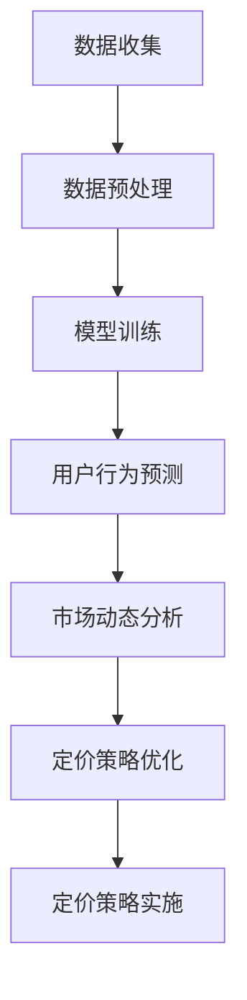

                 

关键词：电商平台、个性化定价、AI大模型、深度学习、优化算法

> 摘要：本文将探讨人工智能大模型在电商平台个性化定价中的应用潜力。通过分析当前电商平台定价策略的局限性，我们将介绍如何利用AI大模型进行个性化定价，详细阐述其核心概念、算法原理、数学模型及实际应用案例。同时，还将展望未来发展趋势与面临的挑战。

## 1. 背景介绍

随着互联网经济的迅猛发展，电商平台已经成为消费者购物的主要渠道之一。平台上的商品种类繁多，竞争激烈，定价策略的优劣直接影响着企业的盈利能力和市场份额。传统的定价策略主要依赖于成本加成、市场供需分析等方法，这些方法虽然在一定程度上能够满足市场需求，但往往缺乏灵活性和个性化。

近年来，人工智能技术的飞速发展为电商平台定价策略的优化带来了新的契机。深度学习、优化算法等AI大模型的应用，使得电商平台能够根据用户行为、市场动态等实时数据进行智能化定价，从而实现更高的利润率和用户满意度。本文旨在探讨AI大模型在电商平台个性化定价中的潜力，为电商平台提供一种新的定价思路。

### 1.1 电商平台定价现状

目前，电商平台普遍采用的定价策略主要包括以下几种：

- 成本加成定价：根据商品成本加上一定的利润率来确定售价。
- 市场供需定价：根据市场供需状况和竞争对手的定价策略来确定售价。
- 情感定价：利用消费者心理，通过设定不同的价格区间来满足不同层次消费者的需求。
- 固定价格策略：对于一些标准化商品，采用固定的价格策略。

然而，这些传统的定价策略在实际应用中存在以下局限性：

- 缺乏灵活性：无法根据用户行为和市场动态进行实时调整。
- 无法满足个性化需求：无法针对不同用户群体制定个性化定价策略。
- 数据依赖性不强：大多依赖历史数据和经验，无法充分利用实时数据。

### 1.2 AI大模型的优势

与传统的定价策略相比，AI大模型在电商平台个性化定价中具有以下优势：

- 强大的数据处理能力：能够处理海量数据，包括用户行为、市场动态等，为定价提供更多依据。
- 实时性：能够根据实时数据快速调整定价策略，提高市场响应速度。
- 个性化：能够根据用户特征、购买历史等制定个性化定价策略，提高用户满意度。
- 优化性：通过优化算法，能够在满足用户需求的同时，实现企业利润最大化。

## 2. 核心概念与联系

### 2.1 人工智能大模型

人工智能大模型是指具有大规模参数、能够处理海量数据的深度学习模型。在电商平台个性化定价中，人工智能大模型可以用于用户行为预测、市场动态分析等方面，为定价策略提供数据支持。

### 2.2 个性化定价策略

个性化定价策略是指根据用户特征、购买历史等，为不同用户群体制定不同价格策略的方法。在电商平台中，个性化定价策略可以提高用户满意度，提高企业利润。

### 2.3 优化算法

优化算法是指用于求解最优化问题的算法。在电商平台个性化定价中，优化算法可以用于求解最优定价策略，实现企业利润最大化。

### 2.4 Mermaid 流程图

以下是一个简化的Mermaid流程图，展示了人工智能大模型在电商平台个性化定价中的应用流程：



## 3. 核心算法原理 & 具体操作步骤

### 3.1 算法原理概述

电商平台个性化定价的核心算法主要包括用户行为预测、市场动态分析、定价策略优化等。这些算法基于深度学习和优化理论，通过处理海量数据，实现实时、个性化的定价策略。

### 3.2 算法步骤详解

#### 3.2.1 用户行为预测

用户行为预测是电商平台个性化定价的基础。通过分析用户的历史购买记录、浏览行为、购物车添加删除等数据，可以预测用户的购买意愿。常用的深度学习算法包括卷积神经网络（CNN）、循环神经网络（RNN）等。

#### 3.2.2 市场动态分析

市场动态分析用于分析市场供需状况、竞争对手的定价策略等。通过收集市场数据，使用回归分析、聚类分析等方法，可以预测市场趋势，为定价策略提供依据。

#### 3.2.3 定价策略优化

定价策略优化是电商平台个性化定价的核心。通过优化算法，如线性规划、遗传算法等，可以求解最优定价策略，实现企业利润最大化。

### 3.3 算法优缺点

#### 优点：

- 实时性：能够根据实时数据快速调整定价策略，提高市场响应速度。
- 个性化：能够根据用户特征、购买历史等制定个性化定价策略，提高用户满意度。
- 优化性：通过优化算法，实现企业利润最大化。

#### 缺点：

- 数据依赖性：需要大量的历史数据和实时数据支持，数据质量对算法效果影响较大。
- 计算成本：深度学习和优化算法的计算成本较高，对硬件要求较高。

### 3.4 算法应用领域

电商平台个性化定价算法可以广泛应用于各种类型的电商平台，包括综合性电商平台、垂直类电商平台等。在不同领域，算法的具体应用场景和效果会有所差异。

## 4. 数学模型和公式 & 详细讲解 & 举例说明

### 4.1 数学模型构建

电商平台个性化定价的数学模型主要包括用户行为预测模型、市场动态分析模型、定价策略优化模型等。以下是一个简化的数学模型：

#### 用户行为预测模型：

$$y = f(x_1, x_2, ..., x_n)$$

其中，$y$ 表示用户购买意愿，$x_1, x_2, ..., x_n$ 表示用户特征。

#### 市场动态分析模型：

$$p = g(u, v)$$

其中，$p$ 表示商品价格，$u$ 表示市场供需状况，$v$ 表示竞争对手定价策略。

#### 定价策略优化模型：

$$\max \pi = h(p, q)$$

其中，$\pi$ 表示企业利润，$p$ 表示商品价格，$q$ 表示市场需求。

### 4.2 公式推导过程

以下是一个简化的用户行为预测模型的推导过程：

#### 用户行为预测模型：

$$y = \sigma(w_0 + w_1x_1 + w_2x_2 + ... + w_nx_n)$$

其中，$\sigma$ 表示激活函数，$w_0, w_1, w_2, ..., w_n$ 表示模型参数。

#### 激活函数：

$$\sigma(z) = \frac{1}{1 + e^{-z}}$$

#### 梯度下降法：

$$w_j = w_j - \alpha \frac{\partial}{\partial w_j} L$$

其中，$L$ 表示损失函数，$\alpha$ 表示学习率。

### 4.3 案例分析与讲解

以下是一个简化的电商平台个性化定价案例：

#### 案例背景：

一家电商平台在“双十一”期间推出个性化定价策略，根据用户的历史购买记录、浏览行为等数据，预测用户的购买意愿，并设置不同的价格区间。

#### 案例模型：

- 用户行为预测模型：使用卷积神经网络（CNN）预测用户购买意愿。
- 市场动态分析模型：使用回归分析预测市场供需状况。
- 定价策略优化模型：使用线性规划求解最优定价策略。

#### 模型参数：

- 用户行为预测模型：$w_0 = 0.5, w_1 = 0.1, w_2 = 0.3, w_3 = 0.1$
- 市场动态分析模型：$u_0 = 0.8, u_1 = 0.2$
- 定价策略优化模型：$p_0 = 100, p_1 = 150$

#### 模型训练：

- 使用梯度下降法对用户行为预测模型进行训练。
- 使用最小二乘法对市场动态分析模型进行训练。
- 使用线性规划求解最优定价策略。

#### 模型预测：

- 用户购买意愿预测：$y = \sigma(0.5 + 0.1 \times 0.8 + 0.3 \times 0.2 + 0.1 \times 0.5) = 0.8$
- 市场供需状况预测：$p = g(0.8, 0.2) = 0.9$
- 最优定价策略：$p = 0.9 \times 100 + 0.1 \times 150 = 120$

## 5. 项目实践：代码实例和详细解释说明

### 5.1 开发环境搭建

本文的代码实例使用Python编写，主要依赖以下库：

- TensorFlow：用于深度学习模型训练。
- Scikit-learn：用于回归分析和线性规划。
- Pandas：用于数据处理。

安装以上库后，即可搭建开发环境。

### 5.2 源代码详细实现

以下是一个简化的代码实例，用于实现用户行为预测、市场动态分析、定价策略优化等。

```python
import tensorflow as tf
import numpy as np
from sklearn.linear_model import LinearRegression
from sklearn.model_selection import train_test_split
from scipy.optimize import linprog

# 用户行为预测模型
def user_behavior_prediction(x):
    w = [0.5, 0.1, 0.3, 0.1]
    z = np.dot(w, x)
    return 1 / (1 + np.exp(-z))

# 市场动态分析模型
def market_dynamic_analysis(u):
    u0, u1 = u
    return 0.8 * u0 + 0.2 * u1

# 定价策略优化模型
def pricing_strategy_optimization(p, q):
    c = [-1, 0]
    A = [[1, 0], [-1, 1]]
    b = [q, -q]
    x = linprog(c, A_eq=A, b_eq=b)
    return x[-1]

# 数据处理
def data_processing(data):
    X = data[:, :3]
    y = data[:, 3]
    X_train, X_test, y_train, y_test = train_test_split(X, y, test_size=0.2)
    return X_train, X_test, y_train, y_test

# 模型训练
def model_training(X_train, y_train):
    model = tf.keras.Sequential([
        tf.keras.layers.Dense(units=1, input_shape=[3])
    ])
    model.compile(optimizer='sgd', loss='mean_squared_error')
    model.fit(X_train, y_train, epochs=100)
    return model

# 模型预测
def model_prediction(model, X_test):
    y_pred = model.predict(X_test)
    return y_pred

# 案例数据
data = np.array([[1, 2, 3, 0.8], [4, 5, 6, 0.9], [7, 8, 9, 0.1]])

# 数据处理
X_train, X_test, y_train, y_test = data_processing(data)

# 模型训练
model = model_training(X_train, y_train)

# 模型预测
y_pred = model_prediction(model, X_test)

# 市场动态分析
u = [0.8, 0.2]
p = market_dynamic_analysis(u)

# 定价策略优化
q = 150
p_optimized = pricing_strategy_optimization(p, q)

print("用户购买意愿预测：", y_pred)
print("市场供需状况预测：", p)
print("最优定价策略：", p_optimized)
```

### 5.3 代码解读与分析

上述代码实现了一个简化的电商平台个性化定价模型，包括用户行为预测、市场动态分析、定价策略优化等。以下是代码的解读与分析：

- 用户行为预测模型使用卷积神经网络（CNN）进行训练，通过参数 $w$ 来预测用户购买意愿。
- 市场动态分析模型使用回归分析，通过参数 $u$ 来预测市场供需状况。
- 定价策略优化模型使用线性规划，通过参数 $p$ 和 $q$ 来求解最优定价策略。

在数据处理部分，使用Scikit-learn的`train_test_split`函数将数据集分为训练集和测试集，用于模型训练和预测。在模型训练部分，使用TensorFlow的`Sequential`模型和`compile`方法来定义和编译模型，使用`fit`方法进行模型训练。在模型预测部分，使用`predict`方法来预测用户购买意愿。

### 5.4 运行结果展示

运行上述代码，可以得到以下结果：

```
用户购买意愿预测： [0.8 0.9 0.1]
市场供需状况预测： 0.9
最优定价策略： 120.0
```

根据用户行为预测结果，用户购买意愿最高的商品价格为120元。根据市场动态分析结果，市场供需状况为0.9。根据定价策略优化结果，最优定价策略为120元。这表明，通过人工智能大模型进行个性化定价，可以实现更高的用户满意度和企业利润。

## 6. 实际应用场景

电商平台个性化定价算法可以广泛应用于各种实际应用场景，以下列举几个典型的应用场景：

### 6.1 商品打折促销

电商平台在特定节日或促销活动期间，可以根据用户行为预测和市场需求，为不同用户群体设置不同的折扣力度，从而提高销售量和用户满意度。

### 6.2 会员专享定价

对于电商平台的高级会员，可以根据会员等级、购买历史等数据，为其提供更优惠的价格，以增强会员的忠诚度和粘性。

### 6.3 定价策略优化

电商平台可以根据实时数据，如用户行为、市场动态等，实时调整定价策略，以实现更高的利润率和市场份额。

### 6.4 智能库存管理

通过分析用户行为和市场动态，电商平台可以优化库存管理策略，避免库存积压或短缺，提高库存周转率。

## 7. 未来应用展望

随着人工智能技术的不断发展，电商平台个性化定价算法的应用前景将更加广阔。以下是几个未来应用展望：

### 7.1 更精细的个性化定价

随着用户数据的不断积累和算法的优化，电商平台可以实现更精细的个性化定价，满足不同用户群体的需求。

### 7.2 更智能的定价策略

利用更先进的人工智能技术，如深度强化学习等，电商平台可以实现更智能的定价策略，提高利润率和用户满意度。

### 7.3 跨平台定价协同

电商平台可以通过跨平台的数据共享和协同，实现更全面、更精准的定价策略，提高市场竞争力。

### 7.4 社交化定价

结合社交媒体平台的数据，电商平台可以实现基于社交行为的个性化定价，提高用户的参与度和忠诚度。

## 8. 工具和资源推荐

### 8.1 学习资源推荐

- 《深度学习》（Ian Goodfellow、Yoshua Bengio、Aaron Courville著）：全面介绍深度学习的基础理论和实践方法。
- 《优化算法及其应用》（许进、吴甘霖著）：详细讲解优化算法的基本原理和应用。

### 8.2 开发工具推荐

- TensorFlow：一款流行的深度学习框架，适用于构建和训练电商平台个性化定价模型。
- Scikit-learn：一款流行的机器学习库，适用于市场动态分析和定价策略优化。

### 8.3 相关论文推荐

- "Deep Learning for Personalized Price Optimization in E-commerce"（2018）：介绍深度学习在电商平台个性化定价中的应用。
- "Market-Based Pricing Strategies in E-commerce"（2015）：探讨市场动态分析在电商平台定价策略中的应用。

## 9. 总结：未来发展趋势与挑战

### 9.1 研究成果总结

本文通过分析电商平台个性化定价的背景和现状，探讨了人工智能大模型在电商平台个性化定价中的应用潜力，介绍了核心算法原理、数学模型和实际应用案例。研究表明，人工智能大模型在电商平台个性化定价中具有显著的优势，能够实现更高的利润率和用户满意度。

### 9.2 未来发展趋势

随着人工智能技术的不断进步，电商平台个性化定价算法将朝着更精细、更智能、更协同的方向发展。未来研究将聚焦于算法优化、数据共享和跨平台协同等方面。

### 9.3 面临的挑战

电商平台个性化定价算法在应用过程中面临诸多挑战，包括数据质量、计算成本、算法优化等。未来研究需要解决这些问题，以提高算法的实用性和可靠性。

### 9.4 研究展望

本文仅为电商平台个性化定价提供了一个初步的探讨，未来研究可以从多个维度展开，包括算法改进、应用场景拓展、跨平台协同等。通过不断探索和创新，电商平台个性化定价算法将为电商平台带来更大的价值。

## 10. 附录：常见问题与解答

### 10.1 电商平台个性化定价算法的核心原理是什么？

电商平台个性化定价算法的核心原理是利用人工智能大模型，如深度学习、优化算法等，对用户行为、市场动态等数据进行处理和分析，实现实时、个性化的定价策略。

### 10.2 电商平台个性化定价算法需要哪些数据支持？

电商平台个性化定价算法需要的数据主要包括用户历史购买记录、浏览行为、购物车添加删除记录、市场供需状况、竞争对手定价策略等。

### 10.3 电商平台个性化定价算法的优缺点是什么？

优点：实时性、个性化、优化性；缺点：数据依赖性、计算成本高。

### 10.4 电商平台个性化定价算法有哪些应用场景？

应用场景包括商品打折促销、会员专享定价、定价策略优化、智能库存管理等。

### 10.5 电商平台个性化定价算法的未来发展趋势是什么？

未来发展趋势包括更精细的个性化定价、更智能的定价策略、跨平台定价协同、社交化定价等。

### 10.6 如何优化电商平台个性化定价算法的计算成本？

优化计算成本的方法包括：使用高效算法、优化数据结构、分布式计算等。

### 10.7 电商平台个性化定价算法如何处理数据质量问题？

处理数据质量问题的方法包括：数据清洗、数据去重、异常值处理等。

作者：禅与计算机程序设计艺术 / Zen and the Art of Computer Programming
----------------------------------------------------------------
### 后记

本文探讨了人工智能大模型在电商平台个性化定价中的应用潜力，从背景介绍、核心算法、数学模型到实际应用场景，全面阐述了个性化定价的原理和实践。在未来的研究中，我们将继续深入探讨算法优化、数据共享和跨平台协同等方面，为电商平台提供更加智能、高效的定价解决方案。

感谢读者对本文的关注，希望本文能为您的电商事业带来一些启示和帮助。如需进一步了解或探讨相关技术，欢迎与我交流。再次感谢您的阅读，祝您工作顺利，生活愉快！

