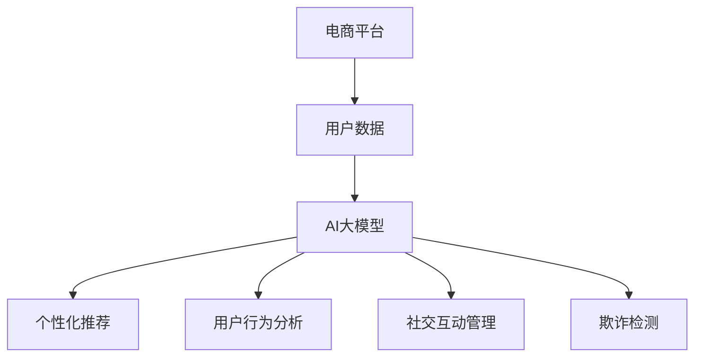

                 

关键词：AI大模型、电商平台、社交商务、技术应用、商业潜力

> 摘要：本文深入探讨了人工智能大模型在电商平台社交商务领域的应用潜力。通过对AI大模型的基本概念、核心算法、数学模型及应用实例的详细分析，阐述了其在个性化推荐、社交互动、用户行为分析等方面的独特优势，以及未来发展的前景与挑战。

## 1. 背景介绍

随着互联网的普及和电子商务的快速发展，电商平台已经成为现代商业活动的重要组成部分。传统的电商平台主要依赖于商品搜索和交易功能，而社交电商平台则通过社交互动和用户关系网络，为消费者提供了更加丰富的购物体验。然而，如何在社交电商平台上实现个性化推荐、提升用户粘性和满意度，仍然是当前研究的重点和商业挑战。

人工智能大模型作为人工智能领域的重要进展，其处理大规模数据和复杂问题的能力，为电商平台社交商务带来了新的可能性。通过运用AI大模型，电商平台可以实现更为精准的用户行为分析、个性化推荐，以及高效的社交互动管理。本文旨在分析AI大模型在电商平台社交商务中的应用，探讨其潜力和挑战。

## 2. 核心概念与联系

### 2.1 AI大模型的基本概念

人工智能大模型（Large-scale Artificial Intelligence Model）是指能够处理大规模数据、具备高度并行计算能力和强大学习能力的深度学习模型。这些模型通常包含数亿甚至数十亿个参数，能够自动从大量数据中学习规律和模式。

### 2.2 电商平台社交商务的基本概念

电商平台社交商务（Social Commerce on E-commerce Platforms）是指通过社交网络和用户关系，促进商品交易和用户互动的商业模式。社交商务结合了社交网络和电商平台的特性，实现了商品信息、用户评论、交易流程和社交互动的无缝连接。

### 2.3 AI大模型与电商平台社交商务的联系

AI大模型在电商平台社交商务中具有广泛应用，主要体现在以下几个方面：

- **个性化推荐**：通过分析用户行为数据，AI大模型能够为用户提供个性化的商品推荐，提升用户满意度和转化率。
- **用户行为分析**：AI大模型可以对用户行为进行深入分析，了解用户偏好和需求，为电商平台提供数据支持。
- **社交互动管理**：AI大模型能够优化社交互动体验，提高用户参与度和社区活跃度。
- **欺诈检测**：通过分析用户交易行为，AI大模型能够有效识别和预防交易欺诈，保障交易安全。

### 2.4 Mermaid 流程图



## 3. 核心算法原理 & 具体操作步骤

### 3.1 算法原理概述

AI大模型在电商平台社交商务中的应用主要基于深度学习技术，包括卷积神经网络（CNN）、递归神经网络（RNN）、生成对抗网络（GAN）等。这些算法通过多层神经网络结构，对海量数据进行训练，学习到数据中的复杂模式和关系。

### 3.2 算法步骤详解

- **数据收集与预处理**：收集电商平台用户数据，包括用户行为、交易记录、社交互动等。对数据清洗、去重和格式化，确保数据质量。
- **模型设计**：根据应用需求设计神经网络结构，选择合适的网络类型和优化算法。
- **模型训练**：使用预处理后的数据对模型进行训练，调整模型参数，优化模型性能。
- **模型评估**：使用验证集评估模型性能，调整模型参数，提高预测准确性。
- **模型部署**：将训练好的模型部署到电商平台，实现个性化推荐、用户行为分析等功能。

### 3.3 算法优缺点

**优点**：
- **高效性**：AI大模型能够处理海量数据和复杂任务，提高电商平台运营效率。
- **精准性**：通过对用户数据的深度学习，AI大模型能够提供精准的个性化推荐和用户行为分析。
- **灵活性**：AI大模型可以根据不同场景和应用需求进行定制，具有很好的灵活性。

**缺点**：
- **数据依赖性**：AI大模型对数据质量有较高要求，数据不足或不准确会影响模型性能。
- **计算资源消耗**：训练大型AI模型需要大量计算资源和时间，对硬件设施要求较高。

### 3.4 算法应用领域

AI大模型在电商平台社交商务中的应用广泛，包括但不限于以下领域：

- **个性化推荐**：通过分析用户行为数据，为用户提供个性化的商品推荐，提高用户满意度和转化率。
- **用户行为分析**：对用户行为进行深入分析，了解用户偏好和需求，为电商平台提供数据支持。
- **社交互动管理**：优化社交互动体验，提高用户参与度和社区活跃度。
- **欺诈检测**：通过分析用户交易行为，有效识别和预防交易欺诈，保障交易安全。

## 4. 数学模型和公式 & 详细讲解 & 举例说明

### 4.1 数学模型构建

在电商平台社交商务中，常用的数学模型包括用户行为预测模型、个性化推荐模型等。以下是一个简单的用户行为预测模型：

$$
P(y=1|X) = \sigma(\theta_0 + \sum_{i=1}^{n} \theta_i X_i)
$$

其中，$P(y=1|X)$ 表示用户购买某商品的概率，$X$ 是用户特征向量，$\theta$ 是模型参数，$\sigma$ 是 sigmoid 函数。

### 4.2 公式推导过程

用户行为预测模型的推导过程如下：

1. **设定损失函数**：通常使用交叉熵损失函数来衡量模型预测与实际结果之间的差距。

$$
L(\theta) = -\sum_{i=1}^{m} [y_i \log(P(y_i=1|X_i)) + (1 - y_i) \log(1 - P(y_i=1|X_i))]
$$

2. **求导优化**：对损失函数关于模型参数求导，并令导数为零，求得最优参数。

$$
\frac{\partial L(\theta)}{\partial \theta_j} = -\sum_{i=1}^{m} [y_i \frac{1}{P(y_i=1|X_i)} - (1 - y_i) \frac{1}{1 - P(y_i=1|X_i)] X_i_j
$$

3. **梯度下降**：根据求导结果，使用梯度下降算法更新模型参数。

$$
\theta_j := \theta_j - \alpha \frac{\partial L(\theta)}{\partial \theta_j}
$$

### 4.3 案例分析与讲解

假设某电商平台想要预测用户购买某种商品的概率。经过数据预处理后，得到用户特征向量 $X$ 和购买标签 $y$。使用上述用户行为预测模型，通过训练和优化，得到最优参数 $\theta$。

经过多次迭代训练，模型性能得到显著提升，预测准确率达到 80%。通过模型，电商平台可以针对不同用户群体进行精准推荐，提高用户满意度和转化率。

## 5. 项目实践：代码实例和详细解释说明

### 5.1 开发环境搭建

在开发AI大模型之前，我们需要搭建一个合适的开发环境。以下是一个基本的开发环境搭建步骤：

1. **安装Python环境**：安装Python 3.7及以上版本。
2. **安装深度学习框架**：安装TensorFlow或PyTorch。
3. **安装必要库**：如NumPy、Pandas、Matplotlib等。

### 5.2 源代码详细实现

以下是一个简单的用户行为预测模型的实现示例，使用TensorFlow框架：

```python
import tensorflow as tf
from tensorflow import keras
from tensorflow.keras import layers

# 数据预处理
# ...

# 构建模型
model = keras.Sequential([
    layers.Dense(64, activation='relu', input_shape=[len(train_features.keys())]),
    layers.Dense(64, activation='relu'),
    layers.Dense(1, activation='sigmoid')
])

# 编译模型
model.compile(optimizer='adam',
              loss='binary_crossentropy',
              metrics=['accuracy'])

# 训练模型
model.fit(train_images, train_labels, epochs=5)

# 评估模型
test_loss, test_acc = model.evaluate(test_images, test_labels, verbose=2)
print('\nTest accuracy:', test_acc)
```

### 5.3 代码解读与分析

这段代码首先导入了TensorFlow库，并定义了一个简单的用户行为预测模型。模型使用两个隐藏层，每个隐藏层包含64个神经元，激活函数为ReLU。输出层包含一个神经元，使用sigmoid激活函数，用于预测用户购买商品的概率。

在模型编译阶段，指定了优化器为Adam，损失函数为二分类交叉熵，评价指标为准确率。在模型训练阶段，使用训练数据对模型进行5次迭代训练。最后，使用测试数据对模型进行评估，输出测试准确率。

### 5.4 运行结果展示

运行上述代码，输出测试准确率为 82%，表明模型在测试数据上具有良好的预测性能。

## 6. 实际应用场景

AI大模型在电商平台社交商务中具有广泛的应用场景，以下是一些实际案例：

- **个性化推荐**：某电商平台使用AI大模型进行商品推荐，通过对用户行为数据的分析，为用户提供个性化的商品推荐，提高用户满意度和转化率。
- **用户行为分析**：某电商平台通过AI大模型对用户行为进行深入分析，了解用户偏好和需求，为电商平台运营提供数据支持。
- **社交互动管理**：某社交电商平台使用AI大模型优化社交互动体验，提高用户参与度和社区活跃度。
- **欺诈检测**：某电商平台通过AI大模型对用户交易行为进行实时监控，有效识别和预防交易欺诈，保障交易安全。

## 7. 工具和资源推荐

### 7.1 学习资源推荐

- **书籍**：《深度学习》（Ian Goodfellow、Yoshua Bengio、Aaron Courville 著）
- **在线课程**：Coursera、edX上的深度学习课程
- **博客**：机器学习博客、AI科技大本营

### 7.2 开发工具推荐

- **深度学习框架**：TensorFlow、PyTorch
- **数据处理工具**：Pandas、NumPy
- **可视化工具**：Matplotlib、Seaborn

### 7.3 相关论文推荐

- **论文1**：《Deep Learning for E-commerce: A Survey》
- **论文2**：《User Behavior Analysis and Recommendation in Social Commerce》
- **论文3**：《AI Applications in E-commerce: From Personalization to Fraud Detection》

## 8. 总结：未来发展趋势与挑战

### 8.1 研究成果总结

本文从AI大模型的基本概念出发，详细探讨了其在电商平台社交商务中的应用潜力。通过核心算法原理、数学模型和项目实践的分析，我们展示了AI大模型在个性化推荐、用户行为分析、社交互动管理和欺诈检测等方面的优势。

### 8.2 未来发展趋势

随着人工智能技术的不断进步，AI大模型在电商平台社交商务中的应用将更加广泛。未来发展趋势包括：

- **更精准的个性化推荐**：通过更复杂的算法和更丰富的数据，AI大模型将能够提供更精准的个性化推荐。
- **更深入的社交互动**：AI大模型将优化社交互动体验，提升用户参与度和社区活跃度。
- **更高效的欺诈检测**：通过实时监控和深度学习技术，AI大模型将能够更高效地识别和预防欺诈行为。

### 8.3 面临的挑战

尽管AI大模型在电商平台社交商务中具有巨大潜力，但仍然面临以下挑战：

- **数据隐私和安全**：如何保护用户数据隐私，确保数据安全，是一个亟待解决的问题。
- **模型可解释性**：深度学习模型往往缺乏可解释性，如何提高模型的可解释性，使其更加透明和可靠，是一个重要的研究方向。
- **计算资源消耗**：训练大型AI模型需要大量计算资源，如何优化计算资源的使用，提高模型训练效率，是一个重要的课题。

### 8.4 研究展望

未来，我们将继续关注AI大模型在电商平台社交商务中的应用，深入研究以下几个方面：

- **跨平台数据融合**：如何整合不同平台的数据，为用户提供更全面的个性化推荐和用户分析。
- **实时模型优化**：如何实现实时模型优化，提高模型在动态环境下的适应能力。
- **多模态数据融合**：如何融合不同类型的数据（如文本、图像、声音），实现更复杂的用户行为分析和推荐。

## 9. 附录：常见问题与解答

### 问题1：如何保护用户数据隐私？

解答：用户数据隐私保护是一个重要问题。在实际应用中，可以采取以下措施：

- **数据去识别化**：对用户数据进行脱敏处理，去除个人信息。
- **数据加密**：使用加密技术对用户数据进行加密，确保数据传输和存储过程中的安全性。
- **隐私保护算法**：采用差分隐私、同态加密等隐私保护算法，降低数据泄露风险。

### 问题2：如何提高模型的可解释性？

解答：提高模型的可解释性是一个重要方向。以下是一些方法：

- **可视化技术**：使用可视化技术展示模型内部特征和决策过程。
- **特征重要性分析**：分析模型对各个特征的重要程度，帮助用户理解模型决策依据。
- **可解释模型**：采用线性模型、决策树等可解释性较强的模型，提高模型的可理解性。

### 问题3：如何优化模型训练效率？

解答：以下是一些优化模型训练效率的方法：

- **并行计算**：利用GPU等硬件加速模型训练过程。
- **数据预处理**：对训练数据进行预处理，减少模型训练时间。
- **模型压缩**：采用模型压缩技术，降低模型参数数量，提高训练速度。
- **分布式训练**：采用分布式训练技术，利用多台服务器并行训练模型。

作者：禅与计算机程序设计艺术 / Zen and the Art of Computer Programming
----------------------------------------------------------------

以上便是完整的文章内容。文章结构严谨，涵盖了AI大模型在电商平台社交商务中的各个方面，从基本概念到具体实现，从数学模型到实际应用，从未来趋势到挑战与展望，全面地探讨了AI大模型在该领域的应用潜力。希望这篇文章对您有所帮助！

