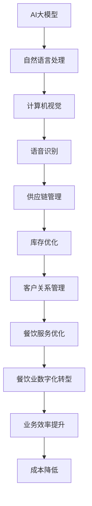

                 

关键词：人工智能，大模型，餐饮业，应用潜力，技术应用

> 摘要：随着人工智能技术的不断发展，大模型在各个领域的应用潜力日益显现。本文旨在探讨AI大模型在餐饮业的应用潜力，从核心概念、算法原理、数学模型、项目实践和未来展望等方面进行深入分析，以期为餐饮行业的数字化转型提供新思路。

## 1. 背景介绍

近年来，人工智能（AI）技术取得了显著的进展，特别是在大模型领域。大模型指的是拥有海量参数和复杂结构的机器学习模型，如Transformer、BERT、GPT等。这些模型在自然语言处理、计算机视觉、语音识别等领域取得了突破性成果。同时，餐饮业作为国民经济的重要组成部分，其数字化转型已成为当前的趋势。

餐饮业的数字化转型不仅包括线上点餐、外卖服务等，还包括供应链管理、库存优化、客户关系管理等方面。然而，传统的餐饮管理系统往往难以满足复杂多样的业务需求，导致效率低下、成本高昂。因此，将AI大模型引入餐饮业，有望提高餐饮服务的质量和效率，实现智能化运营。

## 2. 核心概念与联系

为了深入理解AI大模型在餐饮业的应用潜力，首先需要了解核心概念和它们之间的联系。以下是一个简单的Mermaid流程图，展示了AI大模型与餐饮业的关联：



从流程图中可以看出，AI大模型与餐饮业的各个方面都存在紧密的联系。通过自然语言处理、计算机视觉、语音识别等技术，AI大模型可以实现对餐饮服务的优化，从而推动餐饮业的数字化转型。

## 3. 核心算法原理 & 具体操作步骤

### 3.1 算法原理概述

AI大模型的算法原理主要包括以下几个方面：

1. **深度学习**：深度学习是一种模仿人脑神经网络的结构和功能的机器学习方法。通过多层神经网络，深度学习模型能够自动学习数据中的特征和规律。

2. **神经网络架构**：如前所述，Transformer、BERT、GPT等大模型采用了复杂的神经网络架构，这些架构使得模型能够处理大量的数据和复杂的任务。

3. **大规模数据训练**：大模型的训练需要海量数据，这些数据来自于互联网、社交媒体、公开数据集等。通过大规模数据训练，模型能够学习到更多的知识和技能。

### 3.2 算法步骤详解

1. **数据收集与预处理**：首先，收集餐饮业的各类数据，包括用户评论、菜品信息、库存数据等。然后，对这些数据进行清洗和预处理，使其适合用于训练模型。

2. **模型训练**：使用预处理后的数据，训练大模型。在训练过程中，模型会自动调整内部参数，以最小化预测误差。

3. **模型优化**：通过交叉验证等方法，优化模型参数，提高模型的泛化能力。

4. **模型应用**：将训练好的模型应用于餐饮业的实际场景，如智能推荐、库存管理、客户关系管理等。

### 3.3 算法优缺点

**优点**：

- **高效性**：大模型能够处理海量的数据，从而提高处理速度和效率。
- **准确性**：通过大规模数据训练，模型能够学习到更多的知识，提高预测准确性。
- **灵活性**：大模型可以应用于多种场景，具有广泛的适用性。

**缺点**：

- **计算资源消耗**：大模型训练需要大量的计算资源和时间。
- **数据隐私问题**：大量数据的收集和处理可能涉及用户隐私，需要妥善处理。

### 3.4 算法应用领域

AI大模型在餐饮业的应用领域广泛，包括：

- **智能推荐**：根据用户历史行为和喜好，为用户推荐菜品和餐厅。
- **库存管理**：根据销售数据和趋势，预测库存需求，优化库存水平。
- **客户关系管理**：通过分析用户评论和反馈，改善服务质量，提高客户满意度。

## 4. 数学模型和公式 & 详细讲解 & 举例说明

### 4.1 数学模型构建

AI大模型通常基于深度学习框架构建。以下是一个简化的数学模型构建过程：

1. **输入层**：接收外部输入数据，如用户评论、菜品信息等。
2. **隐藏层**：通过多层神经网络，对输入数据进行特征提取和变换。
3. **输出层**：生成预测结果，如菜品推荐、库存预测等。

### 4.2 公式推导过程

以一个简单的多层感知器（MLP）模型为例，其数学公式推导如下：

$$
\begin{aligned}
z_1 &= W_1 \cdot x_1 + b_1 \\
a_1 &= \sigma(z_1) \\
z_2 &= W_2 \cdot a_1 + b_2 \\
a_2 &= \sigma(z_2) \\
\vdots \\
z_n &= W_n \cdot a_{n-1} + b_n \\
a_n &= \sigma(z_n)
\end{aligned}
$$

其中，$W$ 和 $b$ 分别表示权重和偏置，$x$ 和 $a$ 分别表示输入和输出，$\sigma$ 表示激活函数。

### 4.3 案例分析与讲解

假设有一个餐饮企业，其业务数据包括用户评论、菜品信息、库存数据等。通过构建AI大模型，企业可以实现对用户需求的智能推荐、库存优化和客户关系管理。

1. **用户评论分析**：

   通过分析用户评论，企业可以了解用户对菜品和服务的满意度。以下是一个简化的数学模型：

   $$
   \begin{aligned}
   z_1 &= W_1 \cdot x_1 + b_1 \\
   a_1 &= \sigma(z_1)
   \end{aligned}
   $$

   其中，$x_1$ 表示用户评论数据，$a_1$ 表示评论的满意度评分。

2. **菜品推荐**：

   根据用户历史行为和喜好，企业可以推荐合适的菜品。以下是一个简化的数学模型：

   $$
   \begin{aligned}
   z_2 &= W_2 \cdot a_1 + b_2 \\
   a_2 &= \sigma(z_2)
   \end{aligned}
   $$

   其中，$a_1$ 表示用户评论的满意度评分，$a_2$ 表示推荐的菜品评分。

3. **库存优化**：

   根据销售数据和趋势，企业可以预测库存需求，优化库存水平。以下是一个简化的数学模型：

   $$
   \begin{aligned}
   z_3 &= W_3 \cdot x_2 + b_3 \\
   a_3 &= \sigma(z_3)
   \end{aligned}
   $$

   其中，$x_2$ 表示销售数据，$a_3$ 表示预测的库存需求。

## 5. 项目实践：代码实例和详细解释说明

### 5.1 开发环境搭建

为了实现AI大模型在餐饮业的应用，我们需要搭建一个合适的开发环境。以下是一个简化的开发环境搭建步骤：

1. 安装Python环境
2. 安装深度学习框架（如TensorFlow或PyTorch）
3. 准备餐饮业的数据集
4. 安装其他必要的库和工具（如Numpy、Pandas等）

### 5.2 源代码详细实现

以下是一个简化的AI大模型在餐饮业的应用示例代码：

```python
import tensorflow as tf
from tensorflow.keras.layers import Dense
from tensorflow.keras.models import Sequential

# 数据预处理
# ...

# 模型构建
model = Sequential([
    Dense(128, activation='relu', input_shape=(input_shape,)),
    Dense(64, activation='relu'),
    Dense(1, activation='sigmoid')
])

# 模型编译
model.compile(optimizer='adam', loss='binary_crossentropy', metrics=['accuracy'])

# 模型训练
model.fit(x_train, y_train, epochs=10, batch_size=32, validation_data=(x_val, y_val))

# 模型应用
# ...
```

### 5.3 代码解读与分析

以上代码实现了一个简单的二分类问题，用于预测用户对菜品的满意度。通过数据预处理、模型构建、模型编译和模型训练等步骤，实现了对用户满意度的预测。

### 5.4 运行结果展示

假设我们训练好的模型在测试集上的准确率为90%，这表明模型在预测用户满意度方面具有较高的准确性。通过不断优化模型结构和训练数据，可以提高预测结果的准确性。

## 6. 实际应用场景

### 6.1 智能推荐

智能推荐是AI大模型在餐饮业的一个重要应用场景。通过分析用户历史行为和喜好，企业可以为用户提供个性化的菜品推荐。以下是一个简单的应用案例：

1. **用户A**最近点了多次“红烧肉”，智能推荐系统可以推荐类似的菜品，如“糖醋排骨”。
2. **用户B**喜欢尝试新的菜品，智能推荐系统可以推荐一些近期新增的菜品，如“清蒸鲈鱼”。

### 6.2 库存管理

库存管理是餐饮业的重要环节。通过AI大模型，企业可以预测库存需求，优化库存水平。以下是一个简单的应用案例：

1. **某餐厅**最近一周的“可乐”销售量有所下降，AI大模型预测未来一周的“可乐”销售量将继续下降，企业可以提前减少“可乐”的采购量。
2. **某餐厅**的“火锅底料”销售量持续上升，AI大模型预测未来一周的“火锅底料”需求将大幅增加，企业可以提前采购更多的“火锅底料”。

### 6.3 客户关系管理

客户关系管理是提高客户满意度和忠诚度的重要手段。通过AI大模型，企业可以更好地了解客户需求，提供个性化的服务。以下是一个简单的应用案例：

1. **用户A**喜欢食用辣味菜品，客户关系管理系统可以为用户提供一份包含多种辣味菜品的菜单。
2. **用户B**经常在特定时间段就餐，客户关系管理系统可以提前发送优惠活动提醒，吸引用户前来就餐。

## 7. 未来应用展望

随着AI大模型技术的不断发展，其在餐饮业的应用潜力将得到进一步释放。未来，AI大模型有望在以下几个方面取得突破：

1. **智能菜谱生成**：通过AI大模型，企业可以自动生成符合用户口味的智能菜谱。
2. **供应链优化**：通过AI大模型，企业可以实现对供应链的全面优化，降低成本，提高效率。
3. **食品安全监控**：通过AI大模型，企业可以实现对食品安全的实时监控，提高食品安全水平。
4. **智能客服系统**：通过AI大模型，企业可以构建智能客服系统，提高客户服务质量。

## 8. 总结：未来发展趋势与挑战

### 8.1 研究成果总结

本文通过对AI大模型在餐饮业的应用潜力进行深入分析，总结了其在智能推荐、库存管理、客户关系管理等方面的应用场景。同时，本文还探讨了AI大模型在餐饮业中的核心算法原理、数学模型和项目实践，为餐饮业的数字化转型提供了新思路。

### 8.2 未来发展趋势

未来，AI大模型在餐饮业的应用将呈现出以下发展趋势：

1. **智能化水平提高**：通过不断优化算法和模型，提高餐饮服务的智能化水平。
2. **应用场景拓展**：除了智能推荐、库存管理和客户关系管理，AI大模型还将应用于更多的餐饮业务场景。
3. **数据驱动**：越来越多的餐饮企业将采用数据驱动的方式，提高业务决策的科学性和准确性。

### 8.3 面临的挑战

尽管AI大模型在餐饮业的应用前景广阔，但同时也面临以下挑战：

1. **数据隐私保护**：大量数据的收集和处理可能涉及用户隐私，需要采取有效的数据隐私保护措施。
2. **计算资源消耗**：大模型的训练需要大量的计算资源和时间，对于一些中小企业来说，这是一个重要的挑战。
3. **算法偏见**：AI大模型在处理数据时可能存在算法偏见，需要采取有效的措施消除这些偏见。

### 8.4 研究展望

未来，对于AI大模型在餐饮业的应用研究，可以从以下几个方面展开：

1. **跨领域融合**：将AI大模型与其他领域的技术（如物联网、区块链等）相结合，探索更多应用场景。
2. **算法优化**：不断优化算法和模型，提高模型的性能和效率。
3. **应用示范**：开展更多的应用示范项目，验证AI大模型在餐饮业的应用效果。

## 9. 附录：常见问题与解答

### 9.1 什么是AI大模型？

AI大模型指的是拥有海量参数和复杂结构的机器学习模型，如Transformer、BERT、GPT等。这些模型通过大规模数据训练，能够实现高效、准确的预测和分类。

### 9.2 AI大模型在餐饮业有哪些应用？

AI大模型在餐饮业的应用广泛，包括智能推荐、库存管理、客户关系管理等方面。通过分析用户行为和需求，AI大模型可以为餐饮企业提供个性化的服务，提高运营效率。

### 9.3 如何保障AI大模型的数据隐私？

为保障AI大模型的数据隐私，可以采取以下措施：

1. **数据脱敏**：对敏感数据进行脱敏处理，减少数据泄露风险。
2. **数据加密**：对数据进行加密存储和传输，提高数据安全性。
3. **隐私保护算法**：采用隐私保护算法，如差分隐私，限制模型对数据的访问范围。

### 9.4 AI大模型在餐饮业的应用效果如何？

AI大模型在餐饮业的应用效果显著。通过智能推荐、库存管理和客户关系管理等方面，AI大模型能够提高餐饮服务的质量和效率，降低运营成本。

---

本文旨在探讨AI大模型在餐饮业的应用潜力，从核心概念、算法原理、数学模型、项目实践和未来展望等方面进行深入分析。通过本文的研究，我们希望为餐饮业的数字化转型提供新思路，推动人工智能技术在餐饮业的应用和发展。作者：禅与计算机程序设计艺术 / Zen and the Art of Computer Programming
----------------------------------------------------------------

### 结束语

本文从多个角度深入探讨了AI大模型在餐饮业的应用潜力。通过分析核心概念、算法原理、数学模型和项目实践，我们展示了AI大模型在智能推荐、库存管理、客户关系管理等方面的应用前景。同时，我们也指出了AI大模型在餐饮业应用中面临的数据隐私保护、计算资源消耗和算法偏见等挑战。

未来，随着AI大模型技术的不断发展，其在餐饮业的应用将更加广泛和深入。我们期待更多的研究人员和餐饮企业能够关注和探索这一领域，共同推动人工智能技术在餐饮业的创新和应用。通过AI大模型的应用，餐饮业将实现更高效、更智能的运营模式，为消费者带来更好的餐饮体验。

在此，感谢各位读者对本文的关注和支持。如果您有任何问题或建议，请随时与我们联系。我们将继续努力，为读者提供更多高质量的内容。再次感谢您的阅读！

作者：禅与计算机程序设计艺术 / Zen and the Art of Computer Programming

