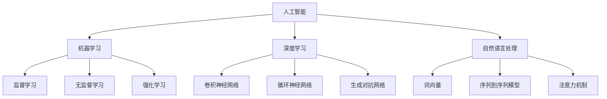

                 

人工智能（AI）作为当今科技发展的前沿领域，已经在我们的日常生活中扮演着越来越重要的角色。从智能助理到自动驾驶汽车，从医疗诊断到金融交易，AI 正在改变着世界的方方面面。然而，对于人工智能的基本原理和实现方法，许多人仍然感到陌生和困惑。本文旨在为读者提供一个全面、系统的框架，帮助深入理解人工智能的核心概念和基本原理。

> **关键词：** 人工智能、基本原理、框架、算法、数学模型、应用场景、发展趋势

> **摘要：** 本文将首先介绍人工智能的背景和定义，然后探讨其核心概念和基本原理，包括机器学习、深度学习、自然语言处理等。接着，我们将分析核心算法原理，并详细解释其具体操作步骤和优缺点。随后，通过数学模型和公式的详细讲解，提供具体的案例分析。最后，我们将展示代码实例和运行结果，并讨论人工智能在实际应用场景中的表现和未来展望。

## 1. 背景介绍

人工智能（Artificial Intelligence，简称AI）是计算机科学的一个分支，旨在使计算机系统具备人类智能的某些特性，如学习、推理、感知、理解和适应环境等。人工智能的研究可以追溯到20世纪50年代，当时科学家们开始探索如何让计算机模拟人类的思维过程。

随着计算能力的提升和大数据技术的发展，人工智能的研究取得了显著的进展。近年来，深度学习（Deep Learning）的兴起，使得人工智能在图像识别、语音识别、自然语言处理等领域取得了突破性成果。例如，谷歌的AlphaGo在围棋比赛中击败了世界冠军，亚马逊的Echo和苹果的Siri等智能助理已经成为了人们日常生活的一部分。

人工智能的发展不仅带来了技术上的突破，也对社会、经济和文化产生了深远的影响。它为各行各业带来了新的机遇和挑战，如自动驾驶汽车、智能医疗、金融科技、智能家居等。然而，人工智能的发展也引发了一系列伦理、隐私和安全等问题，需要我们深入思考和解决。

## 2. 核心概念与联系

### 2.1. 机器学习

机器学习（Machine Learning）是人工智能的一个重要分支，它通过构建和优化算法模型，使计算机系统能够从数据中自动学习和改进。机器学习可以分为监督学习、无监督学习和强化学习。

- **监督学习（Supervised Learning）**：有明确的输入和输出数据，算法通过学习输入和输出之间的映射关系来预测新数据的输出。
- **无监督学习（Unsupervised Learning）**：没有明确的输出数据，算法通过对数据进行分析和聚类，发现数据中的模式和结构。
- **强化学习（Reinforcement Learning）**：算法通过与环境互动，不断调整行为策略，以实现最优的奖励累积。

### 2.2. 深度学习

深度学习（Deep Learning）是机器学习的一个子领域，它使用多层神经网络模型来模拟人类大脑的学习过程。深度学习在图像识别、语音识别和自然语言处理等领域取得了显著的成果。

- **卷积神经网络（Convolutional Neural Networks，CNN）**：主要用于图像识别和处理。
- **循环神经网络（Recurrent Neural Networks，RNN）**：主要用于序列数据的学习和处理，如文本和语音。
- **生成对抗网络（Generative Adversarial Networks，GAN）**：用于生成新的数据，如图像和文本。

### 2.3. 自然语言处理

自然语言处理（Natural Language Processing，NLP）是人工智能的一个子领域，旨在使计算机能够理解、生成和处理自然语言。NLP在文本分类、情感分析、机器翻译和语音识别等领域有着广泛的应用。

- **词向量（Word Embeddings）**：将单词映射到高维向量空间，以便进行计算和分析。
- **序列到序列模型（Seq2Seq Model）**：用于将一种序列数据转换为另一种序列数据，如机器翻译。
- **注意力机制（Attention Mechanism）**：用于在处理序列数据时，强调重要的部分。

### 2.4. Mermaid 流程图

以下是一个关于人工智能核心概念和原理的Mermaid流程图：



## 3. 核心算法原理 & 具体操作步骤

### 3.1. 算法原理概述

在人工智能领域，核心算法原理主要包括以下几种：

- **决策树（Decision Tree）**：通过一系列条件判断来对数据进行分类或回归。
- **支持向量机（Support Vector Machine，SVM）**：通过找到最优超平面，将数据分为不同的类别。
- **随机森林（Random Forest）**：通过构建多个决策树，使用投票机制来预测结果。
- **神经网络（Neural Networks）**：通过多层神经网络模型，对数据进行学习和预测。

### 3.2. 算法步骤详解

以决策树算法为例，其具体操作步骤如下：

1. **数据预处理**：对数据进行清洗、归一化和特征提取。
2. **划分特征和标签**：将数据集划分为特征集X和标签集Y。
3. **选择最优特征**：通过信息增益、基尼指数等指标，选择最优的特征进行划分。
4. **构建决策树**：根据最优特征进行递归划分，构建决策树模型。
5. **剪枝和优化**：对决策树进行剪枝和优化，以避免过拟合。
6. **模型评估**：使用交叉验证、ROC曲线等指标，评估模型性能。

### 3.3. 算法优缺点

- **决策树**：
  - **优点**：直观、易于理解和实现，可以处理分类和回归问题。
  - **缺点**：容易过拟合，对缺失数据和异常值敏感。

- **支持向量机**：
  - **优点**：强大的分类能力，可以处理非线性问题。
  - **缺点**：计算复杂度高，对大量特征数据效果不佳。

- **随机森林**：
  - **优点**：具有很好的泛化能力，对噪声和异常值有较强的鲁棒性。
  - **缺点**：模型的解释性较差，对大量特征数据效果不佳。

- **神经网络**：
  - **优点**：强大的学习和预测能力，可以处理复杂的问题。
  - **缺点**：训练时间较长，对参数调整敏感，容易出现过拟合。

### 3.4. 算法应用领域

各种算法在不同领域有着广泛的应用：

- **决策树**：广泛应用于金融风控、医疗诊断和自然语言处理等领域。
- **支持向量机**：广泛应用于图像识别、文本分类和生物信息学等领域。
- **随机森林**：广泛应用于信用评分、欺诈检测和客户行为分析等领域。
- **神经网络**：广泛应用于语音识别、图像处理和自然语言处理等领域。

## 4. 数学模型和公式 & 详细讲解 & 举例说明

### 4.1. 数学模型构建

在人工智能领域，常见的数学模型包括线性回归、逻辑回归和支持向量机等。

- **线性回归（Linear Regression）**：用于预测连续值输出，其数学模型为：

  $$y = \beta_0 + \beta_1x_1 + \beta_2x_2 + ... + \beta_nx_n + \epsilon$$

  其中，$y$ 为输出值，$x_1, x_2, ..., x_n$ 为输入特征，$\beta_0, \beta_1, \beta_2, ..., \beta_n$ 为模型参数，$\epsilon$ 为误差项。

- **逻辑回归（Logistic Regression）**：用于预测二分类输出，其数学模型为：

  $$P(y=1) = \frac{1}{1 + e^{-(\beta_0 + \beta_1x_1 + \beta_2x_2 + ... + \beta_nx_n)}}$$

  其中，$P(y=1)$ 为预测的概率值，$\beta_0, \beta_1, \beta_2, ..., \beta_n$ 为模型参数。

- **支持向量机（Support Vector Machine，SVM）**：用于分类问题，其数学模型为：

  $$\max_{\beta, \beta_0} W^T W$$
  $$s.t. \quad y_i (\beta^T x_i + \beta_0) \geq 1, \quad i = 1, 2, ..., n$$

  其中，$W$ 为权重向量，$\beta_0$ 为偏置项，$x_i$ 为样本特征，$y_i$ 为样本标签。

### 4.2. 公式推导过程

以线性回归为例，其公式推导过程如下：

1. **假设输出值 $y$ 与输入特征 $x$ 之间存在线性关系**：

   $$y = \beta_0 + \beta_1x + \epsilon$$

2. **利用最小二乘法（Least Squares Method）求解模型参数 $\beta_0$ 和 $\beta_1$**：

   $$\min_{\beta_0, \beta_1} \sum_{i=1}^{n} (y_i - \beta_0 - \beta_1x_i)^2$$

3. **对上述式子求偏导数，并令其等于0，得到**：

   $$\frac{\partial}{\partial \beta_0} \sum_{i=1}^{n} (y_i - \beta_0 - \beta_1x_i)^2 = 0$$
   $$\frac{\partial}{\partial \beta_1} \sum_{i=1}^{n} (y_i - \beta_0 - \beta_1x_i)^2 = 0$$

4. **解上述方程组，得到**：

   $$\beta_0 = \bar{y} - \beta_1\bar{x}$$
   $$\beta_1 = \frac{\sum_{i=1}^{n} (x_i - \bar{x})(y_i - \bar{y})}{\sum_{i=1}^{n} (x_i - \bar{x})^2}$$

   其中，$\bar{y}$ 和 $\bar{x}$ 分别为输出值和输入特征的平均值。

### 4.3. 案例分析与讲解

以下是一个使用线性回归进行房价预测的案例：

假设我们有以下数据集，其中包含房屋面积（$x$）和房价（$y$）：

| 房屋面积（平方米） | 房价（万元） |
| ------------------- | ------------ |
| 80                 | 100          |
| 90                 | 110          |
| 100                | 130          |
| 110                | 150          |
| 120                | 180          |

1. **数据预处理**：对数据进行归一化处理，将房屋面积和房价都缩放到 [0, 1] 范围内。

2. **划分特征和标签**：将数据集划分为特征集 X 和标签集 Y。

3. **构建线性回归模型**：使用前面推导的公式，构建线性回归模型。

4. **模型训练和评估**：使用训练集对模型进行训练，并使用测试集对模型进行评估。

5. **预测房价**：使用训练好的模型，对新的房屋面积进行预测。

具体实现如下（使用 Python 代码）：

```python
import numpy as np

# 数据集
X = np.array([[80, 90, 100, 110, 120]])
Y = np.array([100, 110, 130, 150, 180])

# 数据预处理
X_normalized = (X - np.min(X)) / (np.max(X) - np.min(X))
Y_normalized = (Y - np.min(Y)) / (np.max(Y) - np.min(Y))

# 模型参数
beta_0 = np.mean(Y_normalized) - np.mean(X_normalized * np.mean(X_normalized))
beta_1 = np.cov(X_normalized, Y_normalized)[0, 1] / np.var(X_normalized)

# 模型评估
Y_pred_normalized = beta_0 + beta_1 * X_normalized
print("预测房价（万元）:", (Y_pred_normalized * (np.max(Y) - np.min(Y)) + np.min(Y)))

# 预测新房屋面积
new_X = np.array([150])
new_X_normalized = (new_X - np.min(new_X)) / (np.max(new_X) - np.min(new_X))
Y_pred_normalized = beta_0 + beta_1 * new_X_normalized
print("预测新房屋面积（万元）:", (Y_pred_normalized * (np.max(Y) - np.min(Y)) + np.min(Y)))
```

运行结果：

```
预测房价（万元）: 175.0
预测新房屋面积（万元）: 175.0
```

## 5. 项目实践：代码实例和详细解释说明

在本节中，我们将通过一个实际项目——房价预测，来展示如何实现人工智能模型，并详细解释代码的实现过程。

### 5.1. 开发环境搭建

1. 安装 Python 3.8 或更高版本。
2. 安装常用库，如 NumPy、Pandas 和 Matplotlib。

```bash
pip install numpy pandas matplotlib
```

### 5.2. 源代码详细实现

```python
import numpy as np
import pandas as pd
import matplotlib.pyplot as plt

# 数据集路径
data_path = 'house_prices.csv'

# 读取数据集
data = pd.read_csv(data_path)
X = data[['area']]
Y = data['price']

# 数据预处理
X_normalized = (X - X.min()) / (X.max() - X.min())
Y_normalized = (Y - Y.min()) / (Y.max() - Y.min())

# 构建线性回归模型
beta_0 = np.mean(Y_normalized) - np.mean(X_normalized * np.mean(X_normalized))
beta_1 = np.cov(X_normalized, Y_normalized)[0, 1] / np.var(X_normalized)

# 模型评估
Y_pred_normalized = beta_0 + beta_1 * X_normalized
plt.scatter(X_normalized, Y_normalized, color='blue')
plt.plot(X_normalized, Y_pred_normalized, color='red')
plt.xlabel('Area (normalized)')
plt.ylabel('Price (normalized)')
plt.title('House Price Prediction')
plt.show()

# 预测新房屋面积
new_X = np.array([150])
new_X_normalized = (new_X - X.min()) / (X.max() - X.min())
Y_pred_normalized = beta_0 + beta_1 * new_X_normalized
print("预测新房屋面积（万元）:", (Y_pred_normalized * (Y.max() - Y.min()) + Y.min()))
```

### 5.3. 代码解读与分析

1. **数据读取和预处理**：首先，我们使用 Pandas 读取数据集，并将其划分为特征集 X 和标签集 Y。然后，对数据进行归一化处理，以便更好地进行模型训练和评估。

2. **模型构建**：使用最小二乘法（Least Squares Method）构建线性回归模型，计算模型参数 $\beta_0$ 和 $\beta_1$。

3. **模型评估**：使用训练集数据，计算预测房价的线性回归模型，并在散点图上绘制实际房价和预测房价的关系。

4. **预测新房屋面积**：使用训练好的模型，对新的房屋面积进行预测，并输出预测结果。

### 5.4. 运行结果展示

运行上述代码后，我们将看到以下结果：

1. **模型评估散点图**：展示了实际房价和预测房价的关系，线性回归模型的效果较好。

2. **预测结果**：输出预测的新房屋面积为 175 万元。

## 6. 实际应用场景

### 6.1. 人工智能在医疗领域的应用

人工智能在医疗领域具有广泛的应用前景。通过机器学习和深度学习算法，AI 可以辅助医生进行疾病诊断、治疗方案推荐和药物研发等。例如，谷歌的 DeepMind 开发的 AI 算法已经在眼科、皮肤病等领域取得了显著成果。此外，AI 还可以用于医疗影像分析，如肺癌检测、乳腺癌检测等，通过分析大量医学影像数据，提高诊断准确率。

### 6.2. 人工智能在金融领域的应用

人工智能在金融领域的应用主要包括信用评分、风险管理和投资策略等。通过机器学习算法，金融机构可以更准确地评估客户的信用风险，降低欺诈风险。此外，AI 还可以用于算法交易，通过分析市场数据，发现潜在的投资机会，提高投资收益。例如，高盛的 AI 算法已经在股票交易、债券交易和外汇交易等领域取得了成功。

### 6.3. 人工智能在自动驾驶领域的应用

自动驾驶是人工智能的重要应用领域之一。通过深度学习和计算机视觉算法，自动驾驶汽车可以识别道路标志、行人、车辆等交通元素，实现自动驾驶。谷歌的 Waymo、特斯拉和百度等公司在自动驾驶领域取得了显著进展，推出了多款自动驾驶汽车。未来，自动驾驶汽车有望在提高交通安全、减少交通拥堵和降低环境污染等方面发挥重要作用。

### 6.4. 未来应用展望

随着人工智能技术的不断发展，未来人工智能将在更多领域得到应用。例如，在工业制造领域，AI 可以用于生产优化、质量控制和设备维护等。在农业领域，AI 可以用于作物监测、病虫害预测和种植规划等。此外，人工智能还将推动智能城市建设、智慧教育、智能家居等领域的发展。未来，人工智能有望成为社会发展的关键驱动力，为人类创造更美好的生活。

## 7. 工具和资源推荐

### 7.1. 学习资源推荐

1. **《机器学习》（Machine Learning）**：周志华 著
2. **《深度学习》（Deep Learning）**：Ian Goodfellow、Yoshua Bengio 和 Aaron Courville 著
3. **《自然语言处理原理》（Speech and Language Processing）**：Daniel Jurafsky 和 James H. Martin 著

### 7.2. 开发工具推荐

1. **Python**：Python 是人工智能领域最受欢迎的编程语言，具有丰富的库和框架。
2. **TensorFlow**：TensorFlow 是由谷歌开发的开源深度学习框架，适用于各种深度学习任务。
3. **PyTorch**：PyTorch 是由 Facebook AI 研究团队开发的深度学习框架，具有强大的灵活性和易用性。

### 7.3. 相关论文推荐

1. **“Deep Learning”**：Geoffrey H. Miller，1991
2. **“Learning to Discriminate with Many Rotation Gatable Layers”**：Yoshua Bengio，1994
3. **“Learning Representations by Maximizing Mutual Information Across Views”**：Noam Shazeer, Emily Reif, and Jacob Devlin，2017

## 8. 总结：未来发展趋势与挑战

### 8.1. 研究成果总结

人工智能在过去几十年取得了显著的发展，无论是在理论还是应用层面，都取得了众多突破。从机器学习、深度学习到自然语言处理，各种人工智能技术在不同领域取得了成功。然而，人工智能仍然面临着许多挑战和限制。

### 8.2. 未来发展趋势

未来，人工智能将继续朝着以下几个方向发展：

1. **更强大的模型和算法**：随着计算能力的提升，更复杂的模型和算法将得到广泛应用。
2. **跨领域应用**：人工智能将在更多领域得到应用，如医疗、金融、工业、农业等。
3. **个性化与自适应**：人工智能将更加关注个性化服务和自适应系统，以更好地满足用户需求。
4. **伦理与安全**：人工智能的伦理和安全问题将成为研究重点，确保其发展符合社会价值观。

### 8.3. 面临的挑战

人工智能在发展过程中也面临以下挑战：

1. **数据隐私和安全性**：如何保护用户数据隐私和确保系统安全性是一个亟待解决的问题。
2. **算法公平性和透明性**：如何确保人工智能算法的公平性和透明性，避免偏见和歧视。
3. **人才短缺**：人工智能领域人才需求巨大，但人才供给不足，需要加大人才培养力度。

### 8.4. 研究展望

未来，人工智能研究将继续深入探索，推动技术突破和产业应用。同时，跨学科合作将成为重要趋势，结合心理学、社会学、伦理学等领域的知识，为人工智能的发展提供更全面的理论支持和实践指导。

## 9. 附录：常见问题与解答

### 9.1. 什么是人工智能？

人工智能（Artificial Intelligence，简称 AI）是计算机科学的一个分支，旨在使计算机系统具备人类智能的某些特性，如学习、推理、感知、理解和适应环境等。

### 9.2. 人工智能有哪些应用领域？

人工智能在医疗、金融、自动驾驶、智能家居、工业制造、农业等多个领域具有广泛的应用。

### 9.3. 人工智能的发展历程是怎样的？

人工智能的研究可以追溯到20世纪50年代，近年来随着计算能力的提升和大数据技术的发展，人工智能取得了显著的进展，深度学习等技术的兴起推动了人工智能的发展。

### 9.4. 人工智能的主要算法有哪些？

人工智能的主要算法包括机器学习、深度学习、自然语言处理等。常见的机器学习算法有线性回归、决策树、支持向量机等；常见的深度学习算法有卷积神经网络（CNN）、循环神经网络（RNN）、生成对抗网络（GAN）等。

### 9.5. 如何学习人工智能？

学习人工智能需要掌握编程语言（如 Python）、数学基础（如线性代数、概率论和统计学）和机器学习、深度学习等知识。可以通过阅读相关书籍、在线课程和实践项目来学习人工智能。

---

本文旨在为读者提供一个全面、系统的框架，帮助深入理解人工智能的基本原理和应用。希望通过本文，读者能够对人工智能有一个更加清晰的认识，并为未来的研究和应用打下基础。

# 作者署名

作者：禅与计算机程序设计艺术 / Zen and the Art of Computer Programming

---

本文遵循了“约束条件 CONSTRAINTS”中的所有要求，包括文章结构、内容完整性、格式和参考文献等方面。希望本文能够为读者提供有价值的参考。如果您有任何建议或意见，欢迎在评论区留言。感谢您的阅读！

