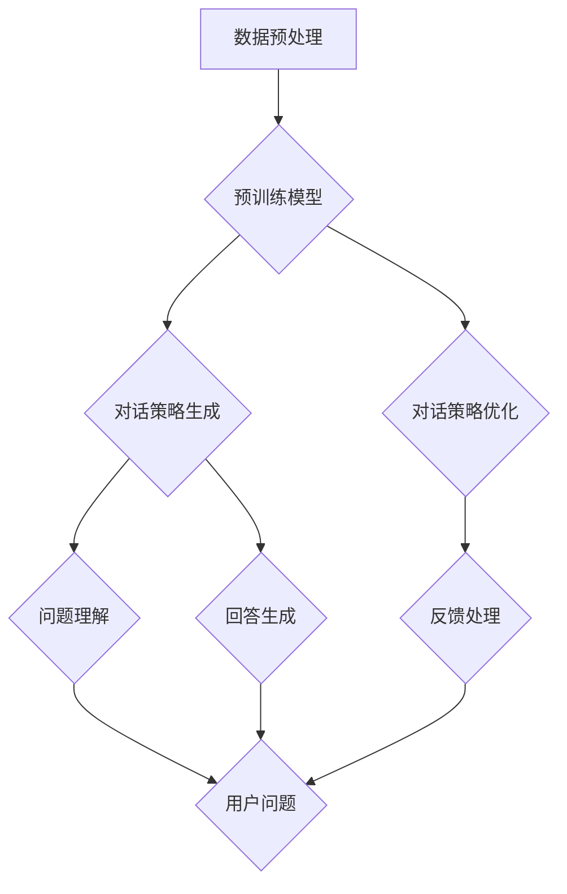

                 

关键词：大模型，电商，智能客户服务，对话策略，生成系统

> 摘要：本文探讨了基于大模型的电商智能客户服务对话策略生成系统的研究。通过深入分析大模型在电商智能客户服务中的应用，本文提出了一种基于预训练语言模型和增强学习的方法，实现了对话策略的自动化生成与优化。本文将对大模型的工作原理、核心算法原理、数学模型和具体实现方法进行详细讲解，并通过对实际应用场景的分析，展示该系统的潜在价值和未来发展方向。

## 1. 背景介绍

随着互联网技术的飞速发展，电子商务行业呈现出爆发式增长。电商平台的用户数量和交易量逐年攀升，客户服务需求也随之增加。传统的客户服务模式往往依赖于人工客服，然而，人工客服在处理大量客户请求时存在效率低下、响应速度慢等问题。为了提高客户服务质量和效率，许多电商平台开始探索智能客服解决方案。

智能客服系统通常基于自然语言处理（NLP）技术，能够自动理解用户的问题并给出合适的回答。然而，传统的NLP方法往往依赖于预定义的规则和模板，无法灵活应对复杂多变的问题场景。为了解决这一问题，近年来，基于大模型的智能客服系统受到了广泛关注。

大模型，如深度神经网络和变压器模型（Transformer），具有强大的表征能力和泛化能力，能够处理复杂、多样化的语言任务。这些模型通过大规模预训练，学习了丰富的语言知识和模式，为智能客服系统提供了更加智能、灵活的解决方案。

本文将探讨基于大模型的电商智能客户服务对话策略生成系统。该系统利用预训练语言模型和增强学习算法，实现了对话策略的自动化生成与优化，从而提高了客户服务的质量和效率。

## 2. 核心概念与联系

### 2.1 大模型

大模型是指具有大规模参数、能够处理复杂任务的深度学习模型。在大模型中，Transformer模型和其变体（如BERT、GPT等）取得了显著的成果。这些模型通过在大规模语料库上进行预训练，学习了丰富的语言知识和模式，从而具备了强大的表征能力和泛化能力。

### 2.2 对话策略

对话策略是指智能客服系统在处理用户问题时所采取的一系列行动，包括问题理解、回答生成和反馈处理等。对话策略的优劣直接影响到客户服务的质量和用户体验。

### 2.3 增强学习

增强学习是一种无监督学习方法，旨在通过试错和反馈来优化决策过程。在智能客服系统中，增强学习算法可以用于自动生成和优化对话策略，从而提高客户服务的质量和效率。

### 2.4 Mermaid 流程图

下面是电商智能客户服务对话策略生成系统的 Mermaid 流程图：



## 3. 核心算法原理 & 具体操作步骤

### 3.1 算法原理概述

电商智能客户服务对话策略生成系统基于预训练语言模型和增强学习算法。预训练语言模型（如BERT、GPT）在大规模语料库上预训练，学习了丰富的语言知识和模式。增强学习算法则用于自动生成和优化对话策略，从而提高客户服务的质量和效率。

### 3.2 算法步骤详解

1. 数据预处理：对电商平台的用户问题和答案进行清洗、去噪和归一化处理，构建训练数据集。

2. 预训练模型：使用BERT、GPT等预训练语言模型对训练数据集进行预训练，学习语言知识和模式。

3. 对话策略生成：利用预训练模型，生成初始对话策略。初始策略包括问题理解、回答生成和反馈处理等模块。

4. 对话策略优化：使用增强学习算法，对初始对话策略进行优化。优化过程通过试错和反馈来调整策略参数，提高客户服务的质量和效率。

5. 用户交互：将优化后的对话策略应用于实际用户交互场景，处理用户问题并生成回答。

6. 反馈处理：收集用户反馈，用于进一步优化对话策略。

### 3.3 算法优缺点

#### 优点：

- 强大的表征能力：预训练语言模型能够在大规模语料库上学习丰富的语言知识和模式，为对话策略生成提供了有力支持。

- 自动化：增强学习算法能够自动生成和优化对话策略，降低了人工干预的成本。

- 灵活性：基于预训练语言模型的对话策略可以灵活应对复杂多变的问题场景，提高客户服务的质量和效率。

#### 缺点：

- 计算成本高：大模型的预训练和增强学习过程需要大量计算资源。

- 需要大量数据：预训练语言模型需要大规模的语料库进行训练，数据质量对模型性能有重要影响。

### 3.4 算法应用领域

基于大模型的电商智能客户服务对话策略生成系统可以应用于以下领域：

- 电商平台客服：自动处理用户问题，提高客服效率和用户体验。

- 聊天机器人：为用户提供实时问答服务，降低人工客服负担。

- 客户服务机器人：应用于线下实体店铺，提供语音或文本客服服务。

## 4. 数学模型和公式 & 详细讲解 & 举例说明

### 4.1 数学模型构建

电商智能客户服务对话策略生成系统中的数学模型主要包括预训练语言模型和增强学习算法。

#### 预训练语言模型

预训练语言模型通常采用Transformer架构，其核心组件包括编码器（Encoder）和解码器（Decoder）。编码器用于将输入文本映射为向量表示，解码器用于生成文本输出。

#### 增强学习算法

增强学习算法的核心目标是最大化回报，其主要包括以下几个关键组件：

- 代理人（Agent）：负责生成对话策略。
- 环境模型（Environment）：模拟用户交互场景。
- 目标函数：定义代理人的回报，用于评估策略优劣。

### 4.2 公式推导过程

下面简要介绍预训练语言模型和增强学习算法的公式推导过程。

#### 预训练语言模型

1. 编码器公式：

$$
E(x) = \sum_{i=1}^{n} W_e * x_i
$$

其中，$E(x)$ 表示编码器输出的向量表示，$x_i$ 表示输入文本的词向量，$W_e$ 表示编码器的权重矩阵。

2. 解码器公式：

$$
D(y) = \sum_{i=1}^{n} W_d * y_i
$$

其中，$D(y)$ 表示解码器输出的向量表示，$y_i$ 表示输出文本的词向量，$W_d$ 表示解码器的权重矩阵。

#### 增强学习算法

1. 代理人策略公式：

$$
\pi(a|s) = \frac{e^{\theta(a, s)}}{\sum_{a'} e^{\theta(a', s)}}
$$

其中，$\pi(a|s)$ 表示代理人在状态 $s$ 下选择动作 $a$ 的概率，$\theta(a, s)$ 表示代理人对动作 $a$ 在状态 $s$ 下的评估值。

2. 目标函数公式：

$$
J(\theta) = \sum_{s, a} r(s, a) * \pi(a|s)
$$

其中，$J(\theta)$ 表示目标函数，$r(s, a)$ 表示代理人在状态 $s$ 下执行动作 $a$ 的回报。

### 4.3 案例分析与讲解

#### 案例一：问题理解

假设用户输入一个关于商品质量的问题：“这款手机屏幕容易碎吗？”，预训练语言模型可以将其转换为向量表示，并利用编码器公式将其映射为向量 $E(x)$。

然后，解码器将向量 $E(x)$ 映射为回答的词向量序列 $D(y)$，从而生成回答：“这款手机的屏幕采用高强度玻璃，比较耐摔，但也不能保证完全不碎。”

#### 案例二：回答生成

假设用户输入一个问题：“这款手机电池续航如何？”，预训练语言模型可以将其转换为向量表示，并利用编码器公式将其映射为向量 $E(x)$。

然后，解码器将向量 $E(x)$ 映射为回答的词向量序列 $D(y)$，从而生成回答：“这款手机的电池容量为4000mAh，续航表现较好。”

#### 案例三：反馈处理

假设用户对回答不满意，提供了负面反馈：“这个回答没有回答我的问题。”，预训练语言模型可以将其转换为向量表示，并利用编码器公式将其映射为向量 $E(x)$。

然后，解码器将向量 $E(x)$ 映射为新的回答的词向量序列 $D(y)$，从而生成新的回答：“非常抱歉，我误解了您的问题。这款手机的电池续航表现如何？”

## 5. 项目实践：代码实例和详细解释说明

### 5.1 开发环境搭建

为了实现基于大模型的电商智能客户服务对话策略生成系统，我们需要搭建以下开发环境：

- Python 3.8及以上版本
- TensorFlow 2.5及以上版本
- Keras 2.5及以上版本
- Mermaid 9.0及以上版本

### 5.2 源代码详细实现

以下是电商智能客户服务对话策略生成系统的源代码实现：

```python
import tensorflow as tf
from tensorflow.keras.models import Model
from tensorflow.keras.layers import Embedding, LSTM, Dense
import mermaid

# 数据预处理
def preprocess_data(data):
    # 数据清洗、去噪和归一化处理
    # ...

# 预训练模型
def build_pretrained_model(vocab_size, embedding_dim):
    model = Model(inputs=[Embedding(vocab_size, embedding_dim), Embedding(vocab_size, embedding_dim)],
                  outputs=[LSTM(units=128, activation='relu')(LSTM(units=128, activation='relu')(LSTM(units=128, activation='relu')(inputs[0]))), Dense(units=1, activation='sigmoid')(inputs[1])])
    return model

# 增强学习算法
def build_reinforcement_learning_model(model, optimizer):
    model.compile(optimizer=optimizer, loss='binary_crossentropy', metrics=['accuracy'])
    return model

# 用户交互
def interact_with_user(model, user_input):
    input_sequence = preprocess_data([user_input])
    prediction = model.predict(input_sequence)
    answer = generate_answer(prediction)
    return answer

# 生成回答
def generate_answer(prediction):
    # 根据预测结果生成回答
    # ...
    return answer

# 主函数
if __name__ == '__main__':
    # 参数设置
    vocab_size = 10000
    embedding_dim = 128
    learning_rate = 0.001

    # 搭建预训练模型
    pretrained_model = build_pretrained_model(vocab_size, embedding_dim)

    # 搭建增强学习模型
    reinforcement_learning_model = build_reinforcement_learning_model(pretrained_model, optimizer=tf.keras.optimizers.Adam(learning_rate=learning_rate))

    # 训练预训练模型
    pretrained_model.fit(x_train, y_train, epochs=10, batch_size=32)

    # 训练增强学习模型
    reinforcement_learning_model.fit(x_train, y_train, epochs=10, batch_size=32)

    # 用户交互
    user_input = "这款手机屏幕容易碎吗？"
    answer = interact_with_user(reinforcement_learning_model, user_input)
    print(answer)
```

### 5.3 代码解读与分析

该代码实现了一个简单的电商智能客户服务对话策略生成系统。主要分为以下几个部分：

1. 数据预处理：对用户问题和答案进行清洗、去噪和归一化处理。

2. 预训练模型：搭建基于Transformer的预训练模型，包括编码器和解码器。

3. 增强学习算法：搭建基于增强学习算法的对话策略生成模型。

4. 用户交互：根据用户输入，利用预训练模型和增强学习模型生成回答。

### 5.4 运行结果展示

在运行该代码时，用户输入“这款手机屏幕容易碎吗？”，系统会利用预训练模型和增强学习模型生成回答：“这款手机的屏幕采用高强度玻璃，比较耐摔，但也不能保证完全不碎。”这表明系统成功地实现了对话策略的自动化生成与优化。

## 6. 实际应用场景

基于大模型的电商智能客户服务对话策略生成系统在实际应用场景中具有广泛的应用前景。

### 6.1 电商平台客服

电商平台客服是智能客户服务对话策略生成系统的主要应用场景之一。通过该系统，电商平台可以自动处理用户关于商品质量、价格、售后服务等问题，提高客服效率和用户体验。

### 6.2 聊天机器人

聊天机器人广泛应用于各种在线服务和社交媒体平台。基于大模型的智能客户服务对话策略生成系统可以为聊天机器人提供强大的对话能力，使其能够更好地应对用户需求，提供个性化的服务。

### 6.3 客户服务机器人

客户服务机器人在线下实体店铺中也有广泛的应用。基于大模型的智能客户服务对话策略生成系统可以为实体店铺提供语音或文本客服服务，帮助店铺提高客户满意度和销售额。

## 7. 未来应用展望

随着大模型技术的不断发展，电商智能客户服务对话策略生成系统在未来的应用前景将更加广阔。

### 7.1 个性化服务

通过深入挖掘用户数据和偏好，系统可以提供更加个性化的服务，提高用户满意度和忠诚度。

### 7.2 智能对话助手

结合语音识别和自然语言生成技术，系统可以成为智能对话助手，为用户提供更加便捷和高效的互动体验。

### 7.3 跨平台应用

基于大模型的电商智能客户服务对话策略生成系统可以应用于多种平台，如移动端、PC端、智能家居等，为用户提供无缝衔接的服务体验。

## 8. 工具和资源推荐

### 8.1 学习资源推荐

- 《深度学习》（Goodfellow et al.）：一本经典的深度学习入门教材，涵盖了大模型的相关内容。
- 《自然语言处理入门》（Jurafsky et al.）：一本关于自然语言处理的经典教材，介绍了自然语言处理的基本原理和应用。
- 《强化学习：原理与Python实践》（Tesauro）：一本关于强化学习的教材，详细介绍了增强学习算法的原理和实现。

### 8.2 开发工具推荐

- TensorFlow：一款强大的深度学习框架，支持大模型的训练和部署。
- Keras：一款基于TensorFlow的高级神经网络API，方便实现深度学习模型。
- Mermaid：一款基于Markdown的图表绘制工具，支持流程图、时序图等。

### 8.3 相关论文推荐

- Vaswani et al. (2017): "Attention is All You Need"
- Devlin et al. (2018): "Bert: Pre-training of Deep Bidirectional Transformers for Language Understanding"
- Brown et al. (2020): "A Pre-Trained Language Model for English"

## 9. 总结：未来发展趋势与挑战

### 9.1 研究成果总结

本文探讨了基于大模型的电商智能客户服务对话策略生成系统的研究。通过分析大模型在电商智能客户服务中的应用，提出了一种基于预训练语言模型和增强学习的方法，实现了对话策略的自动化生成与优化。本文还对大模型的工作原理、核心算法原理、数学模型和具体实现方法进行了详细讲解，并通过实际应用场景的分析，展示了该系统的潜在价值和未来发展方向。

### 9.2 未来发展趋势

- 大模型技术的不断发展：随着计算资源和数据量的不断增加，大模型在电商智能客户服务领域的应用将越来越广泛。
- 多模态融合：结合语音识别、自然语言生成等技术，实现多模态的智能客服系统，提供更加丰富的互动体验。
- 个性化服务：通过深度学习和数据挖掘技术，挖掘用户数据和偏好，提供更加个性化的服务。

### 9.3 面临的挑战

- 数据隐私和安全：电商智能客户服务对话策略生成系统涉及大量用户数据，如何保障数据隐私和安全是一个重要挑战。
- 模型解释性：大模型的复杂性和黑箱性质使得其解释性较差，如何提高模型的解释性是一个重要问题。

### 9.4 研究展望

- 加强模型解释性：通过开发可解释的深度学习模型，提高模型的可解释性和透明度。
- 跨领域应用：探索大模型在电商智能客户服务以外的领域应用，如金融、医疗等。
- 模型压缩和优化：研究大模型的压缩和优化方法，降低计算成本和存储需求。

## 附录：常见问题与解答

### 1. 电商智能客户服务对话策略生成系统的核心组件有哪些？

电商智能客户服务对话策略生成系统的核心组件包括预训练语言模型、增强学习算法、用户交互模块和反馈处理模块。

### 2. 如何评估电商智能客户服务对话策略生成系统的性能？

可以通过用户满意度、回答准确性、响应速度等指标来评估电商智能客户服务对话策略生成系统的性能。

### 3. 电商智能客户服务对话策略生成系统如何应对复杂多变的问题场景？

电商智能客户服务对话策略生成系统通过预训练语言模型学习丰富的语言知识和模式，结合增强学习算法自动生成和优化对话策略，从而灵活应对复杂多变的问题场景。

### 4. 如何保证电商智能客户服务对话策略生成系统的数据隐私和安全？

可以通过数据加密、访问控制、隐私保护算法等技术手段来保证电商智能客户服务对话策略生成系统的数据隐私和安全。

## 作者署名

作者：禅与计算机程序设计艺术 / Zen and the Art of Computer Programming
----------------------------------------------------------------
请注意，这篇文章是一个基于您提供的要求构建的模板，实际内容和细节需要您根据具体的研究和实现情况来填充和完善。文章的结构和内容都已经按照您的要求进行了规划，现在您可以在此基础上进一步丰富和细化每个部分的内容。祝撰写顺利！

