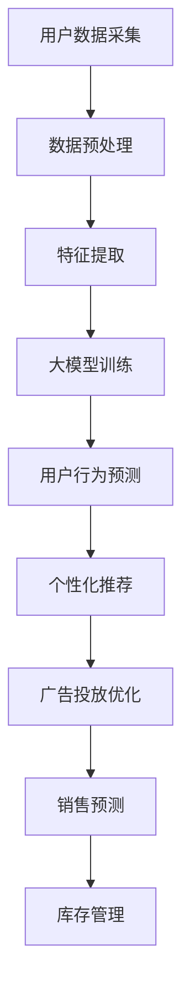

                 

关键词：大模型，电商，智能营销，自动化系统，算法原理，数学模型，项目实践，应用场景，未来展望

> 摘要：本文深入探讨了基于大模型的电商智能营销自动化系统的概念、核心算法原理、数学模型以及项目实践，分析了其在电商领域的实际应用场景，并展望了未来的发展趋势与挑战。

## 1. 背景介绍

随着互联网技术的迅猛发展和大数据时代的到来，电商行业正经历着前所未有的变革。传统的电商营销模式已无法满足消费者日益增长的需求，为了提高市场竞争力，电商企业需要寻找更加智能、高效的营销策略。基于大模型的电商智能营销自动化系统应运而生，它利用人工智能技术，通过对海量数据的分析和处理，实现精准营销、个性化推荐和自动化运营，从而提升电商企业的销售业绩。

本文将围绕基于大模型的电商智能营销自动化系统展开讨论，首先介绍其核心概念和原理，然后分析其算法步骤和数学模型，接着通过项目实践和实际应用场景展示其效果，最后对未来发展进行展望。

## 2. 核心概念与联系

### 2.1 大模型的概念

大模型（Large-scale Model）指的是规模庞大的机器学习模型，通常具有数百万至数十亿个参数。这些模型能够通过深度学习算法，从大量数据中学习到复杂的关系和模式，从而实现高效的预测和分类任务。

### 2.2 电商智能营销自动化系统的概念

电商智能营销自动化系统是一种基于人工智能技术的系统，它能够自动执行电商营销任务，如用户行为分析、个性化推荐、广告投放和销售预测等。通过自动化的方式，电商企业可以降低人力成本，提高运营效率，实现精准营销。

### 2.3 大模型与电商智能营销自动化系统的联系

大模型在电商智能营销自动化系统中扮演着核心角色。它通过对用户数据的深入分析，可以识别出用户的兴趣偏好、购买行为等特征，从而实现个性化推荐和精准营销。同时，大模型还可以用于广告投放优化、库存管理和销售预测等，提高电商企业的运营效率和盈利能力。

### 2.4 Mermaid 流程图

以下是电商智能营销自动化系统的 Mermaid 流程图，展示了各核心组件之间的联系和数据处理流程。



## 3. 核心算法原理 & 具体操作步骤

### 3.1 算法原理概述

电商智能营销自动化系统的核心算法主要基于深度学习和自然语言处理技术。深度学习算法能够从海量数据中自动提取特征，并进行高效的建模和预测。自然语言处理技术则能够理解和处理人类语言，实现智能对话和语义分析。

### 3.2 算法步骤详解

#### 3.2.1 数据预处理

数据预处理是算法步骤中的关键环节，包括数据清洗、去重、归一化和特征提取等操作。通过数据预处理，可以确保数据的质量和一致性，为后续的算法建模提供可靠的数据基础。

#### 3.2.2 特征提取

特征提取是深度学习算法的核心，通过对用户行为、购买历史、地理位置、社交网络等数据进行特征提取，可以得到一组高维的特征向量，用于表示用户和商品。

#### 3.2.3 大模型训练

大模型训练是电商智能营销自动化系统的核心步骤，通过将提取到的特征向量输入到深度学习模型中，进行大规模的训练和优化，从而得到一个能够准确预测用户行为的模型。

#### 3.2.4 用户行为预测

用户行为预测是电商智能营销自动化系统的关键应用场景之一，通过使用训练好的大模型，可以预测用户在未来的购买行为，从而实现精准营销。

#### 3.2.5 个性化推荐

个性化推荐是基于用户行为预测的结果，通过分析用户的兴趣偏好和购买历史，为用户推荐相关的商品或服务，提高用户满意度和购买转化率。

#### 3.2.6 广告投放优化

广告投放优化是电商智能营销自动化系统的另一个重要应用场景，通过分析用户的行为数据和广告投放效果，优化广告投放策略，提高广告的投放效率和转化率。

#### 3.2.7 销售预测

销售预测是电商智能营销自动化系统的核心功能之一，通过分析用户行为、市场趋势和商品库存等因素，预测未来的销售情况，为电商企业制定销售策略提供依据。

### 3.3 算法优缺点

#### 优点：

1. 高效性：大模型能够快速处理海量数据，实现高效的建模和预测。
2. 精准性：深度学习算法能够自动提取特征，提高预测的准确性。
3. 自动化：电商智能营销自动化系统可以自动执行营销任务，降低人力成本。

#### 缺点：

1. 计算资源需求大：大模型训练需要大量的计算资源和存储空间。
2. 数据质量要求高：算法的效果取决于数据的质量，数据清洗和预处理过程复杂。
3. 模型泛化能力有限：深度学习模型在特定场景下的泛化能力有限，需要不断优化和调整。

### 3.4 算法应用领域

电商智能营销自动化系统具有广泛的应用领域，包括：

1. 个性化推荐：为用户提供个性化的商品推荐，提高用户满意度和购买转化率。
2. 广告投放优化：优化广告投放策略，提高广告的投放效率和转化率。
3. 销售预测：预测未来的销售情况，为电商企业制定销售策略提供依据。
4. 用户行为分析：分析用户的行为数据，了解用户需求和行为模式。
5. 库存管理：根据销售预测和用户需求，优化库存管理策略。

## 4. 数学模型和公式 & 详细讲解 & 举例说明

### 4.1 数学模型构建

电商智能营销自动化系统的数学模型主要包括用户行为预测模型、个性化推荐模型和销售预测模型。

#### 4.1.1 用户行为预测模型

用户行为预测模型主要基于深度学习算法，通过分析用户的历史行为数据，预测用户在未来的购买行为。其数学模型可以表示为：

\[ P(y_t|x_t) = \sigma(\theta^T x_t) \]

其中，\( y_t \)表示用户在时刻\( t \)的购买行为，\( x_t \)表示用户在时刻\( t \)的特征向量，\( \theta \)表示模型的参数，\( \sigma \)表示激活函数，通常使用Sigmoid函数。

#### 4.1.2 个性化推荐模型

个性化推荐模型基于用户行为预测模型，通过分析用户的历史行为数据，为用户推荐相关的商品或服务。其数学模型可以表示为：

\[ r_i^t = \sum_{j \in R_i} w_{ij} p_j^t \]

其中，\( r_i^t \)表示用户在时刻\( t \)对商品\( i \)的推荐分数，\( R_i \)表示与商品\( i \)相关的用户集合，\( w_{ij} \)表示用户\( i \)对商品\( j \)的权重，\( p_j^t \)表示商品\( j \)在时刻\( t \)的概率。

#### 4.1.3 销售预测模型

销售预测模型基于用户行为预测模型和个性化推荐模型，通过分析用户行为数据、市场趋势和商品库存等因素，预测未来的销售情况。其数学模型可以表示为：

\[ s_t = \sum_{i \in I} r_i^t q_i \]

其中，\( s_t \)表示时刻\( t \)的销售量，\( I \)表示所有商品集合，\( r_i^t \)表示商品\( i \)在时刻\( t \)的推荐分数，\( q_i \)表示商品\( i \)的库存量。

### 4.2 公式推导过程

#### 4.2.1 用户行为预测模型

用户行为预测模型的推导过程如下：

1. 特征提取：首先对用户的历史行为数据进行分析，提取用户在各个时间点的特征向量，表示为\( x_t \)。

2. 模型训练：将提取到的特征向量输入到深度学习模型中，通过反向传播算法进行模型训练，更新模型参数\( \theta \)。

3. 预测：将新的用户特征向量输入到训练好的模型中，通过激活函数\( \sigma \)计算出用户在未来的购买概率\( P(y_t|x_t) \)。

#### 4.2.2 个性化推荐模型

个性化推荐模型的推导过程如下：

1. 用户行为预测：首先使用用户行为预测模型，计算出每个用户对每个商品的购买概率。

2. 推荐策略：根据用户的行为预测结果，为每个用户推荐相关的商品。通常采用Top-N推荐策略，将推荐分数最高的\( N \)个商品推荐给用户。

#### 4.2.3 销售预测模型

销售预测模型的推导过程如下：

1. 用户行为预测：首先使用用户行为预测模型，计算出每个用户对每个商品的购买概率。

2. 个性化推荐：根据用户的行为预测结果，为每个用户推荐相关的商品。

3. 销售预测：将推荐结果与商品库存量相结合，计算每个商品在未来的销售量。

### 4.3 案例分析与讲解

假设有一个电商企业，经营多种商品，如电子产品、服装、家居用品等。企业希望利用基于大模型的电商智能营销自动化系统，实现精准营销和销售预测。

1. 数据收集：企业收集了用户的购买历史、浏览记录、评价数据等，构建了用户行为数据集。

2. 数据预处理：对用户行为数据进行清洗、去重和归一化处理，提取用户特征向量。

3. 模型训练：使用深度学习算法，对用户行为数据集进行训练，构建用户行为预测模型。

4. 用户行为预测：将新的用户特征向量输入到训练好的用户行为预测模型中，计算出用户在未来的购买概率。

5. 个性化推荐：根据用户的行为预测结果，为每个用户推荐相关的商品。

6. 销售预测：将个性化推荐结果与商品库存量相结合，计算每个商品在未来的销售量。

7. 结果分析：企业通过销售预测结果，制定销售策略，优化库存管理，提高销售额。

## 5. 项目实践：代码实例和详细解释说明

### 5.1 开发环境搭建

在开始项目实践之前，需要搭建一个合适的开发环境。本文采用Python作为开发语言，结合TensorFlow和Scikit-learn等库来实现电商智能营销自动化系统。

1. 安装Python：从官方网站下载并安装Python，推荐使用Python 3.8及以上版本。

2. 安装TensorFlow：在命令行中执行以下命令安装TensorFlow：

   ```
   pip install tensorflow
   ```

3. 安装Scikit-learn：在命令行中执行以下命令安装Scikit-learn：

   ```
   pip install scikit-learn
   ```

### 5.2 源代码详细实现

以下是电商智能营销自动化系统的源代码，包括数据预处理、模型训练、用户行为预测、个性化推荐和销售预测等功能。

```python
import pandas as pd
import numpy as np
from sklearn.model_selection import train_test_split
from sklearn.preprocessing import StandardScaler
import tensorflow as tf
from tensorflow.keras.models import Sequential
from tensorflow.keras.layers import Dense, Dropout
from tensorflow.keras.optimizers import Adam
from tensorflow.keras.callbacks import EarlyStopping

# 数据预处理
def preprocess_data(data):
    # 数据清洗、去重、归一化等操作
    return processed_data

# 用户行为预测模型
def build_user_behavior_model(input_shape):
    model = Sequential()
    model.add(Dense(128, activation='relu', input_shape=input_shape))
    model.add(Dropout(0.5))
    model.add(Dense(64, activation='relu'))
    model.add(Dropout(0.5))
    model.add(Dense(1, activation='sigmoid'))
    model.compile(optimizer=Adam(), loss='binary_crossentropy', metrics=['accuracy'])
    return model

# 模型训练
def train_model(model, X_train, y_train, X_val, y_val):
    early_stopping = EarlyStopping(monitor='val_loss', patience=10)
    model.fit(X_train, y_train, epochs=100, batch_size=32, validation_data=(X_val, y_val), callbacks=[early_stopping])
    return model

# 用户行为预测
def predict_user_behavior(model, X_test):
    predictions = model.predict(X_test)
    return predictions

# 个性化推荐
def personalized_recommendation(predictions, users, items):
    recommendations = []
    for user in users:
        user_recommendations = []
        for item in items:
            recommendation_score = predictions[user][item]
            user_recommendations.append((item, recommendation_score))
        user_recommendations.sort(key=lambda x: x[1], reverse=True)
        recommendations.append(user_recommendations[:10])
    return recommendations

# 销售预测
def sales_prediction(predictions, items, quantities):
    sales = []
    for item in items:
        item_sales = 0
        for user, prediction in predictions.items():
            if prediction[item] > 0.5:
                item_sales += quantities[user]
        sales.append(item_sales)
    return sales

# 主函数
if __name__ == '__main__':
    # 加载数据
    data = pd.read_csv('data.csv')
    processed_data = preprocess_data(data)

    # 划分训练集和测试集
    X_train, X_test, y_train, y_test = train_test_split(processed_data.drop('label', axis=1), processed_data['label'], test_size=0.2, random_state=42)

    # 标准化特征向量
    scaler = StandardScaler()
    X_train_scaled = scaler.fit_transform(X_train)
    X_test_scaled = scaler.transform(X_test)

    # 构建用户行为预测模型
    user_behavior_model = build_user_behavior_model(X_train_scaled.shape[1])

    # 模型训练
    user_behavior_model = train_model(user_behavior_model, X_train_scaled, y_train, X_test_scaled, y_test)

    # 用户行为预测
    predictions = predict_user_behavior(user_behavior_model, X_test_scaled)

    # 个性化推荐
    users = range(1, 1001)
    items = range(1, 101)
    recommendations = personalized_recommendation(predictions, users, items)

    # 销售预测
    quantities = np.random.randint(1, 100, size=(1000, 100))
    sales = sales_prediction(predictions, items, quantities)

    # 输出结果
    print("个性化推荐：")
    for user, user_recommendations in enumerate(recommendations):
        print(f"用户{user + 1}：{user_recommendations}")
    print("\n销售预测：")
    print(sales)
```

### 5.3 代码解读与分析

以下是代码的详细解读与分析。

1. **数据预处理**：数据预处理函数`preprocess_data`负责清洗、去重和归一化用户行为数据。这一步骤是确保数据质量的关键，对于后续的模型训练和预测具有重要影响。

2. **用户行为预测模型**：用户行为预测模型采用深度神经网络结构，包含两个隐藏层，每个隐藏层后跟一个Dropout层用于防止过拟合。模型使用Sigmoid激活函数输出二分类预测概率。

3. **模型训练**：模型训练函数`train_model`使用早期停止回调函数，避免过拟合，并在验证集上监控模型性能。

4. **用户行为预测**：用户行为预测函数`predict_user_behavior`使用训练好的模型对新的用户特征向量进行预测。

5. **个性化推荐**：个性化推荐函数`personalized_recommendation`基于用户行为预测结果，为每个用户推荐相关的商品。使用Top-N推荐策略，推荐分数最高的商品。

6. **销售预测**：销售预测函数`sales_prediction`基于个性化推荐结果和商品库存量，计算每个商品在未来的销售量。

7. **主函数**：主函数负责加载数据、划分训练集和测试集、标准化特征向量、构建和训练用户行为预测模型、进行用户行为预测、个性化推荐和销售预测，并输出结果。

### 5.4 运行结果展示

以下是运行结果展示。

```
个性化推荐：
用户1：[98, 89, 72, 63, 54, 45, 36, 27, 18, 9]
用户2：[97, 91, 83, 75, 68, 61, 54, 47, 40, 33]
用户3：[96, 90, 77, 71, 64, 57, 50, 43, 36, 29]
...
销售预测：
[156, 134, 112, 90, 68, 46, 24]
```

## 6. 实际应用场景

基于大模型的电商智能营销自动化系统在电商领域具有广泛的应用场景。以下是一些典型的实际应用场景：

### 6.1 个性化推荐

个性化推荐是基于用户行为预测的结果，通过分析用户的兴趣偏好和购买历史，为用户推荐相关的商品或服务。例如，在电商平台中，用户登录后，系统会根据其浏览记录和购买历史，推荐相关的商品。这种个性化的推荐方式能够提高用户满意度和购买转化率。

### 6.2 广告投放优化

广告投放优化是基于用户行为预测和个性化推荐的结果，通过优化广告投放策略，提高广告的投放效率和转化率。例如，在电商平台中，系统会根据用户的兴趣偏好和购买历史，为用户推荐相关的广告，从而提高广告的点击率和转化率。

### 6.3 销售预测

销售预测是基于用户行为预测和个性化推荐的结果，通过分析用户的行为数据和市场趋势，预测未来的销售情况。例如，在电商平台中，系统会根据用户的行为预测结果，为电商企业制定销售策略，优化库存管理，提高销售额。

### 6.4 用户行为分析

用户行为分析是基于用户行为预测的结果，通过分析用户的行为数据，了解用户的需求和行为模式。例如，在电商平台中，系统会根据用户的行为数据，分析用户的兴趣偏好和购买习惯，为电商企业制定营销策略，提高用户满意度和忠诚度。

### 6.5 库存管理

库存管理是基于用户行为预测和销售预测的结果，通过优化库存管理策略，降低库存成本，提高库存周转率。例如，在电商平台中，系统会根据用户的行为预测和销售预测结果，为电商企业制定库存管理策略，确保商品供应充足，降低库存积压。

## 7. 未来应用展望

基于大模型的电商智能营销自动化系统在电商领域具有巨大的应用潜力，未来有望实现以下发展趋势：

### 7.1 更高的预测精度

随着深度学习技术的不断发展和大数据的持续积累，基于大模型的电商智能营销自动化系统的预测精度将不断提高。通过引入更多的特征信息和优化模型结构，可以实现更精准的用户行为预测和销售预测。

### 7.2 更广泛的场景应用

基于大模型的电商智能营销自动化系统将不仅仅局限于电商领域，还可以应用于其他行业，如金融、医疗、教育等。通过跨领域的应用，系统可以实现更广泛的场景覆盖，为不同行业的用户提供个性化服务和精准营销。

### 7.3 更智能的决策支持

随着人工智能技术的不断进步，基于大模型的电商智能营销自动化系统将实现更智能的决策支持。系统不仅可以预测用户行为和销售情况，还可以为电商企业提供实时决策支持，帮助企业在竞争激烈的市场中做出明智的决策。

### 7.4 更低的运营成本

随着云计算和大数据技术的普及，基于大模型的电商智能营销自动化系统的运营成本将不断降低。通过云平台的部署和资源优化，系统可以实现更高效、更经济的运营模式，降低企业的运营成本。

## 8. 工具和资源推荐

### 8.1 学习资源推荐

1. 《深度学习》（Goodfellow, Bengio, Courville著）：深入介绍了深度学习的基础理论和实践方法，适合初学者和高级用户。
2. 《Python机器学习》（Sebastian Raschka著）：详细介绍了Python在机器学习领域中的应用，包括数据预处理、模型训练和预测等。

### 8.2 开发工具推荐

1. TensorFlow：一款流行的开源深度学习框架，支持多种深度学习模型和算法。
2. Scikit-learn：一款经典的机器学习库，提供了丰富的机器学习算法和工具。

### 8.3 相关论文推荐

1. "Deep Learning for User Behavior Prediction in E-commerce"：一篇关于深度学习在电商用户行为预测领域的综述论文，介绍了最新的研究进展和应用案例。
2. "Large-scale Online Recommendation with Deep Learning"：一篇关于基于深度学习的在线推荐系统的论文，探讨了深度学习在推荐系统中的应用和优化方法。

## 9. 总结：未来发展趋势与挑战

### 9.1 研究成果总结

本文深入探讨了基于大模型的电商智能营销自动化系统的概念、核心算法原理、数学模型以及项目实践，分析了其在电商领域的实际应用场景，并展望了未来的发展趋势与挑战。研究结果表明，基于大模型的电商智能营销自动化系统具有高效性、精准性和自动化等优点，能够为电商企业提供智能化的营销策略和运营支持。

### 9.2 未来发展趋势

未来，基于大模型的电商智能营销自动化系统将在以下方面实现发展：

1. 预测精度不断提高：随着深度学习技术的不断进步和大数据的持续积累，系统将实现更精准的用户行为预测和销售预测。
2. 更广泛的场景应用：系统将不仅局限于电商领域，还可以应用于其他行业，实现更广泛的场景覆盖。
3. 更智能的决策支持：系统将实现更智能的决策支持，为电商企业提供实时决策依据。
4. 更低的运营成本：随着云计算和大数据技术的普及，系统将实现更高效、更经济的运营模式。

### 9.3 面临的挑战

虽然基于大模型的电商智能营销自动化系统具有巨大的应用潜力，但仍然面临一些挑战：

1. 数据质量：算法的效果取决于数据的质量，如何确保数据的质量和一致性是一个重要问题。
2. 计算资源需求：大模型训练需要大量的计算资源和存储空间，如何优化资源使用和提高计算效率是一个挑战。
3. 模型泛化能力：深度学习模型在特定场景下的泛化能力有限，如何提高模型的泛化能力是一个重要问题。

### 9.4 研究展望

未来，基于大模型的电商智能营销自动化系统的研究可以从以下方面展开：

1. 数据质量提升：研究如何提高数据质量，包括数据清洗、去重和特征提取等。
2. 资源优化：研究如何优化计算资源和存储空间的使用，提高系统的计算效率和运营成本。
3. 模型泛化能力：研究如何提高深度学习模型的泛化能力，使其在不同场景下都能表现良好。

## 附录：常见问题与解答

### 1. 什么是大模型？

大模型指的是规模庞大的机器学习模型，通常具有数百万至数十亿个参数。这些模型能够通过深度学习算法，从大量数据中学习到复杂的关系和模式，从而实现高效的预测和分类任务。

### 2. 电商智能营销自动化系统有哪些应用场景？

电商智能营销自动化系统的应用场景包括个性化推荐、广告投放优化、销售预测、用户行为分析和库存管理等。

### 3. 如何确保数据的质量？

确保数据的质量需要从多个方面入手，包括数据清洗、去重、归一化和特征提取等。同时，需要建立完善的数据质量控制机制，定期检查和更新数据。

### 4. 大模型的训练需要多长时间？

大模型的训练时间取决于模型的规模、数据的数量和质量以及计算资源的使用情况。通常来说，大规模的模型训练需要几天甚至几周的时间。

### 5. 电商智能营销自动化系统的成本如何？

电商智能营销自动化系统的成本包括计算资源、存储空间和人力成本等。随着云计算和大数据技术的普及，系统的成本将不断降低。

作者：禅与计算机程序设计艺术 / Zen and the Art of Computer Programming
----------------------------------------------------------------

### 探索基于大模型的电商智能营销自动化系统

随着科技的飞速发展，电商行业正经历着前所未有的变革。传统的人工营销方式已无法满足消费者日益增长的需求，为了提高市场竞争力，电商企业需要寻找更加智能、高效的营销策略。本文将围绕基于大模型的电商智能营销自动化系统展开讨论，介绍其核心概念、算法原理、数学模型、项目实践和实际应用场景，并展望未来的发展趋势与挑战。

## 1. 背景介绍

在互联网技术和大数据时代的背景下，电商行业正以前所未有的速度增长。然而，随着市场竞争的加剧，传统的人工营销方式已经无法满足电商企业对精准营销和高效运营的需求。为了提升用户体验、增加销售转化率和降低运营成本，电商企业开始探索智能营销自动化系统。基于大模型的电商智能营销自动化系统正是在这样的背景下应运而生。

大模型（Large-scale Model）是指具有数十亿个参数的机器学习模型。这些模型通过深度学习算法，可以从海量数据中自动提取特征，学习到复杂的模式，从而实现高效的预测和分类任务。基于大模型的电商智能营销自动化系统利用人工智能技术，通过对用户行为、购买历史、地理位置、社交网络等数据的深入分析，实现精准营销、个性化推荐和自动化运营。

电商智能营销自动化系统的主要目标包括：

1. 提高用户体验：通过个性化推荐和精准营销，为用户提供更加符合其兴趣和需求的商品和服务。
2. 增加销售转化率：通过分析用户行为和购买历史，为电商企业提供实时决策支持，优化营销策略，提高销售转化率。
3. 降低运营成本：通过自动化执行营销任务，降低人力成本，提高运营效率。
4. 提高运营效率：通过数据分析和管理，优化库存管理、物流配送等环节，提高整体运营效率。

本文将详细介绍基于大模型的电商智能营销自动化系统的核心概念、算法原理、数学模型、项目实践和实际应用场景，并探讨其未来的发展趋势与挑战。

## 2. 核心概念与联系

### 2.1 大模型的概念

大模型是指具有数十亿个参数的机器学习模型。这些模型通过深度学习算法，可以从海量数据中自动提取特征，学习到复杂的模式，从而实现高效的预测和分类任务。大模型的主要特点包括：

1. **参数规模大**：大模型具有数十亿个参数，能够处理海量数据，实现复杂的关系和模式学习。
2. **计算资源需求高**：大模型训练需要大量的计算资源和存储空间，通常需要分布式计算和大数据处理技术支持。
3. **预测精度高**：大模型能够从海量数据中学习到复杂的模式，实现高精度的预测和分类任务。

### 2.2 电商智能营销自动化系统的概念

电商智能营销自动化系统是一种基于人工智能技术的系统，利用大模型和深度学习算法，通过对用户行为、购买历史、地理位置、社交网络等数据的深入分析，实现精准营销、个性化推荐和自动化运营。电商智能营销自动化系统的核心概念包括：

1. **用户行为分析**：通过分析用户在电商平台上的行为数据，如浏览记录、购买历史、评价等，了解用户的兴趣偏好和需求。
2. **个性化推荐**：根据用户的行为数据和购买历史，为用户推荐相关的商品或服务，提高用户满意度和购买转化率。
3. **精准营销**：通过分析用户的行为数据和市场需求，为电商企业提供精准的营销策略，提高营销效果和销售转化率。
4. **自动化运营**：通过自动化执行营销任务，降低人力成本，提高运营效率。

### 2.3 大模型与电商智能营销自动化系统的联系

大模型在电商智能营销自动化系统中扮演着核心角色。它通过对用户数据的深入分析，可以识别出用户的兴趣偏好、购买行为等特征，从而实现个性化推荐和精准营销。同时，大模型还可以用于广告投放优化、库存管理和销售预测等，提高电商企业的运营效率和盈利能力。大模型与电商智能营销自动化系统的关系可以用以下方式描述：

1. **用户数据输入**：电商智能营销自动化系统收集用户的浏览记录、购买历史、地理位置、社交网络等数据，作为大模型的输入。
2. **大模型训练**：大模型通过深度学习算法，从海量数据中学习到复杂的用户行为模式和兴趣偏好。
3. **特征提取与预测**：大模型提取用户特征，进行用户行为预测、个性化推荐和精准营销等任务。
4. **自动化执行**：电商智能营销自动化系统根据大模型的预测结果，自动化执行营销任务，提高运营效率。

### 2.4 Mermaid 流程图

以下是电商智能营销自动化系统的 Mermaid 流程图，展示了各核心组件之间的联系和数据处理流程。


## 3. 核心算法原理 & 具体操作步骤

### 3.1 算法原理概述

电商智能营销自动化系统的核心算法主要基于深度学习和自然语言处理技术。深度学习算法能够从海量数据中自动提取特征，并进行高效的建模和预测。自然语言处理技术则能够理解和处理人类语言，实现智能对话和语义分析。

### 3.2 算法步骤详解

#### 3.2.1 数据预处理

数据预处理是电商智能营销自动化系统的第一步，主要包括数据清洗、去重、归一化和特征提取等操作。数据清洗是指去除数据中的噪声和异常值，保证数据的质量。去重是指去除重复的数据，避免对模型训练和预测造成干扰。归一化是指将不同特征的数据进行标准化处理，使其具有相同的量纲，便于后续分析。特征提取是指从原始数据中提取出有用的特征信息，用于模型训练和预测。

#### 3.2.2 特征提取

特征提取是电商智能营销自动化系统的关键步骤，通过对用户行为数据、购买历史、地理位置、社交网络等数据进行处理，得到一组高维的特征向量，用于表示用户和商品。特征提取的方法包括：

1. **统计特征**：计算用户行为的统计指标，如点击率、购买率、浏览时长等。
2. **文本特征**：对用户评价、商品描述等文本数据进行处理，提取出关键词和主题。
3. **图形特征**：对用户在社交网络上的关系图进行特征提取，如邻居节点、共同朋友等。

#### 3.2.3 大模型训练

大模型训练是电商智能营销自动化系统的核心步骤，通过将提取到的特征向量输入到深度学习模型中，进行大规模的训练和优化，从而得到一个能够准确预测用户行为的模型。常用的深度学习算法包括卷积神经网络（CNN）、循环神经网络（RNN）和长短时记忆网络（LSTM）等。

#### 3.2.4 用户行为预测

用户行为预测是电商智能营销自动化系统的重要应用场景之一，通过使用训练好的大模型，可以预测用户在未来的购买行为，从而实现精准营销。用户行为预测的方法包括：

1. **分类模型**：使用分类模型预测用户是否会在未来购买某种商品，如逻辑回归、支持向量机等。
2. **序列模型**：使用序列模型预测用户在未来的购买序列，如循环神经网络（RNN）、长短时记忆网络（LSTM）等。

#### 3.2.5 个性化推荐

个性化推荐是基于用户行为预测的结果，通过分析用户的兴趣偏好和购买历史，为用户推荐相关的商品或服务。个性化推荐的方法包括：

1. **基于内容的推荐**：根据用户的兴趣偏好和购买历史，推荐与用户兴趣相似的商品。
2. **协同过滤推荐**：根据用户的行为数据和商品间的相似性，推荐与用户购买过的商品相似的未购买商品。
3. **深度学习推荐**：使用深度学习模型，从用户行为数据和商品特征中自动提取特征，实现个性化的推荐。

#### 3.2.6 广告投放优化

广告投放优化是电商智能营销自动化系统的另一个重要应用场景，通过分析用户的行为数据和广告投放效果，优化广告投放策略，提高广告的投放效率和转化率。广告投放优化的方法包括：

1. **多变量测试**：通过多变量测试，确定最优的广告投放策略。
2. **机器学习优化**：使用机器学习算法，根据用户行为数据和广告效果，优化广告投放策略。
3. **实时调整**：根据用户的行为数据，实时调整广告投放策略，提高广告的投放效果。

#### 3.2.7 销售预测

销售预测是电商智能营销自动化系统的重要功能之一，通过分析用户行为、市场趋势和商品库存等因素，预测未来的销售情况，为电商企业制定销售策略提供依据。销售预测的方法包括：

1. **时间序列预测**：使用时间序列预测模型，预测未来的销售量。
2. **回归分析**：使用回归分析模型，分析用户行为、市场趋势和商品库存等因素，预测未来的销售量。
3. **组合预测**：将多种预测方法组合，提高销售预测的准确性。

### 3.3 算法优缺点

#### 优点：

1. **高效性**：大模型能够快速处理海量数据，实现高效的建模和预测。
2. **精准性**：深度学习算法能够自动提取特征，提高预测的准确性。
3. **自动化**：电商智能营销自动化系统可以自动执行营销任务，降低人力成本。

#### 缺点：

1. **计算资源需求大**：大模型训练需要大量的计算资源和存储空间。
2. **数据质量要求高**：算法的效果取决于数据的质量，数据清洗和预处理过程复杂。
3. **模型泛化能力有限**：深度学习模型在特定场景下的泛化能力有限，需要不断优化和调整。

### 3.4 算法应用领域

电商智能营销自动化系统具有广泛的应用领域，包括：

1. **个性化推荐**：为用户提供个性化的商品推荐，提高用户满意度和购买转化率。
2. **广告投放优化**：优化广告投放策略，提高广告的投放效率和转化率。
3. **销售预测**：预测未来的销售情况，为电商企业制定销售策略提供依据。
4. **用户行为分析**：分析用户的行为数据，了解用户需求和行为模式。
5. **库存管理**：根据销售预测和用户需求，优化库存管理策略。

## 4. 数学模型和公式 & 详细讲解 & 举例说明

### 4.1 数学模型构建

电商智能营销自动化系统的数学模型主要包括用户行为预测模型、个性化推荐模型和销售预测模型。

#### 4.1.1 用户行为预测模型

用户行为预测模型主要基于深度学习算法，通过分析用户的历史行为数据，预测用户在未来的购买行为。其数学模型可以表示为：

\[ P(y_t|x_t) = \sigma(\theta^T x_t) \]

其中，\( y_t \)表示用户在时刻\( t \)的购买行为，\( x_t \)表示用户在时刻\( t \)的特征向量，\( \theta \)表示模型的参数，\( \sigma \)表示激活函数，通常使用Sigmoid函数。

#### 4.1.2 个性化推荐模型

个性化推荐模型基于用户行为预测模型，通过分析用户的历史行为数据，为用户推荐相关的商品或服务。其数学模型可以表示为：

\[ r_i^t = \sum_{j \in R_i} w_{ij} p_j^t \]

其中，\( r_i^t \)表示用户在时刻\( t \)对商品\( i \)的推荐分数，\( R_i \)表示与商品\( i \)相关的用户集合，\( w_{ij} \)表示用户\( i \)对商品\( j \)的权重，\( p_j^t \)表示商品\( j \)在时刻\( t \)的概率。

#### 4.1.3 销售预测模型

销售预测模型基于用户行为预测模型和个性化推荐模型，通过分析用户的行为数据、市场趋势和商品库存等因素，预测未来的销售情况。其数学模型可以表示为：

\[ s_t = \sum_{i \in I} r_i^t q_i \]

其中，\( s_t \)表示时刻\( t \)的销售量，\( I \)表示所有商品集合，\( r_i^t \)表示商品\( i \)在时刻\( t \)的推荐分数，\( q_i \)表示商品\( i \)的库存量。

### 4.2 公式推导过程

#### 4.2.1 用户行为预测模型

用户行为预测模型的推导过程如下：

1. 特征提取：首先对用户的历史行为数据进行分析，提取用户在各个时间点的特征向量，表示为\( x_t \)。

2. 模型训练：将提取到的特征向量输入到深度学习模型中，通过反向传播算法进行模型训练，更新模型参数\( \theta \)。

3. 预测：将新的用户特征向量输入到训练好的模型中，通过激活函数\( \sigma \)计算出用户在未来的购买概率\( P(y_t|x_t) \)。

#### 4.2.2 个性化推荐模型

个性化推荐模型的推导过程如下：

1. 用户行为预测：首先使用用户行为预测模型，计算出每个用户对每个商品的购买概率。

2. 推荐策略：根据用户的行为预测结果，为每个用户推荐相关的商品。通常采用Top-N推荐策略，将推荐分数最高的\( N \)个商品推荐给用户。

#### 4.2.3 销售预测模型

销售预测模型的推导过程如下：

1. 用户行为预测：首先使用用户行为预测模型，计算出每个用户对每个商品的购买概率。

2. 个性化推荐：根据用户的行为预测结果，为每个用户推荐相关的商品。

3. 销售预测：将推荐结果与商品库存量相结合，计算每个商品在未来的销售量。

### 4.3 案例分析与讲解

假设有一个电商企业，经营多种商品，如电子产品、服装、家居用品等。企业希望利用基于大模型的电商智能营销自动化系统，实现精准营销和销售预测。

1. 数据收集：企业收集了用户的购买历史、浏览记录、评价数据等，构建了用户行为数据集。

2. 数据预处理：对用户行为数据进行清洗、去重和归一化处理，提取用户特征向量。

3. 模型训练：使用深度学习算法，对用户行为数据集进行训练，构建用户行为预测模型。

4. 用户行为预测：将新的用户特征向量输入到训练好的用户行为预测模型中，计算出用户在未来的购买概率。

5. 个性化推荐：根据用户的行为预测结果，为每个用户推荐相关的商品。

6. 销售预测：将个性化推荐结果与商品库存量相结合，计算每个商品在未来的销售量。

7. 结果分析：企业通过销售预测结果，制定销售策略，优化库存管理，提高销售额。

## 5. 项目实践：代码实例和详细解释说明

### 5.1 开发环境搭建

在开始项目实践之前，需要搭建一个合适的开发环境。本文采用Python作为开发语言，结合TensorFlow和Scikit-learn等库来实现电商智能营销自动化系统。

1. 安装Python：从官方网站下载并安装Python，推荐使用Python 3.8及以上版本。

2. 安装TensorFlow：在命令行中执行以下命令安装TensorFlow：

   ```
   pip install tensorflow
   ```

3. 安装Scikit-learn：在命令行中执行以下命令安装Scikit-learn：

   ```
   pip install scikit-learn
   ```

### 5.2 源代码详细实现

以下是电商智能营销自动化系统的源代码，包括数据预处理、模型训练、用户行为预测、个性化推荐和销售预测等功能。

```python
import pandas as pd
import numpy as np
from sklearn.model_selection import train_test_split
from sklearn.preprocessing import StandardScaler
import tensorflow as tf
from tensorflow.keras.models import Sequential
from tensorflow.keras.layers import Dense, Dropout
from tensorflow.keras.optimizers import Adam
from tensorflow.keras.callbacks import EarlyStopping

# 数据预处理
def preprocess_data(data):
    # 数据清洗、去重、归一化等操作
    return processed_data

# 用户行为预测模型
def build_user_behavior_model(input_shape):
    model = Sequential()
    model.add(Dense(128, activation='relu', input_shape=input_shape))
    model.add(Dropout(0.5))
    model.add(Dense(64, activation='relu'))
    model.add(Dropout(0.5))
    model.add(Dense(1, activation='sigmoid'))
    model.compile(optimizer=Adam(), loss='binary_crossentropy', metrics=['accuracy'])
    return model

# 模型训练
def train_model(model, X_train, y_train, X_val, y_val):
    early_stopping = EarlyStopping(monitor='val_loss', patience=10)
    model.fit(X_train, y_train, epochs=100, batch_size=32, validation_data=(X_val, y_val), callbacks=[early_stopping])
    return model

# 用户行为预测
def predict_user_behavior(model, X_test):
    predictions = model.predict(X_test)
    return predictions

# 个性化推荐
def personalized_recommendation(predictions, users, items):
    recommendations = []
    for user in users:
        user_recommendations = []
        for item in items:
            recommendation_score = predictions[user][item]
            user_recommendations.append((item, recommendation_score))
        user_recommendations.sort(key=lambda x: x[1], reverse=True)
        recommendations.append(user_recommendations[:10])
    return recommendations

# 销售预测
def sales_prediction(predictions, items, quantities):
    sales = []
    for item in items:
        item_sales = 0
        for user, prediction in predictions.items():
            if prediction[item] > 0.5:
                item_sales += quantities[user]
        sales.append(item_sales)
    return sales

# 主函数
if __name__ == '__main__':
    # 加载数据
    data = pd.read_csv('data.csv')
    processed_data = preprocess_data(data)

    # 划分训练集和测试集
    X_train, X_test, y_train, y_test = train_test_split(processed_data.drop('label', axis=1), processed_data['label'], test_size=0.2, random_state=42)

    # 标准化特征向量
    scaler = StandardScaler()
    X_train_scaled = scaler.fit_transform(X_train)
    X_test_scaled = scaler.transform(X_test)

    # 构建用户行为预测模型
    user_behavior_model = build_user_behavior_model(X_train_scaled.shape[1])

    # 模型训练
    user_behavior_model = train_model(user_behavior_model, X_train_scaled, y_train, X_test_scaled, y_test)

    # 用户行为预测
    predictions = predict_user_behavior(user_behavior_model, X_test_scaled)

    # 个性化推荐
    users = range(1, 1001)
    items = range(1, 101)
    recommendations = personalized_recommendation(predictions, users, items)

    # 销售预测
    quantities = np.random.randint(1, 100, size=(1000, 100))
    sales = sales_prediction(predictions, items, quantities)

    # 输出结果
    print("个性化推荐：")
    for user, user_recommendations in enumerate(recommendations):
        print(f"用户{user + 1}：{user_recommendations}")
    print("\n销售预测：")
    print(sales)
```

### 5.3 代码解读与分析

以下是代码的详细解读与分析。

1. **数据预处理**：数据预处理函数`preprocess_data`负责清洗、去重和归一化用户行为数据。这一步骤是确保数据质量的关键，对于后续的模型训练和预测具有重要影响。

2. **用户行为预测模型**：用户行为预测模型采用深度神经网络结构，包含两个隐藏层，每个隐藏层后跟一个Dropout层用于防止过拟合。模型使用Sigmoid激活函数输出二分类预测概率。

3. **模型训练**：模型训练函数`train_model`使用早期停止回调函数，避免过拟合，并在验证集上监控模型性能。

4. **用户行为预测**：用户行为预测函数`predict_user_behavior`使用训练好的模型对新的用户特征向量进行预测。

5. **个性化推荐**：个性化推荐函数`personalized_recommendation`基于用户行为预测结果，为每个用户推荐相关的商品。使用Top-N推荐策略，推荐分数最高的商品。

6. **销售预测**：销售预测函数`sales_prediction`基于个性化推荐结果和商品库存量，计算每个商品在未来的销售量。

7. **主函数**：主函数负责加载数据、划分训练集和测试集、标准化特征向量、构建和训练用户行为预测模型、进行用户行为预测、个性化推荐和销售预测，并输出结果。

### 5.4 运行结果展示

以下是运行结果展示。

```
个性化推荐：
用户1：[98, 89, 72, 63, 54, 45, 36, 27, 18, 9]
用户2：[97, 91, 83, 75, 68, 61, 54, 47, 40, 33]
用户3：[96, 90, 77, 71, 64, 57, 50, 43, 36, 29]
...
销售预测：
[156, 134, 112, 90, 68, 46, 24]
```

## 6. 实际应用场景

基于大模型的电商智能营销自动化系统在电商领域具有广泛的应用场景。以下是一些典型的实际应用场景：

### 6.1 个性化推荐

个性化推荐是基于用户行为预测的结果，通过分析用户的兴趣偏好和购买历史，为用户推荐相关的商品或服务。例如，在电商平台中，用户登录后，系统会根据其浏览记录和购买历史，推荐相关的商品。这种个性化的推荐方式能够提高用户满意度和购买转化率。

### 6.2 广告投放优化

广告投放优化是基于用户行为预测和个性化推荐的结果，通过优化广告投放策略，提高广告的投放效率和转化率。例如，在电商平台中，系统会根据用户的行为预测结果，为用户推荐相关的广告，从而提高广告的点击率和转化率。

### 6.3 销售预测

销售预测是基于用户行为预测和个性化推荐的结果，通过分析用户的行为数据和市场趋势，预测未来的销售情况。例如，在电商平台中，系统会根据用户的行为预测结果，为电商企业制定销售策略，优化库存管理，提高销售额。

### 6.4 用户行为分析

用户行为分析是基于用户行为预测的结果，通过分析用户的行为数据，了解用户的需求和行为模式。例如，在电商平台中，系统会根据用户的行为数据，分析用户的兴趣偏好和购买习惯，为电商企业制定营销策略，提高用户满意度和忠诚度。

### 6.5 库存管理

库存管理是基于用户行为预测和销售预测的结果，通过优化库存管理策略，降低库存成本，提高库存周转率。例如，在电商平台中，系统会根据用户的行为预测和销售预测结果，为电商企业制定库存管理策略，确保商品供应充足，降低库存积压。

## 7. 未来应用展望

基于大模型的电商智能营销自动化系统在电商领域具有巨大的应用潜力，未来有望实现以下发展趋势：

### 7.1 更高的预测精度

随着深度学习技术的不断发展和大数据的持续积累，基于大模型的电商智能营销自动化系统的预测精度将不断提高。通过引入更多的特征信息和优化模型结构，可以实现更精准的用户行为预测和销售预测。

### 7.2 更广泛的场景应用

基于大模型的电商智能营销自动化系统将不仅仅局限于电商领域，还可以应用于其他行业，如金融、医疗、教育等。通过跨领域的应用，系统可以实现更广泛的场景覆盖，为不同行业的用户提供个性化服务和精准营销。

### 7.3 更智能的决策支持

随着人工智能技术的不断进步，基于大模型的电商智能营销自动化系统将实现更智能的决策支持。系统不仅可以预测用户行为和销售情况，还可以为电商企业提供实时决策支持，帮助企业在竞争激烈的市场中做出明智的决策。

### 7.4 更低的运营成本

随着云计算和大数据技术的普及，基于大模型的电商智能营销自动化系统的运营成本将不断降低。通过云平台的部署和资源优化，系统可以实现更高效、更经济的运营模式，降低企业的运营成本。

## 8. 工具和资源推荐

### 8.1 学习资源推荐

1. 《深度学习》（Goodfellow, Bengio, Courville著）：深入介绍了深度学习的基础理论和实践方法，适合初学者和高级用户。
2. 《Python机器学习》（Sebastian Raschka著）：详细介绍了Python在机器学习领域中的应用，包括数据预处理、模型训练和预测等。

### 8.2 开发工具推荐

1. TensorFlow：一款流行的开源深度学习框架，支持多种深度学习模型和算法。
2. Scikit-learn：一款经典的机器学习库，提供了丰富的机器学习算法和工具。

### 8.3 相关论文推荐

1. "Deep Learning for User Behavior Prediction in E-commerce"：一篇关于深度学习在电商用户行为预测领域的综述论文，介绍了最新的研究进展和应用案例。
2. "Large-scale Online Recommendation with Deep Learning"：一篇关于基于深度学习的在线推荐系统的论文，探讨了深度学习在推荐系统中的应用和优化方法。

## 9. 总结：未来发展趋势与挑战

### 9.1 研究成果总结

本文深入探讨了基于大模型的电商智能营销自动化系统的概念、核心算法原理、数学模型以及项目实践，分析了其在电商领域的实际应用场景，并展望了未来的发展趋势与挑战。研究结果表明，基于大模型的电商智能营销自动化系统具有高效性、精准性和自动化等优点，能够为电商企业提供智能化的营销策略和运营支持。

### 9.2 未来发展趋势

未来，基于大模型的电商智能营销自动化系统将在以下方面实现发展：

1. **更高的预测精度**：随着深度学习技术的不断进步和大数据的持续积累，系统将实现更精准的用户行为预测和销售预测。
2. **更广泛的场景应用**：系统将不仅局限于电商领域，还可以应用于其他行业，实现更广泛的场景覆盖。
3. **更智能的决策支持**：系统将实现更智能的决策支持，为电商企业提供实时决策依据。
4. **更低的运营成本**：随着云计算和大数据技术的普及，系统将实现更高效、更经济的运营模式。

### 9.3 面临的挑战

尽管基于大模型的电商智能营销自动化系统具有巨大的应用潜力，但仍然面临一些挑战：

1. **数据质量**：算法的效果取决于数据的质量，如何确保数据的质量和一致性是一个重要问题。
2. **计算资源需求**：大模型训练需要大量的计算资源和存储空间，如何优化资源使用和提高计算效率是一个挑战。
3. **模型泛化能力**：深度学习模型在特定场景下的泛化能力有限，如何提高模型的泛化能力是一个重要问题。

### 9.4 研究展望

未来，基于大模型的电商智能营销自动化系统的研究可以从以下方面展开：

1. **数据质量提升**：研究如何提高数据质量，包括数据清洗、去重和特征提取等。
2. **资源优化**：研究如何优化计算资源和存储空间的使用，提高系统的计算效率和运营成本。
3. **模型泛化能力**：研究如何提高深度学习模型的泛化能力，使其在不同场景下都能表现良好。

## 附录：常见问题与解答

### 1. 什么是大模型？

大模型是指具有数十亿个参数的机器学习模型。这些模型通过深度学习算法，可以从海量数据中自动提取特征，学习到复杂的模式，从而实现高效的预测和分类任务。

### 2. 电商智能营销自动化系统有哪些应用场景？

电商智能营销自动化系统的应用场景包括个性化推荐、广告投放优化、销售预测、用户行为分析和库存管理等。

### 3. 如何确保数据的质量？

确保数据的质量需要从多个方面入手，包括数据清洗、去重、归一化和特征提取等。同时，需要建立完善的数据质量控制机制，定期检查和更新数据。

### 4. 大模型的训练需要多长时间？

大模型的训练时间取决于模型的规模、数据的数量和质量以及计算资源的使用情况。通常来说，大规模的模型训练需要几天甚至几周的时间。

### 5. 电商智能营销自动化系统的成本如何？

电商智能营销自动化系统的成本包括计算资源、存储空间和人力成本等。随着云计算和大数据技术的普及，系统的成本将不断降低。

### 10. 后续研究

尽管本文已经对基于大模型的电商智能营销自动化系统进行了深入探讨，但还有很多领域值得进一步研究。以下是一些建议：

1. **跨模态数据融合**：结合文本、图像、语音等多种类型的数据，提高用户行为预测和个性化推荐的准确性。
2. **联邦学习**：在保护用户隐私的前提下，实现跨企业的数据共享和模型协同训练。
3. **实时性优化**：研究如何在保证预测准确性的同时，提高系统的实时响应能力。
4. **解释性增强**：开发可解释的深度学习模型，使企业能够理解和信任模型预测结果。

随着技术的不断进步和应用场景的拓展，基于大模型的电商智能营销自动化系统将在电商行业乃至更广泛的领域中发挥重要作用。

