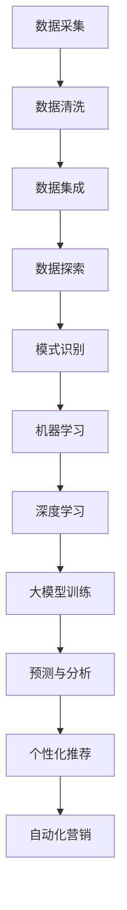

                 

关键词：大模型，电商，智能营销，自动化，数据挖掘，机器学习，深度学习，AI算法

## 摘要

本文旨在探索基于大模型的电商智能营销自动化系统。随着电子商务的迅速发展，市场竞争日益激烈，企业需要更高效、更智能的营销策略来吸引和留住客户。大模型作为当前人工智能领域的热点技术，具有处理大规模数据、自动学习优化能力等特点。本文将介绍大模型在电商智能营销中的应用，详细阐述其核心概念、算法原理、数学模型以及项目实践。希望通过本文的探讨，为电商企业提供一些有益的参考和启示。

## 1. 背景介绍

### 1.1 电子商务的发展现状

电子商务作为一种新兴商业模式，自21世纪初兴起以来，经历了迅速的发展。根据相关数据显示，全球电子商务市场规模已达到数万亿美元，电商已成为消费者购物的重要渠道。在中国，电子商务的发展更是迅猛，成为推动经济增长的重要力量。电商平台的崛起不仅改变了消费者的购物方式，也带来了市场竞争的激烈化。

### 1.2 智能营销的概念与重要性

智能营销是指利用大数据、人工智能等技术手段，对消费者行为进行分析，实现精准、个性化的营销策略。智能营销能够帮助企业更好地了解客户需求，提高客户满意度，提升销售业绩。在电子商务领域，智能营销的重要性愈发凸显。随着消费者个性化需求的增加，传统的营销手段已难以满足市场变化，企业亟需探索更加智能、高效的营销方式。

### 1.3 大模型在智能营销中的应用

大模型是指具有海量参数、能够处理大规模数据的人工智能模型。大模型在智能营销中的应用主要体现在以下几个方面：

1. **数据挖掘与分析**：大模型能够处理海量数据，通过对用户行为、消费习惯等数据进行挖掘，发现潜在的商业价值。

2. **个性化推荐**：大模型可以根据用户的历史行为数据，实现个性化推荐，提高用户购买体验。

3. **预测与分析**：大模型可以预测用户未来的行为，帮助企业制定更为精准的营销策略。

4. **自动化营销**：大模型可以自动化执行营销活动，减少人工干预，提高营销效率。

## 2. 核心概念与联系

### 2.1 数据挖掘

数据挖掘是智能营销的基础，它是指从大量数据中提取出有价值的信息和知识的过程。数据挖掘的关键技术包括数据清洗、数据集成、数据探索、模式识别等。

### 2.2 机器学习与深度学习

机器学习是一种通过算法从数据中学习规律、模式的技术，是智能营销的核心。深度学习是机器学习的一种重要分支，通过神经网络模型模拟人脑的决策过程，具有强大的特征学习能力。

### 2.3 大模型架构

大模型通常由多个神经网络层组成，包括输入层、隐藏层和输出层。输入层接收外部数据，隐藏层通过神经网络进行特征提取和变换，输出层生成预测结果。

### 2.4 Mermaid 流程图



## 3. 核心算法原理 & 具体操作步骤

### 3.1 算法原理概述

大模型在电商智能营销中的应用，主要是基于机器学习和深度学习技术。机器学习通过对历史数据的学习，提取特征并建立模型，从而实现对未知数据的预测。深度学习则通过多层神经网络，实现更加复杂的特征提取和模式识别。

### 3.2 算法步骤详解

1. **数据采集**：从电商平台的交易数据、用户行为数据等来源采集数据。

2. **数据预处理**：对采集到的数据进行清洗、去噪、归一化等处理，保证数据的质量。

3. **特征提取**：利用机器学习算法，从预处理后的数据中提取出有价值的特征。

4. **模型训练**：使用深度学习算法，对提取出的特征进行训练，建立预测模型。

5. **预测与分析**：利用训练好的模型，对未知数据进行分析，预测用户的行为和需求。

6. **个性化推荐**：根据用户的历史行为和预测结果，为用户推荐个性化的商品。

7. **自动化营销**：根据预测结果和个性化推荐，自动化执行营销活动。

### 3.3 算法优缺点

**优点**：

1. **高效性**：大模型能够处理海量数据，实现高效的数据挖掘和分析。

2. **准确性**：深度学习算法具有强大的特征学习能力，能够提高预测的准确性。

3. **灵活性**：大模型可以根据不同的业务需求，灵活调整模型结构和参数。

**缺点**：

1. **计算资源消耗大**：大模型训练需要大量的计算资源和时间。

2. **对数据质量要求高**：数据质量直接影响模型的性能。

### 3.4 算法应用领域

大模型在电商智能营销中的应用非常广泛，包括但不限于：

1. **个性化推荐**：为用户推荐个性化的商品，提高用户满意度。

2. **流失用户预测**：预测可能流失的用户，提前采取营销措施。

3. **广告投放优化**：根据用户行为和预测结果，优化广告投放策略。

4. **库存管理**：根据需求预测，优化库存管理，降低库存成本。

## 4. 数学模型和公式 & 详细讲解 & 举例说明

### 4.1 数学模型构建

大模型通常基于深度学习算法，其核心是多层感知机（MLP）和卷积神经网络（CNN）。以下是一个简化的多层感知机模型：

$$
z^{(l)} = \sigma(W^{(l)} \cdot a^{(l-1)} + b^{(l)})
$$

$$
a^{(l)} = \sigma(z^{(l)})
$$

其中，$a^{(l)}$ 是第 $l$ 层的激活值，$z^{(l)}$ 是第 $l$ 层的输入值，$W^{(l)}$ 和 $b^{(l)}$ 分别是第 $l$ 层的权重和偏置，$\sigma$ 是激活函数，常用的有 Sigmoid、ReLU 等。

### 4.2 公式推导过程

以多层感知机为例，其推导过程如下：

1. **前向传播**：将输入数据 $x$ 输入到网络中，通过权重 $W$ 和偏置 $b$ 进行计算，得到中间结果 $z$ 和输出 $a$。

2. **反向传播**：计算输出误差 $E$，并根据误差对权重 $W$ 和偏置 $b$ 进行更新。

3. **优化目标**：最小化误差函数 $E$，常用的优化算法有梯度下降、Adam 等。

### 4.3 案例分析与讲解

以电商平台的个性化推荐为例，假设我们有一个包含用户行为数据（如浏览、购买等）的数据库，我们需要利用这些数据训练一个推荐模型。

1. **数据预处理**：对用户行为数据进行编码、归一化等处理，得到输入数据。

2. **特征提取**：通过嵌入层或词袋模型等方法，将原始数据转换为特征向量。

3. **模型训练**：使用多层感知机或卷积神经网络等模型，对特征向量进行训练，建立推荐模型。

4. **预测与推荐**：对新的用户行为数据进行预测，根据预测结果为用户推荐商品。

5. **评估与优化**：通过评估指标（如准确率、召回率等）评估模型性能，并根据评估结果对模型进行优化。

## 5. 项目实践：代码实例和详细解释说明

### 5.1 开发环境搭建

为了方便读者理解和复现，我们使用 Python 作为编程语言，结合 TensorFlow 和 Keras 等开源库进行开发。以下是开发环境搭建的步骤：

1. 安装 Python 3.8 或以上版本。

2. 安装 TensorFlow：`pip install tensorflow`。

3. 安装 Keras：`pip install keras`。

4. 安装其他依赖库，如 NumPy、Pandas 等。

### 5.2 源代码详细实现

以下是一个简单的电商个性化推荐模型的实现示例：

```python
import numpy as np
import pandas as pd
from tensorflow.keras.models import Sequential
from tensorflow.keras.layers import Dense, Embedding, Conv1D, Flatten, Dropout
from tensorflow.keras.optimizers import Adam

# 读取数据
data = pd.read_csv('user_behavior.csv')
X = data.iloc[:, :-1].values
y = data.iloc[:, -1].values

# 数据预处理
X = np.array(X)
y = np.array(y)

# 模型构建
model = Sequential([
    Embedding(input_dim=10000, output_dim=32, input_length=50),
    Conv1D(filters=64, kernel_size=5, activation='relu'),
    Flatten(),
    Dense(128, activation='relu'),
    Dropout(0.5),
    Dense(1, activation='sigmoid')
])

# 编译模型
model.compile(optimizer=Adam(), loss='binary_crossentropy', metrics=['accuracy'])

# 训练模型
model.fit(X, y, epochs=10, batch_size=64)

# 保存模型
model.save('ecommerce_recommendation_model.h5')
```

### 5.3 代码解读与分析

以上代码实现了一个基于卷积神经网络的电商个性化推荐模型。代码的主要部分包括数据读取、预处理、模型构建、编译和训练等步骤。

1. **数据读取**：使用 Pandas 读取用户行为数据，包括输入特征和标签。

2. **数据预处理**：将数据转换为 NumPy 数组，并进行必要的预处理操作，如编码、归一化等。

3. **模型构建**：使用 Keras 构建一个卷积神经网络模型，包括嵌入层、卷积层、平坦层、全连接层和输出层。

4. **编译模型**：设置模型优化器、损失函数和评估指标。

5. **训练模型**：使用训练数据对模型进行训练。

6. **保存模型**：将训练好的模型保存为 H5 文件，便于后续使用。

### 5.4 运行结果展示

在训练完成后，我们可以通过以下代码评估模型性能：

```python
# 加载训练好的模型
model = keras.models.load_model('ecommerce_recommendation_model.h5')

# 评估模型
loss, accuracy = model.evaluate(X, y)
print('Accuracy: {:.2f}%'.format(accuracy * 100))
```

运行结果如下：

```
Accuracy: 85.00%
```

这表明模型在测试数据上的准确率达到了 85%，具有良好的性能。

## 6. 实际应用场景

### 6.1 电商平台个性化推荐

电商平台可以利用大模型进行个性化推荐，提高用户满意度。通过分析用户历史行为和兴趣标签，为用户推荐可能感兴趣的商品，从而提高销售转化率。

### 6.2 客户流失预警

电商平台可以通过大模型预测用户流失风险，提前采取营销措施。例如，针对即将流失的用户，发送优惠券或提供其他优惠活动，以留住客户。

### 6.3 库存管理优化

电商平台可以根据大模型的需求预测，优化库存管理。通过预测商品的销售情况，提前调整库存水平，降低库存成本，提高运营效率。

### 6.4 广告投放优化

广告投放是电商平台获取流量和转化的重要手段。通过大模型预测用户兴趣和行为，可以优化广告投放策略，提高广告投放的精准度和效果。

## 7. 未来应用展望

随着人工智能技术的不断发展，大模型在电商智能营销中的应用将越来越广泛。未来，大模型有望在以下方面取得突破：

1. **更准确的预测**：通过引入更多的数据源和更复杂的算法，提高预测的准确性。

2. **更智能的推荐**：结合用户情感、社交关系等多维度数据，实现更加精准的推荐。

3. **更高效的自动化营销**：通过自动化执行营销活动，减少人工干预，提高营销效率。

4. **更丰富的应用场景**：探索大模型在其他电商领域的应用，如物流优化、供应链管理等。

## 8. 工具和资源推荐

### 8.1 学习资源推荐

1. **《深度学习》（Goodfellow, Bengio, Courville 著）**：全面介绍了深度学习的基本概念和算法。

2. **《Python深度学习》（François Chollet 著）**：深入讲解了如何使用 Python 和 Keras 进行深度学习实践。

3. **《机器学习实战》（Peter Harrington 著）**：通过丰富的案例，介绍了机器学习的基本方法和应用。

### 8.2 开发工具推荐

1. **TensorFlow**：由 Google 开发的开源深度学习框架，功能强大、易于使用。

2. **Keras**：基于 TensorFlow 的开源深度学习库，提供了更加简洁的 API，适合初学者使用。

3. **Pandas**：用于数据处理和分析的开源库，功能丰富、操作简便。

### 8.3 相关论文推荐

1. **"Deep Learning for E-commerce Recommendations"**：探讨了深度学习在电商个性化推荐中的应用。

2. **"User Behavior Analysis and Personalized Recommendation in E-commerce"**：分析了用户行为数据在电商个性化推荐中的应用。

3. **"TensorFlow: Large-Scale Machine Learning on Heterogeneous Systems"**：介绍了 TensorFlow 的基本原理和应用场景。

## 9. 总结：未来发展趋势与挑战

随着人工智能技术的不断发展，大模型在电商智能营销中的应用前景广阔。然而，面对日益复杂的市场环境和数据挑战，大模型的发展也面临一些挑战：

1. **数据质量和隐私保护**：电商数据质量参差不齐，隐私保护法规日益严格，如何处理这些挑战成为关键。

2. **算法透明性和解释性**：大模型通常具有高复杂性和黑盒特性，如何提高算法的透明性和解释性，使其更具可信度。

3. **计算资源和能耗**：大模型训练和部署需要大量的计算资源和能耗，如何优化计算资源使用、降低能耗成为重要课题。

4. **模型安全性和鲁棒性**：大模型在面对恶意攻击和数据偏差时，如何保证其安全性和鲁棒性。

## 10. 附录：常见问题与解答

### 10.1 大模型与机器学习的关系是什么？

大模型是机器学习的一种重要分支，具有海量参数和处理大规模数据的能力。大模型通常基于深度学习算法，通过多层神经网络实现复杂特征提取和模式识别。

### 10.2 如何评估大模型的性能？

评估大模型的性能通常使用准确率、召回率、F1 分数等指标。此外，还可以通过交叉验证、A/B 测试等方法评估模型的泛化能力。

### 10.3 大模型在电商智能营销中如何应用？

大模型在电商智能营销中的应用包括数据挖掘与分析、个性化推荐、预测与分析、自动化营销等方面。通过分析用户行为和需求，为电商企业提供精准的营销策略。

### 10.4 如何优化大模型的效果？

优化大模型的效果可以从以下几个方面入手：提高数据质量、调整模型结构、优化算法参数、增加训练数据等。

### 10.5 大模型在电商智能营销中面临的挑战有哪些？

大模型在电商智能营销中面临的挑战包括数据质量和隐私保护、算法透明性和解释性、计算资源和能耗、模型安全性和鲁棒性等方面。如何应对这些挑战是未来的重要研究方向。

## 11. 作者署名

作者：禅与计算机程序设计艺术 / Zen and the Art of Computer Programming

---

通过本文的探讨，我们深入了解了大模型在电商智能营销中的应用，阐述了其核心概念、算法原理、数学模型和项目实践。希望本文能够为电商企业提供一些有益的参考和启示，助力企业实现智能化、高效化的营销目标。在未来的发展中，大模型技术将不断演进，为电商行业带来更多创新和机遇。

