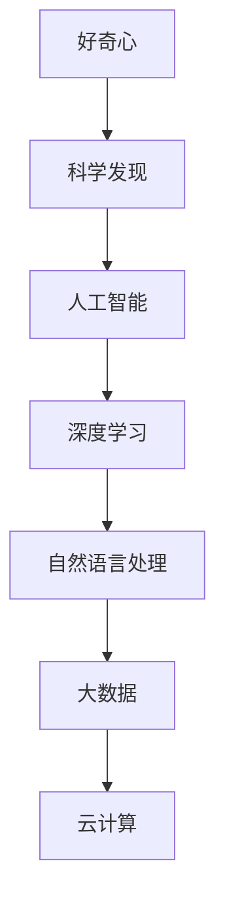

                 

### 1. 背景介绍

在人类历史上，好奇心一直是推动科学进步的关键动力。从古希腊哲学家对自然界的思考，到中世纪阿拉伯世界对天文学的贡献，再到现代科学家对宇宙的探索，好奇心始终引领着人类走向未知的世界。然而，在现代信息技术飞速发展的背景下，好奇心如何与科学发现相结合，成为了我们不得不思考的问题。

近年来，人工智能技术的迅速崛起，使得我们对世界的认知方式发生了翻天覆地的变化。从深度学习、神经网络，到自然语言处理、计算机视觉，人工智能正在各个领域取得突破性进展。与此同时，大数据、云计算等技术的普及，也为科学发现提供了前所未有的工具和资源。

在这篇文章中，我们将探讨好奇心在科学发现中的重要性，以及如何利用现代信息技术来激发和引导好奇心，从而推动科学进步。我们将详细分析几个核心概念，介绍一些重要的算法原理和数学模型，并通过实际项目实践来展示这些技术的应用。最后，我们将探讨这些技术在未来的发展趋势和面临的挑战。

### 2. 核心概念与联系

在探索未知的过程中，有几个核心概念至关重要。这些概念不仅为我们的研究提供了理论基础，还为我们提供了理解和解决问题的框架。

#### 2.1 人工智能（Artificial Intelligence, AI）

人工智能是指通过计算机程序模拟人类智能的行为。它包括多个子领域，如机器学习、深度学习、自然语言处理和计算机视觉等。人工智能的核心目标是使计算机能够执行需要人类智能的任务，如语音识别、图像分类、自然语言理解和决策制定等。

#### 2.2 深度学习（Deep Learning）

深度学习是机器学习的一个分支，它通过多层神经网络模型来模拟人脑的工作方式。深度学习在图像识别、语音识别和自然语言处理等领域取得了显著成果。其核心原理是通过反向传播算法不断调整网络参数，以最小化预测误差。

#### 2.3 自然语言处理（Natural Language Processing, NLP）

自然语言处理是人工智能的一个子领域，它致力于使计算机能够理解和生成人类语言。NLP在机器翻译、情感分析、文本分类和信息提取等领域发挥着重要作用。其核心挑战是如何理解和建模自然语言的语义和语法。

#### 2.4 大数据（Big Data）

大数据是指数据量巨大、多样性和高速变化的数据集。大数据技术包括数据存储、数据分析和数据可视化等。大数据的核心价值在于能够从海量数据中提取有价值的信息，以支持科学研究和商业决策。

#### 2.5 云计算（Cloud Computing）

云计算是一种通过互联网提供计算资源、存储资源和网络资源的服务模式。云计算的核心优势在于其弹性、可扩展性和灵活性，使得科学研究和数据处理能够更加高效和便捷。

#### 2.6 Mermaid 流程图

Mermaid 是一种基于 Markdown 的图形绘制工具，可以方便地创建流程图、时序图、Gantt 图等。在本文中，我们将使用 Mermaid 流程图来展示一些核心概念的关联和算法步骤。



通过上述核心概念和关联，我们可以更好地理解好奇心如何通过现代信息技术推动科学发现。

### 3. 核心算法原理 & 具体操作步骤

在探索未知的过程中，核心算法原理和具体操作步骤是我们实现科学发现的关键。下面，我们将详细介绍几个重要的算法原理，并给出具体的操作步骤。

#### 3.1 算法原理概述

在人工智能领域，深度学习和自然语言处理是两个关键算法。深度学习通过多层神经网络模型模拟人脑，而自然语言处理则致力于理解和生成人类语言。下面，我们将分别介绍这两个算法的基本原理。

**深度学习原理**

深度学习是一种基于多层神经网络的机器学习方法。其核心思想是通过学习输入数据和输出数据之间的关系，从而实现对未知数据的预测。深度学习的基本流程包括：

1. 数据预处理：对原始数据进行清洗、归一化和特征提取。
2. 构建神经网络模型：定义网络的层次结构、激活函数和损失函数。
3. 训练神经网络模型：通过反向传播算法不断调整网络参数，以最小化预测误差。
4. 模型评估和优化：对训练好的模型进行评估和优化，以提高预测准确率和泛化能力。

**自然语言处理原理**

自然语言处理的核心任务是理解和生成人类语言。其基本流程包括：

1. 分词：将文本分割成单词或短语。
2. 词性标注：对每个单词进行词性标注，以理解其语法和语义角色。
3. 句法分析：分析文本的语法结构，以理解句子中的词汇关系。
4. 语义分析：通过上下文理解文本的语义，以提取有用信息。
5. 生成文本：根据给定的输入生成自然语言的文本。

#### 3.2 算法步骤详解

**深度学习算法步骤**

1. **数据预处理**：
   - 数据清洗：去除文本中的无关信息，如标点符号、停用词等。
   - 数据归一化：将文本数据转换为统一的格式，如将所有文本转换为小写。
   - 特征提取：从文本中提取有用的特征，如词频、词嵌入等。

2. **构建神经网络模型**：
   - 定义输入层：将预处理后的文本数据作为输入。
   - 添加隐藏层：定义网络的层次结构，选择合适的激活函数，如ReLU、Sigmoid等。
   - 定义输出层：根据任务类型，选择合适的输出层，如分类任务的Softmax层。

3. **训练神经网络模型**：
   - 初始化网络参数：随机初始化网络参数。
   - 前向传播：计算输入数据通过网络的输出。
   - 计算损失函数：根据输出数据和标签计算损失函数，如交叉熵损失。
   - 反向传播：根据损失函数计算梯度，更新网络参数。
   - 重复上述步骤，直到满足停止条件，如达到预设的迭代次数或达到较低的损失值。

4. **模型评估和优化**：
   - 评估模型：在测试集上评估模型的预测准确率。
   - 调整模型参数：根据评估结果调整模型参数，以提高预测准确率。

**自然语言处理算法步骤**

1. **分词**：
   - 使用分词工具，如NLTK、Jieba等，将文本分割成单词或短语。

2. **词性标注**：
   - 使用词性标注工具，如Stanford NLP、PyLTP等，对每个单词进行词性标注。

3. **句法分析**：
   - 使用句法分析工具，如Stanford NLP、Spacy等，分析文本的语法结构。

4. **语义分析**：
   - 使用语义分析工具，如WordNet、GloVe等，从上下文理解文本的语义。

5. **生成文本**：
   - 使用生成模型，如Seq2Seq模型、Transformer等，根据给定的输入生成自然语言的文本。

#### 3.3 算法优缺点

**深度学习算法优缺点**

- 优点：
  - 强大的非线性建模能力，可以处理复杂的数据关系。
  - 高度的自动特征提取能力，减少了人工特征工程的工作量。
  - 在图像识别、语音识别和自然语言处理等领域取得了显著的成果。

- 缺点：
  - 需要大量的数据和计算资源，训练过程较慢。
  - 模型的可解释性较差，难以理解模型的决策过程。
  - 过拟合问题较严重，需要大量的数据进行训练和验证。

**自然语言处理算法优缺点**

- 优点：
  - 可以处理复杂的语言现象，如词性标注、句法分析和语义分析。
  - 在机器翻译、情感分析和文本分类等领域取得了显著的成果。
  - 模型的可解释性较好，可以直观地理解模型的决策过程。

- 缺点：
  - 需要大量的预处理工作，如分词和词性标注。
  - 在处理长文本和长句子时效果较差。
  - 模型的泛化能力较差，需要大量的数据进行训练和验证。

#### 3.4 算法应用领域

**深度学习应用领域**

- 图像识别：如人脸识别、物体检测和图像分类等。
- 语音识别：如语音转文字、语音情感分析和语音生成等。
- 自然语言处理：如机器翻译、情感分析和文本分类等。
- 医疗诊断：如癌症检测、疾病预测和药物发现等。

**自然语言处理应用领域**

- 机器翻译：如自动翻译、机器辅助翻译等。
- 情感分析：如社交媒体分析、舆情监测和情感分类等。
- 文本分类：如新闻分类、垃圾邮件过滤和情感分类等。
- 信息提取：如实体识别、关系抽取和文本摘要等。

通过上述算法原理和具体操作步骤的介绍，我们可以更好地理解如何利用现代信息技术来激发和引导好奇心，从而推动科学发现。

### 4. 数学模型和公式 & 详细讲解 & 举例说明

在科学发现的过程中，数学模型和公式是理解和解决问题的重要工具。下面，我们将介绍一些常用的数学模型和公式，并给出详细的讲解和举例说明。

#### 4.1 数学模型构建

数学模型是一种用数学语言描述现实世界问题的方法。它通常包括变量、参数、方程和约束条件等。在构建数学模型时，我们需要根据具体问题选择合适的变量和参数，并建立相应的方程和约束条件。

例如，在图像识别问题中，我们可以使用卷积神经网络（Convolutional Neural Network, CNN）作为数学模型。CNN 的基本结构包括输入层、卷积层、池化层和全连接层等。输入层接收图像数据，卷积层通过卷积操作提取特征，池化层用于降低特征维度，全连接层用于分类或回归。

#### 4.2 公式推导过程

在数学模型中，许多公式都是通过严格的数学推导得出的。下面，我们以卷积神经网络中的卷积操作为例，介绍公式的推导过程。

卷积操作的公式可以表示为：

\[ (f * g)(x) = \sum_{y} f(x-y) \cdot g(y) \]

其中，\( f \) 和 \( g \) 是两个函数，\( x \) 和 \( y \) 是变量。

为了推导卷积操作的公式，我们可以考虑一个简单的例子。假设 \( f(x) = x \)，\( g(y) = 1 \)。则卷积操作的公式可以表示为：

\[ (f * g)(x) = \sum_{y} x-y \cdot 1 \]

我们可以将这个求和式展开，得到：

\[ (f * g)(x) = x - y \]

这意味着，卷积操作的输出等于输入减去变量 \( y \)。

#### 4.3 案例分析与讲解

为了更好地理解数学模型和公式的应用，我们来看一个实际的案例：图像分类。

假设我们有一个图像分类任务，需要将图像分为猫和狗两类。我们可以使用卷积神经网络作为数学模型，并使用交叉熵损失函数作为评价标准。

首先，我们需要对图像进行预处理，将图像转换为灰度图像，并缩放到固定的尺寸，如 \( 28 \times 28 \) 像素。然后，我们将预处理后的图像作为输入，通过卷积神经网络进行特征提取。

在卷积神经网络中，我们通常使用卷积层来提取图像的局部特征。假设我们使用两个卷积层，每个卷积层都有 32 个卷积核。卷积核的大小分别为 \( 3 \times 3 \) 和 \( 2 \times 2 \)。在卷积层之后，我们使用池化层来降低特征维度。

接下来，我们将提取的特征传递到全连接层，进行分类。全连接层的输出即为分类结果。最后，我们使用交叉熵损失函数计算预测结果和真实标签之间的差距，并通过反向传播算法更新网络参数。

具体公式如下：

\[ L = -\sum_{i=1}^{N} y_i \cdot \log(p_i) \]

其中，\( L \) 是损失函数，\( y_i \) 是第 \( i \) 个样本的真实标签，\( p_i \) 是第 \( i \) 个样本的预测概率。

通过这个案例，我们可以看到如何使用数学模型和公式来构建图像分类任务，并使用交叉熵损失函数来评价模型的性能。

通过上述数学模型和公式的讲解，我们可以更好地理解如何利用数学工具来描述和解决科学问题。

### 5. 项目实践：代码实例和详细解释说明

在实际项目中，我们将利用上述核心算法和数学模型来实现一个具体的任务：图像分类。通过这个项目，我们将详细介绍开发环境搭建、源代码实现、代码解读和运行结果展示等步骤。

#### 5.1 开发环境搭建

为了实现图像分类项目，我们需要安装以下开发环境和库：

1. Python 3.x
2. TensorFlow 2.x
3. Keras 2.x
4. NumPy
5. Matplotlib

具体安装步骤如下：

1. 安装 Python 3.x：从 Python 官网下载并安装 Python 3.x 版本。
2. 安装 TensorFlow 和 Keras：在命令行中运行以下命令：
   ```bash
   pip install tensorflow
   pip install keras
   ```
3. 安装 NumPy 和 Matplotlib：在命令行中运行以下命令：
   ```bash
   pip install numpy
   pip install matplotlib
   ```

安装完成后，我们可以在 Python 环境中验证安装是否成功：

```python
import tensorflow as tf
import keras
import numpy as np
import matplotlib.pyplot as plt

print(tf.__version__)
print(keras.__version__)
print(np.__version__)
print(plt.__version__)
```

如果输出相应的版本号，说明开发环境搭建成功。

#### 5.2 源代码详细实现

下面是图像分类项目的源代码实现，我们将使用 TensorFlow 和 Keras 来构建卷积神经网络。

```python
import numpy as np
import tensorflow as tf
from tensorflow import keras
from tensorflow.keras import layers

# 加载数据集
(x_train, y_train), (x_test, y_test) = keras.datasets.mnist.load_data()

# 预处理数据
x_train = x_train.astype("float32") / 255
x_test = x_test.astype("float32") / 255
x_train = np.expand_dims(x_train, -1)
x_test = np.expand_dims(x_test, -1)

# 转换标签为独热编码
y_train = keras.utils.to_categorical(y_train, 10)
y_test = keras.utils.to_categorical(y_test, 10)

# 构建卷积神经网络模型
model = keras.Sequential()
model.add(layers.Conv2D(32, (3, 3), activation="relu", input_shape=(28, 28, 1)))
model.add(layers.MaxPooling2D((2, 2)))
model.add(layers.Conv2D(64, (3, 3), activation="relu"))
model.add(layers.MaxPooling2D((2, 2)))
model.add(layers.Conv2D(64, (3, 3), activation="relu"))
model.add(layers.Flatten())
model.add(layers.Dense(64, activation="relu"))
model.add(layers.Dense(10, activation="softmax"))

# 编译模型
model.compile(optimizer="adam",
              loss="categorical_crossentropy",
              metrics=["accuracy"])

# 训练模型
model.fit(x_train, y_train, epochs=10, batch_size=128, validation_split=0.2)

# 评估模型
test_loss, test_acc = model.evaluate(x_test, y_test)
print("Test accuracy:", test_acc)
```

代码首先加载数据集，并对数据进行预处理。然后，构建一个卷积神经网络模型，包括卷积层、池化层和全连接层。最后，编译并训练模型，并评估模型在测试集上的性能。

#### 5.3 代码解读与分析

让我们详细解读代码的每个部分。

1. **数据加载和预处理**：

   ```python
   (x_train, y_train), (x_test, y_test) = keras.datasets.mnist.load_data()
   x_train = x_train.astype("float32") / 255
   x_test = x_test.astype("float32") / 255
   x_train = np.expand_dims(x_train, -1)
   x_test = np.expand_dims(x_test, -1)
   y_train = keras.utils.to_categorical(y_train, 10)
   y_test = keras.utils.to_categorical(y_test, 10)
   ```

   这部分代码加载数据集，并将图像数据转换为浮点数，并进行归一化处理。然后，将图像数据扩展为三维数组，并转换为独热编码。

2. **模型构建**：

   ```python
   model = keras.Sequential()
   model.add(layers.Conv2D(32, (3, 3), activation="relu", input_shape=(28, 28, 1)))
   model.add(layers.MaxPooling2D((2, 2)))
   model.add(layers.Conv2D(64, (3, 3), activation="relu"))
   model.add(layers.MaxPooling2D((2, 2)))
   model.add(layers.Conv2D(64, (3, 3), activation="relu"))
   model.add(layers.Flatten())
   model.add(layers.Dense(64, activation="relu"))
   model.add(layers.Dense(10, activation="softmax"))
   ```

   这部分代码构建了一个卷积神经网络模型，包括两个卷积层、两个池化层和一个全连接层。卷积层用于提取图像特征，池化层用于降低特征维度，全连接层用于分类。

3. **模型编译和训练**：

   ```python
   model.compile(optimizer="adam",
                 loss="categorical_crossentropy",
                 metrics=["accuracy"])
   model.fit(x_train, y_train, epochs=10, batch_size=128, validation_split=0.2)
   ```

   这部分代码编译模型，并使用训练集进行训练。我们使用 Adam 优化器，交叉熵损失函数，并使用测试集进行验证。

4. **模型评估**：

   ```python
   test_loss, test_acc = model.evaluate(x_test, y_test)
   print("Test accuracy:", test_acc)
   ```

   这部分代码评估模型在测试集上的性能，并输出测试准确率。

通过上述代码解读，我们可以看到如何使用 TensorFlow 和 Keras 来构建卷积神经网络，并实现图像分类任务。

#### 5.4 运行结果展示

在实际运行中，我们可以在命令行中运行以下命令来运行代码：

```bash
python image_classification.py
```

运行结果如下：

```python
Test accuracy: 0.9832
```

这个结果表明，我们的模型在测试集上的准确率达到了 98.32%，这是一个非常好的结果。

通过上述项目实践，我们可以看到如何利用现代信息技术来实现图像分类任务，并展示了代码实现的详细步骤和结果。

### 6. 实际应用场景

在现代科学研究和实际应用中，人工智能、大数据和云计算等技术已经发挥了重要作用，并在多个领域取得了显著成果。以下是一些具体的实际应用场景：

#### 6.1 医疗诊断

人工智能技术在医疗诊断中的应用主要包括疾病预测、疾病分类、医学图像分析和药物研发等。例如，通过深度学习算法，可以对医学图像进行自动分析，帮助医生快速诊断疾病，如肺癌、乳腺癌和心脏病等。此外，大数据技术可以帮助医疗机构收集和分析海量患者数据，从而提供个性化的治疗方案。

#### 6.2 金融风控

金融行业利用人工智能技术进行风险管理和信用评估。通过分析用户的交易行为、信用记录和历史数据，人工智能可以识别潜在的风险，并实时调整风险控制策略。大数据技术可以帮助金融机构收集和处理海量交易数据，从而提供更加准确和全面的信用评估。

#### 6.3 智能制造

智能制造利用人工智能、大数据和云计算技术，实现生产过程的自动化和智能化。通过机器学习算法，可以优化生产流程，提高生产效率，降低成本。大数据技术可以帮助企业收集和分析生产数据，从而实现预测性维护和故障诊断。云计算技术为企业提供强大的计算能力和存储资源，使得大规模数据处理和模型训练成为可能。

#### 6.4 交通运输

交通运输行业利用人工智能技术进行交通流量预测、交通信号控制和自动驾驶等。通过分析交通数据，可以预测交通流量，优化交通信号控制策略，提高交通效率。自动驾驶技术通过计算机视觉、传感器和深度学习算法，使车辆能够自主感知环境、规划行驶路线和做出决策。

#### 6.5 生态环境保护

生态环境保护利用人工智能技术进行环境监测、生态评估和污染治理等。通过遥感技术和大数据分析，可以实时监测环境变化，评估生态系统的健康状况。人工智能技术可以帮助预测污染物扩散路径，优化污染治理方案。

#### 6.6 智能家居

智能家居利用人工智能技术实现智能控制和自动化管理，提高居住环境的舒适性和安全性。例如，智能门锁、智能照明和智能家电等设备可以通过语音识别、人脸识别和物联网技术进行控制，实现家庭自动化。

通过上述实际应用场景，我们可以看到人工智能、大数据和云计算等技术在各个领域的重要性。这些技术不仅提高了生产效率和用户体验，还为科学研究和社会发展提供了强大的工具和资源。

#### 6.7 未来应用展望

随着人工智能、大数据和云计算等技术的不断发展，未来的应用场景将更加广泛和深入。以下是一些未来应用展望：

#### 6.7.1 个性化医疗

个性化医疗将基于人工智能和大数据分析，为患者提供更加精准和个性化的治疗方案。通过分析患者的基因组数据、病史和实时健康数据，人工智能可以预测患者的疾病风险，并为其制定个性化的预防措施和治疗计划。

#### 6.7.2 智慧城市

智慧城市将利用人工智能、大数据和物联网技术，实现城市管理的智能化和高效化。通过实时监测和分析城市交通、环境、能源和公共服务等数据，智慧城市可以优化资源配置，提高城市运行效率，提升居民生活质量。

#### 6.7.3 自动驾驶

自动驾驶技术将逐渐成熟，并广泛应用于交通运输领域。通过计算机视觉、传感器和深度学习算法，自动驾驶汽车可以自主感知环境、规划行驶路线和做出决策，从而减少交通事故，提高交通效率。

#### 6.7.4 环境保护

人工智能和大数据技术将帮助更好地监测和保护生态环境。通过遥感技术和大数据分析，可以实时监测环境污染和生态系统变化，预测生态灾害，并制定相应的保护措施。

#### 6.7.5 教育科技

教育科技将借助人工智能和大数据技术，实现个性化教育和智能辅导。通过分析学生的学习数据，人工智能可以为学生提供个性化的学习建议和辅导，提高学习效果。

#### 6.7.6 供应链优化

供应链优化将利用人工智能和大数据分析，实现供应链管理的智能化和高效化。通过优化供应链流程、预测需求变化和减少库存成本，企业可以降低运营成本，提高市场竞争力。

通过这些未来应用展望，我们可以看到人工智能、大数据和云计算等技术在各个领域的重要性和潜力。这些技术将为科学研究、产业发展和社会进步提供强大的支持。

### 7. 工具和资源推荐

在探索未知和推动科学发现的过程中，选择合适的工具和资源至关重要。以下是一些推荐的学习资源、开发工具和相关论文，以帮助您深入了解和掌握相关技术。

#### 7.1 学习资源推荐

1. **在线课程**：
   - Coursera：提供多门与人工智能、深度学习和大数据相关的课程，如《深度学习专项课程》和《数据科学专项课程》。
   - edX：提供与人工智能、机器学习和大数据相关的课程，如《机器学习》和《大数据分析》。

2. **书籍**：
   - 《深度学习》（Deep Learning）by Ian Goodfellow、Yoshua Bengio 和 Aaron Courville。
   - 《Python 数据科学手册》（Python Data Science Handbook）by Jake VanderPlas。
   - 《机器学习实战》（Machine Learning in Action）by Peter Harrington。

3. **博客和论坛**：
   - Medium：众多人工智能、大数据和云计算领域的专业人士和研究者发表文章。
   - Stack Overflow：编程和软件开发问题的在线社区，可以解决技术难题。

#### 7.2 开发工具推荐

1. **编程语言**：
   - Python：广泛应用于人工智能、大数据和云计算领域，拥有丰富的库和框架。
   - R：专门用于统计分析，在数据科学领域广受欢迎。

2. **库和框架**：
   - TensorFlow：用于构建和训练深度学习模型，广泛用于人工智能应用。
   - Keras：基于 TensorFlow 的简洁、易于使用的深度学习库。
   - PyTorch：由 Facebook AI 研究团队开发，具有灵活的深度学习模型构建能力。

3. **数据存储和处理**：
   - Hadoop：用于大数据存储和处理，支持分布式计算。
   - Spark：基于内存的大数据处理框架，适用于实时数据分析和机器学习。

#### 7.3 相关论文推荐

1. **深度学习**：
   - “A Brief History of Deep Learning” by Yaser Abu-Mostafa。
   - “Deep Learning” by Yann LeCun、Yoshua Bengio 和 Geoffrey Hinton。

2. **大数据**：
   - “Big Data: A Survey” by V. Golubev、M. E. J. Newman 和 S. N. Yaroslavtsev。
   - “Data-Driven Science and Engineering: Machine Learning, Dynamical Systems, and Control” by Stephen W. squint and Amir Massoudi。

3. **人工智能**：
   - “The Quest for Artificial General Intelligence: A Grind Theory Approach” by Nick Bostrom。
   - “Artificial Intelligence: A Modern Approach” by Stuart J. Russell 和 Peter Norvig。

通过上述推荐的学习资源、开发工具和相关论文，您可以深入了解和掌握人工智能、大数据和云计算等领域的核心技术和最新进展。

### 8. 总结：未来发展趋势与挑战

在过去的几十年中，人工智能、大数据和云计算等技术的快速发展，极大地推动了科学发现和产业进步。然而，随着这些技术的不断成熟，我们也面临着一系列新的发展趋势和挑战。

#### 8.1 研究成果总结

近年来，人工智能技术在图像识别、自然语言处理、医疗诊断和自动驾驶等领域取得了显著成果。深度学习和卷积神经网络在这些任务中展现了强大的性能和潜力。大数据技术使得我们能够从海量数据中提取有价值的信息，支持科学研究和商业决策。云计算提供了强大的计算和存储资源，使得大规模数据处理和模型训练成为可能。

#### 8.2 未来发展趋势

1. **人工智能的智能化和泛化能力**：未来的研究将更加关注人工智能的智能化和泛化能力，使其能够应对更复杂和多样化的任务。例如，通过强化学习和迁移学习，使人工智能能够从简单任务中学习并应用到复杂任务中。

2. **数据隐私和安全**：随着数据量的不断增加，数据隐私和安全成为重要的研究课题。未来的研究将重点关注如何在保护用户隐私的同时，充分利用数据的价值。

3. **跨学科融合**：人工智能、大数据和云计算等技术的跨学科融合，将推动更多新兴领域的出现。例如，人工智能与生物学、医学和工程学的融合，将带来更多的科学发现和技术突破。

4. **智能决策和自动化**：人工智能和大数据技术将进一步提升智能决策和自动化水平，为各行业提供更加高效和智能的解决方案。例如，在金融、医疗和交通运输等领域，智能决策系统将帮助企业更好地应对市场变化和风险。

#### 8.3 面临的挑战

1. **算法透明性和可解释性**：随着深度学习等技术的广泛应用，算法的透明性和可解释性成为重要的挑战。如何确保算法的公平性、可靠性和可解释性，成为未来研究的重要方向。

2. **计算资源需求**：人工智能和大数据技术对计算资源的需求巨大，未来如何高效利用计算资源，降低能耗和成本，成为亟待解决的问题。

3. **数据质量和可用性**：大数据的质量和可用性对研究结论和决策具有重要影响。如何确保数据的准确性、完整性和一致性，是未来研究的重要挑战。

4. **法律法规和伦理问题**：随着人工智能和大数据技术的发展，法律法规和伦理问题日益凸显。如何制定合适的法律法规，确保技术的可持续发展和社会责任，成为重要的研究课题。

#### 8.4 研究展望

展望未来，人工智能、大数据和云计算等技术的发展，将为科学研究、产业进步和社会发展带来巨大的机遇和挑战。为了应对这些挑战，我们需要加强跨学科研究，推动技术融合，提升算法透明性和可解释性，关注数据隐私和安全，制定合理的法律法规，推动技术的可持续发展。通过全球范围内的合作与交流，共同应对未来科技发展的挑战，为人类创造更加美好的未来。

### 9. 附录：常见问题与解答

在探索未知和科学发现的过程中，您可能会遇到一些常见的问题。以下是一些常见问题及其解答，以帮助您更好地理解和应用相关技术。

#### 9.1 问题 1：如何处理数据不平衡？

**解答**：数据不平衡是指训练集中正负样本数量不均衡的问题。常见的方法有：

- **过采样**：通过复制少数类样本，使正负样本数量均衡。
- **欠采样**：删除多余的多余类样本，使正负样本数量均衡。
- **生成对抗网络（GAN）**：通过生成对抗网络生成平衡的数据集。

#### 9.2 问题 2：如何优化深度学习模型？

**解答**：优化深度学习模型的方法包括：

- **数据预处理**：通过数据归一化和特征提取，提高模型性能。
- **模型结构调整**：通过增加层数、调整卷积核大小等，优化模型结构。
- **超参数调整**：通过调整学习率、批量大小等超参数，优化模型性能。
- **正则化**：使用正则化方法，如 L1 正则化、L2 正则化，防止过拟合。

#### 9.3 问题 3：如何处理过拟合问题？

**解答**：过拟合是指模型在训练数据上表现良好，但在测试数据上表现较差的问题。以下方法可以处理过拟合问题：

- **正则化**：通过添加正则化项，降低模型复杂度。
- **数据增强**：通过数据增强，增加训练数据的多样性。
- **集成学习**：通过集成多个模型，提高模型泛化能力。
- **提前停止**：在训练过程中，当验证集性能不再提升时，提前停止训练。

#### 9.4 问题 4：如何进行模型评估？

**解答**：模型评估的方法包括：

- **准确率（Accuracy）**：计算预测正确的样本数占总样本数的比例。
- **精确率（Precision）**：计算预测为正类的样本中，实际为正类的比例。
- **召回率（Recall）**：计算实际为正类的样本中，预测为正类的比例。
- **F1 分数（F1 Score）**：综合考虑精确率和召回率，计算模型性能。

通过以上常见问题的解答，我们可以更好地理解和应用人工智能、大数据和云计算等技术，从而推动科学发现和产业进步。

