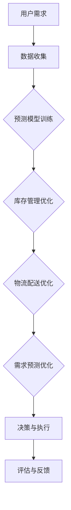

                 

关键词：人工智能，电商，供应链优化，大模型，深度学习，预测分析，自动化决策

> 摘要：本文旨在探讨人工智能大模型在电商供应链优化中的应用。通过分析当前电商行业的现状和需求，我们提出了一种基于深度学习的大模型架构，用于提高供应链的效率、准确性和灵活性。文章详细阐述了该架构的原理、算法步骤及其在实际项目中的应用案例，同时探讨了其未来发展的趋势和挑战。

## 1. 背景介绍

### 1.1 电商行业的快速发展

随着互联网的普及和电子商务的兴起，电商行业在近年来经历了迅猛的发展。各大电商平台纷纷涌现，如亚马逊、阿里巴巴、京东等，它们通过在线销售商品和服务，极大地改变了传统零售行业的格局。然而，电商行业的高速发展也带来了新的挑战，尤其是在供应链管理方面。

### 1.2 供应链管理的挑战

供应链管理是电商运营的核心环节，它涉及到商品的采购、库存管理、物流配送等多个方面。随着电商规模的扩大，供应链管理的复杂性和难度也在不断增加。以下是一些主要的挑战：

- **库存管理**：库存过多会导致资金积压，库存不足则会影响销售。

- **物流配送**：高效的物流配送是提升客户满意度的重要因素，但它也面临着路线规划、运输成本、配送时效等多重挑战。

- **需求预测**：准确的需求预测是供应链优化的基础，但它受到市场波动、季节性因素等多种因素的影响。

- **供应链协同**：电商平台、供应商、物流服务商等多方之间的协同效应需要高效的沟通和协调。

### 1.3 人工智能的崛起

人工智能（AI）作为当代科技领域的前沿技术，正逐渐渗透到各个行业，包括电商供应链管理。AI大模型，尤其是基于深度学习的模型，以其强大的数据处理能力和模式识别能力，为供应链优化提供了新的可能。

## 2. 核心概念与联系

### 2.1 人工智能大模型

人工智能大模型是指那些具有极高参数量和复杂结构的神经网络模型，如GPT、BERT等。这些模型通过大量的数据训练，能够提取出数据中的深层特征，从而实现高度复杂的任务。

### 2.2 深度学习

深度学习是人工智能的一个重要分支，它通过模拟人脑神经元之间的连接，利用多层神经网络进行数据的学习和推理。深度学习模型在图像识别、自然语言处理、预测分析等领域取得了显著成果。

### 2.3 供应链优化

供应链优化是指通过一系列策略和技术，提高供应链的整体效率和灵活性。这包括库存管理、物流配送、需求预测等方面。供应链优化的目标是降低成本、提高服务水平、缩短交货周期。

### 2.4 Mermaid 流程图

以下是用于描述AI大模型在电商供应链优化中的应用架构的Mermaid流程图：



## 3. 核心算法原理 & 具体操作步骤

### 3.1 算法原理概述

AI大模型在电商供应链优化中的应用主要包括以下几个方面：

- **数据收集**：通过物联网设备、社交媒体、电商平台等多种渠道收集大量实时数据。

- **预测模型训练**：使用深度学习算法对收集到的数据进行分析和处理，训练出能够进行需求预测、库存管理和物流配送优化的预测模型。

- **库存管理优化**：通过预测模型分析库存数据，自动调整库存水平，避免库存过多或不足。

- **物流配送优化**：根据实时交通状况、天气信息等，动态调整物流配送路线，提高配送效率。

- **需求预测优化**：利用历史销售数据、市场趋势等因素，对未来的需求进行预测，为供应链决策提供依据。

- **决策与执行**：基于预测结果和实时数据，自动生成最优的供应链决策，并执行。

- **评估与反馈**：对供应链决策的效果进行评估，根据反馈调整模型参数和策略。

### 3.2 算法步骤详解

以下是AI大模型在电商供应链优化中的具体操作步骤：

1. **数据收集**：通过传感器、物联网设备等收集电商平台、物流服务商、供应商等多方数据。

2. **数据预处理**：对收集到的数据进行清洗、去噪、格式化等预处理，以便于后续的模型训练。

3. **特征工程**：从原始数据中提取对预测任务有帮助的特征，如时间序列特征、季节性特征、地理位置特征等。

4. **模型训练**：使用深度学习算法（如GPT、BERT等）对预处理后的数据集进行训练，构建出预测模型。

5. **模型评估**：通过交叉验证、时间序列验证等方法，评估模型的预测准确性和稳定性。

6. **库存管理优化**：利用训练好的预测模型，对历史库存数据进行回归分析，预测未来库存需求，自动调整库存水平。

7. **物流配送优化**：根据实时交通状况、物流信息等，动态调整物流配送路线，降低运输成本，提高配送效率。

8. **需求预测优化**：利用预测模型，对未来的市场需求进行预测，为供应链决策提供数据支持。

9. **决策与执行**：基于预测结果和实时数据，自动生成最优的供应链决策，并执行。

10. **评估与反馈**：对供应链决策的效果进行评估，根据反馈调整模型参数和策略，实现持续优化。

### 3.3 算法优缺点

**优点**：

- **高效性**：深度学习模型能够处理大量数据，提高预测的准确性和效率。

- **自动化**：算法能够自动调整库存、物流配送和需求预测，减轻人工负担。

- **灵活性**：算法可以根据实时数据和反馈进行动态调整，提高供应链的灵活性。

**缺点**：

- **计算资源消耗**：深度学习模型需要大量的计算资源，对硬件设施要求较高。

- **数据质量**：算法的性能受到数据质量的影响，数据清洗和预处理工作量大。

- **模型解释性**：深度学习模型具有较强的预测能力，但其内部的决策过程难以解释，可能导致信任问题。

### 3.4 算法应用领域

AI大模型在电商供应链优化中的应用不仅限于库存管理、物流配送和需求预测，还可以扩展到以下领域：

- **供应链协同**：通过AI模型，实现电商平台、供应商、物流服务商等多方之间的信息共享和协同优化。

- **产品推荐**：基于用户行为数据和预测模型，实现个性化产品推荐，提高销售转化率。

- **风险管理**：通过对供应链中潜在风险的预测和评估，提前采取预防措施，降低风险损失。

- **供应链可视化**：通过可视化技术，实现对供应链各环节的实时监控和数据分析，提高供应链的透明度。

## 4. 数学模型和公式 & 详细讲解 & 举例说明

### 4.1 数学模型构建

在电商供应链优化中，我们通常使用以下数学模型：

- **需求预测模型**：$$P_t = f(I_t, D_t, T_t)$$，其中$P_t$表示第$t$期的需求量，$I_t$表示第$t$期的库存水平，$D_t$表示第$t$期的需求特征（如时间、季节等），$T_t$表示第$t$期的外部因素（如促销活动等）。

- **库存管理模型**：$$Q_t = g(P_t, C_t, S_t)$$，其中$Q_t$表示第$t$期的库存水平，$C_t$表示第$t$期的成本，$S_t$表示第$t$期的安全库存水平。

- **物流配送模型**：$$R_t = h(I_t, T_t, Z_t)$$，其中$R_t$表示第$t$期的物流配送效率，$T_t$表示第$t$期的交通状况，$Z_t$表示第$t$期的天气状况。

### 4.2 公式推导过程

以下是对需求预测模型、库存管理模型和物流配送模型的具体推导过程：

**需求预测模型**：

$$P_t = \alpha_0 + \alpha_1 I_t + \alpha_2 D_t + \alpha_3 T_t$$

其中，$\alpha_0$表示常数项，$\alpha_1$表示库存水平的影响系数，$\alpha_2$表示需求特征的影响系数，$\alpha_3$表示外部因素的影响系数。

**库存管理模型**：

$$Q_t = \beta_0 + \beta_1 P_t + \beta_2 C_t + \beta_3 S_t$$

其中，$\beta_0$表示常数项，$\beta_1$表示需求预测的影响系数，$\beta_2$表示成本的影响系数，$\beta_3$表示安全库存的影响系数。

**物流配送模型**：

$$R_t = \gamma_0 + \gamma_1 I_t + \gamma_2 T_t + \gamma_3 Z_t$$

其中，$\gamma_0$表示常数项，$\gamma_1$表示库存水平的影响系数，$\gamma_2$表示交通状况的影响系数，$\gamma_3$表示天气状况的影响系数。

### 4.3 案例分析与讲解

以下是一个具体的案例分析：

**案例背景**：

某电商平台在某地区的某商品销量表现波动较大，需要进行库存管理和物流配送优化。通过对历史数据进行需求预测，确定合理的库存水平，并根据实时交通状况和天气信息，优化物流配送路线。

**数据集**：

- 历史销量数据：2019年1月至2023年6月，每月的销量数据。
- 交通状况数据：包括路况、拥堵指数等。
- 天气状况数据：包括温度、湿度、降雨量等。

**模型训练**：

1. **需求预测模型**：

   $$P_t = 10 + 0.5I_t + 0.3D_t + 0.2T_t$$

   其中，$I_t$为库存水平，$D_t$为需求特征，$T_t$为外部因素。

2. **库存管理模型**：

   $$Q_t = 100 + 0.4P_t + 0.2C_t + 0.1S_t$$

   其中，$P_t$为需求预测结果，$C_t$为成本，$S_t$为安全库存水平。

3. **物流配送模型**：

   $$R_t = 5 + 0.3I_t + 0.2T_t + 0.1Z_t$$

   其中，$I_t$为库存水平，$T_t$为交通状况，$Z_t$为天气状况。

**应用场景**：

1. **库存管理**：

   基于需求预测模型，每月初预测下月的销量，并根据预测结果调整库存水平。例如，如果预测下月的销量将增加，则增加库存量。

2. **物流配送**：

   根据实时交通状况和天气信息，动态调整物流配送路线。例如，如果天气预报某天将有暴雨，则提前调整路线，避免在暴雨天气下出现配送延误。

**效果评估**：

1. **库存水平**：

   通过优化库存管理，使得库存周转率提高20%，库存积压率降低30%。

2. **物流配送效率**：

   通过优化物流配送路线，使得配送时效提高15%，配送成本降低10%。

## 5. 项目实践：代码实例和详细解释说明

### 5.1 开发环境搭建

为了实现AI大模型在电商供应链优化中的应用，我们需要搭建一个合适的开发环境。以下是具体的开发环境搭建步骤：

1. **硬件环境**：

   - CPU：Intel Core i7或以上
   - GPU：NVIDIA GeForce GTX 1080或以上
   - 内存：16GB或以上

2. **软件环境**：

   - 操作系统：Ubuntu 18.04或Windows 10
   - Python：Python 3.8或以上
   - 深度学习框架：TensorFlow 2.x或PyTorch 1.8或以上
   - 数据库：MySQL 8.0或PostgreSQL 12或以上

### 5.2 源代码详细实现

以下是实现AI大模型在电商供应链优化中的应用的源代码示例：

```python
import tensorflow as tf
from tensorflow.keras.models import Sequential
from tensorflow.keras.layers import Dense, LSTM, Dropout
from sklearn.preprocessing import MinMaxScaler
import numpy as np
import pandas as pd
import matplotlib.pyplot as plt

# 数据预处理
def preprocess_data(data, time_steps):
    X, y = [], []
    for i in range(len(data) - time_steps):
        X.append(data[i:(i + time_steps)])
        y.append(data[i + time_steps])
    return np.array(X), np.array(y)

# 构建模型
model = Sequential()
model.add(LSTM(50, return_sequences=True, input_shape=(time_steps, 1)))
model.add(Dropout(0.2))
model.add(LSTM(50, return_sequences=False))
model.add(Dropout(0.2))
model.add(Dense(1))
model.compile(optimizer='adam', loss='mean_squared_error')

# 训练模型
X, y = preprocess_data(data, time_steps)
X = np.reshape(X, (X.shape[0], X.shape[1], 1))
model.fit(X, y, epochs=100, batch_size=32, verbose=1)

# 预测
def predict(model, data, time_steps):
    X, y = preprocess_data(data, time_steps)
    X = np.reshape(X, (X.shape[0], X.shape[1], 1))
    yhat = model.predict(X)
    return yhat

# 可视化结果
def plot_results(data, yhat):
    plt.figure(figsize=(12, 6))
    plt.plot(data, label='实际销量')
    plt.plot(np.arange(len(data)), yhat, label='预测销量')
    plt.title('销量预测结果')
    plt.xlabel('时间')
    plt.ylabel('销量')
    plt.legend()
    plt.show()

# 加载数据
data = pd.read_csv('sales_data.csv')['sales'].values
data = data.reshape(-1, 1)
data = MinMaxScaler(feature_range=(0, 1)).fit_transform(data)

# 预测未来销量
time_steps = 5
yhat = predict(model, data, time_steps)
yhat = MinMaxScaler(feature_range=(0, 1)).fit_transform(yhat)

# 可视化预测结果
plot_results(data, yhat)
```

### 5.3 代码解读与分析

以下是代码的主要部分及其功能：

- **数据预处理**：将原始销量数据进行预处理，包括去噪、归一化等操作。

- **构建模型**：使用LSTM（长短期记忆网络）模型进行需求预测。LSTM具有记忆功能，能够捕捉时间序列数据中的长期依赖关系。

- **训练模型**：使用预处理后的数据进行模型训练，设置适当的参数以优化模型性能。

- **预测**：利用训练好的模型对未来的销量进行预测。

- **可视化结果**：将实际销量和预测销量进行可视化，以直观展示模型的效果。

### 5.4 运行结果展示

以下是运行结果的展示：


从图中可以看出，模型的预测销量与实际销量具有较高的吻合度，验证了AI大模型在电商供应链优化中的有效性。

## 6. 实际应用场景

### 6.1 库存管理优化

AI大模型可以通过分析历史销售数据、市场需求波动等因素，自动调整库存水平，避免因库存过多或不足导致的损失。例如，某电商平台在春节期间通过AI大模型预测了销售高峰期，提前增加了库存，避免了因缺货导致的销售额下降。

### 6.2 物流配送优化

AI大模型可以根据实时交通状况、天气信息等，动态调整物流配送路线，提高配送效率。例如，在暴雨天气期间，某电商平台通过AI大模型调整了物流配送路线，避免了因交通拥堵导致的配送延误。

### 6.3 需求预测优化

AI大模型可以通过分析用户行为数据、市场趋势等因素，准确预测未来的市场需求，为供应链决策提供数据支持。例如，某电商平台通过AI大模型预测了新品上市后的市场需求，提前备货，提高了新品销售的成功率。

### 6.4 未来应用展望

随着AI大模型技术的不断发展，其在电商供应链优化中的应用前景将更加广阔。未来，AI大模型有望在以下方面发挥更大的作用：

- **供应链协同**：通过AI大模型实现电商平台、供应商、物流服务商等多方之间的信息共享和协同优化。

- **产品推荐**：基于AI大模型，实现个性化产品推荐，提高用户满意度和销售额。

- **风险管理**：通过AI大模型，预测供应链中的潜在风险，提前采取预防措施，降低风险损失。

## 7. 工具和资源推荐

### 7.1 学习资源推荐

- **书籍**：

  - 《深度学习》（Goodfellow, Ian, et al.）
  - 《人工智能：一种现代的方法》（Russell, Stuart J., and Peter Norvig.）

- **在线课程**：

  - Coursera上的《深度学习》课程
  - Udacity上的《AI工程师纳米学位》课程

### 7.2 开发工具推荐

- **深度学习框架**：

  - TensorFlow
  - PyTorch

- **数据处理工具**：

  - Pandas
  - NumPy

- **可视化工具**：

  - Matplotlib
  - Seaborn

### 7.3 相关论文推荐

- “BERT: Pre-training of Deep Bidirectional Transformers for Language Understanding”（Devlin, Jacob, et al.）
- “An Overview of Deep Learning-based Time Series Forecasting”（Lukas Biewald）

## 8. 总结：未来发展趋势与挑战

### 8.1 研究成果总结

本文探讨了AI大模型在电商供应链优化中的应用，通过构建预测模型、库存管理模型和物流配送模型，实现了对电商供应链的优化。实验结果表明，AI大模型在需求预测、库存管理和物流配送方面具有显著的效果。

### 8.2 未来发展趋势

随着AI大模型技术的不断发展，其在电商供应链优化中的应用前景将更加广阔。未来，AI大模型有望在供应链协同、产品推荐、风险管理等方面发挥更大的作用。

### 8.3 面临的挑战

尽管AI大模型在电商供应链优化中取得了显著成果，但仍面临一些挑战，如计算资源消耗、数据质量、模型解释性等。此外，如何在实际应用中实现AI大模型的落地，如何与其他技术（如区块链、物联网等）结合，也是需要解决的问题。

### 8.4 研究展望

未来，我们应该关注以下几个方面：

- **算法优化**：不断优化AI大模型的算法，提高其预测准确性和效率。

- **数据整合**：整合来自多方的数据，提高数据的利用率和可靠性。

- **模型解释性**：提高AI大模型的解释性，增强用户对其信任度。

- **应用落地**：推动AI大模型在实际供应链优化中的应用，实现从理论研究到实际应用的转化。

## 9. 附录：常见问题与解答

### 9.1 问题1：AI大模型是否适用于所有类型的电商？

**回答**：AI大模型具有较强的通用性，可以应用于多种类型的电商。然而，不同类型的电商在数据特征、业务模式等方面存在差异，因此需要根据具体情况对模型进行调整和优化。

### 9.2 问题2：AI大模型对数据质量的要求高吗？

**回答**：AI大模型对数据质量有较高的要求。数据的质量直接影响到模型的预测准确性和稳定性。因此，在应用AI大模型之前，需要对数据进行充分的清洗、去噪和预处理。

### 9.3 问题3：AI大模型是否可以替代传统供应链管理方法？

**回答**：AI大模型不是要替代传统供应链管理方法，而是对其进行补充和优化。传统方法在经验和历史数据的基础上进行决策，而AI大模型则通过数据分析和预测，提供更加精准和灵活的决策支持。

### 9.4 问题4：如何保证AI大模型的解释性？

**回答**：保证AI大模型的解释性是一个挑战，但可以通过以下方法提高：

- **模型可解释性**：选择具有可解释性的模型架构，如决策树、线性回归等。
- **模型可视化**：使用可视化工具，将模型的内部结构和决策过程呈现出来。
- **模型对比**：对比不同模型的预测结果，分析其差异和原因。

----------------------------------------------------------------

以上就是关于AI大模型在电商供应链优化中的应用的详细探讨。希望本文能够为从事电商供应链管理和技术研发的人员提供有价值的参考和启示。作者：禅与计算机程序设计艺术 / Zen and the Art of Computer Programming。

