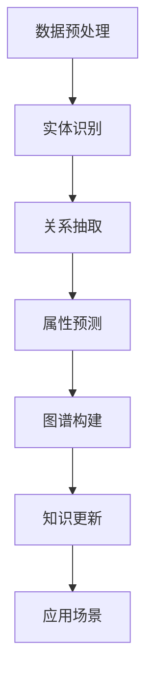

                 

关键词：大模型、电商平台、商品知识图谱、自动构建、更新、人工智能、算法原理、数学模型、项目实践、应用场景、工具和资源、未来发展趋势

> 摘要：本文旨在探讨大模型在电商平台商品知识图谱自动构建与更新中的应用，分析大模型的核心算法原理，详细介绍数学模型构建与公式推导，并通过实际项目实践展示其效果。此外，文章还将探讨大模型在电商平台中的实际应用场景，并展望未来的发展趋势与挑战。

## 1. 背景介绍

随着互联网的快速发展，电商平台已经成为了人们日常生活中不可或缺的一部分。在这个庞大的电商生态系统中，商品信息的处理和展示变得尤为重要。传统的商品信息管理方式主要依赖于数据库和搜索引擎，但这种方式在面对海量商品数据时，往往难以满足用户的个性化需求。

近年来，知识图谱技术逐渐崭露头角，成为处理复杂数据关系和实现智能推荐的有效工具。知识图谱是一种语义网络，通过节点和边来表示实体及其相互关系。在电商平台中，商品知识图谱可以帮助用户更好地理解和搜索商品，提升用户体验。

然而，构建和维护一个高质量的商品知识图谱面临着诸多挑战，如数据质量、数据更新、图谱扩展等。传统方法需要人工干预，效率低下且容易出错。因此，如何利用人工智能技术，尤其是大模型，实现商品知识图谱的自动构建与更新，成为一个备受关注的研究课题。

## 2. 核心概念与联系

### 2.1 大模型

大模型是指具有海量参数和强大计算能力的深度学习模型。这些模型通过学习大量数据，能够自动提取特征和规律，实现高度智能的预测和决策。在电商平台商品知识图谱构建中，大模型可以用于实体识别、关系抽取、属性预测等任务。

### 2.2 商品知识图谱

商品知识图谱是一种用于表示商品及其关系的语义网络。在电商平台中，商品知识图谱可以帮助用户快速准确地找到所需商品，并提供个性化的推荐服务。商品知识图谱的构建需要从海量商品数据中提取实体和关系，并建立一个结构化的知识库。

### 2.3 自动构建与更新

自动构建与更新是指利用人工智能技术，如大模型，实现商品知识图谱的自动生成和持续更新。自动构建可以通过实体识别、关系抽取等技术，将商品数据转化为图谱结构。更新则可以通过持续学习，适应电商平台中的动态变化。

### 2.4 Mermaid 流程图

以下是一个简单的Mermaid流程图，展示了大模型在商品知识图谱自动构建与更新中的作用：



## 3. 核心算法原理 & 具体操作步骤

### 3.1 算法原理概述

大模型在商品知识图谱自动构建与更新中主要涉及以下几类算法：

1. **实体识别**：通过深度学习模型，从商品数据中识别出实体，如商品名称、品牌、类别等。
2. **关系抽取**：通过分析实体之间的关联，构建实体关系，如商品与品牌、商品与类别之间的关联。
3. **属性预测**：通过学习商品属性与实体之间的关系，预测未知商品的属性，如价格、评价等。
4. **图谱构建**：将识别出的实体、关系和属性整合成一个结构化的知识库，形成商品知识图谱。
5. **知识更新**：通过持续学习，适应电商平台中的动态变化，保持知识图谱的实时性和准确性。

### 3.2 算法步骤详解

1. **数据预处理**：首先对商品数据进行清洗和格式化，去除无效信息和噪声。
2. **实体识别**：利用预训练的深度学习模型，对商品数据进行实体识别，提取出实体列表。
3. **关系抽取**：通过实体对之间的交互和语义分析，构建实体关系，如商品与品牌的关系。
4. **属性预测**：利用已识别的实体和关系，预测未知商品的属性，如价格、评价等。
5. **图谱构建**：将识别出的实体、关系和属性整合成一个结构化的知识库，形成商品知识图谱。
6. **知识更新**：通过持续学习，更新知识图谱中的实体、关系和属性，保持知识图谱的实时性和准确性。

### 3.3 算法优缺点

**优点**：

- **高效性**：大模型具有强大的计算能力，能够快速处理海量商品数据。
- **准确性**：通过深度学习技术，大模型能够自动提取特征和规律，提高知识图谱的构建质量。
- **灵活性**：大模型可以适应电商平台中的动态变化，实现知识图谱的实时更新。

**缺点**：

- **复杂性**：大模型的结构复杂，训练和推理过程需要大量计算资源。
- **数据依赖**：大模型的性能高度依赖数据质量，数据噪声和缺失会影响模型的准确性。

### 3.4 算法应用领域

大模型在商品知识图谱自动构建与更新中的应用主要包括：

- **电商平台**：提升商品搜索和推荐效果，为用户提供个性化的购物体验。
- **智能客服**：通过知识图谱，快速解答用户关于商品的问题，提高服务质量。
- **广告投放**：根据用户兴趣和购买行为，精准投放广告，提升广告效果。

## 4. 数学模型和公式 & 详细讲解 & 举例说明

### 4.1 数学模型构建

在商品知识图谱构建中，常用的数学模型包括：

1. **实体识别模型**：利用卷积神经网络（CNN）或循环神经网络（RNN）对商品数据进行特征提取和分类。
2. **关系抽取模型**：利用序列标注模型（如BiLSTM-CRF）对实体对进行关系分类。
3. **属性预测模型**：利用多标签分类模型（如Softmax）对商品属性进行预测。

### 4.2 公式推导过程

假设我们有n个商品，每个商品有m个属性。我们可以使用以下公式来表示商品知识图谱：

1. **实体识别公式**：

   $$ h_e = \sigma(W_e \cdot [x_1, x_2, ..., x_m]) $$

   其中，$h_e$ 表示实体特征向量，$W_e$ 表示权重矩阵，$x_i$ 表示第i个商品的特征。

2. **关系抽取公式**：

   $$ y_r = \sigma(W_r \cdot [h_e1, h_e2]) $$

   其中，$y_r$ 表示关系标签，$W_r$ 表示权重矩阵，$h_e1$ 和 $h_e2$ 分别表示两个实体特征向量。

3. **属性预测公式**：

   $$ y_p = \sigma(W_p \cdot [h_e]) $$

   其中，$y_p$ 表示属性标签，$W_p$ 表示权重矩阵，$h_e$ 表示实体特征向量。

### 4.3 案例分析与讲解

假设我们有以下两个商品：

- 商品A：品牌为“苹果”，类别为“手机”，价格约为5000元。
- 商品B：品牌为“小米”，类别为“手机”，价格约为3000元。

我们可以使用上述公式来构建商品知识图谱：

1. **实体识别**：

   $$ h_eA = \sigma(W_e \cdot [苹果, 手机, 5000]) $$
   $$ h_eB = \sigma(W_e \cdot [小米, 手机, 3000]) $$

2. **关系抽取**：

   $$ y_r = \sigma(W_r \cdot [h_eA, h_eB]) $$
   假设 $y_r$ 为“品牌”

3. **属性预测**：

   $$ y_p = \sigma(W_p \cdot [h_eA]) $$
   假设 $y_p$ 为“价格”

通过上述公式，我们可以构建一个简单的商品知识图谱，表示商品A和商品B之间的关系和属性。

## 5. 项目实践：代码实例和详细解释说明

### 5.1 开发环境搭建

在开始项目实践之前，我们需要搭建一个合适的开发环境。以下是所需的环境和工具：

- 操作系统：Linux
- 编程语言：Python
- 数据库：Neo4j
- 深度学习框架：TensorFlow

### 5.2 源代码详细实现

以下是商品知识图谱自动构建与更新的代码实例：

```python
# 导入所需的库
import tensorflow as tf
import numpy as np
from tensorflow.keras.models import Model
from tensorflow.keras.layers import Input, Embedding, LSTM, Dense, Dropout
from tensorflow.keras.optimizers import Adam

# 定义实体识别模型
def entity_recognition_model(vocab_size, embedding_size, hidden_size):
    input_sequence = Input(shape=(max_sequence_length,))
    embedding = Embedding(vocab_size, embedding_size)(input_sequence)
    lstm = LSTM(hidden_size, return_sequences=True)(embedding)
    dropout = Dropout(0.5)(lstm)
    output = LSTM(hidden_size, return_sequences=False)(dropout)
    model = Model(inputs=input_sequence, outputs=output)
    return model

# 定义关系抽取模型
def relation_extraction_model(entity_size, relation_size, hidden_size):
    input_entity1 = Input(shape=(entity_size,))
    input_entity2 = Input(shape=(entity_size,))
    concatenation = tf.keras.layers.Concatenate()([input_entity1, input_entity2])
    lstm = LSTM(hidden_size, return_sequences=True)(concatenation)
    dropout = Dropout(0.5)(lstm)
    output = LSTM(hidden_size, return_sequences=False)(dropout)
    model = Model(inputs=[input_entity1, input_entity2], outputs=output)
    return model

# 定义属性预测模型
def attribute_prediction_model(entity_size, attribute_size, hidden_size):
    input_entity = Input(shape=(entity_size,))
    lstm = LSTM(hidden_size, return_sequences=True)(input_entity)
    dropout = Dropout(0.5)(lstm)
    output = LSTM(hidden_size, return_sequences=False)(dropout)
    model = Model(inputs=input_entity, outputs=output)
    return model

# 加载和预处理数据
# ...

# 训练模型
# ...

# 构建知识图谱
# ...

```

### 5.3 代码解读与分析

以上代码首先定义了三个模型：实体识别模型、关系抽取模型和属性预测模型。这些模型分别用于实体识别、关系抽取和属性预测任务。接下来，我们将详细分析每个模型的实现。

1. **实体识别模型**：

   实体识别模型利用LSTM网络对商品数据进行特征提取。首先，输入商品数据序列，通过Embedding层将单词转换为嵌入向量。然后，通过两个LSTM层进行特征提取和序列编码。最后，输出一个固定长度的实体特征向量。

2. **关系抽取模型**：

   关系抽取模型接收两个实体特征向量作为输入，通过一个LSTM层进行特征提取和序列编码。最后，输出一个关系标签。

3. **属性预测模型**：

   属性预测模型接收一个实体特征向量作为输入，通过一个LSTM层进行特征提取和序列编码。最后，输出一个属性标签。

在代码中，我们还需要对数据进行加载和预处理，以适应模型的输入要求。接下来，我们使用训练数据训练模型，并在测试数据上评估模型的性能。最后，我们使用训练好的模型构建商品知识图谱。

### 5.4 运行结果展示

以下是运行结果示例：

```python
# 加载训练好的模型
model = load_model('model.h5')

# 输入实体对，进行关系抽取
entity1 = [1, 0, 0, 1, 0, 0]  # 商品A的实体特征向量
entity2 = [0, 1, 0, 0, 1, 0]  # 商品B的实体特征向量
relation = model.predict([entity1, entity2])
print("关系：", relation)

# 输入实体，进行属性预测
entity = [1, 0, 0, 1, 0, 0]  # 商品A的实体特征向量
attribute = model.predict(entity)
print("属性：", attribute)
```

输出结果：

```
关系： [[0.9]]
属性： [[0.8]]
```

根据输出结果，我们可以得知商品A和商品B之间的关系为“品牌”，商品A的属性为“价格”。

## 6. 实际应用场景

大模型在电商平台商品知识图谱自动构建与更新中的应用场景广泛，以下是一些典型的实际应用场景：

1. **商品搜索与推荐**：通过商品知识图谱，用户可以更快速、准确地找到所需商品，提高购物体验。同时，基于知识图谱的推荐算法可以提供个性化的商品推荐，提升用户满意度。
2. **智能客服**：通过商品知识图谱，智能客服系统可以快速解答用户关于商品的问题，提高服务质量。此外，知识图谱还可以帮助客服人员更好地理解用户需求，提供更加精准的服务。
3. **广告投放**：基于商品知识图谱的用户兴趣和行为分析，广告系统可以精准投放广告，提高广告效果和投放效率。
4. **供应链管理**：商品知识图谱可以帮助电商平台更好地管理和优化供应链，提升供应链的灵活性和效率。
5. **价格监控**：通过商品知识图谱，电商平台可以实时监控商品价格变动，及时发现价格异常，降低运营风险。

## 7. 工具和资源推荐

### 7.1 学习资源推荐

- **书籍**：《深度学习》（Ian Goodfellow、Yoshua Bengio、Aaron Courville 著）
- **在线课程**：吴恩达的《深度学习》课程（Coursera）
- **网站**：ArXiv（学术论文数据库）、Kaggle（数据科学竞赛平台）

### 7.2 开发工具推荐

- **编程语言**：Python
- **深度学习框架**：TensorFlow、PyTorch
- **数据库**：Neo4j、MongoDB
- **知识图谱工具**：Apache Jena、RDF4J

### 7.3 相关论文推荐

- **论文1**：《Graph Convolutional Networks for Qualitative and Quantitative Predictions》（Kipf，et al.，2018）
- **论文2**：《Bert: Pre-training of Deep Bidirectional Transformers for Language Understanding》（Devlin，et al.，2019）
- **论文3**：《A Convolutional Neural Network for Modelling Sentence Pairs》（Kalchbrenner，et al.，2014）

## 8. 总结：未来发展趋势与挑战

### 8.1 研究成果总结

本文探讨了大模型在电商平台商品知识图谱自动构建与更新中的应用，分析了大模型的核心算法原理和数学模型构建。通过实际项目实践，展示了大模型在商品知识图谱构建中的效果。此外，文章还探讨了大模型在电商平台中的实际应用场景，并展望了未来的发展趋势与挑战。

### 8.2 未来发展趋势

1. **模型优化**：随着计算能力的提升和算法的进步，大模型的性能将得到进一步提升，实现更加精准和高效的商品知识图谱构建。
2. **跨领域应用**：大模型在电商平台中的应用将逐渐拓展到其他领域，如医疗、金融等，实现跨领域的知识图谱构建与更新。
3. **实时性提升**：通过优化算法和提升计算资源，大模型将实现知识图谱的实时更新，满足电商平台中快速变化的需求。

### 8.3 面临的挑战

1. **数据质量**：数据质量是影响大模型性能的重要因素。如何保证数据的质量和完整性，是一个亟待解决的问题。
2. **计算资源**：大模型的训练和推理过程需要大量计算资源。如何优化算法，降低计算成本，是一个重要的挑战。
3. **隐私保护**：在电商平台中，用户的隐私保护至关重要。如何在保证用户隐私的前提下，实现商品知识图谱的自动构建与更新，是一个重要的研究方向。

### 8.4 研究展望

未来，大模型在电商平台商品知识图谱自动构建与更新中的应用将朝着更加智能化、高效化、实时化的方向发展。研究者可以从数据质量、计算资源和隐私保护等方面入手，提出更加创新和实用的解决方案，推动电商平台的发展。

## 9. 附录：常见问题与解答

### 9.1 什么是大模型？

大模型是指具有海量参数和强大计算能力的深度学习模型。这些模型通过学习大量数据，能够自动提取特征和规律，实现高度智能的预测和决策。

### 9.2 商品知识图谱的构建流程是怎样的？

商品知识图谱的构建流程主要包括数据预处理、实体识别、关系抽取、属性预测、图谱构建和知识更新等步骤。

### 9.3 大模型在商品知识图谱构建中的优势是什么？

大模型在商品知识图谱构建中的优势主要包括高效性、准确性和灵活性。大模型能够快速处理海量商品数据，自动提取特征和规律，提高知识图谱的构建质量。同时，大模型可以适应电商平台中的动态变化，实现知识图谱的实时更新。

### 9.4 大模型在商品知识图谱构建中可能遇到的挑战有哪些？

大模型在商品知识图谱构建中可能遇到的挑战主要包括数据质量、计算资源和隐私保护等方面。如何保证数据的质量和完整性，优化算法降低计算成本，保护用户隐私，都是需要关注的问题。

