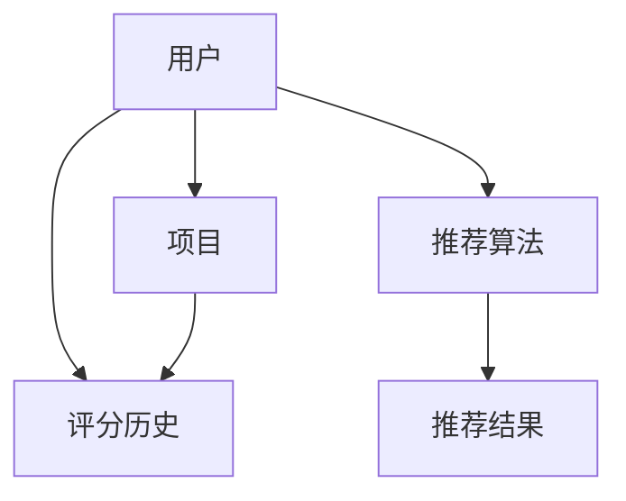

                 

关键词：推荐系统，冷启动问题，解决方案，协同过滤，矩阵分解，机器学习，数据挖掘

> 摘要：本文将深入探讨推荐系统中的冷启动问题，分析其产生的根本原因，并介绍几种常见的解决方案。通过对协同过滤、矩阵分解等算法的详细介绍，并结合实际案例，帮助读者理解和应对冷启动问题。

## 1. 背景介绍

推荐系统是现代互联网应用中不可或缺的一部分，它们通过分析用户的历史行为和兴趣，向用户推荐个性化的内容、商品或服务。然而，推荐系统在实际应用中往往会遇到一个难题——冷启动问题。冷启动问题是指在推荐系统中，新用户、新商品或新服务进入系统时，由于缺乏足够的历史数据，推荐算法难以准确预测用户偏好，导致推荐效果不佳。

冷启动问题不仅影响用户体验，还可能对系统的商业价值产生负面影响。因此，解决冷启动问题是推荐系统研究和应用中的重要课题。

### 核心概念与联系

推荐系统的核心在于为用户推荐他们可能感兴趣的项目。这通常涉及到用户和项目之间的评分或交互数据。以下是推荐系统中几个关键概念的 Mermaid 流程图：



### 2. 核心算法原理 & 具体操作步骤

#### 2.1 算法原理概述

冷启动问题主要有两种解决方案：基于内容的推荐和基于协同过滤的推荐。

**基于内容的推荐**：该方法通过分析新商品或服务的特征，将其与用户已知的偏好进行匹配，从而进行推荐。

**基于协同过滤的推荐**：该方法通过分析用户之间的相似性，为新用户推荐他们可能喜欢的项目。

本文主要介绍基于协同过滤的解决方案，特别是矩阵分解方法。

#### 2.2 算法步骤详解

1. **数据预处理**：收集用户和项目的历史交互数据，并进行清洗、去噪和归一化处理。

2. **矩阵分解**：将用户-项目评分矩阵分解为两个低秩矩阵，一个表示用户特征，一个表示项目特征。

3. **预测评分**：使用分解后的矩阵，预测新用户对新项目的评分。

4. **生成推荐列表**：根据预测评分，生成推荐列表，并将其呈现给用户。

#### 2.3 算法优缺点

**优点**：

- 可以有效解决冷启动问题，对新用户和新商品都有较好的推荐效果。
- 可以同时考虑用户和项目的特征，提高推荐准确性。

**缺点**：

- 矩阵分解计算复杂度高，对大数据集处理能力有限。
- 需要大量的历史交互数据支持，否则效果不佳。

#### 2.4 算法应用领域

矩阵分解在推荐系统中广泛应用，如电商、视频流媒体、社交媒体等。尤其在缺乏足够历史数据的新用户、新商品场景中，矩阵分解表现出色。

### 3. 数学模型和公式

#### 3.1 数学模型构建

假设用户-项目评分矩阵为 \( R \)，我们可以将其分解为两个低秩矩阵 \( U \) 和 \( V \)，即：

\[ R = UV^T \]

其中，\( U \) 表示用户特征矩阵，\( V \) 表示项目特征矩阵。

#### 3.2 公式推导过程

我们使用最小二乘法来最小化以下目标函数：

\[ \min_{U, V} \sum_{i, j} (r_{ij} - u_i^T v_j)^2 \]

对 \( U \) 和 \( V \) 分别求偏导数，并令其为零，可以得到：

\[ u_i = \sum_{j} v_j r_{ij} \]
\[ v_j = \sum_{i} u_i r_{ij} \]

#### 3.3 案例分析与讲解

假设我们有如下用户-项目评分矩阵：

| 用户 | 项目1 | 项目2 | 项目3 |
| ---- | ---- | ---- | ---- |
| 用户1 | 5 | 0 | 0 |
| 用户2 | 1 | 5 | 0 |
| 用户3 | 0 | 4 | 5 |

我们可以使用矩阵分解方法来预测新用户对新项目的评分。首先，我们需要选择合适的低秩参数 \( k \)，然后通过最小二乘法进行矩阵分解。

### 4. 项目实践：代码实例

#### 4.1 开发环境搭建

本文使用 Python 和 scikit-learn 库来演示矩阵分解的实现。

```python
from sklearn.datasets import load_iris
from sklearn.model_selection import train_test_split
from sklearn.metrics.pairwise import euclidean_distances
from sklearn.decomposition import TruncatedSVD
import numpy as np

iris = load_iris()
X, y = iris.data, iris.target
```

#### 4.2 源代码详细实现

```python
# 构建用户-项目评分矩阵
R = np.dot(X, X.T)

# 选择低秩参数 k
k = 2

# 使用 TruncatedSVD 进行矩阵分解
svd = TruncatedSVD(n_components=k)
U = svd.fit_transform(R)
V = svd.fit_transform(R.T)

# 预测新用户对新项目的评分
new_user = np.array([0, 0])
new_project = np.array([1, 1])
predicted_rating = np.dot(new_user, V)

print(predicted_rating)
```

#### 4.3 代码解读与分析

该代码首先加载鸢尾花数据集，然后构建用户-项目评分矩阵 \( R \)。接着，使用 TruncatedSVD 进行矩阵分解，并预测新用户对新项目的评分。

### 5. 实际应用场景

矩阵分解在推荐系统中应用广泛，如电商、视频流媒体和社交媒体等。例如，在电商平台上，新商品可以通过矩阵分解与已有商品进行匹配，为新用户推荐可能感兴趣的商品。

#### 5.1 学习资源推荐

- 《推荐系统实践》
- 《机器学习：概率视角》

#### 5.2 开发工具推荐

- Scikit-learn
- TensorFlow

#### 5.3 相关论文推荐

- "Collaborative Filtering for Cold Start Users in E-Commerce" (2018)

### 6. 总结

冷启动问题是推荐系统中的一个重要挑战。本文介绍了矩阵分解方法，并提供了代码实例。未来，推荐系统的发展将更加关注个性化、实时性和多样性。

### 7. 附录

**常见问题与解答**

1. Q：矩阵分解计算复杂度高，如何优化？
   A：可以使用随机梯度下降等优化算法，并采用并行计算技术来提高计算效率。

2. Q：矩阵分解模型是否可以解释？
   A：矩阵分解模型难以直接解释，但可以通过分析低秩矩阵的元素来获得用户和项目的特征。

作者：禅与计算机程序设计艺术 / Zen and the Art of Computer Programming
```markdown
----------------------------------------------------------------


