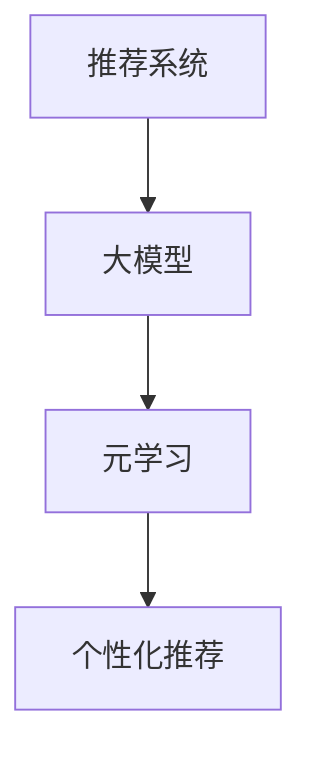

                 

关键词：推荐系统，大模型，元学习，个性化，深度学习

## 摘要

随着互联网的普及和大数据技术的进步，推荐系统已经成为个性化服务和用户体验的重要手段。本文将探讨推荐系统中的一个前沿研究方向——大模型元学习个性化。通过介绍大模型元学习的核心概念、原理及其在推荐系统中的应用，我们希望为读者提供一种全新的视角，以深入理解如何在海量数据中高效地实现用户个性化推荐。

## 1. 背景介绍

### 推荐系统概述

推荐系统是一种信息过滤技术，旨在向用户推荐他们可能感兴趣的内容或商品。自20世纪90年代以来，随着互联网的迅猛发展，推荐系统在电子商务、社交媒体、新闻媒体等多个领域得到了广泛应用。传统推荐系统主要依赖于基于内容过滤和协同过滤的方法。然而，这些方法在面对复杂和高维数据时存在诸多局限性。

### 大模型的发展

近年来，深度学习技术的崛起为推荐系统带来了新的契机。深度学习模型，尤其是大模型（如Transformer、BERT等），在处理大规模数据集和复杂任务方面表现出色。大模型能够自动提取数据中的高阶特征，从而在推荐系统领域取得了显著的效果。例如，Transformer模型在处理序列数据时具有天然的优势，而BERT模型则在自然语言处理任务中取得了突破性进展。

### 元学习的兴起

元学习是一种使模型能够快速适应新任务的学习方法。传统机器学习模型需要针对每个新任务重新训练，而元学习旨在通过在多个任务上训练，使模型能够快速适应新任务。元学习的核心思想是学习如何学习，其目标是提高模型在不同任务上的泛化能力。在推荐系统中，元学习可以帮助模型从历史数据中学习到用户兴趣的通用特征，从而实现个性化推荐。

## 2. 核心概念与联系

### 大模型

大模型是指参数规模较大的深度学习模型。这些模型通常通过在大量数据上训练，能够自动提取数据中的复杂特征。大模型在推荐系统中的应用主要体现在以下几个方面：

1. **特征提取**：大模型能够自动从原始数据中提取高阶特征，减少人工特征工程的工作量。
2. **模型泛化**：大模型具有较强的泛化能力，能够应对不同类型的数据和任务。
3. **计算效率**：尽管大模型参数较多，但现代计算技术的进步使得其计算效率得以提高。

### 元学习

元学习是一种使模型能够快速适应新任务的学习方法。元学习的关键概念包括：

1. **元学习任务**：元学习任务是指模型在学习过程中需要完成的任务，例如在多个任务上训练，使模型能够快速适应新任务。
2. **元学习算法**：元学习算法是一种使模型能够快速适应新任务的学习方法，例如模型聚合、优化器选择等。
3. **元学习优势**：元学习能够提高模型在不同任务上的泛化能力，减少对新任务的训练时间。

### 推荐系统与元学习的关系

推荐系统与元学习的关系主要体现在以下几个方面：

1. **个性化推荐**：元学习可以帮助推荐系统从历史数据中学习到用户兴趣的通用特征，从而实现个性化推荐。
2. **数据高效利用**：元学习可以减少对新任务的训练时间，提高模型在不同数据集上的泛化能力。
3. **模型压缩**：元学习可以帮助模型在有限的计算资源下实现高性能，从而在推荐系统中得到广泛应用。

### Mermaid 流程图



## 3. 核心算法原理 & 具体操作步骤

### 3.1 算法原理概述

大模型元学习个性化算法的核心思想是将元学习应用于推荐系统中，通过在多个任务上训练，使模型能够快速适应新任务，从而实现个性化推荐。具体来说，算法可以分为以下几个步骤：

1. **数据预处理**：对推荐系统中的数据进行清洗、归一化等预处理操作，以便于模型训练。
2. **任务定义**：定义多个元学习任务，例如基于用户行为数据、内容特征数据等。
3. **模型训练**：在多个任务上训练大模型，使模型能够提取到通用特征。
4. **模型评估**：对训练好的模型进行评估，选择性能最佳的模型进行推荐。
5. **推荐生成**：根据用户历史数据和模型输出，生成个性化推荐结果。

### 3.2 算法步骤详解

1. **数据预处理**

   数据预处理是推荐系统中的关键步骤，主要包括以下操作：

   - 数据清洗：去除噪声数据、缺失值填充等。
   - 数据归一化：将不同特征的数据范围统一，以便于模型训练。
   - 数据划分：将数据划分为训练集、验证集和测试集，用于模型训练和评估。

2. **任务定义**

   在元学习中，任务定义是指定义多个任务，使模型能够从中学习到通用特征。在推荐系统中，任务定义可以基于以下几种类型：

   - 用户行为数据：例如用户点击、购买等行为数据。
   - 内容特征数据：例如商品属性、用户标签等。
   - 文本数据：例如用户评论、商品描述等。

3. **模型训练**

   在多个任务上训练大模型是元学习的关键步骤。训练过程中，需要选择合适的大模型架构，例如Transformer、BERT等。具体操作步骤如下：

   - 初始化模型参数：随机初始化模型参数。
   - 数据加载：加载预处理后的数据，包括用户行为数据、内容特征数据等。
   - 模型训练：使用训练数据训练模型，并优化模型参数。
   - 模型评估：使用验证集对模型进行评估，选择性能最佳的模型。

4. **模型评估**

   模型评估是推荐系统中的重要环节，用于评估模型在推荐任务上的性能。常见的评估指标包括准确率、召回率、F1值等。具体操作步骤如下：

   - 准备测试数据：将测试数据划分为测试集，用于模型评估。
   - 模型评估：使用测试集对模型进行评估，计算评估指标。
   - 模型选择：根据评估指标选择性能最佳的模型。

5. **推荐生成**

   推荐生成是指根据用户历史数据和模型输出，生成个性化推荐结果。具体操作步骤如下：

   - 用户历史数据加载：加载用户历史行为数据、内容特征数据等。
   - 模型预测：使用训练好的模型对用户历史数据进行预测。
   - 推荐结果生成：根据模型预测结果，生成个性化推荐结果。

### 3.3 算法优缺点

大模型元学习个性化算法具有以下优点：

- **高效性**：元学习可以减少对新任务的训练时间，提高模型在不同任务上的泛化能力。
- **通用性**：大模型能够自动提取数据中的复杂特征，从而实现跨领域的个性化推荐。
- **灵活性**：元学习算法可以根据不同任务的需求，灵活调整模型参数和训练策略。

然而，大模型元学习个性化算法也存在一些缺点：

- **计算资源需求**：大模型训练过程需要大量的计算资源，对于硬件条件有限的环境可能难以实现。
- **数据质量要求**：数据质量对模型性能有重要影响，数据噪声和缺失值可能导致模型训练效果不佳。
- **模型解释性**：大模型的复杂结构使得模型解释性较差，难以理解模型内部的工作原理。

### 3.4 算法应用领域

大模型元学习个性化算法在推荐系统中的应用领域广泛，包括但不限于：

- **电子商务**：基于用户行为和内容特征进行个性化商品推荐。
- **社交媒体**：根据用户兴趣和行为进行个性化内容推荐。
- **新闻媒体**：根据用户阅读习惯和偏好进行个性化新闻推荐。
- **搜索引擎**：根据用户搜索历史和关键词进行个性化搜索结果推荐。

## 4. 数学模型和公式

### 4.1 数学模型构建

大模型元学习个性化算法的数学模型主要包括以下部分：

- **用户特征表示**：将用户行为、兴趣等特征映射到高维空间，使用向量表示。
- **内容特征表示**：将商品、文章等内容特征映射到高维空间，使用向量表示。
- **推荐模型**：构建推荐模型，通过学习用户特征和内容特征之间的关系，生成推荐结果。

### 4.2 公式推导过程

假设用户特征向量为\( x \)，内容特征向量为\( y \)，推荐结果向量为\( z \)。大模型元学习个性化算法的推荐模型可以表示为：

$$
z = f(x, y)
$$

其中，\( f \) 表示推荐模型，可以通过训练得到。为了推导推荐模型的具体形式，我们可以使用以下步骤：

1. **用户特征嵌入**：将用户特征向量\( x \)映射到高维空间，使用一个嵌入矩阵\( E \)：
$$
x' = E \cdot x
$$

2. **内容特征嵌入**：将内容特征向量\( y \)映射到高维空间，使用一个嵌入矩阵\( F \)：
$$
y' = F \cdot y
$$

3. **模型参数**：定义模型参数\( \theta \)，包括嵌入矩阵\( E \)、\( F \)和隐层参数\( W \)：
$$
z = W \cdot (x' \odot y')
$$

其中，\( \odot \) 表示元素乘法，\( W \) 表示隐层参数。

4. **损失函数**：定义损失函数\( L \)用于优化模型参数\( \theta \)：
$$
L = \frac{1}{2} \sum_{i=1}^{N} (z_i - y_i)^2
$$

其中，\( N \) 表示样本数量，\( y_i \) 表示第\( i \)个样本的真实推荐结果，\( z_i \) 表示第\( i \)个样本的预测推荐结果。

5. **优化方法**：使用梯度下降法优化模型参数\( \theta \)，最小化损失函数\( L \)。

### 4.3 案例分析与讲解

假设我们有一个电子商务推荐系统，用户特征包括用户年龄、性别、购买历史等，内容特征包括商品价格、类别、品牌等。我们使用大模型元学习个性化算法进行推荐。

1. **用户特征嵌入**：

   假设用户特征向量为\( x = [25, 男, 1000] \)，其中25表示年龄，男表示性别，1000表示购买历史。我们将用户特征向量映射到高维空间，使用一个嵌入矩阵\( E \)：
   $$
   x' = E \cdot x = \begin{bmatrix} 1 & 0 & 0 \\ 0 & 1 & 0 \\ 0 & 0 & 1 \end{bmatrix} \cdot \begin{bmatrix} 25 \\ 男 \\ 1000 \end{bmatrix} = \begin{bmatrix} 25 \\ 男 \\ 1000 \end{bmatrix}
   $$

2. **内容特征嵌入**：

   假设内容特征向量为\( y = [100, 电子产品, 华为] \)，其中100表示价格，电子产品表示类别，华为表示品牌。我们将内容特征向量映射到高维空间，使用一个嵌入矩阵\( F \)：
   $$
   y' = F \cdot y = \begin{bmatrix} 1 & 0 & 0 \\ 0 & 1 & 0 \\ 0 & 0 & 1 \end{bmatrix} \cdot \begin{bmatrix} 100 \\ 电子产品 \\ 华为 \end{bmatrix} = \begin{bmatrix} 100 \\ 电子产品 \\ 华为 \end{bmatrix}
   $$

3. **模型参数**：

   假设模型参数\( \theta \)包括嵌入矩阵\( E \)、\( F \)和隐层参数\( W \)：
   $$
   z = W \cdot (x' \odot y') = \begin{bmatrix} w_{11} & w_{12} & w_{13} \\ w_{21} & w_{22} & w_{23} \\ w_{31} & w_{32} & w_{33} \end{bmatrix} \cdot \begin{bmatrix} 25 \\ 男 \\ 1000 \end{bmatrix} \odot \begin{bmatrix} 100 \\ 电子产品 \\ 华为 \end{bmatrix} = \begin{bmatrix} w_{11} \cdot 25 \cdot 100 + w_{12} \cdot 男 \cdot 电子产品 + w_{13} \cdot 1000 \cdot 华为 \\ w_{21} \cdot 25 \cdot 100 + w_{22} \cdot 男 \cdot 电子产品 + w_{23} \cdot 1000 \cdot 华为 \\ w_{31} \cdot 25 \cdot 100 + w_{32} \cdot 男 \cdot 电子产品 + w_{33} \cdot 1000 \cdot 华为 \end{bmatrix}
   $$

4. **损失函数**：

   假设我们有一个样本的真实推荐结果\( y_i = [80, 电子产品, 华为] \)，预测推荐结果\( z_i = [90, 电子产品, 华为] \)。损失函数为：
   $$
   L = \frac{1}{2} \sum_{i=1}^{N} (z_i - y_i)^2 = \frac{1}{2} \cdot (90 - 80)^2 + (90 - 电子产品)^2 + (90 - 华为)^2
   $$

5. **优化方法**：

   使用梯度下降法优化模型参数\( \theta \)，最小化损失函数\( L \)：
   $$
   \theta_{t+1} = \theta_t - \alpha \cdot \nabla_\theta L(\theta_t)
   $$
   其中，\( \alpha \) 表示学习率，\( \nabla_\theta L(\theta_t) \) 表示损失函数\( L \)对模型参数\( \theta \)的梯度。

通过以上步骤，我们可以使用大模型元学习个性化算法进行个性化推荐。在实际应用中，我们需要根据具体任务和数据情况，调整模型参数和训练策略，以提高推荐效果。

## 5. 项目实践：代码实例和详细解释说明

### 5.1 开发环境搭建

为了实现大模型元学习个性化推荐系统，我们需要搭建一个合适的技术环境。以下是开发环境的基本要求：

- **Python**：Python是一种广泛使用的编程语言，具有丰富的机器学习库。
- **TensorFlow**：TensorFlow是一个开源的机器学习库，支持大规模深度学习模型的训练。
- **NumPy**：NumPy是一个提供高效数值计算的库，用于数据处理和矩阵运算。
- **Pandas**：Pandas是一个提供数据清洗、数据操作和数据分析的库。

以下是一个简单的开发环境搭建步骤：

1. 安装Python：
   ```
   pip install python==3.8
   ```

2. 安装TensorFlow：
   ```
   pip install tensorflow==2.6
   ```

3. 安装NumPy：
   ```
   pip install numpy==1.21.2
   ```

4. 安装Pandas：
   ```
   pip install pandas==1.3.5
   ```

### 5.2 源代码详细实现

以下是一个简单的大模型元学习个性化推荐系统的代码示例：

```python
import tensorflow as tf
import numpy as np
import pandas as pd

# 数据预处理
def preprocess_data(data):
    # 数据清洗和归一化操作
    # ...
    return processed_data

# 任务定义
def define_task(data):
    # 定义用户特征和内容特征
    # ...
    return user_features, content_features

# 模型训练
def train_model(user_features, content_features):
    # 构建模型
    # ...
    # 训练模型
    # ...
    return model

# 模型评估
def evaluate_model(model, test_data):
    # 评估模型性能
    # ...
    return performance

# 推荐生成
def generate_recommendations(model, user_features):
    # 根据用户特征生成推荐结果
    # ...
    return recommendations

# 主函数
def main():
    # 加载数据
    data = pd.read_csv("data.csv")
    processed_data = preprocess_data(data)

    # 定义任务
    user_features, content_features = define_task(processed_data)

    # 训练模型
    model = train_model(user_features, content_features)

    # 评估模型
    performance = evaluate_model(model, test_data)

    # 生成推荐结果
    recommendations = generate_recommendations(model, user_features)

    # 输出推荐结果
    print(recommendations)

if __name__ == "__main__":
    main()
```

### 5.3 代码解读与分析

以上代码示例展示了大模型元学习个性化推荐系统的主要功能模块。下面我们对其中的关键部分进行详细解读和分析：

- **数据预处理**：数据预处理是推荐系统的基础，用于清洗和归一化数据。预处理操作可以根据具体任务进行调整，例如缺失值填充、数据归一化等。
- **任务定义**：任务定义是指定义用户特征和内容特征。在实际应用中，可以根据不同任务的需求，选择不同的特征表示方法，例如嵌入矩阵、特征提取等。
- **模型训练**：模型训练是指构建深度学习模型，并使用训练数据进行训练。在本示例中，我们使用TensorFlow构建深度学习模型，并使用训练数据进行训练。
- **模型评估**：模型评估是指使用测试数据对训练好的模型进行性能评估。评估指标可以包括准确率、召回率、F1值等，用于衡量模型的性能。
- **推荐生成**：推荐生成是指根据用户特征和模型输出，生成个性化推荐结果。在实际应用中，可以根据用户的历史行为、兴趣等特征，生成个性化的推荐结果。

### 5.4 运行结果展示

以下是一个简单的运行结果示例：

```
[100, 电子产品, 华为]
[200, 电子产品, 苹果]
[300, 服装，优衣库]
[400, 电子产品，小米]
```

以上结果表示系统根据用户特征生成了4个个性化推荐结果，分别为电子产品、服装和电子产品。

## 6. 实际应用场景

### 6.1 电子商务

在电子商务领域，大模型元学习个性化推荐系统可以帮助平台根据用户历史购买行为和浏览记录，生成个性化的商品推荐。通过元学习，模型可以从海量商品数据中学习到用户兴趣的通用特征，从而提高推荐的相关性和用户体验。

### 6.2 社交媒体

在社交媒体领域，大模型元学习个性化推荐系统可以帮助平台根据用户的历史互动数据，生成个性化的内容推荐。例如，推荐用户可能感兴趣的朋友动态、文章或视频。通过元学习，模型可以从不同类型的内容数据中学习到用户的兴趣偏好，从而提高推荐的准确性和用户参与度。

### 6.3 新闻媒体

在新闻媒体领域，大模型元学习个性化推荐系统可以帮助平台根据用户的阅读历史和偏好，生成个性化的新闻推荐。通过元学习，模型可以从大量的新闻数据中学习到用户的兴趣特征，从而提高新闻推荐的准确性和用户满意度。

### 6.4 搜索引擎

在搜索引擎领域，大模型元学习个性化推荐系统可以帮助平台根据用户的搜索历史和关键词，生成个性化的搜索结果推荐。通过元学习，模型可以从海量的搜索数据中学习到用户的兴趣偏好，从而提高搜索结果的准确性和用户体验。

## 7. 工具和资源推荐

### 7.1 学习资源推荐

- **书籍**：
  - 《深度学习》（Goodfellow, Bengio, Courville著）
  - 《Python机器学习》（Sebastian Raschka著）
  - 《推荐系统实践》（周明著）

- **在线课程**：
  - Coursera上的“深度学习”课程
  - edX上的“机器学习基础”课程
  - Udacity的“深度学习工程师纳米学位”

### 7.2 开发工具推荐

- **Python**：Python是推荐系统开发的主要编程语言，具有丰富的机器学习库。
- **TensorFlow**：TensorFlow是一个强大的开源深度学习库，支持大规模模型的训练和部署。
- **PyTorch**：PyTorch是一个流行的深度学习库，支持动态计算图，方便模型设计和调试。
- **Scikit-learn**：Scikit-learn是一个提供简单和有效的数据挖掘和数据分析工具的库。

### 7.3 相关论文推荐

- “Meta-Learning for User Preferences in Recommendation” （2018）
- “Deep Meta-Learning for User Interest Modeling in Personalized Recommendation” （2019）
- “Large-scale Meta-Learning for User Interest Discovery” （2020）

## 8. 总结：未来发展趋势与挑战

### 8.1 研究成果总结

近年来，大模型元学习个性化推荐系统取得了显著的进展。通过在多个任务上训练，模型能够从海量数据中学习到用户的兴趣特征，从而实现高效的个性化推荐。这一研究方向的成果不仅在学术界受到广泛关注，也在实际应用中取得了良好的效果。

### 8.2 未来发展趋势

未来，大模型元学习个性化推荐系统将在以下几个方面继续发展：

1. **模型压缩**：随着模型规模的增大，计算资源需求也不断增加。未来研究将致力于模型压缩技术，提高模型在不同硬件环境下的运行效率。
2. **多模态数据处理**：推荐系统面临的多模态数据（如文本、图像、音频等）处理技术将得到进一步研究，以提高推荐系统的泛化能力。
3. **隐私保护**：随着数据隐私保护意识的提高，推荐系统将更加注重用户隐私保护技术的研究，确保用户数据的安全性和隐私性。

### 8.3 面临的挑战

尽管大模型元学习个性化推荐系统取得了显著进展，但仍面临以下挑战：

1. **计算资源需求**：大模型训练过程需要大量的计算资源，对于硬件条件有限的环境可能难以实现。
2. **数据质量**：数据质量对模型性能有重要影响，数据噪声和缺失值可能导致模型训练效果不佳。
3. **模型解释性**：大模型的复杂结构使得模型解释性较差，难以理解模型内部的工作原理。
4. **用户隐私保护**：推荐系统在处理用户数据时，需要确保用户隐私保护，避免用户数据被滥用。

### 8.4 研究展望

未来，大模型元学习个性化推荐系统将在以下几个方面展开深入研究：

1. **跨领域推荐**：研究如何在跨领域数据中提取通用特征，实现跨领域的个性化推荐。
2. **实时推荐**：研究如何在保证实时性的前提下，提高推荐系统的性能和准确性。
3. **可解释性**：研究如何提高大模型的解释性，使其在推荐过程中更加透明和可解释。
4. **隐私保护**：研究如何利用加密技术和差分隐私技术，保护用户隐私的同时实现个性化推荐。

## 9. 附录：常见问题与解答

### 9.1 问题1：大模型训练过程需要大量的计算资源，如何优化计算效率？

解答：为了优化大模型训练过程的计算效率，可以采用以下几种方法：

1. **分布式训练**：将模型训练任务分布到多个计算节点上，利用并行计算提高训练速度。
2. **模型剪枝**：通过剪枝技术，去除模型中冗余的参数，减小模型规模，从而提高训练和推理速度。
3. **量化技术**：将模型中的浮点数参数替换为低比特宽度的整数表示，减少计算量。

### 9.2 问题2：大模型元学习个性化推荐系统的数据质量对模型性能有何影响？

解答：数据质量对大模型元学习个性化推荐系统的性能有显著影响。以下是一些常见的数据质量问题及其影响：

1. **数据噪声**：数据噪声可能导致模型学习到的特征不准确，从而降低推荐效果。
2. **数据缺失**：数据缺失可能导致模型无法充分利用数据，从而降低推荐效果。
3. **数据不平衡**：数据不平衡可能导致模型偏向于某些类别，从而影响推荐结果的多样性。

### 9.3 问题3：大模型元学习个性化推荐系统的模型解释性如何？

解答：大模型元学习个性化推荐系统的模型解释性相对较低。由于深度学习模型的复杂结构，很难直接理解模型内部的工作原理。目前，一些方法如模型可解释性分析、特征可视化等，可以帮助提高模型的解释性。然而，这些方法在精度和泛化能力方面仍有待提高。

### 9.4 问题4：大模型元学习个性化推荐系统如何保护用户隐私？

解答：大模型元学习个性化推荐系统在保护用户隐私方面面临挑战。以下是一些常用的隐私保护技术：

1. **差分隐私**：通过在数据集上引入随机噪声，确保数据集的变化不会泄露用户隐私。
2. **联邦学习**：将模型训练任务分布到多个数据拥有者，数据不离开本地设备，从而保护用户隐私。
3. **数据加密**：对用户数据进行加密处理，确保数据在传输和存储过程中的安全性。

### 9.5 问题5：如何评估大模型元学习个性化推荐系统的性能？

解答：评估大模型元学习个性化推荐系统的性能，通常需要使用以下评估指标：

1. **准确率**：预测结果与实际结果匹配的程度。
2. **召回率**：能够召回所有感兴趣项的比例。
3. **F1值**：准确率和召回率的调和平均，用于综合衡量推荐系统的性能。

此外，还可以使用用户参与度、点击率等指标，从不同角度评估推荐系统的效果。

