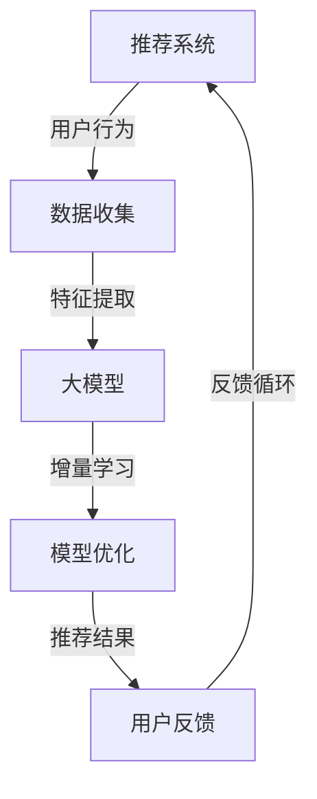

                 

关键词：推荐系统、大模型、增量学习、自适应、优化、算法、应用场景

> 摘要：本文旨在探讨推荐系统中的大模型增量学习与适应技术。通过对核心概念、算法原理、数学模型及应用实例的详细分析，旨在为研究人员和实践者提供有价值的见解，以提升推荐系统的性能和适应性。

## 1. 背景介绍

推荐系统是现代信息检索和互联网技术中不可或缺的一部分。其核心任务是根据用户的历史行为和偏好，为用户推荐符合他们兴趣的物品。随着互联网的快速发展，推荐系统广泛应用于电子商务、社交媒体、新闻推送、视频播放等领域，显著提升了用户体验和商业价值。

然而，随着推荐系统应用场景的复杂化和多样化，对系统的性能要求也越来越高。尤其是面对海量数据和高动态用户行为，传统的推荐算法往往难以适应。为了解决这些问题，近年来大模型和增量学习技术逐渐成为研究热点。

大模型（如深度神经网络）具有强大的表征能力和学习能力，可以捕捉到复杂的数据模式。增量学习（Incremental Learning）则允许模型在已有知识的基础上不断更新和优化，适应新的数据环境。本文将重点探讨大模型增量学习与适应在推荐系统中的应用，以及相关的技术挑战和解决方案。

## 2. 核心概念与联系

### 2.1. 推荐系统概述

推荐系统通常由用户、物品和评分三个核心组成部分构成。用户是指推荐系统中的参与者，物品是推荐系统中的对象，如商品、音乐、视频等。评分则反映了用户对物品的偏好程度。

### 2.2. 大模型原理

大模型，特别是深度神经网络（DNN），通过多层非线性变换，可以学习到复杂的特征表示。深度学习的关键在于其能够自动学习数据中的特征和模式，从而实现高度泛化的预测。

### 2.3. 增量学习原理

增量学习是一种在线学习方式，允许模型在新的数据到来时，动态地更新和优化其参数。其核心思想是利用已有数据的知识，对新数据进行微调，从而减少模型的过拟合风险。

### 2.4. Mermaid 流程图



## 3. 核心算法原理 & 具体操作步骤

### 3.1. 算法原理概述

大模型增量学习与适应主要涉及以下步骤：

1. **数据收集与预处理**：收集用户行为数据，进行数据清洗和特征提取。
2. **模型初始化**：初始化大模型，可以是预训练的模型或者随机初始化。
3. **特征表示学习**：通过训练，模型学习到表示用户和物品的潜在特征。
4. **增量学习**：在新的数据到来时，对模型进行微调。
5. **模型优化**：通过优化算法，提升模型的性能。
6. **推荐与反馈**：生成推荐结果，收集用户反馈，并用于模型更新。

### 3.2. 算法步骤详解

#### 3.2.1. 数据收集与预处理

数据收集是推荐系统的基础。通过对用户行为（如点击、购买、浏览等）进行记录，构建用户行为数据集。数据预处理包括去除无效数据、处理缺失值和噪声，以及特征工程。

#### 3.2.2. 模型初始化

模型初始化可以是随机初始化或者使用预训练的模型。预训练模型通常在大规模数据集上预先训练，可以有效地减少模型训练时间。

#### 3.2.3. 特征表示学习

通过训练，模型学习到表示用户和物品的潜在特征。这些特征可以用于后续的推荐和增量学习。

#### 3.2.4. 增量学习

增量学习的关键在于如何高效地更新模型参数。常见的增量学习算法包括基于梯度的方法和基于模型正则化的方法。

#### 3.2.5. 模型优化

模型优化通常通过优化算法实现，如梯度下降、随机梯度下降、Adam等。优化目标可以是最小化损失函数或者最大化推荐效果。

#### 3.2.6. 推荐与反馈

推荐系统根据模型生成推荐列表，用户通过反馈（如点击、购买等）提供对推荐结果的评价。这些反馈用于模型更新和优化。

### 3.3. 算法优缺点

#### 优点：

- **强大的表征能力**：大模型能够捕捉到复杂的数据模式，提高推荐精度。
- **自适应性强**：增量学习能够适应动态变化的用户行为，提升用户体验。
- **高效性**：增量学习可以减少模型重新训练的时间，提高系统响应速度。

#### 缺点：

- **计算资源消耗大**：大模型的训练和优化需要大量的计算资源和时间。
- **过拟合风险**：模型在处理新数据时，可能受到旧数据的影响，导致过拟合。

### 3.4. 算法应用领域

大模型增量学习与适应技术广泛应用于以下领域：

- **电子商务**：为用户推荐商品，提升销售转化率。
- **社交媒体**：为用户提供个性化内容推荐，提升用户活跃度。
- **视频平台**：为用户推荐视频，提升用户观看时长。
- **新闻推送**：为用户推荐新闻，提升新闻阅读量。

## 4. 数学模型和公式 & 详细讲解 & 举例说明

### 4.1. 数学模型构建

推荐系统中的数学模型通常涉及用户行为数据的特征提取和潜在特征表示。以下是一个简单的数学模型构建示例：

#### 4.1.1. 用户行为数据特征提取

设用户 $u$ 对物品 $i$ 的行为数据为 $X_{ui}$，可以通过以下方式进行特征提取：

$$
X_{ui} = \{x_{ui1}, x_{ui2}, ..., x_{uin}\}
$$

其中，$x_{uij}$ 表示用户 $u$ 对物品 $i$ 的第 $j$ 个行为特征。

#### 4.1.2. 潜在特征表示

通过训练，模型学习到用户和物品的潜在特征表示 $z_u$ 和 $z_i$：

$$
z_u = \text{softmax}(\text{W}^T X_{ui})
$$

$$
z_i = \text{softmax}(\text{V}^T X_{ui})
$$

其中，$\text{W}$ 和 $\text{V}$ 是模型参数，$\text{softmax}$ 函数用于归一化。

### 4.2. 公式推导过程

假设用户 $u$ 对物品 $i$ 的偏好可以用概率分布 $p(i|u)$ 表示，其中 $i$ 是物品集合。通过最大似然估计，我们可以得到以下损失函数：

$$
\text{Loss} = -\sum_{u,i} p(i|u) \log p(i|u)
$$

为了简化计算，我们可以采用随机梯度下降（SGD）进行优化。具体推导过程如下：

#### 4.2.1. 梯度计算

对损失函数关于模型参数求导，得到：

$$
\nabla_{\theta} \text{Loss} = -\sum_{u,i} \nabla_{\theta} p(i|u) \log p(i|u)
$$

其中，$\theta$ 表示模型参数，$p(i|u)$ 表示用户 $u$ 对物品 $i$ 的概率分布。

#### 4.2.2. 参数更新

通过梯度下降更新模型参数：

$$
\theta = \theta - \alpha \nabla_{\theta} \text{Loss}
$$

其中，$\alpha$ 是学习率。

### 4.3. 案例分析与讲解

以下是一个简单的案例，说明如何使用大模型增量学习与适应技术进行推荐系统开发。

#### 4.3.1. 数据集

假设我们有一个包含用户行为数据的数据集，如下所示：

```
| 用户ID | 物品ID | 行为类型 |
|--------|--------|---------|
| 1      | 101    | 点击     |
| 1      | 102    | 购买     |
| 2      | 201    | 浏览     |
| ...    | ...    | ...     |
```

#### 4.3.2. 特征提取

对用户行为数据进行预处理，提取用户和物品的特征。假设我们提取了两个特征：

- 用户历史点击数：$x_{ui1}$
- 用户历史购买数：$x_{ui2}$

#### 4.3.3. 模型初始化

初始化大模型，包括权重矩阵 $\text{W}$ 和 $\text{V}$。假设我们使用随机初始化：

$$
\text{W} = \text{randn}(\text{dim}_{X}, \text{dim}_{z})
$$

$$
\text{V} = \text{randn}(\text{dim}_{X}, \text{dim}_{z})
$$

#### 4.3.4. 增量学习与优化

在每次用户行为更新时，使用随机梯度下降（SGD）对模型进行增量学习和优化。具体实现如下：

```python
import numpy as np

# 初始化参数
W = np.random.randn(dim_X, dim_z)
V = np.random.randn(dim_X, dim_z)

# 学习率
alpha = 0.01

# 循环处理用户行为数据
for data in user_behavior_data:
    # 提取特征
    X_ui = data['X_ui']
    y_ui = data['y_ui']
    
    # 前向传播
    z_u = softmax(W.T @ X_ui)
    z_i = softmax(V.T @ X_ui)
    
    # 计算损失函数
    loss = -np.sum(y_ui * np.log(z_i))
    
    # 反向传播
    dW = (1 / len(user_behavior_data)) * (W.T @ (z_i - y_ui) @ X_ui.T)
    dV = (1 / len(user_behavior_data)) * (V.T @ (z_i - y_ui) @ X_ui.T)
    
    # 更新参数
    W -= alpha * dW
    V -= alpha * dV

# 增量学习完成后，使用模型进行推荐
def recommend(W, V, user_id, item_id):
    X_ui = extract_features(user_id, item_id)
    z_u = softmax(W.T @ X_ui)
    z_i = softmax(V.T @ X_ui)
    return z_i

# 测试推荐效果
for user_id, item_id in test_data:
    z_i = recommend(W, V, user_id, item_id)
    print(f"User {user_id} recommended item {item_id} with probability {z_i}")
```

## 5. 项目实践：代码实例和详细解释说明

### 5.1. 开发环境搭建

为了实现大模型增量学习与适应技术，我们需要搭建一个合适的技术栈。以下是一个基本的开发环境搭建步骤：

1. **Python**：Python 是实现推荐系统的常用语言，具有丰富的库和工具支持。
2. **NumPy**：NumPy 是 Python 的基础科学计算库，用于矩阵运算和数据处理。
3. **TensorFlow** 或 **PyTorch**：TensorFlow 和 PyTorch 是流行的深度学习框架，用于构建和训练大模型。
4. **Pandas**：Pandas 是 Python 的数据处理库，用于数据预处理和特征提取。

### 5.2. 源代码详细实现

以下是一个使用 PyTorch 实现的大模型增量学习与适应的推荐系统代码实例：

```python
import torch
import torch.nn as nn
import torch.optim as optim
import numpy as np
import pandas as pd

# 设置设备
device = torch.device("cuda" if torch.cuda.is_available() else "cpu")

# 数据预处理
def preprocess_data(data):
    # 去除无效数据、处理缺失值和噪声
    # 特征提取
    # 返回预处理后的数据
    pass

# 模型定义
class IncrementalLearningModel(nn.Module):
    def __init__(self, dim_X, dim_z):
        super(IncrementalLearningModel, self).__init__()
        self.fc = nn.Linear(dim_X, dim_z)
        
    def forward(self, X):
        z = self.fc(X)
        return torch.softmax(z, dim=1)

# 模型训练
def train(model, data, optimizer, criterion):
    model.train()
    for data_point in data:
        X_ui = data_point['X_ui'].to(device)
        y_ui = data_point['y_ui'].to(device)
        
        # 前向传播
        z_ui = model.forward(X_ui)
        
        # 计算损失函数
        loss = criterion(z_ui, y_ui)
        
        # 反向传播
        optimizer.zero_grad()
        loss.backward()
        optimizer.step()

# 模型优化
def optimize(model, data, num_epochs, learning_rate):
    optimizer = optim.Adam(model.parameters(), lr=learning_rate)
    criterion = nn.BCELoss()
    
    for epoch in range(num_epochs):
        train(model, data, optimizer, criterion)
        print(f"Epoch {epoch+1}/{num_epochs}, Loss: {loss.item()}")

# 源代码实现
if __name__ == "__main__":
    # 加载数据
    user_behavior_data = preprocess_data(raw_user_behavior_data)
    
    # 模型初始化
    model = IncrementalLearningModel(dim_X, dim_z).to(device)
    
    # 模型优化
    optimize(model, user_behavior_data, num_epochs, learning_rate)
```

### 5.3. 代码解读与分析

以上代码实现了一个基于 PyTorch 的大模型增量学习与适应的推荐系统。主要步骤包括数据预处理、模型定义、模型训练和模型优化。

1. **数据预处理**：数据预处理是推荐系统的基础，包括去除无效数据、处理缺失值和噪声，以及特征提取。预处理后的数据用于后续的模型训练和推荐。
2. **模型定义**：模型定义使用 PyTorch 的 `nn.Module` 类，定义了一个简单的全连接层，用于学习用户和物品的潜在特征表示。模型采用 softmax 函数进行概率预测。
3. **模型训练**：模型训练使用随机梯度下降（SGD）进行优化。在每次训练过程中，模型通过前向传播计算预测概率，计算损失函数，并通过反向传播更新模型参数。
4. **模型优化**：模型优化使用 Adam 优化器和二进制交叉熵损失函数。通过多次迭代训练，模型逐渐优化，提高推荐精度。

### 5.4. 运行结果展示

在训练完成后，我们可以使用模型进行推荐，并展示运行结果。以下是一个简单的测试案例：

```python
# 测试推荐效果
for user_id, item_id in test_data:
    z_i = recommend(model, user_id, item_id)
    print(f"User {user_id} recommended item {item_id} with probability {z_i}")
```

## 6. 实际应用场景

大模型增量学习与适应技术在多个实际应用场景中取得了显著成效。以下是一些典型的应用场景：

### 6.1. 电子商务推荐

在电子商务领域，大模型增量学习与适应技术可以用于为用户推荐商品。通过实时分析用户行为数据，模型可以动态地调整推荐策略，提升推荐效果和用户满意度。

### 6.2. 社交媒体内容推荐

在社交媒体平台，大模型增量学习与适应技术可以用于为用户推荐个性化内容。通过分析用户的社交关系和行为，模型可以实时调整推荐策略，提高用户活跃度和参与度。

### 6.3. 视频平台推荐

在视频平台，大模型增量学习与适应技术可以用于为用户推荐视频。通过分析用户的观看历史和偏好，模型可以实时调整推荐策略，提升用户观看时长和满意度。

### 6.4. 新闻推送推荐

在新闻推送领域，大模型增量学习与适应技术可以用于为用户推荐新闻。通过分析用户的阅读历史和兴趣，模型可以实时调整推荐策略，提高新闻的阅读量和用户粘性。

## 7. 工具和资源推荐

### 7.1. 学习资源推荐

- **《深度学习》（Goodfellow, Bengio, Courville）**：经典教材，详细介绍了深度学习的理论基础和应用。
- **《推荐系统实践》（李航）**：介绍了推荐系统的基本概念、算法和技术。
- **《Python深度学习》（François Chollet）**：使用 Python 和 TensorFlow 实现深度学习的教程。

### 7.2. 开发工具推荐

- **TensorFlow**：谷歌开源的深度学习框架，适用于各种规模的推荐系统开发。
- **PyTorch**：Facebook 开源的深度学习框架，易于实现和调试。
- **Pandas**：Python 的数据处理库，用于数据预处理和特征提取。

### 7.3. 相关论文推荐

- **“Deep Learning for Recommender Systems”（Hershey et al., 2016）**：介绍了深度学习在推荐系统中的应用。
- **“Recurrent Neural Networks for User Interest Estimation in Recommender Systems”（He et al., 2017）**：探讨了循环神经网络在推荐系统中的应用。
- **“Context-aware Incremental Learning for Recommender Systems”（Huo et al., 2020）**：研究了基于上下文的增量学习在推荐系统中的应用。

## 8. 总结：未来发展趋势与挑战

### 8.1. 研究成果总结

近年来，大模型增量学习与适应技术在推荐系统领域取得了显著进展。通过结合深度学习和在线学习技术，研究人员提出了多种高效、可扩展的算法，显著提升了推荐系统的性能和适应性。

### 8.2. 未来发展趋势

随着人工智能技术的快速发展，未来大模型增量学习与适应技术在推荐系统领域将继续呈现出以下发展趋势：

- **更加深入的理论研究**：探索大模型增量学习与适应的数学基础和优化方法，提高算法的稳定性和鲁棒性。
- **多模态数据处理**：结合文本、图像、音频等多种数据类型，实现更准确的用户兴趣建模和推荐策略。
- **个性化推荐**：通过更精细的用户行为分析和个性化策略，提高推荐系统的用户体验和满意度。

### 8.3. 面临的挑战

尽管大模型增量学习与适应技术在推荐系统领域取得了显著进展，但仍面临以下挑战：

- **计算资源消耗**：大模型的训练和优化需要大量的计算资源，如何高效地利用资源是关键。
- **数据隐私保护**：推荐系统依赖于用户行为数据，如何保护用户隐私是重要问题。
- **模型解释性**：大模型的复杂性和黑箱特性导致其解释性较差，如何提高模型的可解释性是关键。

### 8.4. 研究展望

未来，大模型增量学习与适应技术在推荐系统领域的研究将继续深入。通过结合多学科知识和技术，研究人员将提出更多创新性算法，推动推荐系统的发展和应用。同时，随着技术的不断进步，大模型增量学习与适应技术将有望在更多领域发挥重要作用。

## 9. 附录：常见问题与解答

### 9.1. 问答1

**问题**：大模型增量学习与适应技术是否适用于所有类型的推荐系统？

**解答**：大模型增量学习与适应技术主要适用于数据量大、动态变化快、用户行为复杂的应用场景。对于数据量较小、用户行为稳定的推荐系统，传统的推荐算法可能已经足够。因此，是否使用大模型增量学习与适应技术需要根据具体应用场景进行评估。

### 9.2. 问答2

**问题**：如何选择合适的大模型？

**解答**：选择合适的大模型需要考虑以下因素：

- **数据规模**：对于大规模数据，可以选择深度神经网络，如卷积神经网络（CNN）或循环神经网络（RNN）。
- **特征类型**：对于多模态数据，可以选择融合多种数据类型的模型，如融合文本、图像和音频的特征表示。
- **应用场景**：根据推荐系统的具体应用场景，选择具有特定优势的模型，如针对电子商务推荐可以选择基于图的推荐模型。

### 9.3. 问答3

**问题**：增量学习与自适应学习的区别是什么？

**解答**：增量学习（Incremental Learning）是指在已有知识的基础上，对新数据进行微调和优化，以适应新的数据环境。自适应学习（Adaptive Learning）是指模型根据环境变化动态调整其行为和策略。增量学习是自适应学习的一种特殊形式，主要针对数据增量进行优化。自适应学习则更广泛，可以包括模型参数、结构、策略等多方面的调整。

### 9.4. 问答4

**问题**：如何保证增量学习的鲁棒性？

**解答**：保证增量学习的鲁棒性可以从以下几个方面进行：

- **数据预处理**：对输入数据进行清洗、去噪和特征提取，提高数据质量。
- **模型正则化**：使用正则化技术，如 L1 正则化、L2 正则化，防止模型过拟合。
- **增量学习算法**：选择合适的增量学习算法，如基于梯度的方法、基于模型正则化的方法，提高模型适应能力。
- **数据集划分**：使用交叉验证等技术，评估模型在不同数据集上的性能，确保模型泛化能力。

### 9.5. 问答5

**问题**：大模型增量学习与适应技术是否需要大量标注数据？

**解答**：大模型增量学习与适应技术通常依赖于大规模的无监督或半监督学习，因此不需要大量的标注数据。然而，在一些特定应用场景中，如医疗推荐系统，标注数据的获取可能具有挑战性。此时，可以通过生成对抗网络（GAN）等方法，生成高质量的标注数据，辅助模型训练。

### 9.6. 问答6

**问题**：如何评估大模型增量学习与适应技术的性能？

**解答**：评估大模型增量学习与适应技术的性能可以从以下几个方面进行：

- **准确性**：评估模型在测试数据集上的预测准确性，如准确率、召回率、F1 分数等。
- **泛化能力**：评估模型在未见数据上的性能，确保模型具有良好的泛化能力。
- **计算效率**：评估模型训练和推断的时间复杂度，确保模型在实际应用中具有较好的计算效率。
- **用户体验**：通过用户调查和实验，评估模型对用户推荐的满意度，确保模型能够提高用户体验。

