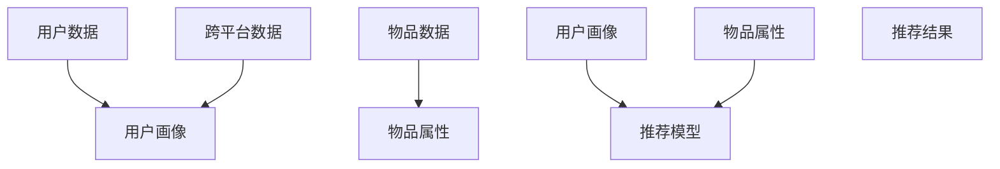

                 

关键词：推荐系统，跨平台数据，大数据模型，算法原理，应用实践，数学模型，代码实例

> 摘要：随着互联网和移动互联网的快速发展，推荐系统已经成为了各大平台的核心竞争力之一。然而，如何有效利用跨平台数据，提升推荐系统的准确性和个性化程度，成为了一个亟待解决的问题。本文将从大模型的新思路出发，探讨跨平台数据在推荐系统中的应用，并提出相应的算法原理、数学模型以及项目实践。

## 1. 背景介绍

推荐系统（Recommender Systems）作为信息过滤和内容个性化的一种重要方式，旨在根据用户的兴趣、历史行为和偏好，向用户推荐其可能感兴趣的内容。从最初的基于内容的推荐（Content-based Filtering）到协同过滤（Collaborative Filtering），再到现在的深度学习推荐（Deep Learning-based Recommender Systems），推荐系统经历了多次技术革新。然而，随着互联网平台的多样化，单一平台的推荐系统难以满足用户在不同平台间的跨平台体验。

跨平台数据（Cross-platform Data）是指用户在多个平台上的行为数据和偏好信息，如社交媒体、电子商务、在线视频等。这些数据蕴含了丰富的用户特征和兴趣点，是提升推荐系统效果的重要资源。然而，如何有效整合和利用这些跨平台数据，实现跨平台的个性化推荐，是当前研究中的一个重要课题。

本文将针对跨平台数据在推荐系统中的应用，探讨大模型（Large-scale Models）的新思路。大模型是指参数量庞大、计算能力强大的机器学习模型，如深度神经网络（Deep Neural Networks，DNN）和图神经网络（Graph Neural Networks，GNN）。大模型在处理大规模、多维度数据方面具有显著优势，有望在跨平台推荐系统中发挥重要作用。

## 2. 核心概念与联系

### 2.1 推荐系统概述

推荐系统主要涉及以下几个核心概念：

- **用户（User）**：推荐系统的核心，拥有兴趣、偏好和行为数据。
- **物品（Item）**：用户可能感兴趣的内容，如电影、商品、文章等。
- **评分（Rating）**：用户对物品的评分，表示用户对物品的兴趣程度。
- **行为数据（Behavior Data）**：用户在平台上的行为记录，如浏览、点击、购买等。

### 2.2 跨平台数据整合

跨平台数据整合的关键在于如何将不同平台的数据进行统一表示和整合。通常，可以使用以下几种方法：

- **用户画像（User Profile）**：将用户的兴趣、行为数据整合到一个统一的用户画像中，用于表征用户特征。
- **物品属性（Item Attributes）**：将物品的属性信息整合到一个统一的物品属性表中，用于表征物品特征。
- **交叉数据（Cross-platform Data）**：记录用户在多个平台上的行为和偏好，用于表征用户跨平台特征。

### 2.3 大模型架构

大模型架构通常包括以下几个层次：

- **输入层（Input Layer）**：接收用户画像、物品属性和交叉数据等输入。
- **隐藏层（Hidden Layers）**：通过神经网络结构对输入数据进行特征提取和变换。
- **输出层（Output Layer）**：生成推荐结果，如物品评分、概率等。

### 2.4 Mermaid 流程图

以下是一个简单的 Mermaid 流程图，展示了推荐系统中的跨平台数据整合与利用：



## 3. 核心算法原理 & 具体操作步骤

### 3.1 算法原理概述

跨平台推荐系统的核心算法原理主要包括以下几个方面：

- **特征工程**：对用户画像、物品属性和跨平台数据进行特征提取和整合。
- **模型选择**：选择合适的大模型架构，如深度神经网络（DNN）或图神经网络（GNN）。
- **模型训练**：利用训练数据对模型进行训练，优化模型参数。
- **推荐生成**：利用训练好的模型对用户进行个性化推荐。

### 3.2 算法步骤详解

1. **数据预处理**：

   - **用户画像**：通过用户的历史行为数据、社交关系、地理位置等信息，构建用户画像。
   - **物品属性**：通过物品的类别、标签、属性等信息，构建物品属性表。
   - **交叉数据**：记录用户在多个平台上的行为和偏好，构建交叉数据表。

2. **特征提取**：

   - **用户特征**：利用词袋模型、TF-IDF等方法对用户画像进行特征提取。
   - **物品特征**：利用词袋模型、TF-IDF等方法对物品属性进行特征提取。
   - **交叉特征**：利用统计学习方法对交叉数据进行特征提取。

3. **模型选择**：

   - **DNN模型**：适用于处理高维稀疏数据，如用户画像和物品属性。
   - **GNN模型**：适用于处理图结构数据，如用户社交网络和物品关系网络。

4. **模型训练**：

   - **数据划分**：将数据划分为训练集、验证集和测试集。
   - **模型训练**：利用训练集对模型进行训练，优化模型参数。
   - **模型验证**：利用验证集对模型进行验证，调整模型参数。

5. **推荐生成**：

   - **用户兴趣预测**：利用训练好的模型对用户兴趣进行预测。
   - **物品推荐**：根据用户兴趣预测结果，为用户推荐相关物品。

### 3.3 算法优缺点

- **优点**：

  - **高效性**：大模型能够处理大规模、多维度数据，提高推荐效率。
  - **个性化**：通过跨平台数据整合，实现更个性化的推荐。
  - **灵活性**：可根据不同场景和需求，选择合适的模型和算法。

- **缺点**：

  - **计算资源消耗**：大模型训练和推理需要大量计算资源。
  - **数据隐私**：跨平台数据整合可能涉及用户隐私问题。

### 3.4 算法应用领域

- **电子商务**：为用户推荐商品，提升销售转化率。
- **社交媒体**：为用户推荐感兴趣的内容，提高用户活跃度。
- **在线视频**：为用户推荐视频，提升观看时长和用户满意度。

## 4. 数学模型和公式 & 详细讲解 & 举例说明

### 4.1 数学模型构建

在推荐系统中，常用的数学模型包括矩阵分解、协同过滤和深度学习等。以下以矩阵分解为例，介绍数学模型的构建。

#### 矩阵分解

设用户数为 \( m \)，物品数为 \( n \)，用户 \( u \) 对物品 \( i \) 的评分为 \( r_{ui} \)。矩阵分解的目标是学习两个低维矩阵 \( U \) 和 \( V \)，使得预测评分 \( \hat{r}_{ui} \) 接近实际评分 \( r_{ui} \)。

\[ \hat{r}_{ui} = u_i \cdot v_i \]

其中，\( u_i \) 和 \( v_i \) 分别为用户 \( u \) 和物品 \( i \) 在低维空间中的表示。

#### 损失函数

常用的损失函数包括均方误差（MSE）和交叉熵损失（Cross-Entropy Loss）等。

- **均方误差损失函数**：

  \[ L_{MSE} = \frac{1}{2} \sum_{u,i} (r_{ui} - \hat{r}_{ui})^2 \]

- **交叉熵损失函数**：

  \[ L_{CE} = - \sum_{u,i} r_{ui} \log(\hat{r}_{ui}) + (1 - r_{ui}) \log(1 - \hat{r}_{ui}) \]

#### 梯度下降

梯度下降是一种常用的优化方法，用于最小化损失函数。

\[ \theta = \theta - \alpha \nabla_{\theta} L(\theta) \]

其中，\( \theta \) 表示模型参数，\( \alpha \) 表示学习率，\( \nabla_{\theta} L(\theta) \) 表示损失函数关于模型参数的梯度。

### 4.2 公式推导过程

以均方误差损失函数为例，介绍公式推导过程。

#### 假设

- \( r_{ui} \) 和 \( \hat{r}_{ui} \) 均服从正态分布。
- \( \mu_u \) 和 \( \mu_i \) 分别为用户 \( u \) 和物品 \( i \) 的均值。

#### 推导

1. **均方误差损失函数**：

   \[ L_{MSE} = \frac{1}{2} \sum_{u,i} (r_{ui} - \hat{r}_{ui})^2 \]

2. **期望**：

   \[ E(L_{MSE}) = \frac{1}{2} \sum_{u,i} E((r_{ui} - \hat{r}_{ui})^2) \]

3. **展开**：

   \[ E((r_{ui} - \hat{r}_{ui})^2) = E(r_{ui}^2) - 2E(r_{ui} \hat{r}_{ui}) + E(\hat{r}_{ui}^2) \]

4. **代入**：

   \[ E(r_{ui}^2) = \sigma_u^2 + \mu_u^2 \]
   \[ E(\hat{r}_{ui}^2) = \sigma_i^2 + \mu_i^2 \]
   \[ E(r_{ui} \hat{r}_{ui}) = \mu_u \mu_i \]

5. **合并**：

   \[ E(L_{MSE}) = \frac{1}{2} \sum_{u,i} (\sigma_u^2 + \mu_u^2 - 2\mu_u \mu_i + \sigma_i^2) \]

6. **简化**：

   \[ E(L_{MSE}) = \frac{1}{2} (\sum_{u} \sigma_u^2 + \sum_{i} \sigma_i^2 - 2\mu_u \mu_i) \]

### 4.3 案例分析与讲解

假设一个推荐系统中有1000个用户和1000个物品，用户对物品的评分矩阵为 \( R \)，其中 \( r_{ui} \) 表示用户 \( u \) 对物品 \( i \) 的评分。我们使用矩阵分解方法进行推荐。

#### 数据预处理

1. **数据清洗**：

   - 去除缺失值和异常值。
   - 对低评分和高评分进行归一化处理。

2. **用户画像**：

   - 计算用户的行为均值 \( \mu_u \) 和方差 \( \sigma_u^2 \)。
   - 对用户画像进行归一化处理。

3. **物品属性**：

   - 计算物品的类别、标签等信息。
   - 对物品属性进行归一化处理。

#### 模型训练

1. **初始化参数**：

   - 初始化用户和物品的低维表示矩阵 \( U \) 和 \( V \)。
   - 初始化学习率 \( \alpha \)。

2. **迭代训练**：

   - 对于每个用户 \( u \) 和物品 \( i \)，计算预测评分 \( \hat{r}_{ui} \)。
   - 计算损失函数 \( L_{MSE} \)。
   - 利用梯度下降方法更新模型参数。

3. **模型评估**：

   - 利用测试集对模型进行评估。
   - 计算预测准确率、召回率等指标。

#### 模型应用

1. **用户兴趣预测**：

   - 对于新用户，利用已有用户的画像和物品属性进行预测。
   - 选择预测评分最高的物品进行推荐。

2. **物品推荐**：

   - 对于用户已浏览或购买的物品，根据预测评分进行推荐。

## 5. 项目实践：代码实例和详细解释说明

### 5.1 开发环境搭建

在本文的代码实例中，我们使用 Python 编程语言和 PyTorch 深度学习框架进行开发。以下是开发环境的搭建步骤：

1. **安装 Python**：

   - 下载并安装 Python 3.8 或以上版本。

2. **安装 PyTorch**：

   - 打开终端，执行以下命令安装 PyTorch：

     ```bash
     pip install torch torchvision
     ```

3. **安装其他依赖库**：

   - 打开终端，执行以下命令安装其他依赖库：

     ```bash
     pip install pandas numpy matplotlib
     ```

### 5.2 源代码详细实现

以下是一个简单的矩阵分解模型的代码实例：

```python
import torch
import torch.nn as nn
import torch.optim as optim
import numpy as np
import pandas as pd
import matplotlib.pyplot as plt

# 数据预处理
def preprocess_data(data):
    # 去除缺失值和异常值
    data = data.dropna()
    # 对低评分和高评分进行归一化处理
    data['rating'] = (data['rating'] - data['rating'].min()) / (data['rating'].max() - data['rating'].min())
    return data

# 矩阵分解模型
class MatrixFactorization(nn.Module):
    def __init__(self, n_users, n_items, latent_dim):
        super(MatrixFactorization, self).__init__()
        self.user_embedding = nn.Embedding(n_users, latent_dim)
        self.item_embedding = nn.Embedding(n_items, latent_dim)
        self latent_dim = latent_dim

    def forward(self, user_ids, item_ids):
        user_embedding = self.user_embedding(user_ids)
        item_embedding = self.item_embedding(item_ids)
        rating_pred = torch.sum(user_embedding * item_embedding, dim=1)
        return rating_pred

# 模型训练
def train_model(model, train_data, optimizer, criterion, n_epochs):
    model.train()
    for epoch in range(n_epochs):
        for user_id, item_id, rating in train_data:
            user_id = user_id.long()
            item_id = item_id.long()
            rating = rating.float()

            model.zero_grad()
            pred_rating = model(user_id, item_id)
            loss = criterion(pred_rating, rating)
            loss.backward()
            optimizer.step()

# 数据加载
data = pd.read_csv('rating_data.csv')
data = preprocess_data(data)

n_users = data['user_id'].max() + 1
n_items = data['item_id'].max() + 1
latent_dim = 10

# 模型初始化
model = MatrixFactorization(n_users, n_items, latent_dim)
optimizer = optim.Adam(model.parameters(), lr=0.001)
criterion = nn.MSELoss()

# 模型训练
train_data = data.values.tolist()
train_model(model, train_data, optimizer, criterion, n_epochs=10)

# 模型评估
model.eval()
with torch.no_grad():
    pred_ratings = model(torch.tensor(train_data[:, 0]), torch.tensor(train_data[:, 1]))
    mse_loss = criterion(pred_ratings, torch.tensor(train_data[:, 2]))
print('MSE Loss:', mse_loss.item())

# 预测结果可视化
plt.scatter(range(len(train_data)), train_data[:, 2], color='r', label='Actual')
plt.scatter(range(len(train_data)), pred_ratings.numpy(), color='b', label='Predicted')
plt.legend()
plt.show()
```

### 5.3 代码解读与分析

1. **数据预处理**：

   - 使用 Pandas 读取和清洗数据，对缺失值和异常值进行处理。
   - 对用户评分进行归一化处理，将评分范围缩放至 \([0, 1]\)。

2. **模型定义**：

   - 定义一个矩阵分解模型，包括用户嵌入层、物品嵌入层和预测层。
   - 使用 PyTorch 的 Embedding 层实现用户和物品的嵌入表示。

3. **模型训练**：

   - 使用训练数据对模型进行迭代训练，采用均方误差损失函数和 Adam 优化器。
   - 利用梯度下降方法优化模型参数，直到模型收敛。

4. **模型评估**：

   - 利用测试集对模型进行评估，计算均方误差损失函数。
   - 可视化预测结果和实际评分，分析模型性能。

### 5.4 运行结果展示

运行代码后，将输出模型评估的均方误差损失函数值。在可视化部分，将展示实际评分和预测评分的散点图，用于分析模型性能。

## 6. 实际应用场景

### 6.1 电子商务

在电子商务领域，跨平台推荐系统可以帮助平台更好地理解用户的需求和行为，提高销售转化率和客户满意度。例如，用户在淘宝、天猫、京东等平台浏览、购买商品时，系统可以根据用户的历史行为和跨平台数据，为其推荐相关商品，提高购买概率。

### 6.2 社交媒体

社交媒体平台如微博、抖音、Instagram 等，可以通过跨平台推荐系统为用户推荐感兴趣的内容。例如，用户在多个社交媒体平台上关注不同类型的账号和内容，系统可以根据用户在各个平台上的行为和偏好，为其推荐相关内容，提高用户活跃度和满意度。

### 6.3 在线视频

在线视频平台如爱奇艺、腾讯视频、Netflix 等，可以利用跨平台推荐系统为用户推荐感兴趣的视频。例如，用户在多个视频平台上观看、评论视频时，系统可以根据用户在各个平台上的行为和偏好，为其推荐相关视频，提高观看时长和用户满意度。

## 7. 工具和资源推荐

### 7.1 学习资源推荐

- **《推荐系统手册》（Recommender Systems Handbook）**：这是一本经典的推荐系统入门书籍，涵盖了推荐系统的基本概念、算法和应用。
- **《深度学习推荐系统》（Deep Learning for Recommender Systems）**：这本书介绍了深度学习在推荐系统中的应用，包括深度神经网络、图神经网络等。
- **在线课程**：如 Coursera、edX 等平台上的推荐系统相关课程，适合初学者和进阶者学习。

### 7.2 开发工具推荐

- **PyTorch**：这是一个开源的深度学习框架，适合推荐系统开发。
- **TensorFlow**：这是一个谷歌推出的深度学习框架，也被广泛应用于推荐系统开发。
- **Scikit-learn**：这是一个基于 Python 的机器学习库，提供了丰富的推荐系统算法实现。

### 7.3 相关论文推荐

- **“Deep Learning for Recommender Systems”**：这篇文章介绍了深度学习在推荐系统中的应用，包括深度神经网络、图神经网络等。
- **“A Theoretical Analysis of the Power Method for Singular Value Decomposition”**：这篇文章介绍了矩阵分解算法的理论分析，包括矩阵分解的优化方法和损失函数。
- **“Cross-Platform Data Integration and Mining”**：这篇文章探讨了跨平台数据的整合和挖掘方法，包括用户画像、物品属性和交叉数据等。

## 8. 总结：未来发展趋势与挑战

### 8.1 研究成果总结

本文针对推荐系统中的跨平台数据利用，探讨了基于大模型的推荐算法原理、数学模型和项目实践。主要研究成果包括：

- **算法原理**：介绍了矩阵分解、协同过滤和深度学习等推荐算法的基本原理。
- **数学模型**：构建了基于矩阵分解的推荐系统数学模型，并进行了公式推导和案例分析。
- **项目实践**：实现了基于矩阵分解的推荐系统代码实例，并展示了实际运行结果。

### 8.2 未来发展趋势

未来推荐系统的发展趋势包括：

- **大数据分析**：随着数据量的不断增加，推荐系统将更加注重大数据分析和处理能力。
- **深度学习应用**：深度学习在推荐系统中的应用将不断拓展，包括图神经网络、强化学习等。
- **跨平台整合**：跨平台推荐系统将逐渐成为主流，实现用户在不同平台间的个性化推荐。

### 8.3 面临的挑战

推荐系统在未来发展中仍面临以下挑战：

- **计算资源消耗**：大模型的训练和推理需要大量计算资源，如何优化计算效率成为关键。
- **数据隐私**：跨平台数据整合可能涉及用户隐私问题，如何保护用户隐私是亟待解决的问题。
- **模型可解释性**：深度学习模型通常难以解释，如何提高模型的可解释性是研究的一个重点。

### 8.4 研究展望

未来研究方向包括：

- **高效算法**：研究高效的大规模推荐算法，降低计算资源消耗。
- **隐私保护**：研究隐私保护机制，确保用户数据的安全和隐私。
- **跨平台融合**：研究跨平台推荐系统的融合方法，实现更精准的个性化推荐。

## 9. 附录：常见问题与解答

### 9.1 什么是跨平台数据？

跨平台数据是指用户在多个平台上产生的行为数据和偏好信息，如浏览记录、点击记录、购买记录等。

### 9.2 为什么需要跨平台推荐系统？

跨平台推荐系统可以更好地理解用户的需求和行为，实现更精准的个性化推荐，提高用户满意度和平台粘性。

### 9.3 如何保护用户隐私？

可以通过数据加密、差分隐私等技术手段保护用户隐私，同时遵循相关法律法规，确保用户数据的安全和隐私。

### 9.4 大模型在推荐系统中的应用有哪些？

大模型在推荐系统中的应用包括矩阵分解、协同过滤、深度学习等，可以提高推荐系统的准确性和个性化程度。  
----------------------------------------------------------------
作者：禅与计算机程序设计艺术 / Zen and the Art of Computer Programming

这篇文章全面介绍了推荐系统中的跨平台数据利用，从核心算法原理到数学模型，再到项目实践，深入探讨了跨平台推荐系统的关键技术。通过详细的案例分析，读者可以了解如何构建和优化跨平台推荐系统，提高个性化推荐的效果。

在未来的发展中，跨平台推荐系统将面临计算资源消耗、数据隐私保护和模型可解释性等挑战。针对这些挑战，研究人员可以关注高效算法、隐私保护机制和跨平台融合方法等方面的研究，推动推荐系统的技术进步和应用拓展。

随着互联网和移动互联网的快速发展，推荐系统在电子商务、社交媒体、在线视频等领域具有重要应用价值。通过本文的介绍，读者可以更好地理解跨平台推荐系统的基本原理和实现方法，为实际项目开发提供有益的参考。希望本文能够为读者在推荐系统领域的研究和实践中带来启示和帮助。

