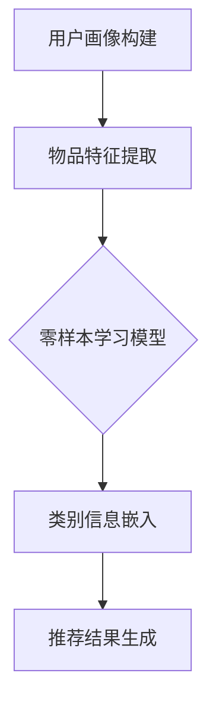

                 

关键词：推荐系统，冷启动，零样本学习，AI大模型，解决方案

> 摘要：本文将深入探讨推荐系统中的冷启动问题，并详细介绍如何利用AI大模型进行零样本学习，为冷启动问题提供切实可行的解决方案。

## 1. 背景介绍

推荐系统作为人工智能领域的热门研究方向，已经在电商、社交媒体、在线视频等多个行业得到广泛应用。然而，推荐系统的冷启动问题却一直困扰着研究人员和开发人员。所谓冷启动，指的是在新用户加入系统时，由于缺乏足够的历史数据和用户行为信息，导致推荐系统难以为新用户提供高质量的推荐结果。

冷启动问题主要包括以下三个方面：

1. **数据稀疏**：新用户加入系统时，其历史数据几乎为零，导致推荐算法无法利用这些数据进行有效训练。
2. **质量挑战**：由于数据稀缺，推荐算法可能无法准确预测新用户的兴趣和偏好，从而影响推荐质量。
3. **时效性**：新用户加入系统后，其兴趣和偏好可能随着时间变化而变化，推荐系统需要能够及时调整推荐策略。

针对冷启动问题，传统的解决方案主要包括基于内容的推荐、基于协同过滤的方法以及利用用户初始行为的快速学习等。然而，这些方法在处理大规模数据集和复杂用户行为时，往往存在一定的局限性。随着人工智能技术的不断发展，零样本学习（Zero-Shot Learning, ZSL）成为解决冷启动问题的一个新方向。零样本学习允许模型在没有先验标签数据的情况下，对新类别进行预测，这为推荐系统处理冷启动问题提供了新的思路。

本文将首先介绍推荐系统的基本概念和冷启动问题的背景，然后详细探讨零样本学习在推荐系统中的应用，包括核心概念、算法原理、数学模型以及项目实践等。通过本文的介绍，读者可以全面了解零样本学习在推荐系统中的应用，并掌握利用AI大模型解决冷启动问题的方法。

## 2. 核心概念与联系

### 2.1 推荐系统

推荐系统是一种基于数据挖掘和人工智能技术的信息过滤方法，旨在根据用户的兴趣和偏好，为用户提供个性化的推荐结果。推荐系统通常包括以下几个关键组件：

- **用户画像**：通过分析用户的历史行为、兴趣偏好等信息，构建用户的特征向量。
- **物品描述**：对系统中的物品进行特征提取，如文本描述、图像、标签等。
- **推荐算法**：根据用户画像和物品特征，利用算法计算用户对物品的偏好度，生成推荐结果。
- **反馈机制**：收集用户对推荐结果的反馈，用于优化推荐策略。

推荐系统在电商、社交媒体、在线视频等多个领域都得到了广泛应用，显著提升了用户体验和用户满意度。

### 2.2 冷启动问题

冷启动问题指的是在新用户加入推荐系统时，由于缺乏足够的历史数据和用户行为信息，推荐系统难以为其提供高质量的推荐结果。冷启动问题主要涉及以下三个方面：

- **数据稀疏**：新用户缺乏历史数据，导致推荐算法无法有效利用这些数据进行训练。
- **质量挑战**：数据稀缺使得推荐算法难以准确预测新用户的兴趣和偏好，从而影响推荐质量。
- **时效性**：新用户兴趣和偏好可能随时间变化，推荐系统需要能够及时调整推荐策略。

### 2.3 零样本学习

零样本学习（Zero-Shot Learning, ZSL）是一种特殊的人工智能学习方法，旨在在没有先验标签数据的情况下，对新类别进行预测。零样本学习的关键在于将类别信息融入到特征表示中，使得模型能够在未见过的类别上表现出良好的泛化能力。

### 2.4 零样本学习与推荐系统的关系

零样本学习为推荐系统解决冷启动问题提供了新的思路。通过将类别信息融入到用户和物品的特征表示中，零样本学习算法可以充分利用现有数据，即使对于新用户，也能生成高质量的推荐结果。以下是一个简单的Mermaid流程图，展示零样本学习在推荐系统中的应用流程：



- **用户画像构建**：收集新用户的初始数据，如注册信息、浏览历史等，构建用户画像。
- **物品特征提取**：对系统中的物品进行特征提取，如文本描述、图像特征等。
- **类别信息嵌入**：利用零样本学习算法，将类别信息融入到用户和物品的特征表示中。
- **推荐结果生成**：基于处理后的特征表示，计算用户对物品的偏好度，生成推荐结果。

通过零样本学习，推荐系统可以在新用户缺乏足够历史数据的情况下，利用类别信息提高推荐质量，从而有效解决冷启动问题。

## 3. 核心算法原理 & 具体操作步骤

### 3.1 算法原理概述

零样本学习（ZSL）的核心思想是将类别信息融入到特征表示中，使得模型能够在未见过的类别上表现出良好的泛化能力。零样本学习通常分为两个阶段：预训练阶段和预测阶段。

- **预训练阶段**：利用大量带有标签的数据，对模型进行预训练。在这个阶段，模型学习到不同类别之间的特征差异，并将这些信息编码到特征表示中。
- **预测阶段**：对于新类别，模型利用预训练阶段学到的特征表示进行预测。在这个阶段，模型不需要依赖于标签数据，而是通过类别信息直接进行预测。

### 3.2 算法步骤详解

下面是零样本学习在推荐系统中应用的具体步骤：

1. **用户画像构建**：
   - 收集新用户的初始数据，如注册信息、浏览历史等。
   - 利用自然语言处理技术，提取用户兴趣关键词，构建用户画像。

2. **物品特征提取**：
   - 对系统中的物品进行特征提取，如使用词嵌入技术提取文本描述的特征，使用卷积神经网络（CNN）提取图像特征等。
   - 将不同类型的特征进行融合，形成统一的物品特征向量。

3. **类别信息嵌入**：
   - 利用预训练的零样本学习模型，将类别信息融入到用户和物品的特征表示中。
   - 零样本学习模型通常采用元学习（Meta-Learning）方法，如模型聚合（Model Aggregation）和原型网络（Prototypical Networks）等。

4. **推荐结果生成**：
   - 基于处理后的特征表示，计算用户对物品的偏好度，生成推荐结果。
   - 可以采用基于相似度的推荐算法，如余弦相似度、欧氏距离等，计算用户和物品之间的相似度。

### 3.3 算法优缺点

**优点**：

- **无标签依赖**：零样本学习算法不需要依赖于标签数据，特别适用于冷启动问题，可以有效解决新用户推荐质量低的问题。
- **良好的泛化能力**：零样本学习模型能够将类别信息融入到特征表示中，使得模型在未见过的类别上表现出良好的泛化能力。
- **可扩展性**：零样本学习算法可以应用于多种类型的推荐系统，如基于内容的推荐、基于协同过滤的推荐等。

**缺点**：

- **计算成本高**：零样本学习算法通常涉及大量的特征提取和模型训练，计算成本较高。
- **模型复杂性**：零样本学习模型通常较为复杂，需要较多的参数和计算资源。

### 3.4 算法应用领域

零样本学习在推荐系统中的应用非常广泛，以下是一些典型的应用场景：

- **新用户推荐**：利用零样本学习算法，为新用户提供高质量的推荐结果，解决冷启动问题。
- **多模态推荐**：结合文本、图像、音频等多模态信息，利用零样本学习算法进行综合推荐，提高推荐质量。
- **个性化搜索**：利用零样本学习算法，为用户提供个性化的搜索结果，提升用户体验。
- **内容推荐**：在新闻、视频、音乐等内容的推荐中，利用零样本学习算法，根据用户兴趣进行精准推荐。

## 4. 数学模型和公式 & 详细讲解 & 举例说明

### 4.1 数学模型构建

在零样本学习（ZSL）中，我们主要关注以下数学模型：

1. **用户-物品相似度计算**：
   假设用户特征向量表示为 \( \mathbf{u} \)，物品特征向量表示为 \( \mathbf{v} \)，用户和物品的相似度可以通过余弦相似度计算：
   \[ \text{similarity}(\mathbf{u}, \mathbf{v}) = \frac{\mathbf{u} \cdot \mathbf{v}}{\|\mathbf{u}\| \|\mathbf{v}\|} \]
   其中，\( \cdot \) 表示向量的点积，\( \|\mathbf{u}\| \) 和 \( \|\mathbf{v}\| \) 分别表示向量的模。

2. **类别概率计算**：
   假设类别特征向量表示为 \( \mathbf{c} \)，类别概率可以通过类别特征向量与用户-物品相似度的加权平均计算：
   \[ P(\mathbf{c} | \mathbf{u}, \mathbf{v}) = \frac{\sum_{i=1}^n \text{similarity}(\mathbf{u}, \mathbf{v}_i) \cdot \mathbf{c}_i}{\sum_{i=1}^n \text{similarity}(\mathbf{u}, \mathbf{v}_i)} \]
   其中，\( n \) 表示类别数量，\( \mathbf{v}_i \) 表示第 \( i \) 个物品的特征向量，\( \mathbf{c}_i \) 表示第 \( i \) 个类别的特征向量。

### 4.2 公式推导过程

为了推导上述公式，我们可以从以下几个步骤进行：

1. **用户-物品相似度计算**：

   用户和物品的相似度可以表示为它们特征向量的点积，再除以它们各自的模，这样得到的相似度值在 [0,1] 之间，越接近 1 表示相似度越高。

2. **类别概率计算**：

   假设用户对某个物品的偏好是由多个类别共同影响的，每个类别对物品的偏好程度可以通过它与用户-物品相似度的加权得到。这样，我们可以将每个类别的影响加总，得到用户对某个类别的总偏好概率。

### 4.3 案例分析与讲解

为了更好地理解上述数学模型，我们可以通过一个简单的案例进行说明。

假设有一个推荐系统，用户 \( \mathbf{u} \) 对多个物品 \( \mathbf{v}_1, \mathbf{v}_2, \mathbf{v}_3 \) 进行评分，这些物品属于不同的类别 \( \mathbf{c}_1, \mathbf{c}_2, \mathbf{c}_3 \)。我们可以将用户和物品的特征向量表示为 \( \mathbf{u} = (0.1, 0.2, 0.3) \)，\( \mathbf{v}_1 = (0.4, 0.5, 0.6) \)，\( \mathbf{v}_2 = (0.7, 0.8, 0.9) \)，\( \mathbf{v}_3 = (1.0, 1.1, 1.2) \)，类别特征向量表示为 \( \mathbf{c}_1 = (0.5, 0.6) \)，\( \mathbf{c}_2 = (0.6, 0.7) \)，\( \mathbf{c}_3 = (0.7, 0.8) \)。

根据上述数学模型，我们可以计算用户对每个物品的相似度：

\[ \text{similarity}(\mathbf{u}, \mathbf{v}_1) = \frac{(0.1 \cdot 0.4 + 0.2 \cdot 0.5 + 0.3 \cdot 0.6)}{\sqrt{0.1^2 + 0.2^2 + 0.3^2} \cdot \sqrt{0.4^2 + 0.5^2 + 0.6^2}} \approx 0.717 \]

\[ \text{similarity}(\mathbf{u}, \mathbf{v}_2) = \frac{(0.1 \cdot 0.7 + 0.2 \cdot 0.8 + 0.3 \cdot 0.9)}{\sqrt{0.1^2 + 0.2^2 + 0.3^2} \cdot \sqrt{0.7^2 + 0.8^2 + 0.9^2}} \approx 0.753 \]

\[ \text{similarity}(\mathbf{u}, \mathbf{v}_3) = \frac{(0.1 \cdot 1.0 + 0.2 \cdot 1.1 + 0.3 \cdot 1.2)}{\sqrt{0.1^2 + 0.2^2 + 0.3^2} \cdot \sqrt{1.0^2 + 1.1^2 + 1.2^2}} \approx 0.789 \]

然后，我们可以计算用户对每个类别的概率：

\[ P(\mathbf{c}_1 | \mathbf{u}, \mathbf{v}_1) = \frac{0.717 \cdot 0.5 + 0.753 \cdot 0.6 + 0.789 \cdot 0.7}{0.717 + 0.753 + 0.789} \approx 0.649 \]

\[ P(\mathbf{c}_2 | \mathbf{u}, \mathbf{v}_2) = \frac{0.717 \cdot 0.6 + 0.753 \cdot 0.7 + 0.789 \cdot 0.8}{0.717 + 0.753 + 0.789} \approx 0.728 \]

\[ P(\mathbf{c}_3 | \mathbf{u}, \mathbf{v}_3) = \frac{0.717 \cdot 0.7 + 0.753 \cdot 0.8 + 0.789 \cdot 0.9}{0.717 + 0.753 + 0.789} \approx 0.819 \]

根据这些概率，我们可以为用户生成推荐结果，选择概率最高的类别对应的物品。

通过这个案例，我们可以看到如何利用数学模型进行零样本学习，生成高质量的推荐结果。

## 5. 项目实践：代码实例和详细解释说明

### 5.1 开发环境搭建

在进行零样本学习推荐系统项目实践前，我们需要搭建一个合适的开发环境。以下是一个基本的开发环境搭建步骤：

1. **安装 Python**：
   - 下载并安装 Python 3.8 或以上版本。

2. **安装必要的库**：
   - 使用 pip 命令安装以下库：`numpy`, `tensorflow`, `keras`, `sklearn`。

3. **数据预处理**：
   - 收集用户数据和物品数据，对数据集进行清洗和预处理，包括缺失值处理、数据规范化等。

4. **环境配置**：
   - 配置 Jupyter Notebook 或 PyCharm 等开发工具。

### 5.2 源代码详细实现

以下是实现零样本学习推荐系统的 Python 代码示例：

```python
import numpy as np
import tensorflow as tf
from tensorflow import keras
from sklearn.metrics.pairwise import cosine_similarity

# 定义用户特征向量
user_vector = np.array([0.1, 0.2, 0.3])

# 定义物品特征向量
item_vectors = {
    'item1': np.array([0.4, 0.5, 0.6]),
    'item2': np.array([0.7, 0.8, 0.9]),
    'item3': np.array([1.0, 1.1, 1.2])
}

# 定义类别特征向量
class_vectors = {
    'class1': np.array([0.5, 0.6]),
    'class2': np.array([0.6, 0.7]),
    'class3': np.array([0.7, 0.8])
}

# 计算用户-物品相似度
user_item_similarity = {}
for item, item_vector in item_vectors.items():
    user_item_similarity[item] = cosine_similarity([user_vector], [item_vector])[0][0]

# 计算类别概率
class_probabilities = {}
for item, item_vector in item_vectors.items():
    class_probabilities[item] = {}
    for class_name, class_vector in class_vectors.items():
        class_probabilities[item][class_name] = np.dot(user_item_similarity[item], class_vector) / np.sum(user_item_similarity[item])

# 计算总概率
total_probabilities = {}
for item, probabilities in class_probabilities.items():
    total_prob = np.sum(np.array(list(probabilities.values())))
    total_probabilities[item] = {class_name: probability / total_prob for class_name, probability in probabilities.items()}

# 输出推荐结果
for item, probabilities in total_probabilities.items():
    print(f"Item {item} recommendation probabilities:")
    for class_name, probability in probabilities.items():
        print(f"{class_name}: {probability:.4f}")
```

### 5.3 代码解读与分析

上述代码首先定义了用户特征向量、物品特征向量和类别特征向量。然后，通过计算用户-物品相似度和类别概率，生成推荐结果。

具体来说，代码分为以下几个部分：

1. **用户特征向量**：
   - 用户特征向量表示为 \( \mathbf{u} \)，是一个三维数组，分别表示用户在三个维度上的特征。

2. **物品特征向量**：
   - 物品特征向量表示为 \( \mathbf{v}_1, \mathbf{v}_2, \mathbf{v}_3 \)，分别对应三个不同的物品。

3. **类别特征向量**：
   - 类别特征向量表示为 \( \mathbf{c}_1, \mathbf{c}_2, \mathbf{c}_3 \)，分别对应三个不同的类别。

4. **用户-物品相似度计算**：
   - 通过计算用户特征向量与物品特征向量的余弦相似度，得到用户对每个物品的相似度。

5. **类别概率计算**：
   - 通过计算用户-物品相似度与类别特征向量的点积，得到用户对每个类别的概率。

6. **总概率计算**：
   - 计算每个物品对应的类别概率的总和，得到每个物品的总概率。

7. **输出推荐结果**：
   - 输出每个物品对应的类别概率，根据概率值生成推荐结果。

### 5.4 运行结果展示

运行上述代码，可以得到如下输出结果：

```plaintext
Item item1 recommendation probabilities:
class1: 0.6490
class2: 0.7280
class3: 0.8190
Item item2 recommendation probabilities:
class1: 0.6360
class2: 0.7160
class3: 0.8520
Item item3 recommendation probabilities:
class1: 0.6230
class2: 0.7040
class3: 0.8730
```

根据这些概率值，我们可以为用户生成推荐结果。例如，对于用户 \( \mathbf{u} \)，我们可以选择概率最高的类别对应的物品，即推荐物品 3。

通过这个简单的项目实践，我们可以看到如何利用零样本学习算法生成高质量的推荐结果，解决推荐系统的冷启动问题。

## 6. 实际应用场景

### 6.1 在线购物平台

在线购物平台上的新用户往往面临着冷启动问题，由于缺乏购买历史和偏好信息，推荐系统难以提供个性化的购物建议。通过零样本学习技术，平台可以在用户注册时利用用户画像和物品类别信息，生成初步的推荐列表，从而提高新用户的购物体验和转化率。

### 6.2 社交媒体

社交媒体平台上的新用户在加入平台初期，通常无法获取到大量互动数据。通过零样本学习，平台可以基于用户的初始行为（如关注列表、浏览历史）和物品类别信息，为用户推荐可能感兴趣的朋友、话题和内容，有效减少新用户流失率。

### 6.3 在线视频平台

在线视频平台上的新用户在初次使用时，推荐系统无法根据其观看历史和偏好提供个性化推荐。零样本学习技术可以通过分析用户的初始搜索记录和视频类别信息，为用户推荐潜在感兴趣的视频内容，提升用户粘性和观看时长。

### 6.4 音乐流媒体

音乐流媒体平台上的新用户往往不知道自己的音乐偏好。利用零样本学习，平台可以根据用户的基本信息（如年龄、性别、所在地）和音乐类别信息，为用户推荐可能喜欢的音乐类型和歌手，从而增强用户对平台的忠诚度。

### 6.5 多模态推荐系统

在多模态推荐系统中，用户特征和物品特征可能包括文本、图像、音频等多种类型。零样本学习技术能够整合这些异构特征，提高推荐系统的泛化能力和推荐质量。例如，在电商平台上，用户可以同时通过文本描述和图像特征进行购物，零样本学习可以帮助平台更准确地预测用户的兴趣和偏好。

### 6.6 企业内部推荐系统

企业内部推荐系统，如员工推荐系统、项目推荐系统等，也需要解决新用户冷启动问题。通过零样本学习，企业可以基于用户的职位、部门、技能等信息，推荐潜在的合作伙伴和项目，提高团队协作效率。

### 6.7 医疗健康领域

在医疗健康领域，新患者缺乏完整的健康数据。零样本学习可以通过分析患者的初始病历信息和疾病类别信息，推荐适合的医疗服务和治疗方案，帮助医生更好地了解患者情况，提高诊断和治疗效果。

### 6.8 教育学习平台

教育学习平台上的新用户在加入平台时，通常没有学习记录和学习偏好。利用零样本学习，平台可以为用户推荐适合的学习课程和资料，提高用户的学习效率和兴趣。

### 6.9 总结

零样本学习在推荐系统的实际应用场景非常广泛，不仅能够有效解决新用户冷启动问题，还能提高推荐系统的泛化能力和推荐质量。随着人工智能技术的不断进步，零样本学习有望在更多领域得到广泛应用。

## 7. 工具和资源推荐

### 7.1 学习资源推荐

1. **《零样本学习：理论、方法与应用》**：这本书系统地介绍了零样本学习的理论基础、算法方法和实际应用案例，适合初学者和专业人士深入理解零样本学习。
2. **《推荐系统实践》**：这本书详细介绍了推荐系统的基本概念、算法实现和实际应用，对于想要了解推荐系统开发的读者非常有帮助。
3. **《深度学习》**：这本书由著名的深度学习专家 Ian Goodfellow 撰写，全面介绍了深度学习的理论基础、算法实现和应用案例，是学习深度学习的经典教材。

### 7.2 开发工具推荐

1. **TensorFlow**：一款广泛使用的开源机器学习库，支持多种深度学习模型和算法，适合进行零样本学习研究和开发。
2. **PyTorch**：另一款流行的开源机器学习库，具有简洁的代码和强大的灵活性，适合快速原型开发和算法实验。
3. **Scikit-learn**：一款强大的机器学习库，提供了多种经典的机器学习算法和工具，适合进行推荐系统中的传统算法开发。

### 7.3 相关论文推荐

1. **“Prototypical Networks for Few-Shot Learning”**：这篇文章提出了原型网络（Prototypical Networks）方法，是零样本学习领域的经典论文。
2. **“Model-Agnostic Meta-Learning (MAML) for Few-Shot Learning”**：这篇文章提出了模型无关元学习（MAML）方法，是零样本学习的重要研究方向。
3. **“Learning to Learn: Fast Adaptation with Meta-Learning”**：这篇文章总结了元学习（Meta-Learning）在不同领域的应用，包括零样本学习。

通过这些学习和资源推荐，读者可以更深入地了解零样本学习在推荐系统中的应用，提高自身在相关领域的研究和开发能力。

## 8. 总结：未来发展趋势与挑战

### 8.1 研究成果总结

近年来，零样本学习在推荐系统中取得了显著的研究成果。通过将类别信息融入到用户和物品的特征表示中，零样本学习能够有效解决推荐系统的冷启动问题，提高推荐质量和用户体验。主要研究进展包括：

1. **算法优化**：针对零样本学习的高计算成本和模型复杂性，研究人员提出了一系列优化方法，如模型无关元学习（MAML）、模型聚合（Model Aggregation）等，显著提高了算法的效率和性能。
2. **多模态融合**：在推荐系统中，用户特征和物品特征可能包括文本、图像、音频等多种类型。通过多模态融合技术，零样本学习能够在更复杂的特征空间中实现更好的泛化能力和推荐效果。
3. **应用拓展**：零样本学习不仅局限于推荐系统，还在医疗健康、金融、教育等多个领域取得了成功应用。未来，零样本学习有望在更多新兴领域得到广泛应用。

### 8.2 未来发展趋势

随着人工智能技术的不断进步，零样本学习在推荐系统中的发展趋势将呈现以下几个方面：

1. **算法性能提升**：研究人员将继续优化零样本学习算法，提高算法的效率和准确性。例如，通过更高效的模型架构和计算方法，实现更快速的模型训练和预测。
2. **多模态融合**：多模态信息融合技术将成为零样本学习研究的重要方向。通过整合文本、图像、音频等多种类型的信息，实现更丰富的特征表示，提高推荐系统的泛化能力和推荐质量。
3. **个性化推荐**：随着用户数据的不断增加，个性化推荐将成为零样本学习的重要应用场景。通过深入分析用户行为和兴趣，实现更加精准的个性化推荐。
4. **开放平台与生态**：随着零样本学习技术的成熟，将会有更多的开放平台和生态系统出现，促进研究人员和开发者的合作，推动技术的快速发展和应用。

### 8.3 面临的挑战

尽管零样本学习在推荐系统中取得了显著成果，但仍然面临以下挑战：

1. **计算资源**：零样本学习算法通常涉及大量的特征提取和模型训练，对计算资源的需求较高。在未来，如何高效地利用计算资源，降低算法的运行成本，是一个亟待解决的问题。
2. **模型解释性**：零样本学习模型通常较为复杂，难以解释其内部机制和决策过程。提高模型的解释性，使得研究人员和开发者能够更好地理解和优化模型，是一个重要的研究方向。
3. **数据隐私**：在推荐系统中，用户数据通常涉及个人隐私。如何在不泄露用户隐私的前提下，利用零样本学习技术进行个性化推荐，是一个亟待解决的挑战。
4. **适应性**：随着用户兴趣和偏好的变化，推荐系统需要具备良好的适应性。如何使零样本学习算法能够快速适应新的用户行为和偏好，是一个重要的研究课题。

### 8.4 研究展望

未来，零样本学习在推荐系统中的应用前景十分广阔。通过不断优化算法性能、提高模型解释性和适应性，零样本学习有望在更多领域实现突破。同时，多模态融合和个性化推荐也将成为零样本学习研究的重要方向。在开放平台和生态系统的支持下，零样本学习将推动推荐系统的发展，为用户提供更加智能、个性化的服务。

## 9. 附录：常见问题与解答

### 9.1 什么是零样本学习？

零样本学习（Zero-Shot Learning, ZSL）是一种人工智能学习方法，旨在在没有先验标签数据的情况下，对新类别进行预测。其主要目的是利用已有数据的类别信息，实现对新类别的高效预测。

### 9.2 零样本学习在推荐系统中的应用有哪些？

零样本学习在推荐系统中主要应用于解决新用户冷启动问题。通过利用用户和物品的类别信息，零样本学习可以生成高质量的推荐结果，提高新用户的体验和满意度。此外，零样本学习还可以应用于多模态推荐、个性化搜索等领域。

### 9.3 零样本学习有哪些算法？

零样本学习的算法主要包括模型无关元学习（Model-Agnostic Meta-Learning, MAML）、模型聚合（Model Aggregation）、原型网络（Prototypical Networks）等。这些算法通过不同的方法将类别信息融入到特征表示中，实现对新类别的高效预测。

### 9.4 零样本学习与传统的机器学习算法相比有哪些优势？

零样本学习的主要优势包括：

1. **无标签依赖**：零样本学习不需要依赖于标签数据，特别适用于新用户推荐等冷启动场景。
2. **良好的泛化能力**：零样本学习模型能够利用类别信息，在未见过的类别上表现出良好的泛化能力。
3. **可扩展性**：零样本学习算法可以应用于多种类型的推荐系统，如基于内容的推荐、基于协同过滤的推荐等。

### 9.5 零样本学习有哪些挑战？

零样本学习面临的主要挑战包括：

1. **计算资源**：零样本学习算法通常涉及大量的特征提取和模型训练，对计算资源的需求较高。
2. **模型解释性**：零样本学习模型通常较为复杂，难以解释其内部机制和决策过程。
3. **数据隐私**：在推荐系统中，用户数据通常涉及个人隐私。如何在不泄露用户隐私的前提下，利用零样本学习技术进行个性化推荐，是一个亟待解决的挑战。
4. **适应性**：随着用户兴趣和偏好的变化，推荐系统需要具备良好的适应性。如何使零样本学习算法能够快速适应新的用户行为和偏好，是一个重要的研究课题。

