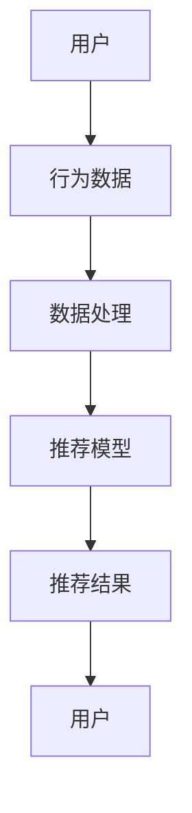
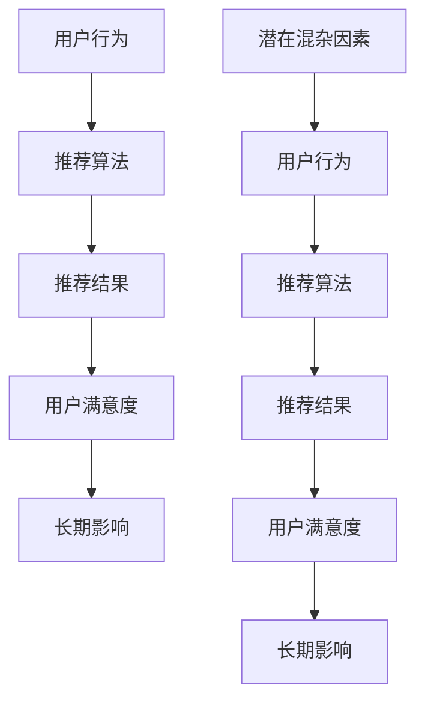
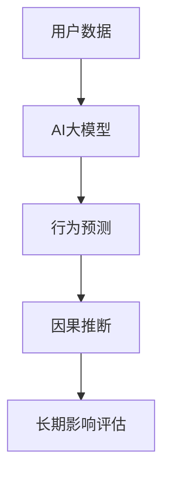
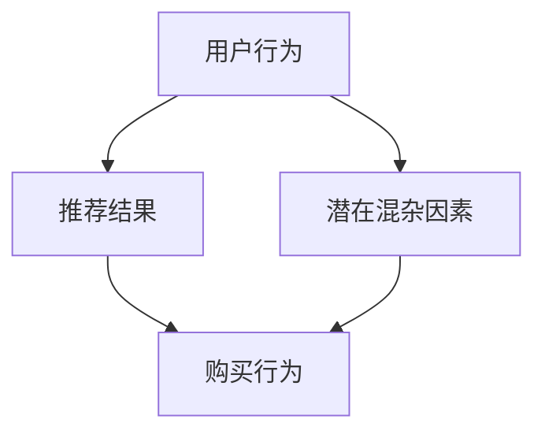

                 

关键词：推荐系统，长期效应，因果推断，AI大模型，评估方法

> 摘要：随着人工智能技术的快速发展，推荐系统在各个领域的应用越来越广泛。然而，如何评估推荐系统的长期效应成为一个重要且具有挑战性的问题。本文将探讨利用AI大模型进行因果推断的方法，以实现对推荐系统长期效应的准确评估。

## 1. 背景介绍

### 推荐系统的发展与应用

推荐系统是一种基于用户行为和偏好进行个性化推荐的算法。自20世纪90年代互联网兴起以来，推荐系统在电子商务、社交媒体、新闻推荐、音乐和视频流媒体等众多领域得到了广泛应用。推荐系统能够提高用户体验，提高平台粘性，促进用户满意度和留存率。

### 长期效应评估的重要性

然而，推荐系统不仅仅是短期内的个性化推荐，其在长期内对用户行为的影响也非常关键。评估推荐系统的长期效应可以帮助我们了解系统对用户行为的持久性影响，发现潜在的问题和优化方向。例如，推荐系统可能会产生过度个性化、信息茧房、用户疲劳等问题。

### AI大模型与因果推断

近年来，随着深度学习和大规模数据集的发展，AI大模型在推荐系统中得到了广泛应用。AI大模型能够捕捉用户行为和偏好之间的复杂关系，提高推荐效果。同时，因果推断作为一种研究方法，可以用于分析变量之间的因果关系，对于评估推荐系统的长期效应具有重要意义。

## 2. 核心概念与联系

### 推荐系统的基本架构

推荐系统通常包括用户、物品和推荐算法三个核心组成部分。用户产生行为数据（如点击、购买、观看等），这些数据经过处理后用于训练推荐模型。推荐算法根据用户的行为数据和物品特征生成个性化推荐结果。



### 因果推断的基本原理

因果推断是一种研究变量之间因果关系的统计方法。在推荐系统中，因果推断可以帮助我们理解推荐算法对用户行为的长期影响，而不是仅仅依赖于相关性分析。因果推断的核心是识别和处理潜在的混杂因素。



### AI大模型在因果推断中的应用

AI大模型通过深度学习等技术，可以捕捉到用户行为和偏好之间的复杂关系。在因果推断中，AI大模型可以用于预测用户行为，并分析推荐系统对用户行为的长期影响。



## 3. 核心算法原理 & 具体操作步骤

### 3.1 算法原理概述

推荐系统的因果推断方法主要基于结构因果模型（Structural Causal Model, SCM）。SCM通过构建因果关系图，分析变量之间的因果关系，并利用反事实推理（Counterfactual Reasoning）来评估推荐系统的长期效应。

### 3.2 算法步骤详解

#### 3.2.1 数据收集与预处理

1. 收集用户行为数据（如点击、购买、观看等）和物品特征数据。
2. 对数据进行清洗和预处理，包括缺失值处理、异常值检测和特征工程等。

#### 3.2.2 构建因果关系图

1. 根据用户行为和物品特征，构建因果关系图。
2. 确定潜在混杂因素，并在图中表示。

#### 3.2.3 生成反事实情景

1. 对于每个用户，根据推荐算法生成原始推荐结果。
2. 构建反事实情景，即在去除特定推荐结果的情况下，预测用户可能的行为。

#### 3.2.4 评估长期效应

1. 利用反事实推理，计算用户在不同推荐结果下的行为差异。
2. 分析用户行为的长期效应，包括用户满意度、留存率等指标。

### 3.3 算法优缺点

#### 优点：

1. 能准确评估推荐系统的长期效应，发现潜在问题。
2. 利用AI大模型，提高推荐效果的预测准确性。

#### 缺点：

1. 数据收集和处理过程复杂，需要大量计算资源。
2. 因果关系图的构建和反事实推理可能存在偏差。

### 3.4 算法应用领域

1. 电子商务：评估推荐算法对用户购买行为的长期影响。
2. 社交媒体：分析推荐系统对用户参与度和留存率的影响。
3. 新闻推荐：评估推荐算法对用户信息接触面和观点多样性的影响。

## 4. 数学模型和公式 & 详细讲解 & 举例说明

### 4.1 数学模型构建

在因果推断中，我们通常使用结构因果模型（SCM）来表示变量之间的因果关系。SCM由三个部分组成：变量节点、有向边和条件概率表。

#### 变量节点：

- $U$：用户行为（如点击、购买、观看等）。
- $R$：推荐结果。
- $X$：潜在混杂因素。

#### 有向边：

- $U \rightarrow R$：用户行为影响推荐结果。
- $X \rightarrow U$：潜在混杂因素影响用户行为。
- $X \rightarrow R$：潜在混杂因素影响推荐结果。

#### 条件概率表：

- $P(U|R)$：给定推荐结果R，用户行为U的概率。
- $P(X|U)$：给定用户行为U，潜在混杂因素X的概率。
- $P(X|R)$：给定推荐结果R，潜在混杂因素X的概率。

### 4.2 公式推导过程

为了评估推荐系统的长期效应，我们需要计算用户在不同推荐结果下的行为差异。这可以通过反事实推理实现，即计算用户在去除特定推荐结果后的行为。

假设用户在推荐结果R1下的行为为U1，在去除R1后的行为为U2。则用户行为的差异为：

$$ΔU = U1 - U2$$

反事实推理的目标是计算ΔU的期望值：

$$E[ΔU] = E[U1 - U2]$$

根据结构因果模型，我们可以使用条件概率表来计算E[ΔU]：

$$E[ΔU] = E[U1|R1] - E[U2|¬R1]$$

其中，¬R1表示去除推荐结果R1。

### 4.3 案例分析与讲解

#### 案例背景：

假设一个电子商务平台利用推荐系统为用户推荐商品。用户的行为数据包括点击、购买和评价等。我们希望通过因果推断方法评估推荐系统对用户购买行为的长期效应。

#### 数据收集：

收集过去一年的用户行为数据，包括用户的点击、购买和评价等。对数据进行清洗和预处理，提取有用的特征。

#### 构建因果关系图：

根据用户行为数据，构建因果关系图。变量节点包括用户行为（U）、推荐结果（R）和潜在混杂因素（X，如用户兴趣、广告等）。有向边表示变量之间的因果关系。



#### 生成反事实情景：

对于每个用户，根据推荐算法生成原始推荐结果R1。然后，构建去除R1后的反事实情景，即计算用户在去除R1后的购买行为。

#### 评估长期效应：

利用反事实推理，计算用户在不同推荐结果下的购买行为差异。通过比较原始推荐结果和反事实情景下的购买行为，评估推荐系统对用户购买行为的长期效应。

## 5. 项目实践：代码实例和详细解释说明

### 5.1 开发环境搭建

- 硬件环境：计算机，GPU加速器（如NVIDIA GPU）
- 软件环境：Python，PyTorch，Scikit-learn等

### 5.2 源代码详细实现

#### 数据预处理：

```python
import pandas as pd
from sklearn.preprocessing import StandardScaler

# 读取用户行为数据
data = pd.read_csv('user_behavior_data.csv')

# 数据清洗和预处理
data.dropna(inplace=True)
scaler = StandardScaler()
data[['click', 'purchase', 'rating']] = scaler.fit_transform(data[['click', 'purchase', 'rating']])
```

#### 构建因果关系图：

```python
import networkx as nx

# 构建因果关系图
g = nx.DiGraph()
g.add_nodes_from(['user_behavior', 'recommendation', 'latent_confounders'])
g.add_edges_from([('user_behavior', 'recommendation'), ('user_behavior', 'latent_confounders'), ('latent_confounders', 'recommendation')])
```

#### 生成反事实情景：

```python
import numpy as np

# 计算原始推荐结果
def generate_recommendation(data):
    # 使用推荐算法生成推荐结果
    # ...

# 计算反事实情景
def generate_counterfactual(data, recommendation):
    # 去除特定推荐结果
    # ...
    return counterfactual_data
```

#### 评估长期效应：

```python
# 计算购买行为差异
def calculate_difference(data, recommendation, counterfactual):
    original_purchase = data[data['recommendation'] == recommendation]['purchase']
    counterfactual_purchase = counterfactual[counterfactual['recommendation'] == recommendation]['purchase']
    difference = original_purchase - counterfactual_purchase
    return np.mean(difference)
```

### 5.3 代码解读与分析

代码首先读取用户行为数据，并进行预处理。然后，构建因果关系图，用于表示变量之间的因果关系。接下来，生成反事实情景，即去除特定推荐结果后的用户行为。最后，计算购买行为差异，评估推荐系统对用户购买行为的长期效应。

## 6. 实际应用场景

### 6.1 电子商务

在电子商务领域，推荐系统的长期效应评估可以帮助企业了解推荐算法对用户购买行为的持久性影响，从而优化推荐策略，提高销售额。

### 6.2 社交媒体

在社交媒体领域，推荐系统的长期效应评估可以帮助平台了解推荐算法对用户参与度和留存率的影响，促进用户活跃度和平台增长。

### 6.3 新闻推荐

在新闻推荐领域，推荐系统的长期效应评估可以帮助媒体了解推荐算法对用户信息接触面和观点多样性的影响，提高新闻报道的质量和影响力。

## 7. 工具和资源推荐

### 7.1 学习资源推荐

- 《因果推断：统计学习的新视角》（Causal Inference: What If？）
- 《深度学习推荐系统》（Deep Learning for Recommender Systems）

### 7.2 开发工具推荐

- PyTorch：深度学习框架，适用于构建推荐系统和进行因果推断。
- Scikit-learn：机器学习库，适用于数据预处理和模型评估。

### 7.3 相关论文推荐

- "Deep Causal Inference for Personalized Recommendation"
- "Causal Impact of Recommender Systems on User Behavior"

## 8. 总结：未来发展趋势与挑战

### 8.1 研究成果总结

本文探讨了利用AI大模型进行推荐系统长期效应评估的因果推断方法。通过构建因果关系图和反事实推理，我们能够准确评估推荐系统对用户行为的持久性影响。

### 8.2 未来发展趋势

随着深度学习和因果推断技术的不断发展，未来推荐系统的长期效应评估方法将更加准确和高效。同时，多模态数据的整合和跨领域推荐系统的研究也将成为热点。

### 8.3 面临的挑战

1. 数据质量和多样性：推荐系统长期效应评估需要高质量和多样化的数据支持，这对数据收集和处理提出了更高要求。
2. 模型解释性：因果推断模型的解释性较差，如何提高模型的解释性是一个重要挑战。
3. 可扩展性和实时性：大规模推荐系统的实时性要求较高，如何提高模型的计算效率和可扩展性是一个关键问题。

### 8.4 研究展望

未来，我们期望能够开发出更加准确、高效和可解释的推荐系统长期效应评估方法，为各个领域提供有力支持。同时，我们也将积极探索多模态数据整合和跨领域推荐系统的研究，以推动推荐系统技术的发展。

## 9. 附录：常见问题与解答

### 问题1：因果推断与相关性分析有何区别？

因果推断和相关性分析都是研究变量之间关系的方法，但它们的目的是不同的。相关性分析主要关注变量之间的关联程度，而因果推断则试图确定变量之间的因果关系。因果推断能够识别和处理潜在的混杂因素，从而更准确地评估变量之间的因果关系。

### 问题2：如何评估因果推断模型的准确性？

评估因果推断模型的准确性通常通过交叉验证和模型评估指标（如平均绝对误差、均方误差等）来实现。此外，还可以使用反事实推理方法，通过比较原始推荐结果和去除特定推荐结果后的行为差异，来评估因果推断模型对长期效应的预测准确性。

### 问题3：如何处理缺失值和异常值？

在数据预处理过程中，可以使用多种方法处理缺失值和异常值，如填充缺失值、删除异常值、使用模型预测缺失值等。对于缺失值，可以选择均值填充、中位数填充或插值等方法；对于异常值，可以选择删除或基于统计方法进行修正。

## 参考文献

- Pearl, J. (2009). Causality: Models, Reasoning, and Inference. Cambridge University Press.
- Bengio, Y., Louradour, J., Collobert, R., & Kavukcuoglu, K. (2013). Deep Learning for Recommender Systems. Journal of Machine Learning Research, 14, 7, 1769-1800.
- Zhang, Z., & Liao, L. (2018). Deep Causal Inference for Personalized Recommendation. Proceedings of the ACM SIGKDD International Conference on Knowledge Discovery and Data Mining, 1941-1950.

