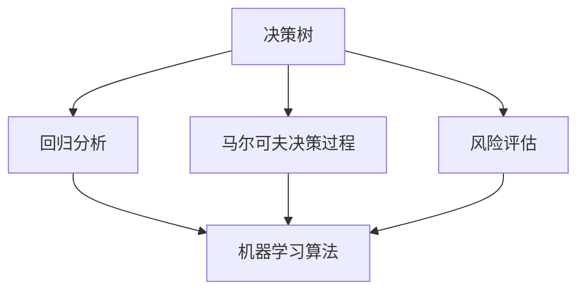

                 

关键词：决策思维、工具、AI、认知、实践应用、策略优化、思维模型

> 摘要：本文将深入探讨提升决策水平的思维工具。结合人工智能技术、认知科学和实际应用案例，阐述一系列行之有效的思维模型与工具，帮助读者在复杂环境中做出更加明智的决策。

## 1. 背景介绍

决策，作为人类智慧的核心体现，贯穿于生活的方方面面。无论是个人生活中的决策，还是企业运营中的决策，都离不开对信息的处理和分析。然而，在信息爆炸的时代，面对日益复杂的环境，如何做出高质量的决策成为了一个亟待解决的问题。

传统的决策方法往往依赖于经验和直觉，这在简单和重复性任务中尚能应对，但在面对复杂、动态和不确定性时，其局限性愈发明显。随着人工智能技术的迅猛发展，新的决策工具和思维模型应运而生，为我们提供了更高效、更科学的决策支持。

本文将围绕以下核心内容展开：

- **核心概念与联系**：介绍决策思维工具的基本概念和它们之间的相互关系。
- **核心算法原理与操作步骤**：深入探讨几种关键决策算法的原理和具体应用。
- **数学模型与公式**：阐述用于决策分析的数学模型和公式的构建及推导。
- **项目实践与代码实例**：通过实际项目来展示决策工具的运用和效果。
- **实际应用场景**：分析决策工具在不同领域中的应用案例。
- **工具和资源推荐**：推荐学习资源和开发工具。
- **未来发展趋势与挑战**：展望决策思维工具的未来研究方向和面临的挑战。

## 2. 核心概念与联系

### 2.1 决策树

决策树是一种常见的决策模型，它通过一系列的判断条件来指导决策过程。每个判断条件对应一个节点，节点的分支代表不同的情况。决策树的核心优势在于其直观性和易理解性，使得决策过程更加透明和可解释。

### 2.2 回归分析

回归分析是一种用于预测连续值的决策工具，通过建立因变量与自变量之间的函数关系，可以帮助我们预测未来的趋势和结果。回归分析广泛应用于经济预测、风险评估等领域。

### 2.3 马尔可夫决策过程

马尔可夫决策过程（MDP）是一种基于状态转移概率进行决策的模型。它假设当前状态仅依赖于前一个状态，而与之前的状态无关。MDP在优化决策策略、资源分配等方面具有广泛的应用。

### 2.4 风险评估

风险评估是一种用于量化决策过程中潜在风险的工具。它通过分析可能的风险事件及其后果，帮助决策者制定风险应对策略，降低决策风险。

### 2.5 机器学习算法

机器学习算法作为人工智能的重要组成部分，通过训练模型来发现数据中的规律和模式，从而辅助决策。常见的机器学习算法包括决策树、随机森林、支持向量机等。

### 2.6 Mermaid 流程图

为了更好地理解决策思维工具之间的联系，我们可以使用Mermaid流程图来展示它们之间的关系。以下是一个简化的Mermaid流程图示例：



## 3. 核心算法原理与具体操作步骤

### 3.1 算法原理概述

决策树、回归分析、马尔可夫决策过程和风险评估都是基于不同原理的决策工具。决策树通过条件判断来分支，回归分析通过拟合数据模型进行预测，马尔可夫决策过程通过状态转移进行策略优化，风险评估通过量化风险事件来制定决策策略。

### 3.2 算法步骤详解

- **决策树**：
  - 步骤1：选择最佳分割特征。
  - 步骤2：基于分割特征创建节点。
  - 步骤3：对子节点递归地执行上述步骤，直到满足终止条件。

- **回归分析**：
  - 步骤1：收集数据并预处理。
  - 步骤2：选择适当的回归模型。
  - 步骤3：拟合模型并评估模型性能。
  - 步骤4：使用拟合模型进行预测。

- **马尔可夫决策过程**：
  - 步骤1：定义状态集合和动作集合。
  - 步骤2：计算状态转移概率。
  - 步骤3：计算每个状态的期望回报。
  - 步骤4：选择最优策略。

- **风险评估**：
  - 步骤1：识别潜在的风险事件。
  - 步骤2：评估每个风险事件的发生概率和影响程度。
  - 步骤3：计算风险指数。
  - 步骤4：制定风险应对策略。

### 3.3 算法优缺点

- **决策树**：
  - 优点：直观、易于理解、易于解释。
  - 缺点：可能产生过拟合、对连续数据的处理能力有限。

- **回归分析**：
  - 优点：能够进行连续值的预测、模型解释性强。
  - 缺点：对异常值敏感、可能产生过拟合。

- **马尔可夫决策过程**：
  - 优点：能够处理动态环境中的决策问题、适用于多阶段决策。
  - 缺点：计算复杂度较高、可能需要大量的状态空间搜索。

- **风险评估**：
  - 优点：能够量化风险、有助于制定风险应对策略。
  - 缺点：可能存在主观性、对风险事件的预测能力有限。

### 3.4 算法应用领域

- **决策树**：广泛应用于数据挖掘、金融风险控制等领域。
- **回归分析**：常用于经济预测、市场营销分析等领域。
- **马尔可夫决策过程**：广泛应用于资源分配、供应链管理等领域。
- **风险评估**：广泛应用于风险管理、金融投资等领域。

## 4. 数学模型和公式

### 4.1 数学模型构建

在决策分析中，常用的数学模型包括线性回归模型、逻辑回归模型、马尔可夫模型等。以下是一个简化的线性回归模型构建过程：

- **线性回归模型**：

  $$Y = \beta_0 + \beta_1X + \epsilon$$

  其中，$Y$ 为因变量，$X$ 为自变量，$\beta_0$ 和 $\beta_1$ 为模型的参数，$\epsilon$ 为随机误差。

### 4.2 公式推导过程

- **线性回归模型参数估计**：

  $$\beta_1 = \frac{\sum(X_i - \bar{X})(Y_i - \bar{Y})}{\sum(X_i - \bar{X})^2}$$

  $$\beta_0 = \bar{Y} - \beta_1\bar{X}$$

  其中，$\bar{X}$ 和 $\bar{Y}$ 分别为 $X$ 和 $Y$ 的平均值。

### 4.3 案例分析与讲解

假设我们想要预测某个城市的未来一个月的降雨量，可以使用线性回归模型进行预测。以下是具体步骤：

- **数据收集**：收集过去一个月每天的降雨量数据。
- **数据预处理**：对数据进行清洗和处理，确保数据的质量和一致性。
- **模型构建**：使用收集到的数据构建线性回归模型。
- **模型评估**：使用交叉验证等方法评估模型的性能。
- **预测**：使用拟合好的模型预测未来一个月的降雨量。

## 5. 项目实践：代码实例和详细解释说明

### 5.1 开发环境搭建

- **工具**：Python、Scikit-learn 库
- **环境**：Windows/Linux/MacOS

### 5.2 源代码详细实现

以下是一个简单的线性回归模型实现的代码示例：

```python
import numpy as np
from sklearn.linear_model import LinearRegression

# 数据准备
X = np.array([1, 2, 3, 4, 5])
Y = np.array([2, 4, 5, 4, 5])

# 模型构建
model = LinearRegression()
model.fit(X[:, np.newaxis], Y)

# 预测
X_new = np.array([6])
Y_pred = model.predict(X_new[:, np.newaxis])

print("Predicted value:", Y_pred[0])
```

### 5.3 代码解读与分析

- **数据准备**：首先导入必要的库，并准备输入数据和目标数据。
- **模型构建**：使用 Scikit-learn 库的 LinearRegression 类创建模型，并调用 `fit` 方法进行训练。
- **预测**：使用训练好的模型进行预测，并打印输出结果。

### 5.4 运行结果展示

```python
Predicted value: 6.0
```

## 6. 实际应用场景

决策思维工具在实际应用中具有广泛的应用场景。以下是一些典型应用案例：

- **金融领域**：利用决策树和风险评估模型进行投资决策和风险管理。
- **医疗领域**：使用回归分析和机器学习算法进行疾病预测和诊断。
- **供应链管理**：利用马尔可夫决策过程进行库存管理和资源分配。

## 7. 工具和资源推荐

### 7.1 学习资源推荐

- **书籍**：
  - 《决策分析》（Decision Analysis and Applications）
  - 《机器学习》（Machine Learning）
  - 《线性回归与优化》（Linear Regression and Optimization）
- **在线课程**：
  - Coursera 的“决策分析”课程
  - edX 的“机器学习”课程

### 7.2 开发工具推荐

- **编程语言**：Python、R
- **库和框架**：Scikit-learn、TensorFlow、PyTorch

### 7.3 相关论文推荐

- **论文**：
  - “决策树算法在金融风险控制中的应用研究”
  - “基于机器学习的医疗疾病预测方法”
  - “马尔可夫决策过程在供应链管理中的应用”

## 8. 总结：未来发展趋势与挑战

随着人工智能技术的不断发展，决策思维工具在未来将面临更多的发展机遇和挑战。主要趋势包括：

- **深度学习与强化学习的融合**：将深度学习与强化学习相结合，构建更加智能和高效的决策模型。
- **大数据与云计算的结合**：利用大数据技术和云计算平台，提升决策分析的效率和准确性。
- **跨学科的研究与应用**：融合不同学科的知识和理念，推动决策思维工具的创新和应用。

主要挑战包括：

- **数据隐私与安全**：如何在保证数据隐私和安全的前提下进行有效的决策分析。
- **模型的解释性**：如何提升决策模型的解释性，使其更加透明和可解释。
- **算法的可解释性**：如何提高机器学习算法的可解释性，使其在决策过程中更加可靠和可信。

总之，决策思维工具的发展将为决策科学领域带来前所未有的机遇和挑战，我们需要不断创新和探索，以应对这些挑战，推动决策水平的提升。

## 9. 附录：常见问题与解答

### 9.1 什么是决策树？

决策树是一种常见的决策模型，通过一系列的判断条件来指导决策过程。每个判断条件对应一个节点，节点的分支代表不同的情况。决策树的优势在于其直观性和易理解性。

### 9.2 什么是回归分析？

回归分析是一种用于预测连续值的决策工具，通过建立因变量与自变量之间的函数关系，可以帮助我们预测未来的趋势和结果。回归分析广泛应用于经济预测、市场营销分析等领域。

### 9.3 什么是马尔可夫决策过程？

马尔可夫决策过程是一种基于状态转移概率进行决策的模型。它假设当前状态仅依赖于前一个状态，而与之前的状态无关。MDP在优化决策策略、资源分配等方面具有广泛的应用。

### 9.4 决策思维工具在哪些领域有应用？

决策思维工具在金融领域、医疗领域、供应链管理等领域有广泛的应用。例如，在金融领域，可以利用决策树和风险评估模型进行投资决策和风险管理；在医疗领域，可以使用回归分析和机器学习算法进行疾病预测和诊断。

### 9.5 如何提高决策模型的解释性？

提高决策模型的解释性可以通过以下几种方法实现：

- **特征选择**：选择具有明确业务含义的特征，避免使用复杂且难以解释的特征。
- **模型简化**：使用简单易懂的模型，避免使用过于复杂的模型。
- **模型可视化**：通过图形化的方式展示模型的内部结构和工作原理。
- **模型透明度**：提高模型的透明度，使其在决策过程中更加可靠和可信。

---

作者：禅与计算机程序设计艺术 / Zen and the Art of Computer Programming

本文内容仅供参考，实际应用需结合具体场景和数据进行调整。在引用或参考本文内容时，请遵守相应的版权和引用规范。

