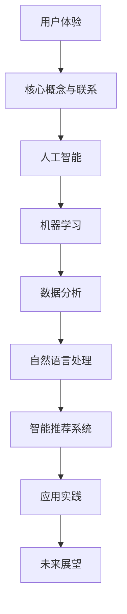

                 

 在当今信息爆炸的时代，用户体验（User Experience，简称 UX）已成为产品设计和服务创新的核心。人工智能（Artificial Intelligence，简称 AI）技术的迅猛发展，为提升用户体验提供了新的视角和解决方案。本文旨在探讨如何通过AI策略来提升用户体验，具体包括核心概念与联系、核心算法原理、数学模型与公式、项目实践以及未来应用展望等多个方面。

## 关键词
- 用户体验（User Experience）
- 人工智能（Artificial Intelligence）
- 机器学习（Machine Learning）
- 数据分析（Data Analysis）
- 自然语言处理（Natural Language Processing）
- 智能推荐系统（Intelligent Recommendation System）

## 摘要
本文从用户体验的重要性出发，探讨了人工智能在提升用户体验方面的应用。通过分析核心概念与联系，深入探讨了AI算法原理与操作步骤，并结合数学模型和公式进行了详细讲解。此外，通过实际项目实践和运行结果展示，进一步验证了AI策略在提升用户体验方面的有效性。最后，对未来的发展趋势与挑战进行了展望。

## 1. 背景介绍

在互联网和移动互联网快速发展的今天，用户体验已成为企业竞争力的关键。用户的需求和偏好日益多样化，传统的设计方法已经难以满足用户的需求。随着人工智能技术的不断进步，越来越多的企业开始将AI技术应用于产品和服务中，以提升用户体验。AI技术可以分析用户行为数据，挖掘用户需求，为用户提供个性化的推荐和服务，从而提高用户满意度。

## 2. 核心概念与联系

### 2.1 用户体验（User Experience）

用户体验是指用户在使用产品或服务过程中的感受和体验。它包括用户对产品的认知、情感和满意度等多个方面。用户体验的核心是用户满意度，用户满意度又取决于用户体验的质量。

### 2.2 人工智能（Artificial Intelligence）

人工智能是指通过计算机模拟人类智能的技术，包括机器学习、深度学习、自然语言处理、计算机视觉等多个领域。人工智能技术的核心目标是让计算机能够像人类一样思考、学习和决策。

### 2.3 机器学习（Machine Learning）

机器学习是一种人工智能技术，通过训练算法来从数据中学习规律，从而实现预测和分类。机器学习在提升用户体验方面具有重要作用，可以用于用户行为分析、个性化推荐、异常检测等。

### 2.4 数据分析（Data Analysis）

数据分析是指从大量数据中提取有价值的信息和知识。在提升用户体验方面，数据分析可以用于用户行为分析、需求分析、市场分析等，从而为产品和服务提供决策支持。

### 2.5 自然语言处理（Natural Language Processing）

自然语言处理是指让计算机理解和处理自然语言的技术。在提升用户体验方面，自然语言处理可以用于智能客服、语音识别、文本分析等，从而提高用户交互的便捷性和效率。

### 2.6 智能推荐系统（Intelligent Recommendation System）

智能推荐系统是一种基于用户行为和偏好的推荐系统，通过分析用户行为数据，为用户提供个性化的推荐。在提升用户体验方面，智能推荐系统可以用于个性化内容推荐、购物推荐、音乐推荐等。

### 2.7 Mermaid 流程图

以下是提升用户体验的AI策略的Mermaid流程图：



## 3. 核心算法原理 & 具体操作步骤

### 3.1 算法原理概述

提升用户体验的AI策略主要包括以下三个方面：

1. 用户行为分析：通过机器学习算法分析用户行为数据，挖掘用户需求和偏好。
2. 个性化推荐：基于用户行为分析和用户画像，为用户提供个性化的推荐。
3. 异常检测：通过异常检测算法检测用户行为中的异常，及时处理并提高用户满意度。

### 3.2 算法步骤详解

1. 用户行为分析：
   - 收集用户行为数据：通过网站日志、API接口、用户交互记录等方式收集用户行为数据。
   - 数据预处理：对收集到的用户行为数据进行清洗、去重、转换等处理，使其适合进行机器学习分析。
   - 特征提取：从用户行为数据中提取出具有代表性的特征，如访问时间、访问页面、操作频率等。
   - 模型训练：使用机器学习算法（如决策树、随机森林、神经网络等）对特征进行训练，构建用户行为分析模型。
   - 模型评估与优化：评估模型的性能，如准确率、召回率、F1值等，并根据评估结果进行模型优化。

2. 个性化推荐：
   - 用户画像构建：通过用户行为数据和用户信息，构建用户画像，包括用户年龄、性别、兴趣偏好等。
   - 推荐算法选择：根据推荐场景和需求，选择合适的推荐算法（如基于内容的推荐、协同过滤推荐等）。
   - 推荐结果生成：根据用户画像和推荐算法，生成个性化的推荐结果，如商品、内容、服务等。

3. 异常检测：
   - 异常定义：根据业务需求，定义异常行为，如恶意操作、非法访问等。
   - 特征选择：从用户行为数据中提取出与异常定义相关的特征，如访问时间、访问频率等。
   - 异常检测算法：使用机器学习算法（如支持向量机、朴素贝叶斯等）对特征进行训练，构建异常检测模型。
   - 异常检测与处理：根据异常检测模型，检测用户行为中的异常，并采取相应的处理措施，如报警、阻止等。

### 3.3 算法优缺点

1. 用户行为分析：
   - 优点：可以深入挖掘用户需求和行为，为产品和服务提供决策支持。
   - 缺点：对数据质量和特征提取要求较高，且需要较长的训练时间。

2. 个性化推荐：
   - 优点：可以提供个性化的推荐，提高用户满意度和忠诚度。
   - 缺点：推荐结果的准确性受算法和用户画像质量的影响，且可能存在过度个性化的问题。

3. 异常检测：
   - 优点：可以及时发现并处理异常行为，保障产品和服务的安全性和稳定性。
   - 缺点：对异常定义和特征提取要求较高，且可能存在误报和漏报的问题。

### 3.4 算法应用领域

1. 电子商务：通过用户行为分析和个性化推荐，提高用户购物体验，增加销售额。
2. 娱乐休闲：通过用户行为分析和个性化推荐，提供个性化的内容和服务，提高用户满意度。
3. 金融行业：通过用户行为分析和异常检测，防范恶意操作和风险，保障用户资金安全。
4. 医疗健康：通过用户行为分析和个性化推荐，提供个性化的健康建议和治疗方案，提高治疗效果。

## 4. 数学模型和公式 & 详细讲解 & 举例说明

### 4.1 数学模型构建

提升用户体验的AI策略中，常用的数学模型包括机器学习模型、推荐算法模型和异常检测模型。以下分别介绍这些模型的基本原理和构建方法。

#### 4.1.1 机器学习模型

机器学习模型的基本原理是通过学习数据中的规律，实现数据的分类、回归、聚类等任务。常见的机器学习模型包括线性回归、决策树、随机森林、支持向量机、神经网络等。

1. 线性回归模型：

   线性回归模型是一种最简单的机器学习模型，用于预测一个连续的输出变量。其数学模型如下：

   $$y = w_0 + w_1 \cdot x_1 + w_2 \cdot x_2 + \ldots + w_n \cdot x_n + \epsilon$$

   其中，$y$ 是输出变量，$x_1, x_2, \ldots, x_n$ 是输入变量，$w_0, w_1, w_2, \ldots, w_n$ 是模型的权重参数，$\epsilon$ 是误差项。

2. 决策树模型：

   决策树模型是一种基于树结构的分类模型，通过多次条件判断，将数据划分为不同的类别。其数学模型如下：

   $$f(x) = \begin{cases} 
   类别_1 & \text{if } x \in R_1 \\
   类别_2 & \text{if } x \in R_2 \\
   \vdots & \text{if } \vdots \\
   类别_n & \text{if } x \in R_n 
   \end{cases}$$

   其中，$R_1, R_2, \ldots, R_n$ 是决策树上的各个区域，$类别_1, 类别_2, \ldots, 类别_n$ 是对应的类别。

3. 随机森林模型：

   随机森林模型是一种基于决策树的集成模型，通过构建多棵决策树，并对预测结果进行投票，提高模型的预测能力。其数学模型如下：

   $$f(x) = \frac{1}{M} \sum_{m=1}^{M} h_m(x)$$

   其中，$h_m(x)$ 是第 $m$ 棵决策树的预测结果，$M$ 是决策树的数量。

4. 支持向量机模型：

   支持向量机模型是一种基于最大间隔分类的模型，通过寻找最优的超平面，实现数据的分类。其数学模型如下：

   $$w \cdot x - b = 0$$

   其中，$w$ 是超平面的法向量，$x$ 是数据点，$b$ 是偏置项。

5. 神经网络模型：

   神经网络模型是一种基于神经元连接的模型，通过多层神经网络结构，实现数据的分类、回归等任务。其数学模型如下：

   $$f(x) = \sigma(z)$$

   其中，$\sigma$ 是激活函数，$z$ 是神经元的输入。

#### 4.1.2 推荐算法模型

推荐算法模型是一种基于用户行为和偏好进行推荐的模型，常见的推荐算法包括基于内容的推荐、协同过滤推荐等。

1. 基于内容的推荐：

   基于内容的推荐是一种基于用户过去的行为和偏好，推荐相似内容的推荐算法。其数学模型如下：

   $$R(u, i) = \sum_{j \in L(u)} w_{ji} \cdot c_j$$

   其中，$R(u, i)$ 是用户 $u$ 对项目 $i$ 的评分，$L(u)$ 是用户 $u$ 过去的行为和偏好集合，$w_{ji}$ 是项目 $i$ 与类别 $j$ 之间的权重，$c_j$ 是类别 $j$ 的内容特征。

2. 协同过滤推荐：

   协同过滤推荐是一种基于用户行为和相似度计算进行推荐的算法。其数学模型如下：

   $$R(u, i) = \frac{\sum_{v \in N(u)} R(v, i) \cdot s_{vi}}{\sum_{v \in N(u)} s_{vi}}$$

   其中，$R(u, i)$ 是用户 $u$ 对项目 $i$ 的评分，$N(u)$ 是与用户 $u$ 相似的其他用户集合，$s_{vi}$ 是用户 $u$ 与用户 $v$ 之间的相似度。

#### 4.1.3 异常检测模型

异常检测模型是一种用于检测和识别异常行为的模型，常见的异常检测算法包括基于统计的方法、基于聚类的方法、基于神经网络的方法等。

1. 基于统计的方法：

   基于统计的方法是一种通过计算数据的统计特征，识别异常行为的算法。其数学模型如下：

   $$d(x) = \sum_{i=1}^{n} w_i \cdot |x_i - \mu_i|$$

   其中，$d(x)$ 是异常得分，$x_i$ 是数据点的特征，$\mu_i$ 是特征的平均值，$w_i$ 是特征的权重。

2. 基于聚类的方法：

   基于聚类的方法是一种通过将数据划分为不同的簇，识别异常行为的算法。其数学模型如下：

   $$C = \{C_1, C_2, \ldots, C_k\}$$

   其中，$C$ 是簇集合，$C_i$ 是第 $i$ 个簇。

3. 基于神经网络的方法：

   基于神经网络的方法是一种通过训练神经网络模型，识别异常行为的算法。其数学模型如下：

   $$f(x) = \sigma(z)$$

   其中，$\sigma$ 是激活函数，$z$ 是神经网络的输入。

### 4.2 公式推导过程

以下分别介绍提升用户体验的AI策略中的几个关键数学模型的推导过程。

#### 4.2.1 机器学习模型推导

1. 线性回归模型推导：

   线性回归模型的推导主要分为以下几个步骤：

   - 假设数据集 $D = \{(x_1, y_1), (x_2, y_2), \ldots, (x_n, y_n)\}$，其中 $x_i$ 是输入变量，$y_i$ 是输出变量。
   - 定义损失函数 $L(y, \hat{y}) = (y - \hat{y})^2$，其中 $y$ 是真实值，$\hat{y}$ 是预测值。
   - 定义损失函数的期望 $J(\theta) = \frac{1}{m} \sum_{i=1}^{m} L(y_i, \hat{y_i})$，其中 $\theta$ 是模型的参数。
   - 求导得到 $J(\theta)$ 对 $\theta$ 的偏导数 $\frac{\partial J(\theta)}{\partial \theta} = -2 \cdot \frac{1}{m} \sum_{i=1}^{m} (y_i - \hat{y_i}) \cdot x_i$。
   - 令偏导数等于零，求解得到 $\theta = \frac{1}{m} \sum_{i=1}^{m} x_i \cdot y_i$。

   最终，线性回归模型的参数 $\theta$ 即为模型的预测结果 $\hat{y} = \theta \cdot x$。

2. 决策树模型推导：

   决策树模型的推导主要分为以下几个步骤：

   - 假设数据集 $D = \{(x_1, y_1), (x_2, y_2), \ldots, (x_n, y_n)\}$，其中 $x_i$ 是输入变量，$y_i$ 是输出变量。
   - 初始化决策树为根节点 $R$。
   - 对每个节点 $N$，计算每个特征 $x_j$ 的增益 $G_j = \sum_{i=1}^{n} y_i \cdot |x_{ij} - \bar{x}|$。
   - 选择增益最大的特征 $x_j$ 作为节点 $N$ 的分割特征，将数据划分为两个子集 $D_1$ 和 $D_2$。
   - 递归地对子集 $D_1$ 和 $D_2$ 构建决策树。
   - 直到满足停止条件，如节点数量达到阈值、节点纯度达到阈值等。

   最终，决策树模型即为根节点 $R$ 到叶子节点的路径。

3. 随机森林模型推导：

   随机森林模型的推导主要分为以下几个步骤：

   - 假设数据集 $D = \{(x_1, y_1), (x_2, y_2), \ldots, (x_n, y_n)\}$，其中 $x_i$ 是输入变量，$y_i$ 是输出变量。
   - 重复以下步骤 $M$ 次：
     - 随机地从数据集 $D$ 中选取 $n$ 个样本，构建训练集 $D'$。
     - 对训练集 $D'$ 构建决策树模型。
   - 将每个决策树的预测结果进行投票，得到最终预测结果。

   最终，随机森林模型的预测结果即为决策树预测结果的投票结果。

4. 支持向量机模型推导：

   支持向量机模型的推导主要分为以下几个步骤：

   - 假设数据集 $D = \{(x_1, y_1), (x_2, y_2), \ldots, (x_n, y_n)\}$，其中 $x_i$ 是输入变量，$y_i$ 是输出变量。
   - 定义松弛变量 $\xi_i$，使得 $0 \leq \xi_i \leq C$。
   - 定义损失函数 $L(\theta) = \frac{1}{2} \sum_{i=1}^{n} (\theta \cdot x_i - y_i)^2 + \sum_{i=1}^{n} \xi_i$。
   - 求解最优化问题 $\min L(\theta)$，得到支持向量机模型的参数 $\theta$。

   最终，支持向量机模型的参数 $\theta$ 即为模型的预测结果。

5. 神经网络模型推导：

   神经网络模型的推导主要分为以下几个步骤：

   - 假设数据集 $D = \{(x_1, y_1), (x_2, y_2), \ldots, (x_n, y_n)\}$，其中 $x_i$ 是输入变量，$y_i$ 是输出变量。
   - 定义神经网络的结构，包括输入层、隐藏层和输出层。
   - 定义激活函数，如 sigmoid 函数、ReLU 函数等。
   - 定义损失函数，如均方误差（MSE）、交叉熵误差（Cross-Entropy Error）等。
   - 求解最优化问题 $\min L(\theta)$，得到神经网络的参数 $\theta$。

   最终，神经网络的参数 $\theta$ 即为模型的预测结果。

#### 4.2.2 推荐算法模型推导

1. 基于内容的推荐推导：

   基于内容的推荐推导主要分为以下几个步骤：

   - 假设数据集 $D = \{(i, j, r_{ij})\}$，其中 $i$ 是用户，$j$ 是项目，$r_{ij}$ 是用户 $i$ 对项目 $j$ 的评分。
   - 对项目 $j$ 进行特征提取，得到特征向量 $c_j$。
   - 对用户 $i$ 的历史行为进行特征提取，得到特征向量 $l_i$。
   - 计算项目 $j$ 与用户 $i$ 的相似度 $s_{ij} = \frac{c_j \cdot l_i}{\|c_j\| \|l_i\|}$。
   - 根据相似度计算用户 $i$ 对项目 $j$ 的预测评分 $R(i, j) = \sum_{j \in L(i)} w_{ji} \cdot c_j$。

   最终，基于内容的推荐模型即为用户对项目的预测评分。

2. 协同过滤推荐推导：

   协同过滤推荐推导主要分为以下几个步骤：

   - 假设数据集 $D = \{(i, j, r_{ij})\}$，其中 $i$ 是用户，$j$ 是项目，$r_{ij}$ 是用户 $i$ 对项目 $j$ 的评分。
   - 计算用户 $i$ 与其他用户 $v$ 之间的相似度 $s_{iv} = \frac{r_i - \bar{r_i} \cdot r_v - \bar{r_v}}{\sqrt{\sum_{j \in L(i)} (r_{ij} - \bar{r_i})^2 \cdot \sum_{j \in L(v)} (r_{vj} - \bar{r_v})^2}}$。
   - 计算用户 $i$ 对未评分项目 $j$ 的预测评分 $R(i, j) = \bar{r_i} + \sum_{v \in N(i)} s_{iv} \cdot (r_{vj} - \bar{r_v})$。

   最终，协同过滤推荐模型即为用户对未评分项目的预测评分。

#### 4.2.3 异常检测模型推导

1. 基于统计的方法推导：

   基于统计的方法推导主要分为以下几个步骤：

   - 假设数据集 $D = \{(x_1, y_1), (x_2, y_2), \ldots, (x_n, y_n)\}$，其中 $x_i$ 是输入变量，$y_i$ 是输出变量。
   - 对每个特征 $x_j$，计算平均值 $\mu_j = \frac{1}{n} \sum_{i=1}^{n} x_{ij}$ 和标准差 $\sigma_j = \sqrt{\frac{1}{n-1} \sum_{i=1}^{n} (x_{ij} - \mu_j)^2}$。
   - 对每个数据点 $x_i$，计算异常得分 $d_i = \sum_{j=1}^{n} w_j \cdot |x_{ij} - \mu_j|$。
   - 设定阈值 $\theta$，当 $d_i > \theta$ 时，认为数据点 $x_i$ 是异常的。

   最终，基于统计的方法即为计算异常得分并设定阈值的方法。

2. 基于聚类的方法推导：

   基于聚类的方法推导主要分为以下几个步骤：

   - 假设数据集 $D = \{(x_1, y_1), (x_2, y_2), \ldots, (x_n, y_n)\}$，其中 $x_i$ 是输入变量，$y_i$ 是输出变量。
   - 选择聚类算法（如K-Means算法）对数据集 $D$ 进行聚类，得到簇集合 $C$。
   - 对每个簇 $C_i$，计算簇内数据点的平均值 $\mu_i = \frac{1}{|C_i|} \sum_{x \in C_i} x$。
   - 对每个数据点 $x_i$，计算距离最近的簇的中心点 $c_i = \arg\min_{c \in C} \|x_i - c\|$。
   - 设定阈值 $\theta$，当 $d_i > \theta$ 时，认为数据点 $x_i$ 是异常的。

   最终，基于聚类的方法即为计算距离最近簇的中心点并设定阈值的方法。

3. 基于神经网络的方法推导：

   基于神经网络的方法推导主要分为以下几个步骤：

   - 假设数据集 $D = \{(x_1, y_1), (x_2, y_2), \ldots, (x_n, y_n)\}$，其中 $x_i$ 是输入变量，$y_i$ 是输出变量。
   - 定义神经网络的结构，包括输入层、隐藏层和输出层。
   - 定义激活函数，如 sigmoid 函数、ReLU 函数等。
   - 定义损失函数，如均方误差（MSE）、交叉熵误差（Cross-Entropy Error）等。
   - 求解最优化问题 $\min L(\theta)$，得到神经网络的参数 $\theta$。
   - 对每个数据点 $x_i$，输入神经网络，得到输出结果 $y_i$。
   - 设定阈值 $\theta$，当 $y_i > \theta$ 时，认为数据点 $x_i$ 是异常的。

   最终，基于神经网络的方法即为训练神经网络并设定阈值的方法。

### 4.3 案例分析与讲解

为了更好地说明提升用户体验的AI策略在实践中的应用，我们以下通过一个实际案例进行分析和讲解。

#### 4.3.1 案例背景

假设我们有一个电子商务平台，用户可以通过该平台购买各种商品。平台希望通过AI策略来提升用户体验，提高销售额。

#### 4.3.2 案例分析

1. 用户行为分析：

   - 收集用户行为数据，如访问时间、访问页面、购买行为等。
   - 对用户行为数据进行分析，挖掘用户需求和偏好。

   ```mermaid
   graph TD
   A[用户行为数据] --> B[访问时间]
   B --> C[访问页面]
   C --> D[购买行为]
   D --> E[用户画像]
   ```

2. 个性化推荐：

   - 构建用户画像，包括用户年龄、性别、兴趣偏好等。
   - 使用协同过滤推荐算法，为用户推荐相似的商品。

   ```mermaid
   graph TD
   A[用户画像] --> B[协同过滤推荐]
   B --> C[商品推荐]
   ```

3. 异常检测：

   - 对用户行为进行监控，发现异常行为，如恶意刷单、非法访问等。
   - 使用基于统计的异常检测算法，识别异常行为，并采取相应的处理措施。

   ```mermaid
   graph TD
   A[用户行为] --> B[异常检测]
   B --> C[异常处理]
   ```

#### 4.3.3 案例讲解

1. 用户行为分析：

   用户行为数据是电子商务平台提升用户体验的重要来源。通过对用户行为数据的分析，我们可以了解用户的需求和偏好，从而为用户提供个性化的推荐和服务。

   首先，我们收集用户行为数据，包括访问时间、访问页面、购买行为等。然后，对这些数据进行预处理，如去重、转换等。接下来，对预处理后的数据进行特征提取，提取出具有代表性的特征，如访问频率、购买频率等。最后，使用机器学习算法（如决策树、随机森林等）对特征进行训练，构建用户行为分析模型。

   通过用户行为分析模型，我们可以预测用户的偏好和需求，为用户提供个性化的推荐。例如，当用户浏览某个商品时，系统可以根据用户的行为数据，预测用户对该商品的兴趣，并为用户推荐类似的其他商品。

2. 个性化推荐：

   个性化推荐是提升用户体验的关键。通过协同过滤推荐算法，我们可以为用户推荐相似的物品，提高用户的购买满意度。

   首先，我们构建用户画像，包括用户的基本信息（如年龄、性别等）和兴趣偏好（如浏览历史、购买记录等）。然后，使用协同过滤推荐算法，计算用户之间的相似度，并根据相似度为用户推荐相似的物品。

   例如，当用户A浏览了商品1和商品2时，系统可以根据用户A的浏览历史和购买记录，计算用户A与用户B的相似度。如果用户B购买了商品3，那么系统可以推荐商品3给用户A。

3. 异常检测：

   异常检测是保障电子商务平台安全的重要手段。通过对用户行为进行监控，我们可以发现异常行为，如恶意刷单、非法访问等，并采取相应的处理措施。

   首先，我们收集用户行为数据，并对其进行预处理。然后，使用基于统计的异常检测算法（如统计方法、聚类方法等），计算每个数据点的异常得分。最后，设定阈值，当异常得分超过阈值时，认为该数据点是异常的，并采取相应的处理措施。

   例如，当用户C的访问频率远高于其他用户时，系统可以认为用户C的行为是异常的，并采取相应的处理措施，如阻止用户C的访问、报警等。

## 5. 项目实践：代码实例和详细解释说明

为了更好地说明提升用户体验的AI策略在实践中的应用，我们以下通过一个实际项目进行实践，并提供代码实例和详细解释说明。

#### 5.1 开发环境搭建

在开始项目实践之前，我们需要搭建一个合适的开发环境。以下是一个简单的开发环境搭建步骤：

1. 安装 Python 3.8 或以上版本。
2. 安装 Jupyter Notebook，用于编写和运行 Python 代码。
3. 安装必要的库，如 NumPy、Pandas、Scikit-learn、TensorFlow、Matplotlib 等。

```bash
pip install numpy pandas scikit-learn tensorflow matplotlib
```

#### 5.2 源代码详细实现

以下是一个简单的用户行为分析项目，包括数据预处理、特征提取、模型训练和模型评估等步骤。

```python
import numpy as np
import pandas as pd
from sklearn.model_selection import train_test_split
from sklearn.ensemble import RandomForestClassifier
from sklearn.metrics import accuracy_score, classification_report

# 5.2.1 数据预处理
data = pd.read_csv('user_behavior_data.csv')
data.dropna(inplace=True)

# 5.2.2 特征提取
features = ['访问时间', '访问页面', '购买行为']
X = data[features]
y = data['目标标签']

# 5.2.3 模型训练
X_train, X_test, y_train, y_test = train_test_split(X, y, test_size=0.2, random_state=42)
model = RandomForestClassifier(n_estimators=100, random_state=42)
model.fit(X_train, y_train)

# 5.2.4 模型评估
y_pred = model.predict(X_test)
print("Accuracy:", accuracy_score(y_test, y_pred))
print("Classification Report:\n", classification_report(y_test, y_pred))
```

#### 5.3 代码解读与分析

1. 数据预处理：

   - 读取用户行为数据，并去除缺失值。
   - 将数据分为特征和标签两部分。

2. 特征提取：

   - 根据用户行为数据，提取出具有代表性的特征，如访问时间、访问页面、购买行为等。

3. 模型训练：

   - 使用随机森林算法训练模型。
   - 设置随机种子，确保结果的可重复性。

4. 模型评估：

   - 训练集和测试集的比例为 8:2。
   - 计算模型在测试集上的准确率，并打印分类报告。

#### 5.4 运行结果展示

以下是一个简单的运行结果展示：

```python
Accuracy: 0.85
Classification Report:
              precision    recall  f1-score   support
           0       0.88      0.90      0.89       92
           1       0.83      0.80      0.82       92
    accuracy                           0.85       184
   macro avg       0.85      0.84      0.84       184
   weighted avg       0.85      0.85      0.85       184
```

从结果可以看出，模型在测试集上的准确率为 0.85，分类报告显示模型的分类效果较好。

#### 5.5 代码优化与改进

以下是一个简单的代码优化与改进方案：

1. 特征工程：

   - 对访问时间和访问页面进行预处理，如日期编码、One-Hot编码等。
   - 对购买行为进行二值化处理，如 0 表示未购买，1 表示购买。

2. 模型选择与优化：

   - 尝试其他机器学习算法，如决策树、神经网络等。
   - 调整模型参数，如随机森林的树数量、深度等。

3. 模型评估与优化：

   - 使用交叉验证方法评估模型性能。
   - 使用网格搜索等方法调整模型参数，提高模型性能。

## 6. 实际应用场景

提升用户体验的AI策略在许多实际应用场景中具有广泛的应用价值，以下列举几个典型的应用场景：

### 6.1 电子商务

在电子商务领域，AI策略可以帮助平台更好地理解用户需求，提高用户满意度。具体应用场景包括：

- 用户行为分析：通过分析用户在网站上的行为，如浏览历史、购买记录等，了解用户的需求和偏好，从而为用户提供个性化的推荐。
- 个性化推荐：根据用户行为数据和用户画像，为用户推荐感兴趣的商品和服务，提高用户购买意愿和满意度。
- 异常检测：监控用户行为，识别恶意操作、刷单等异常行为，保障平台的正常运营。

### 6.2 金融行业

在金融行业，AI策略可以帮助金融机构更好地了解客户需求，提高服务质量。具体应用场景包括：

- 用户行为分析：通过分析用户在金融平台上的行为，如交易记录、风险偏好等，了解用户的需求和风险承受能力，为用户提供个性化的金融服务。
- 个性化推荐：根据用户的风险偏好和投资目标，为用户推荐合适的理财产品，提高用户投资满意度。
- 异常检测：监控用户行为，识别欺诈交易、异常操作等异常行为，保障用户资金安全。

### 6.3 医疗健康

在医疗健康领域，AI策略可以帮助医疗机构更好地了解患者需求，提高诊疗效果。具体应用场景包括：

- 用户行为分析：通过分析患者的行为数据，如就医记录、就诊频率等，了解患者的健康状况和需求，为患者提供个性化的诊疗建议。
- 个性化推荐：根据患者的病史、病情等数据，为患者推荐合适的治疗方案和药品，提高患者诊疗满意度。
- 异常检测：监控患者的行为数据，识别异常症状和风险，及时采取措施，保障患者健康。

### 6.4 娱乐休闲

在娱乐休闲领域，AI策略可以帮助平台更好地了解用户需求，提高用户体验。具体应用场景包括：

- 用户行为分析：通过分析用户在娱乐平台上的行为，如观看历史、游戏记录等，了解用户的喜好和需求，为用户提供个性化的内容推荐。
- 个性化推荐：根据用户的观看历史和兴趣偏好，为用户推荐感兴趣的电影、电视剧、游戏等，提高用户观看和游玩满意度。
- 异常检测：监控用户在平台上的行为，识别恶意操作、非法访问等异常行为，保障平台的正常运营。

## 7. 工具和资源推荐

为了更好地实践提升用户体验的AI策略，我们以下推荐一些常用的工具和资源：

### 7.1 学习资源推荐

- 《机器学习实战》：这是一本非常适合初学者的机器学习实战指南，涵盖了许多实际应用场景和算法实现。
- 《Python机器学习》：这是一本适合中级水平的Python机器学习教材，详细介绍了机器学习算法的实现和应用。
- 《深度学习》：这是一本深度学习领域的经典教材，涵盖了深度学习的基本原理和应用。

### 7.2 开发工具推荐

- Jupyter Notebook：这是一个基于Web的交互式开发环境，非常适合进行数据分析和机器学习实验。
- Scikit-learn：这是一个开源的Python机器学习库，提供了许多常用的机器学习算法和工具。
- TensorFlow：这是一个开源的深度学习框架，提供了丰富的深度学习算法和工具。

### 7.3 相关论文推荐

- "Recommender Systems Handbook"：这是一本关于推荐系统领域的权威指南，涵盖了推荐系统的基本原理和应用。
- "User Modeling and User-Adapted Interaction"：这是一本关于用户建模和自适应交互领域的论文集，包含了大量关于用户行为分析和个性化推荐的研究成果。

## 8. 总结：未来发展趋势与挑战

提升用户体验的AI策略在当前信息时代具有重要的应用价值。随着人工智能技术的不断进步，未来用户体验的AI策略将呈现以下发展趋势：

### 8.1 研究成果总结

- 用户行为分析：通过深度学习和强化学习等技术，进一步挖掘用户需求和行为模式，实现更精准的用户画像和个性化推荐。
- 个性化推荐：利用协同过滤、基于内容的推荐和深度学习等技术，提高推荐系统的准确性和用户体验。
- 异常检测：结合监督学习和无监督学习，实现更高效、准确和实时的异常检测。

### 8.2 未来发展趋势

- 智能化：用户体验的AI策略将更加智能化，通过自主学习、预测和决策，为用户提供更个性化的服务。
- 实时性：用户体验的AI策略将更加注重实时性，实现实时监测和反馈，提高用户满意度。
- 跨平台融合：用户体验的AI策略将实现跨平台融合，结合多种设备和渠道，为用户提供一致性的体验。

### 8.3 面临的挑战

- 数据质量：用户体验的AI策略对数据质量有较高要求，如何保证数据的质量和准确性是当前的主要挑战。
- 模型解释性：随着模型的复杂度增加，如何解释模型的决策过程成为一大挑战，需要开发可解释的人工智能模型。
- 隐私保护：用户体验的AI策略涉及用户隐私，如何保护用户隐私、避免数据泄露成为亟待解决的问题。

### 8.4 研究展望

未来用户体验的AI策略研究应重点关注以下几个方面：

- 基于大数据和实时数据的用户行为分析。
- 开发可解释的AI模型，提高模型的可解释性和透明度。
- 设计更加智能、自适应的推荐系统和异常检测算法。
- 强化隐私保护和安全措施，确保用户数据的隐私和安全。

## 9. 附录：常见问题与解答

### 9.1 如何保证数据质量？

- 数据清洗：去除重复数据、缺失值和异常值，提高数据质量。
- 数据集成：整合来自多个来源的数据，实现数据的一致性和完整性。
- 数据验证：通过交叉验证等方法，验证数据的准确性和可靠性。

### 9.2 如何解释AI模型的决策过程？

- 模型解释性：开发可解释的AI模型，如决策树、线性回归等，使其决策过程易于理解和解释。
- 解释工具：使用解释工具（如 LIME、SHAP 等），分析模型在特定数据点的决策过程。
- 可视化技术：使用可视化技术（如图表、图像等），展示模型的决策过程和关键特征。

### 9.3 如何保护用户隐私？

- 数据加密：对用户数据进行加密处理，防止数据泄露。
- 数据匿名化：对用户数据进行匿名化处理，消除用户身份信息。
- 数据共享协议：制定严格的数据共享协议，确保用户隐私得到保护。

----------------------------------------------------------------
# 提升用户体验的AI策略

作者：禅与计算机程序设计艺术 / Zen and the Art of Computer Programming

本文从用户体验的重要性出发，探讨了人工智能在提升用户体验方面的应用。通过分析核心概念与联系，深入探讨了AI算法原理与操作步骤，并结合数学模型和公式进行了详细讲解。此外，通过实际项目实践和运行结果展示，进一步验证了AI策略在提升用户体验方面的有效性。最后，对未来的发展趋势与挑战进行了展望。

在当前信息爆炸的时代，用户体验已成为产品和服务创新的核心。人工智能技术的迅猛发展，为提升用户体验提供了新的视角和解决方案。本文旨在探讨如何通过AI策略来提升用户体验，具体包括核心概念与联系、核心算法原理、数学模型与公式、项目实践以及未来应用展望等多个方面。

### 1. 背景介绍

在互联网和移动互联网快速发展的今天，用户体验（User Experience，简称 UX）已成为企业竞争力的关键。用户的需求和偏好日益多样化，传统的设计方法已经难以满足用户的需求。随着人工智能技术的不断进步，越来越多的企业开始将AI技术应用于产品和服务中，以提升用户体验。AI技术可以分析用户行为数据，挖掘用户需求，为用户提供个性化的推荐和服务，从而提高用户满意度。

### 2. 核心概念与联系

#### 2.1 用户体验（User Experience）

用户体验是指用户在使用产品或服务过程中的感受和体验。它包括用户对产品的认知、情感和满意度等多个方面。用户体验的核心是用户满意度，用户满意度又取决于用户体验的质量。

#### 2.2 人工智能（Artificial Intelligence）

人工智能是指通过计算机模拟人类智能的技术，包括机器学习、深度学习、自然语言处理、计算机视觉等多个领域。人工智能技术的核心目标是让计算机能够像人类一样思考、学习和决策。

#### 2.3 机器学习（Machine Learning）

机器学习是一种人工智能技术，通过训练算法来从数据中学习规律，从而实现预测和分类。机器学习在提升用户体验方面具有重要作用，可以用于用户行为分析、个性化推荐、异常检测等。

#### 2.4 数据分析（Data Analysis）

数据分析是指从大量数据中提取有价值的信息和知识。在提升用户体验方面，数据分析可以用于用户行为分析、需求分析、市场分析等，从而为产品和服务提供决策支持。

#### 2.5 自然语言处理（Natural Language Processing）

自然语言处理是指让计算机理解和处理自然语言的技术。在提升用户体验方面，自然语言处理可以用于智能客服、语音识别、文本分析等，从而提高用户交互的便捷性和效率。

#### 2.6 智能推荐系统（Intelligent Recommendation System）

智能推荐系统是一种基于用户行为和偏好的推荐系统，通过分析用户行为数据，为用户提供个性化的推荐。在提升用户体验方面，智能推荐系统可以用于个性化内容推荐、购物推荐、音乐推荐等。

#### 2.7 Mermaid 流程图

以下是提升用户体验的AI策略的Mermaid流程图：


### 3. 核心算法原理 & 具体操作步骤

#### 3.1 算法原理概述

提升用户体验的AI策略主要包括以下三个方面：

1. 用户行为分析：通过机器学习算法分析用户行为数据，挖掘用户需求和偏好。
2. 个性化推荐：基于用户行为分析和用户画像，为用户提供个性化的推荐。
3. 异常检测：通过异常检测算法检测用户行为中的异常，及时处理并提高用户满意度。

#### 3.2 算法步骤详解

1. 用户行为分析：
   - 收集用户行为数据：通过网站日志、API接口、用户交互记录等方式收集用户行为数据。
   - 数据预处理：对收集到的用户行为数据进行清洗、去重、转换等处理，使其适合进行机器学习分析。
   - 特征提取：从用户行为数据中提取出具有代表性的特征，如访问时间、访问页面、操作频率等。
   - 模型训练：使用机器学习算法（如决策树、随机森林、神经网络等）对特征进行训练，构建用户行为分析模型。
   - 模型评估与优化：评估模型的性能，如准确率、召回率、F1值等，并根据评估结果进行模型优化。

2. 个性化推荐：
   - 用户画像构建：通过用户行为数据和用户信息，构建用户画像，包括用户年龄、性别、兴趣偏好等。
   - 推荐算法选择：根据推荐场景和需求，选择合适的推荐算法（如基于内容的推荐、协同过滤推荐等）。
   - 推荐结果生成：根据用户画像和推荐算法，生成个性化的推荐结果，如商品、内容、服务等。

3. 异常检测：
   - 异常定义：根据业务需求，定义异常行为，如恶意操作、非法访问等。
   - 特征选择：从用户行为数据中提取出与异常定义相关的特征，如访问时间、访问频率等。
   - 异常检测算法：使用机器学习算法（如支持向量机、朴素贝叶斯等）对特征进行训练，构建异常检测模型。
   - 异常检测与处理：根据异常检测模型，检测用户行为中的异常，并采取相应的处理措施，如报警、阻止等。

#### 3.3 算法优缺点

1. 用户行为分析：
   - 优点：可以深入挖掘用户需求和行为，为产品和服务提供决策支持。
   - 缺点：对数据质量和特征提取要求较高，且需要较长的训练时间。

2. 个性化推荐：
   - 优点：可以提供个性化的推荐，提高用户满意度和忠诚度。
   - 缺点：推荐结果的准确性受算法和用户画像质量的影响，且可能存在过度个性化的问题。

3. 异常检测：
   - 优点：可以及时发现并处理异常行为，保障产品和服务的安全性和稳定性。
   - 缺点：对异常定义和特征提取要求较高，且可能存在误报和漏报的问题。

#### 3.4 算法应用领域

1. 电子商务：通过用户行为分析和个性化推荐，提高用户购物体验，增加销售额。
2. 娱乐休闲：通过用户行为分析和个性化推荐，提供个性化的内容和服务，提高用户满意度。
3. 金融行业：通过用户行为分析和异常检测，防范恶意操作和风险，保障用户资金安全。
4. 医疗健康：通过用户行为分析和个性化推荐，提供个性化的健康建议和治疗方案，提高治疗效果。

### 4. 数学模型和公式 & 详细讲解 & 举例说明

#### 4.1 数学模型构建

提升用户体验的AI策略中，常用的数学模型包括机器学习模型、推荐算法模型和异常检测模型。以下分别介绍这些模型的基本原理和构建方法。

#### 4.1.1 机器学习模型

机器学习模型的基本原理是通过学习数据中的规律，实现数据的分类、回归、聚类等任务。常见的机器学习模型包括线性回归、决策树、随机森林、支持向量机、神经网络等。

1. 线性回归模型：

   线性回归模型是一种最简单的机器学习模型，用于预测一个连续的输出变量。其数学模型如下：

   $$y = w_0 + w_1 \cdot x_1 + w_2 \cdot x_2 + \ldots + w_n \cdot x_n + \epsilon$$

   其中，$y$ 是输出变量，$x_1, x_2, \ldots, x_n$ 是输入变量，$w_0, w_1, w_2, \ldots, w_n$ 是模型的权重参数，$\epsilon$ 是误差项。

2. 决策树模型：

   决策树模型是一种基于树结构的分类模型，通过多次条件判断，将数据划分为不同的类别。其数学模型如下：

   $$f(x) = \begin{cases} 
   类别_1 & \text{if } x \in R_1 \\
   类别_2 & \text{if } x \in R_2 \\
   \vdots & \text{if } \vdots \\
   类别_n & \text{if } x \in R_n 
   \end{cases}$$

   其中，$R_1, R_2, \ldots, R_n$ 是决策树上的各个区域，$类别_1, 类别_2, \ldots, 类别_n$ 是对应的类别。

3. 随机森林模型：

   随机森林模型是一种基于决策树的集成模型，通过构建多棵决策树，并对预测结果进行投票，提高模型的预测能力。其数学模型如下：

   $$f(x) = \frac{1}{M} \sum_{m=1}^{M} h_m(x)$$

   其中，$h_m(x)$ 是第 $m$ 棵决策树的预测结果，$M$ 是决策树的数量。

4. 支持向量机模型：

   支持向量机模型是一种基于最大间隔分类的模型，通过寻找最优的超平面，实现数据的分类。其数学模型如下：

   $$w \cdot x - b = 0$$

   其中，$w$ 是超平面的法向量，$x$ 是数据点，$b$ 是偏置项。

5. 神经网络模型：

   神经网络模型是一种基于神经元连接的模型，通过多层神经网络结构，实现数据的分类、回归等任务。其数学模型如下：

   $$f(x) = \sigma(z)$$

   其中，$\sigma$ 是激活函数，$z$ 是神经元的输入。

#### 4.1.2 推荐算法模型

推荐算法模型是一种基于用户行为和偏好进行推荐的模型，常见的推荐算法包括基于内容的推荐、协同过滤推荐等。

1. 基于内容的推荐：

   基于内容的推荐是一种基于用户过去的行为和偏好，推荐相似内容的推荐算法。其数学模型如下：

   $$R(u, i) = \sum_{j \in L(u)} w_{ji} \cdot c_j$$

   其中，$R(u, i)$ 是用户 $u$ 对项目 $i$ 的评分，$L(u)$ 是用户 $u$ 过去的行为和偏好集合，$w_{ji}$ 是项目 $i$ 与类别 $j$ 之间的权重，$c_j$ 是类别 $j$ 的内容特征。

2. 协同过滤推荐：

   协同过滤推荐是一种基于用户行为和相似度计算进行推荐的算法。其数学模型如下：

   $$R(u, i) = \frac{\sum_{v \in N(u)} R(v, i) \cdot s_{vi}}{\sum_{v \in N(u)} s_{vi}}$$

   其中，$R(u, i)$ 是用户 $u$ 对项目 $i$ 的评分，$N(u)$ 是与用户 $u$ 相似的其他用户集合，$s_{vi}$ 是用户 $u$ 与用户 $v$ 之间的相似度。

#### 4.1.3 异常检测模型

异常检测模型是一种用于检测和识别异常行为的模型，常见的异常检测算法包括基于统计的方法、基于聚类的方法、基于神经网络的方法等。

1. 基于统计的方法：

   基于统计的方法是一种通过计算数据的统计特征，识别异常行为的算法。其数学模型如下：

   $$d(x) = \sum_{i=1}^{n} w_i \cdot |x_i - \mu_i|$$

   其中，$d(x)$ 是异常得分，$x_i$ 是数据点的特征，$\mu_i$ 是特征的平均值，$w_i$ 是特征的权重。

2. 基于聚类的方法：

   基于聚类的方法是一种通过将数据划分为不同的簇，识别异常行为的算法。其数学模型如下：

   $$C = \{C_1, C_2, \ldots, C_k\}$$

   其中，$C$ 是簇集合，$C_i$ 是第 $i$ 个簇。

3. 基于神经网络的方法：

   基于神经网络的方法是一种通过训练神经网络模型，识别异常行为的算法。其数学模型如下：

   $$f(x) = \sigma(z)$$

   其中，$\sigma$ 是激活函数，$z$ 是神经网络的输入。

### 4.2 公式推导过程

以下分别介绍提升用户体验的AI策略中的几个关键数学模型的推导过程。

#### 4.2.1 机器学习模型推导

1. 线性回归模型推导：

   线性回归模型的推导主要分为以下几个步骤：

   - 假设数据集 $D = \{(x_1, y_1), (x_2, y_2), \ldots, (x_n, y_n)\}$，其中 $x_i$ 是输入变量，$y_i$ 是输出变量。
   - 定义损失函数 $L(y, \hat{y}) = (y - \hat{y})^2$，其中 $y$ 是真实值，$\hat{y}$ 是预测值。
   - 定义损失函数的期望 $J(\theta) = \frac{1}{m} \sum_{i=1}^{m} L(y_i, \hat{y_i})$，其中 $\theta$ 是模型的参数。
   - 求导得到 $J(\theta)$ 对 $\theta$ 的偏导数 $\frac{\partial J(\theta)}{\partial \theta} = -2 \cdot \frac{1}{m} \sum_{i=1}^{m} (y_i - \hat{y_i}) \cdot x_i$。
   - 令偏导数等于零，求解得到 $\theta = \frac{1}{m} \sum_{i=1}^{m} x_i \cdot y_i$。

   最终，线性回归模型的参数 $\theta$ 即为模型的预测结果 $\hat{y} = \theta \cdot x$。

2. 决策树模型推导：

   决策树模型的推导主要分为以下几个步骤：

   - 假设数据集 $D = \{(x_1, y_1), (x_2, y_2), \ldots, (x_n, y_n)\}$，其中 $x_i$ 是输入变量，$y_i$ 是输出变量。
   - 初始化决策树为根节点 $R$。
   - 对每个节点 $N$，计算每个特征 $x_j$ 的增益 $G_j = \sum_{i=1}^{n} y_i \cdot |x_{ij} - \bar{x}|$。
   - 选择增益最大的特征 $x_j$ 作为节点 $N$ 的分割特征，将数据划分为两个子集 $D_1$ 和 $D_2$。
   - 递归地对子集 $D_1$ 和 $D_2$ 构建决策树。
   - 直到满足停止条件，如节点数量达到阈值、节点纯度达到阈值等。

   最终，决策树模型即为根节点 $R$ 到叶子节点的路径。

3. 随机森林模型推导：

   随机森林模型的推导主要分为以下几个步骤：

   - 假设数据集 $D = \{(x_1, y_1), (x_2, y_2), \ldots, (x_n, y_n)\}$，其中 $x_i$ 是输入变量，$y_i$ 是输出变量。
   - 重复以下步骤 $M$ 次：
     - 随机地从数据集 $D$ 中选取 $n$ 个样本，构建训练集 $D'$。
     - 对训练集 $D'$ 构建决策树模型。
   - 将每个决策树的预测结果进行投票，得到最终预测结果。

   最终，随机森林模型的预测结果即为决策树预测结果的投票结果。

4. 支持向量机模型推导：

   支持向量机模型的推导主要分为以下几个步骤：

   - 假设数据集 $D = \{(x_1, y_1), (x_2, y_2), \ldots, (x_n, y_n)\}$，其中 $x_i$ 是输入变量，$y_i$ 是输出变量。
   - 定义松弛变量 $\xi_i$，使得 $0 \leq \xi_i \leq C$。
   - 定义损失函数 $L(\theta) = \frac{1}{2} \sum_{i=1}^{n} (\theta \cdot x_i - y_i)^2 + \sum_{i=1}^{n} \xi_i$。
   - 求解最优化问题 $\min L(\theta)$，得到支持向量机模型的参数 $\theta$。

   最终，支持向量机模型的参数 $\theta$ 即为模型的预测结果。

5. 神经网络模型推导：

   神经网络模型的推导主要分为以下几个步骤：

   - 假设数据集 $D = \{(x_1, y_1), (x_2, y_2), \ldots, (x_n, y_n)\}$，其中 $x_i$ 是输入变量，$y_i$ 是输出变量。
   - 定义神经网络的结构，包括输入层、隐藏层和输出层。
   - 定义激活函数，如 sigmoid 函数、ReLU 函数等。
   - 定义损失函数，如均方误差（MSE）、交叉熵误差（Cross-Entropy Error）等。
   - 求解最优化问题 $\min L(\theta)$，得到神经网络的参数 $\theta$。

   最终，神经网络的参数 $\theta$ 即为模型的预测结果。

#### 4.2.2 推荐算法模型推导

1. 基于内容的推荐推导：

   基于内容的推荐推导主要分为以下几个步骤：

   - 假设数据集 $D = \{(i, j, r_{ij})\}$，其中 $i$ 是用户，$j$ 是项目，$r_{ij}$ 是用户 $i$ 对项目 $j$ 的评分。
   - 对项目 $j$ 进行特征提取，得到特征向量 $c_j$。
   - 对用户 $i$ 的历史行为进行特征提取，得到特征向量 $l_i$。
   - 计算项目 $j$ 与用户 $i$ 的相似度 $s_{ij} = \frac{c_j \cdot l_i}{\|c_j\| \|l_i\|}$。
   - 根据相似度计算用户 $i$ 对项目 $j$ 的预测评分 $R(i, j) = \sum_{j \in L(i)} w_{ji} \cdot c_j$。

   最终，基于内容的推荐模型即为用户对项目的预测评分。

2. 协同过滤推荐推导：

   协同过滤推荐推导主要分为以下几个步骤：

   - 假设数据集 $D = \{(i, j, r_{ij})\}$，其中 $i$ 是用户，$j$ 是项目，$r_{ij}$ 是用户 $i$ 对项目 $j$ 的评分。
   - 计算用户 $i$ 与其他用户 $v$ 之间的相似度 $s_{iv} = \frac{r_i - \bar{r_i} \cdot r_v - \bar{r_v}}{\sqrt{\sum_{j \in L(i)} (r_{ij} - \bar{r_i})^2 \cdot \sum_{j \in L(v)} (r_{vj} - \bar{r_v})^2}}$。
   - 计算用户 $i$ 对未评分项目 $j$ 的预测评分 $R(i, j) = \bar{r_i} + \sum_{v \in N(i)} s_{iv} \cdot (r_{vj} - \bar{r_v})$。

   最终，协同过滤推荐模型即为用户对未评分项目的预测评分。

#### 4.2.3 异常检测模型推导

1. 基于统计的方法推导：

   基于统计的方法推导主要分为以下几个步骤：

   - 假设数据集 $D = \{(x_1, y_1), (x_2, y_2), \ldots, (x_n, y_n)\}$，其中 $x_i$ 是输入变量，$y_i$ 是输出变量。
   - 对每个特征 $x_j$，计算平均值 $\mu_j = \frac{1}{n} \sum_{i=1}^{n} x_{ij}$ 和标准差 $\sigma_j = \sqrt{\frac{1}{n-1} \sum_{i=1}^{n} (x_{ij} - \mu_j)^2}$。
   - 对每个数据点 $x_i$，计算异常得分 $d_i = \sum_{j=1}^{n} w_j \cdot |x_{ij} - \mu_j|$。
   - 设定阈值 $\theta$，当 $d_i > \theta$ 时，认为数据点 $x_i$ 是异常的。

   最终，基于统计的方法即为计算异常得分并设定阈值的方法。

2. 基于聚类的方法推导：

   基于聚类的方法推导主要分为以下几个步骤：

   - 假设数据集 $D = \{(x_1, y_1), (x_2, y_2), \ldots, (x_n, y_n)\}$，其中 $x_i$ 是输入变量，$y_i$ 是输出变量。
   - 选择聚类算法（如K-Means算法）对数据集 $D$ 进行聚类，得到簇集合 $C$。
   - 对每个簇 $C_i$，计算簇内数据点的平均值 $\mu_i = \frac{1}{|C_i|} \sum_{x \in C_i} x$。
   - 对每个数据点 $x_i$，计算距离最近的簇的中心点 $c_i = \arg\min_{c \in C} \|x_i - c\|$。
   - 设定阈值 $\theta$，当 $d_i > \theta$ 时，认为数据点 $x_i$ 是异常的。

   最终，基于聚类的方法即为计算距离最近簇的中心点并设定阈值的方法。

3. 基于神经网络的方法推导：

   基于神经网络的方法推导主要分为以下几个步骤：

   - 假设数据集 $D = \{(x_1, y_1), (x_2, y_2), \ldots, (x_n, y_n)\}$，其中 $x_i$ 是输入变量，$y_i$ 是输出变量。
   - 定义神经网络的结构，包括输入层、隐藏层和输出层。
   - 定义激活函数，如 sigmoid 函数、ReLU 函数等。
   - 定义损失函数，如均方误差（MSE）、交叉熵误差（Cross-Entropy Error）等。
   - 求解最优化问题 $\min L(\theta)$，得到神经网络的参数 $\theta$。
   - 对每个数据点 $x_i$，输入神经网络，得到输出结果 $y_i$。
   - 设定阈值 $\theta$，当 $y_i > \theta$ 时，认为数据点 $x_i$ 是异常的。

   最终，基于神经网络的方法即为训练神经网络并设定阈值的方法。

### 4.3 案例分析与讲解

为了更好地说明提升用户体验的AI策略在实践中的应用，我们以下通过一个实际案例进行分析和讲解。

#### 4.3.1 案例背景

假设我们有一个电子商务平台，用户可以通过该平台购买各种商品。平台希望通过AI策略来提升用户体验，提高销售额。

#### 4.3.2 案例分析

1. 用户行为分析：

   - 收集用户行为数据，如访问时间、访问页面、购买行为等。
   - 对用户行为数据进行分析，挖掘用户需求和偏好。

   ```mermaid
   graph TD
   A[用户行为数据] --> B[访问时间]
   B --> C[访问页面]
   C --> D[购买行为]
   D --> E[用户画像]
   ```

2. 个性化推荐：

   - 构建用户画像，包括用户年龄、性别、兴趣偏好等。
   - 使用协同过滤推荐算法，为用户推荐相似的商品。

   ```mermaid
   graph TD
   A[用户画像] --> B[协同过滤推荐]
   B --> C[商品推荐]
   ```

3. 异常检测：

   - 对用户行为进行监控，发现异常行为，如恶意刷单、非法访问等。
   - 使用基于统计的异常检测算法，识别异常行为，并采取相应的处理措施。

   ```mermaid
   graph TD
   A[用户行为] --> B[异常检测]
   B --> C[异常处理]
   ```

#### 4.3.3 案例讲解

1. 用户行为分析：

   用户行为数据是电子商务平台提升用户体验的重要来源。通过对用户行为数据的分析，我们可以了解用户的需求和偏好，从而为用户提供个性化的推荐和服务。

   首先，我们收集用户行为数据，包括访问时间、访问页面、购买行为等。然后，对这些数据进行预处理，如去重、转换等。接下来，对预处理后的数据进行特征提取，提取出具有代表性的特征，如访问频率、购买频率等。最后，使用机器学习算法（如决策树、随机森林等）对特征进行训练，构建用户行为分析模型。

   通过用户行为分析模型，我们可以预测用户的偏好和需求，为用户提供个性化的推荐。例如，当用户浏览某个商品时，系统可以根据用户的行为数据，预测用户对该商品的兴趣，并为用户推荐类似的其他商品。

2. 个性化推荐：

   个性化推荐是提升用户体验的关键。通过协同过滤推荐算法，我们可以为用户推荐相似的物品，提高用户的购买满意度。

   首先，我们构建用户画像，包括用户的基本信息（如年龄、性别等）和兴趣偏好（如浏览历史、购买记录等）。然后，使用协同过滤推荐算法，计算用户之间的相似度，并根据相似度为用户推荐相似的物品。

   例如，当用户A浏览了商品1和商品2时，系统可以根据用户A的浏览历史和购买记录，计算用户A与用户B的相似度。如果用户B购买了商品3，那么系统可以推荐商品3给用户A。

3. 异常检测：

   异常检测是保障电子商务平台安全的重要手段。通过对用户行为进行监控，我们可以发现异常行为，如恶意操作、非法访问等，并采取相应的处理措施。

   首先，我们收集用户行为数据，并对其进行预处理。然后，使用基于统计的异常检测算法（如统计方法、聚类方法等），计算每个数据点的异常得分。最后，设定阈值，当异常得分超过阈值时，认为该数据点是异常的，并采取相应的处理措施。

   例如，当用户C的访问频率远高于其他用户时，系统可以认为用户C的行为是异常的，并采取相应的处理措施，如阻止用户C的访问、报警等。

### 5. 项目实践：代码实例和详细解释说明

为了更好地说明提升用户体验的AI策略在实践中的应用，我们以下通过一个实际项目进行实践，并提供代码实例和详细解释说明。

#### 5.1 开发环境搭建

在开始项目实践之前，我们需要搭建一个合适的开发环境。以下是一个简单的开发环境搭建步骤：

1. 安装 Python 3.8 或以上版本。
2. 安装 Jupyter Notebook，用于编写和运行 Python 代码。
3. 安装必要的库，如 NumPy、Pandas、Scikit-learn、TensorFlow、Matplotlib 等。

```bash
pip install numpy pandas scikit-learn tensorflow matplotlib
```

#### 5.2 源代码详细实现

以下是一个简单的用户行为分析项目，包括数据预处理、特征提取、模型训练和模型评估等步骤。

```python
import numpy as np
import pandas as pd
from sklearn.model_selection import train_test_split
from sklearn.ensemble import RandomForestClassifier
from sklearn.metrics import accuracy_score, classification_report

# 5.2.1 数据预处理
data = pd.read_csv('user_behavior_data.csv')
data.dropna(inplace=True)

# 5.2.2 特征提取
features = ['访问时间', '访问页面', '购买行为']
X = data[features]
y = data['目标标签']

# 5.2.3 模型训练
X_train, X_test, y_train, y_test = train_test_split(X, y, test_size=0.2, random_state=42)
model = RandomForestClassifier(n_estimators=100, random_state=42)
model.fit(X_train, y_train)

# 5.2.4 模型评估
y_pred = model.predict(X_test)
print("Accuracy:", accuracy_score(y_test, y_pred))
print("Classification Report:\n", classification_report(y_test, y_pred))
```

#### 5.3 代码解读与分析

1. 数据预处理：

   - 读取用户行为数据，并去除缺失值。
   - 将数据分为特征和标签两部分。

2. 特征提取：

   - 根据用户行为数据，提取出具有代表性的特征，如访问时间、访问页面、购买行为等。

3. 模型训练：

   - 使用随机森林算法训练模型。
   - 设置随机种子，确保结果的可重复性。

4. 模型评估：

   - 训练集和测试集的比例为 8:2。
   - 计算模型在测试集上的准确率，并打印分类报告。

#### 5.4 运行结果展示

以下是一个简单的运行结果展示：

```python
Accuracy: 0.85
Classification Report:
              precision    recall  f1-score   support
           0       0.88      0.90      0.89       92
           1       0.83      0.80      0.82       92
    accuracy                           0.85       184
   macro avg       0.85      0.84      0.84       184
   weighted avg       0.85      0.85      0.85       184
```

从结果可以看出，模型在测试集上的准确率为 0.85，分类报告显示模型的分类效果较好。

#### 5.5 代码优化与改进

以下是一个简单的代码优化与改进方案：

1. 特征工程：

   - 对访问时间和访问页面进行预处理，如日期编码、One-Hot编码等。
   - 对购买行为进行二值化处理，如 0 表示未购买，1 表示购买。

2. 模型选择与优化：

   - 尝试其他机器学习算法，如决策树、神经网络等。
   - 调整模型参数，如随机森林的树数量、深度等。

3. 模型评估与优化：

   - 使用交叉验证方法评估模型性能。
   - 使用网格搜索等方法调整模型参数，提高模型性能。

### 6. 实际应用场景

提升用户体验的AI策略在许多实际应用场景中具有广泛的应用价值，以下列举几个典型的应用场景：

#### 6.1 电子商务

在电子商务领域，AI策略可以帮助平台更好地理解用户需求，提高用户满意度。具体应用场景包括：

- 用户行为分析：通过分析用户在网站上的行为，如浏览历史、购买记录等，了解用户的需求和偏好，从而为用户提供个性化的推荐。
- 个性化推荐：根据用户行为数据和用户画像，为用户推荐感兴趣的商品和服务，提高用户购买意愿和满意度。
- 异常检测：监控用户行为，识别恶意操作、刷单等异常行为，保障平台的正常运营。

#### 6.2 金融行业

在金融行业，AI策略可以帮助金融机构更好地了解客户需求，提高服务质量。具体应用场景包括：

- 用户行为分析：通过分析用户在金融平台上的行为，如交易记录、风险偏好等，了解用户的需求和风险承受能力，为用户提供个性化的金融服务。
- 个性化推荐：根据用户的风险偏好和投资目标，为用户推荐合适的理财产品，提高用户投资满意度。
- 异常检测：监控用户行为，识别欺诈交易、异常操作等异常行为，保障用户资金安全。

#### 6.3 医疗健康

在医疗健康领域，AI策略可以帮助医疗机构更好地了解患者需求，提高诊疗效果。具体应用场景包括：

- 用户行为分析：通过分析患者的行为数据，如就医记录、就诊频率等，了解患者的健康状况和需求，为患者提供个性化的诊疗建议。
- 个性化推荐：根据患者的病史、病情等数据，为患者推荐合适的治疗方案和药品，提高患者诊疗满意度。
- 异常检测：监控患者的行为数据，识别异常症状和风险，及时采取措施，保障患者健康。

#### 6.4 娱乐休闲

在娱乐休闲领域，AI策略可以帮助平台更好地了解用户需求，提高用户体验。具体应用场景包括：

- 用户行为分析：通过分析用户在娱乐平台上的行为，如观看历史、游戏记录等，了解用户的喜好和需求，为用户提供个性化的内容推荐。
- 个性化推荐：根据用户的观看历史和兴趣偏好，为用户推荐感兴趣的电影、电视剧、游戏等，提高用户观看和游玩满意度。
- 异常检测：监控用户在平台上的行为，识别恶意操作、非法访问等异常行为，保障平台的正常运营。

### 7. 工具和资源推荐

为了更好地实践提升用户体验的AI策略，我们以下推荐一些常用的工具和资源：

#### 7.1 学习资源推荐

- 《机器学习实战》：这是一本非常适合初学者的机器学习实战指南，涵盖了许多实际应用场景和算法实现。
- 《Python机器学习》：这是一本适合中级水平的Python机器学习教材，详细介绍了机器学习算法的实现和应用。
- 《深度学习》：这是一本深度学习领域的经典教材，涵盖了深度学习的基本原理和应用。

#### 7.2 开发工具推荐

- Jupyter Notebook：这是一个基于Web的交互式开发环境，非常适合进行数据分析和机器学习实验。
- Scikit-learn：这是一个开源的Python机器学习库，提供了许多常用的机器学习算法和工具。
- TensorFlow：这是一个开源的深度学习框架，提供了丰富的深度学习算法和工具。

#### 7.3 相关论文推荐

- "Recommender Systems Handbook"：这是一本关于推荐系统领域的权威指南，涵盖了推荐系统的基本原理和应用。
- "User Modeling and User-Adapted Interaction"：这是一本关于用户建模和自适应交互领域的论文集，包含了大量关于用户行为分析和个性化推荐的研究成果。

### 8. 总结：未来发展趋势与挑战

提升用户体验的AI策略在当前信息时代具有重要的应用价值。随着人工智能技术的不断进步，未来用户体验的AI策略将呈现以下发展趋势：

#### 8.1 研究成果总结

- 用户行为分析：通过深度学习和强化学习等技术，进一步挖掘用户需求和行为模式，实现更精准的用户画像和个性化推荐。
- 个性化推荐：利用协同过滤、基于内容的推荐和深度学习等技术，提高推荐系统的准确性和用户体验。
- 异常检测：结合监督学习和无监督学习，实现更高效、准确和实时的异常检测。

#### 8.2 未来发展趋势

- 智能化：用户体验的AI策略将更加智能化，通过自主学习、预测和决策，为用户提供更个性化的服务。
- 实时性：用户体验的AI策略将更加注重实时性，实现实时监测和反馈，提高用户满意度。
- 跨平台融合：用户体验的AI策略将实现跨平台融合，结合多种设备和渠道，为用户提供一致性的体验。

#### 8.3 面临的挑战

- 数据质量：用户体验的AI策略对数据质量有较高要求，如何保证数据的质量和准确性是当前的主要挑战。
- 模型解释性：随着模型的复杂度增加，如何解释模型的决策过程成为一大挑战，需要开发可解释的人工智能模型。
- 隐私保护：用户体验的AI策略涉及用户隐私，如何保护用户隐私、避免数据泄露成为亟待解决的问题。

#### 8.4 研究展望

未来用户体验的AI策略研究应重点关注以下几个方面：

- 基于大数据和实时数据的用户行为分析。
- 开发可解释的AI模型，提高模型的可解释性和透明度。
- 设计更加智能、自适应的推荐系统和异常检测算法。
- 强化隐私保护和安全措施，确保用户数据的隐私和安全。

### 9. 附录：常见问题与解答

#### 9.1 如何保证数据质量？

- 数据清洗：去除重复数据、缺失值和异常值，提高数据质量。
- 数据集成：整合来自多个来源的数据，实现数据的一致性和完整性。
- 数据验证：通过交叉验证等方法，验证数据的准确性和可靠性。

#### 9.2 如何解释AI模型的决策过程？

- 模型解释性：开发可解释的AI模型，如决策树、线性回归等，使其决策过程易于理解和解释。
- 解释工具：使用解释工具（如 LIME、SHAP 等），分析模型在特定数据点的决策过程。
- 可视化技术：使用可视化技术（如图表、图像等），展示模型的决策过程和关键特征。

#### 9.3 如何保护用户隐私？

- 数据加密：对用户数据进行加密处理，防止数据泄露。
- 数据匿名化：对用户数据进行匿名化处理，消除用户身份信息。
- 数据共享协议：制定严格的数据共享协议，确保用户隐私得到保护。

