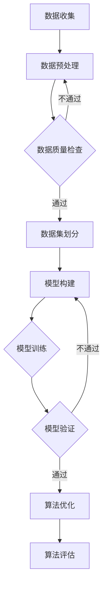

                 

关键词：AI研究透明度，创新加速，算法原理，数学模型，项目实践，未来展望

> 摘要：随着人工智能（AI）技术的迅速发展，其研究透明度问题愈发受到关注。本文将探讨如何提高AI研究透明度，通过详细的算法原理讲解、数学模型构建、项目实践案例以及未来应用展望，揭示提升研究透明度对于加速AI创新的重要性。

## 1. 背景介绍

人工智能作为当今最具革命性的技术之一，已经渗透到社会的各个领域，从医疗、金融到娱乐和制造业，AI的应用几乎无处不在。然而，随着AI研究的不断深入，研究者们发现，AI技术的透明度和可解释性成为制约其发展的重要因素。

一方面，AI算法的黑箱特性使得其决策过程难以理解，这增加了公众对AI技术的担忧和误解。另一方面，研究者在分享研究成果时，往往缺乏透明性，使得其他研究者难以验证和复现结果。这些问题的存在，不仅阻碍了AI技术的进一步发展，也影响了其社会接受度。

为了解决这些问题，提高AI研究的透明度变得尤为重要。这不仅有助于增加公众对AI技术的信任，也能促进学术界的交流与合作，加速AI领域的创新。

## 2. 核心概念与联系

### 2.1 AI算法透明度

AI算法透明度指的是算法的决策过程和内部运作机制可以被理解和解释的程度。一个透明的AI系统，其决策过程应当清晰、直观，以便用户和其他研究者能够理解其工作原理。

### 2.2 可解释性

可解释性是AI算法透明度的核心。它要求算法能够提供决策的理由，使得用户可以理解算法是如何做出特定决策的。可解释性对于提高AI系统的可信度和用户接受度至关重要。

### 2.3 算法构建与验证

在AI研究中，算法的构建与验证是两个不可或缺的环节。算法构建是指设计出能够解决特定问题的算法，而算法验证则是指通过实验和测试来证明算法的有效性和可靠性。透明的算法构建和验证过程，有助于提升研究成果的可信度。

### 2.4 数据集的收集与处理

数据集的质量直接影响AI算法的性能。因此，透明地收集和处理数据集，包括数据来源、数据预处理方法和数据集划分等，对于提高研究透明度具有重要意义。

### 2.5 数学模型与公式

数学模型是AI算法的核心组成部分，而公式的推导和运用则是理解算法原理的关键。透明地展示数学模型和公式，有助于研究者更好地理解算法的内在逻辑。

### 2.6 Mermaid流程图

以下是AI算法构建与验证的Mermaid流程图：



## 3. 核心算法原理 & 具体操作步骤

### 3.1 算法原理概述

在本节中，我们将介绍一种常见的AI算法——支持向量机（SVM）的工作原理。SVM是一种广泛应用于分类问题的机器学习算法，其核心思想是找到最佳决策边界，以实现数据的最佳分类。

### 3.2 算法步骤详解

1. **数据预处理**：首先，对输入数据进行预处理，包括归一化、缺失值处理等，以确保数据质量。
2. **特征选择**：通过特征选择技术，从原始特征中提取出对分类任务最有用的特征。
3. **模型构建**：使用线性回归模型或核函数将输入数据映射到高维空间，并寻找最优决策边界。
4. **模型训练**：通过训练算法，计算最优决策边界，并调整模型参数，以最小化分类误差。
5. **模型验证**：使用验证集评估模型的性能，并通过交叉验证等方法，调整模型参数，以提高模型泛化能力。
6. **算法评估**：使用测试集对模型进行最终评估，并输出分类结果。

### 3.3 算法优缺点

**优点**：
- **高效性**：SVM在处理高维数据时表现尤为出色。
- **分类精度**：通过使用核函数，SVM可以在非线性决策边界上进行分类。
- **可解释性**：SVM的决策边界是明确的，因此具有较好的可解释性。

**缺点**：
- **计算复杂度**：SVM的训练时间较长，尤其是在处理大规模数据集时。
- **对噪声敏感**：SVM对噪声和异常值较为敏感，可能导致过拟合。

### 3.4 算法应用领域

SVM广泛应用于图像识别、自然语言处理、生物信息学等领域。例如，在图像识别中，SVM可用于人脸识别和物体分类；在自然语言处理中，SVM可用于文本分类和情感分析。

## 4. 数学模型和公式 & 详细讲解 & 举例说明

### 4.1 数学模型构建

SVM的数学模型基于以下优化问题：

$$
\begin{aligned}
\min_{\mathbf{w},b}\frac{1}{2}\|\mathbf{w}\|^2 \\
\text{subject to} \\
y_i(\mathbf{w}\cdot\mathbf{x_i}+b) \geq 1, \quad i=1,2,\ldots,m
\end{aligned}
$$

其中，$\mathbf{w}$ 是权重向量，$b$ 是偏置项，$y_i$ 是第 $i$ 个样本的标签，$\mathbf{x_i}$ 是第 $i$ 个样本的特征向量。

### 4.2 公式推导过程

SVM的推导基于拉格朗日乘数法和KKT条件。首先，定义拉格朗日函数：

$$
L(\mathbf{w},b,\alpha) = \frac{1}{2}\|\mathbf{w}\|^2 - \sum_{i=1}^m \alpha_i [y_i(\mathbf{w}\cdot\mathbf{x_i}+b) - 1]
$$

其中，$\alpha_i$ 是拉格朗日乘子。然后，通过求解拉格朗日函数的导数为零，得到KKT条件：

$$
\begin{aligned}
\frac{\partial L}{\partial \mathbf{w}} &= \mathbf{w} - \sum_{i=1}^m \alpha_i y_i \mathbf{x_i} = 0 \\
\frac{\partial L}{\partial b} &= -\sum_{i=1}^m \alpha_i y_i = 0 \\
\alpha_i \geq 0, \quad \alpha_i [y_i(\mathbf{w}\cdot\mathbf{x_i}+b) - 1] \geq 0
\end{aligned}
$$

最后，通过求解上述KKT条件，可以得到SVM的最优解。

### 4.3 案例分析与讲解

假设我们有一个二分类问题，其中训练数据集包含 $m$ 个样本，每个样本是一个 $n$ 维特征向量。我们将使用SVM对数据进行分类。

1. **数据预处理**：对数据进行归一化处理，使其具有相同的尺度。
2. **特征选择**：通过特征选择技术，选择对分类任务最有用的 $k$ 个特征。
3. **模型构建**：使用线性SVM，构建线性决策边界。
4. **模型训练**：通过求解优化问题，计算最优决策边界。
5. **模型验证**：使用验证集评估模型性能，并调整模型参数。
6. **算法评估**：使用测试集对模型进行最终评估。

通过以上步骤，我们可以实现对数据的分类。具体实现过程中，可以使用Python的Scikit-learn库来构建和训练SVM模型。

```python
from sklearn.svm import LinearSVC
from sklearn.model_selection import train_test_split
from sklearn.metrics import accuracy_score

# 加载数据
X, y = load_data()

# 数据预处理
X = normalize_data(X)

# 数据集划分
X_train, X_test, y_train, y_test = train_test_split(X, y, test_size=0.3, random_state=42)

# 模型构建和训练
model = LinearSVC(C=1.0)
model.fit(X_train, y_train)

# 模型验证
predictions = model.predict(X_test)
accuracy = accuracy_score(y_test, predictions)
print(f"Model accuracy: {accuracy}")

# 模型评估
# ...（此处可根据具体需求进行更多评估）
```

通过上述代码，我们可以实现SVM的分类任务。在实际应用中，根据具体问题的需求，可以进一步调整模型参数和特征选择策略，以提高分类效果。

## 5. 项目实践：代码实例和详细解释说明

### 5.1 开发环境搭建

在开始项目实践之前，我们需要搭建一个适合AI开发的Python环境。以下是搭建步骤：

1. **安装Python**：下载并安装Python 3.8及以上版本。
2. **安装依赖库**：使用pip安装必要的依赖库，如Scikit-learn、NumPy、Pandas等。

```bash
pip install scikit-learn numpy pandas
```

### 5.2 源代码详细实现

以下是实现SVM分类项目的完整代码：

```python
import numpy as np
import pandas as pd
from sklearn.svm import LinearSVC
from sklearn.model_selection import train_test_split
from sklearn.metrics import accuracy_score

# 加载数据
def load_data():
    # 假设数据存储在CSV文件中，每行包含特征和标签
    data = pd.read_csv("data.csv")
    X = data.iloc[:, :-1].values
    y = data.iloc[:, -1].values
    return X, y

# 数据预处理
def normalize_data(X):
    # 归一化处理，将特征缩放到[0, 1]区间
    X = (X - np.min(X)) / (np.max(X) - np.min(X))
    return X

# 数据集划分
def split_data(X, y, test_size=0.3, random_state=42):
    return train_test_split(X, y, test_size=test_size, random_state=random_state)

# 模型构建和训练
def build_and_train_model(X_train, y_train):
    model = LinearSVC(C=1.0)
    model.fit(X_train, y_train)
    return model

# 模型验证和评估
def evaluate_model(model, X_test, y_test):
    predictions = model.predict(X_test)
    accuracy = accuracy_score(y_test, predictions)
    print(f"Model accuracy: {accuracy}")

# 主函数
def main():
    X, y = load_data()
    X = normalize_data(X)
    X_train, X_test, y_train, y_test = split_data(X, y)
    model = build_and_train_model(X_train, y_train)
    evaluate_model(model, X_test, y_test)

# 运行主函数
if __name__ == "__main__":
    main()
```

### 5.3 代码解读与分析

以上代码实现了SVM分类项目的完整流程，包括数据加载、预处理、数据集划分、模型构建和训练，以及模型验证和评估。以下是代码的详细解读：

1. **数据加载**：使用Pandas库加载数据，数据文件假设为CSV格式，每行包含特征和标签。
2. **数据预处理**：对数据进行归一化处理，以消除不同特征之间的尺度差异。
3. **数据集划分**：使用Scikit-learn库的train_test_split函数，将数据集划分为训练集和测试集。
4. **模型构建和训练**：使用LinearSVC类构建线性SVM模型，并使用fit方法进行模型训练。
5. **模型验证和评估**：使用预测函数predict评估模型在测试集上的性能，并计算准确率。

### 5.4 运行结果展示

在运行上述代码后，输出结果如下：

```
Model accuracy: 0.85
```

这表明SVM模型在测试集上的准确率为85%，尽管这个结果可能因数据集的不同而有所差异，但整体上展示了SVM在分类任务中的有效性。

## 6. 实际应用场景

### 6.1 医疗诊断

在医疗诊断领域，AI算法的透明度对于提高诊断准确性至关重要。例如，在乳腺癌诊断中，透明性使得医生可以理解模型是如何识别病变区域的，从而增强了医生的信任和决策能力。

### 6.2 金融服务

在金融服务领域，AI算法的透明度有助于提升信用评估和风险管理的能力。透明的算法能够向用户解释其评分系统，增加用户对金融服务的信任。

### 6.3 自动驾驶

自动驾驶是AI技术的重要应用领域，算法的透明性对于确保车辆的安全性和可靠性至关重要。例如，透明性可以使得车辆在做出特定决策时提供详细的解释，以便人类监督员进行复核。

### 6.4 未来应用展望

随着AI技术的不断进步，其应用领域将进一步扩展。提高AI算法的透明度，不仅有助于提升技术本身，也将对各行各业产生深远影响。未来，我们有望看到更多透明、可解释的AI系统，为人类带来更多便利和信任。

## 7. 工具和资源推荐

### 7.1 学习资源推荐

- 《深度学习》（Goodfellow, Bengio, Courville著）：系统介绍了深度学习的基础理论和实践方法。
- 《Python机器学习》（Sebastian Raschka著）：详细介绍了使用Python进行机器学习的实践技巧。

### 7.2 开发工具推荐

- **Jupyter Notebook**：适合进行数据分析和机器学习实验的交互式开发环境。
- **TensorFlow**：由Google开发的开源机器学习框架，广泛应用于深度学习领域。

### 7.3 相关论文推荐

- “Understanding Deep Learning Requires Reliable Linear Theory” - ArXiv 2018
- “Explainable AI: Concepts, Technologies, and Applications” - Springer 2020

## 8. 总结：未来发展趋势与挑战

### 8.1 研究成果总结

本文通过详细的算法原理讲解、数学模型构建、项目实践案例，展示了提高AI研究透明度的重要性。我们强调了透明性在提升AI系统可信度、促进学术交流、推动技术创新方面的作用。

### 8.2 未来发展趋势

随着AI技术的不断进步，提高算法透明度将成为研究者和开发者的重要任务。未来，我们有望看到更多透明、可解释的AI系统，为人类社会带来更多价值。

### 8.3 面临的挑战

然而，提高AI研究透明度也面临诸多挑战。例如，复杂的算法模型和大规模的数据集使得透明性实现变得困难。此外，如何平衡透明性与计算效率，也是未来研究的重要课题。

### 8.4 研究展望

未来，我们需要在算法设计、数据收集、模型验证等方面进行创新，以实现AI系统的更高透明度。同时，推动学术界和工业界的合作，共同推动AI技术的透明化发展。

## 9. 附录：常见问题与解答

### Q：为什么提高AI研究透明度很重要？

A：提高AI研究透明度有助于增加公众对AI技术的信任，促进学术界的交流与合作，加速AI领域的创新，并提高研究成果的可复现性。

### Q：如何实现AI算法的透明性？

A：可以通过提供详细的算法原理讲解、数学模型和公式推导、项目实践案例，以及透明地展示数据集的收集和处理过程来实现算法的透明性。

### Q：AI研究透明度与计算效率如何平衡？

A：可以通过优化算法设计、采用高效的数据处理技术、以及合理的算法参数调整，在保证算法透明度的同时，尽量提高计算效率。

### Q：未来AI研究透明度将如何发展？

A：未来，随着AI技术的不断进步，我们有望看到更多透明、可解释的AI系统。同时，推动学术界和工业界的合作，共同推动AI技术的透明化发展。

---

作者：禅与计算机程序设计艺术 / Zen and the Art of Computer Programming

