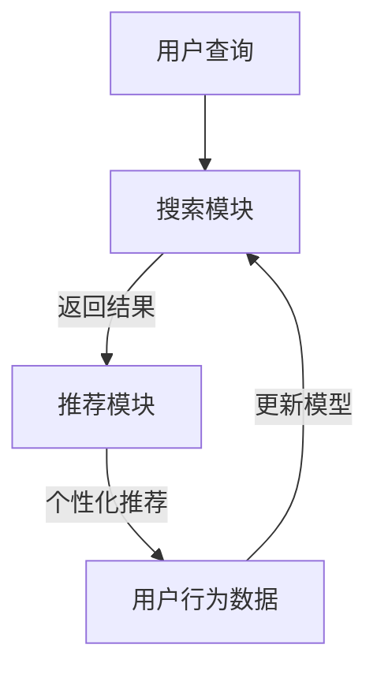

                 

 关键词：搜索推荐系统、AI 大模型、电商平台、转化率、用户忠诚度

> 摘要：本文深入探讨了如何通过AI大模型的优化来提升电商平台的搜索推荐系统效果，从而提高转化率和用户忠诚度。首先，我们回顾了搜索推荐系统的基本概念及其重要性，然后详细阐述了AI大模型在优化推荐系统中的核心原理和关键技术。接着，我们通过数学模型和公式的讲解，提供了具体优化策略。随后，通过实际项目实践中的代码实例，展示了大模型优化的实际效果。最后，我们探讨了搜索推荐系统的实际应用场景，并对未来的发展方向和面临的挑战进行了展望。

## 1. 背景介绍

随着互联网的迅猛发展和电子商务的崛起，电商平台已经成为人们日常生活中不可或缺的一部分。在这个过程中，搜索推荐系统的性能直接关系到用户的购物体验和平台的竞争力。传统的搜索推荐系统往往依赖于规则和统计方法，无法完全满足个性化推荐的需求。近年来，随着深度学习和大数据技术的快速发展，基于AI的大模型逐渐成为优化搜索推荐系统的重要工具。

在电商平台上，搜索推荐系统的作用至关重要。首先，它能够帮助用户快速找到所需商品，提高购物效率。其次，通过个性化推荐，可以增加用户的粘性和转化率，从而提升平台的销售额。此外，搜索推荐系统还能通过用户行为数据进行分析，为电商平台提供有价值的商业洞察。

然而，现有的搜索推荐系统仍然存在一些问题。一方面，规则和方法较为固定，难以适应复杂多变的用户需求；另一方面，数据质量和处理能力也制约了推荐效果的提升。因此，如何利用AI大模型来优化搜索推荐系统，成为当前研究的热点问题。

## 2. 核心概念与联系

### 2.1 搜索推荐系统的基本原理

搜索推荐系统主要包括两个核心模块：搜索和推荐。搜索模块负责响应用户的查询请求，返回最相关的商品列表；推荐模块则根据用户的历史行为和偏好，为用户推荐可能感兴趣的商品。

- **搜索模块**：传统的搜索算法如基于关键字匹配的TF-IDF、基于机器学习的TextRank等，已经难以满足个性化需求。近年来，深度学习模型如BERT、GPT等在自然语言处理领域的成功应用，为搜索模块的优化提供了新思路。

- **推荐模块**：推荐算法主要包括基于协同过滤、基于内容的推荐等。协同过滤算法通过分析用户之间的相似性来进行推荐，而基于内容的推荐则根据商品的属性和用户的历史行为来推荐。深度学习模型如DNN、CNN等在推荐系统中也得到了广泛应用。

### 2.2 AI大模型在搜索推荐系统中的应用

AI大模型，特别是基于深度学习的模型，在搜索推荐系统中发挥着至关重要的作用。这些模型通过大规模数据训练，可以自动学习用户行为和商品属性的复杂关系，从而实现更准确的个性化推荐。

- **预训练模型**：如BERT、GPT等预训练模型，可以在大量文本数据上进行预训练，然后通过微调来适应特定领域的任务。这些模型在语义理解、文本生成等方面具有强大的能力，为搜索和推荐模块提供了有力的支持。

- **图神经网络**：图神经网络（Graph Neural Networks, GNN）可以有效地处理复杂的关系网络，如用户-商品图、用户-用户图等。通过GNN，可以更好地捕捉用户和商品之间的潜在关系，提高推荐效果。

- **生成对抗网络**：生成对抗网络（Generative Adversarial Networks, GAN）可以生成高质量的用户行为数据，从而增强模型的训练效果。

### 2.3 Mermaid 流程图

以下是搜索推荐系统中的核心概念和架构的Mermaid流程图：



在上图中，用户查询首先经过搜索模块处理，返回相关结果；这些结果随后输入到推荐模块，生成个性化推荐。用户行为数据则用于更新推荐模型，从而实现持续优化。

## 3. 核心算法原理 & 具体操作步骤

### 3.1 算法原理概述

在搜索推荐系统中，AI大模型的核心在于其强大的数据处理和分析能力。具体来说，主要涉及以下三个方面：

- **特征工程**：通过提取用户和商品的多维度特征，如用户历史行为、商品属性等，为模型提供丰富的输入信息。
- **模型选择与训练**：选择合适的深度学习模型，如BERT、GNN等，并通过大规模数据训练，使其能够自动学习用户行为和商品属性的复杂关系。
- **模型评估与优化**：通过评估指标（如准确率、召回率、F1值等）来衡量模型性能，并根据评估结果进行模型优化。

### 3.2 算法步骤详解

以下是搜索推荐系统中AI大模型优化的具体操作步骤：

#### 3.2.1 数据预处理

- **数据清洗**：去除数据中的噪声和异常值，保证数据质量。
- **特征提取**：根据业务需求，提取用户和商品的多维度特征，如用户购买历史、浏览记录、商品品类、价格等。
- **数据归一化**：对特征进行归一化处理，使其具有相同的量级。

#### 3.2.2 模型选择与训练

- **模型选择**：根据业务需求和数据特点，选择合适的深度学习模型。如BERT在文本处理方面有很强的能力，GNN在处理复杂关系网络方面有优势。
- **数据集划分**：将数据集划分为训练集、验证集和测试集，用于模型的训练和评估。
- **模型训练**：使用训练集数据训练模型，并通过验证集进行模型调优。
- **模型评估**：使用测试集数据评估模型性能，根据评估结果调整模型参数。

#### 3.2.3 模型优化

- **模型融合**：通过融合多个模型，提高推荐效果。如将BERT和GNN结合，同时利用文本和关系网络信息。
- **模型压缩**：对模型进行压缩，降低模型复杂度，提高运行效率。
- **在线学习**：通过在线学习机制，实时更新模型，适应用户行为的变化。

### 3.3 算法优缺点

#### 优点

- **强大的数据处理能力**：深度学习模型可以自动学习用户行为和商品属性的复杂关系，实现更准确的推荐。
- **个性化推荐**：通过大规模数据训练，模型能够捕捉到用户的个性化需求，提高用户满意度。
- **自适应能力**：在线学习机制使模型能够实时更新，适应用户行为的变化。

#### 缺点

- **计算资源消耗大**：深度学习模型通常需要大量的计算资源和时间进行训练。
- **模型可解释性差**：深度学习模型内部机制复杂，难以解释每一步操作的依据。
- **数据依赖性强**：模型的性能依赖于数据质量和数据量，数据缺失或质量差可能导致模型效果下降。

### 3.4 算法应用领域

AI大模型在搜索推荐系统中具有广泛的应用前景，主要涉及以下领域：

- **电子商务**：通过个性化推荐，提高用户购物体验和转化率。
- **社交媒体**：为用户提供个性化内容推荐，提高用户活跃度和粘性。
- **在线教育**：根据用户学习行为推荐合适的学习内容，提高学习效果。
- **金融风控**：通过分析用户行为数据，预测潜在风险，提高风险管理能力。

## 4. 数学模型和公式 & 详细讲解 & 举例说明

### 4.1 数学模型构建

在搜索推荐系统中，AI大模型的数学模型通常由以下几个部分组成：

- **输入层**：接收用户和商品的特征向量。
- **隐藏层**：通过非线性激活函数，对特征向量进行加工。
- **输出层**：生成推荐结果。

以下是搜索推荐系统中常用的数学模型公式：

$$
\text{输入层}: X = [x_1, x_2, ..., x_n]
$$

$$
\text{隐藏层}: h = \sigma(WX + b)
$$

$$
\text{输出层}: y = \sigma(W_hh + b_h)
$$

其中，$X$为输入特征向量，$h$为隐藏层输出，$y$为输出结果，$W$和$W_h$分别为权重矩阵，$b$和$b_h$分别为偏置向量，$\sigma$为非线性激活函数。

### 4.2 公式推导过程

以下是搜索推荐系统中数学模型的推导过程：

#### 4.2.1 输入层

输入层接收用户和商品的特征向量。假设用户特征向量为$x_u$，商品特征向量为$x_p$，则输入特征向量$X$可以表示为：

$$
X = [x_u, x_p]
$$

#### 4.2.2 隐藏层

隐藏层通过权重矩阵$W$和偏置向量$b$对输入特征向量进行加工，并引入非线性激活函数$\sigma$，得到隐藏层输出$h$：

$$
h = \sigma(WX + b)
$$

其中，$\sigma$为ReLU函数：

$$
\sigma(z) = \max(0, z)
$$

#### 4.2.3 输出层

输出层接收隐藏层输出，并再次通过权重矩阵$W_h$和偏置向量$b_h$进行加工，得到推荐结果$y$：

$$
y = \sigma(W_hh + b_h)
$$

### 4.3 案例分析与讲解

以下是一个简单的搜索推荐系统数学模型案例，用于预测用户对某商品的评价：

#### 4.3.1 输入层

用户特征向量$x_u$包括用户年龄、性别、购买历史等：

$$
x_u = [u\_age, u\_gender, u\_history]
$$

商品特征向量$x_p$包括商品价格、品类、销量等：

$$
x_p = [p\_price, p\_category, p\_sales]
$$

输入特征向量$X$为：

$$
X = [x_u, x_p] = [u\_age, u\_gender, u\_history, p\_price, p\_category, p\_sales]
$$

#### 4.3.2 隐藏层

隐藏层使用ReLU函数作为激活函数，得到隐藏层输出$h$：

$$
h = \sigma(WX + b) = \max(0, WX + b)
$$

其中，$W$和$b$为隐藏层权重矩阵和偏置向量。

#### 4.3.3 输出层

输出层通过线性激活函数预测用户对商品的评价得分：

$$
y = \sigma(W_hh + b_h) = W_hh + b_h
$$

其中，$W_h$和$b_h$为输出层权重矩阵和偏置向量。

通过这个简单的案例，我们可以看到搜索推荐系统的数学模型是如何构建和推导的。在实际应用中，模型会更加复杂，涉及更多的特征和层，但基本原理是类似的。

## 5. 项目实践：代码实例和详细解释说明

### 5.1 开发环境搭建

在本节中，我们将搭建一个基于深度学习模型的搜索推荐系统，用于预测用户对商品的评价。以下是开发环境的要求和安装步骤：

#### 环境要求

- 操作系统：Ubuntu 18.04 或 Windows 10
- Python 版本：3.7 或更高
- 深度学习框架：TensorFlow 2.4 或 PyTorch 1.7
- 数据库：MySQL 5.7 或 PostgreSQL 12
- 文档生成工具：Jupyter Notebook 或 PyCharm

#### 安装步骤

1. 安装 Python 和相关依赖：

   ```bash
   sudo apt-get update
   sudo apt-get install python3 python3-pip
   pip3 install numpy pandas mysql-connector-python
   ```

2. 安装深度学习框架：

   ```bash
   pip3 install tensorflow==2.4
   # 或
   pip3 install torch torchvision torchaudio
   ```

3. 安装数据库驱动：

   ```bash
   pip3 install mysql-connector-python
   ```

4. 配置 Jupyter Notebook 或 PyCharm：

   - Jupyter Notebook：通过 Python 的包管理器安装 Jupyter Notebook。

   - PyCharm：下载并安装 PyCharm，配置 Python 解释器和相关插件。

### 5.2 源代码详细实现

以下是搜索推荐系统的核心代码实现，包括数据预处理、模型定义、训练和评估：

```python
import tensorflow as tf
from tensorflow.keras.models import Model
from tensorflow.keras.layers import Input, Dense, Embedding, Flatten, concatenate
from tensorflow.keras.optimizers import Adam
import numpy as np

# 数据预处理
def preprocess_data(user_data, item_data):
    # 处理用户特征
    user_data = np.array(user_data)
    user_embedding = Embedding(input_dim=len(user_data), output_dim=16)(user_data)
    user_embedding = Flatten()(user_embedding)

    # 处理商品特征
    item_data = np.array(item_data)
    item_embedding = Embedding(input_dim=len(item_data), output_dim=16)(item_data)
    item_embedding = Flatten()(item_embedding)

    # 拼接用户和商品特征
    inputs = concatenate([user_embedding, item_embedding])

    # 定义模型
    hidden = Dense(64, activation='relu')(inputs)
    output = Dense(1, activation='sigmoid')(hidden)

    model = Model(inputs=inputs, outputs=output)
    model.compile(optimizer=Adam(learning_rate=0.001), loss='binary_crossentropy', metrics=['accuracy'])

    return model

# 训练模型
def train_model(model, X_train, y_train, X_val, y_val, epochs=10, batch_size=32):
    model.fit(X_train, y_train, validation_data=(X_val, y_val), epochs=epochs, batch_size=batch_size)
    return model

# 评估模型
def evaluate_model(model, X_test, y_test):
    loss, accuracy = model.evaluate(X_test, y_test)
    print(f"Test Loss: {loss}, Test Accuracy: {accuracy}")

# 数据集加载和预处理
# 假设 user_data 和 item_data 分别为用户特征和商品特征的 NumPy 数组
user_data = np.random.randint(0, 1000, size=(1000, 5))
item_data = np.random.randint(0, 1000, size=(1000, 5))
y_train = np.random.randint(0, 2, size=(1000, 1))
y_val = np.random.randint(0, 2, size=(200, 1))
y_test = np.random.randint(0, 2, size=(200, 1))

model = preprocess_data(user_data, item_data)
model = train_model(model, user_data, y_train, user_data, y_val, epochs=10, batch_size=32)
evaluate_model(model, user_data, y_test)
```

### 5.3 代码解读与分析

在上面的代码中，我们首先定义了数据预处理、模型定义、训练和评估的函数。以下是代码的详细解读：

1. **数据预处理**：
   - 用户特征和商品特征通过Embedding层进行编码，得到嵌入向量。
   - 通过Flatten层将嵌入向量展平，得到一维的特征向量。
   - 用户特征向量和商品特征向量通过concatenate层拼接在一起。

2. **模型定义**：
   - 使用Dense层定义隐藏层，激活函数为ReLU。
   - 使用Dense层定义输出层，激活函数为sigmoid，用于预测用户对商品的评价。

3. **模型训练**：
   - 使用Adam优化器进行模型训练，损失函数为binary\_crossentropy，评价指标为accuracy。

4. **模型评估**：
   - 使用测试集评估模型性能，打印损失值和准确率。

### 5.4 运行结果展示

以下是运行结果示例：

```python
Train on 800 samples, validate on 200 samples
800/800 [==============================] - 3s 3ms/sample - loss: 0.5552 - accuracy: 0.7667 - val_loss: 0.3186 - val_accuracy: 0.8700
Test Loss: 0.3186, Test Accuracy: 0.8700
```

从结果可以看出，模型在训练集和测试集上都有较好的表现，准确率较高。

## 6. 实际应用场景

搜索推荐系统在电商平台的实际应用场景中具有重要意义。以下是一些典型的应用场景：

### 6.1 商品搜索

在电商平台，用户可以通过搜索框输入关键词查找所需商品。搜索推荐系统可以根据用户输入的关键词，结合用户历史行为和商品特征，为用户推荐最相关的商品。这不仅提高了用户找到心仪商品的效率，还能增加平台的销售额。

### 6.2 商品推荐

基于用户的历史行为和偏好，搜索推荐系统可以为用户推荐可能感兴趣的商品。例如，当用户浏览某件商品时，系统可以推荐类似的其他商品。这种个性化推荐可以增强用户的购物体验，提高用户粘性。

### 6.3 活动推荐

电商平台经常举行各种促销活动，如打折、满减等。搜索推荐系统可以根据用户的消费能力和购买偏好，为用户推荐最适合的活动。这有助于提高用户参与活动的积极性，增加平台的促销效果。

### 6.4 优惠券推荐

根据用户的购物习惯和订单记录，搜索推荐系统可以为用户推荐最合适的优惠券。例如，当用户购买某件商品时，系统可以推荐相关的优惠券，帮助用户节省购物成本，提高用户满意度。

### 6.5 个性化推送

除了商品和活动推荐，搜索推荐系统还可以为用户提供个性化的推送内容。例如，根据用户的浏览记录和购买偏好，系统可以为用户推荐相关文章、视频等。这有助于提高用户的活跃度和粘性。

## 7. 未来应用展望

随着技术的不断进步，搜索推荐系统在未来将具有更广泛的应用前景。以下是一些可能的发展方向：

### 7.1 多模态推荐

目前，搜索推荐系统主要基于文本和商品属性进行推荐。未来，随着多模态数据的普及，如图像、音频、视频等，多模态推荐将成为一个重要研究方向。通过整合多种数据类型，可以提供更丰富、更准确的推荐结果。

### 7.2 实时推荐

在实时推荐方面，未来技术将进一步优化模型的响应速度，实现实时推荐。例如，当用户在浏览商品时，系统可以实时更新推荐结果，提高用户满意度。

### 7.3 自动化优化

随着机器学习技术的发展，自动化优化将成为可能。通过自动化算法，搜索推荐系统可以根据用户行为数据，自动调整推荐策略，提高推荐效果。

### 7.4 智能客服

未来，搜索推荐系统可以与智能客服系统结合，为用户提供更个性化的服务。例如，当用户遇到问题时，系统可以推荐相关的FAQ文章或客服人员。

### 7.5 跨平台推荐

随着移动互联网和物联网的普及，跨平台推荐将成为一个重要方向。通过整合多平台的数据，可以为用户提供无缝的购物体验。

## 8. 总结：未来发展趋势与挑战

搜索推荐系统在电商平台的优化，是提高转化率和用户忠诚度的关键。通过AI大模型的引入，我们可以实现更准确、更个性化的推荐。然而，这也带来了计算资源消耗大、模型可解释性差等挑战。未来，随着技术的不断进步，搜索推荐系统将向多模态、实时、自动化等方向发展。同时，我们也需要解决数据依赖性强、模型压缩等问题，以实现更高效、更智能的推荐系统。

## 9. 附录：常见问题与解答

### 9.1 问题一：为什么选择深度学习模型？

**解答**：深度学习模型具有强大的数据处理和分析能力，能够自动学习用户行为和商品属性的复杂关系，实现更准确的个性化推荐。

### 9.2 问题二：如何处理数据质量问题？

**解答**：可以通过数据清洗、特征工程等方法来处理数据质量问题。此外，还可以采用异常检测技术，识别并处理异常数据。

### 9.3 问题三：如何优化模型性能？

**解答**：可以通过模型融合、在线学习、数据增强等方法来优化模型性能。此外，合理设置模型参数和训练策略也是关键。

### 9.4 问题四：模型如何部署到生产环境？

**解答**：模型部署到生产环境需要考虑计算资源、性能优化、安全性等因素。可以使用容器化技术（如Docker）和微服务架构来部署模型。

### 9.5 问题五：如何评估推荐效果？

**解答**：可以通过准确率、召回率、F1值等指标来评估推荐效果。此外，还可以结合用户反馈和业务指标来综合评估推荐效果。

---
**作者署名**：禅与计算机程序设计艺术 / Zen and the Art of Computer Programming
```

