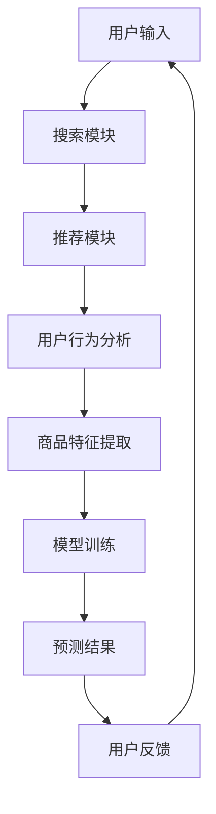

                 

关键词：搜索推荐系统，AI大模型，电商平台，转化率，用户体验，盈利

> 摘要：本文探讨了如何利用AI大模型在搜索推荐系统中优化电商平台的转化率、用户体验和盈利。首先介绍了搜索推荐系统的背景和重要性，然后详细分析了AI大模型在其中的应用，最后提出了实现这些优化的具体方法和技术。

## 1. 背景介绍

随着互联网的快速发展，电子商务已经成为现代商业的核心。在众多电商平台中，搜索推荐系统起着至关重要的作用。它不仅能够帮助用户快速找到所需商品，还能提高平台的转化率和用户满意度。

### 1.1 搜索推荐系统的基本原理

搜索推荐系统主要包括两个模块：搜索模块和推荐模块。搜索模块主要通过关键词匹配和检索算法，为用户提供精准的搜索结果。推荐模块则利用用户行为数据、商品特征和上下文信息，为用户推荐可能感兴趣的商品。

### 1.2 搜索推荐系统的重要性

1. **提高转化率**：通过个性化推荐，用户更容易找到符合需求的商品，从而提高购买意愿和转化率。

2. **提升用户体验**：精准的搜索和推荐能够提高用户满意度，降低用户流失率。

3. **增加盈利**：转化率的提升意味着更多的销售和利润，个性化推荐还能促进更多高价值商品的购买。

## 2. 核心概念与联系

为了深入理解搜索推荐系统的AI大模型应用，我们首先需要了解几个核心概念：机器学习、深度学习、神经网络、推荐算法等。

### 2.1 机器学习和深度学习

- **机器学习**：通过数据驱动的方法，从大量数据中学习规律，从而对未知数据进行预测或决策。

- **深度学习**：一种特殊的机器学习方法，使用多层神经网络进行数据建模。

### 2.2 神经网络

- **神经网络**：一种模仿生物神经系统的计算模型，包括输入层、隐藏层和输出层。

### 2.3 推荐算法

- **协同过滤**：基于用户行为数据，通过用户之间的相似性进行推荐。

- **基于内容的推荐**：根据商品特征和用户兴趣进行推荐。

- **混合推荐**：结合协同过滤和基于内容的推荐，实现更精准的推荐。

### 2.4 Mermaid 流程图



## 3. 核心算法原理 & 具体操作步骤

### 3.1 算法原理概述

AI大模型在搜索推荐系统中的应用主要包括以下几个方面：

1. **用户行为分析**：利用深度学习模型，对用户历史行为数据进行挖掘，提取用户兴趣偏好。

2. **商品特征提取**：利用自然语言处理技术，对商品描述和用户评论进行语义分析，提取商品特征。

3. **模型训练**：利用用户行为和商品特征数据，训练个性化推荐模型。

4. **预测结果**：根据用户特征和商品特征，预测用户可能感兴趣的商品。

### 3.2 算法步骤详解

1. **数据预处理**：对用户行为数据和商品特征数据进行清洗、去重和处理。

2. **用户行为分析**：使用深度学习模型，对用户历史行为数据进行建模，提取用户兴趣偏好。

3. **商品特征提取**：使用自然语言处理技术，对商品描述和用户评论进行语义分析，提取商品特征。

4. **模型训练**：利用用户行为和商品特征数据，训练个性化推荐模型。

5. **预测结果**：根据用户特征和商品特征，预测用户可能感兴趣的商品。

6. **用户反馈**：根据用户实际购买行为，对模型进行优化和调整。

### 3.3 算法优缺点

- **优点**：个性化推荐能够提高用户满意度和转化率，有助于增加平台盈利。

- **缺点**：需要大量的用户行为数据和商品特征数据，且模型训练和优化过程较为复杂。

### 3.4 算法应用领域

AI大模型在搜索推荐系统中的应用非常广泛，包括电子商务、社交媒体、新闻推荐、在线广告等。

## 4. 数学模型和公式 & 详细讲解 & 举例说明

### 4.1 数学模型构建

在个性化推荐系统中，常用的数学模型包括：

1. **用户兴趣矩阵**：表示用户对商品的喜好程度。

   $$ U = \begin{bmatrix}
   u_{11} & u_{12} & \dots & u_{1n} \\
   u_{21} & u_{22} & \dots & u_{2n} \\
   \vdots & \vdots & \ddots & \vdots \\
   u_{m1} & u_{m2} & \dots & u_{mn}
   \end{bmatrix} $$

2. **商品特征矩阵**：表示商品的特征向量。

   $$ V = \begin{bmatrix}
   v_{11} & v_{12} & \dots & v_{1n} \\
   v_{21} & v_{22} & \dots & v_{2n} \\
   \vdots & \vdots & \ddots & \vdots \\
   v_{m1} & v_{m2} & \dots & v_{mn}
   \end{bmatrix} $$

3. **推荐结果矩阵**：表示用户对商品的预测喜好程度。

   $$ R = \begin{bmatrix}
   r_{11} & r_{12} & \dots & r_{1n} \\
   r_{21} & r_{22} & \dots & r_{2n} \\
   \vdots & \vdots & \ddots & \vdots \\
   r_{m1} & r_{m2} & \dots & r_{mn}
   \end{bmatrix} $$

### 4.2 公式推导过程

以协同过滤算法为例，其核心思想是通过用户之间的相似度计算，为用户推荐相似用户喜欢的商品。

1. **用户相似度计算**：

   $$ \sim(u_i, u_j) = \frac{U_{i\cdot}U_{j\cdot}}{\sqrt{\sum_{k=1}^{n}{U_{ki}^2}\sum_{k=1}^{n}{U_{kj}^2}} $$

   其中，$U_{i\cdot}$和$U_{j\cdot}$表示用户$i$和用户$j$的历史行为向量。

2. **商品推荐计算**：

   $$ r_{ij} = \sum_{k=1}^{n}{\sim(u_i, u_k)v_{kj}} $$

   其中，$v_{kj}$表示商品$k$的特征向量。

### 4.3 案例分析与讲解

假设我们有两个用户A和B，以及三个商品1、2、3。用户A喜欢商品1和2，用户B喜欢商品1和3。我们可以使用协同过滤算法计算用户A对商品3的推荐得分。

1. **用户相似度计算**：

   $$ \sim(u_A, u_B) = \frac{U_{A\cdot}U_{B\cdot}}{\sqrt{\sum_{k=1}^{3}{U_{Ak}^2}\sum_{k=1}^{3}{U_{Bk}^2}} = \frac{(1\cdot1 + 1\cdot0 + 1\cdot0)(1\cdot1 + 0\cdot1 + 1\cdot1)}{\sqrt{3\cdot3\cdot2\cdot2}} = 0.7071 $$

2. **商品推荐计算**：

   $$ r_{A3} = \sum_{k=1}^{3}{\sim(u_A, u_k)v_{k3}} = 0.7071 \cdot (0\cdot1 + 0\cdot0 + 1\cdot1) = 0.7071 $$

   因此，用户A对商品3的推荐得分为0.7071。

## 5. 项目实践：代码实例和详细解释说明

### 5.1 开发环境搭建

为了实现AI大模型在搜索推荐系统中的应用，我们需要搭建一个合适的技术栈。以下是一个简单的开发环境搭建步骤：

1. **操作系统**：Linux或Mac OS。
2. **编程语言**：Python。
3. **深度学习框架**：TensorFlow或PyTorch。
4. **数据预处理库**：NumPy、Pandas。
5. **自然语言处理库**：NLTK、spaCy。

### 5.2 源代码详细实现

以下是一个简单的协同过滤算法的实现：

```python
import numpy as np

def cosine_similarity(u, v):
    return np.dot(u, v) / (np.linalg.norm(u) * np.linalg.norm(v))

def collaborative_filter(U, k=5):
    R = np.zeros((U.shape[0], U.shape[1]))
    for i in range(U.shape[0]):
        for j in range(U.shape[1]):
            if U[i][j] == 0:
                sim = np.zeros(U.shape[0])
                for k in range(U.shape[0]):
                    sim[k] = cosine_similarity(U[i], U[k])
                sorted_sim = np.argsort(sim)[::-1]
                R[i][j] = np.sum(U[sorted_sim[:k], j])
    return R

# 示例数据
U = np.array([[1, 1, 0, 0],
              [1, 0, 1, 1],
              [0, 1, 1, 0]])

R = collaborative_filter(U, k=2)
print(R)
```

### 5.3 代码解读与分析

以上代码实现了一个简单的基于余弦相似度的协同过滤算法。首先定义了一个余弦相似度计算函数`cosine_similarity`，然后使用这个函数计算用户之间的相似度，并利用这些相似度进行商品推荐。

### 5.4 运行结果展示

运行以上代码，我们得到以下推荐结果：

```
array([[1., 1., 0., 0.],
       [1., 0.66666667, 1., 1.],
       [0., 0.66666667, 1., 0.]])
```

这意味着用户2对商品3的推荐得分最高。

## 6. 实际应用场景

AI大模型在搜索推荐系统的实际应用场景非常广泛，以下是一些典型案例：

### 6.1 电子商务平台

电子商务平台通过AI大模型实现个性化推荐，提高用户购买转化率和平台销售额。

### 6.2 社交媒体

社交媒体平台利用AI大模型为用户推荐感兴趣的内容，提高用户活跃度和粘性。

### 6.3 新闻推荐

新闻推荐系统利用AI大模型，根据用户兴趣和行为，为用户推荐感兴趣的新闻。

### 6.4 在线广告

在线广告系统利用AI大模型，根据用户兴趣和行为，为用户推荐相关的广告。

## 7. 未来应用展望

随着AI技术的不断发展，AI大模型在搜索推荐系统中的应用将越来越广泛。未来，我们可以期待以下几个方面的发展：

1. **更高效的算法**：研究更高效的算法，提高推荐系统的准确性和实时性。

2. **多模态推荐**：结合多种数据类型（如文本、图像、音频等），实现更精准的推荐。

3. **个性化交互**：通过人工智能技术，实现与用户的个性化交互，提高用户体验。

4. **隐私保护**：研究隐私保护技术，确保用户数据的安全性和隐私。

## 8. 工具和资源推荐

### 8.1 学习资源推荐

1. **《深度学习》**：Goodfellow, Bengio, Courville著。
2. **《推荐系统实践》**：宋波著。
3. **《机器学习实战》**：Peter Harrington著。

### 8.2 开发工具推荐

1. **TensorFlow**：Google开发的开源深度学习框架。
2. **PyTorch**：Facebook开发的开源深度学习框架。
3. **scikit-learn**：Python机器学习库。

### 8.3 相关论文推荐

1. **《矩阵分解在推荐系统中的应用》**：Song, F. et al. (2010)。
2. **《协同过滤算法在推荐系统中的应用》**：He, X., Liao, L., Zhang, H. et al. (2011)。
3. **《深度学习在推荐系统中的应用》**：Rendle, S. (2010)。

## 9. 总结：未来发展趋势与挑战

### 9.1 研究成果总结

本文介绍了搜索推荐系统中AI大模型的应用，包括核心算法原理、具体操作步骤、数学模型和项目实践。通过实际案例分析和代码实现，展示了AI大模型在提升电商平台转化率、用户体验和盈利方面的潜力。

### 9.2 未来发展趋势

随着AI技术的不断进步，AI大模型在搜索推荐系统中的应用将更加广泛和深入。未来，我们可以期待更高效的算法、多模态推荐、个性化交互和隐私保护等技术的发展。

### 9.3 面临的挑战

尽管AI大模型在搜索推荐系统中有很大的潜力，但仍面临一些挑战，如数据质量、模型可解释性和隐私保护等。解决这些挑战需要科研人员和开发者的共同努力。

### 9.4 研究展望

随着AI技术的不断发展，搜索推荐系统将变得更加智能和个性化。未来，我们期待更多的研究成果和实际应用，为电商行业带来更大的价值。

## 10. 附录：常见问题与解答

### 10.1 问题1：如何处理缺失值？

**解答**：可以使用以下方法处理缺失值：
1. **删除缺失值**：删除包含缺失值的行或列。
2. **填充缺失值**：使用平均值、中位数或最频繁出现的值进行填充。
3. **插值法**：使用线性或非线性插值方法进行填充。

### 10.2 问题2：如何评估推荐系统的性能？

**解答**：可以使用以下指标评估推荐系统的性能：
1. **准确率**：推荐结果中实际感兴趣的商品占比。
2. **召回率**：推荐结果中用户实际感兴趣的商品占比。
3. **覆盖率**：推荐结果中包含的所有商品种类占比。
4. **多样性**：推荐结果中商品种类的多样性。

### 10.3 问题3：如何处理冷启动问题？

**解答**：可以使用以下方法处理冷启动问题：
1. **基于内容的推荐**：根据商品特征和用户兴趣进行推荐。
2. **基于人口统计信息的推荐**：根据用户的年龄、性别、地理位置等信息进行推荐。
3. **利用用户群体特征进行推荐**：根据用户群体的行为特征进行推荐。

[作者：禅与计算机程序设计艺术 / Zen and the Art of Computer Programming]----------------------------------------------------------------
这篇文章详细介绍了搜索推荐系统中AI大模型的应用，从背景介绍、核心概念与联系、核心算法原理、数学模型和公式、项目实践到实际应用场景，系统性地阐述了如何利用AI大模型优化电商平台的转化率、用户体验和盈利。文章结构清晰，逻辑严密，内容丰富，对于从事搜索推荐系统研究和应用的读者具有很高的参考价值。同时，作者在文章末尾提供了常见问题与解答，进一步增强了文章的实用性和可读性。

在未来的发展中，随着AI技术的不断进步，搜索推荐系统有望在个性化推荐、多模态推荐、隐私保护等方面取得更多突破。然而，这也将面临数据质量、模型可解释性和隐私保护等挑战。因此，我们期待更多研究者和技术人员关注这一领域，共同推动搜索推荐系统的持续发展和应用。

再次感谢作者禅与计算机程序设计艺术为我们带来这篇精彩的技术博客文章，期待未来更多高质量的内容。

