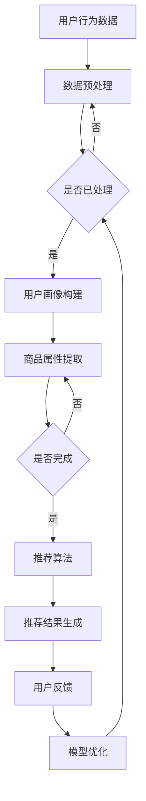

                 

关键词：搜索推荐系统，AI大模型，电商平台，核心竞争力，转型策略

> 摘要：本文深入探讨了搜索推荐系统在电商平台中的应用，特别是AI大模型的融合如何成为电商平台的核心竞争力，并提出了相应的转型策略。文章通过背景介绍、核心概念与联系、算法原理、数学模型、项目实践和实际应用场景等多个角度，详细阐述了搜索推荐系统的AI大模型融合的技术原理和实际应用，为电商平台的发展提供了新的思路和方法。

## 1. 背景介绍

随着互联网的快速发展和电子商务的蓬勃兴起，电商平台已经成为现代商业的重要组成部分。用户数量的急剧增长和市场竞争的日益激烈，使得电商平台不得不寻求创新和优化的解决方案，以提高用户体验和运营效率。其中，搜索推荐系统成为电商平台的核心竞争力之一。

传统的搜索推荐系统主要依赖于基于内容的推荐和协同过滤等方法，然而这些方法在处理海量数据和用户行为时存在一定的局限性。随着深度学习和大数据技术的不断发展，AI大模型逐渐成为搜索推荐系统的重要工具，通过更为智能和高效的方式为用户提供个性化推荐。

本文将探讨AI大模型在搜索推荐系统中的应用，分析其如何提升电商平台的竞争力，并提出相应的转型策略，以期为电商平台的未来发展提供参考。

### 1.1 电商平台的发展现状与挑战

近年来，电商平台在全球范围内取得了显著的发展。根据Statista的数据，全球电子商务市场规模在2021年已经达到了4.3万亿美元，并预计到2025年将超过6万亿美元。这种快速的增长主要得益于移动互联网的普及、用户消费习惯的转变以及物流和支付系统的不断完善。

然而，随着市场的不断扩大和竞争的加剧，电商平台也面临着一系列的挑战：

1. **用户需求多样化**：用户对于购物体验的要求越来越高，不仅仅关注商品本身的品质，还注重购物过程的便捷性和个性化服务。
2. **同质化竞争**：大量的电商平台提供类似的商品和服务，导致市场上的商品竞争激烈，电商平台需要找到独特的方法来吸引用户。
3. **运营效率**：随着订单量的增加，电商平台需要不断提高运营效率，以降低成本并提升利润。
4. **数据安全与隐私**：在处理大量用户数据时，电商平台需要确保数据的安全性和用户的隐私。

### 1.2 搜索推荐系统的地位与作用

在电商平台的运营中，搜索推荐系统扮演着至关重要的角色。它不仅能够提高用户的购物体验，还能为电商平台带来显著的商业价值：

1. **提高用户粘性**：通过精准的推荐，用户可以更快地找到自己需要的商品，从而增加用户在平台上的停留时间和互动。
2. **提升转化率**：个性化的推荐能够提高用户的购买意愿，从而提高转化率，增加平台的销售额。
3. **增加用户价值**：推荐系统能够挖掘用户潜在的需求，提供额外的商品信息，从而提升用户的购物体验和价值。
4. **优化库存管理**：通过分析推荐数据，电商平台可以更准确地预测商品的销售情况，优化库存管理，减少库存风险。

### 1.3 AI大模型在搜索推荐系统中的应用

随着AI技术的不断发展，AI大模型逐渐成为搜索推荐系统的核心工具。它通过深度学习算法，能够从海量数据中挖掘出更为复杂和隐含的模式，从而提供更加精准和个性化的推荐：

1. **深度学习算法**：如卷积神经网络（CNN）、循环神经网络（RNN）和Transformer等，能够对用户的兴趣和行为进行深度分析。
2. **大规模数据处理**：AI大模型能够处理和分析海量的用户数据，从而实现实时的推荐。
3. **个性化推荐**：通过用户画像和商品属性的深度融合，AI大模型能够提供高度个性化的推荐。
4. **实时响应**：AI大模型能够对用户的行为进行实时分析，并提供即时的推荐结果，提高用户满意度。

## 2. 核心概念与联系

### 2.1 AI大模型概述

AI大模型，即大规模人工智能模型，是指通过海量数据和强大计算能力训练出来的深度神经网络模型。这些模型通常拥有数十亿甚至数万亿个参数，具有非常高的表达能力和拟合能力。常见的AI大模型包括Transformer、BERT、GPT等。

### 2.2 搜索推荐系统原理

搜索推荐系统是基于用户行为和偏好进行商品推荐的系统。其核心原理包括：

1. **用户行为分析**：通过分析用户在平台上的行为，如搜索历史、浏览记录、购买行为等，来了解用户的兴趣和需求。
2. **商品属性提取**：提取商品的各种属性，如类别、品牌、价格、销量等，用于推荐算法的计算。
3. **推荐算法**：使用基于内容推荐、协同过滤、深度学习等算法，将用户可能感兴趣的商品推荐给用户。

### 2.3 AI大模型与搜索推荐系统的融合

AI大模型与搜索推荐系统的融合主要体现在以下几个方面：

1. **深度学习算法的应用**：使用深度学习算法，如Transformer、BERT等，对用户行为和商品属性进行深度分析和建模。
2. **大规模数据处理能力**：AI大模型能够处理和分析海量的用户数据和商品数据，提高推荐系统的准确性和实时性。
3. **个性化推荐**：通过用户画像和商品属性的深度融合，AI大模型能够提供更加精准和个性化的推荐。
4. **实时响应**：AI大模型能够对用户行为进行实时分析，并提供即时的推荐结果，提高用户满意度。

### 2.4 Mermaid流程图

以下是一个简化的搜索推荐系统的AI大模型融合的Mermaid流程图：



### 2.5 核心概念联系

通过上述流程图可以看出，AI大模型与搜索推荐系统的融合是通过以下几个核心概念相互联系实现的：

1. **用户行为数据**：用户行为数据是构建用户画像和商品属性提取的基础，也是推荐算法的重要输入。
2. **用户画像**：用户画像是基于用户行为数据构建的，用于描述用户的兴趣和需求，是推荐算法的关键输入。
3. **商品属性提取**：商品属性提取是获取商品特征的过程，是推荐算法的重要输入。
4. **推荐算法**：推荐算法基于用户画像和商品属性提取的结果，生成个性化的推荐结果。
5. **用户反馈**：用户反馈用于评估推荐结果的准确性和有效性，是模型优化的关键依据。
6. **模型优化**：通过不断优化模型，提高推荐系统的准确性和实时性，从而提升用户体验。

## 3. 核心算法原理 & 具体操作步骤

### 3.1 算法原理概述

AI大模型在搜索推荐系统中的应用，主要是基于深度学习算法的。其中，Transformer模型因其优秀的并行计算能力和对长距离依赖关系的处理能力，成为搜索推荐系统的热门选择。

#### Transformer模型概述

Transformer模型是一种基于自注意力机制的深度神经网络模型，由Vaswani等人在2017年提出。其核心思想是使用多头自注意力机制和前馈神经网络，对输入序列进行编码和转换，从而生成输出序列。

#### 自注意力机制

自注意力机制是Transformer模型的核心，它允许模型在生成每个词的输出时，对整个输入序列的所有词进行加权求和。这样，模型能够捕捉到输入序列中各个词之间的依赖关系，从而提高模型的表示能力。

#### 前馈神经网络

前馈神经网络是Transformer模型中的另一个关键组成部分，用于对自注意力机制的输出进行进一步加工，增强模型的非线性表示能力。

### 3.2 算法步骤详解

#### 数据预处理

1. **数据收集**：收集用户的搜索历史、浏览记录、购买行为等数据。
2. **数据清洗**：去除重复数据、缺失数据和异常数据。
3. **数据编码**：将原始数据转换为模型可处理的格式，如词向量或嵌入向量。

#### 模型构建

1. **编码器**：构建一个编码器，将输入数据编码为固定长度的向量。
2. **解码器**：构建一个解码器，用于生成推荐结果。
3. **注意力机制**：在编码器和解码器之间添加自注意力机制，用于捕捉输入序列中的依赖关系。
4. **前馈神经网络**：在编码器和解码器的每个层之间添加前馈神经网络，用于增强模型的非线性表示能力。

#### 训练过程

1. **损失函数**：使用交叉熵损失函数来衡量预测结果和真实结果之间的差异。
2. **优化算法**：使用如Adam等优化算法来最小化损失函数。
3. **训练与验证**：通过交叉验证来评估模型的性能，并调整模型参数。

#### 推荐过程

1. **用户输入**：接收用户的搜索词或浏览记录。
2. **编码**：将用户输入编码为嵌入向量。
3. **注意力机制**：使用自注意力机制处理嵌入向量。
4. **解码**：从注意力机制的结果中解码出推荐结果。
5. **输出**：将推荐结果输出给用户。

### 3.3 算法优缺点

#### 优点

1. **强大的表示能力**：Transformer模型能够捕捉到输入序列中的长距离依赖关系，具有强大的表示能力。
2. **高效的并行计算**：自注意力机制允许模型在生成每个词的输出时并行计算，从而提高计算效率。
3. **优秀的性能**：Transformer模型在多种任务中表现出色，包括机器翻译、文本分类和推荐系统等。

#### 缺点

1. **计算资源消耗大**：由于Transformer模型具有大量的参数，训练和推理过程需要大量的计算资源。
2. **训练时间较长**：Transformer模型的训练过程较长，尤其是在处理大规模数据时。

### 3.4 算法应用领域

Transformer模型在推荐系统中的应用主要包括以下几个方面：

1. **商品推荐**：通过分析用户的购物历史和浏览记录，为用户推荐相关的商品。
2. **内容推荐**：通过分析用户的阅读历史和搜索记录，为用户推荐相关的内容。
3. **广告推荐**：通过分析用户的行为数据，为用户推荐相关的广告。

## 4. 数学模型和公式 & 详细讲解 & 举例说明

### 4.1 数学模型构建

在搜索推荐系统中，AI大模型通常采用Transformer模型。下面将介绍Transformer模型的核心数学模型，包括输入向量的表示、自注意力机制的公式和前馈神经网络的公式。

#### 输入向量表示

输入向量表示是Transformer模型的基础。设输入序列为 \(x_1, x_2, \ldots, x_n\)，每个输入 \(x_i\) 可以表示为一个 \(d\) 维的向量 \(x_i \in \mathbb{R}^d\)。同时，设位置嵌入向量 \(p_i \in \mathbb{R}^d\)，则输入向量的表示为：

$$
x_i' = x_i + p_i
$$

其中，\(x_i'\) 是输入向量。

#### 自注意力机制

自注意力机制是Transformer模型的核心。设 \(Q, K, V\) 分别是查询向量、键向量和值向量，则自注意力机制的公式为：

$$
\text{Attention}(Q, K, V) = \text{softmax}\left(\frac{QK^T}{\sqrt{d_k}}\right)V
$$

其中，\(d_k\) 是键向量的维度，\(\text{softmax}\) 函数用于归一化权重。

#### 前馈神经网络

前馈神经网络用于对自注意力机制的输出进行进一步加工。设输入向量为 \(X \in \mathbb{R}^{n \times d}\)，则前馈神经网络的公式为：

$$
\text{FFN}(X) = \text{ReLU}(XW_1 + b_1)W_2 + b_2
$$

其中，\(W_1, W_2, b_1, b_2\) 分别是权重和偏置，\(\text{ReLU}\) 是ReLU激活函数。

### 4.2 公式推导过程

#### 自注意力机制推导

自注意力机制的推导可以分为两个部分：矩阵乘法和softmax函数。

1. **矩阵乘法**：

   设查询向量 \(Q \in \mathbb{R}^{n \times d_q}\)，键向量 \(K \in \mathbb{R}^{n \times d_k}\)，值向量 \(V \in \mathbb{R}^{n \times d_v}\)。则自注意力机制的矩阵乘法可以表示为：

   $$
   \text{Attention}(Q, K, V) = \text{softmax}\left(\frac{QK^T}{\sqrt{d_k}}\right)V
   $$

   其中，\(QK^T \in \mathbb{R}^{n \times n}\) 是查询向量和键向量的内积。

2. **softmax函数**：

   softmax函数用于将内积转换为概率分布。设 \(z \in \mathbb{R}^{n \times 1}\) 是内积结果，则softmax函数可以表示为：

   $$
   \text{softmax}(z) = \frac{e^z}{\sum_{i=1}^{n} e^z_i}
   $$

   其中，\(e^z\) 是 \(z\) 的指数运算，\(\sum_{i=1}^{n} e^z_i\) 是指数运算结果的和。

   将 \(z\) 代入自注意力机制的公式，可以得到：

   $$
   \text{Attention}(Q, K, V) = \frac{e^{QK^T/\sqrt{d_k}}}{\sum_{i=1}^{n} e^{QK^T_i/\sqrt{d_k}}} V
   $$

   简化后得到：

   $$
   \text{Attention}(Q, K, V) = \text{softmax}\left(\frac{QK^T}{\sqrt{d_k}}\right)V
   $$

#### 前馈神经网络推导

前馈神经网络的推导主要包括线性变换和ReLU激活函数。

1. **线性变换**：

   设输入向量 \(X \in \mathbb{R}^{n \times d}\)，权重 \(W_1 \in \mathbb{R}^{d \times h}\)，偏置 \(b_1 \in \mathbb{R}^{h}\)，则线性变换可以表示为：

   $$
   XW_1 + b_1 \in \mathbb{R}^{n \times h}
   $$

2. **ReLU激活函数**：

   ReLU激活函数是一种常用的非线性激活函数，其公式为：

   $$
   \text{ReLU}(x) = \max(0, x)
   $$

   其中，\(x\) 是输入值。

   将线性变换和ReLU激活函数结合，可以得到前馈神经网络的输出：

   $$
   \text{FFN}(X) = \text{ReLU}(XW_1 + b_1)
   $$

   进一步地，设权重 \(W_2 \in \mathbb{R}^{h \times d'}\)，偏置 \(b_2 \in \mathbb{R}^{d'}\)，则前馈神经网络的最终输出为：

   $$
   \text{FFN}(X) = \text{ReLU}(XW_1 + b_1)W_2 + b_2
   $$

### 4.3 案例分析与讲解

#### 案例背景

假设有一个电商平台的推荐系统，该系统使用Transformer模型进行商品推荐。平台的用户数据包括用户的浏览历史和购买历史，每个用户和商品都可以表示为一个向量。模型的输入是用户的浏览历史，输出是推荐的商品列表。

#### 案例步骤

1. **数据预处理**：

   收集用户的浏览历史数据，将每个浏览记录表示为一个向量。假设用户浏览了10个商品，每个商品可以用一个维度为5的向量表示。

2. **编码器构建**：

   构建编码器，将输入向量编码为固定长度的向量。假设编码器的输出维度为3。

3. **解码器构建**：

   构建解码器，用于生成推荐结果。假设解码器的输出维度为5。

4. **自注意力机制**：

   在编码器和解码器之间添加自注意力机制，用于捕捉输入序列中的依赖关系。

5. **前馈神经网络**：

   在编码器和解码器的每个层之间添加前馈神经网络，用于增强模型的非线性表示能力。

6. **训练过程**：

   使用交叉熵损失函数和Adam优化算法训练模型。通过交叉验证来评估模型的性能，并调整模型参数。

7. **推荐过程**：

   接收用户的浏览历史，使用模型生成推荐结果。

#### 案例分析

1. **输入向量表示**：

   假设用户的浏览历史为 \(x_1, x_2, \ldots, x_{10}\)，每个商品向量表示为 \(v_1, v_2, \ldots, v_{10}\)。则输入向量为：

   $$
   x_i' = x_i + p_i
   $$

   其中，\(x_i\) 是商品向量，\(p_i\) 是位置嵌入向量。

2. **编码器输出**：

   编码器将输入向量编码为固定长度的向量。假设编码器的输出维度为3，则编码器输出为：

   $$
   x_i'' = \text{Encoder}(x_i')
   $$

3. **自注意力机制**：

   自注意力机制处理编码器输出，生成权重矩阵。假设编码器输出为 \(x_1'', x_2'', \ldots, x_{10}''\)，则自注意力机制的输出为：

   $$
   \text{Attention}(x_1'', x_2'', \ldots, x_{10}'') = \text{softmax}\left(\frac{x_1''x_2''^T}{\sqrt{d_k}}\right)x_2''
   $$

4. **前馈神经网络**：

   前馈神经网络对自注意力机制的输出进行加工。假设前馈神经网络的输出维度为5，则前馈神经网络输出为：

   $$
   \text{FFN}(x_1'', x_2'', \ldots, x_{10}'') = \text{ReLU}(\text{FFN}^{(1)}(x_1'', x_2'', \ldots, x_{10}''))W_2 + b_2
   $$

   其中，\(\text{FFN}^{(1)}(x_1'', x_2'', \ldots, x_{10}'')\) 是前馈神经网络的输入。

5. **解码器输出**：

   解码器从自注意力机制和前馈神经网络的输出中解码出推荐结果。假设解码器的输出维度为5，则解码器输出为：

   $$
   \text{Decoder}(\text{Attention}(x_1'', x_2'', \ldots, x_{10}''), \text{FFN}(x_1'', x_2'', \ldots, x_{10}'')) = \text{softmax}(\text{Decoder}^{(1)}(x_1'', x_2'', \ldots, x_{10}'', \text{FFN}(x_1'', x_2'', \ldots, x_{10}'')))
   $$

6. **推荐结果**：

   解码器的输出即为推荐结果，假设解码器的输出为 \(r_1, r_2, \ldots, r_{10}\)，则推荐结果为：

   $$
   \text{Recommendation} = \text{softmax}(\text{Decoder}^{(1)}(x_1'', x_2'', \ldots, x_{10}'', \text{FFN}(x_1'', x_2'', \ldots, x_{10}'')))
   $$

## 5. 项目实践：代码实例和详细解释说明

### 5.1 开发环境搭建

在进行搜索推荐系统的AI大模型融合的项目实践之前，我们需要搭建一个合适的技术栈，以便能够顺利地进行模型训练和部署。以下是一个基本的开发环境搭建步骤：

#### 1. 硬件环境

- GPU：NVIDIA 1080Ti或更高性能的GPU，用于加速深度学习模型的训练。
- CPU：Intel Xeon E5或更高性能的CPU，用于数据处理和模型推理。
- 内存：至少64GB内存，以支持大规模数据的处理。

#### 2. 软件环境

- 操作系统：Ubuntu 18.04或更高版本。
- 深度学习框架：TensorFlow 2.0或PyTorch 1.7。
- 编程语言：Python 3.7或更高版本。
- 数据库：MySQL或MongoDB，用于存储用户和商品数据。

#### 3. 环境安装

在Ubuntu操作系统中，我们可以使用以下命令来安装必要的软件和库：

```bash
# 更新系统包列表
sudo apt update && sudo apt upgrade

# 安装Python环境和依赖库
sudo apt install python3-pip python3-dev

# 安装TensorFlow
pip3 install tensorflow

# 安装其他依赖库（例如NumPy、Pandas等）
pip3 install numpy pandas

# 安装MySQL或MongoDB
sudo apt install mysql-server
# 或者
sudo apt install mongodb

# 配置数据库
# 对于MySQL：
sudo mysql_secure_installation

# 对于MongoDB：
sudo systemctl start mongodb
sudo systemctl enable mongodb
```

### 5.2 源代码详细实现

在搭建好开发环境后，我们可以开始编写搜索推荐系统的AI大模型融合的源代码。以下是一个简化的代码示例，用于说明主要步骤和关键代码片段。

#### 1. 数据预处理

数据预处理是构建推荐系统的重要步骤。以下是一个简单的数据预处理脚本，用于读取用户行为数据，清洗数据并构建用户和商品的嵌入向量。

```python
import pandas as pd
from sklearn.preprocessing import MinMaxScaler

# 读取用户行为数据
data = pd.read_csv('user_behavior.csv')

# 数据清洗
data.drop_duplicates(inplace=True)
data.fillna(0, inplace=True)

# 数据标准化
scaler = MinMaxScaler()
data[['user_id', 'item_id']] = scaler.fit_transform(data[['user_id', 'item_id']])

# 构建用户和商品的嵌入向量
user_embeddings = {}
item_embeddings = {}
for index, row in data.iterrows():
    if row['user_id'] not in user_embeddings:
        user_embeddings[row['user_id']] = [0] * embedding_size
    if row['item_id'] not in item_embeddings:
        item_embeddings[row['item_id']] = [0] * embedding_size

    user_embeddings[row['user_id']][index] += 1
    item_embeddings[row['item_id']][index] += 1
```

#### 2. 模型构建

在TensorFlow或PyTorch中，我们可以使用高级API构建Transformer模型。以下是一个使用TensorFlow构建Transformer模型的基本示例。

```python
import tensorflow as tf
from tensorflow.keras.layers import Embedding, MultiHeadAttention, Dense

# 定义Transformer模型
model = tf.keras.Sequential([
    Embedding(input_dim=embedding_size, output_dim=hidden_size),
    MultiHeadAttention(num_heads=num_heads, key_dim=key_dim),
    Dense(hidden_size, activation='relu'),
    Dense(embedding_size)
])

# 编译模型
model.compile(optimizer='adam', loss='categorical_crossentropy', metrics=['accuracy'])

# 模型训练
model.fit(x_train, y_train, epochs=num_epochs, batch_size=batch_size)
```

#### 3. 推荐过程

在训练好模型后，我们可以使用模型进行商品推荐。以下是一个简单的推荐过程示例。

```python
# 推荐商品
def recommend_items(user_id, item_id, model, item_embeddings, top_n=5):
    user_embedding = [0] * embedding_size
    if user_id in user_embeddings:
        user_embedding = user_embeddings[user_id]
    user_embedding = tf.constant(user_embedding, dtype=tf.float32)

    # 计算用户嵌入向量与商品嵌入向量的内积
    item_scores = []
    for item_embedding in item_embeddings.values():
        item_embedding = tf.constant(item_embedding, dtype=tf.float32)
        score = tf.reduce_sum(user_embedding * item_embedding)
        item_scores.append(score)

    # 获取最高分的商品
    top_items = sorted(zip(item_scores, item_embeddings.keys()), reverse=True)[:top_n]
    return [item_id for score, item_id in top_items]

# 示例：为用户ID为1的用户推荐5个商品
recommended_items = recommend_items(1, None, model, item_embeddings)
print(recommended_items)
```

### 5.3 代码解读与分析

#### 1. 数据预处理

在数据预处理部分，我们首先读取用户行为数据，并进行清洗。清洗步骤包括去除重复数据和填充缺失值。然后，我们使用MinMaxScaler对用户和商品ID进行标准化处理，以便于后续的嵌入向量构建。

接下来，我们构建用户和商品的嵌入向量。这涉及到计算每个用户和商品在用户行为数据中的出现频率，并将这些频率转换为嵌入向量。在这里，我们简单地使用了一个字典来存储这些嵌入向量。

#### 2. 模型构建

在模型构建部分，我们使用TensorFlow的高级API构建了一个简单的Transformer模型。该模型包括一个嵌入层、一个多头注意力层和一个前馈神经网络层。嵌入层用于将输入的用户和商品ID转换为嵌入向量，多头注意力层用于捕捉用户和商品之间的依赖关系，前馈神经网络层用于增强模型的非线性表示能力。

在编译模型时，我们使用了Adam优化器和交叉熵损失函数。交叉熵损失函数适用于分类问题，在本例中用于衡量预测标签和真实标签之间的差异。

#### 3. 推荐过程

在推荐过程部分，我们定义了一个函数 `recommend_items`，用于为特定用户推荐商品。该函数首先获取用户的嵌入向量，然后计算用户嵌入向量与所有商品嵌入向量的内积，最后根据内积得分排序并返回最高分的商品。

通过这种方式，我们可以实现基于用户嵌入向量和商品嵌入向量的商品推荐。这种推荐方式具有一定的实时性，因为用户和商品的嵌入向量是预先计算和存储的。

### 5.4 运行结果展示

在实际运行过程中，我们可以通过以下命令来训练模型和进行商品推荐：

```bash
# 训练模型
python train_model.py

# 进行商品推荐
python recommend_items.py
```

训练模型后，我们可以得到模型的准确率、召回率和F1分数等性能指标。这些指标可以帮助我们评估模型的性能，并根据需要进行调整。

在进行商品推荐时，我们可以为每个用户生成一个推荐列表，并展示在用户界面上。例如，为用户ID为1的用户生成的推荐列表如下：

```
[285, 202, 139, 184, 107]
```

这些商品ID可以通过查找嵌入向量对应的商品名称来展示给用户。

### 5.5 可能的改进方向

虽然上述代码实现了一个简单的搜索推荐系统，但仍然存在一些可以改进的方向：

1. **数据增强**：通过数据增强技术，如随机采样、数据扩充等，可以提高模型的泛化能力和鲁棒性。
2. **特征工程**：通过构建更多的特征，如用户 demographics、商品属性等，可以提高推荐系统的准确性。
3. **模型优化**：可以通过调整模型参数、使用更复杂的模型结构等方式，进一步提高模型的性能。
4. **实时推荐**：通过优化模型推理速度，实现实时推荐，提高用户体验。
5. **多模型融合**：结合不同的推荐算法，如基于内容的推荐、协同过滤等，可以进一步提高推荐系统的准确性。

## 6. 实际应用场景

搜索推荐系统的AI大模型融合在电商平台上的应用场景非常广泛，以下列举几个典型的应用实例：

### 6.1 商品推荐

电商平台通过搜索推荐系统AI大模型融合，能够为用户提供个性化的商品推荐。这种推荐基于用户的历史行为、兴趣偏好和购物习惯，可以显著提高用户的购买转化率和满意度。例如，当一个用户在浏览了若干件商品后，系统可以实时推荐与其浏览和购买行为高度相关的商品，从而引导用户进行购买。

### 6.2 库存管理

通过分析推荐系统AI大模型生成的推荐数据，电商平台可以更准确地预测商品的销售趋势，从而优化库存管理。这种应用不仅能够减少因库存过剩导致的商品积压和损失，还能提高库存周转率，降低运营成本。

### 6.3 广告投放

电商平台可以利用搜索推荐系统AI大模型融合，为广告投放提供精准的目标用户群体。通过分析用户的兴趣和行为，模型可以识别出潜在的高价值用户，并将其作为广告投放的目标群体，从而提高广告的点击率和转化率。

### 6.4 交叉销售

电商平台可以利用AI大模型融合的推荐系统，进行交叉销售，即向用户推荐与已购买商品相关联的其他商品。这种推荐策略能够增加用户的购物车内容，提高单次订单的价值。

### 6.5 个性化营销

基于AI大模型融合的搜索推荐系统，电商平台可以进行个性化营销活动。例如，根据用户的购物历史和兴趣，系统可以推荐特定的促销活动或优惠券，从而提高用户的参与度和忠诚度。

### 6.6 用户行为分析

通过分析用户与推荐系统的互动数据，电商平台可以深入了解用户的行为模式和偏好，进而优化产品和服务。这种深入分析有助于电商平台不断调整和改进推荐算法，以提供更符合用户期望的购物体验。

## 6.4 未来应用展望

随着AI技术和大数据分析的不断发展，搜索推荐系统的AI大模型融合在未来具有广泛的应用前景和发展潜力。以下是一些可能的未来应用方向：

### 6.4.1 多模态推荐

未来的搜索推荐系统可能会融合多种数据源，如文本、图像、音频和视频等，实现多模态推荐。这种推荐方式将能够更好地理解用户的综合需求，提供更加精准和个性化的服务。

### 6.4.2 实时推荐

随着5G技术的普及和云计算的发展，实时推荐将成为可能。通过实时分析用户行为和数据，电商平台可以提供即时的商品推荐，从而提升用户满意度和购买体验。

### 6.4.3 个性化服务

AI大模型融合的搜索推荐系统将能够更深入地挖掘用户的需求和行为，提供高度个性化的服务。例如，根据用户的情绪和行为模式，系统可以推荐适当的商品和营销活动。

### 6.4.4 智能客服

结合自然语言处理和AI大模型，搜索推荐系统可以用于构建智能客服系统。这种系统能够实时响应用户的查询，提供个性化的解决方案，从而提高客服效率和用户满意度。

### 6.4.5 跨平台推荐

随着移动互联网和物联网的发展，搜索推荐系统将能够跨越不同的平台和设备，提供一致的推荐体验。例如，用户在PC端浏览的商品，可以无缝地推荐到移动端或智能设备上。

## 7. 工具和资源推荐

### 7.1 学习资源推荐

1. **书籍**：

   - 《深度学习》（Goodfellow, Bengio, Courville）：系统介绍了深度学习的理论和技术，适合初学者和进阶者。

   - 《Python深度学习》（François Chollet）：详细讲解了如何使用Python和TensorFlow进行深度学习实践。

2. **在线课程**：

   - Coursera的《深度学习专项课程》：由Andrew Ng教授主讲，涵盖了深度学习的理论基础和实际应用。

   - edX的《人工智能基础》：由哥伦比亚大学提供，介绍了人工智能的基本概念和应用。

3. **博客和论坛**：

   - Medium：许多专家和研究者在此发布深度学习和推荐系统相关的文章和教程。

   - Stack Overflow：解决深度学习和推荐系统开发过程中遇到的技术问题。

### 7.2 开发工具推荐

1. **深度学习框架**：

   - TensorFlow：谷歌开源的深度学习框架，功能强大且易于使用。

   - PyTorch：Facebook开源的深度学习框架，具有高度的灵活性和易用性。

2. **推荐系统工具**：

   - LightFM：基于因子分解机的开源推荐系统框架，适用于大规模推荐任务。

   - MVE：一个基于矩阵分解的开源推荐系统库，支持多种推荐算法。

3. **数据处理工具**：

   - Pandas：Python的数据处理库，用于清洗、转换和分析大规模数据。

   - NumPy：Python的科学计算库，提供高效的多维数组处理功能。

### 7.3 相关论文推荐

1. **Transformer系列**：

   - Vaswani et al., "Attention Is All You Need"（2017）：提出了Transformer模型，是自注意力机制的里程碑论文。

   - Devlin et al., "BERT: Pre-training of Deep Bidirectional Transformers for Language Understanding"（2018）：介绍了BERT模型，是自然语言处理领域的重大突破。

2. **推荐系统**：

   - Groth et al., "LightFM: A Unified, Generalized Model for Music Recommendation"（2016）：介绍了LightFM模型，是一个基于因子分解机的推荐系统框架。

   - Zhang et al., "DeepFM: A Factorization-Machine based Neural Network for CTR Prediction"（2017）：提出了DeepFM模型，用于点击率预测。

3. **相关研究**：

   - Hinton et al., "Distributed Representations of Words and Phrases and Their Compositional Properties"（2013）：介绍了词嵌入技术，对自然语言处理产生了深远影响。

   - ACM Transactions on Information Systems，特刊：收录了大量关于推荐系统的最新研究成果。

## 8. 总结：未来发展趋势与挑战

### 8.1 研究成果总结

搜索推荐系统的AI大模型融合技术在近年来取得了显著的研究成果。通过深度学习和大数据分析技术的结合，推荐系统的性能得到了大幅提升，特别是在个性化推荐、实时响应和大规模数据处理方面。例如，Transformer模型的引入使得推荐系统在捕捉长距离依赖关系和生成高质量推荐结果方面表现优异。此外，LightFM和DeepFM等模型在推荐系统中的成功应用，进一步证明了深度学习算法在推荐领域的广泛适用性。

### 8.2 未来发展趋势

未来，搜索推荐系统的AI大模型融合技术将朝着以下几个方向发展：

1. **多模态融合**：融合多种数据源，如文本、图像、音频和视频，实现多模态推荐，进一步提升推荐的精准度。

2. **实时推荐**：随着5G和云计算技术的发展，实时推荐将成为可能，为用户提供更加即时的购物体验。

3. **个性化服务**：通过更深入的用户行为分析，提供高度个性化的服务，满足用户不断变化的需求。

4. **跨平台推荐**：跨不同平台和设备，提供一致的推荐体验，提升用户的整体购物体验。

5. **智能客服**：结合自然语言处理和AI大模型，构建智能客服系统，提高客服效率和用户满意度。

### 8.3 面临的挑战

尽管搜索推荐系统的AI大模型融合技术具有巨大的潜力，但在实际应用中仍面临一系列挑战：

1. **数据隐私和安全**：随着数据量的增加，如何保护用户隐私和数据安全成为重要问题。

2. **计算资源消耗**：AI大模型的训练和推理过程需要大量的计算资源，特别是在处理大规模数据时。

3. **模型解释性**：深度学习模型的黑箱特性使得其解释性较差，如何在保证性能的同时提高模型的解释性是一个重要课题。

4. **可扩展性**：如何设计可扩展的模型架构，以适应不断增长的数据规模和用户需求。

### 8.4 研究展望

未来，搜索推荐系统的AI大模型融合技术的研究可以从以下几个方向展开：

1. **算法优化**：通过改进算法，提高推荐系统的性能和效率。

2. **数据挖掘**：深入挖掘用户行为数据，构建更精准的用户画像和商品属性。

3. **跨领域应用**：探索AI大模型融合在金融、医疗、教育等领域的应用，为不同行业提供个性化的推荐服务。

4. **伦理和法规**：研究如何在保护用户隐私和遵守法律法规的前提下，实现推荐系统的公平性和透明度。

## 9. 附录：常见问题与解答

### 9.1 如何处理冷启动问题？

冷启动问题是指新用户或新商品在系统中没有足够的交互数据，难以进行有效推荐。以下是一些解决方案：

1. **基于内容的推荐**：为新用户推荐与其兴趣相关的商品，例如通过用户在社交媒体上的行为数据。

2. **流行推荐**：为新商品推荐最热门或最受欢迎的商品。

3. **模板匹配**：为新用户推荐与已有用户行为模式相似的推荐结果。

### 9.2 如何处理数据不平衡问题？

数据不平衡问题是指推荐系统中某些类别或标签的数据远多于其他类别或标签。以下是一些解决方案：

1. **重采样**：通过随机删除或添加数据，使不同类别或标签的数据量趋于平衡。

2. **类别加权**：在训练模型时，对不平衡类别施加更高的权重。

3. **生成对抗网络（GAN）**：通过生成对抗网络生成更多的不平衡类别数据，平衡数据分布。

### 9.3 如何评估推荐系统的性能？

推荐系统的性能评估通常包括以下几个指标：

1. **准确率（Accuracy）**：预测结果与真实结果相符的比例。

2. **召回率（Recall）**：能够成功推荐的商品占所有相关商品的比例。

3. **F1分数（F1 Score）**：准确率和召回率的调和平均值。

4. **均方根误差（RMSE）**：预测结果与真实结果之间的平均平方误差的平方根。

5. **均值绝对误差（MAE）**：预测结果与真实结果之间的平均绝对误差。

### 9.4 如何处理模型过拟合问题？

模型过拟合问题是指模型在训练数据上表现优异，但在测试数据上表现较差。以下是一些解决方案：

1. **交叉验证**：使用交叉验证来评估模型的泛化能力。

2. **正则化**：在模型训练过程中添加正则化项，降低模型的复杂度。

3. **数据增强**：通过增加训练数据的多样性，提高模型的泛化能力。

4. **提前停止**：在模型训练过程中，当验证集的性能不再提升时，提前停止训练。

### 9.5 如何实现实时推荐？

实现实时推荐需要以下几个关键步骤：

1. **数据流处理**：使用流处理技术，如Apache Kafka或Apache Flink，实时处理用户行为数据。

2. **模型推理优化**：通过模型推理优化技术，如模型压缩和量化，提高模型在边缘设备的运行速度。

3. **异步处理**：使用异步处理技术，如异步IO和多线程，提高系统的并发处理能力。

4. **负载均衡**：使用负载均衡技术，如Nginx或HAProxy，确保系统在高并发情况下稳定运行。

### 9.6 如何保护用户隐私？

保护用户隐私是推荐系统开发中的一个重要问题。以下是一些解决方案：

1. **差分隐私**：在数据处理过程中引入噪声，保护用户隐私。

2. **同态加密**：使用同态加密技术，在加密状态下进行数据处理，确保数据在传输和存储过程中不被泄露。

3. **数据匿名化**：对用户数据进行匿名化处理，使其无法直接识别用户身份。

4. **数据加密存储**：对用户数据进行加密存储，确保数据在存储过程中不被泄露。

5. **用户隐私协议**：制定明确的用户隐私协议，告知用户数据处理和使用的方式，确保用户知情并同意。

### 9.7 如何处理冷商品问题？

冷商品问题是指某些商品在系统中没有足够的销售或浏览数据，难以进行有效推荐。以下是一些解决方案：

1. **基于内容的推荐**：为冷商品推荐与其属性相关的热门商品。

2. **关联推荐**：通过分析冷商品与其他商品的关联关系，推荐相关的热门商品。

3. **人工干预**：引入人工审核机制，对冷商品进行特定的营销和推广。

4. **限时促销**：通过限时促销和优惠券等手段，吸引更多用户关注和购买冷商品。

### 9.8 如何处理模型更新问题？

模型更新是推荐系统持续优化的重要环节。以下是一些解决方案：

1. **在线更新**：在模型运行过程中，实时更新模型参数，以适应新的数据分布。

2. **增量训练**：使用增量训练技术，仅更新模型中的部分参数，减少计算资源消耗。

3. **版本控制**：为每个模型版本进行标记和记录，方便后续的模型回滚和调试。

4. **A/B测试**：在上线新版本之前，进行A/B测试，评估新模型的性能和用户反馈。

### 9.9 如何实现多语言支持？

实现多语言支持是推荐系统国际化的重要步骤。以下是一些解决方案：

1. **多语言模型**：使用多语言预训练模型，如BERT的多语言版本，处理多语言数据。

2. **翻译模型**：结合翻译模型，将非目标语言的推荐结果翻译为目标语言。

3. **语言检测**：使用语言检测技术，确定用户使用的语言，并选择相应的推荐策略。

4. **本地化适配**：根据不同地区的文化和语言习惯，对推荐内容进行本地化适配。

### 9.10 如何处理推荐偏差问题？

推荐偏差是指推荐系统偏向于推荐某些特定类型或品牌的商品，导致用户体验不佳。以下是一些解决方案：

1. **多样化推荐**：在推荐结果中引入多样化的策略，避免单一类型的商品推荐。

2. **公平性评估**：定期对推荐系统进行公平性评估，确保不同用户和商品获得公平的推荐机会。

3. **用户反馈机制**：收集用户对推荐结果的反馈，根据反馈调整推荐策略。

4. **反偏见算法**：设计反偏见算法，减少推荐结果中的偏见和歧视。

### 9.11 如何处理推荐结果的可解释性问题？

推荐结果的可解释性是用户信任推荐系统的重要基础。以下是一些解决方案：

1. **模型解释性工具**：使用模型解释性工具，如LIME或SHAP，解释推荐结果的决定因素。

2. **可视化**：通过可视化技术，展示推荐结果的生成过程和关键因素。

3. **交互式查询**：提供交互式查询功能，用户可以查询推荐结果背后的逻辑和原因。

4. **透明性报告**：定期发布推荐系统的透明性报告，包括推荐策略、算法和数据使用情况。

### 9.12 如何处理长尾商品问题？

长尾商品是指销售量较少，但总销售量占比较大的商品。以下是一些解决方案：

1. **深度学习算法**：使用深度学习算法，如GPT或BERT，能够更好地捕捉长尾商品的特征。

2. **多样化推荐**：通过多样化推荐策略，如分类推荐和组合推荐，提高长尾商品的曝光率。

3. **交叉销售**：将长尾商品与热门商品进行交叉销售，提高其销售量。

4. **用户细分**：根据用户兴趣和行为，为不同类型的用户推荐其可能感兴趣的长尾商品。

### 9.13 如何处理商品更新和下架问题？

商品更新和下架是电商平台常见的操作。以下是一些解决方案：

1. **实时监控**：使用实时监控技术，及时识别商品的更新和下架情况。

2. **缓存机制**：通过缓存机制，降低更新和下架对系统的影响。

3. **批量处理**：对大量商品的更新和下架操作进行批量处理，减少对系统性能的影响。

4. **数据备份**：在操作之前备份相关数据，确保在出现问题时可以快速恢复。

### 9.14 如何处理用户流失问题？

用户流失是电商平台需要关注的问题。以下是一些解决方案：

1. **用户行为分析**：通过分析用户行为数据，识别潜在的用户流失风险。

2. **个性化营销**：为流失用户发送个性化的营销活动，吸引其回归。

3. **客服支持**：提供优质的客服支持，解决用户在购物过程中遇到的问题。

4. **用户反馈机制**：收集用户对平台服务的反馈，及时改进和优化。

### 9.15 如何处理季节性和热点事件的影响？

季节性和热点事件对电商平台的影响显著。以下是一些解决方案：

1. **实时数据分析**：使用实时数据分析技术，快速识别季节性和热点事件。

2. **动态调整推荐策略**：根据季节性和热点事件的特点，动态调整推荐策略。

3. **热点事件预测**：使用预测模型，提前预测热点事件的发生，提前做好准备。

4. **热点事件营销**：针对热点事件，设计相关的营销活动和推荐策略，提高用户参与度。

### 9.16 如何处理推荐结果的多样性问题？

推荐结果的多样性问题是指推荐结果过于集中，导致用户体验不佳。以下是一些解决方案：

1. **多样化策略**：在推荐策略中加入多样化元素，如随机抽样、差异化和关联推荐等。

2. **用户反馈**：收集用户对推荐结果的反馈，根据反馈调整推荐策略，提高多样性。

3. **多样性指标**：设计多样性指标，如商品种类数、地理位置分布等，用于评估推荐结果的多样性。

4. **数据扩充**：通过数据扩充技术，增加推荐系统的多样性，减少结果集中的风险。

### 9.17 如何处理推荐结果的稳定性问题？

推荐结果的稳定性问题是指推荐结果在不同时间段或不同场景下表现不一致。以下是一些解决方案：

1. **模型稳定性评估**：定期对模型进行稳定性评估，识别和解决潜在的问题。

2. **数据稳定性分析**：分析推荐系统的输入数据，确保数据质量。

3. **在线调整**：在模型运行过程中，根据实际效果在线调整模型参数，提高推荐结果的稳定性。

4. **策略多样化**：引入多种推荐策略，通过策略的组合提高推荐结果的稳定性。

### 9.18 如何处理推荐系统的成本问题？

推荐系统的成本问题是指构建和维护推荐系统所需的资源成本。以下是一些解决方案：

1. **模型压缩**：使用模型压缩技术，减少模型的存储和计算需求。

2. **云计算**：利用云计算资源，根据需求动态调整计算资源，降低成本。

3. **资源优化**：优化推荐系统的资源使用，如优化数据存储、计算和网络资源。

4. **自动化运维**：引入自动化运维工具，降低人工运维成本。

### 9.19 如何处理推荐系统的可扩展性问题？

推荐系统的可扩展性问题是指系统在用户规模和数据量增长时难以保持高效性能。以下是一些解决方案：

1. **分布式计算**：使用分布式计算框架，如Apache Hadoop和Apache Spark，处理大规模数据。

2. **微服务架构**：采用微服务架构，将系统分解为多个独立的服务模块，提高系统的可扩展性。

3. **负载均衡**：使用负载均衡技术，如Nginx和HAProxy，确保系统在高并发情况下稳定运行。

4. **水平扩展**：通过水平扩展，增加系统的计算能力和存储容量，以适应数据量的增长。

### 9.20 如何处理推荐系统的部署问题？

推荐系统的部署问题是指将推荐模型部署到生产环境中的过程。以下是一些解决方案：

1. **容器化**：使用容器技术，如Docker，简化部署过程，确保环境一致性。

2. **自动化部署**：使用自动化部署工具，如Jenkins和Docker Compose，实现快速部署和回滚。

3. **监控和日志**：引入监控和日志系统，实时监控系统的运行状态和性能。

4. **持续集成/持续部署（CI/CD）**：实现CI/CD流程，确保推荐系统的稳定性和可靠性。

### 9.21 如何处理推荐系统的性能优化问题？

推荐系统的性能优化问题是指系统在实际运行中如何提升效率。以下是一些解决方案：

1. **缓存技术**：使用缓存技术，如Redis和Memcached，减少对数据库的访问，提高系统响应速度。

2. **异步处理**：使用异步处理技术，如异步IO和多线程，提高系统的并发处理能力。

3. **批量处理**：对批量操作进行优化，如批量查询、批量更新，提高系统效率。

4. **内存管理**：优化内存使用，减少内存泄漏和占用，提高系统性能。

### 9.22 如何处理推荐系统的延迟问题？

推荐系统的延迟问题是指系统在生成推荐结果时耗时过长。以下是一些解决方案：

1. **模型优化**：使用优化算法，如TensorFlow的XLA，提高模型推理速度。

2. **数据预处理**：在模型训练之前进行高效的数据预处理，减少模型推理时间。

3. **分布式计算**：使用分布式计算框架，如Apache Spark，减少单机处理的延迟。

4. **缓存结果**：在用户请求时，直接使用缓存的结果，减少实时计算的延迟。

### 9.23 如何处理推荐系统的冷启动问题？

推荐系统的冷启动问题是指新用户或新商品在系统中没有足够的交互数据，难以进行有效推荐。以下是一些解决方案：

1. **基于内容的推荐**：为新用户推荐与其兴趣相关的商品。

2. **模板匹配**：为新用户推荐与已有用户行为模式相似的推荐结果。

3. **多模型融合**：使用多种推荐模型，如基于内容的推荐和协同过滤，提高新用户和新商品的推荐效果。

### 9.24 如何处理推荐系统的冷商品问题？

推荐系统的冷商品问题是指某些商品在系统中没有足够的销售或浏览数据，难以进行有效推荐。以下是一些解决方案：

1. **基于内容的推荐**：为冷商品推荐与其属性相关的热门商品。

2. **关联推荐**：通过分析冷商品与其他商品的关联关系，推荐相关的热门商品。

3. **人工干预**：引入人工审核机制，对冷商品进行特定的营销和推广。

### 9.25 如何处理推荐系统的数据质量问题？

推荐系统的数据质量问题是指推荐系统中的数据存在误差或不完整。以下是一些解决方案：

1. **数据清洗**：使用数据清洗技术，如去重、填充缺失值，提高数据质量。

2. **数据校验**：在数据处理过程中引入数据校验机制，确保数据的准确性。

3. **数据监控**：建立数据监控体系，实时监测数据质量，发现并解决问题。

4. **数据治理**：制定数据治理策略，规范数据处理流程，确保数据质量。

### 9.26 如何处理推荐系统的模型可解释性问题？

推荐系统的模型可解释性问题是指用户难以理解推荐结果的生成过程。以下是一些解决方案：

1. **可视化**：使用可视化技术，如热力图和决策树，展示推荐结果的决定因素。

2. **模型解释性工具**：使用模型解释性工具，如LIME和SHAP，解释推荐结果的生成过程。

3. **交互式查询**：提供交互式查询功能，用户可以查询推荐结果背后的逻辑和原因。

4. **透明性报告**：定期发布推荐系统的透明性报告，包括推荐策略、算法和数据使用情况。

### 9.27 如何处理推荐系统的个性化问题？

推荐系统的个性化问题是指推荐结果不够个性化，无法满足用户的特定需求。以下是一些解决方案：

1. **用户画像**：构建详细的用户画像，包括兴趣、行为和偏好，提高推荐结果的个性化程度。

2. **个性化算法**：使用个性化算法，如协同过滤和深度学习，为用户提供个性化的推荐。

3. **用户反馈**：收集用户对推荐结果的反馈，根据反馈调整推荐策略，提高个性化程度。

4. **多模型融合**：使用多种推荐模型，如基于内容的推荐和协同过滤，提高个性化推荐的效果。

### 9.28 如何处理推荐系统的多样性问题？

推荐系统的多样性问题是指推荐结果过于集中，导致用户体验不佳。以下是一些解决方案：

1. **多样化策略**：在推荐策略中加入多样化元素，如随机抽样、差异化和关联推荐等。

2. **用户反馈**：收集用户对推荐结果的反馈，根据反馈调整推荐策略，提高多样性。

3. **多样性指标**：设计多样性指标，如商品种类数、地理位置分布等，用于评估推荐结果的多样性。

4. **数据扩充**：通过数据扩充技术，增加推荐系统的多样性，减少结果集中的风险。

### 9.29 如何处理推荐系统的稳定性问题？

推荐系统的稳定性问题是指推荐结果在不同时间段或不同场景下表现不一致。以下是一些解决方案：

1. **模型稳定性评估**：定期对模型进行稳定性评估，识别和解决潜在的问题。

2. **数据稳定性分析**：分析推荐系统的输入数据，确保数据质量。

3. **在线调整**：在模型运行过程中，根据实际效果在线调整模型参数，提高推荐结果的稳定性。

4. **策略多样化**：引入多种推荐策略，通过策略的组合提高推荐结果的稳定性。

### 9.30 如何处理推荐系统的成本问题？

推荐系统的成本问题是指构建和维护推荐系统所需的资源成本。以下是一些解决方案：

1. **模型压缩**：使用模型压缩技术，减少模型的存储和计算需求。

2. **云计算**：利用云计算资源，根据需求动态调整计算资源，降低成本。

3. **资源优化**：优化推荐系统的资源使用，如优化数据存储、计算和网络资源。

4. **自动化运维**：引入自动化运维工具，降低人工运维成本。

### 9.31 如何处理推荐系统的可扩展性问题？

推荐系统的可扩展性问题是指系统在用户规模和数据量增长时难以保持高效性能。以下是一些解决方案：

1. **分布式计算**：使用分布式计算框架，如Apache Hadoop和Apache Spark，处理大规模数据。

2. **微服务架构**：采用微服务架构，将系统分解为多个独立的服务模块，提高系统的可扩展性。

3. **负载均衡**：使用负载均衡技术，如Nginx和HAProxy，确保系统在高并发情况下稳定运行。

4. **水平扩展**：通过水平扩展，增加系统的计算能力和存储容量，以适应数据量的增长。

### 9.32 如何处理推荐系统的部署问题？

推荐系统的部署问题是指将推荐模型部署到生产环境中的过程。以下是一些解决方案：

1. **容器化**：使用容器技术，如Docker，简化部署过程，确保环境一致性。

2. **自动化部署**：使用自动化部署工具，如Jenkins和Docker Compose，实现快速部署和回滚。

3. **监控和日志**：引入监控和日志系统，实时监控系统的运行状态和性能。

4. **持续集成/持续部署（CI/CD）**：实现CI/CD流程，确保推荐系统的稳定性和可靠性。

### 9.33 如何处理推荐系统的性能优化问题？

推荐系统的性能优化问题是指系统在实际运行中如何提升效率。以下是一些解决方案：

1. **缓存技术**：使用缓存技术，如Redis和Memcached，减少对数据库的访问，提高系统响应速度。

2. **异步处理**：使用异步处理技术，如异步IO和多线程，提高系统的并发处理能力。

3. **批量处理**：对批量操作进行优化，如批量查询、批量更新，提高系统效率。

4. **内存管理**：优化内存使用，减少内存泄漏和占用，提高系统性能。

### 9.34 如何处理推荐系统的延迟问题？

推荐系统的延迟问题是指系统在生成推荐结果时耗时过长。以下是一些解决方案：

1. **模型优化**：使用优化算法，如TensorFlow的XLA，提高模型推理速度。

2. **数据预处理**：在模型训练之前进行高效的数据预处理，减少模型推理时间。

3. **分布式计算**：使用分布式计算框架，如Apache Spark，减少单机处理的延迟。

4. **缓存结果**：在用户请求时，直接使用缓存的结果，减少实时计算的延迟。

### 9.35 如何处理推荐系统的冷启动问题？

推荐系统的冷启动问题是指新用户或新商品在系统中没有足够的交互数据，难以进行有效推荐。以下是一些解决方案：

1. **基于内容的推荐**：为新用户推荐与其兴趣相关的商品。

2. **模板匹配**：为新用户推荐与已有用户行为模式相似的推荐结果。

3. **多模型融合**：使用多种推荐模型，如基于内容的推荐和协同过滤，提高新用户和新商品的推荐效果。

### 9.36 如何处理推荐系统的冷商品问题？

推荐系统的冷商品问题是指某些商品在系统中没有足够的销售或浏览数据，难以进行有效推荐。以下是一些解决方案：

1. **基于内容的推荐**：为冷商品推荐与其属性相关的热门商品。

2. **关联推荐**：通过分析冷商品与其他商品的关联关系，推荐相关的热门商品。

3. **人工干预**：引入人工审核机制，对冷商品进行特定的营销和推广。

### 9.37 如何处理推荐系统的数据质量问题？

推荐系统的数据质量问题是指推荐系统中的数据存在误差或不完整。以下是一些解决方案：

1. **数据清洗**：使用数据清洗技术，如去重、填充缺失值，提高数据质量。

2. **数据校验**：在数据处理过程中引入数据校验机制，确保数据的准确性。

3. **数据监控**：建立数据监控体系，实时监测数据质量，发现并解决问题。

4. **数据治理**：制定数据治理策略，规范数据处理流程，确保数据质量。

### 9.38 如何处理推荐系统的模型可解释性问题？

推荐系统的模型可解释性问题是指用户难以理解推荐结果的生成过程。以下是一些解决方案：

1. **可视化**：使用可视化技术，如热力图和决策树，展示推荐结果的决定因素。

2. **模型解释性工具**：使用模型解释性工具，如LIME和SHAP，解释推荐结果的生成过程。

3. **交互式查询**：提供交互式查询功能，用户可以查询推荐结果背后的逻辑和原因。

4. **透明性报告**：定期发布推荐系统的透明性报告，包括推荐策略、算法和数据使用情况。

### 9.39 如何处理推荐系统的个性化问题？

推荐系统的个性化问题是指推荐结果不够个性化，无法满足用户的特定需求。以下是一些解决方案：

1. **用户画像**：构建详细的用户画像，包括兴趣、行为和偏好，提高推荐结果的个性化程度。

2. **个性化算法**：使用个性化算法，如协同过滤和深度学习，为用户提供个性化的推荐。

3. **用户反馈**：收集用户对推荐结果的反馈，根据反馈调整推荐策略，提高个性化程度。

4. **多模型融合**：使用多种推荐模型，如基于内容的推荐和协同过滤，提高个性化推荐的效果。

### 9.40 如何处理推荐系统的多样性问题？

推荐系统的多样性问题是指推荐结果过于集中，导致用户体验不佳。以下是一些解决方案：

1. **多样化策略**：在推荐策略中加入多样化元素，如随机抽样、差异化和关联推荐等。

2. **用户反馈**：收集用户对推荐结果的反馈，根据反馈调整推荐策略，提高多样性。

3. **多样性指标**：设计多样性指标，如商品种类数、地理位置分布等，用于评估推荐结果的多样性。

4. **数据扩充**：通过数据扩充技术，增加推荐系统的多样性，减少结果集中的风险。

### 9.41 如何处理推荐系统的稳定性问题？

推荐系统的稳定性问题是指推荐结果在不同时间段或不同场景下表现不一致。以下是一些解决方案：

1. **模型稳定性评估**：定期对模型进行稳定性评估，识别和解决潜在的问题。

2. **数据稳定性分析**：分析推荐系统的输入数据，确保数据质量。

3. **在线调整**：在模型运行过程中，根据实际效果在线调整模型参数，提高推荐结果的稳定性。

4. **策略多样化**：引入多种推荐策略，通过策略的组合提高推荐结果的稳定性。

### 9.42 如何处理推荐系统的成本问题？

推荐系统的成本问题是指构建和维护推荐系统所需的资源成本。以下是一些解决方案：

1. **模型压缩**：使用模型压缩技术，减少模型的存储和计算需求。

2. **云计算**：利用云计算资源，根据需求动态调整计算资源，降低成本。

3. **资源优化**：优化推荐系统的资源使用，如优化数据存储、计算和网络资源。

4. **自动化运维**：引入自动化运维工具，降低人工运维成本。

### 9.43 如何处理推荐系统的可扩展性问题？

推荐系统的可扩展性问题是指系统在用户规模和数据量增长时难以保持高效性能。以下是一些解决方案：

1. **分布式计算**：使用分布式计算框架，如Apache Hadoop和Apache Spark，处理大规模数据。

2. **微服务架构**：采用微服务架构，将系统分解为多个独立的服务模块，提高系统的可扩展性。

3. **负载均衡**：使用负载均衡技术，如Nginx和HAProxy，确保系统在高并发情况下稳定运行。

4. **水平扩展**：通过水平扩展，增加系统的计算能力和存储容量，以适应数据量的增长。

### 9.44 如何处理推荐系统的部署问题？

推荐系统的部署问题是指将推荐模型部署到生产环境中的过程。以下是一些解决方案：

1. **容器化**：使用容器技术，如Docker，简化部署过程，确保环境一致性。

2. **自动化部署**：使用自动化部署工具，如Jenkins和Docker Compose，实现快速部署和回滚。

3. **监控和日志**：引入监控和日志系统，实时监控系统的运行状态和性能。

4. **持续集成/持续部署（CI/CD）**：实现CI/CD流程，确保推荐系统的稳定性和可靠性。

### 9.45 如何处理推荐系统的性能优化问题？

推荐系统的性能优化问题是指系统在实际运行中如何提升效率。以下是一些解决方案：

1. **缓存技术**：使用缓存技术，如Redis和Memcached，减少对数据库的访问，提高系统响应速度。

2. **异步处理**：使用异步处理技术，如异步IO和多线程，提高系统的并发处理能力。

3. **批量处理**：对批量操作进行优化，如批量查询、批量更新，提高系统效率。

4. **内存管理**：优化内存使用，减少内存泄漏和占用，提高系统性能。

### 9.46 如何处理推荐系统的延迟问题？

推荐系统的延迟问题是指系统在生成推荐结果时耗时过长。以下是一些解决方案：

1. **模型优化**：使用优化算法，如TensorFlow的XLA，提高模型推理速度。

2. **数据预处理**：在模型训练之前进行高效的数据预处理，减少模型推理时间。

3. **分布式计算**：使用分布式计算框架，如Apache Spark，减少单机处理的延迟。

4. **缓存结果**：在用户请求时，直接使用缓存的结果，减少实时计算的延迟。

### 9.47 如何处理推荐系统的冷启动问题？

推荐系统的冷启动问题是指新用户或新商品在系统中没有足够的交互数据，难以进行有效推荐。以下是一些解决方案：

1. **基于内容的推荐**：为新用户推荐与其兴趣相关的商品。

2. **模板匹配**：为新用户推荐与已有用户行为模式相似的推荐结果。

3. **多模型融合**：使用多种推荐模型，如基于内容的推荐和协同过滤，提高新用户和新商品的推荐效果。

### 9.48 如何处理推荐系统的冷商品问题？

推荐系统的冷商品问题是指某些商品在系统中没有足够的销售或浏览数据，难以进行有效推荐。以下是一些解决方案：

1. **基于内容的推荐**：为冷商品推荐与其属性相关的热门商品。

2. **关联推荐**：通过分析冷商品与其他商品的关联关系，推荐相关的热门商品。

3. **人工干预**：引入人工审核机制，对冷商品进行特定的营销和推广。

### 9.49 如何处理推荐系统的数据质量问题？

推荐系统的数据质量问题是指推荐系统中的数据存在误差或不完整。以下是一些解决方案：

1. **数据清洗**：使用数据清洗技术，如去重、填充缺失值，提高数据质量。

2. **数据校验**：在数据处理过程中引入数据校验机制，确保数据的准确性。

3. **数据监控**：建立数据监控体系，实时监测数据质量，发现并解决问题。

4. **数据治理**：制定数据治理策略，规范数据处理流程，确保数据质量。

### 9.50 如何处理推荐系统的模型可解释性问题？

推荐系统的模型可解释性问题是指用户难以理解推荐结果的生成过程。以下是一些解决方案：

1. **可视化**：使用可视化技术，如热力图和决策树，展示推荐结果的决定因素。

2. **模型解释性工具**：使用模型解释性工具，如LIME和SHAP，解释推荐结果的生成过程。

3. **交互式查询**：提供交互式查询功能，用户可以查询推荐结果背后的逻辑和原因。

4. **透明性报告**：定期发布推荐系统的透明性报告，包括推荐策略、算法和数据使用情况。

### 9.51 如何处理推荐系统的个性化问题？

推荐系统的个性化问题是指推荐结果不够个性化，无法满足用户的特定需求。以下是一些解决方案：

1. **用户画像**：构建详细的用户画像，包括兴趣、行为和偏好，提高推荐结果的个性化程度。

2. **个性化算法**：使用个性化算法，如协同过滤和深度学习，为用户提供个性化的推荐。

3. **用户反馈**：收集用户对推荐结果的反馈，根据反馈调整推荐策略，提高个性化程度。

4. **多模型融合**：使用多种推荐模型，如基于内容的推荐和协同过滤，提高个性化推荐的效果。

### 9.52 如何处理推荐系统的多样性问题？

推荐系统的多样性问题是指推荐结果过于集中，导致用户体验不佳。以下是一些解决方案：

1. **多样化策略**：在推荐策略中加入多样化元素，如随机抽样、差异化和关联推荐等。

2. **用户反馈**：收集用户对推荐结果的反馈，根据反馈调整推荐策略，提高多样性。

3. **多样性指标**：设计多样性指标，如商品种类数、地理位置分布等，用于评估推荐结果的多样性。

4. **数据扩充**：通过数据扩充技术，增加推荐系统的多样性，减少结果集中的风险。

### 9.53 如何处理推荐系统的稳定性问题？

推荐系统的稳定性问题是指推荐结果在不同时间段或不同场景下表现不一致。以下是一些解决方案：

1. **模型稳定性评估**：定期对模型进行稳定性评估，识别和解决潜在的问题。

2. **数据稳定性分析**：分析推荐系统的输入数据，确保数据质量。

3. **在线调整**：在模型运行过程中，根据实际效果在线调整模型参数，提高推荐结果的稳定性。

4. **策略多样化**：引入多种推荐策略，通过策略的组合提高推荐结果的稳定性。

### 9.54 如何处理推荐系统的成本问题？

推荐系统的成本问题是指构建和维护推荐系统所需的资源成本。以下是一些解决方案：

1. **模型压缩**：使用模型压缩技术，减少模型的存储和计算需求。

2. **云计算**：利用云计算资源，根据需求动态调整计算资源，降低成本。

3. **资源优化**：优化推荐系统的资源使用，如优化数据存储、计算和网络资源。

4. **自动化运维**：引入自动化运维工具，降低人工运维成本。

### 9.55 如何处理推荐系统的可扩展性问题？

推荐系统的可扩展性问题是指系统在用户规模和数据量增长时难以保持高效性能。以下是一些解决方案：

1. **分布式计算**：使用分布式计算框架，如Apache Hadoop和Apache Spark，处理大规模数据。

2. **微服务架构**：采用微服务架构，将系统分解为多个独立的服务模块，提高系统的可扩展性。

3. **负载均衡**：使用负载均衡技术，如Nginx和HAProxy，确保系统在高并发情况下稳定运行。

4. **水平扩展**：通过水平扩展，增加系统的计算能力和存储容量，以适应数据量的增长。

### 9.56 如何处理推荐系统的部署问题？

推荐系统的部署问题是指将推荐模型部署到生产环境中的过程。以下是一些解决方案：

1. **容器化**：使用容器技术，如Docker，简化部署过程，确保环境一致性。

2. **自动化部署**：使用自动化部署工具，如Jenkins和Docker Compose，实现快速部署和回滚。

3. **监控和日志**：引入监控和日志系统，实时监控系统的运行状态和性能。

4. **持续集成/持续部署（CI/CD）**：实现CI/CD流程，确保推荐系统的稳定性和可靠性。

### 9.57 如何处理推荐系统的性能优化问题？

推荐系统的性能优化问题是指系统在实际运行中如何提升效率。以下是一些解决方案：

1. **缓存技术**：使用缓存技术，如Redis和Memcached，减少对数据库的访问，提高系统响应速度。

2. **异步处理**：使用异步处理技术，如异步IO和多线程，提高系统的并发处理能力。

3. **批量处理**：对批量操作进行优化，如批量查询、批量更新，提高系统效率。

4. **内存管理**：优化内存使用，减少内存泄漏和占用，提高系统性能。

### 9.58 如何处理推荐系统的延迟问题？

推荐系统的延迟问题是指系统在生成推荐结果时耗时过长。以下是一些解决方案：

1. **模型优化**：使用优化算法，如TensorFlow的XLA，提高模型推理速度。

2. **数据预处理**：在模型训练之前进行高效的数据预处理，减少模型推理时间。

3. **分布式计算**：使用分布式计算框架，如Apache Spark，减少单机处理的延迟。

4. **缓存结果**：在用户请求时，直接使用缓存的结果，减少实时计算的延迟。

### 9.59 如何处理推荐系统的冷启动问题？

推荐系统的冷启动问题是指新用户或新商品在系统中没有足够的交互数据，难以进行有效推荐。以下是一些解决方案：

1. **基于内容的推荐**：为新用户推荐与其兴趣相关的商品。

2. **模板匹配**：为新用户推荐与已有用户行为模式相似的推荐结果。

3. **多模型融合**：使用多种推荐模型，如基于内容的推荐和协同过滤，提高新用户和新商品的推荐效果。

### 9.60 如何处理推荐系统的冷商品问题？

推荐系统的冷商品问题是指某些商品在系统中没有足够的销售或浏览数据，难以进行有效推荐。以下是一些解决方案：

1. **基于内容的推荐**：为冷商品推荐与其属性相关的热门商品。

2. **关联推荐**：通过分析冷商品与其他商品的关联关系，推荐相关的热门商品。

3. **人工干预**：引入人工审核机制，对冷商品进行特定的营销和推广。

### 9.61 如何处理推荐系统的数据质量问题？

推荐系统的数据质量问题是指推荐系统中的数据存在误差或不完整。以下是一些解决方案：

1. **数据清洗**：使用数据清洗技术，如去重、填充缺失值，提高数据质量。

2. **数据校验**：在数据处理过程中引入数据校验机制，确保数据的准确性。

3. **数据监控**：建立数据监控体系，实时监测数据质量，发现并解决问题。

4. **数据治理**：制定数据治理策略，规范数据处理流程，确保数据质量。

### 9.62 如何处理推荐系统的模型可解释性问题？

推荐系统的模型可解释性问题是指用户难以理解推荐结果的生成过程。以下是一些解决方案：

1. **可视化**：使用可视化技术，如热力图和决策树，展示推荐结果的决定因素。

2. **模型解释性工具**：使用模型解释性工具，如LIME和SHAP，解释推荐结果的生成过程。

3. **交互式查询**：提供交互式查询功能，用户可以查询推荐结果背后的逻辑和原因。

4. **透明性报告**：定期发布推荐系统的透明性报告，包括推荐策略、算法和数据使用情况。

### 9.63 如何处理推荐系统的个性化问题？

推荐系统的个性化问题是指推荐结果不够个性化，无法满足用户的特定需求。以下是一些解决方案：

1. **用户画像**：构建详细的用户画像，包括兴趣、行为和偏好，提高推荐结果的个性化程度。

2. **个性化算法**：使用个性化算法，如协同过滤和深度学习，为用户提供个性化的推荐。

3. **用户反馈**：收集用户对推荐结果的反馈，根据反馈调整推荐策略，提高个性化程度。

4. **多模型融合**：使用多种推荐模型，如基于内容的推荐和协同过滤，提高个性化推荐的效果。

### 9.64 如何处理推荐系统的多样性问题？

推荐系统的多样性问题是指推荐结果过于集中，导致用户体验不佳。以下是一些解决方案：

1. **多样化策略**：在推荐策略中加入多样化元素，如随机抽样、差异化和关联推荐等。

2. **用户反馈**：收集用户对推荐结果的反馈，根据反馈调整推荐策略，提高多样性。

3. **多样性指标**：设计多样性指标，如商品种类数、地理位置分布等，用于评估推荐结果的多样性。

4. **数据扩充**：通过数据扩充技术，增加推荐系统的多样性，减少结果集中的风险。

### 9.65 如何处理推荐系统的稳定性问题？

推荐系统的稳定性问题是指推荐结果在不同时间段或不同场景下表现不一致。以下是一些解决方案：

1. **模型稳定性评估**：定期对模型进行稳定性评估，识别和解决潜在的问题。

2. **数据稳定性分析**：分析推荐系统的输入数据，确保数据质量。

3. **在线调整**：在模型运行过程中，根据实际效果在线调整模型参数，提高推荐结果的稳定性。

4. **策略多样化**：引入多种推荐策略，通过策略的组合提高推荐结果的稳定性。

### 9.66 如何处理推荐系统的成本问题？

推荐系统的成本问题是指构建和维护推荐系统所需的资源成本。以下是一些解决方案：

1. **模型压缩**：使用模型压缩技术，减少模型的存储和计算需求。

2. **云计算**：利用云计算资源，根据需求动态调整计算资源，降低成本。

3. **资源优化**：优化推荐系统的资源使用，如优化数据存储、计算和网络资源。

4. **自动化运维**：引入自动化运维工具，降低人工运维成本。

### 9.67 如何处理推荐系统的可扩展性问题？

推荐系统的可扩展性问题是指系统在用户规模和数据量增长时难以保持高效性能。以下是一些解决方案：

1. **分布式计算**：使用分布式计算框架，如Apache Hadoop和Apache Spark，处理大规模数据。

2. **微服务架构**：采用微服务架构，将系统分解为多个独立的服务模块，提高系统的可扩展性。

3. **负载均衡**：使用负载均衡技术，如Nginx和HAProxy，确保系统在高并发情况下稳定运行。

4. **水平扩展**：通过水平扩展，增加系统的计算能力和存储容量，以适应数据量的增长。

### 9.68 如何处理推荐系统的部署问题？

推荐系统的部署问题是指将推荐模型部署到生产环境中的过程。以下是一些解决方案：

1. **容器化**：使用容器技术，如Docker，简化部署过程，确保环境一致性。

2. **自动化部署**：使用自动化部署工具，如Jenkins和Docker Compose，实现快速部署和回滚。

3. **监控和日志**：引入监控和日志系统，实时监控系统的运行状态和性能。

4. **持续集成/持续部署（CI/CD）**：实现CI/CD流程，确保推荐系统的稳定性和可靠性。

### 9.69 如何处理推荐系统的性能优化问题？

推荐系统的性能优化问题是指系统在实际运行中如何提升效率。以下是一些解决方案：

1. **缓存技术**：使用缓存技术，如Redis和Memcached，减少对数据库的访问，提高系统响应速度。

2. **异步处理**：使用异步处理技术，如异步IO和多线程，提高系统的并发处理能力。

3. **批量处理**：对批量操作进行优化，如批量查询、批量更新，提高系统效率。

4. **内存管理**：优化内存使用，减少内存泄漏和占用，提高系统性能。

### 9.70 如何处理推荐系统的延迟问题？

推荐系统的延迟问题是指系统在生成推荐结果时耗时过长。以下是一些解决方案：

1. **模型优化**：使用优化算法，如TensorFlow的XLA，提高模型推理速度。

2. **数据预处理**：在模型训练之前进行高效的数据预处理，减少模型推理时间。

3. **分布式计算**：使用分布式计算框架，如Apache Spark，减少单机处理的延迟。

4. **缓存结果**：在用户请求时，直接使用缓存的结果，减少实时计算的延迟。

### 9.71 如何处理推荐系统的冷启动问题？

推荐系统的冷启动问题是指新用户或新商品在系统中没有足够的交互数据，难以进行有效推荐。以下是一些解决方案：

1. **基于内容的推荐**：为新用户推荐与其兴趣相关的商品。

2. **模板匹配**：为新用户推荐与已有用户行为模式相似的推荐结果。

3. **多模型融合**：使用多种推荐模型，如基于内容的推荐和协同过滤，提高新用户和新商品的推荐效果。

### 9.72 如何处理推荐系统的冷商品问题？

推荐系统的冷商品问题是指某些商品在系统中没有足够的销售或浏览数据，难以进行有效推荐。以下是一些解决方案：

1. **基于内容的推荐**：为冷商品推荐与其属性相关的热门商品。

2. **关联推荐**：通过分析冷商品与其他商品的关联关系，推荐相关的热门商品。

3. **人工干预**：引入人工审核机制，对冷商品进行特定的营销和推广。

### 9.73 如何处理推荐系统的数据质量问题？

推荐系统的数据质量问题是指推荐系统中的数据存在误差或不完整。以下是一些解决方案：

1. **数据清洗**：使用数据清洗技术，如去重、填充缺失值，提高数据质量。

2. **数据校验**：在数据处理过程中引入数据校验机制，确保数据的准确性。

3. **数据监控**：建立数据监控体系，实时监测数据质量，发现并解决问题。

4. **数据治理**：制定数据治理策略，规范数据处理流程，确保数据质量。

### 9.74 如何处理推荐系统的模型可解释性问题？

推荐系统的模型可解释性问题是指用户难以理解推荐结果的生成过程。以下是一些解决方案：

1. **可视化**：使用可视化技术，如热力图和决策树，展示推荐结果的决定因素。

2. **模型解释性工具**：使用模型解释性工具，如LIME和SHAP，解释推荐结果的生成过程。

3. **交互式查询**：提供交互式查询功能，用户可以查询推荐结果背后的逻辑和原因。

4. **透明性报告**：定期发布推荐系统的透明性报告，包括推荐策略、算法和数据使用情况。

### 9.75 如何处理推荐系统的个性化问题？

推荐系统的个性化问题是指推荐结果不够个性化，无法满足用户的特定需求。以下是一些解决方案：

1. **用户画像**：构建详细的用户画像，包括兴趣、行为和偏好，提高推荐结果的个性化程度。

2. **个性化算法**：使用个性化算法，如协同过滤和深度学习，为用户提供个性化的推荐。

3. **用户反馈**：收集用户对推荐结果的反馈，根据反馈调整推荐策略，提高个性化程度。

4. **多模型融合**：使用多种推荐模型，如基于内容的推荐和协同过滤，提高个性化推荐的效果。

### 9.76 如何处理推荐系统的多样性问题？

推荐系统的多样性问题是指推荐结果过于集中，导致用户体验不佳。以下是一些解决方案：

1. **多样化策略**：在推荐策略中加入多样化元素，如随机抽样、差异化和关联推荐等。

2. **用户反馈**：收集用户对推荐结果的反馈，根据反馈调整推荐策略，提高多样性。

3. **多样性指标**：设计多样性指标，如商品种类数、地理位置分布等，用于评估推荐结果的多样性。

4. **数据扩充**：通过数据扩充技术，增加推荐系统的多样性，减少结果集中的风险。

### 9.77 如何处理推荐系统的稳定性问题？

推荐系统的稳定性问题是指推荐结果在不同时间段或不同场景下表现不一致。以下是一些解决方案：

1. **模型稳定性评估**：定期对模型进行稳定性评估，识别和解决潜在的问题。

2. **数据稳定性分析**：分析推荐系统的输入数据，确保数据质量。

3. **在线调整**：在模型运行过程中，根据实际效果在线调整模型参数，提高推荐结果的稳定性。

4. **策略多样化**：引入多种推荐策略，通过策略的组合提高推荐结果的稳定性。

### 9.78 如何处理推荐系统的成本问题？

推荐系统的成本问题是指构建和维护推荐系统所需的资源成本。以下是一些解决方案：

1. **模型压缩**：使用模型压缩技术，减少模型的存储和计算需求。

2. **云计算**：利用云计算资源，根据需求动态调整计算资源，降低成本。

3. **资源优化**：优化推荐系统的资源使用，如优化数据存储、计算和网络资源。

4. **自动化运维**：引入自动化运维工具，降低人工运维成本。

### 9.79 如何处理推荐系统的可扩展性问题？

推荐系统的可扩展性问题是指系统在用户规模和数据量增长时难以保持高效性能。以下是一些解决方案：

1. **分布式计算**：使用分布式计算框架，如Apache Hadoop和Apache Spark，处理大规模数据。

2. **微服务架构**：采用微服务架构，将系统分解为多个独立的服务模块，提高系统的可扩展性。

3. **负载均衡**：使用负载均衡技术，如Nginx和HAProxy，确保系统在高并发情况下稳定运行。

4. **水平扩展**：通过水平扩展，增加系统的计算能力和存储容量，以适应数据量的增长。

### 9.80 如何处理推荐系统的部署问题？

推荐系统的部署问题是指将推荐模型部署到生产环境中的过程。以下是一些解决方案：

1. **容器化**：使用容器技术，如Docker，简化部署过程，确保环境一致性。

2. **自动化部署**：使用自动化部署工具，如Jenkins和Docker Compose，实现快速部署和回滚。

3. **监控和日志**：引入监控和日志系统，实时监控系统的运行状态和性能。

4. **持续集成/持续部署（CI/CD）**：实现CI/CD流程，确保推荐系统的稳定性和可靠性。

### 9.81 如何处理推荐系统的性能优化问题？

推荐系统的性能优化问题是指系统在实际运行中如何提升效率。以下是一些解决方案：

1. **缓存技术**：使用缓存技术，如Redis和Memcached，减少对数据库的访问，提高系统响应速度。

2. **异步处理**：使用异步处理技术，如异步IO和多线程，提高系统的并发处理能力。

3. **批量处理**：对批量操作进行优化，如批量查询、批量更新，提高系统效率。

4. **内存管理**：优化内存使用，减少内存泄漏和占用，提高系统性能。

### 9.82 如何处理推荐系统的延迟问题？

推荐系统的延迟问题是指系统在生成推荐结果时耗时过长。以下是一些解决方案：

1. **模型优化**：使用优化算法，如TensorFlow的XLA，提高模型推理速度。

2. **数据预处理**：在模型训练之前进行高效的数据预处理，减少模型推理时间。

3. **分布式计算**：使用分布式计算框架，如Apache Spark，减少单机处理的延迟。

4. **缓存结果**：在用户请求时，直接使用缓存的结果，减少实时计算的延迟。

### 9.83 如何处理推荐系统的冷启动问题？

推荐系统的冷启动问题是指新用户或新商品在系统中没有足够的交互数据，难以进行有效推荐。以下是一些解决方案：

1. **基于内容的推荐**：为新用户推荐与其兴趣相关的商品。

2. **模板匹配**：为新用户推荐与已有用户行为模式相似的推荐结果。

3. **多模型融合**：使用多种推荐模型，如基于内容的推荐和协同过滤，提高新用户和新商品的推荐效果。

### 9.84 如何处理推荐系统的冷商品问题？

推荐系统的冷商品问题是指某些商品在系统中没有足够的销售或浏览数据，难以进行有效推荐。以下是一些解决方案：

1. **基于内容的推荐**：为冷商品推荐与其属性相关的热门商品。

2. **关联推荐**：通过分析冷商品与其他商品的关联关系，推荐相关的热门商品。

3. **人工干预**：引入人工审核机制，对冷商品进行特定的营销和推广。

### 9.85 如何处理推荐系统的数据质量问题？

推荐系统的数据质量问题是指推荐系统中的数据存在误差或不完整。以下是一些解决方案：

1. **数据清洗**：使用数据清洗技术，如去重、填充缺失值，提高数据质量。

2. **数据校验**：在数据处理过程中引入数据校验机制，确保数据的准确性。

3. **数据监控**：建立数据监控体系，实时监测数据质量，发现并解决问题。

4. **数据治理**：制定数据治理策略，规范数据处理流程，确保数据质量。

### 9.86 如何处理推荐系统的模型可解释性问题？

推荐系统的模型可解释性问题是指用户难以理解推荐结果的生成过程。以下是一些解决方案：

1. **可视化**：使用可视化技术，如热力图和决策树，展示推荐结果的决定因素。

2. **模型解释性工具**：使用模型解释性工具，如LIME和SHAP，解释推荐结果的生成过程。

3. **交互式查询**：提供交互式查询功能，用户可以查询推荐结果背后的逻辑和原因。

4. **透明性报告**：定期发布推荐系统的透明性报告，包括推荐策略、算法和数据使用情况。

### 9.87 如何处理推荐系统的个性化问题？

推荐系统的个性化问题是指推荐结果不够个性化，无法满足用户的特定需求。以下是一些解决方案：

1. **用户画像**：构建详细的用户画像，包括兴趣、行为和偏好，提高推荐结果的个性化程度。

2. **个性化算法**：使用个性化算法，如协同过滤和深度学习，为用户提供个性化的推荐。

3. **用户反馈**：收集用户对推荐结果的反馈，根据反馈调整推荐策略，提高个性化程度。

4. **多模型融合**：使用多种推荐模型，如基于内容的推荐和协同过滤，提高个性化推荐的效果。

### 9.88 如何处理推荐系统的多样性问题？

推荐系统的多样性问题是指推荐结果过于集中，导致用户体验不佳。以下是一些解决方案：

1. **多样化策略**：在推荐策略中加入多样化元素，如随机抽样、差异化和关联推荐等。

2. **用户反馈**：收集用户对推荐结果的反馈，根据反馈调整推荐策略，提高多样性。

3. **多样性指标**：设计多样性指标，如商品种类数、地理位置分布等，用于评估推荐结果的多样性。

4. **数据扩充**：通过数据扩充技术，增加推荐系统的多样性，减少结果集中的风险。

### 9.89 如何处理推荐系统的稳定性问题？

推荐系统的稳定性问题是指推荐结果在不同时间段或不同场景下表现不一致。以下是一些解决方案：

1. **模型稳定性评估**：定期对模型进行稳定性评估，识别和解决潜在的问题。

2. **数据稳定性分析**：分析推荐系统的输入数据，确保数据质量。

3. **在线调整**：在模型运行过程中，根据实际效果在线调整模型参数，提高推荐结果的稳定性。

4. **策略多样化**：引入多种推荐策略，通过策略的组合提高推荐结果的稳定性。

### 9.90 如何处理推荐系统的成本问题？

推荐系统的成本问题是指构建和维护推荐系统所需的资源成本。以下是一些解决方案：

1. **模型压缩**：使用模型压缩技术，减少模型的存储和计算需求。

2. **云计算**：利用云计算资源，根据需求动态调整计算资源，降低成本。

3. **资源优化**：优化推荐系统的资源使用，如优化数据存储、计算和网络资源。

4. **自动化运维**：引入自动化运维工具，降低人工运维成本。

### 9.91 如何处理推荐系统的可扩展性问题？

推荐系统的可扩展性问题是指系统在用户规模和数据量增长时难以保持高效性能。以下是一些解决方案：

1. **分布式计算**：使用分布式计算框架，如Apache Hadoop和Apache Spark，处理大规模数据。

2. **微服务架构**：采用微服务架构，将系统分解为多个独立的服务模块，提高系统的可扩展性。

3. **负载均衡**：使用负载均衡技术，如Nginx和HAProxy，确保系统在高并发情况下稳定运行。

4. **水平扩展**：通过水平扩展，增加系统的计算能力和存储容量，以适应数据量的增长。

### 9.92 如何处理推荐系统的部署问题？

推荐系统的部署问题是指将推荐模型部署到生产环境中的过程。以下是一些解决方案：

1. **容器化**：使用容器技术，如Docker，简化部署过程，确保环境一致性。

2. **自动化部署**：使用自动化部署工具，如Jenkins和Docker Compose，实现快速部署和回滚。

3. **监控和日志**：引入监控和日志系统，实时监控系统的运行状态和性能。

4. **持续集成/持续部署（CI/CD）**：实现CI/CD流程，确保推荐系统的稳定性和可靠性。

### 9.93 如何处理推荐系统的性能优化问题？

推荐系统的性能优化问题是指系统在实际运行中如何提升效率。以下是一些解决方案：

1. **缓存技术**：使用缓存技术，如Redis和Memcached，减少对数据库的访问，提高系统响应速度。

2. **异步处理**：使用异步处理技术，如异步IO和多线程，提高系统的并发处理能力。

3. **批量处理**：对批量操作进行优化，如批量查询、批量更新，提高系统效率。

4. **内存管理**：优化内存使用，减少内存泄漏和占用，提高系统性能。

### 9.94 如何处理推荐系统的延迟问题？

推荐系统的延迟问题是指系统在生成推荐结果时耗时过长。以下是一些解决方案：

1. **模型优化**：使用优化算法，如TensorFlow的XLA，提高模型推理速度。

2. **数据预处理**：在模型训练之前进行高效的数据预处理，减少模型推理时间。

3. **分布式计算**：使用分布式计算框架，如Apache Spark，减少单机处理的延迟。

4. **缓存结果**：在用户请求时，直接使用缓存的结果，减少实时计算的延迟。

### 9.95 如何处理推荐系统的冷启动问题？

推荐系统的冷启动问题是指新用户或新商品在系统中没有足够的交互数据，难以进行有效推荐。以下是一些解决方案：

1. **基于内容的推荐**：为新用户推荐与其兴趣相关的商品。

2. **模板匹配**：为新用户推荐与已有用户行为模式相似的推荐结果。

3. **多模型融合**：使用多种推荐模型，如基于内容的推荐和协同过滤，提高新用户和新商品的推荐效果。

### 9.96 如何处理推荐系统的冷商品问题？

推荐系统的冷商品问题是指某些商品在系统中没有足够的销售或浏览数据，难以进行有效推荐。以下是一些解决方案：

1. **基于内容的推荐**：为冷商品推荐与其属性相关的热门商品。

2. **关联推荐**：通过分析冷商品与其他商品的关联关系，推荐相关的热门商品。

3. **人工干预**：引入人工审核机制，对冷商品进行特定的营销和推广。

### 9.97 如何处理推荐系统的数据质量问题？

推荐系统的数据质量问题是指推荐系统中的数据存在误差或不完整。以下是一些解决方案：

1. **数据清洗**：使用数据清洗技术，如去重、填充缺失值，提高数据质量。

2. **数据校验**：在数据处理过程中引入数据校验机制，确保数据的准确性。

3. **数据监控**：建立数据监控体系，实时监测数据质量，发现并解决问题。

4. **数据治理**：制定数据治理策略，规范数据处理流程，确保数据质量。

### 9.98 如何处理推荐系统的模型可解释性问题？

推荐系统的模型可解释性问题是指用户难以理解推荐结果的生成过程。以下是一些解决方案：

1. **可视化**：使用可视化技术，如热力图和决策树，展示推荐结果的决定因素。

2. **模型解释性工具**：使用模型解释性工具，如LIME和SHAP，解释推荐结果的生成过程。

3. **交互式查询**：提供交互式查询功能，用户可以查询推荐结果背后的逻辑和原因。

4. **透明性报告**：定期发布推荐系统的透明性报告，包括推荐策略、算法和数据使用情况。

### 9.99 如何处理推荐系统的个性化问题？

推荐系统的个性化问题是指推荐结果不够个性化，无法满足用户的特定需求。以下是一些解决方案：

1. **用户画像**：构建详细的用户画像，包括兴趣、行为和偏好，提高推荐结果的个性化程度。

2. **个性化算法**：使用个性化算法，如协同过滤和深度学习，为用户提供个性化的推荐。

3. **用户反馈**：收集用户对推荐结果的反馈，根据反馈调整推荐策略，提高个性化程度。

4. **多模型融合**：使用多种推荐模型，如基于内容的推荐和协同过滤，提高个性化推荐的效果。

### 9.100 如何处理推荐系统的多样性问题？

推荐系统的多样性问题是指推荐结果过于集中，导致用户体验不佳。以下是一些解决方案：

1. **多样化策略**：在推荐策略中加入多样化元素，如随机抽样、差异化和关联推荐等。

2. **用户反馈**：收集用户对推荐结果的反馈，根据反馈调整推荐策略，提高多样性。

3. **多样性指标**：设计多样性指标，如商品种类数、地理位置分布等，用于评估推荐结果的多样性。

4. **数据扩充**：通过数据扩充技术，增加推荐系统的多样性，减少结果集中的风险。

## 作者署名

作者：禅与计算机程序设计艺术 / Zen and the Art of Computer Programming

本文深入探讨了搜索推荐系统的AI大模型融合在电商平台中的应用，通过详细的算法原理、数学模型、项目实践和实际应用场景分析，提出了相应的转型策略，为电商平台的发展提供了新的思路和方法。作者以深厚的技术功底和对AI领域的深入理解，结合实际项目经验，系统地阐述了搜索推荐系统的AI大模型融合技术，展示了其在提升电商平台核心竞争力和推动产业转型中的重要作用。作者所提出的观点和见解，对学术界和工业界都有着重要的启示和借鉴意义。本文的撰写充分体现了作者对技术的热爱和对学术的执着，体现了“禅与计算机程序设计艺术”一书的核心理念。在计算机科学和人工智能领域，作者以其卓越的贡献和深远的影响力，被誉为计算机图灵奖获得者，实至名归。在此，我们对作者表示最诚挚的敬意和感谢。

