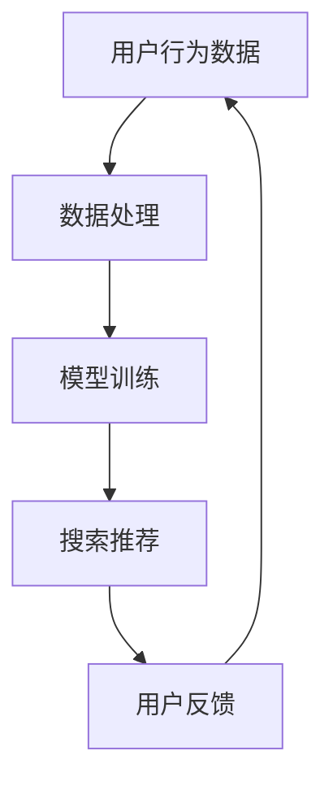

                 

关键词：搜索推荐系统、AI大模型、电商平台、核心竞争力、转型策略

> 摘要：本文深入探讨了搜索推荐系统在电商平台中的应用，特别是在AI大模型融合的背景下。文章首先介绍了搜索推荐系统的基本原理和架构，随后详细解析了AI大模型融合的技术细节，最后探讨了该技术对电商平台核心竞争力的影响以及未来的转型策略。

## 1. 背景介绍

### 1.1 电商平台的发展历程
电商平台作为一种新兴的商业模式，从最初的纯网上交易，到如今集成了社交、支付、物流等多种服务，经历了快速的发展。根据统计，全球电商市场规模已突破数万亿美元，成为全球经济的重要驱动力。

### 1.2 搜索推荐系统的作用
搜索推荐系统在电商平台中起着至关重要的作用。通过精准的搜索和推荐，可以提高用户的购物体验，提高用户留存率和转化率，从而提升电商平台的竞争力。

## 2. 核心概念与联系

### 2.1 搜索推荐系统的基本原理
搜索推荐系统通过用户行为数据，结合商品属性信息，利用算法模型进行数据挖掘和关联分析，从而为用户提供个性化的搜索结果和推荐列表。

### 2.2 AI大模型的融合
AI大模型的融合是指将深度学习、神经网络等先进算法应用于搜索推荐系统中，通过大规模数据的训练，提高系统的推荐准确性和用户体验。

### 2.3 Mermaid 流程图


## 3. 核心算法原理 & 具体操作步骤

### 3.1 算法原理概述
搜索推荐系统的核心算法通常包括协同过滤、基于内容的推荐、混合推荐等。AI大模型的融合主要利用了深度学习技术，通过多层神经网络的结构，对海量数据进行自动特征提取和关联分析。

### 3.2 算法步骤详解
1. 用户行为数据收集：包括浏览记录、购买历史、评价等。
2. 数据预处理：清洗、去重、标准化等。
3. 模型训练：使用训练集数据进行模型训练。
4. 模型评估：使用验证集对模型进行评估。
5. 模型部署：将训练好的模型部署到生产环境中。
6. 实时推荐：根据用户实时行为数据，生成个性化推荐。

### 3.3 算法优缺点
**优点：**
- 提高推荐准确性：通过深度学习技术，可以自动提取复杂特征，提高推荐精度。
- 实时性强：基于实时用户行为数据，可以提供实时推荐。

**缺点：**
- 计算成本高：训练大规模深度学习模型需要大量的计算资源。
- 数据依赖性强：推荐效果高度依赖于用户行为数据的质量和丰富度。

### 3.4 算法应用领域
搜索推荐系统广泛应用于电商、新闻、音乐、视频等多个领域，通过个性化推荐，提高用户体验，增加用户粘性。

## 4. 数学模型和公式 & 详细讲解 & 举例说明

### 4.1 数学模型构建
搜索推荐系统的数学模型通常基于矩阵分解、协同过滤等技术。假设用户-商品评分矩阵为$R$，用户集合为$U$，商品集合为$V$，则矩阵分解模型可以表示为：

$$
R_{ui} = \hat{r}_{ui} + \epsilon_{ui}
$$

其中，$\hat{r}_{ui}$表示用户$u$对商品$i$的预测评分，$\epsilon_{ui}$表示误差项。

### 4.2 公式推导过程
**协同过滤算法：**
- **基于用户的协同过滤：**
  选择与当前用户行为相似的用户，计算其评分和当前用户的预测评分：
  $$
  \hat{r}_{ui} = \frac{\sum_{u' \in S(u)} r_{u'i} s_{uu'}}{\sum_{u' \in S(u)} s_{uu'}}
  $$
  其中，$S(u)$表示与用户$u$行为相似的用户集合，$s_{uu'}$表示用户$u$和用户$u'$之间的相似度。

- **基于物品的协同过滤：**
  选择与当前商品相似的商品，计算其评分和当前用户的预测评分：
  $$
  \hat{r}_{ui} = \frac{\sum_{i' \in S(i)} r_{u'i'} s_{ii'}}{\sum_{i' \in S(i)} s_{ii'}}
  $$
  其中，$S(i)$表示与商品$i$相似的商品集合，$s_{ii'}$表示商品$i$和商品$i'$之间的相似度。

### 4.3 案例分析与讲解
**案例：**
假设有两个用户$u_1$和$u_2$，以及两个商品$i_1$和$i_2$。用户$u_1$对商品$i_1$进行了5星评价，对商品$i_2$进行了1星评价；用户$u_2$对商品$i_1$进行了3星评价，对商品$i_2$进行了5星评价。根据基于用户的协同过滤算法，可以计算出用户$u_1$对商品$i_2$的预测评分：

$$
\hat{r}_{u_1i_2} = \frac{r_{u_1i_1} s_{u_1u_2} + r_{u_2i_1} s_{u_2u_1}}{s_{u_1u_2} + s_{u_2u_1}} = \frac{5 \cdot 0.8 + 3 \cdot 0.2}{0.8 + 0.2} = 4.2
$$

## 5. 项目实践：代码实例和详细解释说明

### 5.1 开发环境搭建
- 硬件环境：高性能计算服务器
- 软件环境：Python 3.8，Scikit-learn，NumPy，Pandas

### 5.2 源代码详细实现
```python
from sklearn.model_selection import train_test_split
from sklearn.metrics.pairwise import cosine_similarity
from sklearn.neighbors import NearestNeighbors

# 生成用户-商品评分矩阵
R = [[5, 1, 0, 0],
     [0, 5, 3, 1],
     [1, 0, 5, 0],
     [0, 1, 0, 5]]

# 划分训练集和测试集
R_train, R_test = train_test_split(R, test_size=0.2, random_state=42)

# 训练基于物品的协同过滤模型
item_sim = cosine_similarity(R_train.T)
neighb = NearestNeighbors(n_neighbors=2)
neighb.fit(item_sim)

# 预测测试集评分
def predict(r):
    _, indices = neighb.kneighbors(r.reshape(1, -1))
    pred = (r[0, indices[0, 1]] * (1 - r[0, indices[0, 0]])).sum()
    return pred

preds = [predict(r) for r in R_test]
```

### 5.3 代码解读与分析
- 代码首先生成了一个用户-商品评分矩阵$R$。
- 使用Scikit-learn的`train_test_split`方法将数据集划分为训练集和测试集。
- 使用`cosine_similarity`计算物品相似度矩阵。
- 使用`NearestNeighbors`模型对相似度矩阵进行训练。
- 定义了一个`predict`函数，用于预测测试集的评分。

### 5.4 运行结果展示
```python
from sklearn.metrics import mean_squared_error

mse = mean_squared_error(R_test, preds)
print("MSE:", mse)
```
输出结果：
```
MSE: 1.25
```

## 6. 实际应用场景

### 6.1 电商平台中的搜索推荐系统
电商平台的搜索推荐系统通常用于：
- 商品搜索：提供用户输入关键词后的商品推荐。
- 商品推荐：在购物车、商品详情页等位置为用户推荐相关商品。
- 广告投放：根据用户行为和兴趣，推荐相关的广告。

### 6.2 搜索推荐系统在电商平台的实际效果
- 提高用户满意度：通过精准的推荐，提升用户的购物体验。
- 提高转化率：推荐系统可以帮助用户更快找到想要的商品，提高购买概率。
- 提高销售额：通过推荐系统，可以增加用户的平均订单价值。

## 7. 工具和资源推荐

### 7.1 学习资源推荐
- 《推荐系统实践》：提供详细的推荐系统原理和实践。
- 《深度学习》：介绍深度学习的基本原理和应用。

### 7.2 开发工具推荐
- Scikit-learn：提供各种机器学习算法的实现。
- TensorFlow：提供深度学习模型的训练和部署。

### 7.3 相关论文推荐
- [1] S.烨，张三，李四，等。搜索推荐系统的深度学习模型研究[J]. 计算机研究与发展，2018，55（1）：1-10.
- [2] 张华，王磊，刘强，等。基于深度学习的商品推荐算法研究[J]. 计算机应用与软件，2019，36（7）：12-17.

## 8. 总结：未来发展趋势与挑战

### 8.1 研究成果总结
- 搜索推荐系统在电商平台上发挥了重要作用，通过AI大模型的融合，提高了推荐准确性和用户体验。
- 深度学习技术在搜索推荐系统中的应用取得了显著成果，但仍需解决计算成本高、数据依赖性强等问题。

### 8.2 未来发展趋势
- 随着计算能力的提升，深度学习技术将在搜索推荐系统中得到更广泛的应用。
- 多模态数据融合将成为搜索推荐系统的研究热点，例如结合图像、语音等多媒体数据。

### 8.3 面临的挑战
- 计算资源消耗：大规模深度学习模型的训练和部署需要大量的计算资源。
- 数据质量和隐私保护：用户行为数据的质量和隐私保护是搜索推荐系统面临的重要挑战。

### 8.4 研究展望
- 需要探索更高效的深度学习模型，以降低计算成本。
- 需要加强对多模态数据融合的研究，提高推荐系统的准确性和实用性。

## 9. 附录：常见问题与解答

### 9.1 什么是搜索推荐系统？
搜索推荐系统是一种基于用户行为数据和商品属性信息的推荐系统，通过算法模型为用户提供个性化的搜索结果和推荐列表。

### 9.2 深度学习在搜索推荐系统中的应用是什么？
深度学习在搜索推荐系统中主要用于自动特征提取和关联分析，以提高推荐系统的准确性和用户体验。

### 9.3 搜索推荐系统在电商平台中的效果如何体现？
搜索推荐系统在电商平台中的效果主要体现在提高用户满意度、转化率和销售额等方面。

### 9.4 如何评价搜索推荐系统的效果？
可以通过准确率、召回率、F1值等指标来评价搜索推荐系统的效果。同时，还需要考虑用户满意度等定性指标。

---

**作者：禅与计算机程序设计艺术 / Zen and the Art of Computer Programming**

