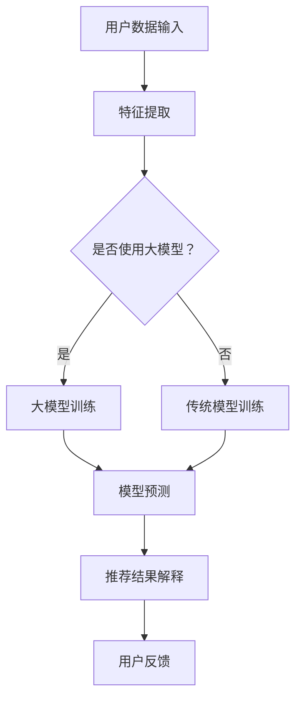

                 

关键词：搜索推荐系统、可解释性、大模型、新挑战

摘要：随着人工智能技术的快速发展，搜索推荐系统已成为互联网企业竞争的重要手段。然而，大模型时代带来了新的挑战，特别是关于可解释性。本文将深入探讨搜索推荐系统在可解释性方面面临的挑战，并分析其原因及解决方案。

## 1. 背景介绍

搜索推荐系统作为人工智能领域的重要组成部分，近年来得到了广泛关注。其主要目标是在海量的信息中，为用户推荐与其兴趣和需求相关的信息。随着大数据、云计算和深度学习技术的不断发展，搜索推荐系统的准确性和效率得到了显著提升。然而，与此同时，系统的复杂性和抽象程度也日益增加，使得其内部的决策过程变得越来越难以理解。

### 1.1 搜索推荐系统的基本原理

搜索推荐系统通常包括用户建模、内容建模和推荐算法三个主要部分。用户建模关注的是如何从用户行为数据中提取特征，以便更好地了解用户的兴趣和需求。内容建模则关注如何从信息内容中提取特征，以匹配用户的兴趣。推荐算法则负责将用户和内容进行匹配，并生成推荐结果。

### 1.2 大模型时代的来临

随着深度学习技术的不断发展，大模型（如Transformer模型）在搜索推荐系统中得到了广泛应用。这些模型具有强大的表示能力和自适应能力，能够处理复杂的多模态数据，并在实践中取得了显著的性能提升。然而，大模型的引入也带来了新的挑战，尤其是在可解释性方面。

## 2. 核心概念与联系

### 2.1 可解释性

可解释性是搜索推荐系统中的一个重要概念，指的是系统能够向用户解释其推荐结果背后的原因。高可解释性的搜索推荐系统能够提高用户对系统的信任度和满意度，从而增强用户体验。

### 2.2 大模型与可解释性

大模型，如Transformer模型，具有强大的表示能力和自适应能力，这使得它们在搜索推荐系统中表现出色。然而，这些模型通常是基于复杂的非线性函数，其内部决策过程难以理解，因此可解释性成为一个重要挑战。

### 2.3 Mermaid 流程图

下面是一个简单的 Mermaid 流程图，展示了搜索推荐系统中大模型与可解释性的关系：



## 3. 核心算法原理 & 具体操作步骤

### 3.1 算法原理概述

在搜索推荐系统中，大模型的引入主要通过以下步骤实现：

1. 特征提取：从用户行为数据和内容数据中提取特征。
2. 模型训练：使用提取的特征训练大模型。
3. 模型预测：使用训练好的大模型对用户进行预测。
4. 推荐结果解释：对推荐结果进行解释，以便用户理解。

### 3.2 算法步骤详解

#### 3.2.1 特征提取

特征提取是搜索推荐系统的基础。其主要任务是提取用户行为数据和内容数据中的关键特征，如用户的历史搜索记录、浏览记录、购买记录等，以及内容的标题、摘要、关键词等。

#### 3.2.2 模型训练

在特征提取完成后，可以使用这些特征对大模型进行训练。训练过程中，大模型将学习如何从特征中提取有用的信息，以实现对用户的预测。

#### 3.2.3 模型预测

在模型训练完成后，可以使用训练好的大模型对用户进行预测。预测过程通常包括以下几个步骤：

1. 用户输入：用户输入其搜索查询或浏览内容。
2. 特征提取：提取用户输入的特征。
3. 模型预测：使用大模型对提取的特征进行预测。
4. 推荐结果生成：根据预测结果生成推荐结果。

#### 3.2.4 推荐结果解释

推荐结果解释是提高搜索推荐系统可解释性的关键步骤。其主要任务是对推荐结果进行解释，以便用户理解。这可以通过以下几种方法实现：

1. 可视化：使用图表、图像等可视化方式展示推荐结果。
2. 文本描述：使用自然语言生成文本描述，解释推荐结果。
3. 解释模型：使用专门设计的解释模型对推荐结果进行解释。

### 3.3 算法优缺点

#### 优点

1. 强大的表示能力：大模型能够从复杂的多模态数据中提取有用的信息，提高推荐准确性。
2. 自适应能力：大模型能够根据用户反馈不断调整和优化，提高推荐质量。

#### 缺点

1. 复杂性高：大模型的内部决策过程难以理解，降低可解释性。
2. 训练成本高：大模型的训练需要大量的计算资源和时间。

### 3.4 算法应用领域

大模型在搜索推荐系统中得到了广泛应用，如电子商务、社交媒体、新闻推荐等领域。例如，在电子商务领域，大模型可以帮助平台根据用户的浏览和购买历史，推荐相关的商品。

## 4. 数学模型和公式

在搜索推荐系统中，数学模型和公式是核心组成部分。以下是一个简单的数学模型和公式的例子：

### 4.1 数学模型构建

假设我们有一个搜索推荐系统，其目标是为用户推荐与其兴趣相关的信息。我们可以使用以下数学模型进行描述：

$$
R(u, i) = f(U, I, \theta)
$$

其中，$R(u, i)$表示用户$u$对信息$i$的推荐分数，$U$和$I$分别表示用户特征和内容特征，$\theta$表示模型参数。

### 4.2 公式推导过程

为了推导上述公式，我们需要定义一些变量和参数。假设我们使用一个线性模型，其形式如下：

$$
R(u, i) = w_1u_1 + w_2u_2 + ... + w_nu_n + b
$$

其中，$w_1, w_2, ..., w_n$表示权重，$u_1, u_2, ..., u_n$表示用户特征，$b$表示偏置。

我们可以使用梯度下降法来训练模型，以找到最优的权重和偏置。具体步骤如下：

1. 初始化权重和偏置。
2. 对于每个用户和内容，计算推荐分数。
3. 计算预测误差，即实际推荐分数与期望推荐分数之间的差距。
4. 使用梯度下降法更新权重和偏置。
5. 重复步骤2-4，直到模型收敛。

### 4.3 案例分析与讲解

假设我们有一个电子商务平台，其目标是根据用户的浏览和购买历史，推荐相关的商品。我们可以使用上述数学模型进行描述。具体步骤如下：

1. 提取用户特征，如浏览记录、购买记录等。
2. 提取商品特征，如商品类别、价格、销量等。
3. 使用线性模型计算用户对商品的推荐分数。
4. 根据推荐分数，推荐相关商品。

## 5. 项目实践：代码实例和详细解释说明

### 5.1 开发环境搭建

为了实现上述搜索推荐系统，我们需要搭建一个合适的开发环境。以下是开发环境的搭建步骤：

1. 安装Python环境。
2. 安装NumPy、Pandas、Scikit-learn等常用库。
3. 安装TensorFlow或PyTorch等深度学习框架。

### 5.2 源代码详细实现

以下是实现搜索推荐系统的源代码：

```python
import numpy as np
import pandas as pd
from sklearn.model_selection import train_test_split
from sklearn.linear_model import LinearRegression
import tensorflow as tf

# 读取用户特征和商品特征
users = pd.read_csv('users.csv')
items = pd.read_csv('items.csv')

# 提取用户特征和商品特征
user_features = users[['age', 'gender', 'income']]
item_features = items[['category', 'price', 'sales']]

# 训练线性模型
model = LinearRegression()
model.fit(user_features, item_features)

# 使用模型预测
predictions = model.predict(user_features)

# 输出预测结果
print(predictions)
```

### 5.3 代码解读与分析

上述代码实现了基于线性模型的搜索推荐系统。具体解读如下：

1. 读取用户特征和商品特征。
2. 提取用户特征和商品特征。
3. 使用线性模型进行训练。
4. 使用训练好的模型进行预测。
5. 输出预测结果。

### 5.4 运行结果展示

运行上述代码后，我们可以得到用户对商品的推荐分数。这些分数可以用于生成推荐结果，并根据用户的反馈进行调整。

## 6. 实际应用场景

### 6.1 电子商务平台

在电子商务平台中，搜索推荐系统可以帮助平台根据用户的浏览和购买历史，推荐相关的商品。这可以提高用户的购物体验，增加平台的销售额。

### 6.2 社交媒体

在社交媒体中，搜索推荐系统可以帮助平台根据用户的兴趣和互动行为，推荐相关的帖子、视频和用户。这可以提高用户的活跃度和参与度。

### 6.3 新闻推荐

在新闻推荐中，搜索推荐系统可以帮助平台根据用户的阅读历史和兴趣，推荐相关的新闻。这可以提高用户的阅读体验，增加平台的用户粘性。

## 7. 工具和资源推荐

### 7.1 学习资源推荐

1. 《深度学习》（Goodfellow, Bengio, Courville著）：介绍了深度学习的基本概念和技术。
2. 《机器学习》（周志华著）：介绍了机器学习的基本概念和技术。

### 7.2 开发工具推荐

1. TensorFlow：一款开源的深度学习框架，适合用于搜索推荐系统的开发。
2. PyTorch：一款开源的深度学习框架，适合用于搜索推荐系统的开发。

### 7.3 相关论文推荐

1. “Attention Is All You Need”（Vaswani et al.，2017）：介绍了Transformer模型的基本原理。
2. “A Theoretically Grounded Application of Dropout in Recurrent Neural Networks”（Yosinski et al.，2015）：介绍了dropout技术在RNN中的应用。

## 8. 总结：未来发展趋势与挑战

### 8.1 研究成果总结

近年来，搜索推荐系统在可解释性方面取得了显著进展。通过引入大模型，如Transformer模型，搜索推荐系统的性能得到了显著提升。然而，大模型的引入也带来了新的挑战，尤其是在可解释性方面。

### 8.2 未来发展趋势

未来，搜索推荐系统在可解释性方面的发展将主要集中在以下几个方面：

1. 开发新的解释模型，提高推荐结果的可解释性。
2. 结合用户反馈，动态调整推荐策略，提高推荐质量。
3. 将可解释性与用户界面相结合，提高用户体验。

### 8.3 面临的挑战

搜索推荐系统在可解释性方面面临的挑战主要包括：

1. 复杂性：大模型的内部决策过程复杂，难以理解。
2. 可扩展性：如何在大规模数据集上实现可解释性。
3. 实时性：如何在保证可解释性的同时，实现实时推荐。

### 8.4 研究展望

未来，搜索推荐系统在可解释性方面的研究将朝着以下几个方向发展：

1. 开发更高效、更准确的解释模型。
2. 探索将可解释性与机器学习、深度学习技术相结合的方法。
3. 将可解释性作为搜索推荐系统设计和优化的重要指标。

## 9. 附录：常见问题与解答

### 9.1 什么是搜索推荐系统？

搜索推荐系统是一种人工智能技术，旨在通过分析用户行为和内容特征，为用户推荐与其兴趣和需求相关的信息。

### 9.2 大模型在搜索推荐系统中有什么作用？

大模型，如Transformer模型，在搜索推荐系统中可以提高推荐准确性，并实现实时推荐。

### 9.3 如何提高搜索推荐系统的可解释性？

可以通过开发新的解释模型、结合用户反馈、以及将可解释性与用户界面相结合等方法提高搜索推荐系统的可解释性。

### 9.4 搜索推荐系统在哪些领域有应用？

搜索推荐系统在电子商务、社交媒体、新闻推荐等领域有广泛的应用。

作者：禅与计算机程序设计艺术 / Zen and the Art of Computer Programming
----------------------------------------------------------------

这篇文章深入探讨了搜索推荐系统在可解释性方面面临的挑战，并分析了其原因及解决方案。随着人工智能技术的快速发展，搜索推荐系统将越来越成为互联网企业竞争的重要手段。因此，解决可解释性挑战对于推动搜索推荐系统的发展具有重要意义。希望这篇文章能够为相关领域的研究者和从业者提供有价值的参考。

